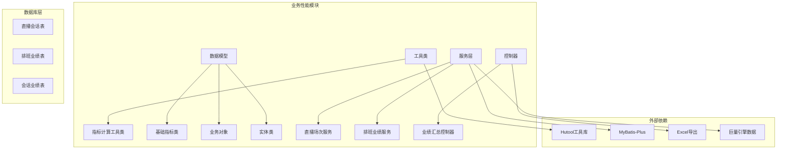
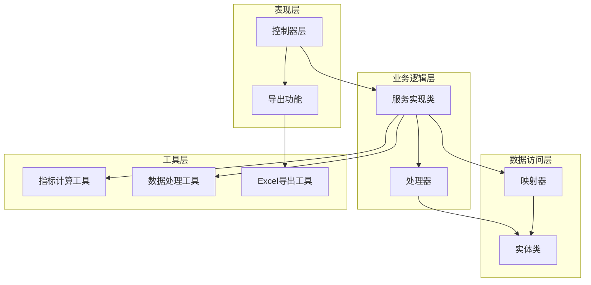
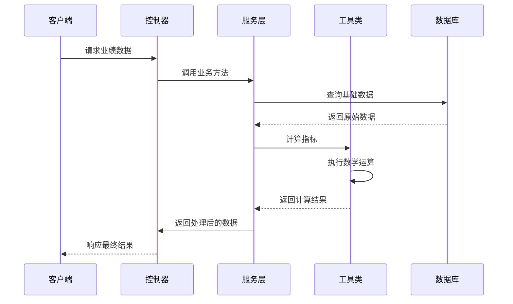
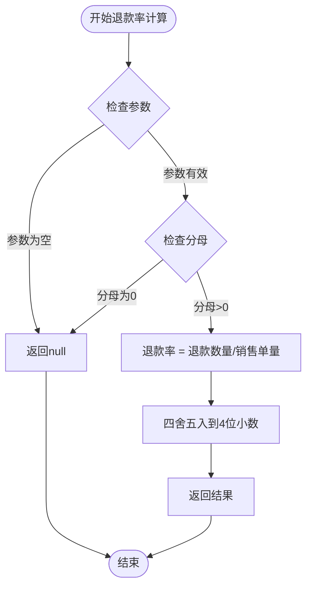
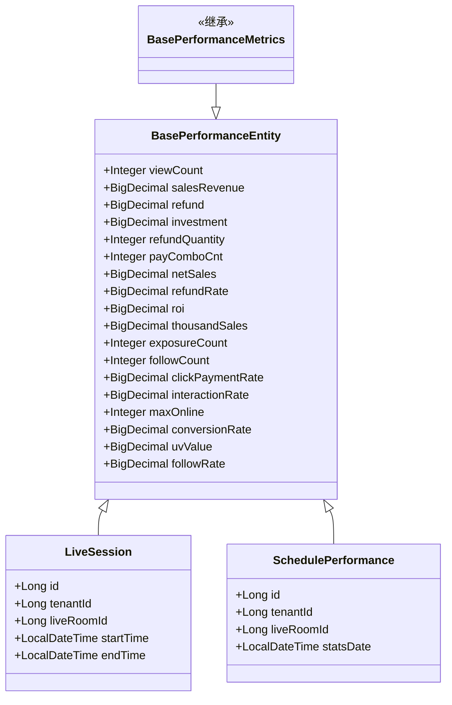
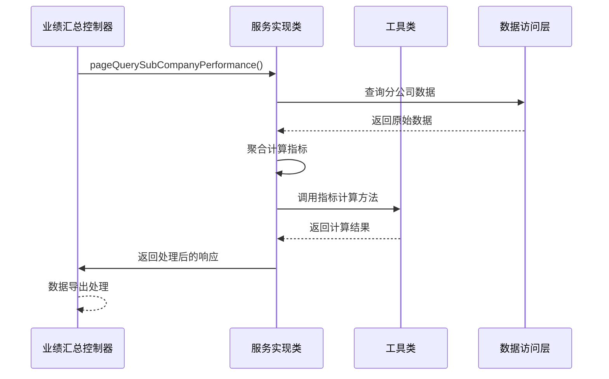
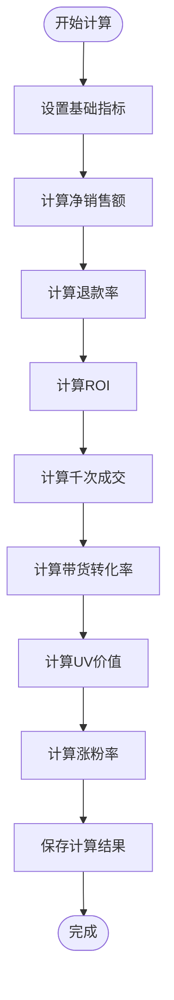
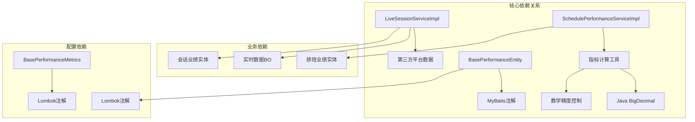

# 指标计算工具类

<cite>
**本文档引用的文件**
- [MetricsUtil.java](file://src/main/java/com/jiuyu/governance/business/performance/utils/MetricsUtil.java)
- [BasePerformanceMetrics.java](file://src/main/java/com/jiuyu/governance/business/performance/pojo/base/BasePerformanceMetrics.java)
- [BasePerformanceEntity.java](file://src/main/java/com/jiuyu/governance/business/performance/pojo/base/BasePerformanceEntity.java)
- [LiveSessionServiceImpl.java](file://src/main/java/com/jiuyu/governance/business/performance/service/impl/LiveSessionServiceImpl.java)
- [SchedulePerformanceServiceImpl.java](file://src/main/java/com/jiuyu/governance/business/performance/service/impl/SchedulePerformanceServiceImpl.java)
- [OceanEngineProcessBo.java](file://src/main/java/com/jiuyu/governance/business/performance/pojo/bo/OceanEngineProcessBo.java)
- [LiveSession.java](file://src/main/java/com/jiuyu/governance/business/performance/pojo/entity/LiveSession.java)
</cite>

## 更新摘要
**变更内容**
- 新增了完整的衍生指标计算体系，包括退款率、千次成交、带货转化率、UV价值、涨粉率等复合指标
- 增强了指标计算工具类的功能，支持更多业务场景的计算需求
- 优化了指标计算的自动化处理机制，通过setPerformanceCalculate方法统一计算衍生指标
- 扩展了BasePerformanceEntity类，增加了多个新的核心指标字段

## 目录
1. [简介](#简介)
2. [项目结构](#项目结构)
3. [核心组件](#核心组件)
4. [架构概览](#架构概览)
5. [详细组件分析](#详细组件分析)
6. [衍生指标计算体系](#衍生指标计算体系)
7. [依赖关系分析](#依赖关系分析)
8. [性能考虑](#性能考虑)
9. [故障排除指南](#故障排除指南)
10. [结论](#结论)

## 简介

本文档详细介绍了一个完整的指标计算工具类系统，该系统专注于直播电商和在线教育等领域的业绩指标计算。该系统提供了统一的指标计算框架，包括基础指标定义、工具类计算方法、数据处理逻辑和导出功能。

系统的核心价值在于：
- **统一性**：通过基类定义统一的10个核心业绩指标
- **可扩展性**：支持新增指标字段的灵活扩展
- **准确性**：提供精确的数学计算和异常处理
- **自动化**：通过setPerformanceCalculate方法自动计算衍生指标
- **完整性**：支持退款率、千次成交、UV价值等复合指标的计算

## 项目结构

该项目采用标准的Maven分层架构，重点关注业务性能模块的指标计算功能：



**图表来源**
- [LiveSessionServiceImpl.java:720-919](file://src/main/java/com/jiuyu/governance/business/performance/service/impl/LiveSessionServiceImpl.java#L720-L919)
- [SchedulePerformanceServiceImpl.java:635-654](file://src/main/java/com/jiuyu/governance/business/performance/service/impl/SchedulePerformanceServiceImpl.java#L635-L654)

## 核心组件

### 指标计算工具类 (MetricsUtil)

指标计算工具类是整个系统的核心，提供了31种常用的业务指标计算方法：

#### 主要功能特性：
- **基础数学运算**：加减乘除、取最大值、取最小值
- **业务专用指标**：ROI、退款率、转化率、点击率等
- **数据格式转换**：分转元、元转分、百分比转换
- **安全计算**：空值检查、除零保护、精度控制

#### 关键计算方法：
- `roi()`: 投资回报率计算，ROI = (收益-成本)/成本
- `refundRateByOrder()`: 退款率（按订单数）= 退款订单数/总订单数
- `conversionRate()`: 支付转化率 = 支付用户数/访问用户数
- `clickThroughRate()`: 点击率 = 点击次数/曝光次数
- `averageOrderValue()`: 客单价 = 总成交金额/支付用户数

**更新** 新增了空值安全的除法运算方法，包括：
- `divide(BigDecimal, BigDecimal)`: 空值安全的除法运算
- `divide(Number, Number)`: 空值安全的除法运算
- `divide(BigDecimal, BigDecimal, int)`: 空值安全的除法运算，支持自定义精度

**章节来源**
- [MetricsUtil.java:1-290](file://src/main/java/com/jiuyu/governance/business/performance/utils/MetricsUtil.java#L1-L290)

### 基础指标类 (BasePerformanceMetrics)

**更新** 基础指标类已简化为仅继承BasePerformanceEntity的空壳类：

基础指标类现在是一个简化的继承类，不再包含具体的指标字段定义：

```java
/**
 * 业绩核心指标基类（不含 ROI）
 * <p>
 * 统一管理 BO / Response / Export 层的10个核心业绩指标字段。
 * 新增业绩字段时只需在此基类添加一处，所有子类自动继承。
 * </p>
 * <p>
 * 子类若需要使用 Builder 模式，请用 {@code @SuperBuilder} 替代 {@code @Builder}。
 * </p>
 *
 * @author lj
 * @date 2026-04-02
 */
@Getter
@Setter
@SuperBuilder
@NoArgsConstructor
public class BasePerformanceMetrics extends BasePerformanceEntity {
}
```

这种简化设计消除了数据冗余，所有指标字段都统一由BasePerformanceEntity管理。

**章节来源**
- [BasePerformanceMetrics.java:1-31](file://src/main/java/com/jiuyu/governance/business/performance/pojo/base/BasePerformanceMetrics.java#L1-L31)

### 数据处理工具类 (DataUtil)

数据处理工具类提供了时间维度和数据格式化的辅助功能：

#### 主要功能：
- **时段计算**：计算今日、昨日、本周、上周、本月、上月的时间范围
- **数据转换**：将业务对象转换为响应格式
- **格式化输出**：直播时段格式化、会话统计格式化

## 架构概览

系统采用分层架构设计，确保职责分离和代码复用：



**图表来源**
- [LiveSessionServiceImpl.java:720-919](file://src/main/java/com/jiuyu/governance/business/performance/service/impl/LiveSessionServiceImpl.java#L720-L919)
- [SchedulePerformanceServiceImpl.java:635-654](file://src/main/java/com/jiuyu/governance/business/performance/service/impl/SchedulePerformanceServiceImpl.java#L635-L654)

## 详细组件分析

### 指标计算流程

系统通过以下流程实现指标计算：



**图表来源**
- [LiveSessionServiceImpl.java:720-919](file://src/main/java/com/jiuyu/governance/business/performance/service/impl/LiveSessionServiceImpl.java#L720-L919)
- [SchedulePerformanceServiceImpl.java:635-654](file://src/main/java/com/jiuyu/governance/business/performance/service/impl/SchedulePerformanceServiceImpl.java#L635-L654)

### 指标计算算法

#### ROI计算算法：
```mermaid
flowchart TD
Start([开始ROI计算]) --> CheckParams{检查参数}
CheckParams --> |参数为空| ReturnNull[返回null]
CheckParams --> |参数有效| CheckCost{检查成本}
CheckCost --> |成本为0| ReturnNull
CheckCost --> |成本>0| CalcROI[ROI = (收益-成本)/成本]
CalcROI --> Round[四舍五入到4位小数]
Round --> ReturnResult[返回结果]
ReturnNull --> End([结束])
ReturnResult --> End
```

**更新** ROI计算现在通过工具类方法实现，消除了数据库中的直接存储：

**图表来源**
- [MetricsUtil.java:49-54](file://src/main/java/com/jiuyu/governance/business/performance/utils/MetricsUtil.java#L49-L54)

#### 退款率计算算法：


**更新** 退款率计算现在使用空值安全的除法运算方法：

**图表来源**
- [MetricsUtil.java:137-139](file://src/main/java/com/jiuyu/governance/business/performance/utils/MetricsUtil.java#L137-L139)

### 数据模型关系



**更新** 基础指标类现在仅继承基础实体类，所有指标字段都由BasePerformanceEntity统一管理：

**图表来源**
- [BasePerformanceMetrics.java:29](file://src/main/java/com/jiuyu/governance/business/performance/pojo/base/BasePerformanceMetrics.java#L29)
- [BasePerformanceEntity.java:34-173](file://src/main/java/com/jiuyu/governance/business/performance/pojo/base/BasePerformanceEntity.java#L34-L173)

**章节来源**
- [BasePerformanceMetrics.java:1-31](file://src/main/java/com/jiuyu/governance/business/performance/pojo/base/BasePerformanceMetrics.java#L1-L31)
- [BasePerformanceEntity.java:1-223](file://src/main/java/com/jiuyu/governance/business/performance/pojo/base/BasePerformanceEntity.java#L1-L223)

### 服务层集成

#### 业绩汇总服务集成：


**更新** 指标计算现在通过BasePerformanceEntity的setPerformanceCalculate方法统一处理：

**图表来源**
- [SchedulePerformanceServiceImpl.java:635-654](file://src/main/java/com/jiuyu/governance/business/performance/service/impl/SchedulePerformanceServiceImpl.java#L635-L654)
- [LiveSessionServiceImpl.java:720-919](file://src/main/java/com/jiuyu/governance/business/performance/service/impl/LiveSessionServiceImpl.java#L720-L919)

**章节来源**
- [SchedulePerformanceServiceImpl.java:1-812](file://src/main/java/com/jiuyu/governance/business/performance/service/impl/SchedulePerformanceServiceImpl.java#L1-L812)
- [LiveSessionServiceImpl.java:1-1276](file://src/main/java/com/jiuyu/governance/business/performance/service/impl/LiveSessionServiceImpl.java#L1-L1276)

## 衍生指标计算体系

### 新增的核心衍生指标

系统现已支持以下复合指标的自动计算：

#### 1. 退款率 (Refund Rate)
- **计算公式**：退款率 = 退款数量 / 销售单量 × 100%
- **应用场景**：评估商品质量和客户服务效果
- **计算方法**：`MetricsUtil.divide(refundQuantity, payComboCnt)`

#### 2. 千次成交 (Thousand Sales)
- **计算公式**：千次成交 = 销售额 / 观看人数 × 1000
- **应用场景**：衡量直播带货效率
- **计算方法**：`MetricsUtil.multiply(MetricsUtil.divide(salesRevenue, viewCount), BigDecimal.valueOf(1000))`

#### 3. 带货转化率 (Conversion Rate)
- **计算公式**：带货转化率 = 成交单量 / 观看人数 × 100%
- **应用场景**：评估主播带货能力
- **计算方法**：`MetricsUtil.divide(payComboCnt, viewCount)`

#### 4. UV价值 (UV Value)
- **计算公式**：UV价值 = 销售额 / 观看人数
- **应用场景**：衡量每个观众的平均消费价值
- **计算方法**：`MetricsUtil.divide(salesRevenue, viewCount)`

#### 5. 涨粉率 (Follow Rate)
- **计算公式**：涨粉率 = 涨粉人数 / 观看人数 × 100%
- **应用场景**：评估直播对粉丝增长的促进作用
- **计算方法**：`MetricsUtil.divide(followCount, viewCount)`

#### 6. 点击-成交率 (Click-Payment Rate)
- **计算公式**：点击-成交率 = 区间订单量 / 区间点击量
- **应用场景**：衡量广告点击到购买的转化效率
- **计算方法**：直接使用OceanEngineProcessBo中的clickPaymentRate字段

#### 7. 互动率 (Interaction Rate)
- **计算公式**：互动率 = 区间互动次数 / 区间观看人数
- **应用场景**：评估直播内容的吸引力和观众参与度
- **计算方法**：直接使用OceanEngineProcessBo中的interactionRate字段

### 自动化计算机制

系统通过`setPerformanceCalculate`方法实现了衍生指标的自动化计算：



**图表来源**
- [BasePerformanceEntity.java:208-221](file://src/main/java/com/jiuyu/governance/business/performance/pojo/base/BasePerformanceEntity.java#L208-L221)

**章节来源**
- [BasePerformanceEntity.java:72-173](file://src/main/java/com/jiuyu/governance/business/performance/pojo/base/BasePerformanceEntity.java#L72-L173)
- [LiveSessionServiceImpl.java:807-816](file://src/main/java/com/jiuyu/governance/business/performance/service/impl/LiveSessionServiceImpl.java#L807-L816)

## 依赖关系分析

系统采用松耦合的设计模式，通过接口和抽象类实现模块间的解耦：



**更新** 基础指标类现在仅依赖基础实体类，减少了字段定义的复杂性：

**图表来源**
- [MetricsUtil.java:3-8](file://src/main/java/com/jiuyu/governance/business/performance/utils/MetricsUtil.java#L3-L8)
- [BasePerformanceEntity.java:3-10](file://src/main/java/com/jiuyu/governance/business/performance/pojo/base/BasePerformanceEntity.java#L3-L10)

### 数据库设计依赖

系统遵循统一的数据库设计规范：

| 字段名 | 类型 | 描述 | 计算公式 |
|--------|------|------|----------|
| view_count | INTEGER | 总观看人次 | 直接统计 |
| sales_revenue | DECIMAL | 销售额（元） | 直接统计 |
| refund | DECIMAL | 退款（元） | 直接统计 |
| investment | DECIMAL | 投放（元） | 直接统计 |
| refund_quantity | INTEGER | 退款数量 | 直接统计 |
| pay_combo_cnt | INTEGER | 销售单量 | 直接统计 |
| net_sales | DECIMAL | 净销售额 | sales_revenue - refund |
| refund_rate | DECIMAL | 退款率 | refund_quantity / pay_combo_cnt × 100 |
| roi | DECIMAL | 投资回报率 | sales_revenue / investment × 100 |
| thousand_sales | DECIMAL | 千次成交 | sales_revenue / view_count × 1000 |
| exposure_count | INTEGER | 曝光次数 | 直接统计 |
| follow_count | INTEGER | 涨粉人数 | 直接统计 |
| click_payment_rate | DECIMAL | 点击-成交率 | 第三方平台数据 |
| interaction_rate | DECIMAL | 互动率 | 第三方平台数据 |
| max_online | INTEGER | 最高在线 | 直接统计 |
| conversion_rate | DECIMAL | 带货转化率 | pay_combo_cnt / view_count × 100 |
| uv_value | DECIMAL | UV价值 | sales_revenue / view_count |
| follow_rate | DECIMAL | 涨粉率 | follow_count / view_count × 100 |

**更新** 新增的衍生指标字段均通过setPerformanceCalculate方法自动计算：

**章节来源**
- [BasePerformanceEntity.java:72-173](file://src/main/java/com/jiuyu/governance/business/performance/pojo/base/BasePerformanceEntity.java#L72-L173)

## 性能考虑

### 计算性能优化

1. **BigDecimal精度控制**：默认保留4位小数，平衡精度和性能
2. **空值快速返回**：避免不必要的计算开销
3. **批量处理**：支持列表级别的指标计算
4. **缓存策略**：重复计算的结果可以缓存复用
5. **自动化计算**：通过setPerformanceCalculate方法统一处理，减少重复计算

### 内存使用优化

1. **流式处理**：大数据集采用Stream API进行内存友好的处理
2. **延迟计算**：只在需要时才执行复杂的数学运算
3. **对象复用**：减少临时对象的创建
4. **字段懒加载**：衍生指标仅在需要时计算

### 并发安全性

1. **线程安全**：工具类方法均为静态，无状态设计
2. **不可变对象**：返回的BigDecimal对象保持不可变性
3. **原子操作**：关键计算步骤保证原子性
4. **并发控制**：通过Lombok注解确保对象创建的线程安全

## 故障排除指南

### 常见问题及解决方案

#### 1. 计算结果为null
**可能原因**：
- 输入参数为null
- 除数为0
- 数据库查询结果为空
- 指标字段缺失

**解决方法**：
```java
// 使用空值检查
if (value == null) {
    return defaultValue;
}
```

#### 2. 精度丢失问题
**解决方法**：
- 使用BigDecimal进行高精度计算
- 设置合适的RoundingMode
- 在除法运算中指定精度

#### 3. 性能问题
**优化建议**：
- 对于大批量数据，考虑分批处理
- 使用索引优化数据库查询
- 缓存频繁使用的计算结果
- 利用setPerformanceCalculate方法避免重复计算

#### 4. 指标计算错误
**排查步骤**：
1. 检查基础指标数据是否正确
2. 验证setPerformanceCalculate方法调用
3. 确认指标计算顺序
4. 检查数据类型转换

**更新** 新增空值安全的数学运算方法，提高了计算的安全性和可靠性：

**章节来源**
- [MetricsUtil.java:197-213](file://src/main/java/com/jiuyu/governance/business/performance/utils/MetricsUtil.java#L197-L213)
- [LiveSessionServiceImpl.java:720-919](file://src/main/java/com/jiuyu/governance/business/performance/service/impl/LiveSessionServiceImpl.java#L720-L919)

### 调试技巧

1. **日志记录**：在关键计算节点添加详细的日志
2. **单元测试**：为每个指标计算方法编写测试用例
3. **边界测试**：测试null值、零值、极大值等边界情况
4. **性能监控**：监控计算耗时和内存使用情况
5. **指标验证**：定期验证衍生指标的计算准确性

## 结论

该指标计算工具类系统通过以下特点实现了高效的业务指标计算：

### 核心优势
1. **统一标准**：通过基类定义统一的指标字段，确保数据一致性
2. **灵活扩展**：支持新增指标字段，无需修改现有代码
3. **精确计算**：提供高精度的数学运算和完善的异常处理
4. **自动化处理**：通过setPerformanceCalculate方法统一计算衍生指标
5. **全面覆盖**：支持退款率、千次成交、UV价值等复合指标的计算
6. **易于维护**：清晰的分层架构和模块化设计

### 应用价值
- **提升开发效率**：标准化的指标计算方法减少重复开发
- **保证数据质量**：统一的计算逻辑确保指标的一致性
- **支持业务扩展**：灵活的架构支持新业务场景的快速接入
- **降低维护成本**：清晰的代码结构便于后期维护和升级
- **增强分析能力**：完整的衍生指标体系提供更深入的业务洞察

**更新** 最新的变更进一步提升了系统的可靠性和可维护性：

- **简化设计**：BasePerformanceMetrics类的简化消除了冗余代码
- **增强安全**：新增的空值安全数学运算方法提高了系统的健壮性
- **动态计算**：ROI等指标的动态计算消除了数据冗余
- **自动化处理**：setPerformanceCalculate方法实现了衍生指标的自动计算
- **完整指标体系**：新增的多个核心指标字段丰富了分析维度

该系统为直播电商和在线教育等领域的业绩分析提供了坚实的技术基础，能够满足复杂业务场景下的指标计算需求，特别是新增的复合指标计算能力为业务决策提供了更全面的数据支持。