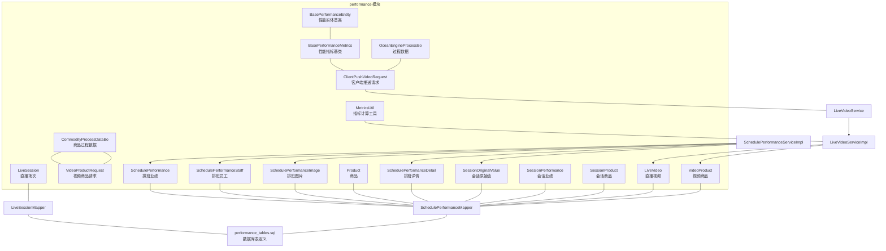
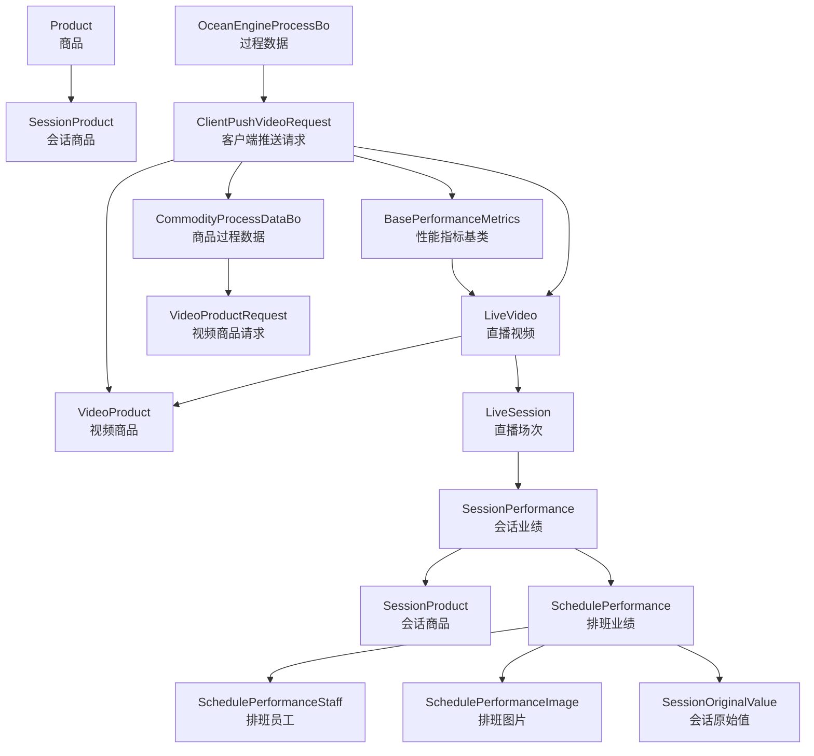
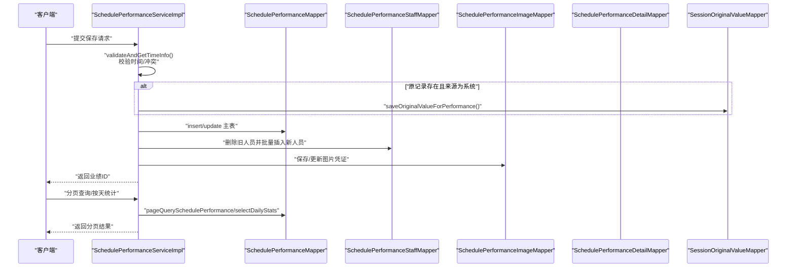
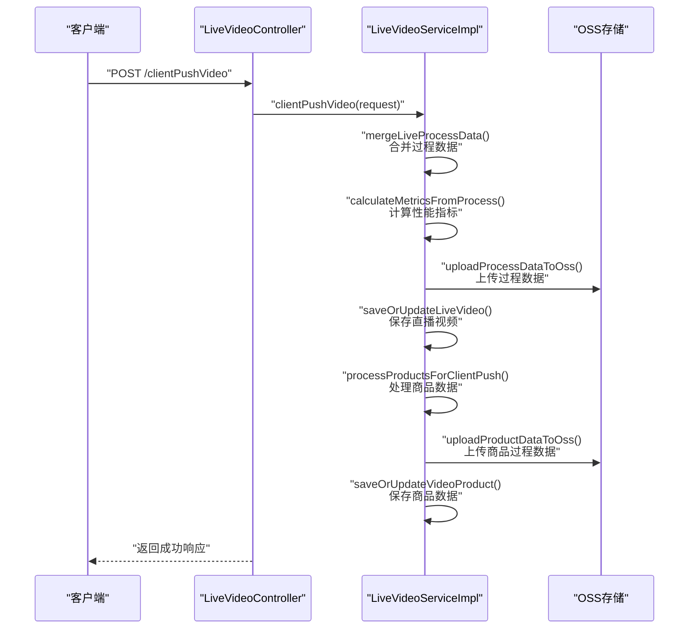

# 直播业绩实体类

<cite>
**本文引用的文件**
- [LiveSession.java](file://src/main/java/com/jiuyu/governance/business/performance/pojo/entity/LiveSession.java)
- [SchedulePerformance.java](file://src/main/java/com/jiuyu/governance/business/performance/pojo/entity/SchedulePerformance.java)
- [SchedulePerformanceDetail.java](file://src/main/java/com/jiuyu/governance/business/performance/pojo/entity/SchedulePerformanceDetail.java)
- [SchedulePerformanceImage.java](file://src/main/java/com/jiuyu/governance/business/performance/pojo/entity/SchedulePerformanceImage.java)
- [SchedulePerformanceStaff.java](file://src/main/java/com/jiuyu/governance/business/performance/pojo/entity/SchedulePerformanceStaff.java)
- [Product.java](file://src/main/java/com/jiuyu/governance/business/performance/pojo/entity/Product.java)
- [LiveVideo.java](file://src/main/java/com/jiuyu/governance/business/performance/pojo/entity/LiveVideo.java)
- [SessionOriginalValue.java](file://src/main/java/com/jiuyu/governance/business/performance/pojo/entity/SessionOriginalValue.java)
- [SessionPerformance.java](file://src/main/java/com/jiuyu/governance/business/performance/pojo/entity/SessionPerformance.java)
- [SessionProduct.java](file://src/main/java/com/jiuyu/governance/business/performance/pojo/entity/SessionProduct.java)
- [VideoProduct.java](file://src/main/java/com/jiuyu/governance/business/performance/pojo/entity/VideoProduct.java)
- [ClientPushVideoRequest.java](file://src/main/java/com/jiuyu/governance/business/performance/pojo/request/ClientPushVideoRequest.java)
- [BasePerformanceMetrics.java](file://src/main/java/com/jiuyu/governance/business/performance/pojo/base/BasePerformanceMetrics.java)
- [BasePerformanceEntity.java](file://src/main/java/com/jiuyu/governance/business/performance/pojo/base/BasePerformanceEntity.java)
- [OceanEngineProcessBo.java](file://src/main/java/com/jiuyu/governance/business/performance/pojo/bo/OceanEngineProcessBo.java)
- [CommodityProcessDataBo.java](file://src/main/java/com/jiuyu/governance/business/performance/pojo/bo/CommodityProcessDataBo.java)
- [VideoProductRequest.java](file://src/main/java/com/jiuyu/governance/business/performance/pojo/request/VideoProductRequest.java)
- [LiveVideoController.java](file://src/main/java/com/jiuyu/governance/business/performance/controller/LiveVideoController.java)
- [LiveVideoService.java](file://src/main/java/com/jiuyu/governance/business/performance/service/LiveVideoService.java)
- [LiveVideoServiceImpl.java](file://src/main/java/com/jiuyu/governance/business/performance/service/impl/LiveVideoServiceImpl.java)
- [MetricsUtil.java](file://src/main/java/com/jiuyu/governance/business/performance/utils/MetricsUtil.java)
- [LiveSessionMapper.java](file://src/main/java/com/jiuyu/governance/business/performance/mapper/LiveSessionMapper.java)
- [SchedulePerformanceMapper.java](file://src/main/java/com/jiuyu/governance/business/performance/mapper/SchedulePerformanceMapper.java)
- [SchedulePerformanceServiceImpl.java](file://src/main/java/com/jiuyu/governance/business/performance/service/impl/SchedulePerformanceServiceImpl.java)
- [performance_tables.sql](file://src/main/resources/sql/performance_tables.sql)
</cite>

## 更新摘要
**所做更改**
- **重构**：BasePerformanceMetricsWithRoi类已被删除，统一到BasePerformanceMetrics中，简化了性能指标基类设计
- **新增**：CommodityProcessDataBo实体类，用于商品过程数据的存储和处理
- **增强**：ClientPushVideoRequest类已存在并继承BasePerformanceMetrics，支持客户端推送功能
- **改进**：LiveVideo实体类增强了对客户端推送的支持，包含更多性能指标字段
- **扩展**：VideoProductRequest类新增了CommodityProcessDataBo的引用，支持商品过程数据的详细处理

## 目录
1. [简介](#简介)
2. [项目结构](#项目结构)
3. [核心组件](#核心组件)
4. [架构概览](#架构概览)
5. [详细组件分析](#详细组件分析)
6. [客户端推送功能](#客户端推送功能)
7. [性能指标计算](#性能指标计算)
8. [依赖分析](#依赖分析)
9. [性能考虑](#性能考虑)
10. [故障排查指南](#故障排查指南)
11. [结论](#结论)
12. [附录](#附录)

## 简介
本文件聚焦直播电商场景下的"直播业绩"实体类体系，系统性梳理并解释以下实体类的设计与职责：LiveRoom（直播间）、LiveSession（直播场次）、SchedulePerformance（排班业绩）、SchedulePerformanceDetail（排班详情）、SchedulePerformanceImage（排班图片）、SchedulePerformanceStaff（排班员工）、Product（商品）、LiveVideo（直播视频）、SessionOriginalValue（会话原始值）、SessionPerformance（会话业绩）、SessionProduct（会话商品）、VideoProduct（视频商品）。**经过重构**，性能指标基类已统一到BasePerformanceMetrics中，**新增**了商品过程数据实体类CommodityProcessDataBo，以及增强的客户端推送功能支持。

文档将从数据模型、业务逻辑、实体关系、数据流转、统计分析应用等方面进行深入说明，并提供可视化图示帮助理解。

## 项目结构
直播业绩相关代码位于 business/performance 模块，包含实体类、Mapper 接口、Service 实现以及数据库表定义脚本。**经过重构**，性能指标基类已统一设计，**新增**了商品过程数据处理相关的实体类和请求类。核心实体类均采用 MyBatis-Plus 注解映射数据库表，遵循统一的字段命名与逻辑删除规范。



**图表来源**
- [LiveSession.java:1-173](file://src/main/java/com/jiuyu/governance/business/performance/pojo/entity/LiveSession.java#L1-L173)
- [SchedulePerformance.java:1-160](file://src/main/java/com/jiuyu/governance/business/performance/pojo/entity/SchedulePerformance.java#L1-L160)
- [SchedulePerformanceDetail.java:1-118](file://src/main/java/com/jiuyu/governance/business/performance/pojo/entity/SchedulePerformanceDetail.java#L1-L118)
- [SchedulePerformanceImage.java:1-99](file://src/main/java/com/jiuyu/governance/business/performance/pojo/entity/SchedulePerformanceImage.java#L1-L99)
- [SchedulePerformanceStaff.java:1-93](file://src/main/java/com/jiuyu/governance/business/performance/pojo/entity/SchedulePerformanceStaff.java#L1-L93)
- [Product.java:1-81](file://src/main/java/com/jiuyu/governance/business/performance/pojo/entity/Product.java#L1-L81)
- [LiveVideo.java:1-124](file://src/main/java/com/jiuyu/governance/business/performance/pojo/entity/LiveVideo.java#L1-L124)
- [SessionOriginalValue.java:1-113](file://src/main/java/com/jiuyu/governance/business/performance/pojo/entity/SessionOriginalValue.java#L1-L113)
- [SessionPerformance.java:1-167](file://src/main/java/com/jiuyu/governance/business/performance/pojo/entity/SessionPerformance.java#L1-L167)
- [SessionProduct.java:1-154](file://src/main/java/com/jiuyu/governance/business/performance/pojo/entity/SessionProduct.java#L1-L154)
- [VideoProduct.java:1-214](file://src/main/java/com/jiuyu/governance/business/performance/pojo/entity/VideoProduct.java#L1-L214)
- [ClientPushVideoRequest.java:1-84](file://src/main/java/com/jiuyu/governance/business/performance/pojo/request/ClientPushVideoRequest.java#L1-L84)
- [BasePerformanceMetrics.java:1-83](file://src/main/java/com/jiuyu/governance/business/performance/pojo/base/BasePerformanceMetrics.java#L1-L83)
- [BasePerformanceEntity.java:1-95](file://src/main/java/com/jiuyu/governance/business/performance/pojo/base/BasePerformanceEntity.java#L1-L95)
- [OceanEngineProcessBo.java:1-72](file://src/main/java/com/jiuyu/governance/business/performance/pojo/bo/OceanEngineProcessBo.java#L1-L72)
- [CommodityProcessDataBo.java:1-34](file://src/main/java/com/jiuyu/governance/business/performance/pojo/bo/CommodityProcessDataBo.java#L1-L34)
- [VideoProductRequest.java:1-164](file://src/main/java/com/jiuyu/governance/business/performance/pojo/request/VideoProductRequest.java#L1-L164)
- [MetricsUtil.java:1-280](file://src/main/java/com/jiuyu/governance/business/performance/utils/MetricsUtil.java#L1-L280)
- [LiveSessionMapper.java:1-16](file://src/main/java/com/jiuyu/governance/business/performance/mapper/LiveSessionMapper.java#L1-L16)
- [SchedulePerformanceMapper.java:1-260](file://src/main/java/com/jiuyu/governance/business/performance/mapper/SchedulePerformanceMapper.java#L1-L260)
- [SchedulePerformanceServiceImpl.java:1-805](file://src/main/java/com/jiuyu/governance/business/performance/service/impl/SchedulePerformanceServiceImpl.java#L1-L805)
- [LiveVideoService.java:1-94](file://src/main/java/com/jiuyu/governance/business/performance/service/LiveVideoService.java#L1-L94)
- [LiveVideoServiceImpl.java:1-766](file://src/main/java/com/jiuyu/governance/business/performance/service/impl/LiveVideoServiceImpl.java#L1-L766)
- [performance_tables.sql:1-311](file://src/main/resources/sql/performance_tables.sql#L1-L311)

**章节来源**
- [LiveSession.java:1-173](file://src/main/java/com/jiuyu/governance/business/performance/pojo/entity/LiveSession.java#L1-L173)
- [SchedulePerformance.java:1-160](file://src/main/java/com/jiuyu/governance/business/performance/pojo/entity/SchedulePerformance.java#L1-L160)
- [SchedulePerformanceDetail.java:1-118](file://src/main/java/com/jiuyu/governance/business/performance/pojo/entity/SchedulePerformanceDetail.java#L1-L118)
- [SchedulePerformanceImage.java:1-99](file://src/main/java/com/jiuyu/governance/business/performance/pojo/entity/SchedulePerformanceImage.java#L1-L99)
- [SchedulePerformanceStaff.java:1-93](file://src/main/java/com/jiuyu/governance/business/performance/pojo/entity/SchedulePerformanceStaff.java#L1-L93)
- [Product.java:1-81](file://src/main/java/com/jiuyu/governance/business/performance/pojo/entity/Product.java#L1-L81)
- [LiveVideo.java:1-124](file://src/main/java/com/jiuyu/governance/business/performance/pojo/entity/LiveVideo.java#L1-L124)
- [SessionOriginalValue.java:1-113](file://src/main/java/com/jiuyu/governance/business/performance/pojo/entity/SessionOriginalValue.java#L1-L113)
- [SessionPerformance.java:1-167](file://src/main/java/com/jiuyu/governance/business/performance/pojo/entity/SessionPerformance.java#L1-L167)
- [SessionProduct.java:1-154](file://src/main/java/com/jiuyu/governance/business/performance/pojo/entity/SessionProduct.java#L1-L154)
- [VideoProduct.java:1-214](file://src/main/java/com/jiuyu/governance/business/performance/pojo/entity/VideoProduct.java#L1-L214)
- [ClientPushVideoRequest.java:1-84](file://src/main/java/com/jiuyu/governance/business/performance/pojo/request/ClientPushVideoRequest.java#L1-L84)
- [BasePerformanceMetrics.java:1-83](file://src/main/java/com/jiuyu/governance/business/performance/pojo/base/BasePerformanceMetrics.java#L1-L83)
- [BasePerformanceEntity.java:1-95](file://src/main/java/com/jiuyu/governance/business/performance/pojo/base/BasePerformanceEntity.java#L1-L95)
- [OceanEngineProcessBo.java:1-72](file://src/main/java/com/jiuyu/governance/business/performance/pojo/bo/OceanEngineProcessBo.java#L1-L72)
- [CommodityProcessDataBo.java:1-34](file://src/main/java/com/jiuyu/governance/business/performance/pojo/bo/CommodityProcessDataBo.java#L1-L34)
- [VideoProductRequest.java:1-164](file://src/main/java/com/jiuyu/governance/business/performance/pojo/request/VideoProductRequest.java#L1-L164)
- [MetricsUtil.java:1-280](file://src/main/java/com/jiuyu/governance/business/performance/utils/MetricsUtil.java#L1-L280)
- [LiveSessionMapper.java:1-16](file://src/main/java/com/jiuyu/governance/business/performance/mapper/LiveSessionMapper.java#L1-L16)
- [SchedulePerformanceMapper.java:1-260](file://src/main/java/com/jiuyu/governance/business/performance/mapper/SchedulePerformanceMapper.java#L1-L260)
- [SchedulePerformanceServiceImpl.java:1-805](file://src/main/java/com/jiuyu/governance/business/performance/service/impl/SchedulePerformanceServiceImpl.java#L1-L805)
- [LiveVideoService.java:1-94](file://src/main/java/com/jiuyu/governance/business/performance/service/LiveVideoService.java#L1-L94)
- [LiveVideoServiceImpl.java:1-766](file://src/main/java/com/jiuyu/governance/business/performance/service/impl/LiveVideoServiceImpl.java#L1-L766)
- [performance_tables.sql:1-311](file://src/main/resources/sql/performance_tables.sql#L1-L311)

## 核心组件
本节对各实体类进行逐项说明，包括关键字段、业务含义、典型用途及与其他实体的关系。

- LiveSession（直播场次）
  - 作用：存储一场直播的汇总指标，如时长、场观、销售额、退款、投放、净销售额、ROI、投放产出等；支持系统推送与手动录入两种数据来源。
  - 关键字段：id（主键，雪花ID）、tenantId、liveRoomId、batchNumber、startTime、endTime、duration、viewCount、salesRevenue、refund、investment、netSales、roi、adOutput、ossUrl、companyId、deptId、teamId、source、version、createDate、updateDate、createBy、updateBy、isDeleted。
  - 典型用途：作为直播视频与排班业绩的聚合基线，支撑按场次维度的统计与分析。

- SchedulePerformance（排班业绩）
  - 作用：以排班为单位的直播业绩汇总，支持与排班计划关联或手动录入；包含场观、销售额、退款、投放、净销售额、ROI、投放产出等指标。
  - 关键字段：id（主键，雪花ID）、tenantId、scheduleId、liveRoomId、startTime、endTime、secUid、source、viewCount、salesRevenue、refund、investment、netSales、roi、adOutput、companyId、deptId、teamId、createDate、updateDate、createBy、updateBy、isDeleted。
  - 典型用途：用于排班维度的业绩统计、趋势分析与人员绩效归因。

- SchedulePerformanceDetail（排班详情）
  - 作用：记录排班业绩的明细拆分，按场次维度拆分场观、销售额、退款、投放、净销售额、ROI、投放产出等。
  - 关键字段：id（主键，雪花ID）、tenantId、schedulePerformanceId、sessionId、startTime、endTime、viewCount、salesRevenue、refund、investment、netSales、roi、adOutput、createDate、updateDate、isDeleted。
  - 典型用途：支撑排班与具体场次之间的成本与收益分摊计算。

- SchedulePerformanceImage（排班图片）
  - 作用：存储排班业绩的凭证图片URL，分别对应场观、销售额、退款、投放、净销售额、ROI等指标。
  - 关键字段：id（主键，与排班业绩一对一）、tenantId、viewCountImageUrl、salesRevenueImageUrl、refundImageUrl、investmentImageUrl、netSalesImageUrl、roiImageUrl、createDate、updateDate、createBy、updateBy、isDeleted。
  - 典型用途：为业绩数据提供可视化佐证，便于审核与追溯。

- SchedulePerformanceStaff（排班员工）
  - 作用：记录参与某次排班的所有员工及其岗位信息，支持冗余字段（员工名、岗位名）便于展示。
  - 关键字段：id（主键，雪花ID）、tenantId、schedulePerformanceId、employeeId、employeeName、positionId、positionName、createDate、updateDate、createBy、updateBy、isDeleted。
  - 典型用途：支撑按人员维度的业绩统计与绩效归因。

- Product（商品）
  - 作用：商品基础信息表，包含商品ID、名称、图片URL等。
  - 关键字段：id（主键，雪花ID）、tenantId、productId、name、imageUri、createDate、updateDate、createBy、updateBy、isDeleted。
  - 典型用途：与场次商品、视频商品建立关联，支撑商品维度的销售分析。

- LiveVideo（直播视频）
  - 作用：存储直播视频数据，**经过重构**增强了对客户端推送功能的支持，包含视频ID、批次号、开始/结束时间、场观、销售额、退款、投放、平台类型、处理状态、过程数据OSS存储等。
  - 关键字段：id（主键，雪花ID）、tenantId、batchNumber、videoId、hasPerformance、videoOssUrl、startTime、endTime、secUid、platform、processStatus、processTime、failReason、dataUpdateTime、createDate、updateDate、isDeleted。
  - 典型用途：作为直播视频数据的载体，支持客户端推送的实时过程数据处理与存储。

- SessionOriginalValue（会话原始值）
  - 作用：记录业绩数据首次修改前的原始值，支持多来源类型（live_session、session_performance、schedule_performance），用于前端对比与修改标记。
  - 关键字段：id（主键，雪花ID）、tenantId、sourceId、sourceType（枚举）、source（数据来源）、viewCount、salesRevenue、refund、investment、netSales、roi、adOutput、createDate、createBy。
  - 典型用途：在手动修改时保留原始值，便于审计与对比。

- SessionPerformance（会话业绩）
  - 作用：以自然日为维度的场次业绩数据，包含统计日期、开始/结束时间、场观、销售额、退款、投放、净销售额、ROI、投放产出等。
  - 关键字段：id（主键，雪花ID）、tenantId、sessionId、statsDate、startTime、endTime、secUid、source、viewCount、salesRevenue、refund、investment、netSales、roi、adOutput、companyId、deptId、liveRoomId、teamId、createDate、updateDate、createBy、updateBy、isDeleted。
  - 典型用途：支撑按日维度的业绩趋势分析与报表生成。

- SessionProduct（会话商品）
  - 作用：记录场次与商品的关联关系，包含销量、单价、销售额、曝光点击率、曝光成交率、GPM、退单量、退款额、退款率、点击付款率等指标。
  - 关键字段：id（主键，雪花ID）、tenantId、sessionId、productId、quantity、price、salesAmount、exposureClickRate、exposureConversionRate、gpm、refundQuantity、refundAmount、refundRate、clickPaymentRate、companyId、deptId、teamId、createDate、updateDate、createBy、updateBy、isDeleted。
  - 典型用途：支撑商品维度的销售分析与转化漏斗分析。

- VideoProduct（视频商品）
  - 作用：存储视频与商品的关联数据，**经过重构**增强了对客户端推送的详细商品过程数据支持，包含商品标题、图片URL、到手价、上架/下架时间、讲解次数、曝光/点击人数、转化率、GPM、成交金额、订单数、预售金额、退款金额、退款率等。
  - 关键字段：id（主键，雪花ID）、tenantId、videoId、batchNumber、productId、title、imageUri、marketPrice、productBindTime、productDownTime、explainCnt、productShowUcnt、productClickUcnt、productShowClickUcntRatio、productShowPayUcntRatio、productClickPayUcntRatio、gpm、payAmt、avgMaxPayAmtMin、payComboCnt、payCnt、createCnt、createPayUcntRatio、payDepositPreOrderCnt、presaleDepayDeamt、payDepositPreOrderAmt、refundCnt、realRefundAmt、refundRate、createDate、updateDate、isDeleted。
  - 典型用途：支撑视频片段与商品的关联分析，评估商品在直播过程中的表现。

**重构后的实体类**

- BasePerformanceMetrics（性能指标基类）
  - 作用：**经过重构**统一管理业绩核心指标字段，提供10个核心指标的标准化定义，包含场观、销售额、退款、投放、退款数量、销售单量、净销售额、退款率、ROI、千次成交等，支持Builder模式。
  - 关键字段：viewCount、salesRevenue、refund、investment、refundQuantity、payComboCnt、netSales、refundRate、roi、thousandSales。
  - 典型用途：作为所有包含业绩指标的类的基础，确保指标定义的一致性和可扩展性。

- BasePerformanceEntity（性能实体基类）
  - 作用：**新增**统一管理业绩实体的核心字段，消除跨表字段冗余，包含场观、销售额、退款、投放、退款数量、销售单量、净销售额、退款率、ROI、千次成交等字段。
  - 关键字段：viewCount、salesRevenue、refund、investment、refundQuantity、payComboCnt、netSales、refundRate、roi、thousandSales。
  - 典型用途：作为所有业绩实体的基础，MyBatis-Plus会自动识别父类中的注解，无需修改Mapper XML。

- CommodityProcessDataBo（商品过程数据）
  - 作用：**新增**存储客户端推送的商品过程数据，包含时间戳、成交件数、成交金额等商品维度的实时指标。
  - 关键字段：dateTime、payComboCnt、payAmt。
  - 典型用途：支持商品维度的实时数据处理和存储。

**章节来源**
- [LiveSession.java:1-173](file://src/main/java/com/jiuyu/governance/business/performance/pojo/entity/LiveSession.java#L1-L173)
- [SchedulePerformance.java:1-160](file://src/main/java/com/jiuyu/governance/business/performance/pojo/entity/SchedulePerformance.java#L1-L160)
- [SchedulePerformanceDetail.java:1-118](file://src/main/java/com/jiuyu/governance/business/performance/pojo/entity/SchedulePerformanceDetail.java#L1-L118)
- [SchedulePerformanceImage.java:1-99](file://src/main/java/com/jiuyu/governance/business/performance/pojo/entity/SchedulePerformanceImage.java#L1-L99)
- [SchedulePerformanceStaff.java:1-93](file://src/main/java/com/jiuyu/governance/business/performance/pojo/entity/SchedulePerformanceStaff.java#L1-L93)
- [Product.java:1-81](file://src/main/java/com/jiuyu/governance/business/performance/pojo/entity/Product.java#L1-L81)
- [LiveVideo.java:1-124](file://src/main/java/com/jiuyu/governance/business/performance/pojo/entity/LiveVideo.java#L1-L124)
- [SessionOriginalValue.java:1-113](file://src/main/java/com/jiuyu/governance/business/performance/pojo/entity/SessionOriginalValue.java#L1-L113)
- [SessionPerformance.java:1-167](file://src/main/java/com/jiuyu/governance/business/performance/pojo/entity/SessionPerformance.java#L1-L167)
- [SessionProduct.java:1-154](file://src/main/java/com/jiuyu/governance/business/performance/pojo/entity/SessionProduct.java#L1-L154)
- [VideoProduct.java:1-214](file://src/main/java/com/jiuyu/governance/business/performance/pojo/entity/VideoProduct.java#L1-L214)
- [ClientPushVideoRequest.java:1-84](file://src/main/java/com/jiuyu/governance/business/performance/pojo/request/ClientPushVideoRequest.java#L1-L84)
- [BasePerformanceMetrics.java:1-83](file://src/main/java/com/jiuyu/governance/business/performance/pojo/base/BasePerformanceMetrics.java#L1-L83)
- [BasePerformanceEntity.java:1-95](file://src/main/java/com/jiuyu/governance/business/performance/pojo/base/BasePerformanceEntity.java#L1-L95)
- [OceanEngineProcessBo.java:1-72](file://src/main/java/com/jiuyu/governance/business/performance/pojo/bo/OceanEngineProcessBo.java#L1-L72)
- [CommodityProcessDataBo.java:1-34](file://src/main/java/com/jiuyu/governance/business/performance/pojo/bo/CommodityProcessDataBo.java#L1-L34)
- [VideoProductRequest.java:1-164](file://src/main/java/com/jiuyu/governance/business/performance/pojo/request/VideoProductRequest.java#L1-L164)

## 架构概览
直播电商的业绩数据流从直播视频（LiveVideo）与商品（Product/VideoProduct）出发，经由场次（LiveSession/SessionPerformance）与场次商品（SessionProduct）汇聚，再与排班（SchedulePerformance）及人员（SchedulePerformanceStaff）绑定，最终通过图片凭证（SchedulePerformanceImage）与原始值（SessionOriginalValue）完成审计与溯源。**经过重构**，性能指标基类已统一设计，**新增**了商品过程数据处理能力，支持更完善的客户端推送功能。



**图表来源**
- [LiveVideo.java:1-124](file://src/main/java/com/jiuyu/governance/business/performance/pojo/entity/LiveVideo.java#L1-L124)
- [VideoProduct.java:1-214](file://src/main/java/com/jiuyu/governance/business/performance/pojo/entity/VideoProduct.java#L1-L214)
- [Product.java:1-81](file://src/main/java/com/jiuyu/governance/business/performance/pojo/entity/Product.java#L1-L81)
- [SessionProduct.java:1-154](file://src/main/java/com/jiuyu/governance/business/performance/pojo/entity/SessionProduct.java#L1-L154)
- [LiveSession.java:1-173](file://src/main/java/com/jiuyu/governance/business/performance/pojo/entity/LiveSession.java#L1-L173)
- [SessionPerformance.java:1-167](file://src/main/java/com/jiuyu/governance/business/performance/pojo/entity/SessionPerformance.java#L1-L167)
- [SchedulePerformance.java:1-160](file://src/main/java/com/jiuyu/governance/business/performance/pojo/entity/SchedulePerformance.java#L1-L160)
- [SchedulePerformanceStaff.java:1-93](file://src/main/java/com/jiuyu/governance/business/performance/pojo/entity/SchedulePerformanceStaff.java#L1-L93)
- [SchedulePerformanceImage.java:1-99](file://src/main/java/com/jiuyu/governance/business/performance/pojo/entity/SchedulePerformanceImage.java#L1-L99)
- [SessionOriginalValue.java:1-113](file://src/main/java/com/jiuyu/governance/business/performance/pojo/entity/SessionOriginalValue.java#L1-L113)
- [ClientPushVideoRequest.java:1-84](file://src/main/java/com/jiuyu/governance/business/performance/pojo/request/ClientPushVideoRequest.java#L1-L84)
- [OceanEngineProcessBo.java:1-72](file://src/main/java/com/jiuyu/governance/business/performance/pojo/bo/OceanEngineProcessBo.java#L1-L72)
- [BasePerformanceMetrics.java:1-83](file://src/main/java/com/jiuyu/governance/business/performance/pojo/base/BasePerformanceMetrics.java#L1-L83)
- [CommodityProcessDataBo.java:1-34](file://src/main/java/com/jiuyu/governance/business/performance/pojo/bo/CommodityProcessDataBo.java#L1-L34)
- [VideoProductRequest.java:1-164](file://src/main/java/com/jiuyu/governance/business/performance/pojo/request/VideoProductRequest.java#L1-L164)

## 详细组件分析

### 排班业绩服务流程（保存与查询）
排班业绩服务（SchedulePerformanceServiceImpl）负责排班业绩的保存、查询、统计与图片凭证管理。其核心流程包括：参数校验（关联班次或手动录入）、时间冲突检测、原始值记录、主表与明细/人员/图片的写入与更新、按天/按员工的统计查询等。



**图表来源**
- [SchedulePerformanceServiceImpl.java:71-438](file://src/main/java/com/jiuyu/governance/business/performance/service/impl/SchedulePerformanceServiceImpl.java#L71-L438)
- [SchedulePerformanceMapper.java:30-259](file://src/main/java/com/jiuyu/governance/business/performance/mapper/SchedulePerformanceMapper.java#L30-L259)

**章节来源**
- [SchedulePerformanceServiceImpl.java:71-438](file://src/main/java/com/jiuyu/governance/business/performance/service/impl/SchedulePerformanceServiceImpl.java#L71-L438)
- [SchedulePerformanceMapper.java:30-259](file://src/main/java/com/jiuyu/governance/business/performance/mapper/SchedulePerformanceMapper.java#L30-L259)

### 实体类关系图（代码级）
```mermaid
classDiagram
class LiveSession {
+Long id
+Long tenantId
+Long liveRoomId
+String batchNumber
+LocalDateTime startTime
+LocalDateTime endTime
+Integer duration
+Integer viewCount
+BigDecimal salesRevenue
+BigDecimal refund
+BigDecimal investment
+BigDecimal netSales
+BigDecimal roi
+BigDecimal adOutput
+String ossUrl
+Long companyId
+Long deptId
+Long teamId
+Integer source
+Integer version
+LocalDateTime createDate
+LocalDateTime updateDate
+Long createBy
+Long updateBy
+Integer isDeleted
}
class SchedulePerformance {
+Long id
+Long tenantId
+Long scheduleId
+Long liveRoomId
+LocalDateTime startTime
+LocalDateTime endTime
+String secUid
+Integer source
+Integer viewCount
+BigDecimal salesRevenue
+BigDecimal refund
+BigDecimal investment
+BigDecimal netSales
+BigDecimal roi
+BigDecimal adOutput
+Long companyId
+Long deptId
+Long teamId
+LocalDateTime createDate
+LocalDateTime updateDate
+Long createBy
+Long updateBy
+Boolean isDeleted
}
class SchedulePerformanceDetail {
+Long id
+Long tenantId
+Long schedulePerformanceId
+Long sessionId
+LocalDateTime startTime
+LocalDateTime endTime
+Integer viewCount
+BigDecimal salesRevenue
+BigDecimal refund
+BigDecimal investment
+BigDecimal netSales
+BigDecimal roi
+BigDecimal adOutput
+LocalDateTime createDate
+LocalDateTime updateDate
+Boolean isDeleted
}
class SchedulePerformanceImage {
+Long id
+Long tenantId
+String viewCountImageUrl
+String salesRevenueImageUrl
+String refundImageUrl
+String investmentImageUrl
+String netSalesImageUrl
+String roiImageUrl
+LocalDateTime createDate
+LocalDateTime updateDate
+Long createBy
+Long updateBy
+Boolean isDeleted
}
class SchedulePerformanceStaff {
+Long id
+Long tenantId
+Long schedulePerformanceId
+Long employeeId
+String employeeName
+Long positionId
+String positionName
+LocalDateTime createDate
+LocalDateTime updateDate
+Long createBy
+Long updateBy
+Boolean isDeleted
}
class Product {
+Long id
+Long tenantId
+String productId
+String name
+String imageUri
+LocalDateTime createDate
+LocalDateTime updateDate
+Long createBy
+Long updateBy
+Integer isDeleted
}
class LiveVideo {
+Long id
+Long tenantId
+String batchNumber
+String videoId
+Integer hasPerformance
+String videoOssUrl
+LocalDateTime startTime
+LocalDateTime endTime
+Integer viewCount
+BigDecimal salesRevenue
+BigDecimal refund
+BigDecimal investment
+String secUid
+Integer platform
+Integer processStatus
+LocalDateTime processTime
+String failReason
+LocalDateTime dataUpdateTime
+LocalDateTime createDate
+LocalDateTime updateDate
+Integer isDeleted
}
class SessionOriginalValue {
+Long id
+Long tenantId
+Long sourceId
+Integer sourceType
+Integer source
+Integer viewCount
+BigDecimal salesRevenue
+BigDecimal refund
+BigDecimal investment
+BigDecimal netSales
+BigDecimal roi
+BigDecimal adOutput
+LocalDateTime createDate
+Long createBy
}
class SessionPerformance {
+Long id
+Long tenantId
+Long sessionId
+LocalDate statsDate
+LocalDateTime startTime
+LocalDateTime endTime
+String secUid
+Integer source
+Integer viewCount
+BigDecimal salesRevenue
+BigDecimal refund
+BigDecimal investment
+BigDecimal netSales
+BigDecimal roi
+BigDecimal adOutput
+Long companyId
+Long deptId
+Long liveRoomId
+Long teamId
+LocalDateTime createDate
+LocalDateTime updateDate
+Long createBy
+Long updateBy
+Integer isDeleted
}
class SessionProduct {
+Long id
+Long tenantId
+Long sessionId
+String productId
+Integer quantity
+BigDecimal price
+BigDecimal salesAmount
+BigDecimal exposureClickRate
+BigDecimal exposureConversionRate
+BigDecimal gpm
+Integer refundQuantity
+BigDecimal refundAmount
+BigDecimal refundRate
+BigDecimal clickPaymentRate
+Long companyId
+Long deptId
+Long teamId
+LocalDateTime createDate
+LocalDateTime updateDate
+Long createBy
+Long updateBy
+Integer isDeleted
}
class VideoProduct {
+Long id
+Long tenantId
+String videoId
+String batchNumber
+String productId
+String title
+String imageUri
+BigDecimal marketPrice
+LocalDateTime productBindTime
+LocalDateTime productDownTime
+Integer explainCnt
+Long productShowUcnt
+Long productClickUcnt
+BigDecimal productShowClickUcntRatio
+BigDecimal productShowPayUcntRatio
+BigDecimal productClickPayUcntRatio
+BigDecimal gpm
+BigDecimal payAmt
+BigDecimal avgMaxPayAmtMin
+Long payComboCnt
+Long payCnt
+Long createCnt
+BigDecimal createPayUcntRatio
+Long payDepositPreOrderCnt
+BigDecimal presaleDepayDeamt
+BigDecimal payDepositPreOrderAmt
+Long refundCnt
+BigDecimal realRefundAmt
+BigDecimal refundRate
+LocalDateTime createDate
+LocalDateTime updateDate
+Integer isDeleted
}
class ClientPushVideoRequest {
+Long tenantId
+String batchNumber
+LocalDateTime startTime
+LocalDateTime endTime
+String secUid
+Integer platform
+OceanEngineProcessBo[] oceanEngineProcessList
+VideoProductRequest[] productList
+继承 BasePerformanceMetrics
}
class BasePerformanceMetrics {
+Integer viewCount
+BigDecimal salesRevenue
+BigDecimal refund
+BigDecimal investment
+Integer refundQuantity
+Integer payComboCnt
+BigDecimal netSales
+BigDecimal refundRate
+BigDecimal roi
+BigDecimal thousandSales
}
class BasePerformanceEntity {
+Integer viewCount
+BigDecimal salesRevenue
+BigDecimal refund
+BigDecimal investment
+Integer refundQuantity
+Integer payComboCnt
+BigDecimal netSales
+BigDecimal refundRate
+BigDecimal roi
+BigDecimal thousandSales
}
class OceanEngineProcessBo {
+LocalDateTime gatherDateTime
+Integer viewCount
+BigDecimal salesRevenue
+BigDecimal refund
+BigDecimal investment
+Integer fansClubJoinUcnt
+Integer followAnchorUcnt
+Integer payComboCnt
+Integer refundQuantity
}
class CommodityProcessDataBo {
+LocalDateTime dateTime
+Integer payComboCnt
+BigDecimal payAmt
}
class VideoProductRequest {
+String batchNumber
+String productId
+String title
+String imageUri
+BigDecimal marketPrice
+LocalDateTime productBindTime
+LocalDateTime productDownTime
+Integer explainCnt
+Long productShowUcnt
+Long productClickUcnt
+BigDecimal productShowClickUcntRatio
+BigDecimal productShowPayUcntRatio
+BigDecimal productClickPayUcntRatio
+BigDecimal gpm
+BigDecimal payAmt
+BigDecimal avgMaxPayAmtMin
+Long payComboCnt
+Long payCnt
+Long createCnt
+BigDecimal createPayUcntRatio
+Long payDepositPreOrderCnt
+BigDecimal presaleDepayDeamt
+BigDecimal payDepositPreOrderAmt
+Long refundCnt
+BigDecimal realRefundAmt
+BigDecimal refundRate
+CommodityProcessDataBo[] commodityProcessDataList
}
LiveSession ||--o{ SessionPerformance : "按场次维度"
LiveSession ||--o{ SessionProduct : "按场次维度"
LiveSession ||--o{ LiveVideo : "按批次/时间维度"
Product ||--o{ SessionProduct : "商品维度"
LiveVideo ||--o{ VideoProduct : "视频维度"
SchedulePerformance ||--o{ SchedulePerformanceDetail : "按场次分摊"
SchedulePerformance ||--o{ SchedulePerformanceStaff : "人员绑定"
SchedulePerformance ||--|| SchedulePerformanceImage : "凭证图片"
SchedulePerformance ||--|| SessionOriginalValue : "原始值手动修改时"
ClientPushVideoRequest --> BasePerformanceMetrics : "继承"
ClientPushVideoRequest --> OceanEngineProcessBo : "包含"
ClientPushVideoRequest --> VideoProductRequest : "包含"
VideoProductRequest --> CommodityProcessDataBo : "包含"
BasePerformanceEntity --> BasePerformanceMetrics : "继承"
```

**图表来源**
- [LiveSession.java:1-173](file://src/main/java/com/jiuyu/governance/business/performance/pojo/entity/LiveSession.java#L1-L173)
- [SchedulePerformance.java:1-160](file://src/main/java/com/jiuyu/governance/business/performance/pojo/entity/SchedulePerformance.java#L1-L160)
- [SchedulePerformanceDetail.java:1-118](file://src/main/java/com/jiuyu/governance/business/performance/pojo/entity/SchedulePerformanceDetail.java#L1-L118)
- [SchedulePerformanceImage.java:1-99](file://src/main/java/com/jiuyu/governance/business/performance/pojo/entity/SchedulePerformanceImage.java#L1-L99)
- [SchedulePerformanceStaff.java:1-93](file://src/main/java/com/jiuyu/governance/business/performance/pojo/entity/SchedulePerformanceStaff.java#L1-L93)
- [Product.java:1-81](file://src/main/java/com/jiuyu/governance/business/performance/pojo/entity/Product.java#L1-L81)
- [LiveVideo.java:1-124](file://src/main/java/com/jiuyu/governance/business/performance/pojo/entity/LiveVideo.java#L1-L124)
- [SessionOriginalValue.java:1-113](file://src/main/java/com/jiuyu/governance/business/performance/pojo/entity/SessionOriginalValue.java#L1-L113)
- [SessionPerformance.java:1-167](file://src/main/java/com/jiuyu/governance/business/performance/pojo/entity/SessionPerformance.java#L1-L167)
- [SessionProduct.java:1-154](file://src/main/java/com/jiuyu/governance/business/performance/pojo/entity/SessionProduct.java#L1-L154)
- [VideoProduct.java:1-214](file://src/main/java/com/jiuyu/governance/business/performance/pojo/entity/VideoProduct.java#L1-L214)
- [ClientPushVideoRequest.java:1-84](file://src/main/java/com/jiuyu/governance/business/performance/pojo/request/ClientPushVideoRequest.java#L1-L84)
- [BasePerformanceMetrics.java:1-83](file://src/main/java/com/jiuyu/governance/business/performance/pojo/base/BasePerformanceMetrics.java#L1-L83)
- [BasePerformanceEntity.java:1-95](file://src/main/java/com/jiuyu/governance/business/performance/pojo/base/BasePerformanceEntity.java#L1-L95)
- [OceanEngineProcessBo.java:1-72](file://src/main/java/com/jiuyu/governance/business/performance/pojo/bo/OceanEngineProcessBo.java#L1-L72)
- [CommodityProcessDataBo.java:1-34](file://src/main/java/com/jiuyu/governance/business/performance/pojo/bo/CommodityProcessDataBo.java#L1-L34)
- [VideoProductRequest.java:1-164](file://src/main/java/com/jiuyu/governance/business/performance/pojo/request/VideoProductRequest.java#L1-L164)

## 客户端推送功能

### 功能概述
客户端推送功能允许外部客户端实时推送直播过程数据，系统通过ClientPushVideoRequest接收数据，经过数据合并、指标计算、OSS存储等步骤，最终更新LiveVideo和VideoProduct实体。**经过重构**，该功能已完全集成到BasePerformanceMetrics基类中，支持统一的性能指标处理。

### 数据处理流程


**图表来源**
- [LiveVideoController.java:59-67](file://src/main/java/com/jiuyu/governance/business/performance/controller/LiveVideoController.java#L59-L67)
- [LiveVideoServiceImpl.java:410-458](file://src/main/java/com/jiuyu/governance/business/performance/service/impl/LiveVideoServiceImpl.java#L410-L458)
- [LiveVideoServiceImpl.java:463-478](file://src/main/java/com/jiuyu/governance/business/performance/service/impl/LiveVideoServiceImpl.java#L463-L478)
- [LiveVideoServiceImpl.java:565-600](file://src/main/java/com/jiuyu/governance/business/performance/service/impl/LiveVideoServiceImpl.java#L565-L600)
- [LiveVideoServiceImpl.java:551-560](file://src/main/java/com/jiuyu/governance/business/performance/service/impl/LiveVideoServiceImpl.java#L551-L560)
- [LiveVideoServiceImpl.java:605-674](file://src/main/java/com/jiuyu/governance/business/performance/service/impl/LiveVideoServiceImpl.java#L605-L674)
- [LiveVideoServiceImpl.java:679-750](file://src/main/java/com/jiuyu/governance/business/performance/service/impl/LiveVideoServiceImpl.java#L679-L750)
- [LiveVideoServiceImpl.java:755-764](file://src/main/java/com/jiuyu/governance/business/performance/service/impl/LiveVideoServiceImpl.java#L755-L764)

### 关键处理逻辑

#### 过程数据合并
系统支持对已存在的过程数据和新推送的数据进行合并，按分钟级别去重，保留每分钟的最早和最晚记录。

#### 性能指标计算
基于合并后的过程数据，计算最终的业绩指标：
- 净销售额：销售额 - 退款
- 退款率：退款数量 / 销售单量
- ROI：销售额 / 投放
- 千次成交：成交金额 / 场观 × 1000

#### 并行处理
商品数据采用并行处理方式，使用CompletableFuture异步处理每个商品的过程数据，提高处理效率。

**章节来源**
- [LiveVideoController.java:59-67](file://src/main/java/com/jiuyu/governance/business/performance/controller/LiveVideoController.java#L59-L67)
- [LiveVideoService.java:87-93](file://src/main/java/com/jiuyu/governance/business/performance/service/LiveVideoService.java#L87-L93)
- [LiveVideoServiceImpl.java:410-766](file://src/main/java/com/jiuyu/governance/business/performance/service/impl/LiveVideoServiceImpl.java#L410-L766)

## 性能指标计算

### 指标计算工具类
MetricsUtil提供了丰富的指标计算方法，支持常见的业务指标计算，包括ROI、退款率、转化率等，所有方法都处理了空值和除零异常的情况。

### 核心指标计算
系统支持多种指标计算方式：

#### 基础指标
- ROI（投资回报率）：(销售额 - 投放) / 投放
- 退款率：退款数量 / 销售单量
- 净销售额：销售额 - 退款
- 千次成交：成交金额 / 场观 × 1000

#### 转化率指标
- 支付转化率：支付用户数 / 访问用户数
- 加购率：添加购物车用户数 / 访问用户数
- 点击率（CTR）：点击次数 / 曝光次数
- 客单价：总成交金额 / 支付用户数

#### 数据处理优化
- 按分钟去重：同一分钟内的多条数据只保留最早和最晚两条记录
- 异常处理：所有计算都包含空值检查和除零保护
- 精度控制：默认保留4位小数，支持自定义精度

**章节来源**
- [MetricsUtil.java:1-280](file://src/main/java/com/jiuyu/governance/business/performance/utils/MetricsUtil.java#L1-L280)
- [LiveVideoServiceImpl.java:565-600](file://src/main/java/com/jiuyu/governance/business/performance/service/impl/LiveVideoServiceImpl.java#L565-L600)
- [LiveVideoServiceImpl.java:501-542](file://src/main/java/com/jiuyu/governance/business/performance/service/impl/LiveVideoServiceImpl.java#L501-L542)

## 依赖分析
- Mapper 层
  - LiveSessionMapper：继承 BaseMapper，提供基础 CRUD 能力。
  - SchedulePerformanceMapper：提供分页查询、按天统计、员工维度统计、趋势分析等复杂查询接口。
- Service 层
  - SchedulePerformanceServiceImpl：组合多个 Mapper，实现排班业绩的保存、查询、统计与图片凭证管理；同时处理原始值记录与时间冲突校验。
  - **新增** LiveVideoServiceImpl：处理客户端推送功能，包含过程数据合并、指标计算、OSS存储等功能。
- 数据库层
  - performance_tables.sql 定义了直播电商相关的表结构，涵盖直播场次、视频、商品、会话业绩、排班业绩、人员、图片、原始值等，确保数据一致性与审计能力。

```mermaid
graph TB
Svc["SchedulePerformanceServiceImpl"] --> M1["SchedulePerformanceMapper"]
Svc --> M2["SchedulePerformanceStaffMapper"]
Svc --> M3["SchedulePerformanceImageMapper"]
Svc --> M4["SchedulePerformanceDetailMapper"]
Svc --> M5["SessionOriginalValueMapper"]
Svc --> M6["LiveSessionMapper"]
Svc --> M7["SessionPerformanceMapper"]
LVS["LiveVideoServiceImpl"] --> LV["LiveVideoMapper"]
LVS --> VP["VideoProductMapper"]
LVS --> OE["OceanEngineProcessBo"]
LVS --> CPD["CommodityProcessDataBo"]
LVS --> MET["BasePerformanceMetrics"]
LVS --> BPE["BasePerformanceEntity"]
LVS --> OSS["OSS存储服务"]
M1 --- DB["performance_tables.sql"]
M2 --- DB
M3 --- DB
M4 --- DB
M5 --- DB
M6 --- DB
M7 --- DB
LV --- DB
VP --- DB
```



**图表来源**
- [SchedulePerformanceServiceImpl.java:1-805](file://src/main/java/com/jiuyu/governance/business/performance/service/impl/SchedulePerformanceServiceImpl.java#L1-L805)
- [LiveVideoServiceImpl.java:1-766](file://src/main/java/com/jiuyu/governance/business/performance/service/impl/LiveVideoServiceImpl.java#L1-L766)
- [SchedulePerformanceMapper.java:1-260](file://src/main/java/com/jiuyu/governance/business/performance/mapper/SchedulePerformanceMapper.java#L1-L260)
- [LiveSessionMapper.java:1-16](file://src/main/java/com/jiuyu/governance/business/performance/mapper/LiveSessionMapper.java#L1-L16)
- [performance_tables.sql:1-311](file://src/main/resources/sql/performance_tables.sql#L1-L311)

**章节来源**
- [SchedulePerformanceServiceImpl.java:1-805](file://src/main/java/com/jiuyu/governance/business/performance/service/impl/SchedulePerformanceServiceImpl.java#L1-L805)
- [LiveVideoServiceImpl.java:1-766](file://src/main/java/com/jiuyu/governance/business/performance/service/impl/LiveVideoServiceImpl.java#L1-L766)
- [SchedulePerformanceMapper.java:1-260](file://src/main/java/com/jiuyu/governance/business/performance/mapper/SchedulePerformanceMapper.java#L1-L260)
- [LiveSessionMapper.java:1-16](file://src/main/java/com/jiuyu/governance/business/performance/mapper/LiveSessionMapper.java#L1-L16)
- [performance_tables.sql:1-311](file://src/main/resources/sql/performance_tables.sql#L1-L311)

## 性能考虑
- 索引设计
  - 多表具备按 tenant_id、时间范围、维度字段（如 stats_date、live_room_id、session_id、product_id）的索引，有助于分页查询与统计聚合。
- 分页与聚合
  - Mapper 提供分页查询与按天/按员工/按班次的聚合接口，建议结合合适的排序字段与过滤条件，避免全表扫描。
- 事务与并发
  - 保存排班业绩涉及多表写入，采用事务保证一致性；同时注意时间冲突检测与乐观锁（version）的使用，减少并发写入冲突。
- 图片存储
  - 凭证图片通过 OSS Key 存储，服务端提供公共访问 URL 的拼接能力，避免重复解析 URL，提升响应效率。
- **新增** 客户端推送性能优化
  - 使用CompletableFuture进行并行处理，提高商品数据处理效率
  - 按分钟去重算法优化，减少重复数据处理
  - OSS存储采用异步上传，避免阻塞主线程
  - 过程数据合并采用内存缓存，减少IO操作
- **重构** 性能指标基类优化
  - 统一的BasePerformanceMetrics基类减少了代码重复，提高了维护效率
  - BasePerformanceEntity基类消除了跨表字段冗余，提升了查询性能

## 故障排查指南
- 数据来源与修改标记
  - 若发现业绩数据被修改，可通过 SessionOriginalValue 查看原始值，结合凭证图片确认修改依据。
- 时间冲突
  - 保存排班业绩时若提示时间冲突，需检查同一直播间的时段重叠情况，必要时调整开始/结束时间或删除冲突记录。
- 原始值缺失
  - 当数据来源为系统推送时，系统会在修改前自动记录原始值；若手动录入，需确保在修改前生成原始值记录，以便对比与审计。
- 图片凭证问题
  - 若图片无法访问，检查 OSS Key 是否正确提取与存储，确认服务端 URL 拼接逻辑是否生效。
- **新增** 客户端推送问题排查
  - 检查OSS连接配置，确认过程数据上传成功
  - 验证客户端推送数据格式，确保必填字段完整
  - 查看过程数据去重逻辑，确认按分钟去重是否正常
  - 监控并行处理任务，确保CompletableFuture执行成功
- **重构** 性能指标基类问题排查
  - 确认BasePerformanceMetrics基类中的所有指标字段都正确继承
  - 检查BasePerformanceEntity基类的字段映射是否正确
  - 验证子类是否正确使用@SuperBuilder注解

**章节来源**
- [SchedulePerformanceServiceImpl.java:387-438](file://src/main/java/com/jiuyu/governance/business/performance/service/impl/SchedulePerformanceServiceImpl.java#L387-L438)
- [SessionOriginalValue.java:1-113](file://src/main/java/com/jiuyu/governance/business/performance/pojo/entity/SessionOriginalValue.java#L1-L113)
- [LiveVideoServiceImpl.java:486-496](file://src/main/java/com/jiuyu/governance/business/performance/service/impl/LiveVideoServiceImpl.java#L486-L496)

## 结论
直播业绩实体类体系围绕"直播视频—场次—排班—人员—商品"的数据链路构建，通过多维指标与凭证图片实现可审计、可追溯的业绩统计与分析。**经过重构**，性能指标基类已统一设计，**新增**了商品过程数据处理能力，进一步完善了客户端推送功能。借助分页查询、按天统计与员工维度聚合接口，系统能够高效支撑日常运营与管理决策。建议在实际使用中结合索引策略、事务控制、图片存储优化以及客户端推送的性能优化措施，持续提升整体性能与稳定性。

## 附录
- 数据库表定义参考：[performance_tables.sql:1-311](file://src/main/resources/sql/performance_tables.sql#L1-L311)
- 实体类定义参考：
  - [LiveSession.java:1-173](file://src/main/java/com/jiuyu/governance/business/performance/pojo/entity/LiveSession.java#L1-L173)
  - [SchedulePerformance.java:1-160](file://src/main/java/com/jiuyu/governance/business/performance/pojo/entity/SchedulePerformance.java#L1-L160)
  - [SchedulePerformanceDetail.java:1-118](file://src/main/java/com/jiuyu/governance/business/performance/pojo/entity/SchedulePerformanceDetail.java#L1-L118)
  - [SchedulePerformanceImage.java:1-99](file://src/main/java/com/jiuyu/governance/business/performance/pojo/entity/SchedulePerformanceImage.java#L1-L99)
  - [SchedulePerformanceStaff.java:1-93](file://src/main/java/com/jiuyu/governance/business/performance/pojo/entity/SchedulePerformanceStaff.java#L1-L93)
  - [Product.java:1-81](file://src/main/java/com/jiuyu/governance/business/performance/pojo/entity/Product.java#L1-L81)
  - [LiveVideo.java:1-124](file://src/main/java/com/jiuyu/governance/business/performance/pojo/entity/LiveVideo.java#L1-L124)
  - [SessionOriginalValue.java:1-113](file://src/main/java/com/jiuyu/governance/business/performance/pojo/entity/SessionOriginalValue.java#L1-L113)
  - [SessionPerformance.java:1-167](file://src/main/java/com/jiuyu/governance/business/performance/pojo/entity/SessionPerformance.java#L1-L167)
  - [SessionProduct.java:1-154](file://src/main/java/com/jiuyu/governance/business/performance/pojo/entity/SessionProduct.java#L1-L154)
  - [VideoProduct.java:1-214](file://src/main/java/com/jiuyu/governance/business/performance/pojo/entity/VideoProduct.java#L1-L214)
  - **重构** [BasePerformanceMetrics.java:1-83](file://src/main/java/com/jiuyu/governance/business/performance/pojo/base/BasePerformanceMetrics.java#L1-L83)
  - **新增** [BasePerformanceEntity.java:1-95](file://src/main/java/com/jiuyu/governance/business/performance/pojo/base/BasePerformanceEntity.java#L1-L95)
  - **新增** [CommodityProcessDataBo.java:1-34](file://src/main/java/com/jiuyu/governance/business/performance/pojo/bo/CommodityProcessDataBo.java#L1-L34)
  - **重构** [ClientPushVideoRequest.java:1-84](file://src/main/java/com/jiuyu/governance/business/performance/pojo/request/ClientPushVideoRequest.java#L1-L84)
  - **重构** [VideoProductRequest.java:1-164](file://src/main/java/com/jiuyu/governance/business/performance/pojo/request/VideoProductRequest.java#L1-L164)
- Mapper 接口参考：
  - [LiveSessionMapper.java:1-16](file://src/main/java/com/jiuyu/governance/business/performance/mapper/LiveSessionMapper.java#L1-L16)
  - [SchedulePerformanceMapper.java:1-260](file://src/main/java/com/jiuyu/governance/business/performance/mapper/SchedulePerformanceMapper.java#L1-L260)
- 服务实现参考：
  - [SchedulePerformanceServiceImpl.java:1-805](file://src/main/java/com/jiuyu/governance/business/performance/service/impl/SchedulePerformanceServiceImpl.java#L1-L805)
  - **新增** [LiveVideoService.java:1-94](file://src/main/java/com/jiuyu/governance/business/performance/service/LiveVideoService.java#L1-L94)
  - **新增** [LiveVideoServiceImpl.java:1-766](file://src/main/java/com/jiuyu/governance/business/performance/service/impl/LiveVideoServiceImpl.java#L1-L766)
- **重构** 工具类参考：
  - [MetricsUtil.java:1-280](file://src/main/java/com/jiuyu/governance/business/performance/utils/MetricsUtil.java#L1-L280)