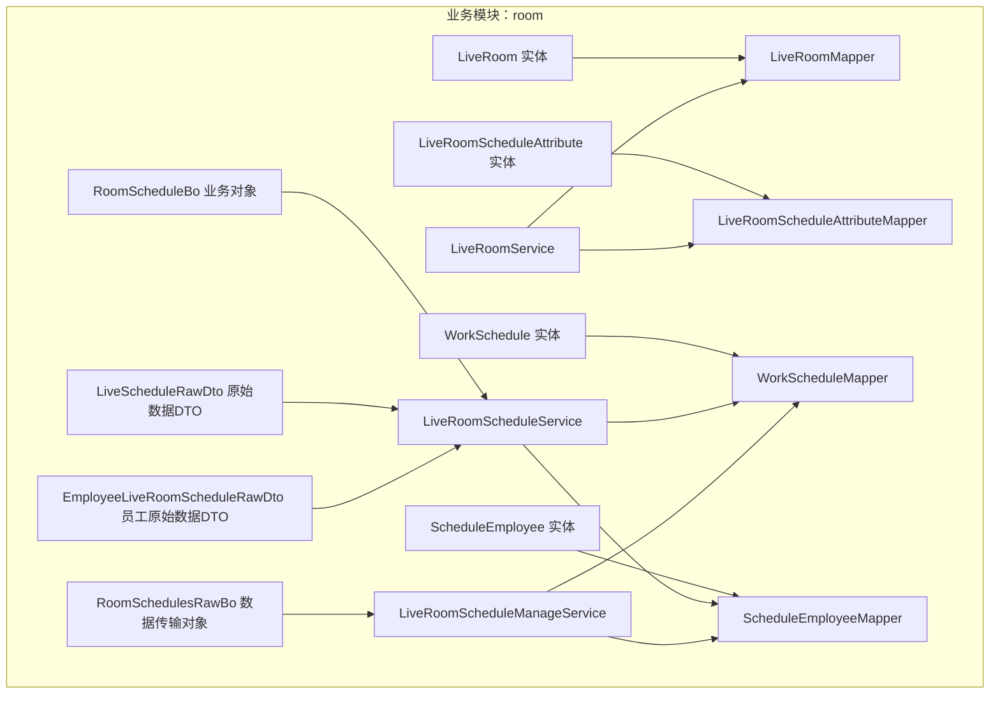
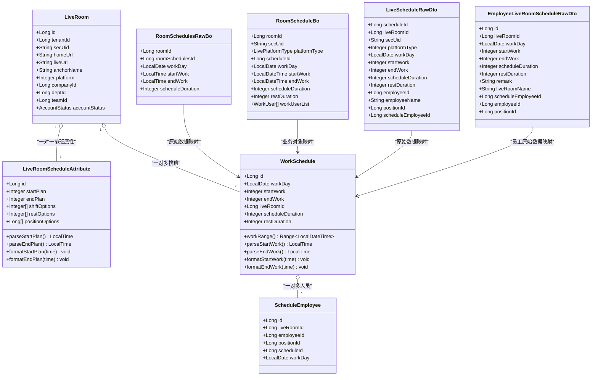
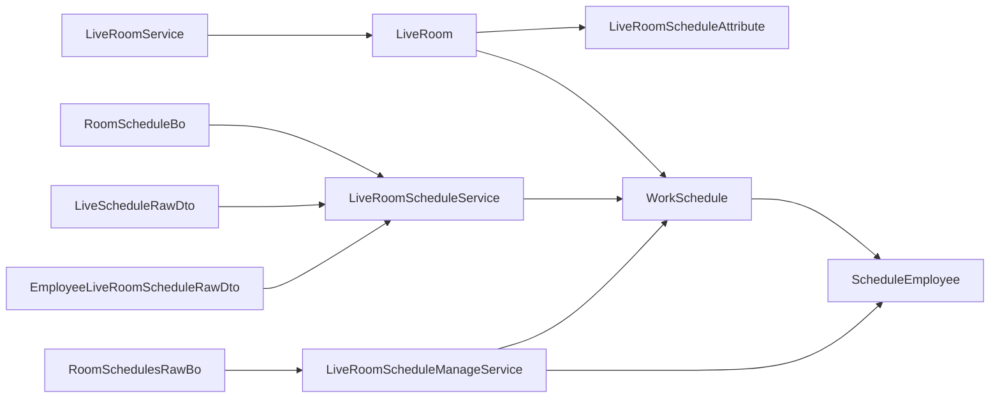

# 直播房间实体类

<cite>
**本文引用的文件**
- [LiveRoom.java](file://src/main/java/com/jiuyu/governance/business/room/pojo/entity/LiveRoom.java)
- [LiveRoomScheduleAttribute.java](file://src/main/java/com/jiuyu/governance/business/room/pojo/entity/LiveRoomScheduleAttribute.java)
- [WorkSchedule.java](file://src/main/java/com/jiuyu/governance/business/room/pojo/entity/WorkSchedule.java)
- [ScheduleEmployee.java](file://src/main/java/com/jiuyu/governance/business/room/pojo/entity/ScheduleEmployee.java)
- [RoomSchedulesRawBo.java](file://src/main/java/com/jiuyu/governance/business/room/pojo/bo/RoomSchedulesRawBo.java)
- [RoomScheduleBo.java](file://src/main/java/com/jiuyu/governance/business/room/pojo/bo/RoomScheduleBo.java)
- [LiveScheduleRawDto.java](file://src/main/java/com/jiuyu/governance/business/room/pojo/bo/LiveScheduleRawDto.java)
- [EmployeeLiveRoomScheduleRawDto.java](file://src/main/java/com/jiuyu/governance/business/room/pojo/bo/EmployeeLiveRoomScheduleRawDto.java)
- [LiveRoomMapper.java](file://src/main/java/com/jiuyu/governance/business/room/mapper/LiveRoomMapper.java)
- [LiveRoomScheduleAttributeMapper.java](file://src/main/java/com/jiuyu/governance/business/room/mapper/LiveRoomScheduleAttributeMapper.java)
- [WorkScheduleMapper.java](file://src/main/java/com/jiuyu/governance/business/room/mapper/WorkScheduleMapper.java)
- [ScheduleEmployeeMapper.java](file://src/main/java/com/jiuyu/governance/business/room/mapper/ScheduleEmployeeMapper.java)
- [LiveRoomService.java](file://src/main/java/com/jiuyu/governance/business/room/service/LiveRoomService.java)
- [LiveRoomScheduleService.java](file://src/main/java/com/jiuyu/governance/business/room/service/LiveRoomScheduleService.java)
- [LiveRoomScheduleManageService.java](file://src/main/java/com/jiuyu/governance/business/room/service/LiveRoomScheduleManageService.java)
- [LiveRoomScheduleManageServiceImpl.java](file://src/main/java/com/jiuyu/governance/business/room/service/impl/LiveRoomScheduleManageServiceImpl.java)
- [LiveRoomAdminController.java](file://src/main/java/com/jiuyu/governance/business/room/controller/LiveRoomAdminController.java)
</cite>

## 更新摘要
**变更内容**
- 新增RoomSchedulesRawBo数据传输对象，用于处理原始调度数据
- 修正RoomScheduleBo中roomId字段的数据一致性
- 新增EmployeeLiveRoomScheduleRawDto和LiveScheduleRawDto数据传输对象
- 扩展直播房间排班数据传输层功能

## 目录
1. [简介](#简介)
2. [项目结构](#项目结构)
3. [核心组件](#核心组件)
4. [架构总览](#架构总览)
5. [详细组件分析](#详细组件分析)
6. [数据传输对象详解](#数据传输对象详解)
7. [依赖分析](#依赖分析)
8. [性能考虑](#性能考虑)
9. [故障排查指南](#故障排查指南)
10. [结论](#结论)
11. [附录](#附录)

## 简介
本文件聚焦于直播房间管理系统的实体层设计与实现，围绕以下核心实体展开：
- LiveRoom（直播间）
- LiveRoomScheduleAttribute（直播房间排班属性）
- WorkSchedule（工作日程）
- ScheduleEmployee（排班员工）
- RoomSchedulesRawBo（直播房间排班原始数据传输对象）
- RoomScheduleBo（直播房间排班业务对象）
- LiveScheduleRawDto（直播排班原始数据传输对象）
- EmployeeLiveRoomScheduleRawDto（员工直播排班原始数据传输对象）

文档将从数据模型、业务规则、排班机制与员工调度逻辑入手，结合服务接口与Mapper方法，给出实体类的应用示例与与直播业绩实体的交互关系说明。

## 项目结构
直播房间相关实体位于 business.room 子模块，采用 MyBatis-Plus 的实体标注与 Mapper 映射，配合服务层接口实现业务编排。

**图示来源**
- [LiveRoom.java:1-168](file://src/main/java/com/jiuyu/governance/business/room/pojo/entity/LiveRoom.java#L1-L168)
- [LiveRoomScheduleAttribute.java:1-155](file://src/main/java/com/jiuyu/governance/business/room/pojo/entity/LiveRoomScheduleAttribute.java#L1-L155)
- [WorkSchedule.java:1-190](file://src/main/java/com/jiuyu/governance/business/room/pojo/entity/WorkSchedule.java#L1-L190)
- [ScheduleEmployee.java:1-98](file://src/main/java/com/jiuyu/governance/business/room/pojo/entity/ScheduleEmployee.java#L1-L98)
- [RoomSchedulesRawBo.java:1-57](file://src/main/java/com/jiuyu/governance/business/room/pojo/bo/RoomSchedulesRawBo.java#L1-L57)
- [RoomScheduleBo.java:1-103](file://src/main/java/com/jiuyu/governance/business/room/pojo/bo/RoomScheduleBo.java#L1-L103)
- [LiveScheduleRawDto.java:1-86](file://src/main/java/com/jiuyu/governance/business/room/pojo/bo/LiveScheduleRawDto.java#L1-L86)
- [EmployeeLiveRoomScheduleRawDto.java:1-103](file://src/main/java/com/jiuyu/governance/business/room/pojo/bo/EmployeeLiveRoomScheduleRawDto.java#L1-L103)

**章节来源**
- [LiveRoom.java:1-168](file://src/main/java/com/jiuyu/governance/business/room/pojo/entity/LiveRoom.java#L1-L168)
- [LiveRoomScheduleAttribute.java:1-155](file://src/main/java/com/jiuyu/governance/business/room/pojo/entity/LiveRoomScheduleAttribute.java#L1-L155)
- [WorkSchedule.java:1-190](file://src/main/java/com/jiuyu/governance/business/room/pojo/entity/WorkSchedule.java#L1-L190)
- [ScheduleEmployee.java:1-98](file://src/main/java/com/jiuyu/governance/business/room/pojo/entity/ScheduleEmployee.java#L1-L98)

## 核心组件
本节对五个实体和四个数据传输对象进行逐项解析，涵盖字段语义、约束与工具方法。

- LiveRoom（直播间）
  - 关键字段：主键ID、租户ID、主播唯一标识、主页URL、直播URL、主播名称、首播日期、主播头像、平台类型、主播抖音号、行业ID、公司/部门/小组ID、账号状态等。
  - 约束：大量非空与长度限制，确保数据一致性；平台类型与账号状态枚举参与业务判断。
  - 用途：承载直播间的元数据与组织归属，作为排班与业绩统计的上游基础数据。

- LiveRoomScheduleAttribute（直播房间排班属性）
  - 关键字段：轮班开始/结束时间（整数编码HHmm）、班次时长可选项、休息时长可选项、岗位可选项（均以逗号分隔的列表存储）。
  - 工具方法：提供时间解析与格式化，支持将整数编码转换为 LocalTime，便于后续计算。
  - 约束：列表长度与字符长度限制，保证配置项数量与存储安全。
  - 用途：定义每个直播间的排班策略模板，决定可选班次、休息与岗位组合。

- WorkSchedule（工作日程）
  - 关键字段：班次归属天、开始/结束时间（整数编码）、直播间ID、备注、班次/休息时长。
  - 工具方法：计算班次时间范围（处理跨日场景），提供时间解析与格式化。
  - 约束：非空与长度限制，确保排班数据可被正确解析与展示。
  - 用途：记录实际执行的排班计划，是排班调度与人员安排的直接依据。

- ScheduleEmployee（排班员工）
  - 关键字段：直播间ID、员工ID、岗位ID、排班计划ID、班次归属天。
  - 约束：非空校验，确保排班与人员、岗位、计划之间的强关联。
  - 用途：建立"员工-岗位-排班计划-直播间"的多维关联，支撑考勤与绩效统计。

- RoomSchedulesRawBo（直播房间排班原始数据传输对象）
  - 关键字段：roomId（直播房间ID）、roomSchedulesId（排班ID）、workDay（班次归属天）、startWork（开始时间）、endWork（结束时间）、scheduleDuration（班次时长）。
  - 用途：提供原始排班数据的标准化传输格式，支持批量查询和数据处理。

- RoomScheduleBo（直播房间排班业务对象）
  - 关键字段：roomId（直播房间ID）、secUid（直播间唯一ID）、platformType（直播平台类型）、scheduleId（排班计划ID）、workDay（班次归属天）、startWork/endWork（开始/结束时间）、scheduleDuration/restDuration（班次/休息时长）、workUserList（排班人员列表）。
  - 用途：封装完整的排班业务信息，支持前端展示和业务逻辑处理。

- LiveScheduleRawDto（直播排班原始数据传输对象）
  - 关键字段：scheduleId（排班ID）、liveRoomId（直播间ID）、secUid（直播间平台唯一标识）、platformType（平台类型）、workDay（工作日期）、startWork/endWork（开始/结束工作时间）、scheduleDuration/restDuration（排班/休息时长）、employeeId/employeeName（员工信息）、positionId（岗位ID）、scheduleEmployeeId（人员排班关联ID）。
  - 用途：从数据库查询原始排班数据，包含排班、直播间、人员等完整信息。

- EmployeeLiveRoomScheduleRawDto（员工直播排班原始数据传输对象）
  - 关键字段：id（ID）、liveRoomId（直播间ID）、workDay（班次归属天）、startWork/endWork（轮班开始/结束时间）、scheduleDuration/restDuration（班次/休息时长）、remark（备注）、liveRoomName（直播间名称）、scheduleEmployeeId（排班员工记录ID）、employeeId（员工ID）、positionId（职位ID）。
  - 用途：提供员工个人排班的原始信息，支持员工端展示和数据转换。

**章节来源**
- [LiveRoom.java:16-167](file://src/main/java/com/jiuyu/governance/business/room/pojo/entity/LiveRoom.java#L16-L167)
- [LiveRoomScheduleAttribute.java:19-154](file://src/main/java/com/jiuyu/governance/business/room/pojo/entity/LiveRoomScheduleAttribute.java#L19-L154)
- [WorkSchedule.java:18-189](file://src/main/java/com/jiuyu/governance/business/room/pojo/entity/WorkSchedule.java#L18-L189)
- [ScheduleEmployee.java:14-97](file://src/main/java/com/jiuyu/governance/business/room/pojo/entity/ScheduleEmployee.java#L14-L97)
- [RoomSchedulesRawBo.java:18-56](file://src/main/java/com/jiuyu/governance/business/room/pojo/bo/RoomSchedulesRawBo.java#L18-L56)
- [RoomScheduleBo.java:19-103](file://src/main/java/com/jiuyu/governance/business/room/pojo/bo/RoomScheduleBo.java#L19-L103)
- [LiveScheduleRawDto.java:20-85](file://src/main/java/com/jiuyu/governance/business/room/pojo/bo/LiveScheduleRawDto.java#L20-L85)
- [EmployeeLiveRoomScheduleRawDto.java:19-103](file://src/main/java/com/jiuyu/governance/business/room/pojo/bo/EmployeeLiveRoomScheduleRawDto.java#L19-L103)

## 架构总览
直播房间实体与服务层、Mapper层的交互关系如下：

**图示来源**
- [LiveRoom.java:1-168](file://src/main/java/com/jiuyu/governance/business/room/pojo/entity/LiveRoom.java#L1-L168)
- [LiveRoomScheduleAttribute.java:1-155](file://src/main/java/com/jiuyu/governance/business/room/pojo/entity/LiveRoomScheduleAttribute.java#L1-L155)
- [WorkSchedule.java:1-190](file://src/main/java/com/jiuyu/governance/business/room/pojo/entity/WorkSchedule.java#L1-L190)
- [ScheduleEmployee.java:1-98](file://src/main/java/com/jiuyu/governance/business/room/pojo/entity/ScheduleEmployee.java#L1-L98)
- [RoomSchedulesRawBo.java:1-57](file://src/main/java/com/jiuyu/governance/business/room/pojo/bo/RoomSchedulesRawBo.java#L1-L57)
- [RoomScheduleBo.java:1-103](file://src/main/java/com/jiuyu/governance/business/room/pojo/bo/RoomScheduleBo.java#L1-L103)
- [LiveScheduleRawDto.java:1-86](file://src/main/java/com/jiuyu/governance/business/room/pojo/bo/LiveScheduleRawDto.java#L1-L86)
- [EmployeeLiveRoomScheduleRawDto.java:1-103](file://src/main/java/com/jiuyu/governance/business/room/pojo/bo/EmployeeLiveRoomScheduleRawDto.java#L1-L103)

## 详细组件分析

### LiveRoom（直播间）
- 数据模型要点
  - 主键与审计字段：id、createDate、updateDate、createBy、updateBy、isDeleted。
  - 业务关键字段：secUid、homeUrl、liveUrl、anchorName、anchorAvatar、platform、anchorNumber。
  - 组织归属：companyId、deptId、teamId；行业与租户：tradeId、tenantId。
  - 状态控制：accountStatus 与 isDeleted 双重开关。
- 业务规则
  - 平台类型与账号状态枚举参与权限与展示控制。
  - 非空与长度约束保障数据质量与接口稳定性。
- 应用示例
  - 新增/更新时，服务层调用第三方开放平台接口获取主播公开信息并回填至实体字段，随后持久化。
  - 分页查询与详情查询通过 Mapper 完成，服务层负责权限隔离与组装。

**章节来源**
- [LiveRoom.java:16-167](file://src/main/java/com/jiuyu/governance/business/room/pojo/entity/LiveRoom.java#L16-L167)
- [LiveRoomMapper.java:21-46](file://src/main/java/com/jiuyu/governance/business/room/mapper/LiveRoomMapper.java#L21-L46)
- [LiveRoomService.java:30-148](file://src/main/java/com/jiuyu/governance/business/room/service/LiveRoomService.java#L30-L148)

### LiveRoomScheduleAttribute（直播房间排班属性）
- 数据模型要点
  - 主键即直播间ID（INPUT），避免冗余主键。
  - 轮班起止时间采用整数编码（HHmm），通过工具方法解析为 LocalTime。
  - 配置项以逗号分隔的列表存储，分别对应班次时长、休息时长与岗位选项。
- 业务规则
  - 列表长度与字符串长度限制，防止超长配置影响解析与存储。
  - 解析/格式化方法统一时间编码规范，减少业务层重复逻辑。
- 应用示例
  - 设置排班属性时，服务层接收请求并写入实体，随后持久化保存。
  - 查询时，前端可直接使用解析后的 LocalTime 进行展示与计算。

**章节来源**
- [LiveRoomScheduleAttribute.java:19-154](file://src/main/java/com/jiuyu/governance/business/room/pojo/entity/LiveRoomScheduleAttribute.java#L19-L154)
- [LiveRoomScheduleAttributeMapper.java:1-9](file://src/main/java/com/jiuyu/governance/business/room/mapper/LiveRoomScheduleAttributeMapper.java#L1-L9)
- [LiveRoomService.java:107-126](file://src/main/java/com/jiuyu/governance/business/room/service/LiveRoomService.java#L107-L126)

### WorkSchedule（工作日程）
- 数据模型要点
  - 主键与审计字段同 LiveRoom。
  - 关键字段：workDay、startWork/endWork（整数编码）、liveRoomId、scheduleDuration、restDuration。
  - 工具方法：workRange 计算跨日边界；parse/format 方法统一时间编码。
- 业务规则
  - 跨日排班：当结束时间早于等于开始时间时，结束时间自动加一天，确保时间范围正确。
  - 时长与休息时长字段用于后续排班生成与统计。
- 应用示例
  - 排班生成：根据 LiveRoomScheduleAttribute 的可选项与 WorkSchedule 的时间范围，生成具体班次。
  - 展示查询：通过 Mapper 提供的原始关联查询与客户端展示查询，返回包含直播间与人员信息的排班数据。

**章节来源**
- [WorkSchedule.java:18-189](file://src/main/java/com/jiuyu/governance/business/room/pojo/entity/WorkSchedule.java#L18-L189)
- [WorkScheduleMapper.java:17-54](file://src/main/java/com/jiuyu/governance/business/room/mapper/WorkScheduleMapper.java#L17-L54)
- [LiveRoomScheduleService.java:24-94](file://src/main/java/com/jiuyu/governance/business/room/service/LiveRoomScheduleService.java#L24-L94)

### ScheduleEmployee（排班员工）
- 数据模型要点
  - 主键与审计字段。
  - 关联字段：liveRoomId、employeeId、positionId、scheduleId、workDay。
- 业务规则
  - 强关联：一个员工在一个班次内对应一个岗位，且归属于特定直播间的某一天。
  - 与 WorkSchedule 的 scheduleId 关联，形成"计划-执行"的闭环。
- 应用示例
  - 添加排班人员：服务层接收请求，批量写入 ScheduleEmployee，并通过 Mapper 批量插入。
  - 查询个人排班：按员工ID与时间范围查询，返回分页数据。

**章节来源**
- [ScheduleEmployee.java:14-97](file://src/main/java/com/jiuyu/governance/business/room/pojo/entity/ScheduleEmployee.java#L14-L97)
- [ScheduleEmployeeMapper.java:1-20](file://src/main/java/com/jiuyu/governance/business/room/mapper/ScheduleEmployeeMapper.java#L1-L20)
- [LiveRoomScheduleService.java:82-94](file://src/main/java/com/jiuyu/governance/business/room/service/LiveRoomScheduleService.java#L82-L94)
- [LiveRoomScheduleManageService.java:18-88](file://src/main/java/com/jiuyu/governance/business/room/service/LiveRoomScheduleManageService.java#L18-L88)

## 数据传输对象详解

### RoomSchedulesRawBo（直播房间排班原始数据传输对象）
- 数据模型要点
  - 字段设计：roomId（直播房间ID）、roomSchedulesId（排班ID）、workDay（班次归属天）、startWork（开始时间）、endWork（结束时间）、scheduleDuration（班次时长）。
  - 类型设计：使用 LocalTime 和 LocalDate 等标准 Java 时间类型，确保数据传输的一致性和准确性。
  - 字段命名：采用驼峰命名法，符合 Java 开发规范。
- 业务规则
  - 数据一致性：所有字段均为可选，支持部分字段为空的场景。
  - 类型安全：使用标准时间类型，避免字符串解析错误。
  - 批量处理：支持批量查询和处理，提高数据传输效率。
- 应用示例
  - 批量查询：通过 getLiveRoomSchedules 方法批量获取指定时间范围内的排班数据。
  - 数据转换：将数据库查询结果转换为标准化的数据传输格式。
  - 前端展示：为前端提供标准化的排班数据格式，便于界面渲染。

**章节来源**
- [RoomSchedulesRawBo.java:18-56](file://src/main/java/com/jiuyu/governance/business/room/pojo/bo/RoomSchedulesRawBo.java#L18-L56)
- [LiveRoomScheduleManageServiceImpl.java:987-1016](file://src/main/java/com/jiuyu/governance/business/room/service/impl/LiveRoomScheduleManageServiceImpl.java#L987-L1016)
- [LiveRoomAdminController.java:151](file://src/main/java/com/jiuyu/governance/business/room/controller/LiveRoomAdminController.java#L151)

### RoomScheduleBo（直播房间排班业务对象）
- 数据模型要点
  - 字段设计：roomId（直播房间ID）、secUid（直播间唯一ID）、platformType（直播平台类型）、scheduleId（排班计划ID）、workDay（班次归属天）、startWork/endWork（开始/结束时间）、scheduleDuration/restDuration（班次/休息时长）、workUserList（排班人员列表）。
  - 内部类设计：WorkUser 内部类封装员工信息，包括 employeeId、employeeName、positionId。
  - 类型设计：使用 LocalDateTime 处理完整时间信息，支持精确到秒的时间表示。
- 业务规则
  - 数据完整性：包含完整的排班业务信息，支持前端展示和业务逻辑处理。
  - 嵌套结构：支持嵌套的员工信息结构，便于人员管理。
  - 类型一致性：所有字段类型设计合理，满足业务需求。
- 应用示例
  - 业务展示：为前端提供完整的排班业务信息，支持排班页面展示。
  - 数据处理：支持排班数据的业务逻辑处理和转换。
  - 员工管理：通过嵌套的 WorkUser 结构管理排班人员信息。

**章节来源**
- [RoomScheduleBo.java:19-103](file://src/main/java/com/jiuyu/governance/business/room/pojo/bo/RoomScheduleBo.java#L19-L103)

### LiveScheduleRawDto（直播排班原始数据传输对象）
- 数据模型要点
  - 字段设计：scheduleId（排班ID）、liveRoomId（直播间ID）、secUid（直播间平台唯一标识）、platformType（平台类型）、workDay（工作日期）、startWork/endWork（开始/结束工作时间）、scheduleDuration/restDuration（排班/休息时长）、employeeId/employeeName（员工信息）、positionId（岗位ID）、scheduleEmployeeId（人员排班关联ID）。
  - 功能设计：专门用于从数据库查询原始排班数据，包含排班、直播间、人员等完整信息。
  - 批量查询：支持按多个条件过滤的批量查询场景。
- 业务规则
  - 数据完整性：包含排班相关的所有基本信息，确保数据查询的完整性。
  - 条件过滤：支持多种条件过滤，满足不同的查询需求。
  - 批量处理：优化批量查询性能，支持大数据量的处理。
- 应用示例
  - 数据查询：用于批量查询场景，支持按多个条件过滤。
  - 数据转换：将数据库查询结果转换为标准化的数据格式。
  - 前端展示：为前端提供完整的排班数据，支持页面展示。

**章节来源**
- [LiveScheduleRawDto.java:20-85](file://src/main/java/com/jiuyu/governance/business/room/pojo/bo/LiveScheduleRawDto.java#L20-L85)

### EmployeeLiveRoomScheduleRawDto（员工直播排班原始数据传输对象）
- 数据模型要点
  - 字段设计：id（ID）、liveRoomId（直播间ID）、workDay（班次归属天）、startWork/endWork（轮班开始/结束时间）、scheduleDuration/restDuration（班次/休息时长）、remark（备注）、liveRoomName（直播间名称）、scheduleEmployeeId（排班员工记录ID）、employeeId（员工ID）、positionId（职位ID）。
  - 功能设计：专门提供员工个人排班的原始信息，支持员工端展示和数据转换。
  - 数据转换：提供 toPageInfo 方法，支持转换为页面展示格式。
- 业务规则
  - 员工专用：专门为员工个人排班设计，包含员工相关的完整信息。
  - 数据转换：提供便捷的数据转换方法，支持不同场景下的数据格式转换。
  - 信息完整性：包含员工排班的所有必要信息，确保员工能够查看完整的排班信息。
- 应用示例
  - 员工展示：为员工提供个人排班信息的展示。
  - 数据转换：支持将原始数据转换为页面展示格式。
  - 信息查询：支持员工查询自己的排班信息。

**章节来源**
- [EmployeeLiveRoomScheduleRawDto.java:19-103](file://src/main/java/com/jiuyu/governance/business/room/pojo/bo/EmployeeLiveRoomScheduleRawDto.java#L19-L103)

## 依赖分析
- 实体与Mapper
  - 四个实体均通过 MyBatis-Plus 注解映射到数据库表，具备标准的增删改查能力。
  - LiveRoom 与 LiveRoomScheduleAttribute 为一对一关系（属性表主键即房间ID）。
  - LiveRoom 与 WorkSchedule 为一对多关系（一个房间有多条排班）。
  - WorkSchedule 与 ScheduleEmployee 为一对多关系（一个班次有多名员工）。
- 数据传输对象与服务层
  - RoomSchedulesRawBo 用于服务层与外部系统的数据传输，支持批量查询和处理。
  - RoomScheduleBo 用于业务层的数据封装，支持完整的排班业务信息展示。
  - LiveScheduleRawDto 用于数据库原始数据的查询和传输，支持复杂的批量查询场景。
  - EmployeeLiveRoomScheduleRawDto 用于员工个人排班数据的传输和展示。
- 服务层职责
  - LiveRoomService：负责直播间的全生命周期管理与排班属性设置。
  - LiveRoomScheduleService：负责排班查询、客户端展示与个人排班查询。
  - LiveRoomScheduleManageService：负责排班的新增、修改、删除与人员增删。
  - LiveRoomScheduleManageServiceImpl：实现具体的排班管理逻辑，包括批量查询和数据处理。

**图示来源**
- [LiveRoom.java:1-168](file://src/main/java/com/jiuyu/governance/business/room/pojo/entity/LiveRoom.java#L1-L168)
- [LiveRoomScheduleAttribute.java:1-155](file://src/main/java/com/jiuyu/governance/business/room/pojo/entity/LiveRoomScheduleAttribute.java#L1-L155)
- [WorkSchedule.java:1-190](file://src/main/java/com/jiuyu/governance/business/room/pojo/entity/WorkSchedule.java#L1-L190)
- [ScheduleEmployee.java:1-98](file://src/main/java/com/jiuyu/governance/business/room/pojo/entity/ScheduleEmployee.java#L1-L98)
- [RoomSchedulesRawBo.java:1-57](file://src/main/java/com/jiuyu/governance/business/room/pojo/bo/RoomSchedulesRawBo.java#L1-L57)
- [RoomScheduleBo.java:1-103](file://src/main/java/com/jiuyu/governance/business/room/pojo/bo/RoomScheduleBo.java#L1-L103)
- [LiveScheduleRawDto.java:1-86](file://src/main/java/com/jiuyu/governance/business/room/pojo/bo/LiveScheduleRawDto.java#L1-L86)
- [EmployeeLiveRoomScheduleRawDto.java:1-103](file://src/main/java/com/jiuyu/governance/business/room/pojo/bo/EmployeeLiveRoomScheduleRawDto.java#L1-L103)
- [LiveRoomService.java:1-149](file://src/main/java/com/jiuyu/governance/business/room/service/LiveRoomService.java#L1-L149)
- [LiveRoomScheduleService.java:1-94](file://src/main/java/com/jiuyu/governance/business/room/service/LiveRoomScheduleService.java#L1-L94)
- [LiveRoomScheduleManageService.java:1-88](file://src/main/java/com/jiuyu/governance/business/room/service/LiveRoomScheduleManageService.java#L1-L88)

**章节来源**
- [LiveRoomMapper.java:1-47](file://src/main/java/com/jiuyu/governance/business/room/mapper/LiveRoomMapper.java#L1-L47)
- [LiveRoomScheduleAttributeMapper.java:1-9](file://src/main/java/com/jiuyu/governance/business/room/mapper/LiveRoomScheduleAttributeMapper.java#L1-L9)
- [WorkScheduleMapper.java:1-54](file://src/main/java/com/jiuyu/governance/business/room/mapper/WorkScheduleMapper.java#L1-L54)
- [ScheduleEmployeeMapper.java:1-20](file://src/main/java/com/jiuyu/governance/business/room/mapper/ScheduleEmployeeMapper.java#L1-L20)

## 性能考虑
- 时间编码与解析
  - 整数编码（HHmm）占用空间小、索引友好，解析/格式化方法统一实现，减少重复计算。
- 列表存储与类型处理器
  - 使用自定义 TypeHandler 存储逗号分隔的整型/长整型列表，注意在查询时需使用合适的过滤条件，避免全表扫描。
- 跨日边界处理
  - WorkSchedule 的 workRange 在结束时间早于等于开始时间时自动加一天，避免时间范围错误导致的查询异常。
- 批量操作
  - Mapper 提供批量插入与选择性更新，建议在生成排班与添加人员时使用，降低网络往返与事务开销。
- 数据传输优化
  - RoomSchedulesRawBo 使用标准化的数据传输格式，支持批量查询和处理，提高数据传输效率。
  - LiveScheduleRawDto 支持复杂的批量查询场景，优化大数据量的处理性能。
- 内存管理
  - 数据传输对象采用轻量级设计，避免不必要的内存占用。
  - 支持流式处理和分批处理，减少内存压力。

## 故障排查指南
- 常见问题
  - 时间编码异常：检查 startPlan/endPlan 与 startWork/endWork 的整数编码是否符合 HHmm 规范。
  - 跨日排班错误：确认结束时间是否晚于开始时间，必要时调整时间范围。
  - 列表配置过长：检查 shiftOptions、restOptions、positionOptions 的长度与字符限制。
  - 关联缺失：添加排班人员前需确保 WorkSchedule 已存在且 scheduleId 正确。
  - 数据传输错误：检查 RoomSchedulesRawBo 中的字段映射是否正确，特别是 roomId 字段。
  - 数据类型不匹配：确认数据传输对象中的时间类型与数据库类型一致。
- 排查步骤
  - 核对实体字段约束与服务层请求参数校验。
  - 使用服务层提供的查询接口验证数据是否正确入库。
  - 对批量操作使用 Mapper 的 updateBatch/selectClientSchedules 等方法进行验证。
  - 检查数据传输对象的字段映射和数据类型转换。
  - 验证批量查询的性能和内存使用情况。

**章节来源**
- [LiveRoomScheduleAttribute.java:78-97](file://src/main/java/com/jiuyu/governance/business/room/pojo/entity/LiveRoomScheduleAttribute.java#L78-L97)
- [WorkSchedule.java:128-135](file://src/main/java/com/jiuyu/governance/business/room/pojo/entity/WorkSchedule.java#L128-L135)
- [WorkScheduleMapper.java:43-47](file://src/main/java/com/jiuyu/governance/business/room/mapper/WorkScheduleMapper.java#L43-L47)
- [ScheduleEmployeeMapper.java:14-18](file://src/main/java/com/jiuyu/governance/business/room/mapper/ScheduleEmployeeMapper.java#L14-L18)
- [RoomSchedulesRawBo.java:18-56](file://src/main/java/com/jiuyu/governance/business/room/pojo/bo/RoomSchedulesRawBo.java#L18-L56)

## 结论
直播房间实体层通过清晰的字段划分与严格的约束，构建了稳定的直播房间与排班数据模型。新增的 RoomSchedulesRawBo、RoomScheduleBo、LiveScheduleRawDto 和 EmployeeLiveRoomScheduleRawDto 数据传输对象进一步完善了数据传输层的设计，提供了标准化的数据格式和高效的批量处理能力。结合服务层的排班生成、查询与管理能力，实现了从"排班属性—排班计划—人员安排"的完整闭环。该设计兼顾了数据一致性、可扩展性与查询效率，为后续与直播业绩实体的集成提供了可靠的基础。

## 附录
- 与直播业绩实体的关系与数据交互
  - 直播间与排班：LiveRoom 为上游基础数据，WorkSchedule 与 ScheduleEmployee 为下游执行与人员维度，二者共同构成直播业绩统计的时间与人员基础。
  - 业绩统计：通常以 WorkSchedule 的时间范围与 ScheduleEmployee 的人员维度为聚合键，结合直播间的组织归属与平台类型进行分组统计。
  - 数据传输：RoomSchedulesRawBo 和 LiveScheduleRawDto 提供了标准化的数据传输格式，支持批量查询和处理，为业绩统计提供高效的数据源。
  - 建议：在业绩模块引入与 WorkSchedule 的关联查询与与 ScheduleEmployee 的人员维度聚合，确保统计口径一致、数据可追溯。
- 数据传输对象的应用场景
  - 批量查询：RoomSchedulesRawBo 支持大规模数据的批量查询和处理。
  - 业务展示：RoomScheduleBo 提供完整的业务信息，支持前端展示和业务逻辑处理。
  - 原始数据：LiveScheduleRawDto 和 EmployeeLiveRoomScheduleRawDto 提供原始数据格式，支持复杂的数据处理场景。
  - 性能优化：通过标准化的数据传输格式和批量处理机制，提高系统的整体性能。