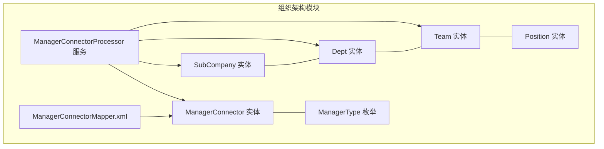
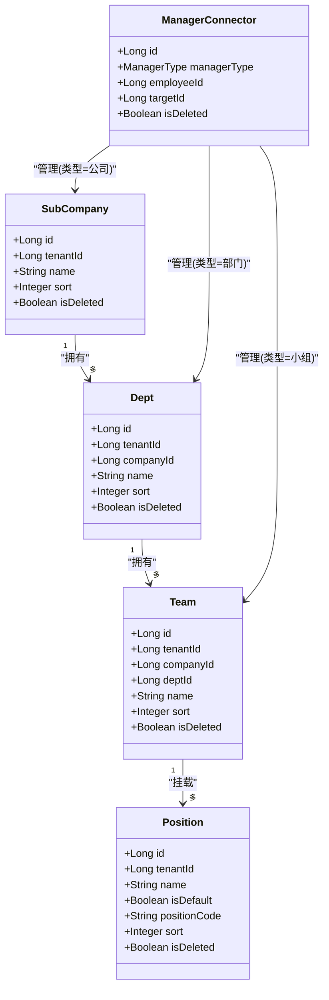
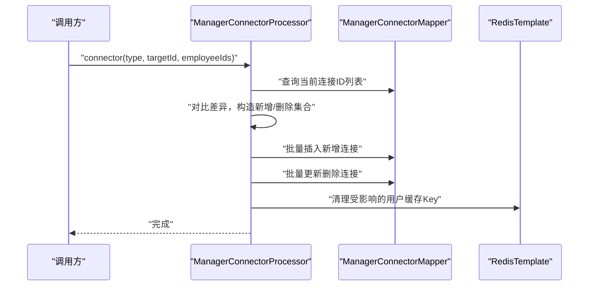
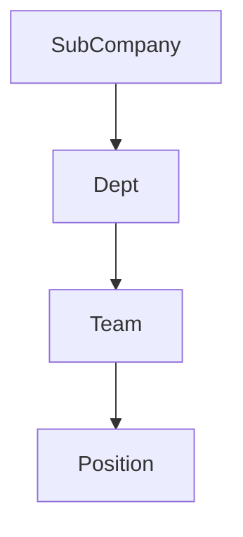
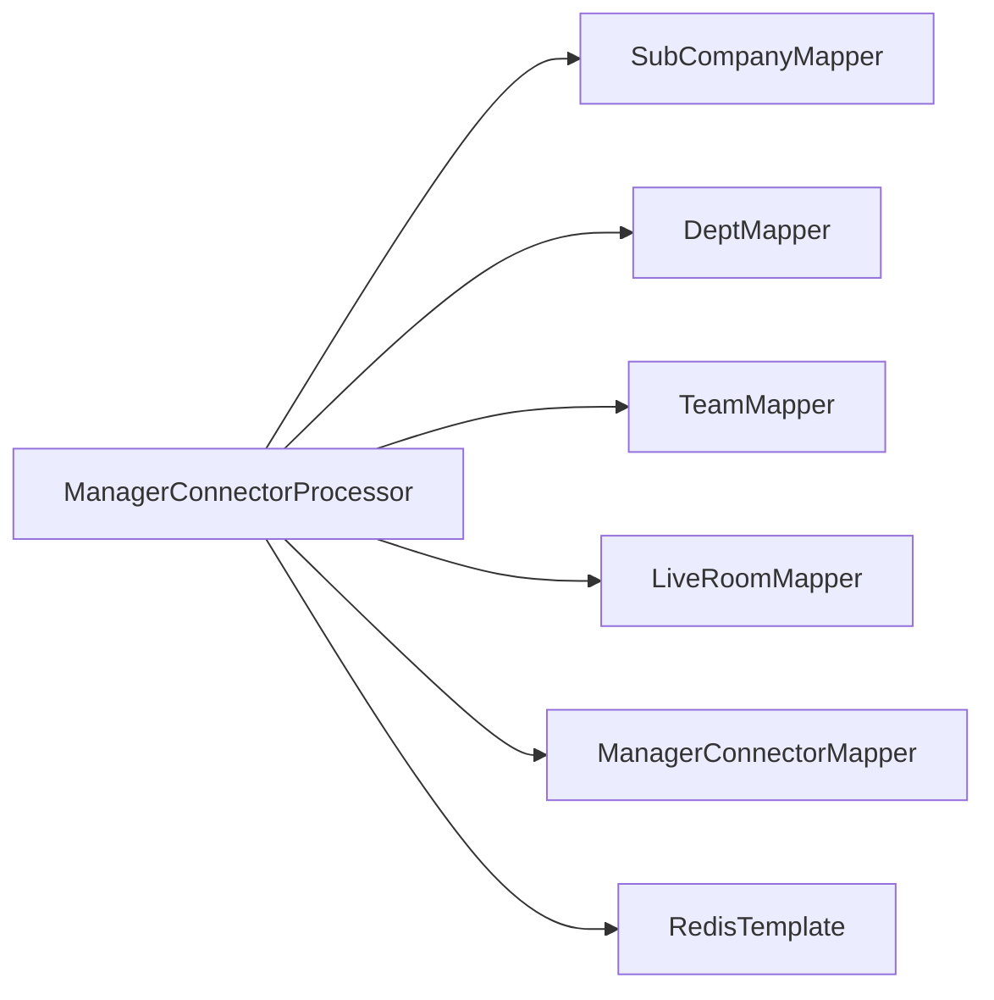

# 组织架构实体类

<cite>
**本文引用的文件**
- [SubCompany.java](file://src/main/java/com/jiuyu/governance/business/org/pojo/entity/SubCompany.java)
- [Dept.java](file://src/main/java/com/jiuyu/governance/business/org/pojo/entity/Dept.java)
- [Team.java](file://src/main/java/com/jiuyu/governance/business/org/pojo/entity/Team.java)
- [Position.java](file://src/main/java/com/jiuyu/governance/business/org/pojo/entity/Position.java)
- [ManagerConnector.java](file://src/main/java/com/jiuyu/governance/business/org/pojo/entity/ManagerConnector.java)
- [ManagerType.java](file://src/main/java/com/jiuyu/governance/business/org/pojo/constants/ManagerType.java)
- [ManagerConnectorProcessor.java](file://src/main/java/com/jiuyu/governance/business/org/service/impl/ManagerConnectorProcessor.java)
- [ManagerConnectorMapper.xml](file://src/main/resources/mapper/org/ManagerConnectorMapper.xml)
- [SubCompanyAddRequest.java](file://src/main/java/com/jiuyu/governance/business/org/pojo/request/SubCompanyAddRequest.java)
- [DeptAddRequest.java](file://src/main/java/com/jiuyu/governance/business/org/pojo/request/DeptAddRequest.java)
- [SubCompanyResponse.java](file://src/main/java/com/jiuyu/governance/business/org/pojo/response/SubCompanyResponse.java)
- [DeptResponse.java](file://src/main/java/com/jiuyu/governance/business/org/pojo/response/DeptResponse.java)
- [SubCompanyService.java](file://src/main/java/com/jiuyu/governance/business/org/service/SubCompanyService.java)
</cite>

## 目录
1. [简介](#简介)
2. [项目结构](#项目结构)
3. [核心组件](#核心组件)
4. [架构总览](#架构总览)
5. [详细组件分析](#详细组件分析)
6. [依赖分析](#依赖分析)
7. [性能考虑](#性能考虑)
8. [故障排查指南](#故障排查指南)
9. [结论](#结论)
10. [附录](#附录)

## 简介
本文件聚焦组织架构实体类的设计与实现，涵盖以下核心实体：
- SubCompany（子公司）
- Dept（部门）
- Team（小组）
- Position（岗位）
- ManagerConnector（管理员连接器）

文档将从字段定义、数据类型、约束条件、业务规则出发，梳理实体之间的层级与关联关系，并结合服务层与数据访问层的使用方式，给出最佳实践与常见问题排查建议。

## 项目结构
组织架构相关代码位于 business/org 模块，包含实体、请求/响应对象、Mapper XML、服务接口与实现等。其中实体类均采用 MyBatis-Plus 注解映射到数据库表，配合服务层进行业务编排。

图表来源
- [SubCompany.java:1-85](file://src/main/java/com/jiuyu/governance/business/org/pojo/entity/SubCompany.java#L1-L85)
- [Dept.java:1-92](file://src/main/java/com/jiuyu/governance/business/org/pojo/entity/Dept.java#L1-L92)
- [Team.java:1-100](file://src/main/java/com/jiuyu/governance/business/org/pojo/entity/Team.java#L1-L100)
- [Position.java:1-99](file://src/main/java/com/jiuyu/governance/business/org/pojo/entity/Position.java#L1-L99)
- [ManagerConnector.java:1-69](file://src/main/java/com/jiuyu/governance/business/org/pojo/entity/ManagerConnector.java#L1-L69)
- [ManagerType.java:1-86](file://src/main/java/com/jiuyu/governance/business/org/pojo/constants/ManagerType.java#L1-L86)
- [ManagerConnectorProcessor.java:1-615](file://src/main/java/com/jiuyu/governance/business/org/service/impl/ManagerConnectorProcessor.java#L1-L615)
- [ManagerConnectorMapper.xml:1-27](file://src/main/resources/mapper/org/ManagerConnectorMapper.xml#L1-L27)

章节来源
- [SubCompany.java:1-85](file://src/main/java/com/jiuyu/governance/business/org/pojo/entity/SubCompany.java#L1-L85)
- [Dept.java:1-92](file://src/main/java/com/jiuyu/governance/business/org/pojo/entity/Dept.java#L1-L92)
- [Team.java:1-100](file://src/main/java/com/jiuyu/governance/business/org/pojo/entity/Team.java#L1-L100)
- [Position.java:1-99](file://src/main/java/com/jiuyu/governance/business/org/pojo/entity/Position.java#L1-L99)
- [ManagerConnector.java:1-69](file://src/main/java/com/jiuyu/governance/business/org/pojo/entity/ManagerConnector.java#L1-L69)
- [ManagerType.java:1-86](file://src/main/java/com/jiuyu/governance/business/org/pojo/constants/ManagerType.java#L1-L86)
- [ManagerConnectorProcessor.java:1-615](file://src/main/java/com/jiuyu/governance/business/org/service/impl/ManagerConnectorProcessor.java#L1-L615)
- [ManagerConnectorMapper.xml:1-27](file://src/main/resources/mapper/org/ManagerConnectorMapper.xml#L1-L27)

## 核心组件
本节对五个实体类进行逐项解析，包括字段、类型、注解约束与业务含义。

- SubCompany（子公司）
  - 字段与类型
    - id: Long（主键，雪花ID）
    - tenantId: Long（租户标识）
    - name: String（名称，最大长度50，必填）
    - createDate/updateDate: LocalDateTime（创建/更新时间，必填）
    - createBy/updateBy: Long（创建/更新人，必填）
    - sort: Integer（排序，必填）
    - isDeleted: Boolean（逻辑删除，必填）
  - 约束与规则
    - 使用注解保证非空与长度限制
    - 通过 isDeleted 实现软删除
    - 与租户隔离，避免跨租户数据污染
  - 业务角色
    - 组织架构最高层单位，作为部门的父节点

- Dept（部门）
  - 字段与类型
    - id: Long（主键）
    - tenantId: Long（租户标识）
    - name: String（名称，最大长度40，必填）
    - companyId: Long（所属公司ID，必填）
    - createDate/updateDate: LocalDateTime（必填）
    - createBy/updateBy: Long（必填）
    - sort: Integer（必填）
    - isDeleted: Boolean（必填）
  - 约束与规则
    - 必须归属某子公司
    - 支持租户维度隔离
  - 业务角色
    - 子公司的直接下级，可挂载多个小组

- Team（小组）
  - 字段与类型
    - id: Long（主键）
    - tenantId: Long（租户标识）
    - name: String（名称，最大长度30，必填）
    - companyId: Long（所属公司ID，必填）
    - deptId: Long（所属部门ID，必填）
    - createDate/updateDate: LocalDateTime（必填）
    - createBy/updateBy: Long（必填）
    - sort: Integer（必填）
    - isDeleted: Boolean（必填）
  - 约束与规则
    - 必须同时归属公司与部门
  - 业务角色
    - 部门的直接下级，通常承载具体业务执行单元

- Position（岗位）
  - 字段与类型
    - id: Long（主键）
    - tenantId: Long（租户标识）
    - name: String（名称，最大长度100，必填）
    - createDate/updateDate: LocalDateTime（必填）
    - createBy/updateBy: Long（必填）
    - sort: Integer（必填）
    - isDeleted: Boolean（必填）
    - isDefault: Boolean（是否默认岗位，必填）
    - positionCode: String（默认岗位的业务编码，最大长度30）
  - 约束与规则
    - isDefault 与 positionCode 联动，仅默认岗位需要编码
  - 业务角色
    - 定义组织内的职责边界，支撑权限与绩效等业务

- ManagerConnector（管理员连接器）
  - 字段与类型
    - id: Long（主键）
    - createDate/updateDate: LocalDateTime（必填）
    - isDeleted: Boolean（必填）
    - managerType: ManagerType（管理类型枚举，必填）
    - employeeId: Long（员工ID，必填）
    - targetId: Long（目标组织ID，按类型对应公司/部门/小组/直播间）
  - 约束与规则
    - 以组合唯一性表达“某员工对某组织的管理权”
    - 通过 isDeleted 实现软删除
  - 业务角色
    - 连接“员工”与“组织”的权限桥梁，支撑数据权限与管理范围计算

章节来源
- [SubCompany.java:21-83](file://src/main/java/com/jiuyu/governance/business/org/pojo/entity/SubCompany.java#L21-L83)
- [Dept.java:21-90](file://src/main/java/com/jiuyu/governance/business/org/pojo/entity/Dept.java#L21-L90)
- [Team.java:21-98](file://src/main/java/com/jiuyu/governance/business/org/pojo/entity/Team.java#L21-L98)
- [Position.java:21-97](file://src/main/java/com/jiuyu/governance/business/org/pojo/entity/Position.java#L21-L97)
- [ManagerConnector.java:21-67](file://src/main/java/com/jiuyu/governance/business/org/pojo/entity/ManagerConnector.java#L21-L67)

## 架构总览
组织架构实体遵循“公司—部门—小组—岗位”的层级关系，管理员连接器通过统一的管理类型枚举与目标ID，将员工与组织节点绑定，形成灵活的数据权限与管理范围。

图表来源
- [SubCompany.java:1-85](file://src/main/java/com/jiuyu/governance/business/org/pojo/entity/SubCompany.java#L1-L85)
- [Dept.java:1-92](file://src/main/java/com/jiuyu/governance/business/org/pojo/entity/Dept.java#L1-L92)
- [Team.java:1-100](file://src/main/java/com/jiuyu/governance/business/org/pojo/entity/Team.java#L1-L100)
- [Position.java:1-99](file://src/main/java/com/jiuyu/governance/business/org/pojo/entity/Position.java#L1-L99)
- [ManagerConnector.java:1-69](file://src/main/java/com/jiuyu/governance/business/org/pojo/entity/ManagerConnector.java#L1-L69)

## 详细组件分析

### ManagerType（管理类型枚举）
- 角色与层级
  - COMPANY（公司）
  - DEPT（部门），上级为公司
  - TEAM（小组），上级为部门
  - LIVE_ROOM（直播间），上级为小组
- 关键能力
  - 提供 getSubs() 递归获取所有下级类型
  - 提供 code 与权限域映射，便于数据权限控制
- 业务意义
  - 统一管理连接器的目标类型，简化权限计算与缓存键设计

章节来源
- [ManagerType.java:19-82](file://src/main/java/com/jiuyu/governance/business/org/pojo/constants/ManagerType.java#L19-L82)

### ManagerConnector（管理员连接器）
- 设计要点
  - 以 managerType + targetId + employeeId 的组合表达“某员工对某组织的管理关系”
  - 通过 isDeleted 支持软删除，避免物理删除带来的权限回溯成本
- 与组织实体的关系
  - targetId 可指向 SubCompany/Dept/Team 等不同实体，取决于 managerType
- 与员工实体的关系
  - 通过 employeeId 关联员工，配合员工基础信息响应对象输出

章节来源
- [ManagerConnector.java:21-67](file://src/main/java/com/jiuyu/governance/business/org/pojo/entity/ManagerConnector.java#L21-L67)

### ManagerConnectorProcessor（管理员连接器处理器）
- 主要职责
  - 连接/断开员工与组织的管理关系
  - 查询租户/用户的连接器ID集合
  - 计算用户在不同管理类型下的子级组织ID集合
  - 基于 Redis 的多级缓存策略，提升权限查询性能
- 关键流程
  - 连接：对比现有连接与新列表，插入新增项，逻辑删除多余项
  - 断开：将指定类型+目标ID下的连接全部标记为已删除
  - 查询：先查缓存，未命中再查数据库并写入缓存
  - 权限扩展：根据用户已连接的公司/部门/小组ID，计算其可管理的下级组织集合
- 缓存策略
  - 用户级缓存：单用户连接信息，1小时
  - 租户级缓存：公司/部门/小组/直播间ID列表，按类型设定过期时间
  - 组织级缓存：父子关系查询结果，3天

图表来源
- [ManagerConnectorProcessor.java:76-109](file://src/main/java/com/jiuyu/governance/business/org/service/impl/ManagerConnectorProcessor.java#L76-L109)
- [ManagerConnectorMapper.xml:20-25](file://src/main/resources/mapper/org/ManagerConnectorMapper.xml#L20-L25)

章节来源
- [ManagerConnectorProcessor.java:76-109](file://src/main/java/com/jiuyu/governance/business/org/service/impl/ManagerConnectorProcessor.java#L76-L109)
- [ManagerConnectorMapper.xml:1-27](file://src/main/resources/mapper/org/ManagerConnectorMapper.xml#L1-L27)

### 组织层级与关联关系
- 层级关系
  - SubCompany → Dept → Team
  - Team 与 Position 之间为挂载关系（一个小组可挂载多个岗位）
- 关联规则
  - Dept 必须归属某个 SubCompany
  - Team 必须同时归属某个 SubCompany 与 Dept
  - Position 与 Team 无强制外键关联，通过业务语义约束

图表来源
- [SubCompany.java:46-48](file://src/main/java/com/jiuyu/governance/business/org/pojo/entity/SubCompany.java#L46-L48)
- [Dept.java:46-48](file://src/main/java/com/jiuyu/governance/business/org/pojo/entity/Dept.java#L46-L48)
- [Team.java:47-56](file://src/main/java/com/jiuyu/governance/business/org/pojo/entity/Team.java#L47-L56)

章节来源
- [SubCompany.java:46-48](file://src/main/java/com/jiuyu/governance/business/org/pojo/entity/SubCompany.java#L46-L48)
- [Dept.java:46-48](file://src/main/java/com/jiuyu/governance/business/org/pojo/entity/Dept.java#L46-L48)
- [Team.java:47-56](file://src/main/java/com/jiuyu/governance/business/org/pojo/entity/Team.java#L47-L56)

### 实体使用示例与最佳实践
- 新增子公司
  - 请求对象：SubCompanyAddRequest（名称、排序、管理员ID列表）
  - 服务接口：SubCompanyService.addSubCompany(...)
  - 响应对象：SubCompanyResponse（包含房间数、管理员信息等）
  - 最佳实践
    - 在新增后，若传入管理员ID列表，应通过 ManagerConnectorProcessor.connector(...) 建立“公司”级别的管理连接
    - 注意租户隔离：所有操作需携带 tenantId
- 新增部门
  - 请求对象：DeptAddRequest（companyId、名称、排序、管理员ID列表）
  - 最佳实践
    - 校验 companyId 归属当前租户
    - 若传入管理员ID列表，建立“部门”级别的管理连接
- 管理员连接维护
  - 连接/断开：connector()/disconnectAll()
  - 查询用户可管理范围：getUserConnectorIds() + getOrgSubIds()
  - 缓存清理：clearOrgCache()/clearTenantCache()

章节来源
- [SubCompanyAddRequest.java:21-38](file://src/main/java/com/jiuyu/governance/business/org/pojo/request/SubCompanyAddRequest.java#L21-L38)
- [DeptAddRequest.java:21-43](file://src/main/java/com/jiuyu/governance/business/org/pojo/request/DeptAddRequest.java#L21-L43)
- [SubCompanyResponse.java:21-55](file://src/main/java/com/jiuyu/governance/business/org/pojo/response/SubCompanyResponse.java#L21-L55)
- [DeptResponse.java:21-66](file://src/main/java/com/jiuyu/governance/business/org/pojo/response/DeptResponse.java#L21-L66)
- [SubCompanyService.java:25-97](file://src/main/java/com/jiuyu/governance/business/org/service/SubCompanyService.java#L25-L97)
- [ManagerConnectorProcessor.java:76-109](file://src/main/java/com/jiuyu/governance/business/org/service/impl/ManagerConnectorProcessor.java#L76-L109)

## 依赖分析
- 实体与注解
  - MyBatis-Plus 注解用于表名、主键与字段映射
  - Jakarta Validation 注解用于参数校验
- 服务层依赖
  - ManagerConnectorProcessor 依赖多个 Mapper（公司/部门/小组/直播间）与 RedisTemplate
  - 通过链式查询与批处理减少数据库往返
- 缓存依赖
  - 采用多级缓存（用户级、租户级、组织级），降低重复查询成本

图表来源
- [ManagerConnectorProcessor.java:51-63](file://src/main/java/com/jiuyu/governance/business/org/service/impl/ManagerConnectorProcessor.java#L51-L63)

章节来源
- [ManagerConnectorProcessor.java:51-63](file://src/main/java/com/jiuyu/governance/business/org/service/impl/ManagerConnectorProcessor.java#L51-L63)

## 性能考虑
- 批量写入
  - ManagerConnectorMapper 提供 insertBatch，减少网络往返
- 缓存命中优先
  - 用户连接信息缓存1小时；租户/组织级缓存按类型设定3天至1天不等
- 分页与分批查询
  - 通过 BatchQuery 与 limit 查询，避免一次性拉取大量数据
- 事务控制
  - 连接/断开操作使用事务，确保一致性

章节来源
- [ManagerConnectorMapper.xml:20-25](file://src/main/resources/mapper/org/ManagerConnectorMapper.xml#L20-L25)
- [ManagerConnectorProcessor.java:188-210](file://src/main/java/com/jiuyu/governance/business/org/service/impl/ManagerConnectorProcessor.java#L188-L210)
- [ManagerConnectorProcessor.java:227-237](file://src/main/java/com/jiuyu/governance/business/org/service/impl/ManagerConnectorProcessor.java#L227-L237)

## 故障排查指南
- 管理员连接异常
  - 现象：用户无法看到预期的管理范围
  - 排查步骤
    - 检查 ManagerConnector 中是否存在有效连接（isDeleted=false）
    - 使用 getUserConnectorIds() 校验用户连接缓存是否正确
    - 使用 getOrgSubIds() 校验子级组织ID计算是否符合预期
    - 清理相关缓存后重试
- 缓存穿透与脏读
  - 现象：查询结果为空或过期
  - 处理：确认缓存Key前缀与类型编码一致；必要时调用 clearTenantCache()/clearOrgCache()
- 批量插入失败
  - 现象：部分连接未生效
  - 处理：检查 insertBatch 的参数与数据库连接状态；确认事务是否回滚

章节来源
- [ManagerConnectorProcessor.java:250-280](file://src/main/java/com/jiuyu/governance/business/org/service/impl/ManagerConnectorProcessor.java#L250-L280)
- [ManagerConnectorProcessor.java:471-496](file://src/main/java/com/jiuyu/governance/business/org/service/impl/ManagerConnectorProcessor.java#L471-L496)
- [ManagerConnectorMapper.xml:20-25](file://src/main/resources/mapper/org/ManagerConnectorMapper.xml#L20-L25)

## 结论
组织架构实体类围绕“公司—部门—小组—岗位”的层级模型构建，配合 ManagerConnector 与 ManagerType 实现灵活的管理员连接与数据权限计算。通过注解驱动的实体映射、服务层的批处理与多级缓存策略，系统在保证一致性的同时提升了性能与可维护性。实际使用中应严格遵循租户隔离、软删除与缓存策略，确保权限与数据安全。

## 附录
- 常用字段说明速查
  - tenantId：租户标识，贯穿所有实体
  - isDeleted：逻辑删除开关
  - sort：排序字段，用于前端展示顺序
  - managerType：管理类型枚举，决定 targetId 的实体类型
- 业务建议
  - 新增组织时同步建立管理员连接
  - 变更组织归属或删除组织时，及时清理相关缓存
  - 默认岗位与业务编码需保持唯一性，避免权限查询歧义