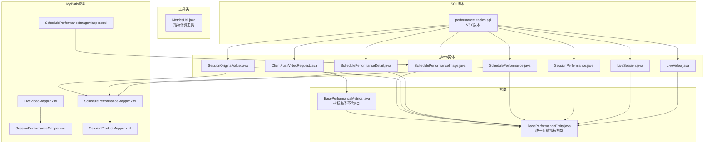
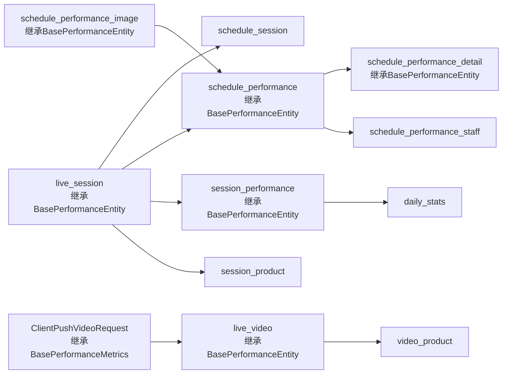

# 数据库表结构

<cite>
**本文引用的文件**
- [performance_tables.sql](file://src/main/resources/sql/performance_tables.sql)
- [LiveVideo.java](file://src/main/java/com/jiuyu/governance/business/performance/pojo/entity/LiveVideo.java)
- [LiveSession.java](file://src/main/java/com/jiuyu/governance/business/performance/pojo/entity/LiveSession.java)
- [SessionPerformance.java](file://src/main/java/com/jiuyu/governance/business/performance/pojo/entity/SessionPerformance.java)
- [SchedulePerformance.java](file://src/main/java/com/jiuyu/governance/business/performance/pojo/entity/SchedulePerformance.java)
- [SchedulePerformanceDetail.java](file://src/main/java/com/jiuyu/governance/business/performance/pojo/entity/SchedulePerformanceDetail.java)
- [SessionOriginalValue.java](file://src/main/java/com/jiuyu/governance/business/performance/pojo/entity/SessionOriginalValue.java)
- [SchedulePerformanceImage.java](file://src/main/java/com/jiuyu/governance/business/performance/pojo/entity/SchedulePerformanceImage.java)
- [BasePerformanceEntity.java](file://src/main/java/com/jiuyu/governance/business/performance/pojo/base/BasePerformanceEntity.java)
- [BasePerformanceMetrics.java](file://src/main/java/com/jiuyu/governance/business/performance/pojo/base/BasePerformanceMetrics.java)
- [ClientPushVideoRequest.java](file://src/main/java/com/jiuyu/governance/business/performance/pojo/request/ClientPushVideoRequest.java)
- [LiveVideoMapper.xml](file://src/main/resources/mapper/performance/LiveVideoMapper.xml)
- [SchedulePerformanceMapper.xml](file://src/main/resources/mapper/performance/SchedulePerformanceMapper.xml)
- [SessionPerformanceMapper.xml](file://src/main/resources/mapper/performance/SessionPerformanceMapper.xml)
- [SessionProductMapper.xml](file://src/main/resources/mapper/performance/SessionProductMapper.xml)
- [SchedulePerformanceImageMapper.xml](file://src/main/resources/mapper/performance/SchedulePerformanceImageMapper.xml)
- [MetricsUtil.java](file://src/main/java/com/jiuyu/governance/business/performance/utils/MetricsUtil.java)
</cite>

## 更新摘要
**变更内容**
- 新增8个核心业绩指标字段：曝光次数、涨粉人数、点击-成交率、互动率、最高在线、带货转化率、UV价值、涨粉率
- 新增schedule_performance_image表支持多指标图片URL存储
- 更新BasePerformanceEntity基类以支持新增指标字段
- 更新所有继承BasePerformanceEntity的表结构定义
- 完善指标计算工具类以支持新增字段的计算逻辑
- 新增ALTER TABLE语句用于数据库字段扩展

## 目录
1. [简介](#简介)
2. [项目结构](#项目结构)
3. [核心组件](#核心组件)
4. [架构概览](#架构概览)
5. [详细组件分析](#详细组件分析)
6. [依赖分析](#依赖分析)
7. [性能考虑](#性能考虑)
8. [故障排查指南](#故障排查指南)
9. [结论](#结论)
10. [附录](#附录)

## 简介
本文件面向数据库管理员与开发者，基于仓库中的数据库脚本与对应的Java实体及MyBatis映射，系统化梳理"业绩模块"数据库表结构。内容涵盖：
- 表结构设计：主键、索引、约束与字段语义
- 业务含义与数据类型选择依据
- 表间关联关系与参照完整性
- 完整DDL与表结构说明
- 最佳实践与性能优化建议
- 参考路径与可视化图示

**更新** 本版本为V8.0，引入了8个新增核心业绩指标字段，包括曝光次数、涨粉人数、点击-成交率、互动率、最高在线、带货转化率、UV价值、涨粉率，以及新增的schedule_performance_image表支持多指标图片URL存储，进一步完善了直播电商的全链路指标体系。

## 项目结构
与"业绩模块"数据库表结构直接相关的文件分布如下：
- SQL脚本：src/main/resources/sql/performance_tables.sql
- Java实体：src/main/java/com/jiuyu/governance/business/performance/pojo/entity/*.java
- 基类：src/main/java/com/jiuyu/governance/business/performance/pojo/base/BasePerformanceEntity.java
- 指标工具：src/main/java/com/jiuyu/governance/business/performance/utils/MetricsUtil.java
- MyBatis映射：src/main/resources/mapper/performance/*.xml

**图表来源**
- [performance_tables.sql](file://src/main/resources/sql/performance_tables.sql)
- [LiveVideo.java](file://src/main/java/com/jiuyu/governance/business/performance/pojo/entity/LiveVideo.java)
- [LiveSession.java](file://src/main/java/com/jiuyu/governance/business/performance/pojo/entity/LiveSession.java)
- [BasePerformanceEntity.java](file://src/main/java/com/jiuyu/governance/business/performance/pojo/base/BasePerformanceEntity.java)
- [BasePerformanceMetrics.java](file://src/main/java/com/jiuyu/governance/business/performance/pojo/base/BasePerformanceMetrics.java)

## 核心组件
本节对"业绩模块"的核心表进行逐表解析，包括业务含义、字段定义、主键/索引/约束、数据类型选择理由以及典型用途。

- 场次表（live_session）
  - 业务含义：存储一场直播的汇总信息，主键使用业务侧推送的会话ID。
  - 主键：id（雪花ID在实体层使用，此处为业务主键）
  - 约束：无显式外键；包含乐观锁版本号与逻辑删除字段
  - 关键索引：无（但实体与查询涉及tenant_id、start_time、end_time等）
  - 典型用途：作为直播场次的聚合入口，支撑后续分摊与统计
  - **新增字段**：exposure_count（曝光次数）、follow_count（涨粉人数）、click_payment_rate（点击-成交率）、interaction_rate（互动率）、max_online（最高在线）、conversion_rate（带货转化率）、uv_value（UV价值）、follow_rate（涨粉率）
  - **统一字段**：继承BasePerformanceEntity基类，包含view_count、sales_revenue、refund、investment、net_sales、roi、thousand_sales、refund_quantity、pay_combo_cnt等

- 视频表（live_video）
  - 业务含义：存储爱复盘推送的每个视频片段
  - 主键：id（雪花ID）
  - 约束：无显式外键；包含处理状态与失败原因字段
  - 关键索引：无（实体与查询涉及tenant_id、batch_number、video_id等）
  - 典型用途：按视频粒度记录业绩指标，支持视频级数据分析
  - **新增字段**：exposure_count、follow_count、click_payment_rate、interaction_rate、max_online、conversion_rate、uv_value、follow_rate
  - **统一字段**：继承BasePerformanceEntity基类，消除字段冗余

- 排班与场次表（schedule_session）
  - 业务含义：存储排班与场次之间的分摊结果
  - 主键：id（雪花ID）
  - 唯一索引：uk_tenant_schedule_session(tenant_id, schedule_id, session_id)
  - 普通索引：idx_tenant_session、idx_tenant_schedule
  - 典型用途：记录分摊后的场观、销售额、退款、投放、净销售额、ROI与重叠时长
  - **统一字段**：继承BasePerformanceEntity基类，包含所有核心业绩指标

- 人员业绩表（staff_performance）
  - 业务含义：存储每个人员（按排班）的业绩汇总
  - 主键：id（雪花ID）
  - 索引：idx_tenant_user、idx_tenant_schedule、idx_tenant_date、idx_tenant_company
  - 典型用途：按用户+排班+日期的维度进行人员业绩归集
  - **统一字段**：继承BasePerformanceEntity基类，包含所有核心业绩指标

- 每日统计表（daily_stats）
  - 业务含义：预聚合的每日统计数据
  - 主键：id（雪花ID）
  - 唯一索引：uk_stats_dimension(tenant_id, stats_date, dimension, company_id, dept_id, team_id, room_id)
  - 索引：idx_tenant_date、idx_tenant_company
  - 典型用途：支持多维度（场次/排班）的每日聚合查询

- 商品表（product）
  - 业务含义：商品基础信息
  - 主键：id（雪花ID）
  - 索引：idx_tenant_name
  - 典型用途：商品维度的基础数据支撑

- 场次商品关联表（session_product）
  - 业务含义：场次与商品的关联，包含商品维度的详细数据
  - 主键：id（雪花ID）
  - 唯一索引：uk_tenant_session_product(tenant_id, session_id, product_id)
  - 索引：idx_tenant_session、idx_tenant_product
  - 典型用途：按场次统计商品销量、销售额、退款、转化率等指标
  - **新增字段**：refund_quantity（退单量）、refund_amount（退款额）、refund_rate（退款率）

- 视频商品表（video_product）
  - 业务含义：存储爱复盘推送的视频关联商品数据
  - 主键：id（雪花ID）
  - 唯一索引：uk_tenant_video_product(tenant_id, video_id, product_id)
  - 索引：idx_tenant_video、idx_tenant_batch、idx_tenant_product
  - 典型用途：按视频粒度的商品曝光、点击、成交、退款等行为数据
  - **新增字段**：product_oss_key（商品过程数据OSS路径）

- 场次业绩表（session_performance）
  - 业务含义：以天为维度的场次业绩数据
  - 主键：id（雪花ID）
  - 索引：idx_tenant_session、idx_tenant_stats_date、idx_tenant_live_room、idx_tenant_company
  - 典型用途：按场次+日期的维度进行业绩统计与趋势分析
  - **新增字段**：refund_quantity（退款单量）、pay_combo_cnt（成交单量）、refund_rate（退款率）、thousand_sales（千次成交）、exposure_count、follow_count、click_payment_rate、interaction_rate、max_online、conversion_rate、uv_value、follow_rate
  - **统一字段**：继承BasePerformanceEntity基类，包含所有核心业绩指标

- 场次原始值表（session_original_value）
  - 业务含义：记录场次业绩数据首次修改前的原始值，用于前端对比显示修改标记
  - 主键：id（雪花ID）
  - 唯一索引：uk_tenant_source(tenant_id, source_id, source_type)
  - 典型用途：保留修改前的关键指标，便于审计与对比
  - **新增字段**：source（数据来源）、refund_quantity、pay_combo_cnt、refund_rate、thousand_sales、exposure_count、follow_count、click_payment_rate、interaction_rate、max_online、conversion_rate、uv_value、follow_rate

- 排班业绩凭证图片表（schedule_performance_image）
  - 业务含义：存储排班业绩的凭证图片URL，与schedule_performance一对一关联
  - 主键：id（与schedule_performance.id关联）
  - 索引：idx_tenant_id
  - 典型用途：保存场观、销售额、退款、投放、净销售额、ROI、曝光次数、涨粉人数、点击-成交率、互动率、最高在线等指标的凭证图片URL
  - **新增字段**：view_count_image_url、sales_revenue_image_url、refund_image_url、investment_image_url、net_sales_image_url、roi_image_url、refund_quantity_image_url、pay_combo_cnt_image_url、exposure_count_image_url、follow_count_image_url、click_payment_rate_image_url、interaction_rate_image_url、max_online_image_url、net_sales_image_url

- 排班业绩人员表（schedule_performance_staff）
  - 业务含义：存储排班业绩参与人员信息
  - 主键：id（雪花ID）
  - 索引：idx_tenant_schedule、idx_employee、idx_position
  - 典型用途：记录主播、运营等人员在排班期间的职责分工

**章节来源**
- [performance_tables.sql](file://src/main/resources/sql/performance_tables.sql)

## 架构概览
从数据流向看，"场次"是核心入口，通过"分摊"将场次指标分配至"排班"，再由"人员业绩"按用户维度归集；"每日统计"作为预聚合层提升查询性能；"商品"维度贯穿于场次与视频层面，形成多维分析能力。新增的8个核心业绩指标字段进一步完善了直播电商的全链路指标体系，消除了跨表字段冗余。新增的schedule_performance_image表支持多指标图片URL存储，提升了数据可视化能力。

```mermaid
erDiagram
LIVE_SESSION {
bigint id PK
bigint tenant_id
bigint live_room_id
varchar batch_number
datetime start_time
datetime end_time
int duration
int view_count
decimal sales_revenue
decimal refund
decimal investment
int refund_quantity
int pay_combo_cnt
decimal net_sales
decimal refund_rate
decimal roi
decimal thousand_sales
int exposure_count
int follow_count
decimal click_payment_rate
decimal interaction_rate
int max_online
decimal conversion_rate
decimal uv_value
decimal follow_rate
varchar oss_url
}
LIVE_VIDEO {
bigint id PK
bigint tenant_id
varchar batch_number
varchar video_id
tinyint has_performance
varchar video_oss_url
datetime start_time
datetime end_time
varchar sec_uid
tinyint platform
tinyint process_status
datetime process_time
longtext fail_reason
datetime data_update_time
int view_count
decimal sales_revenue
decimal refund
decimal investment
int refund_quantity
int pay_combo_cnt
decimal net_sales
decimal refund_rate
decimal roi
decimal thousand_sales
int exposure_count
int follow_count
decimal click_payment_rate
decimal interaction_rate
int max_online
decimal conversion_rate
decimal uv_value
decimal follow_rate
datetime create_date
datetime update_date
tinyint is_deleted
}
SCHEDULE_SESSION {
bigint id PK
bigint tenant_id
bigint schedule_id
bigint session_id
int view_count
decimal sales_revenue
decimal refund
decimal investment
decimal net_sales
decimal roi
int duration
tinyint source
bigint company_id
bigint dept_id
bigint team_id
datetime create_date
datetime update_date
bigint create_by
bigint update_by
tinyint is_deleted
}
STAFF_PERFORMANCE {
bigint id PK
bigint tenant_id
bigint user_id
bigint schedule_id
date stats_date
int view_count
decimal sales_revenue
decimal refund
decimal investment
decimal net_sales
decimal roi
bigint company_id
bigint dept_id
bigint team_id
datetime create_date
datetime update_date
bigint create_by
bigint update_by
tinyint is_deleted
}
DAILY_STATS {
bigint id PK
bigint tenant_id
date stats_date
tinyint dimension
bigint company_id
bigint dept_id
bigint team_id
bigint room_id
int view_count
decimal sales_revenue
decimal refund
decimal investment
decimal net_sales
decimal roi
int session_count
int duration
datetime create_date
datetime update_date
bigint create_by
bigint update_by
tinyint is_deleted
}
PRODUCT {
bigint id PK
bigint tenant_id
varchar name
decimal price
datetime create_date
datetime update_date
bigint create_by
bigint update_by
tinyint is_deleted
}
SESSION_PRODUCT {
bigint id PK
bigint tenant_id
bigint session_id
bigint product_id
int quantity
decimal sales_amount
decimal exposure_click_rate
decimal exposure_conversion_rate
decimal gpm
int refund_quantity
decimal refund_amount
decimal refund_rate
decimal click_payment_rate
bigint company_id
bigint dept_id
bigint team_id
datetime create_date
datetime update_date
bigint create_by
bigint update_by
tinyint is_deleted
}
VIDEO_PRODUCT {
bigint id PK
bigint tenant_id
varchar video_id
varchar batch_number
varchar product_id
varchar title
varchar image_uri
decimal market_price
datetime product_bind_time
datetime product_down_time
int explain_cnt
bigint product_show_ucnt
bigint product_click_ucnt
decimal product_show_click_ucnt_ratio
decimal product_show_pay_ucnt_ratio
decimal product_click_pay_ucnt_ratio
decimal gpm
decimal pay_amt
decimal avg_max_pay_amt_min
bigint pay_combo_cnt
bigint pay_cnt
bigint create_cnt
decimal create_pay_ucnt_ratio
bigint pay_deposit_pre_order_cnt
decimal presale_depay_deamt
decimal pay_deposit_pre_order_amt
bigint refund_cnt
decimal real_refund_amt
decimal refund_rate
varchar product_oss_key
datetime create_date
datetime update_date
bigint create_by
bigint update_by
tinyint is_deleted
}
SESSION_PERFORMANCE {
bigint id PK
bigint tenant_id
bigint session_id
date stats_date
datetime start_time
datetime end_time
varchar sec_uid
tinyint source
int view_count
decimal sales_revenue
decimal refund
decimal investment
decimal net_sales
decimal roi
int refund_quantity
int pay_combo_cnt
decimal refund_rate
decimal thousand_sales
int exposure_count
int follow_count
decimal click_payment_rate
decimal interaction_rate
int max_online
decimal conversion_rate
decimal uv_value
decimal follow_rate
decimal ad_output
bigint live_room_id
bigint company_id
bigint dept_id
bigint team_id
datetime create_date
datetime update_date
bigint create_by
bigint update_by
tinyint is_deleted
}
SESSION_ORIGINAL_VALUE {
bigint id PK
bigint tenant_id
bigint source_id
tinyint source_type
tinyint source
int view_count
decimal sales_revenue
decimal refund
int refund_quantity
decimal investment
int pay_combo_cnt
decimal net_sales
decimal refund_rate
decimal roi
decimal thousand_sales
int exposure_count
int follow_count
decimal click_payment_rate
decimal interaction_rate
int max_online
decimal conversion_rate
decimal uv_value
decimal follow_rate
datetime create_date
bigint create_by
}
SCHEDULE_PERFORMANCE_IMAGE {
bigint id PK
bigint tenant_id
varchar view_count_image_url
varchar sales_revenue_image_url
varchar refund_image_url
varchar investment_image_url
varchar net_sales_image_url
varchar roi_image_url
varchar refund_quantity_image_url
varchar pay_combo_cnt_image_url
varchar exposure_count_image_url
varchar follow_count_image_url
varchar click_payment_rate_image_url
varchar interaction_rate_image_url
varchar max_online_image_url
varchar net_sales_image_url
datetime create_date
datetime update_date
bigint create_by
bigint update_by
tinyint is_deleted
}
SCHEDULE_PERFORMANCE_STAFF {
bigint id PK
bigint tenant_id
bigint schedule_performance_id
bigint employee_id
varchar employee_name
bigint position_id
varchar position_name
datetime create_date
datetime update_date
bigint create_by
bigint update_by
tinyint is_deleted
}
LIVE_SESSION ||--o{ SCHEDULE_SESSION : "分摊"
SCHEDULE_SESSION ||--o{ STAFF_PERFORMANCE : "按排班归集"
LIVE_SESSION ||--o{ SESSION_PERFORMANCE : "按天统计"
LIVE_SESSION ||--o{ SESSION_PRODUCT : "商品关联"
LIVE_VIDEO ||--o{ VIDEO_PRODUCT : "视频-商品映射"
VIDEO_PRODUCT }o--|| SESSION_PRODUCT : "商品维度"
PRODUCT ||--o{ SESSION_PRODUCT : "商品基础"
SESSION_PERFORMANCE ||--o{ DAILY_STATS : "预聚合"
SESSION_ORIGINAL_VALUE ||--|| LIVE_SESSION : "原始值"
SCHEDULE_PERFORMANCE_IMAGE ||--|| SCHEDULE_PERFORMANCE : "凭证图片"
SCHEDULE_PERFORMANCE ||--o{ SCHEDULE_PERFORMANCE_STAFF : "人员参与"
```

**图表来源**
- [performance_tables.sql](file://src/main/resources/sql/performance_tables.sql)

## 详细组件分析

### 场次表（live_session）
- 字段要点
  - 主键：id（业务主键，对应雪花ID）
  - 统计字段：view_count、sales_revenue、refund、investment、net_sales、roi、duration
  - **新增统计字段**：exposure_count（曝光次数）、follow_count（涨粉人数）、click_payment_rate（点击-成交率）、interaction_rate（互动率）、max_online（最高在线）、conversion_rate（带货转化率）、uv_value（UV价值）、follow_rate（涨粉率）
  - 组织维度：company_id、dept_id、team_id
  - 时间范围：start_time、end_time
  - 来源与审计：source、version、create_date、update_date、create_by、update_by、is_deleted
  - **新增字段**：oss_url（实时数据）
- 设计考量
  - 使用大整型主键承载高并发写入与分布式生成需求
  - 采用utf8mb4字符集满足多语言与表情符号
  - 逻辑删除避免物理删除带来的统计与审计问题
  - 新增的8个核心指标字段完善了直播电商的全链路分析能力
  - **统一管理**：继承BasePerformanceEntity基类，确保字段一致性

**章节来源**
- [performance_tables.sql](file://src/main/resources/sql/performance_tables.sql)

### 视频表（live_video）
- 字段要点
  - 主键：id（雪花ID）
  - 视频标识：video_id、batch_number
  - 业绩存在性：has_performance
  - 视频文件：video_oss_url
  - 时间范围：start_time、end_time
  - 处理状态：process_status、process_time、fail_reason
  - **新增性能指标字段**：exposure_count、follow_count、click_payment_rate、interaction_rate、max_online、conversion_rate、uv_value、follow_rate
  - **统一管理**：继承BasePerformanceEntity基类，消除字段冗余
- 设计考量
  - 与直播批次号关联，便于视频与场次的对齐
  - 处理状态字段支持异步处理与重试机制
  - 新增的8个核心指标字段与live_session表保持字段一致性
  - **统一基类**：通过BasePerformanceEntity基类统一管理18个核心指标字段

**章节来源**
- [performance_tables.sql](file://src/main/resources/sql/performance_tables.sql)
- [LiveVideo.java](file://src/main/java/com/jiuyu/governance/business/performance/pojo/entity/LiveVideo.java)

### 排班与场次表（schedule_session）
- 字段要点
  - 主键：id（雪花ID）
  - 唯一索引：tenant_id + schedule_id + session_id
  - 分摊字段：view_count、sales_revenue、refund、investment、net_sales、roi、duration
  - 组织维度：company_id、dept_id、team_id
  - **统一管理**：继承BasePerformanceEntity基类，包含所有核心指标字段
- 设计考量
  - 唯一索引确保同一租户内"排班-场次"组合不重复
  - 重叠时长duration用于精确分摊
  - **统一基类**：通过BasePerformanceEntity基类确保字段一致性

**章节来源**
- [performance_tables.sql](file://src/main/resources/sql/performance_tables.sql)

### 人员业绩表（staff_performance）
- 字段要点
  - 主键：id（雪花ID）
  - 索引：tenant_id + user_id、tenant_id + schedule_id、tenant_id + stats_date、tenant_id + company_id+dept_id+team_id
  - **统一管理**：继承BasePerformanceEntity基类，包含所有核心指标字段
- 设计考量
  - 复合索引覆盖常见查询维度，降低排序与过滤成本
  - **统一基类**：通过BasePerformanceEntity基类确保字段一致性

**章节来源**
- [performance_tables.sql](file://src/main/resources/sql/performance_tables.sql)

### 每日统计表（daily_stats）
- 字段要点
  - 主键：id（雪花ID）
  - 唯一索引：tenant_id + stats_date + dimension + company_id + dept_id + team_id + room_id
  - 维度字段：dimension（场次/排班）、company_id、dept_id、team_id、room_id
  - 统计字段：view_count、sales_revenue、refund、investment、net_sales、roi、session_count、duration
- 设计考量
  - 预聚合减少复杂查询的计算压力
  - 唯一索引保证同维度下每日数据唯一

**章节来源**
- [performance_tables.sql](file://src/main/resources/sql/performance_tables.sql)

### 商品表（product）
- 字段要点
  - 主键：id（雪花ID）
  - 索引：tenant_id + name
- 设计考量
  - 名称字段建立前缀索引，兼顾唯一性与查询效率

**章节来源**
- [performance_tables.sql](file://src/main/resources/sql/performance_tables.sql)

### 场次商品关联表（session_product）
- 字段要点
  - 主键：id（雪花ID）
  - 唯一索引：tenant_id + session_id + product_id
  - 索引：tenant_id + session_id、tenant_id + product_id
  - 商品指标：quantity、sales_amount、refund_quantity、refund_amount、exposure_click_rate、exposure_conversion_rate、gpm、refund_rate、click_payment_rate
  - **新增字段**：refund_quantity（退单量）、refund_amount（退款额）、refund_rate（退款率）
- 设计考量
  - 唯一索引防止重复记录
  - 多种转化率指标支持精细化运营分析

**章节来源**
- [performance_tables.sql](file://src/main/resources/sql/performance_tables.sql)

### 视频商品表（video_product）
- 字段要点
  - 主键：id（雪花ID）
  - 唯一索引：tenant_id + video_id + product_id
  - 索引：tenant_id + video_id、tenant_id + batch_number、tenant_id + product_id
  - 行为指标：曝光人数、点击人数、曝光-点击转化率、曝光-成交转化率、点击-成交转化率、GPM、成交金额、订单数、退款等
  - **新增字段**：product_oss_key（商品过程数据OSS路径，格式：governance-process/.../{productId}.json）
- 设计考量
  - 与视频维度强关联，支撑视频级商品效果分析
  - 新增的OSS路径字段用于存储商品过程数据文件

**章节来源**
- [performance_tables.sql](file://src/main/resources/sql/performance_tables.sql)

### 场次业绩表（session_performance）
- 字段要点
  - 主键：id（雪花ID）
  - 索引：tenant_id + session_id、tenant_id + stats_date、tenant_id + live_room_id、tenant_id + company_id+dept_id+team_id
  - **新增字段**：refund_quantity（退款单量）、pay_combo_cnt（成交单量）、refund_rate（退款率）、thousand_sales（千次成交）、exposure_count、follow_count、click_payment_rate、interaction_rate、max_online、conversion_rate、uv_value、follow_rate
  - **统一管理**：继承BasePerformanceEntity基类，包含所有核心指标字段
- 设计考量
  - 支持按场次、日期、直播间、组织维度的灵活聚合
  - **统一基类**：通过BasePerformanceEntity基类确保字段一致性

**章节来源**
- [performance_tables.sql](file://src/main/resources/sql/performance_tables.sql)

### 场次原始值表（session_original_value）
- 字段要点
  - 主键：id（雪花ID）
  - 唯一索引：tenant_id + source_id + source_type
  - **新增字段**：source（数据来源）、refund_quantity、pay_combo_cnt、refund_rate、thousand_sales、exposure_count、follow_count、click_payment_rate、interaction_rate、max_online、conversion_rate、uv_value、follow_rate
- 设计考量
  - 保留修改前的关键指标，便于审计与对比
  - 新增的数据来源字段支持多种来源类型的区分

**章节来源**
- [performance_tables.sql](file://src/main/resources/sql/performance_tables.sql)

### 排班业绩凭证图片表（schedule_performance_image）
- 字段要点
  - 主键：id（与schedule_performance.id关联）
  - 索引：tenant_id
  - 图片URL：view_count_image_url、sales_revenue_image_url、refund_image_url、investment_image_url、net_sales_image_url、roi_image_url、refund_quantity_image_url、pay_combo_cnt_image_url、exposure_count_image_url、follow_count_image_url、click_payment_rate_image_url、interaction_rate_image_url、max_online_image_url、net_sales_image_url
- 设计考量
  - 一对一关联，便于凭证管理与展示
  - 支持多指标的图片凭证展示，提升数据可视化效果
  - 新增14个图片URL字段，覆盖所有核心业绩指标

**章节来源**
- [performance_tables.sql](file://src/main/resources/sql/performance_tables.sql)
- [SchedulePerformanceImage.java](file://src/main/java/com/jiuyu/governance/business/performance/pojo/entity/SchedulePerformanceImage.java)

### 排班业绩人员表（schedule_performance_staff）
- 字段要点
  - 主键：id（雪花ID）
  - 索引：tenant_id + schedule_performance_id、tenant_id + employee_id、tenant_id + position_id
  - 冗余字段：employee_name、position_name
- 设计考量
  - 支持人员与岗位信息的冗余存储，提升查询性能
  - 便于按人员维度进行业绩统计与分析

**章节来源**
- [performance_tables.sql](file://src/main/resources/sql/performance_tables.sql)

### BasePerformanceEntity基类
- **更新功能**：统一管理18个核心业绩指标字段，包括新增的8个指标
- **统一字段定义**
  - view_count（总观看人次）
  - sales_revenue（销售额，累计，单位：元）
  - refund（退款，累计，单位：元）
  - investment（投放，累计，单位：元）
  - refund_quantity（退款数量，累计）
  - pay_combo_cnt（销售单量）
  - net_sales（净销售额，累计，单位：元）
  - refund_rate（退款率，精确到小数点后两位）
  - roi（投资回报率，ROI，精确到小数点后两位）
  - thousand_sales（千次成交，精确到小数点后两位）
  - exposure_count（曝光次数）
  - follow_count（涨粉人数）
  - click_payment_rate（点击-成交率，精确到小数点后两位）
  - interaction_rate（互动率，精确到小数点后两位）
  - max_online（最高在线）
  - conversion_rate（带货转化率，精确到小数点后两位）
  - uv_value（UV价值，单位：元）
  - follow_rate（涨粉率，精确到小数点后两位）
- **适用实体**：live_session、schedule_performance、schedule_performance_detail、session_performance、session_original_value
- **设计考量**
  - 统一管理业绩实体的18个核心指标字段
  - 新增业绩字段时只需在此基类添加一处，所有子实体自动继承
  - 通过MyBatis-Plus的@TableField注解自动识别父类字段映射
  - 确保所有相关表的字段一致性

**章节来源**
- [BasePerformanceEntity.java](file://src/main/java/com/jiuyu/governance/business/performance/pojo/base/BasePerformanceEntity.java)

### BasePerformanceMetrics基类
- **新增功能**：专门用于BO/Response/Export层的指标管理，继承BasePerformanceEntity
- **适用场景**：业务对象（BO）、响应对象（Response）、导出对象（Export）
- **设计考量**
  - 区分业务层与持久层的指标管理需求
  - 支持Builder模式的链式调用
  - 便于在不同层次间传递和转换指标数据

**章节来源**
- [BasePerformanceMetrics.java](file://src/main/java/com/jiuyu/governance/business/performance/pojo/base/BasePerformanceMetrics.java)

### ClientPushVideoRequest客户端推送请求
- **新增功能**：支持客户端推送视频直播数据
- **字段要点**
  - 继承BasePerformanceMetrics基类，包含所有核心指标字段
  - 直播批次号：batchNumber（必填）
  - 时间范围：startTime、endTime（必填）
  - 主播信息：secUid、platform（必填）
  - 直播过程数据：oceanEngineProcessList（必填）
  - 商品列表：productList（可选）
- **设计考量**
  - 支持OceanEngine直播过程数据的结构化存储
  - 便于与视频商品表进行关联分析
  - 提供完整的直播数据推送接口

**章节来源**
- [ClientPushVideoRequest.java](file://src/main/java/com/jiuyu/governance/business/performance/pojo/request/ClientPushVideoRequest.java)

### 指标计算工具类（MetricsUtil）
- **新增功能**：提供完整的指标计算方法集合
- **核心方法**
  - ROI计算：roi(revenue, cost)
  - 投放产出：calcAdOutput(investment, roi)
  - 退款率：refundRateByOrder(refundOrders, totalOrders)
  - 转化率：conversionRate(payingUsers, visitors)
  - 点击率：clickThroughRate(clicks, impressions)
  - 客单价：averageOrderValue(totalRevenue, payingUsers)
  - 点击-成交率：clickPaymentRate(payComboCnt, productClickUcnt)
  - 互动率：interactionRate(interactionCount, viewCount)
  - 带货转化率：conversionRate(payComboCnt, viewCount)
  - UV价值：uvValue(salesRevenue, viewCount)
  - 涨粉率：followRate(followCount, viewCount)
- **设计考量**
  - 统一的BigDecimal计算，避免精度丢失
  - 完善的空值处理和除零保护
  - 支持自定义小数位数和舍入模式

**章节来源**
- [MetricsUtil.java](file://src/main/java/com/jiuyu/governance/business/performance/utils/MetricsUtil.java)

### Java实体与映射一致性校验
- **实体类与表结构映射**
  - LiveVideo.java 对应 live_video 表，继承 BasePerformanceEntity 基类
  - LiveSession.java 对应 live_session 表，继承 BasePerformanceEntity 基类
  - SessionPerformance.java 对应 session_performance 表，继承 BasePerformanceEntity 基类
  - SchedulePerformance.java 对应 schedule_performance 表，继承 BasePerformanceEntity 基类
  - SchedulePerformanceDetail.java 对应 schedule_performance_detail 表，继承 BasePerformanceEntity 基类
  - SessionOriginalValue.java 对应 session_original_value 表，继承 BasePerformanceEntity 基类
  - SchedulePerformanceImage.java 对应 schedule_performance_image 表，继承 BasePerformanceEntity 基类
  - ClientPushVideoRequest.java 对应客户端推送接口，继承 BasePerformanceMetrics 基类
- **映射文件验证**
  - LiveVideoMapper.xml 中的查询广泛使用了上述表的连接与聚合，体现了表间关系与查询模式
  - SchedulePerformanceMapper.xml 中的查询覆盖了新增的8个指标字段和新的查询场景
  - SessionPerformanceMapper.xml 与 SessionProductMapper.xml 展示了与场次、商品维度的关联查询
  - SchedulePerformanceImageMapper.xml 展示了新增的图片URL字段映射
  - **注意**：LiveVideoMapper.xml中仍保留了旧的cumulative_view和cumulative_refund字段映射，这是为了兼容性考虑

**章节来源**
- [LiveVideo.java](file://src/main/java/com/jiuyu/governance/business/performance/pojo/entity/LiveVideo.java)
- [LiveSession.java](file://src/main/java/com/jiuyu/governance/business/performance/pojo/entity/LiveSession.java)
- [SessionPerformance.java](file://src/main/java/com/jiuyu/governance/business/performance/pojo/entity/SessionPerformance.java)
- [SchedulePerformance.java](file://src/main/java/com/jiuyu/governance/business/performance/pojo/entity/SchedulePerformance.java)
- [SchedulePerformanceDetail.java](file://src/main/java/com/jiuyu/governance/business/performance/pojo/entity/SchedulePerformanceDetail.java)
- [SessionOriginalValue.java](file://src/main/java/com/jiuyu/governance/business/performance/pojo/entity/SessionOriginalValue.java)
- [SchedulePerformanceImage.java](file://src/main/java/com/jiuyu/governance/business/performance/pojo/entity/SchedulePerformanceImage.java)
- [ClientPushVideoRequest.java](file://src/main/java/com/jiuyu/governance/business/performance/pojo/request/ClientPushVideoRequest.java)
- [LiveVideoMapper.xml](file://src/main/resources/mapper/performance/LiveVideoMapper.xml)
- [SchedulePerformanceMapper.xml](file://src/main/resources/mapper/performance/SchedulePerformanceMapper.xml)
- [SessionPerformanceMapper.xml](file://src/main/resources/mapper/performance/SessionPerformanceMapper.xml)
- [SessionProductMapper.xml](file://src/main/resources/mapper/performance/SessionProductMapper.xml)
- [SchedulePerformanceImageMapper.xml](file://src/main/resources/mapper/performance/SchedulePerformanceImageMapper.xml)

## 依赖分析
- **查询依赖**
  - 排班业绩查询依赖 schedule_performance 与 schedule_performance_staff 的连接
  - 员工业绩统计依赖 schedule_performance 与 schedule_performance_staff 的分组聚合
  - 场次商品排行依赖 session_product 与 live_session 的关联
  - 视频商品分析依赖 video_product 与 live_video 的关联
  - 客户端推送数据依赖 ClientPushVideoRequest 与相关业务流程
  - **新增**：排班业绩图片查询依赖 schedule_performance_image 与 schedule_performance 的一对一关联
- **维度依赖**
  - 人员维度：schedule_performance_staff
  - 商品维度：session_product 与 product
  - 时间维度：session_performance 与 daily_stats
  - 视频维度：live_video 与 video_product
  - 排班维度：schedule_performance 与 schedule_session
  - **新增**：图片维度：schedule_performance_image 与各指标的图片URL关联
- **索引依赖**
  - 多数查询依赖 tenant_id 与时间/组织维度的复合索引，需确保索引命中
  - **新增索引需求**：为session_performance表的新增指标字段建立合适的索引
  - **统一基类影响**：所有继承BasePerformanceEntity的表都共享相同的字段结构
  - **新增索引需求**：为schedule_performance_image表的14个图片URL字段建立索引
- **兼容性依赖**
  - LiveVideoMapper.xml中保留了旧字段映射以确保向后兼容
  - BasePerformanceEntity基类确保新旧字段的一致性
  - ClientPushVideoRequest与BasePerformanceMetrics的继承关系确保指标字段一致性
  - **新增**：SchedulePerformanceImage实体类确保图片URL字段的正确映射

**图表来源**
- [LiveVideo.java](file://src/main/java/com/jiuyu/governance/business/performance/pojo/entity/LiveVideo.java)
- [LiveSession.java](file://src/main/java/com/jiuyu/governance/business/performance/pojo/entity/LiveSession.java)
- [SchedulePerformance.java](file://src/main/java/com/jiuyu/governance/business/performance/pojo/entity/SchedulePerformance.java)
- [BasePerformanceEntity.java](file://src/main/java/com/jiuyu/governance/business/performance/pojo/base/BasePerformanceEntity.java)
- [BasePerformanceMetrics.java](file://src/main/java/com/jiuyu/governance/business/performance/pojo/base/BasePerformanceMetrics.java)
- [ClientPushVideoRequest.java](file://src/main/java/com/jiuyu/governance/business/performance/pojo/request/ClientPushVideoRequest.java)
- [SchedulePerformanceImage.java](file://src/main/java/com/jiuyu/governance/business/performance/pojo/entity/SchedulePerformanceImage.java)
- [performance_tables.sql](file://src/main/resources/sql/performance_tables.sql)

**章节来源**
- [LiveVideo.java](file://src/main/java/com/jiuyu/governance/business/performance/pojo/entity/LiveVideo.java)
- [LiveSession.java](file://src/main/java/com/jiuyu/governance/business/performance/pojo/entity/LiveSession.java)
- [SchedulePerformance.java](file://src/main/java/com/jiuyu/governance/business/performance/pojo/entity/SchedulePerformance.java)
- [BasePerformanceEntity.java](file://src/main/java/com/jiuyu/governance/business/performance/pojo/base/BasePerformanceEntity.java)
- [BasePerformanceMetrics.java](file://src/main/java/com/jiuyu/governance/business/performance/pojo/base/BasePerformanceMetrics.java)
- [ClientPushVideoRequest.java](file://src/main/java/com/jiuyu/governance/business/performance/pojo/request/ClientPushVideoRequest.java)
- [SchedulePerformanceImage.java](file://src/main/java/com/jiuyu/governance/business/performance/pojo/entity/SchedulePerformanceImage.java)
- [SchedulePerformanceMapper.xml](file://src/main/resources/mapper/performance/SchedulePerformanceMapper.xml)
- [SessionPerformanceMapper.xml](file://src/main/resources/mapper/performance/SessionPerformanceMapper.xml)
- [SessionProductMapper.xml](file://src/main/resources/mapper/performance/SessionProductMapper.xml)
- [SchedulePerformanceImageMapper.xml](file://src/main/resources/mapper/performance/SchedulePerformanceImageMapper.xml)

## 性能考虑
- **索引策略**
  - 优先保证 tenant_id + 时间/组织维度的复合索引命中
  - 对高频过滤字段（如 live_room_id、stats_date、user_id、product_id）建立合适索引
  - **新增索引需求**：为session_performance表的8个新增指标字段建立索引以支持高效查询
  - **统一基类影响**：所有继承BasePerformanceEntity的表共享相同的字段结构，便于统一索引策略
  - **新增索引需求**：为schedule_performance_image表的14个图片URL字段建立索引
- **聚合与预计算**
  - 利用 daily_stats 进行预聚合，减少复杂查询的计算开销
  - **新增预聚合字段**：考虑在预聚合表中加入新增的8个核心指标字段
  - **统一基类优势**：通过BasePerformanceEntity基类统一管理字段，简化预聚合逻辑
  - **新增预计算**：利用MetricsUtil工具类进行高效的指标计算
- **写入与分摊**
  - 分摊过程尽量批量执行，避免频繁小事务
  - **新增字段处理**：在分摊过程中同时处理新增的8个核心指标字段
  - **统一基类简化**：通过基类统一字段管理，减少分摊逻辑的复杂性
  - **新增写入优化**：ClientPushVideoRequest支持批量推送直播数据
- **读写分离**
  - 将报表类查询路由至只读副本，降低主库压力
  - **新增查询场景**：支持按新增指标字段的报表查询
  - **统一基类查询**：所有继承基类的表都可以使用相同的查询模式
  - **新增查询优化**：排班业绩查询支持多维度聚合统计
  - **新增**：图片URL查询支持快速数据可视化
- **监控与调优**
  - 关注慢查询日志，定期分析执行计划与索引使用情况
  - **新增监控指标**：监控新增8个核心指标字段的查询性能
  - **基类监控**：通过统一基类监控所有核心指标字段的使用情况
  - **新增监控**：监控客户端推送数据的处理性能和成功率
  - **新增**：监控图片URL存储的性能和访问效率

## 故障排查指南
- **常见问题**
  - 数据重复：检查唯一索引是否被绕过或并发冲突导致
  - 查询性能差：确认复合索引是否命中，必要时调整查询条件顺序
  - 逻辑删除误删：确认 is_deleted 字段的使用与清理策略
  - **新增问题**：BasePerformanceEntity基类字段映射错误，检查子类是否正确继承
  - **新增问题**：新增指标字段在旧版本实体中缺失，检查实体类与数据库表结构一致性
  - **新增问题**：ClientPushVideoRequest字段映射不一致，检查与数据库表结构的对应关系
  - **新增问题**：MetricsUtil计算异常，检查BigDecimal参数和除零保护
  - **新增问题**：SchedulePerformanceImage图片URL字段映射错误
  - **兼容性问题**：LiveVideoMapper.xml中旧字段映射与新字段的冲突
- **排查步骤**
  - 核对表结构与实体映射一致性
  - 检查Mapper中的连接条件与聚合逻辑
  - 对比历史快照与当前数据，定位异常区间
  - **新增步骤**：验证BasePerformanceEntity基类的字段映射是否正确应用到所有子实体
  - **新增步骤**：检查ClientPushVideoRequest与数据库表结构的字段对应关系
  - **新增步骤**：验证MetricsUtil工具类的计算逻辑和边界条件处理
  - **新增步骤**：验证SchedulePerformanceImage实体类的14个图片URL字段映射
  - **兼容性检查**：确认旧字段映射与新字段映射的共存策略
- **迁移注意事项**
  - 确保所有继承BasePerformanceEntity的表都正确映射字段
  - 验证向后兼容性，确保旧版本代码仍能正常工作
  - 测试新增指标字段的业务逻辑和计算公式
  - **新增注意事项**：验证ClientPushVideoRequest的字段映射和数据验证规则
  - **新增注意事项**：测试MetricsUtil工具类在各种边界条件下的表现
  - **新增注意事项**：验证SchedulePerformanceImage的图片URL字段映射和存储逻辑

**章节来源**
- [BasePerformanceEntity.java](file://src/main/java/com/jiuyu/governance/business/performance/pojo/base/BasePerformanceEntity.java)
- [BasePerformanceMetrics.java](file://src/main/java/com/jiuyu/governance/business/performance/pojo/base/BasePerformanceMetrics.java)
- [ClientPushVideoRequest.java](file://src/main/java/com/jiuyu/governance/business/performance/pojo/request/ClientPushVideoRequest.java)
- [LiveVideo.java](file://src/main/java/com/jiuyu/governance/business/performance/pojo/entity/LiveVideo.java)
- [SchedulePerformanceImage.java](file://src/main/java/com/jiuyu/governance/business/performance/pojo/entity/SchedulePerformanceImage.java)
- [LiveVideoMapper.xml](file://src/main/resources/mapper/performance/LiveVideoMapper.xml)
- [SchedulePerformanceMapper.xml](file://src/main/resources/mapper/performance/SchedulePerformanceMapper.xml)
- [SessionPerformanceMapper.xml](file://src/main/resources/mapper/performance/SessionPerformanceMapper.xml)
- [SessionProductMapper.xml](file://src/main/resources/mapper/performance/SessionProductMapper.xml)
- [SchedulePerformanceImageMapper.xml](file://src/main/resources/mapper/performance/SchedulePerformanceImageMapper.xml)
- [MetricsUtil.java](file://src/main/java/com/jiuyu/governance/business/performance/utils/MetricsUtil.java)

## 结论
本数据库表结构围绕"场次—排班—人员—商品—时间—组织—视频—图片"多维视角构建，既满足实时业务写入，又通过预聚合与索引策略保障查询性能。**重大更新**：新增的8个核心业绩指标字段（曝光次数、涨粉人数、点击-成交率、互动率、最高在线、带货转化率、UV价值、涨粉率）进一步完善了直播电商的全链路指标体系，消除了跨表字段冗余。**新增功能**：新增的schedule_performance_image表支持14个指标的图片URL存储，提升了数据可视化能力。**版本升级**：schema版本升级至V8.0，标志着系统在直播电商分析、数据推送、可视化展示和图片凭证管理方面的重要里程碑。建议在生产环境中持续监控索引使用与查询性能，并根据业务增长迭代优化。

## 附录
- **完整DDL参考路径**
  - [performance_tables.sql](file://src/main/resources/sql/performance_tables.sql)
- **Java实体参考路径**
  - [LiveVideo.java](file://src/main/java/com/jiuyu/governance/business/performance/pojo/entity/LiveVideo.java)
  - [LiveSession.java](file://src/main/java/com/jiuyu/governance/business/performance/pojo/entity/LiveSession.java)
  - [SessionPerformance.java](file://src/main/java/com/jiuyu/governance/business/performance/pojo/entity/SessionPerformance.java)
  - [SchedulePerformance.java](file://src/main/java/com/jiuyu/governance/business/performance/pojo/entity/SchedulePerformance.java)
  - [SchedulePerformanceDetail.java](file://src/main/java/com/jiuyu/governance/business/performance/pojo/entity/SchedulePerformanceDetail.java)
  - [SessionOriginalValue.java](file://src/main/java/com/jiuyu/governance/business/performance/pojo/entity/SessionOriginalValue.java)
  - [SchedulePerformanceImage.java](file://src/main/java/com/jiuyu/governance/business/performance/pojo/entity/SchedulePerformanceImage.java)
  - [BasePerformanceEntity.java](file://src/main/java/com/jiuyu/governance/business/performance/pojo/base/BasePerformanceEntity.java)
  - [BasePerformanceMetrics.java](file://src/main/java/com/jiuyu/governance/business/performance/pojo/base/BasePerformanceMetrics.java)
  - [ClientPushVideoRequest.java](file://src/main/java/com/jiuyu/governance/business/performance/pojo/request/ClientPushVideoRequest.java)
- **MyBatis映射参考路径**
  - [LiveVideoMapper.xml](file://src/main/resources/mapper/performance/LiveVideoMapper.xml)
  - [SchedulePerformanceMapper.xml](file://src/main/resources/mapper/performance/SchedulePerformanceMapper.xml)
  - [SessionPerformanceMapper.xml](file://src/main/resources/mapper/performance/SessionPerformanceMapper.xml)
  - [SessionProductMapper.xml](file://src/main/resources/mapper/performance/SessionProductMapper.xml)
  - [SchedulePerformanceImageMapper.xml](file://src/main/resources/mapper/performance/SchedulePerformanceImageMapper.xml)
- **工具类参考路径**
  - [MetricsUtil.java](file://src/main/java/com/jiuyu/governance/business/performance/utils/MetricsUtil.java)