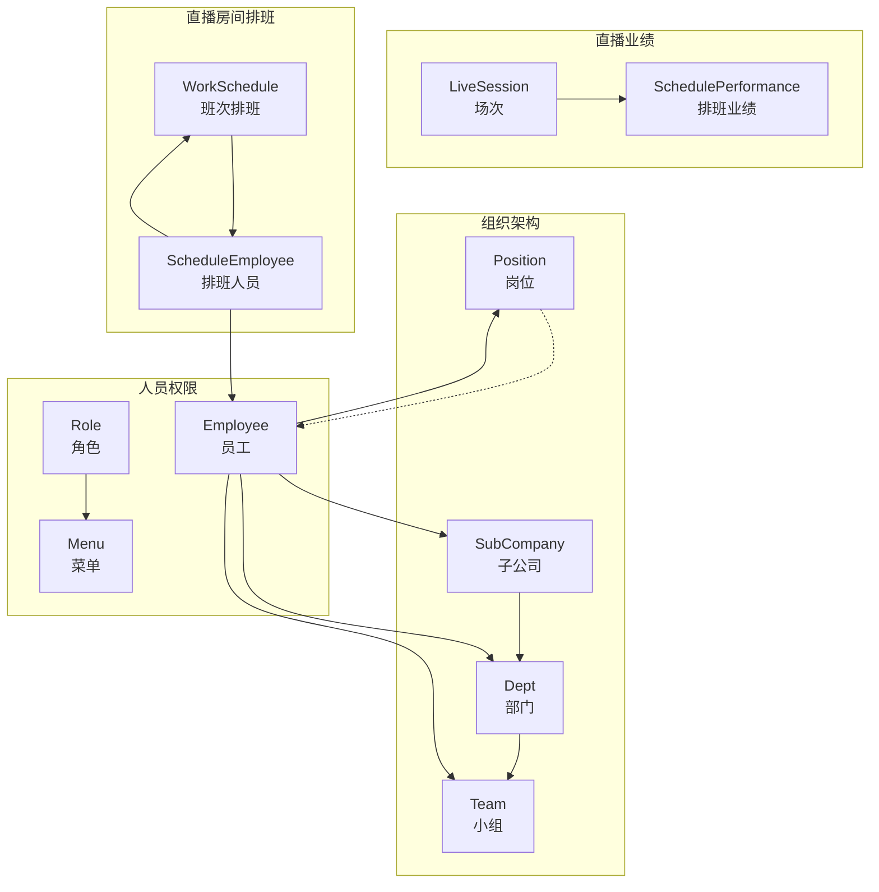
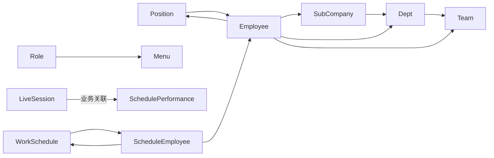

# 数据模型

<cite>
**本文引用的文件**
- [SubCompany.java](file://src/main/java/com/jiuyu/governance/business/org/pojo/entity/SubCompany.java)
- [Dept.java](file://src/main/java/com/jiuyu/governance/business/org/pojo/entity/Dept.java)
- [Team.java](file://src/main/java/com/jiuyu/governance/business/org/pojo/entity/Team.java)
- [Position.java](file://src/main/java/com/jiuyu/governance/business/org/pojo/entity/Position.java)
- [Employee.java](file://src/main/java/com/jiuyu/governance/business/rbac/pojo/entity/Employee.java)
- [Role.java](file://src/main/java/com/jiuyu/governance/business/rbac/pojo/entity/Role.java)
- [Menu.java](file://src/main/java/com/jiuyu/governance/business/rbac/pojo/entity/Menu.java)
- [LiveSession.java](file://src/main/java/com/jiuyu/governance/business/performance/pojo/entity/LiveSession.java)
- [SchedulePerformance.java](file://src/main/java/com/jiuyu/governance/business/performance/pojo/entity/SchedulePerformance.java)
- [WorkSchedule.java](file://src/main/java/com/jiuyu/governance/business/room/pojo/entity/WorkSchedule.java)
- [ScheduleEmployee.java](file://src/main/java/com/jiuyu/governance/business/room/pojo/entity/ScheduleEmployee.java)
- [performance_tables.sql](file://src/main/resources/sql/performance_tables.sql)
</cite>

## 目录
1. [简介](#简介)
2. [项目结构](#项目结构)
3. [核心组件](#核心组件)
4. [架构总览](#架构总览)
5. [详细组件分析](#详细组件分析)
6. [依赖分析](#依赖分析)
7. [性能考量](#性能考量)
8. [故障排查指南](#故障排查指南)
9. [结论](#结论)
10. [附录](#附录)

## 简介
本文件面向数据库设计师与开发者，系统性梳理 fupan-governance-server 的数据模型，覆盖组织架构、人员权限、直播业绩与直播房间排班四大主题域。文档从实体设计、字段定义、约束与索引、关联关系与外键、到数据访问模式与性能优化策略进行完整说明，并提供可视化图示与可追溯的来源定位。

## 项目结构
围绕数据模型的关键代码与脚本分布如下：
- 组织架构实体：SubCompany、Dept、Team、Position
- 人员权限实体：Employee、Role、Menu
- 直播业绩实体：LiveSession、SchedulePerformance（含图片凭证）
- 直播房间排班实体：WorkSchedule、ScheduleEmployee
- 业绩模块建表脚本：performance_tables.sql

图表来源
- [SubCompany.java:19-84](file://src/main/java/com/jiuyu/governance/business/org/pojo/entity/SubCompany.java#L19-L84)
- [Dept.java:19-91](file://src/main/java/com/jiuyu/governance/business/org/pojo/entity/Dept.java#L19-L91)
- [Team.java:19-99](file://src/main/java/com/jiuyu/governance/business/org/pojo/entity/Team.java#L19-L99)
- [Position.java:19-98](file://src/main/java/com/jiuyu/governance/business/org/pojo/entity/Position.java#L19-L98)
- [Employee.java:23-170](file://src/main/java/com/jiuyu/governance/business/rbac/pojo/entity/Employee.java#L23-L170)
- [Role.java:19-70](file://src/main/java/com/jiuyu/governance/business/rbac/pojo/entity/Role.java#L19-L70)
- [Menu.java:23-110](file://src/main/java/com/jiuyu/governance/business/rbac/pojo/entity/Menu.java#L23-L110)
- [LiveSession.java:18-172](file://src/main/java/com/jiuyu/governance/business/performance/pojo/entity/LiveSession.java#L18-L172)
- [SchedulePerformance.java:18-159](file://src/main/java/com/jiuyu/governance/business/performance/pojo/entity/SchedulePerformance.java#L18-L159)
- [WorkSchedule.java:23-189](file://src/main/java/com/jiuyu/governance/business/room/pojo/entity/WorkSchedule.java#L23-L189)
- [ScheduleEmployee.java:19-97](file://src/main/java/com/jiuyu/governance/business/room/pojo/entity/ScheduleEmployee.java#L19-L97)

章节来源
- [SubCompany.java:1-85](file://src/main/java/com/jiuyu/governance/business/org/pojo/entity/SubCompany.java#L1-L85)
- [Dept.java:1-92](file://src/main/java/com/jiuyu/governance/business/org/pojo/entity/Dept.java#L1-L92)
- [Team.java:1-100](file://src/main/java/com/jiuyu/governance/business/org/pojo/entity/Team.java#L1-L100)
- [Position.java:1-99](file://src/main/java/com/jiuyu/governance/business/org/pojo/entity/Position.java#L1-L99)
- [Employee.java:1-171](file://src/main/java/com/jiuyu/governance/business/rbac/pojo/entity/Employee.java#L1-L171)
- [Role.java:1-71](file://src/main/java/com/jiuyu/governance/business/rbac/pojo/entity/Role.java#L1-L71)
- [Menu.java:1-111](file://src/main/java/com/jiuyu/governance/business/rbac/pojo/entity/Menu.java#L1-L111)
- [LiveSession.java:1-173](file://src/main/java/com/jiuyu/governance/business/performance/pojo/entity/LiveSession.java#L1-L173)
- [SchedulePerformance.java:1-160](file://src/main/java/com/jiuyu/governance/business/performance/pojo/entity/SchedulePerformance.java#L1-L160)
- [WorkSchedule.java:1-190](file://src/main/java/com/jiuyu/governance/business/room/pojo/entity/WorkSchedule.java#L1-L190)
- [ScheduleEmployee.java:1-98](file://src/main/java/com/jiuyu/governance/business/room/pojo/entity/ScheduleEmployee.java#L1-L98)
- [performance_tables.sql:1-311](file://src/main/resources/sql/performance_tables.sql#L1-L311)

## 核心组件
本节对各实体的职责、关键字段与约束进行概览式说明，便于快速建立整体认知。

- 组织架构
  - SubCompany：企业级组织单元，包含租户标识、名称、时间戳、排序与逻辑删除字段。
  - Dept：部门实体，关联所属公司与租户，具备标准审计字段与排序。
  - Team：小组实体，关联公司与部门，支持租户隔离。
  - Position：岗位实体，支持默认岗位与岗位编码，便于系统内枚举查询。

- 人员权限
  - Employee：员工档案，包含姓名、工号、手机、邮箱、所属组织链路、岗位、账号状态与密码等。
  - Role：角色实体，支持默认角色标记。
  - Menu：菜单实体，支持类型、排序、图标、权限码与父子路径集合存储。

- 直播业绩
  - LiveSession：直播场次汇总表，记录场次起止、时长、场观、销售、退款、投放、净销售额、ROI、OSS地址、来源、乐观锁与逻辑删除。
  - SchedulePerformance：排班业绩表，记录排班期的场观、销售、退款、投放、净销售额、ROI、投放产出、来源与组织维度。

- 直播房间排班
  - WorkSchedule：班次排班，记录班次归属日、开始/结束工作时间（整型编码）、直播房间、时长与休息时长等。
  - ScheduleEmployee：排班人员明细，绑定员工、岗位、排班计划与班次归属日。

章节来源
- [SubCompany.java:19-84](file://src/main/java/com/jiuyu/governance/business/org/pojo/entity/SubCompany.java#L19-L84)
- [Dept.java:19-91](file://src/main/java/com/jiuyu/governance/business/org/pojo/entity/Dept.java#L19-L91)
- [Team.java:19-99](file://src/main/java/com/jiuyu/governance/business/org/pojo/entity/Team.java#L19-L99)
- [Position.java:19-98](file://src/main/java/com/jiuyu/governance/business/org/pojo/entity/Position.java#L19-L98)
- [Employee.java:23-170](file://src/main/java/com/jiuyu/governance/business/rbac/pojo/entity/Employee.java#L23-L170)
- [Role.java:19-70](file://src/main/java/com/jiuyu/governance/business/rbac/pojo/entity/Role.java#L19-L70)
- [Menu.java:23-110](file://src/main/java/com/jiuyu/governance/business/rbac/pojo/entity/Menu.java#L23-L110)
- [LiveSession.java:18-172](file://src/main/java/com/jiuyu/governance/business/performance/pojo/entity/LiveSession.java#L18-L172)
- [SchedulePerformance.java:18-159](file://src/main/java/com/jiuyu/governance/business/performance/pojo/entity/SchedulePerformance.java#L18-L159)
- [WorkSchedule.java:23-189](file://src/main/java/com/jiuyu/governance/business/room/pojo/entity/WorkSchedule.java#L23-L189)
- [ScheduleEmployee.java:19-97](file://src/main/java/com/jiuyu/governance/business/room/pojo/entity/ScheduleEmployee.java#L19-L97)

## 架构总览
以下 ER 图展示实体间的关联关系与外键约束方向，帮助理解组织链路、人员归属与业务数据流转。

```mermaid
erDiagram
SUB_COMPANY {
bigint id PK
bigint tenant_id
string name
datetime create_date
datetime update_date
bigint create_by
bigint update_by
int sort
boolean is_deleted
}
DEPT {
bigint id PK
bigint tenant_id
string name
bigint company_id FK
datetime create_date
datetime update_date
bigint create_by
bigint update_by
int sort
boolean is_deleted
}
TEAM {
bigint id PK
bigint tenant_id
string name
bigint company_id FK
bigint dept_id FK
datetime create_date
datetime update_date
bigint create_by
bigint update_by
int sort
boolean is_deleted
}
POSITION {
bigint id PK
bigint tenant_id
string name
datetime create_date
datetime update_date
bigint create_by
bigint update_by
int sort
boolean is_deleted
boolean is_default
string position_code
}
EMPLOYEE {
bigint id PK
datetime create_date
datetime update_date
bigint create_by
bigint update_by
boolean is_deleted
bigint tenant_id
boolean hold_tenant
string name
string user_avatar
string staff_number
string mobile
string email
bigint company_id FK
bigint dept_id FK
bigint team_id FK
bigint position_id FK
boolean on_rec
bigint connector_client_user_id
enum job_type
enum account_status
string password
}
ROLE {
bigint id PK
bigint tenant_id
string name
datetime create_date
datetime update_date
boolean is_deleted
boolean is_default
}
MENU {
bigint id PK
bigint parent_id
string name
string url
enum type
int sort
string img
datetime create_date
datetime update_date
string permission_code
boolean is_deleted
long_list parent_path_ids
}
LIVE_SESSION {
bigint id PK
bigint tenant_id
bigint live_room_id
string batch_number
datetime start_time
datetime end_time
int duration
int view_count
decimal sales_revenue
decimal refund
decimal investment
decimal net_sales
decimal roi
string oss_url
bigint company_id
bigint dept_id
bigint team_id
int source
int version
datetime create_date
datetime update_date
bigint create_by
bigint update_by
int is_deleted
}
SCHEDULE_PERFORMANCE {
bigint id PK
bigint tenant_id
bigint schedule_id
bigint live_room_id
datetime start_time
datetime end_time
string sec_uid
int source
int view_count
decimal sales_revenue
decimal refund
decimal investment
decimal net_sales
decimal roi
decimal ad_output
bigint company_id
bigint dept_id
bigint team_id
datetime create_date
datetime update_date
bigint create_by
bigint update_by
boolean is_deleted
}
WORK_SCHEDULE {
bigint id PK
datetime create_date
datetime update_date
bigint create_by
bigint update_by
boolean is_deleted
bigint tenant_id
date work_day
int start_work
int end_work
bigint live_room_id
string remark
int schedule_duration
int rest_duration
}
SCHEDULE_EMPLOYEE {
bigint id PK
datetime create_date
datetime update_date
bigint create_by
bigint update_by
boolean is_deleted
bigint live_room_id
bigint employee_id FK
bigint position_id FK
bigint schedule_id FK
date work_day
}
SUB_COMPANY ||--o{ DEPT : "拥有"
DEPT ||--o{ TEAM : "拥有"
POSITION ||--o{ EMPLOYEE : "被分配"
EMPLOYEE }o--|| SUB_COMPANY : "属于"
EMPLOYEE }o--|| DEPT : "属于"
EMPLOYEE }o--|| TEAM : "属于"
EMPLOYEE }o--|| POSITION : "拥有"
ROLE ||--o{ MENU : "授权"
LIVE_SESSION ||--o{ SCHEDULE_PERFORMANCE : "派生/关联"
WORK_SCHEDULE ||--o{ SCHEDULE_EMPLOYEE : "包含"
SCHEDULE_EMPLOYEE }o--|| EMPLOYEE : "绑定"
SCHEDULE_EMPLOYEE }o--|| WORK_SCHEDULE : "绑定"
```

图表来源
- [SubCompany.java:19-84](file://src/main/java/com/jiuyu/governance/business/org/pojo/entity/SubCompany.java#L19-L84)
- [Dept.java:19-91](file://src/main/java/com/jiuyu/governance/business/org/pojo/entity/Dept.java#L19-L91)
- [Team.java:19-99](file://src/main/java/com/jiuyu/governance/business/org/pojo/entity/Team.java#L19-L99)
- [Position.java:19-98](file://src/main/java/com/jiuyu/governance/business/org/pojo/entity/Position.java#L19-L98)
- [Employee.java:23-170](file://src/main/java/com/jiuyu/governance/business/rbac/pojo/entity/Employee.java#L23-L170)
- [Role.java:19-70](file://src/main/java/com/jiuyu/governance/business/rbac/pojo/entity/Role.java#L19-L70)
- [Menu.java:23-110](file://src/main/java/com/jiuyu/governance/business/rbac/pojo/entity/Menu.java#L23-L110)
- [LiveSession.java:18-172](file://src/main/java/com/jiuyu/governance/business/performance/pojo/entity/LiveSession.java#L18-L172)
- [SchedulePerformance.java:18-159](file://src/main/java/com/jiuyu/governance/business/performance/pojo/entity/SchedulePerformance.java#L18-L159)
- [WorkSchedule.java:23-189](file://src/main/java/com/jiuyu/governance/business/room/pojo/entity/WorkSchedule.java#L23-L189)
- [ScheduleEmployee.java:19-97](file://src/main/java/com/jiuyu/governance/business/room/pojo/entity/ScheduleEmployee.java#L19-L97)

## 详细组件分析

### 组织架构实体
- SubCompany（子公司）
  - 字段要点：租户ID、名称、排序、创建/更新时间与操作人、逻辑删除。
  - 设计原则：统一租户隔离；主键采用分布式ID策略。
- Dept（部门）
  - 字段要点：所属公司ID外键、租户ID、名称、排序与审计字段。
  - 设计原则：部门隶属于公司，支持多租户。
- Team（小组）
  - 字段要点：公司与部门双外键、租户ID、名称、排序与审计字段。
  - 设计原则：小组隶属于部门，形成清晰的组织层级。
- Position（岗位）
  - 字段要点：租户ID、名称、默认岗位标记、岗位编码（用于系统枚举）。
  - 设计原则：默认岗位支持统一配置与查询。

章节来源
- [SubCompany.java:19-84](file://src/main/java/com/jiuyu/governance/business/org/pojo/entity/SubCompany.java#L19-L84)
- [Dept.java:19-91](file://src/main/java/com/jiuyu/governance/business/org/pojo/entity/Dept.java#L19-L91)
- [Team.java:19-99](file://src/main/java/com/jiuyu/governance/business/org/pojo/entity/Team.java#L19-L99)
- [Position.java:19-98](file://src/main/java/com/jiuyu/governance/business/org/pojo/entity/Position.java#L19-L98)

### 人员权限实体
- Employee（员工）
  - 字段要点：姓名、工号、手机、邮箱、所属公司/部门/小组/岗位、岗位类型、账号状态、密码等。
  - 设计原则：统一身份与权限入口；支持租户管理员标记；与组织链路强关联。
- Role（角色）
  - 字段要点：租户ID、名称、默认角色标记。
  - 设计原则：角色与菜单授权解耦，支持默认角色。
- Menu（菜单）
  - 字段要点：父菜单ID、名称、URL、类型、排序、图标、权限码、父子路径集合。
  - 设计原则：支持树形结构与权限码控制；父子路径集合便于快速检索祖先。

章节来源
- [Employee.java:23-170](file://src/main/java/com/jiuyu/governance/business/rbac/pojo/entity/Employee.java#L23-L170)
- [Role.java:19-70](file://src/main/java/com/jiuyu/governance/business/rbac/pojo/entity/Role.java#L19-L70)
- [Menu.java:23-110](file://src/main/java/com/jiuyu/governance/business/rbac/pojo/entity/Menu.java#L23-L110)

### 直播业绩实体
- LiveSession（场次）
  - 字段要点：直播房间ID、批次号、起止时间、时长、场观、销售、退款、投放、净销售额、ROI、OSS地址、组织维度、来源、乐观锁版本、逻辑删除。
  - 设计原则：以会话为中心的汇总表，承载实时数据链接与多维统计。
- SchedulePerformance（排班业绩）
  - 字段要点：排班ID、直播房间、起止时间、主播SecUid、来源、场观、销售、退款、投放、净销售额、ROI、投放产出、组织维度。
  - 设计原则：按排班期聚合，支持系统或手动来源；与凭证图片表一对一关联。

章节来源
- [LiveSession.java:18-172](file://src/main/java/com/jiuyu/governance/business/performance/pojo/entity/LiveSession.java#L18-L172)
- [SchedulePerformance.java:18-159](file://src/main/java/com/jiuyu/governance/business/performance/pojo/entity/SchedulePerformance.java#L18-L159)

### 直播房间排班实体
- WorkSchedule（班次排班）
  - 字段要点：班次归属日、开始/结束工作时间（整型编码格式“月日时分”）、直播房间、备注、班次/休息时长。
  - 设计原则：时间编码简化存储与计算；支持跨日边界处理。
- ScheduleEmployee（排班人员）
  - 字段要点：直播房间、员工、岗位、排班计划、班次归属日。
  - 设计原则：人员与排班的多维绑定，支撑考勤与绩效分摊。

章节来源
- [WorkSchedule.java:23-189](file://src/main/java/com/jiuyu/governance/business/room/pojo/entity/WorkSchedule.java#L23-L189)
- [ScheduleEmployee.java:19-97](file://src/main/java/com/jiuyu/governance/business/room/pojo/entity/ScheduleEmployee.java#L19-L97)

### 业绩模块数据库表结构
- 表清单与关键索引
  - live_session：主键ID；包含租户、房间、批次、起止时间、时长、场观、销售、退款、投放、净销售额、ROI、OSS地址、组织维度、来源、乐观锁、逻辑删除。
  - live_video：主键ID；包含租户、批次、视频ID、业绩存在标记、视频OSS地址、起止时间、场观、销售、退款、投放、主播SecUid、处理状态与时间、失败原因、逻辑删除。
  - schedule_session：主键ID；唯一索引(tenant_id, schedule_id, session_id)；普通索引(idx_tenant_session, idx_tenant_schedule)。
  - staff_performance：主键ID；多维索引(idx_tenant_user, idx_tenant_schedule, idx_tenant_date, idx_tenant_company)。
  - daily_stats：主键ID；唯一索引(uk_stats_dimension)；多维索引(idx_tenant_date, idx_tenant_company)。
  - product：主键ID；索引(idx_tenant_name)。
  - session_product：主键ID；唯一索引(uk_tenant_session_product)；索引(idx_tenant_session, idx_tenant_product)。
  - video_product：主键ID；唯一索引(uk_tenant_video_product)；索引(idx_tenant_video, idx_tenant_batch, idx_tenant_product)。
  - session_performance：主键ID；索引(idx_tenant_session, idx_tenant_stats_date, idx_tenant_live_room, idx_tenant_company)。
  - session_original_value：主键ID；唯一索引(uk_tenant_session)。
  - schedule_performance_image：主键ID；索引(idx_tenant_id)。

章节来源
- [performance_tables.sql:7-311](file://src/main/resources/sql/performance_tables.sql#L7-L311)

## 依赖分析
- 组织链路依赖
  - SubCompany → Dept（一对多）
  - Dept → Team（一对多）
  - Position → Employee（一对多）
  - Employee → SubCompany/Dept/Team/Position（多对一）
- 权限依赖
  - Role → Menu（多对多，通过中间表实现）
- 业绩与排班依赖
  - LiveSession ←→ SchedulePerformance（业务派生/关联）
  - WorkSchedule → ScheduleEmployee（一对多）
  - ScheduleEmployee → Employee/WorkSchedule（多对一）

图表来源
- [SubCompany.java:19-84](file://src/main/java/com/jiuyu/governance/business/org/pojo/entity/SubCompany.java#L19-L84)
- [Dept.java:19-91](file://src/main/java/com/jiuyu/governance/business/org/pojo/entity/Dept.java#L19-L91)
- [Team.java:19-99](file://src/main/java/com/jiuyu/governance/business/org/pojo/entity/Team.java#L19-L99)
- [Position.java:19-98](file://src/main/java/com/jiuyu/governance/business/org/pojo/entity/Position.java#L19-L98)
- [Employee.java:23-170](file://src/main/java/com/jiuyu/governance/business/rbac/pojo/entity/Employee.java#L23-L170)
- [Role.java:19-70](file://src/main/java/com/jiuyu/governance/business/rbac/pojo/entity/Role.java#L19-L70)
- [Menu.java:23-110](file://src/main/java/com/jiuyu/governance/business/rbac/pojo/entity/Menu.java#L23-L110)
- [LiveSession.java:18-172](file://src/main/java/com/jiuyu/governance/business/performance/pojo/entity/LiveSession.java#L18-L172)
- [SchedulePerformance.java:18-159](file://src/main/java/com/jiuyu/governance/business/performance/pojo/entity/SchedulePerformance.java#L18-L159)
- [WorkSchedule.java:23-189](file://src/main/java/com/jiuyu/governance/business/room/pojo/entity/WorkSchedule.java#L23-L189)
- [ScheduleEmployee.java:19-97](file://src/main/java/com/jiuyu/governance/business/room/pojo/entity/ScheduleEmployee.java#L19-L97)

## 性能考量
- 索引设计
  - 业绩模块广泛使用(tenant_id, ...)复合索引，确保租户隔离与高并发查询效率。
  - 唯一索引保证业务唯一性（如排班+场次、商品+场次、视频+商品等）。
  - 对高频过滤字段（如session_id、stats_date、live_room_id、user_id）建立索引。
- 写入优化
  - 使用乐观锁(version)避免并发覆盖写。
  - 逻辑删除(is_deleted)替代物理删除，降低DDL成本。
- 读取优化
  - 预聚合表(daily_stats)降低复杂统计查询成本。
  - 分表/分区策略建议：按tenant_id与stats_date进行水平拆分。
- 缓存策略
  - 菜单树与角色-菜单映射缓存于应用层。
  - 员工组织链路与默认岗位缓存于本地。
  - 业绩热点数据（如当日/当周）缓存于Redis，定期刷新。
- 异步处理
  - 视频商品明细(video_product)与场次商品(session_product)的聚合可异步化，减少主流程阻塞。

## 故障排查指南
- 常见问题定位
  - 数据不一致：检查LiveSession与SchedulePerformance的来源字段与乐观锁版本。
  - 查询慢：确认是否命中索引，尤其是tenant_id与时间维度字段。
  - 并发写冲突：检查version字段与业务重试逻辑。
- 日志与可观测性
  - 启用慢查询日志与执行计划分析。
  - 对关键写入接口增加幂等校验与重复提交检测。
- 回滚与恢复
  - 逻辑删除字段支持快速回滚；必要时基于binlog进行点恢复。

## 结论
该数据模型以租户隔离为核心前提，围绕组织链路、人员权限、直播场次与排班人员展开，辅以完善的索引与预聚合表，满足高并发与多维统计需求。建议在生产环境配合缓存与异步处理进一步提升吞吐与稳定性。

## 附录
- 设计原则
  - 唯一性：通过唯一索引与业务规则保障数据一致性。
  - 可扩展性：预留tenant_id与组织维度字段，便于横向扩展。
  - 可维护性：逻辑删除与审计字段统一管理。
- 迁移与版本
  - 建议通过迁移脚本管理schema变更，保留历史版本记录。