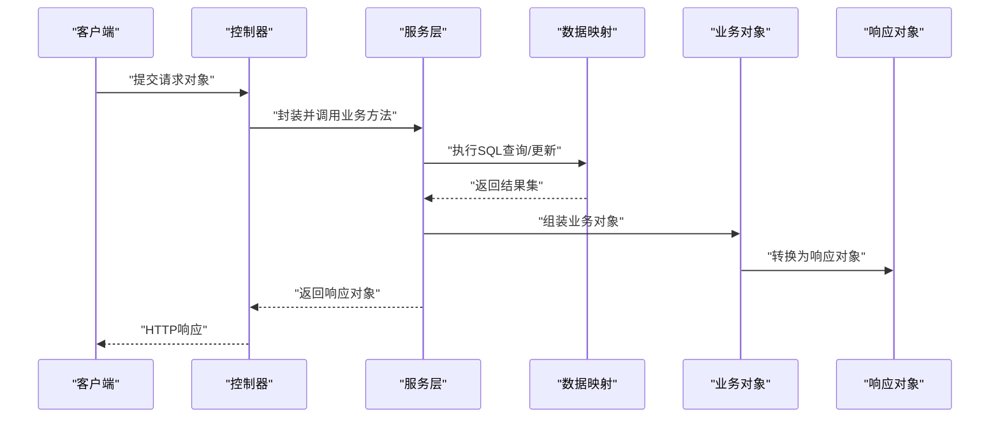
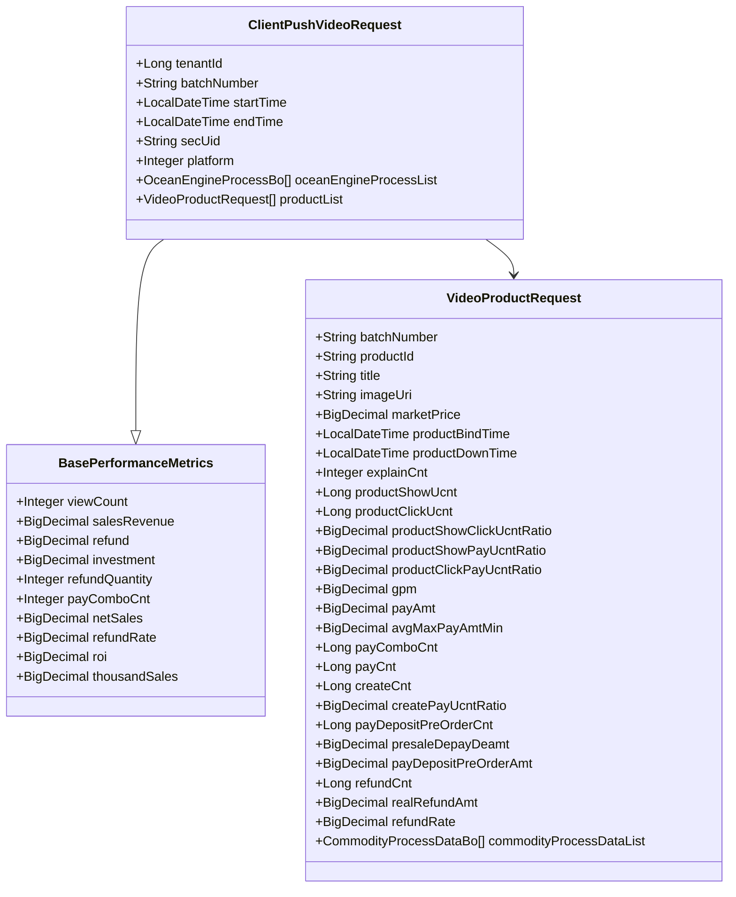
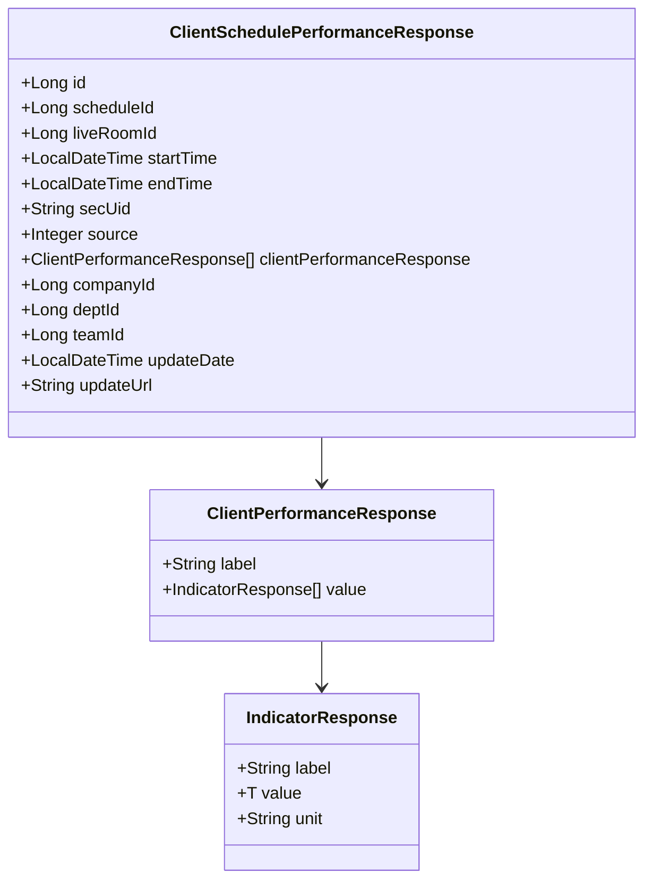
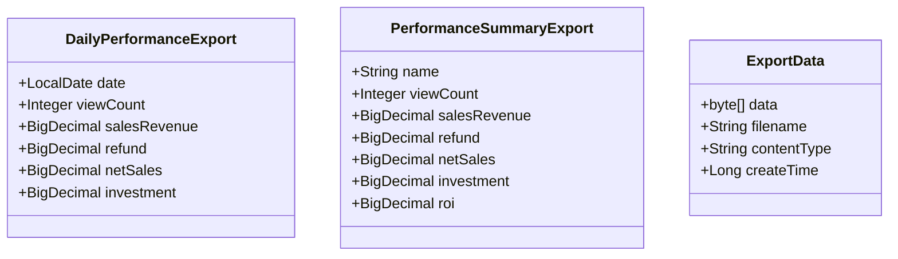
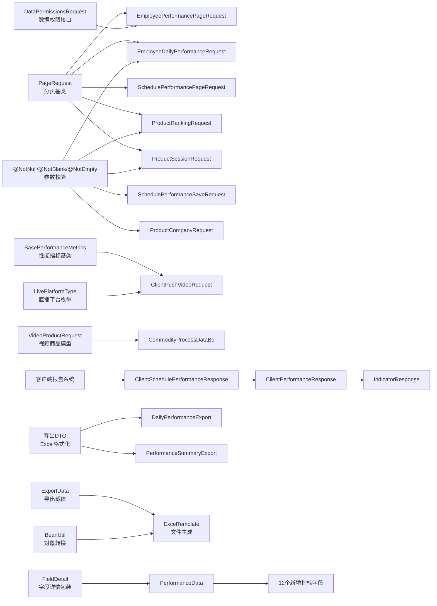

# 业绩管理请求响应

<cite>
**本文档引用的文件**
- [ClientPushVideoRequest.java](file://src/main/java/com/jiuyu/governance/business/performance/pojo/request/ClientPushVideoRequest.java)
- [VideoProductRequest.java](file://src/main/java/com/jiuyu/governance/business/performance/pojo/request/VideoProductRequest.java)
- [BasePerformanceMetrics.java](file://src/main/java/com/jiuyu/governance/business/performance/pojo/base/BasePerformanceMetrics.java)
- [CommodityProcessDataBo.java](file://src/main/java/com/jiuyu/governance/business/performance/pojo/bo/CommodityProcessDataBo.java)
- [OceanEngineProcessBo.java](file://src/main/java/com/jiuyu/governance/business/performance/pojo/bo/OceanEngineProcessBo.java)
- [LivePlatformType.java](file://src/main/java/com/jiuyu/governance/business/room/pojo/constants/LivePlatformType.java)
- [LiveVideoServiceImpl.java](file://src/main/java/com/jiuyu/governance/business/performance/service/impl/LiveVideoServiceImpl.java)
- [EmployeePerformancePageRequest.java](file://src/main/java/com/jiuyu/governance/business/performance/pojo/request/EmployeePerformancePageRequest.java)
- [EmployeeDailyPerformanceRequest.java](file://src/main/java/com/jiuyu/governance/business/performance/pojo/request/EmployeeDailyPerformanceRequest.java)
- [EmployeeTrendRequest.java](file://src/main/java/com/jiuyu/governance/business/performance/pojo/request/EmployeeTrendRequest.java)
- [SchedulePerformancePageRequest.java](file://src/main/java/com/jiuyu/governance/business/performance/pojo/request/SchedulePerformancePageRequest.java)
- [SchedulePerformanceSaveRequest.java](file://src/main/java/com/jiuyu/governance/business/performance/pojo/request/SchedulePerformanceSaveRequest.java)
- [ProductCompanyRequest.java](file://src/main/java/com/jiuyu/governance/business/performance/pojo/request/ProductCompanyRequest.java)
- [ProductRankingRequest.java](file://src/main/java/com/jiuyu/governance/business/performance/pojo/request/ProductRankingRequest.java)
- [ProductSessionRequest.java](file://src/main/java/com/jiuyu/governance/business/performance/pojo/request/ProductSessionRequest.java)
- [DailyPerformanceExport.java](file://src/main/java/com/jiuyu/governance/business/performance/pojo/response/export/DailyPerformanceExport.java)
- [PerformanceSummaryExport.java](file://src/main/java/com/jiuyu/governance/business/performance/pojo/response/export/PerformanceSummaryExport.java)
- [ExportData.java](file://src/main/java/com/jiuyu/governance/common/pojo/bo/ExportData.java)
- [DailyPerformanceResponse.java](file://src/main/java/com/jiuyu/governance/business/performance/pojo/response/DailyPerformanceResponse.java)
- [PerformanceSummaryResponse.java](file://src/main/java/com/jiuyu/governance/business/performance/pojo/response/PerformanceSummaryResponse.java)
- [ClientSchedulePerformanceResponse.java](file://src/main/java/com/jiuyu/governance/business/performance/pojo/response/client/ClientSchedulePerformanceResponse.java)
- [ClientPerformanceResponse.java](file://src/main/java/com/jiuyu/governance/business/performance/pojo/response/client/ClientPerformanceResponse.java)
- [IndicatorResponse.java](file://src/main/java/com/jiuyu/governance/business/performance/pojo/response/client/IndicatorResponse.java)
- [PerformanceData.java](file://src/main/java/com/jiuyu/governance/business/performance/pojo/response/PerformanceData.java)
- [ClientVideoController.java](file://src/main/java/com/jiuyu/governance/business/performance/controller/ClientVideoController.java)
- [ClientSchedulePerformanceQueryRequest.java](file://src/main/java/com/jiuyu/governance/business/performance/pojo/request/ClientSchedulePerformanceQueryRequest.java)
- [SchedulePerformanceServiceImpl.java](file://src/main/java/com/jiuyu/governance/business/performance/service/impl/SchedulePerformanceServiceImpl.java)
- [FieldDetail.java](file://src/main/java/com/jiuyu/governance/business/performance/pojo/response/FieldDetail.java)
</cite>

## 更新摘要
**变更内容**
- 新增客户端性能报告系统，包括新的ClientSchedulePerformanceResponse、ClientPerformanceResponse和IndicatorResponse类
- 扩展的PerformanceData类包含exposureCount、followCount、clickPaymentRate、interactionRate、maxOnline、refundRate、thousandSales、conversionRate、uvValue、followRate等新指标字段
- 新增客户端视频数据接口ClientVideoController，支持客户端推送直播数据和查询排班业绩
- 新增ClientSchedulePerformanceQueryRequest请求模型，支持按主播secUid和时间范围查询排班业绩
- 完善客户端性能数据展示结构，支持流量数据、投入回报、销售数据三大类指标的分组展示

## 目录
1. [简介](#简介)
2. [项目结构](#项目结构)
3. [核心组件](#核心组件)
4. [架构概览](#架构概览)
5. [详细组件分析](#详细组件分析)
6. [直播视频数据模型](#直播视频数据模型)
7. [客户端性能报告系统](#客户端性能报告系统)
8. [性能指标基类](#性能指标基类)
9. [业务对象与枚举](#业务对象与枚举)
10. [导出功能详解](#导出功能详解)
11. [依赖分析](#依赖分析)
12. [性能考虑](#性能考虑)
13. [故障排除指南](#故障排除指南)
14. [结论](#结论)

## 简介
本文件专注于直播业绩管理模块的请求响应模型，系统性梳理员工业绩、场次业绩、商品销售统计以及直播视频数据处理相关的请求对象设计与参数规范。文档覆盖以下核心主题：
- 员工业绩查询请求：EmployeePerformancePageRequest、EmployeeDailyPerformanceRequest、EmployeeTrendRequest
- 场次业绩管理请求：SchedulePerformancePageRequest、SchedulePerformanceSaveRequest
- 商品销售统计请求：ProductCompanyRequest、ProductRankingRequest、ProductSessionRequest
- **新增**：客户端性能报告系统，包括ClientSchedulePerformanceResponse、ClientPerformanceResponse、IndicatorResponse类
- **新增**：直播视频数据推送请求模型，包括ClientPushVideoRequest、VideoProductRequest
- **新增**：性能指标基类BasePerformanceMetrics，统一管理核心业绩指标
- **新增**：业务对象与枚举类，支持过程数据处理和多平台直播数据接入
- **扩展**：PerformanceData类包含12个新增指标字段，支持更全面的直播数据分析
- 对应的响应对象与统计分析参数规范
- 分页查询、排序规则、数据权限控制与租户隔离机制

## 项目结构
业绩管理模块位于 business.performance 子包中，采用按功能域划分的目录组织方式：
- controller：对外接口控制器
- mapper：MyBatis 数据访问层
- pojo：领域模型与请求/响应对象
- service：业务服务实现
- task：定时任务
- utils：工具类

```mermaid
graph TB
subgraph "业绩管理模块"
REQ["请求对象<br/>pojo/request"]
RESP["响应对象<br/>pojo/response"]
BO["业务对象<br/>pojo/bo"]
CTRL["控制器<br/>controller"]
SVC["服务层<br/>service"]
MAPPER["数据映射<br/>mapper"]
EXPORT["导出DTO<br/>pojo/response/export"]
BASE["基础类<br/>pojo/base"]
ENUM["枚举类<br/>constants"]
CLIENT["客户端报告<br/>client响应"]
END
REQ --> CTRL
CTRL --> SVC
SVC --> MAPPER
MAPPER --> BO
BO --> RESP
RESP --> CLIENT
RESP --> EXPORT
BASE --> REQ
ENUM --> REQ
```

**图表来源**
- [ClientPushVideoRequest.java:28](file://src/main/java/com/jiuyu/governance/business/performance/pojo/request/ClientPushVideoRequest.java#L28)
- [BasePerformanceMetrics.java:27](file://src/main/java/com/jiuyu/governance/business/performance/pojo/base/BasePerformanceMetrics.java#L27)
- [LivePlatformType.java:13](file://src/main/java/com/jiuyu/governance/business/room/pojo/constants/LivePlatformType.java#L13)

**章节来源**
- [ClientPushVideoRequest.java:1-88](file://src/main/java/com/jiuyu/governance/business/performance/pojo/request/ClientPushVideoRequest.java#L1-L88)
- [VideoProductRequest.java:1-164](file://src/main/java/com/jiuyu/governance/business/performance/pojo/request/VideoProductRequest.java#L1-L164)

## 核心组件
本节对关键请求对象进行分类说明，包括字段含义、校验规则、使用场景与典型调用流程。

### 员工业绩查询请求
- EmployeePerformancePageRequest：支持按公司/部门/小组/岗位/账号状态/姓名/手机号等多维条件分页查询员工业绩，内置数据权限控制与租户隔离。
- EmployeeDailyPerformanceRequest：按天维度分页查询员工业绩，支持直播间名称筛选、日期范围过滤与多字段排序。
- EmployeeTrendRequest：查询员工业绩趋势，限定起止日期范围。

### 场次业绩管理请求
- SchedulePerformancePageRequest：排班业绩分页查询，支持直播开始/结束时间、主播名称、直播间ID等条件。
- SchedulePerformanceSaveRequest：保存或更新场次业绩，包含直播人员信息与业绩凭证数据结构。

### 商品销售统计请求
- ProductCompanyRequest：按分公司维度统计指定商品的销售情况，支持排序字段与方向配置。
- ProductRankingRequest：商品排行分页查询，支持公司/部门/小组维度过滤与多指标排序。
- ProductSessionRequest：按直播场次维度统计商品表现，支持按场次开始时间、时长、销量、销售额、观看数等排序。

### **新增** 客户端性能报告请求
- ClientSchedulePerformanceQueryRequest：客户端查询排班业绩请求，支持按主播secUid和时间范围查询对应的排班业绩记录。

### **新增** 直播视频数据推送请求
- ClientPushVideoRequest：客户端推送直播视频数据，继承BasePerformanceMetrics，支持多平台直播数据接入。
- VideoProductRequest：视频商品请求模型，包含详细的商品销售过程数据。

**章节来源**
- [EmployeePerformancePageRequest.java:14-138](file://src/main/java/com/jiuyu/governance/business/performance/pojo/request/EmployeePerformancePageRequest.java#L14-L138)
- [EmployeeDailyPerformanceRequest.java:12-71](file://src/main/java/com/jiuyu/governance/business/performance/pojo/request/EmployeeDailyPerformanceRequest.java#L12-L71)
- [EmployeeTrendRequest.java:9-37](file://src/main/java/com/jiuyu/governance/business/performance/pojo/request/EmployeeTrendRequest.java#L9-L37)
- [SchedulePerformancePageRequest.java:11-50](file://src/main/java/com/jiuyu/governance/business/performance/pojo/request/SchedulePerformancePageRequest.java#L11-L50)
- [SchedulePerformanceSaveRequest.java:17-78](file://src/main/java/com/jiuyu/governance/business/performance/pojo/request/SchedulePerformanceSaveRequest.java#L17-L78)
- [ProductCompanyRequest.java:12-60](file://src/main/java/com/jiuyu/governance/business/performance/pojo/request/ProductCompanyRequest.java#L12-L60)
- [ProductRankingRequest.java:12-71](file://src/main/java/com/jiuyu/governance/business/performance/pojo/request/ProductRankingRequest.java#L12-L71)
- [ProductSessionRequest.java:13-61](file://src/main/java/com/jiuyu/governance/business/performance/pojo/request/ProductSessionRequest.java#L13-L61)
- [ClientSchedulePerformanceQueryRequest.java:18-38](file://src/main/java/com/jiuyu/governance/business/performance/pojo/request/ClientSchedulePerformanceQueryRequest.java#L18-L38)

## 架构概览
下图展示请求对象在控制器-服务-数据访问层之间的流转关系，以及与业务对象和响应对象的映射：



**图表来源**
- [ClientPushVideoRequest.java:28](file://src/main/java/com/jiuyu/governance/business/performance/pojo/request/ClientPushVideoRequest.java#L28)
- [VideoProductRequest.java:23](file://src/main/java/com/jiuyu/governance/business/performance/pojo/request/VideoProductRequest.java#L23)

## 详细组件分析

### 员工业绩查询请求模型
- EmployeePerformancePageRequest
  - 关键字段：companyId、deptId、teamId、positionId、accountStatus、employeeName、mobile
  - 数据权限：实现 DataPermissionsRequest 接口，支持公司/部门/小组维度的数据范围控制
  - 租户隔离：通过 tenantId、currentUserId 自动注入
  - 使用场景：员工业绩总览、筛选与导出
- EmployeeDailyPerformanceRequest
  - 关键字段：employeeId、liveRoomName、startDate、endDate、sortField、sortOrder
  - 校验：employeeId 必填；日期范围可选
  - 排序：支持 statsDate、scheduleCount、liveDurationMinutes、viewCount、salesRevenue、refund、netSales、investment、roi 等字段
  - 使用场景：员工业绩详情页-按天维度分页列表
- EmployeeTrendRequest
  - 关键字段：employeeId、startDate、endDate
  - 校验：三者均必填
  - 使用场景：员工业绩趋势分析

**章节来源**
- [EmployeePerformancePageRequest.java:14-138](file://src/main/java/com/jiuyu/governance/business/performance/pojo/request/EmployeePerformancePageRequest.java#L14-L138)
- [EmployeeDailyPerformanceRequest.java:12-71](file://src/main/java/com/jiuyu/governance/business/performance/pojo/request/EmployeeDailyPerformanceRequest.java#L12-L71)
- [EmployeeTrendRequest.java:9-37](file://src/main/java/com/jiuyu/governance/business/performance/pojo/request/EmployeeTrendRequest.java#L9-L37)

### 场次业绩管理请求模型
- SchedulePerformancePageRequest
  - 关键字段：startTime、endTime、anchorName、liveRoomId
  - 使用场景：排班业绩列表查询与筛选
- SchedulePerformanceSaveRequest
  - 关键字段：id、scheduleId、liveRoomId、startTime、endTime、secUid、staffList、performanceData
  - 校验：liveRoomId、startTime、endTime、staffList 必填
  - 组合逻辑：id 为空表示新增，否则更新；scheduleId 可选用于自动填充时间
  - 使用场景：录入/编辑场次直播人员与业绩凭证

**章节来源**
- [SchedulePerformancePageRequest.java:11-50](file://src/main/java/com/jiuyu/governance/business/performance/pojo/request/SchedulePerformancePageRequest.java#L11-L50)
- [SchedulePerformanceSaveRequest.java:17-78](file://src/main/java/com/jiuyu/governance/business/performance/pojo/request/SchedulePerformanceSaveRequest.java#L17-L78)

### 商品销售统计请求模型
- ProductCompanyRequest
  - 关键字段：productId、startDate、endDate、sortBy、sortOrder
  - 校验：productId、startDate、endDate 必填
  - 排序：默认 salesAmount，支持 quantity、viewCount
  - 使用场景：按分公司统计单个商品的销售表现
- ProductRankingRequest
  - 关键字段：startDate、endDate、companyId、deptId、teamId、sortBy、sortOrder
  - 校验：startDate、endDate 必填
  - 过滤：公司/部门/小组 ID 可选精确匹配
  - 排序：默认 salesAmount，支持 quantity、refundQuantity、refundAmount、refundRate、exposureConversionRate、exposureClickRate、gpm、clickPaymentRate、sessionCount、companyCount 等
  - 使用场景：商品销售排行榜
- ProductSessionRequest
  - 关键字段：productId、startDate、endDate、sortBy、sortOrder
  - 校验：productId、startDate、endDate 必填
  - 排序：默认 startTime，支持 duration、quantity、salesAmount、viewCount
  - 使用场景：按直播场次统计商品表现

**章节来源**
- [ProductCompanyRequest.java:12-60](file://src/main/java/com/jiuyu/governance/business/performance/pojo/request/ProductCompanyRequest.java#L12-L60)
- [ProductRankingRequest.java:12-71](file://src/main/java/com/jiuyu/governance/business/performance/pojo/request/ProductRankingRequest.java#L12-L71)
- [ProductSessionRequest.java:13-61](file://src/main/java/com/jiuyu/governance/business/performance/pojo/request/ProductSessionRequest.java#L13-L61)

## 直播视频数据模型

### **新增** ClientPushVideoRequest - 客户端推送视频请求
客户端推送直播视频数据的核心请求模型，继承BasePerformanceMetrics基类，支持多平台直播数据接入。

- **关键字段**：
  - tenantId：租户ID（JsonIgnore隐藏）
  - batchNumber：直播批次号（必填）
  - startTime：视频开始时间（必填）
  - endTime：视频结束时间（必填）
  - secUid：主播secUid（必填）
  - platform：平台类型（必填，枚举值）
  - oceanEngineProcessList：直播过程数据列表（必填）
  - productList：商品列表（可选）

- **平台类型支持**：
  - 抖音：0
  - 快手：1  
  - 视频号：2

- **使用场景**：
  - 客户端直播数据推送
  - 多平台直播数据统一接入
  - 实时直播过程数据监控



**图表来源**
- [ClientPushVideoRequest.java:28](file://src/main/java/com/jiuyu/governance/business/performance/pojo/request/ClientPushVideoRequest.java#L28)
- [BasePerformanceMetrics.java:27](file://src/main/java/com/jiuyu/governance/business/performance/pojo/base/BasePerformanceMetrics.java#L27)
- [VideoProductRequest.java:23](file://src/main/java/com/jiuyu/governance/business/performance/pojo/request/VideoProductRequest.java#L23)

**章节来源**
- [ClientPushVideoRequest.java:20-88](file://src/main/java/com/jiuyu/governance/business/performance/pojo/request/ClientPushVideoRequest.java#L20-L88)

### **新增** VideoProductRequest - 视频商品请求模型
视频商品的详细请求模型，包含完整的商品销售过程数据。

- **商品基本信息**：
  - productId：商品ID（必填）
  - title：商品标题（必填）
  - imageUri：商品图片URL
  - marketPrice：到手价（元）

- **商品上下架时间**：
  - productBindTime：直播间上架时间
  - productDownTime：直播间下架时间

- **曝光与转化指标**：
  - productShowUcnt：商品曝光人数
  - productClickUcnt：商品点击人数
  - productShowClickUcntRatio：曝光-点击转化率
  - productShowPayUcntRatio：曝光-成交转化率
  - productClickPayUcntRatio：点击-成交转化率
  - gpm：商品千次曝光成交金额（元）

- **销售与退款指标**：
  - payAmt：累计成交金额（元）
  - avgMaxPayAmtMin：分钟最高成交金额（元）
  - payComboCnt：累计成交件数
  - payCnt：累计成交订单数
  - createCnt：创建订单数
  - createPayUcntRatio：订单支付率
  - payDepositPreOrderCnt：预售订单数
  - presaleDepayDeamt：预售定金金额（元）
  - payDepositPreOrderAmt：预售全款金额（元）
  - refundCnt：退款订单数
  - realRefundAmt：退款金额（元）
  - refundRate：退款率

- **商品过程数据**：
  - commodityProcessDataList：商品过程数据列表（必填）

**章节来源**
- [VideoProductRequest.java:15-164](file://src/main/java/com/jiuyu/governance/business/performance/pojo/request/VideoProductRequest.java#L15-L164)

## 客户端性能报告系统

### **新增** ClientSchedulePerformanceResponse - 客户端排班业绩响应
客户端查询排班业绩的核心响应模型，支持流量数据、投入回报、销售数据三大类指标的分组展示。

- **核心字段**：
  - id：排班业绩ID
  - scheduleId：排班ID
  - liveRoomId：直播间ID
  - startTime：开始时间
  - endTime：结束时间
  - secUid：主播SecUid
  - source：数据来源（1-系统，2-手动）
  - clientPerformanceResponse：客户端性能响应列表
  - companyId：公司ID
  - deptId：部门ID
  - teamId：小组ID
  - updateDate：更新时间
  - updateUrl：更新URL

- **使用场景**：
  - 客户端实时查看直播业绩数据
  - 支持流量数据、投入回报、销售数据的分组展示
  - 提供业绩数据的修改链接跳转

### **新增** ClientPerformanceResponse - 客户端性能响应
客户端性能响应的分组模型，用于将相关指标按类别进行分组展示。

- **核心字段**：
  - label：指标标签（如"流量数据"、"投入回报"、"销售数据"）
  - value：指标值列表（IndicatorResponse类型）

- **使用场景**：
  - 将相关指标按功能类别进行分组
  - 支持动态添加不同类别的指标组合

### **新增** IndicatorResponse - 指标响应模型
通用的指标响应模型，支持泛型类型和单位标识。

- **核心字段**：
  - label：指标标签（如"曝光次数"、"观看人数"、"ROI"）
  - value：指标值（泛型类型，支持Integer、BigDecimal等）
  - unit：指标单位（如"%""元""人""次"等）

- **使用场景**：
  - 统一指标数据的响应格式
  - 支持不同类型的指标值展示
  - 提供指标单位的可视化显示



**图表来源**
- [ClientSchedulePerformanceResponse.java:18](file://src/main/java/com/jiuyu/governance/business/performance/pojo/response/client/ClientSchedulePerformanceResponse.java#L18)
- [ClientPerformanceResponse.java:17](file://src/main/java/com/jiuyu/governance/business/performance/pojo/response/client/ClientPerformanceResponse.java#L17)
- [IndicatorResponse.java:14](file://src/main/java/com/jiuyu/governance/business/performance/pojo/response/client/IndicatorResponse.java#L14)

**章节来源**
- [ClientSchedulePerformanceResponse.java:10-84](file://src/main/java/com/jiuyu/governance/business/performance/pojo/response/client/ClientSchedulePerformanceResponse.java#L10-L84)
- [ClientPerformanceResponse.java:9-26](file://src/main/java/com/jiuyu/governance/business/performance/pojo/response/client/ClientPerformanceResponse.java#L9-L26)
- [IndicatorResponse.java:7-30](file://src/main/java/com/jiuyu/governance/business/performance/pojo/response/client/IndicatorResponse.java#L7-L30)

### **新增** ClientVideoController - 客户端视频数据接口
提供客户端直播数据推送和排班业绩查询的RESTful接口。

- **接口功能**：
  - POST /api/governance/performance/video/clientPushVideo：客户端推送直播业绩数据
  - POST /api/governance/performance/video/querySchedulePerformance：客户端查询排班业绩数据

- **客户端推送接口**：
  - 参数：ClientPushVideoRequest（客户端推送的直播数据）
  - 权限：@ClientUser注解，支持客户端用户认证
  - 并发控制：@ResourceLock防止重复推送
  - 返回：ApiResponse<Void>成功响应

- **客户端查询接口**：
  - 参数：ClientSchedulePerformanceQueryRequest（查询条件：secUid、startTime、endTime）
  - 权限：@ClientUser注解
  - 返回：ApiResponse<ClientSchedulePerformanceResponse>排班业绩数据

**章节来源**
- [ClientVideoController.java:20-67](file://src/main/java/com/jiuyu/governance/business/performance/controller/ClientVideoController.java#L20-L67)

### **新增** ClientSchedulePerformanceQueryRequest - 客户端排班业绩查询请求
客户端查询排班业绩的请求模型，支持按主播和时间范围进行精确查询。

- **关键字段**：
  - secUid：主播SecUid（必填，非空校验）
  - startTime：视频开始时间（必填，非空校验）
  - endTime：视频结束时间（必填，非空校验）

- **校验规则**：
  - 使用@NotBlank和@NotNull注解确保参数完整性
  - 支持时间范围的合理性校验

- **使用场景**：
  - 客户端根据直播时间段查询对应的排班业绩
  - 支持精确到秒的时间范围查询
  - 返回匹配的排班业绩记录（最多1条）

**章节来源**
- [ClientSchedulePerformanceQueryRequest.java:10-38](file://src/main/java/com/jiuyu/governance/business/performance/pojo/request/ClientSchedulePerformanceQueryRequest.java#L10-L38)

## 性能指标基类

### **新增** BasePerformanceMetrics - 性能指标基类
统一管理业绩核心指标的基类，为所有业绩相关模型提供标准化的指标字段。

- **核心指标字段**：
  - viewCount：场观（累计观看人数）
  - salesRevenue：销售额（累计，单位：元）
  - refund：退款（累计，单位：元）
  - investment：投放（累计，单位：元）
  - refundQuantity：退款数量（累计）
  - payComboCnt：销售单量
  - netSales：净销售额（累计，单位：元）
  - refundRate：退款率（精确到小数点后两位）
  - roi：投资回报率（ROI，精确到小数点后两位）
  - thousandSales：千次成交（精确到小数点后两位）

- **设计特点**：
  - 统一管理BO/Response/Export层的10个核心业绩指标字段
  - 新增业绩字段时只需在此基类添加一处，所有子类自动继承
  - 支持SuperBuilder模式，便于构建复杂的业绩数据对象

**章节来源**
- [BasePerformanceMetrics.java:10-55](file://src/main/java/com/jiuyu/governance/business/performance/pojo/base/BasePerformanceMetrics.java#L10-L55)

## 业务对象与枚举

### **新增** CommodityProcessDataBo - 商品过程数据业务对象
客户端商品过程数据的业务对象，用于记录直播过程中的商品销售数据。

- **关键字段**：
  - dateTime：时间（必填，格式：yyyy-MM-dd HH:mm:ss）
  - payComboCnt：成交件数
  - payAmt：成交金额（单位：元）

**章节来源**
- [CommodityProcessDataBo.java:9-34](file://src/main/java/com/jiuyu/governance/business/performance/pojo/bo/CommodityProcessDataBo.java#L9-L34)

### **新增** OceanEngineProcessBo - 巨量引擎过程数据业务对象
巨量引擎实时格式的过程数据业务对象，用于记录直播过程中的关键指标。

- **关键字段**：
  - gatherDateTime：采集时间（必填，格式：yyyy-MM-dd HH:mm:ss）
  - viewCount：总观看人次
  - salesRevenue：成交金额（单位：元）
  - refund：退款金额（单位：元）
  - investment：投放金额（单位：元）
  - fansClubJoinUcnt：新增直播团人数
  - followAnchorUcnt：新增粉丝数
  - payComboCnt：成交单量
  - refundQuantity：退款数量（累计）

**章节来源**
- [OceanEngineProcessBo.java:13-72](file://src/main/java/com/jiuyu/governance/business/performance/pojo/bo/OceanEngineProcessBo.java#L13-L72)

### **新增** LivePlatformType - 直播平台类型枚举
直播平台类型的枚举定义，支持多平台直播数据接入。

- **平台类型**：
  - DOU_YIN：抖音（值：0）
  - KUAI_SHOU：快手（值：1）
  - SHI_PING_HAO：视频号（值：2）

- **功能特性**：
  - 实现BaseEnum接口
  - 提供getByValue静态方法根据值获取枚举
  - 支持描述信息获取

**章节来源**
- [LivePlatformType.java:6-46](file://src/main/java/com/jiuyu/governance/business/room/pojo/constants/LivePlatformType.java#L6-L46)

## 导出功能详解

### 导出DTO模型概述
业绩管理模块提供了完整的Excel导出功能，包含以下专用DTO模型：

#### DailyPerformanceExport - 每日业绩导出DTO
用于导出按天维度的业绩数据，支持Excel格式化输出。

- **字段定义**：
  - date：统计日期（格式：yyyy-MM-dd）
  - viewCount：场观
  - salesRevenue：销售额（单位：元）
  - refund：退款（单位：元）
  - netSales：净销售额（单位：元）
  - investment：投放（单位：元）

#### PerformanceSummaryExport - 业绩汇总导出DTO
用于导出按组织维度（分公司/部门/小组/直播间）的业绩汇总数据。

- **字段定义**：
  - name：名称（分公司/部门/小组/直播间名称）
  - viewCount：场观（累计）
  - salesRevenue：销售额（累计，单位：元）
  - refund：退款（累计，单位：元）
  - netSales：净销售额（累计，单位：元）
  - investment：投放（累计，单位：元）
  - roi：投资回报率（累计）

#### ExportData - 通用导出数据载体
提供Redis存储导出文件的二进制数据和元信息。

- **字段定义**：
  - data：文件二进制数据
  - filename：文件名（含扩展名）
  - contentType：MIME类型
  - createTime：创建时间戳（毫秒）

### 导出功能应用场景
导出功能广泛应用于以下场景：
- **每日业绩导出**：将按天统计的业绩数据导出为Excel文件
- **组织维度导出**：按分公司、部门、小组、直播间维度导出业绩汇总数据
- **批量数据处理**：支持无分页限制的全量数据导出
- **Excel格式化**：通过@ExcelProperty注解实现标准Excel列头格式



**图表来源**
- [DailyPerformanceExport.java:24-61](file://src/main/java/com/jiuyu/governance/business/performance/pojo/response/export/DailyPerformanceExport.java#L24-L61)
- [PerformanceSummaryExport.java:23-66](file://src/main/java/com/jiuyu/governance/business/performance/pojo/response/export/PerformanceSummaryExport.java#L23-L66)
- [ExportData.java:20-41](file://src/main/java/com/jiuyu/governance/common/pojo/bo/ExportData.java#L20-L41)

**章节来源**
- [DailyPerformanceExport.java:13-61](file://src/main/java/com/jiuyu/governance/business/performance/pojo/response/export/DailyPerformanceExport.java#L13-L61)
- [PerformanceSummaryExport.java:12-66](file://src/main/java/com/jiuyu/governance/business/performance/pojo/response/export/PerformanceSummaryExport.java#L12-L66)
- [ExportData.java:8-41](file://src/main/java/com/jiuyu/governance/common/pojo/bo/ExportData.java#L8-L41)

## 依赖分析
- 请求对象与分页框架
  - 多数请求对象继承 PageRequest，具备统一的分页参数（页码、大小、排序）能力
- 数据权限与租户隔离
  - EmployeePerformancePageRequest 实现 DataPermissionsRequest 接口，通过 findDataIds/toDataIds 控制公司/部门/小组维度的数据范围
  - 多个请求对象包含 tenantId 字段，由框架自动注入，确保跨租户数据隔离
- 参数校验
  - 使用 Jakarta Validation 注解（如 @NotNull、@NotBlank、@NotEmpty）保障关键字段完整性
- 组合对象
  - SchedulePerformanceSaveRequest 内嵌 StaffInfo 列表与 PerformanceData 对象，体现业绩数据的复合结构
- **新增**：直播视频数据模型依赖
  - ClientPushVideoRequest 继承 BasePerformanceMetrics，统一性能指标管理
  - VideoProductRequest 包含 CommodityProcessDataBo 列表，支持过程数据聚合
  - LivePlatformType 枚举支持多平台直播数据接入
- **新增**：客户端性能报告系统依赖
  - ClientSchedulePerformanceResponse 依赖 ClientPerformanceResponse 和 IndicatorResponse
  - ClientPerformanceResponse 依赖 IndicatorResponse 泛型类型
  - IndicatorResponse 支持任意类型值的通用响应格式
- **新增**：导出功能依赖
  - 导出DTO使用@ExcelProperty注解进行Excel格式化
  - 导出功能通过BeanUtil.copyToList进行对象转换
  - 使用ExcelTemplate进行Excel文件生成和下载
- **扩展**：PerformanceData类扩展指标
  - 新增12个指标字段：exposureCount、followCount、clickPaymentRate、interactionRate、maxOnline、refundRate、thousandSales、conversionRate、uvValue、followRate
  - 所有字段均使用FieldDetail包装，支持值、图片URL、修改状态的完整展示



**图表来源**
- [ClientPushVideoRequest.java:28](file://src/main/java/com/jiuyu/governance/business/performance/pojo/request/ClientPushVideoRequest.java#L28)
- [BasePerformanceMetrics.java:27](file://src/main/java/com/jiuyu/governance/business/performance/pojo/base/BasePerformanceMetrics.java#L27)
- [VideoProductRequest.java:162](file://src/main/java/com/jiuyu/governance/business/performance/pojo/request/VideoProductRequest.java#L162)
- [LivePlatformType.java:13](file://src/main/java/com/jiuyu/governance/business/room/pojo/constants/LivePlatformType.java#L13)
- [ClientSchedulePerformanceResponse.java:58](file://src/main/java/com/jiuyu/governance/business/performance/pojo/response/client/ClientSchedulePerformanceResponse.java#L58)
- [ClientPerformanceResponse.java:25](file://src/main/java/com/jiuyu/governance/business/performance/pojo/response/client/ClientPerformanceResponse.java#L25)
- [IndicatorResponse.java:24](file://src/main/java/com/jiuyu/governance/business/performance/pojo/response/client/IndicatorResponse.java#L24)

**章节来源**
- [EmployeePerformancePageRequest.java:77-115](file://src/main/java/com/jiuyu/governance/business/performance/pojo/request/EmployeePerformancePageRequest.java#L77-L115)
- [EmployeeDailyPerformanceRequest.java:32-63](file://src/main/java/com/jiuyu/governance/business/performance/pojo/request/EmployeeDailyPerformanceRequest.java#L32-L63)
- [SchedulePerformanceSaveRequest.java:45-77](file://src/main/java/com/jiuyu/governance/business/performance/pojo/request/SchedulePerformanceSaveRequest.java#L45-L77)
- [ProductRankingRequest.java:28-70](file://src/main/java/com/jiuyu/governance/business/performance/pojo/request/ProductRankingRequest.java#L28-L70)

## 性能考虑
- 分页查询
  - 合理设置每页大小，避免一次性返回大量数据
  - 在高频查询场景下，建议结合索引字段（如日期、ID）进行过滤
- 排序优化
  - 对常用排序字段建立数据库索引，减少排序开销
  - 避免在大数据集上进行复杂表达式排序
- 数据权限
  - 利用 DataPermissionsRequest 的维度过滤，缩小查询范围，降低不必要的计算
- 缓存策略
  - 对稳定报表数据（如商品排行）可引入缓存，定期刷新
- **新增**：直播视频数据处理性能
  - ClientPushVideoRequest 继承 BasePerformanceMetrics，统一性能指标计算
  - VideoProductRequest 支持过程数据聚合，提高数据处理效率
  - 并行处理商品过程数据，使用 CompletableFuture 提升处理速度
  - OSS 文件存储优化，支持大文件分片上传
- **新增**：客户端性能报告系统性能
  - ClientSchedulePerformanceResponse 支持指标的分组展示，减少前端处理负担
  - IndicatorResponse 泛型设计支持不同类型指标的统一处理
  - 客户端推送接口使用@ResourceLock防止重复推送，提升系统稳定性
- **新增**：导出性能优化
  - 导出功能通过设置request.setLimit(-1)实现全量数据导出
  - 使用BeanUtil.copyToList进行批量对象转换，提升转换效率
  - ExcelTemplate统一处理文件生成，避免重复创建对象
- **扩展**：PerformanceData类性能优化
  - 12个新增指标字段均使用FieldDetail包装，支持延迟加载和按需展示
  - 所有字段支持图片URL和修改状态，便于前端差异化展示

## 故障排除指南
- 参数缺失
  - 现象：接口返回参数校验错误
  - 排查：确认 @NotNull/@NotBlank/@NotEmpty 标注字段是否传入
  - 参考：员工业绩趋势请求、场次业绩保存请求、商品统计请求中的必填字段
- 时间范围异常
  - 现象：查询不到数据或结果异常
  - 排查：确认开始/结束时间格式与范围是否合理，注意时区与边界值
  - 参考：员工业绩按天请求、商品统计请求的时间字段
- 排序字段无效
  - 现象：排序未生效
  - 排查：确认排序字段是否在允许列表内，排序方向是否为 ASC/DESC
  - 参考：员工业绩按天请求、商品排行请求、商品场次请求的排序字段定义
- 数据权限不足
  - 现象：查询结果为空或范围受限
  - 排查：检查当前用户的数据权限维度（公司/部门/小组），确认 findDataIds 返回范围
  - 参考：员工业绩分页请求的数据权限接口实现
- **新增**：直播视频数据推送问题
  - 现象：直播数据无法正确推送或处理
  - 排查：确认 ClientPushVideoRequest 的必填字段是否完整，平台类型枚举值是否正确
  - 现象：商品过程数据丢失或重复
  - 排查：检查 CommodityProcessDataBo 的时间字段格式，确认数据去重逻辑
  - 现象：多平台直播数据接入异常
  - 排查：验证 LivePlatformType 枚举值与平台配置的一致性
- **新增**：客户端性能报告系统问题
  - 现象：客户端无法获取排班业绩数据
  - 排查：确认 ClientSchedulePerformanceQueryRequest 的secUid、startTime、endTime参数是否正确
  - 现象：指标数据显示异常
  - 排查：检查 IndicatorResponse 的unit字段是否正确设置，确认百分比指标的格式化
  - 现象：客户端推送接口频繁报错
  - 排查：确认@ResourceLock的key生成规则，检查batchNumber的唯一性
- **新增**：导出功能问题
  - 现象：导出文件为空或格式错误
  - 排查：确认导出DTO字段与Excel模板字段对应关系，检查@ExcelProperty注解配置
  - 现象：导出超时或内存溢出
  - 排查：确认导出数据量大小，适当调整查询范围或分批导出
- **扩展**：PerformanceData类指标问题
  - 现象：新增指标字段显示异常
  - 排查：确认FieldDetail的value、imageUrl、modified字段是否正确赋值
  - 现象：指标计算精度不准确
  - 排查：检查MetricsUtil的计算方法，确认BigDecimal的精度设置

**章节来源**
- [EmployeeTrendRequest.java:22-35](file://src/main/java/com/jiuyu/governance/business/performance/pojo/request/EmployeeTrendRequest.java#L22-L35)
- [SchedulePerformanceSaveRequest.java:45-77](file://src/main/java/com/jiuyu/governance/business/performance/pojo/request/SchedulePerformanceSaveRequest.java#L45-L77)
- [ProductCompanyRequest.java:28-41](file://src/main/java/com/jiuyu/governance/business/performance/pojo/request/ProductCompanyRequest.java#L28-L41)
- [ProductRankingRequest.java:54-57](file://src/main/java/com/jiuyu/governance/business/performance/pojo/request/ProductRankingRequest.java#L54-L57)
- [ProductSessionRequest.java:46-53](file://src/main/java/com/jiuyu/governance/business/performance/pojo/request/ProductSessionRequest.java#L46-L53)
- [ClientSchedulePerformanceQueryRequest.java:23-36](file://src/main/java/com/jiuyu/governance/business/performance/pojo/request/ClientSchedulePerformanceQueryRequest.java#L23-L36)

## 结论
本文档系统化梳理了直播业绩管理模块的请求响应模型，明确了员工业绩、场次业绩、商品销售统计以及直播视频数据处理四类场景的请求对象设计与参数规范。通过统一的分页框架、参数校验与数据权限控制，确保了查询的准确性与安全性。

**新增功能总结**：
- **客户端性能报告系统完善**：新增ClientSchedulePerformanceResponse、ClientPerformanceResponse、IndicatorResponse三个核心响应模型，支持流量数据、投入回报、销售数据的分组展示
- **直播视频数据模型完善**：新增ClientPushVideoRequest、VideoProductRequest两个核心数据模型，支持多平台直播数据接入
- **性能指标基类统一**：BasePerformanceMetrics提供统一的10个核心业绩指标字段，简化了数据模型设计
- **过程数据处理增强**：CommodityProcessDataBo和OceanEngineProcessBo支持直播过程数据的精细化追踪与分析
- **平台化支持**：LivePlatformType枚举支持抖音、快手、视频号多平台直播数据接入
- **导出功能完善**：新增DailyPerformanceExport和PerformanceSummaryExport两个专用导出DTO，支持Excel格式化输出
- **通用载体支持**：ExportData提供标准化的导出数据存储方案
- **应用场景丰富**：覆盖每日业绩导出、组织维度导出、直播视频数据推送、客户端性能报告等核心场景
- **技术栈集成**：与BeanUtil、ExcelTemplate、OSS存储等工具链无缝集成
- **指标体系扩展**：PerformanceData类新增12个指标字段，支持更全面的直播数据分析

**扩展功能总结**：
- **客户端接口完善**：新增ClientVideoController提供直播数据推送和排班业绩查询接口
- **指标展示优化**：通过IndicatorResponse支持泛型类型和单位标识，提升指标展示的灵活性
- **性能监控增强**：新增exposureCount、followCount、clickPaymentRate、interactionRate、maxOnline、refundRate、thousandSales、conversionRate、uvValue、followRate等指标，支持更精细的直播效果分析

建议在实际开发中严格遵循字段约束与排序规则，并结合业务场景选择合适的过滤条件与分页策略，以获得最佳的查询性能与用户体验。对于直播视频数据推送功能，应重点关注多平台数据一致性与过程数据的完整性，确保直播数据的准确性和实时性。对于客户端性能报告系统，应充分利用指标分组展示的优势，提供直观的直播数据分析界面。对于导出功能，应根据数据量大小合理控制导出范围，确保系统的稳定性和响应速度。