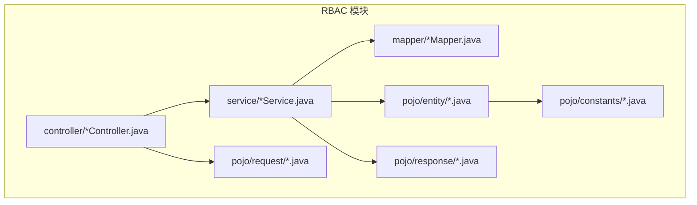
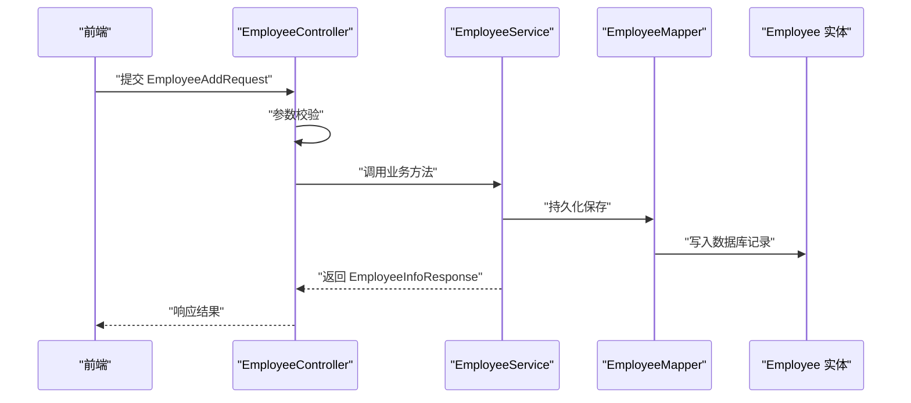
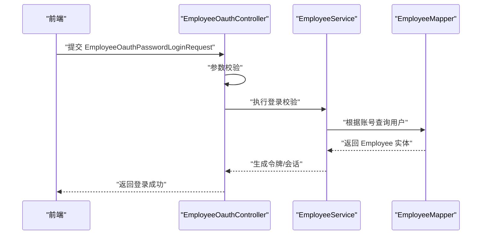
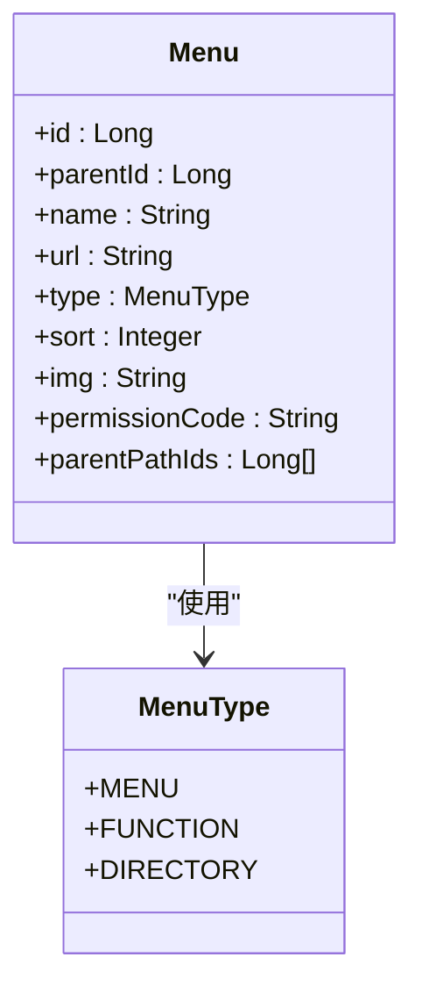
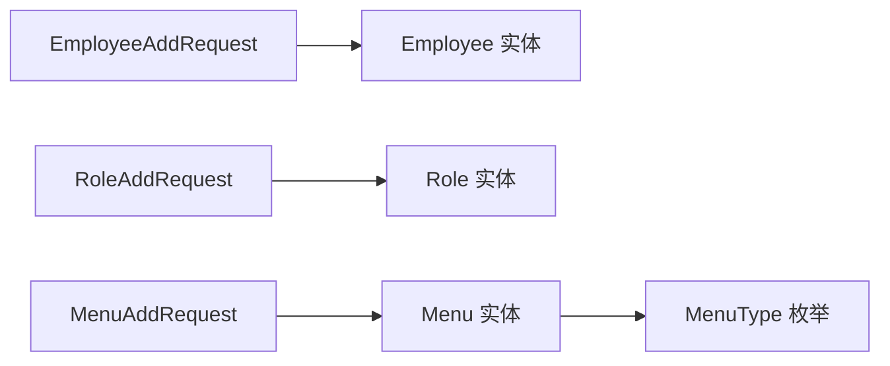

# 权限管理请求响应

<cite>
**本文引用的文件**
- [Employee.java](file://src/main/java/com/jiuyu/governance/business/rbac/pojo/entity/Employee.java)
- [Role.java](file://src/main/java/com/jiuyu/governance/business/rbac/pojo/entity/Role.java)
- [Menu.java](file://src/main/java/com/jiuyu/governance/business/rbac/pojo/entity/Menu.java)
- [MenuType.java](file://src/main/java/com/jiuyu/governance/business/rbac/pojo/constants/MenuType.java)
- [AccountStatus.java](file://src/main/java/com/jiuyu/governance/business/rbac/pojo/constants/AccountStatus.java)
- [JobType.java](file://src/main/java/com/jiuyu/governance/business/rbac/pojo/constants/JobType.java)
- [EmployeeAddRequest.java](file://src/main/java/com/jiuyu/governance/business/rbac/pojo/request/EmployeeAddRequest.java)
- [EmployeeUpdateRequest.java](file://src/main/java/com/jiuyu/governance/business/rbac/pojo/request/EmployeeUpdateRequest.java)
- [EmployeeQueryRequest.java](file://src/main/java/com/jiuyu/governance/business/rbac/pojo/request/EmployeeQueryRequest.java)
- [EmployeeOauthPasswordLoginRequest.java](file://src/main/java/com/jiuyu/governance/business/rbac/pojo/request/EmployeeOauthPasswordLoginRequest.java)
- [RoleAddRequest.java](file://src/main/java/com/jiuyu/governance/business/rbac/pojo/request/RoleAddRequest.java)
- [RoleUpdateRequest.java](file://src/main/java/com/jiuyu/governance/business/rbac/pojo/request/RoleUpdateRequest.java)
- [RolePageQueryRequest.java](file://src/main/java/com/jiuyu/governance/business/rbac/pojo/request/RolePageQueryRequest.java)
- [MenuAddRequest.java](file://src/main/java/com/jiuyu/governance/business/rbac/pojo/request/MenuAddRequest.java)
- [MenuUpdateRequest.java](file://src/main/java/com/jiuyu/governance/business/rbac/pojo/request/MenuUpdateRequest.java)
</cite>

## 目录
1. [简介](#简介)
2. [项目结构](#项目结构)
3. [核心组件](#核心组件)
4. [架构总览](#架构总览)
5. [详细组件分析](#详细组件分析)
6. [依赖分析](#依赖分析)
7. [性能考虑](#性能考虑)
8. [故障排除指南](#故障排除指南)
9. [结论](#结论)

## 简介
本文件聚焦于RBAC权限管理模块中的“请求与响应”模型，系统性梳理员工(Employee)、角色(Role)、菜单(Menu)三类实体在新增、更新、查询、登录等场景下的请求参数定义与约束；同时给出与之对应的响应对象命名约定及字段语义说明。文档还覆盖权限验证与数据权限控制相关的请求参数要点，帮助开发者快速理解并正确使用RBAC接口。

## 项目结构
RBAC模块位于业务域的rbac包下，采用按职责分层组织：
- controller 层：对外暴露REST接口
- service 层：业务逻辑编排
- mapper 层：数据库访问
- pojo.entity：持久化实体
- pojo.request：请求参数对象
- pojo.response：响应结果对象
- pojo.constants：枚举常量

## 核心组件
本节从“请求对象”和“实体对象”的角度，分别说明员工、角色、菜单的请求参数设计与约束，以及与之对应的数据模型字段。

- 员工(Employee)请求参数
  - 新增：EmployeeAddRequest
  - 更新：EmployeeUpdateRequest
  - 查询：EmployeeQueryRequest
  - 登录：EmployeeOauthPasswordLoginRequest
  - 字段约束与校验：参见实体定义与注解约束
  - 参考来源
    - [Employee.java:18-171](file://src/main/java/com/jiuyu/governance/business/rbac/pojo/entity/Employee.java#L18-L171)
    - [EmployeeAddRequest.java](file://src/main/java/com/jiuyu/governance/business/rbac/pojo/request/EmployeeAddRequest.java)
    - [EmployeeUpdateRequest.java](file://src/main/java/com/jiuyu/governance/business/rbac/pojo/request/EmployeeUpdateRequest.java)
    - [EmployeeQueryRequest.java](file://src/main/java/com/jiuyu/governance/business/rbac/pojo/request/EmployeeQueryRequest.java)
    - [EmployeeOauthPasswordLoginRequest.java](file://src/main/java/com/jiuyu/governance/business/rbac/pojo/request/EmployeeOauthPasswordLoginRequest.java)

- 角色(Role)请求参数
  - 新增：RoleAddRequest
  - 更新：RoleUpdateRequest
  - 分页查询：RolePageQueryRequest
  - 字段约束与校验：参见实体定义与注解约束
  - 参考来源
    - [Role.java:14-71](file://src/main/java/com/jiuyu/governance/business/rbac/pojo/entity/Role.java#L14-L71)
    - [RoleAddRequest.java](file://src/main/java/com/jiuyu/governance/business/rbac/pojo/request/RoleAddRequest.java)
    - [RoleUpdateRequest.java](file://src/main/java/com/jiuyu/governance/business/rbac/pojo/request/RoleUpdateRequest.java)
    - [RolePageQueryRequest.java](file://src/main/java/com/jiuyu/governance/business/rbac/pojo/request/RolePageQueryRequest.java)

- 菜单(Menu)请求参数
  - 新增：MenuAddRequest
  - 更新：MenuUpdateRequest
  - 字段约束与校验：参见实体定义与注解约束
  - 参考来源
    - [Menu.java:18-111](file://src/main/java/com/jiuyu/governance/business/rbac/pojo/entity/Menu.java#L18-L111)
    - [MenuAddRequest.java](file://src/main/java/com/jiuyu/governance/business/rbac/pojo/request/MenuAddRequest.java)
    - [MenuUpdateRequest.java](file://src/main/java/com/jiuyu/governance/business/rbac/pojo/request/MenuUpdateRequest.java)

- 枚举与常量
  - 菜单类型：MenuType(MENU=菜单, FUNCTION=功能, DIRECTORY=目录)
  - 账户状态：AccountStatus(DISABLED=停用, NORMAL=正常)
  - 就职类型：JobType(FULL_TIME=全职, PART_TIME=兼职)
  - 参考来源
    - [MenuType.java:12-40](file://src/main/java/com/jiuyu/governance/business/rbac/pojo/constants/MenuType.java#L12-L40)
    - [AccountStatus.java:12-30](file://src/main/java/com/jiuyu/governance/business/rbac/pojo/constants/AccountStatus.java#L12-L30)
    - [JobType.java:12-27](file://src/main/java/com/jiuyu/governance/business/rbac/pojo/constants/JobType.java#L12-L27)

## 架构总览
RBAC请求处理的典型流程如下：前端提交请求对象 → 控制器接收并校验 → 服务层执行业务逻辑 → 持久层完成数据读写 → 返回响应对象。

## 详细组件分析

### 员工(Employee)请求与响应
- 请求对象
  - 新增：EmployeeAddRequest
    - 字段要点：姓名、工号、手机号、邮箱、所属公司/部门/小组/岗位、是否开启录制、岗位类型、账户状态、密码等
    - 约束：必填项、长度限制、邮箱格式、非空校验等
    - 参考来源
      - [EmployeeAddRequest.java](file://src/main/java/com/jiuyu/governance/business/rbac/pojo/request/EmployeeAddRequest.java)
      - [Employee.java:74-169](file://src/main/java/com/jiuyu/governance/business/rbac/pojo/entity/Employee.java#L74-L169)
  - 更新：EmployeeUpdateRequest
    - 字段要点：同上，但允许部分字段更新
    - 约束：与新增一致，部分字段可选
    - 参考来源
      - [EmployeeUpdateRequest.java](file://src/main/java/com/jiuyu/governance/business/rbac/pojo/request/EmployeeUpdateRequest.java)
  - 查询：EmployeeQueryRequest
    - 字段要点：支持分页、筛选条件（如姓名、工号、手机号、所属组织、账户状态）
    - 约束：分页参数合法性
    - 参考来源
      - [EmployeeQueryRequest.java](file://src/main/java/com/jiuyu/governance/business/rbac/pojo/request/EmployeeQueryRequest.java)
  - 登录：EmployeeOauthPasswordLoginRequest
    - 字段要点：账号、密码、租户标识等
    - 约束：账号与密码格式、租户存在性
    - 参考来源
      - [EmployeeOauthPasswordLoginRequest.java](file://src/main/java/com/jiuyu/governance/business/rbac/pojo/request/EmployeeOauthPasswordLoginRequest.java)

- 响应对象
  - 命名约定：EmployeeInfoResponse
  - 字段要点：员工基本信息、关联组织信息、角色列表、账户状态、就职类型、头像、工号等
  - 参考来源
    - [Employee.java:24-169](file://src/main/java/com/jiuyu/governance/business/rbac/pojo/entity/Employee.java#L24-L169)

- 登录流程时序

**图表来源**
- [EmployeeOauthPasswordLoginRequest.java](file://src/main/java/com/jiuyu/governance/business/rbac/pojo/request/EmployeeOauthPasswordLoginRequest.java)
- [Employee.java:24-169](file://src/main/java/com/jiuyu/governance/business/rbac/pojo/entity/Employee.java#L24-L169)

**章节来源**
- [Employee.java:18-171](file://src/main/java/com/jiuyu/governance/business/rbac/pojo/entity/Employee.java#L18-L171)
- [EmployeeAddRequest.java](file://src/main/java/com/jiuyu/governance/business/rbac/pojo/request/EmployeeAddRequest.java)
- [EmployeeUpdateRequest.java](file://src/main/java/com/jiuyu/governance/business/rbac/pojo/request/EmployeeUpdateRequest.java)
- [EmployeeQueryRequest.java](file://src/main/java/com/jiuyu/governance/business/rbac/pojo/request/EmployeeQueryRequest.java)
- [EmployeeOauthPasswordLoginRequest.java](file://src/main/java/com/jiuyu/governance/business/rbac/pojo/request/EmployeeOauthPasswordLoginRequest.java)

### 角色(Role)请求与响应
- 请求对象
  - 新增：RoleAddRequest
    - 字段要点：角色名、租户ID、是否默认角色等
    - 约束：角色名长度、必填项、默认角色标记
    - 参考来源
      - [RoleAddRequest.java](file://src/main/java/com/jiuyu/governance/business/rbac/pojo/request/RoleAddRequest.java)
      - [Role.java:20-71](file://src/main/java/com/jiuyu/governance/business/rbac/pojo/entity/Role.java#L20-L71)
  - 更新：RoleUpdateRequest
    - 字段要点：同上，支持部分字段更新
    - 约束：与新增一致
    - 参考来源
      - [RoleUpdateRequest.java](file://src/main/java/com/jiuyu/governance/business/rbac/pojo/request/RoleUpdateRequest.java)
  - 分页查询：RolePageQueryRequest
    - 字段要点：分页参数、筛选条件（如角色名、租户ID）
    - 约束：分页参数合法性
    - 参考来源
      - [RolePageQueryRequest.java](file://src/main/java/com/jiuyu/governance/business/rbac/pojo/request/RolePageQueryRequest.java)

- 响应对象
  - 命名约定：RoleDetailResponse
  - 字段要点：角色ID、名称、创建/更新时间、是否删除、是否默认角色、关联菜单/权限等
  - 参考来源
    - [Role.java:20-71](file://src/main/java/com/jiuyu/governance/business/rbac/pojo/entity/Role.java#L20-L71)

**章节来源**
- [Role.java:14-71](file://src/main/java/com/jiuyu/governance/business/rbac/pojo/entity/Role.java#L14-L71)
- [RoleAddRequest.java](file://src/main/java/com/jiuyu/governance/business/rbac/pojo/request/RoleAddRequest.java)
- [RoleUpdateRequest.java](file://src/main/java/com/jiuyu/governance/business/rbac/pojo/request/RoleUpdateRequest.java)
- [RolePageQueryRequest.java](file://src/main/java/com/jiuyu/governance/business/rbac/pojo/request/RolePageQueryRequest.java)

### 菜单(Menu)请求与响应
- 请求对象
  - 新增：MenuAddRequest
    - 字段要点：菜单名、父级ID、类型(MENU/FUNCTION/DIRECTORY)、URL、排序、图标、权限码、父节点路径等
    - 约束：名称/URL/权限码长度、类型枚举、排序非空、父节点路径类型处理
    - 参考来源
      - [MenuAddRequest.java](file://src/main/java/com/jiuyu/governance/business/rbac/pojo/request/MenuAddRequest.java)
      - [Menu.java:18-111](file://src/main/java/com/jiuyu/governance/business/rbac/pojo/entity/Menu.java#L18-L111)
      - [MenuType.java:12-40](file://src/main/java/com/jiuyu/governance/business/rbac/pojo/constants/MenuType.java#L12-L40)
  - 更新：MenuUpdateRequest
    - 字段要点：同上，支持部分字段更新
    - 约束：与新增一致
    - 参考来源
      - [MenuUpdateRequest.java](file://src/main/java/com/jiuyu/governance/business/rbac/pojo/request/MenuUpdateRequest.java)

- 响应对象
  - 命名约定：MenuTreeResponse
  - 字段要点：菜单树形结构、节点ID/名称/类型/URL/排序/子节点等
  - 参考来源
    - [Menu.java:18-111](file://src/main/java/com/jiuyu/governance/business/rbac/pojo/entity/Menu.java#L18-L111)

- 菜单类型与权限控制

**图表来源**
- [Menu.java:18-111](file://src/main/java/com/jiuyu/governance/business/rbac/pojo/entity/Menu.java#L18-L111)
- [MenuType.java:12-40](file://src/main/java/com/jiuyu/governance/business/rbac/pojo/constants/MenuType.java#L12-L40)

**章节来源**
- [Menu.java:18-111](file://src/main/java/com/jiuyu/governance/business/rbac/pojo/entity/Menu.java#L18-L111)
- [MenuType.java:12-40](file://src/main/java/com/jiuyu/governance/business/rbac/pojo/constants/MenuType.java#L12-L40)
- [MenuAddRequest.java](file://src/main/java/com/jiuyu/governance/business/rbac/pojo/request/MenuAddRequest.java)
- [MenuUpdateRequest.java](file://src/main/java/com/jiuyu/governance/business/rbac/pojo/request/MenuUpdateRequest.java)

### 权限验证与数据权限控制
- 权限验证
  - 功能型菜单(Function)需携带权限码进行接口级权限校验
  - 目录型菜单(Directory)仅用于界面展示，不参与权限控制
  - 参考来源
    - [MenuType.java:12-40](file://src/main/java/com/jiuyu/governance/business/rbac/pojo/constants/MenuType.java#L12-L40)
    - [Menu.java:90-95](file://src/main/java/com/jiuyu/governance/business/rbac/pojo/entity/Menu.java#L90-L95)

- 数据权限控制
  - 请求参数中通常包含租户ID、组织层级过滤等字段，用于限定可见范围
  - 建议在查询请求对象中提供租户ID、部门ID、岗位ID等筛选条件
  - 参考来源
    - [Employee.java:62-72](file://src/main/java/com/jiuyu/governance/business/rbac/pojo/entity/Employee.java#L62-L72)
    - [Role.java:28-33](file://src/main/java/com/jiuyu/governance/business/rbac/pojo/entity/Role.java#L28-L33)

## 依赖分析
- 组件耦合
  - 请求对象与实体对象一一对应，控制器依赖请求对象进行参数校验，服务层依赖实体对象进行持久化
  - 菜单类型通过枚举统一管理，避免魔法值
- 外部依赖
  - MyBatis-Plus 注解用于表映射与字段校验
  - Jakarta Validation 注解用于参数校验
- 可能的循环依赖
  - 当前结构清晰，未发现循环依赖迹象

**图表来源**
- [EmployeeAddRequest.java](file://src/main/java/com/jiuyu/governance/business/rbac/pojo/request/EmployeeAddRequest.java)
- [RoleAddRequest.java](file://src/main/java/com/jiuyu/governance/business/rbac/pojo/request/RoleAddRequest.java)
- [MenuAddRequest.java](file://src/main/java/com/jiuyu/governance/business/rbac/pojo/request/MenuAddRequest.java)
- [Employee.java:18-171](file://src/main/java/com/jiuyu/governance/business/rbac/pojo/entity/Employee.java#L18-L171)
- [Role.java:14-71](file://src/main/java/com/jiuyu/governance/business/rbac/pojo/entity/Role.java#L14-L71)
- [Menu.java:18-111](file://src/main/java/com/jiuyu/governance/business/rbac/pojo/entity/Menu.java#L18-L111)
- [MenuType.java:12-40](file://src/main/java/com/jiuyu/governance/business/rbac/pojo/constants/MenuType.java#L12-L40)

**章节来源**
- [Employee.java:18-171](file://src/main/java/com/jiuyu/governance/business/rbac/pojo/entity/Employee.java#L18-L171)
- [Role.java:14-71](file://src/main/java/com/jiuyu/governance/business/rbac/pojo/entity/Role.java#L14-L71)
- [Menu.java:18-111](file://src/main/java/com/jiuyu/governance/business/rbac/pojo/entity/Menu.java#L18-L111)
- [MenuType.java:12-40](file://src/main/java/com/jiuyu/governance/business/rbac/pojo/constants/MenuType.java#L12-L40)

## 性能考虑
- 参数校验前置：在控制器层尽早进行参数校验，减少无效调用
- 分页查询：对复杂查询使用分页参数，避免一次性加载大量数据
- 枚举复用：统一使用枚举类型，减少字符串比较开销
- 字段选择：响应对象仅返回必要字段，降低序列化成本

## 故障排除指南
- 参数校验失败
  - 现象：接口返回参数错误或业务异常
  - 排查：检查请求对象字段是否满足长度、格式、必填等约束
  - 参考来源
    - [Employee.java:74-169](file://src/main/java/com/jiuyu/governance/business/rbac/pojo/entity/Employee.java#L74-L169)
    - [Role.java:28-41](file://src/main/java/com/jiuyu/governance/business/rbac/pojo/entity/Role.java#L28-L41)
    - [Menu.java:40-95](file://src/main/java/com/jiuyu/governance/business/rbac/pojo/entity/Menu.java#L40-L95)
- 菜单类型配置错误
  - 现象：功能型菜单缺少权限码或目录型菜单被误用为功能
  - 排查：确认MenuType取值与权限控制策略一致
  - 参考来源
    - [MenuType.java:12-40](file://src/main/java/com/jiuyu/governance/business/rbac/pojo/constants/MenuType.java#L12-L40)
- 登录失败
  - 现象：账号或密码错误导致认证失败
  - 排查：核对EmployeeOauthPasswordLoginRequest参数与Employee实体字段映射
  - 参考来源
    - [EmployeeOauthPasswordLoginRequest.java](file://src/main/java/com/jiuyu/governance/business/rbac/pojo/request/EmployeeOauthPasswordLoginRequest.java)
    - [Employee.java:165-169](file://src/main/java/com/jiuyu/governance/business/rbac/pojo/entity/Employee.java#L165-L169)

**章节来源**
- [Employee.java:74-169](file://src/main/java/com/jiuyu/governance/business/rbac/pojo/entity/Employee.java#L74-L169)
- [Role.java:28-41](file://src/main/java/com/jiuyu/governance/business/rbac/pojo/entity/Role.java#L28-L41)
- [Menu.java:40-95](file://src/main/java/com/jiuyu/governance/business/rbac/pojo/entity/Menu.java#L40-L95)
- [MenuType.java:12-40](file://src/main/java/com/jiuyu/governance/business/rbac/pojo/constants/MenuType.java#L12-L40)
- [EmployeeOauthPasswordLoginRequest.java](file://src/main/java/com/jiuyu/governance/business/rbac/pojo/request/EmployeeOauthPasswordLoginRequest.java)

## 结论
本文档基于RBAC模块的实体与请求对象，系统梳理了员工、角色、菜单在新增、更新、查询、登录等场景下的请求参数与约束，并给出了响应对象命名约定与字段语义说明。结合菜单类型与权限控制策略，可有效指导接口设计与实现，确保权限验证与数据权限控制的准确性与一致性。