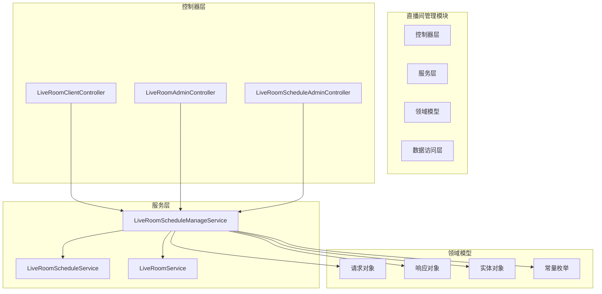
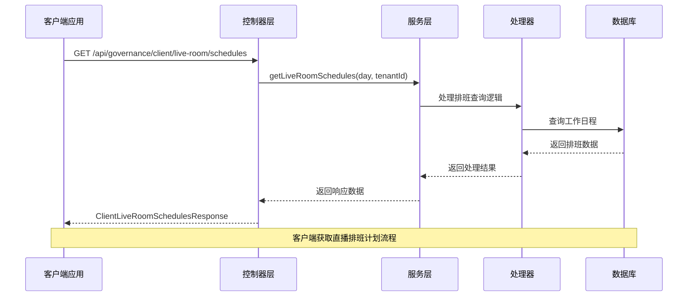
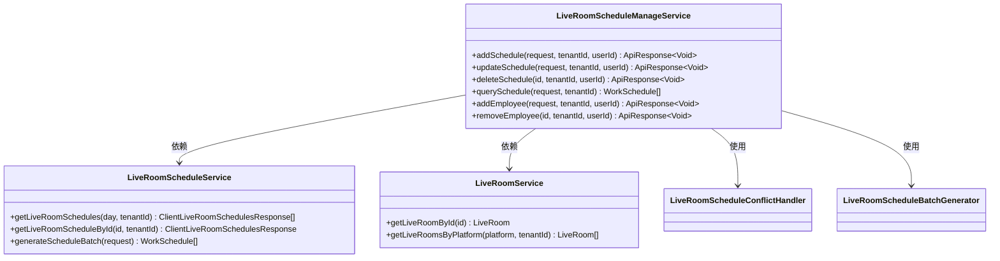
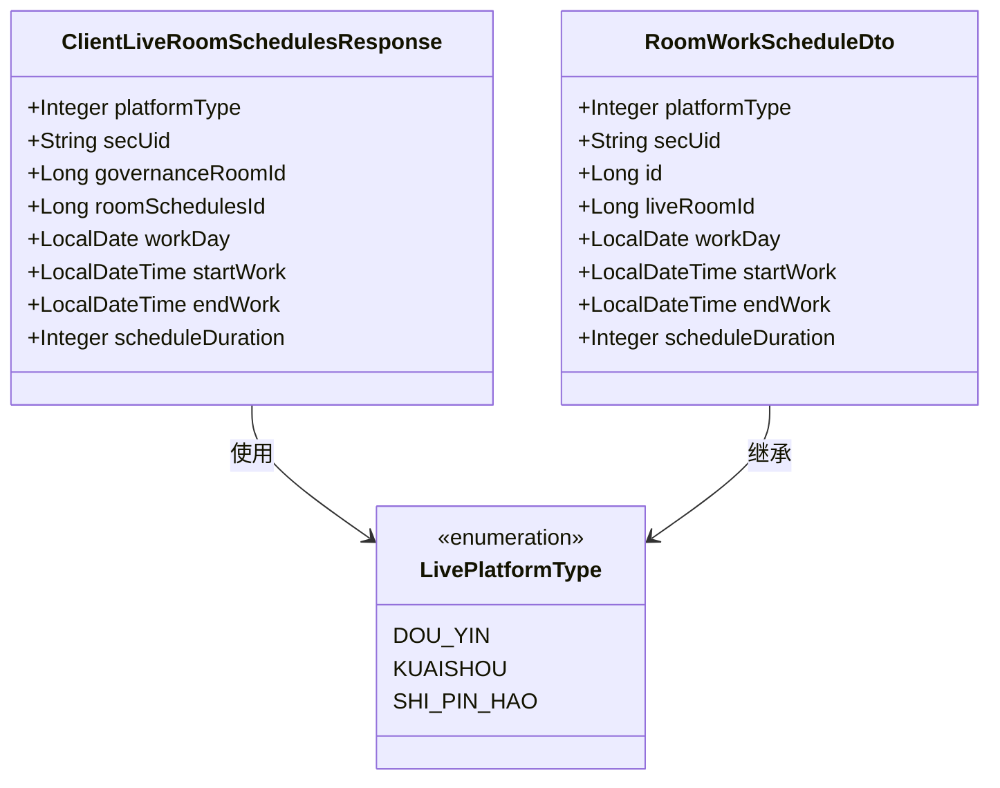
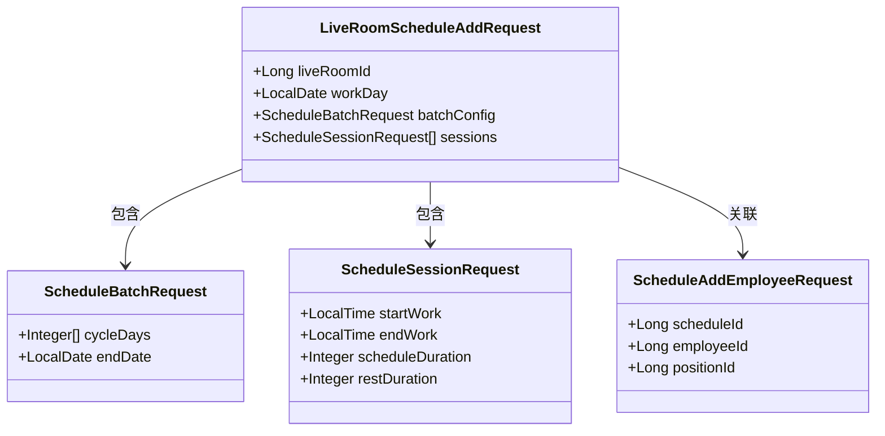
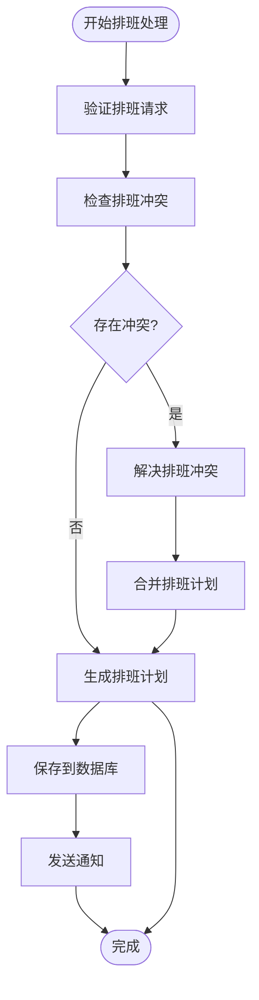
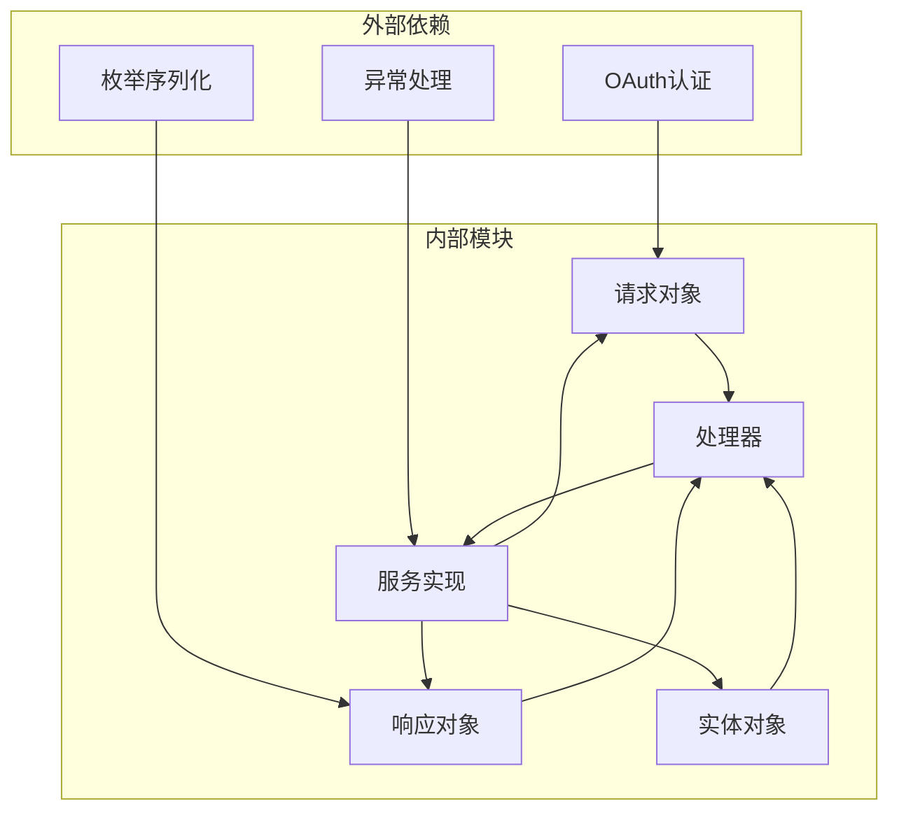

# 直播间管理请求响应

<cite>
**本文档引用的文件**
- [LiveRoomClientController.java](file://src/main/java/com/jiuyu/governance/business/room/controller/LiveRoomClientController.java)
- [LiveRoomScheduleManageServiceImpl.java](file://src/main/java/com/jiuyu/governance/business/room/service/impl/LiveRoomScheduleManageServiceImpl.java)
- [LivePlatformType.java](file://src/main/java/com/jiuyu/governance/business/room/pojo/constants/LivePlatformType.java)
- [ClientLiveRoomSchedulesResponse.java](file://src/main/java/com/jiuyu/governance/business/room/pojo/response/ClientLiveRoomSchedulesResponse.java)
- [RoomWorkScheduleDto.java](file://src/main/java/com/jiuyu/governance/business/room/pojo/response/schedule/RoomWorkScheduleDto.java)
- [LiveRoomScheduleAddRequest.java](file://src/test/java/com/jiuyu/governance/business/room/service/LiveRoomScheduleManageServiceTest.java)
- [ScheduleBatchRequest.java](file://src/test/java/com/jiuyu/governance/business/room/service/LiveRoomScheduleManageServiceTest.java)
- [ScheduleSessionRequest.java](file://src/test/java/com/jiuyu/governance/business/room/service/LiveRoomScheduleManageServiceTest.java)
- [ScheduleAddEmployeeRequest.java](file://src/test/java/com/jiuyu/governance/business/room/service/LiveRoomScheduleManageServiceTest.java)
</cite>

## 目录
1. [简介](#简介)
2. [项目结构](#项目结构)
3. [核心组件](#核心组件)
4. [架构概览](#架构概览)
5. [详细组件分析](#详细组件分析)
6. [依赖关系分析](#依赖关系分析)
7. [性能考虑](#性能考虑)
8. [故障排除指南](#故障排除指南)
9. [结论](#结论)

## 简介

本文件详细说明直播间的管理模块请求响应模型，涵盖直播房间(LiveRoom)、直播排班(LiveRoomSchedule)、工作日程(WorkSchedule)的请求响应对象。重点解释直播房间管理请求，如LiveRoomAddRequest、LiveRoomUpdateRequest、LiveRoomQueryRequest等。详细描述直播排班管理请求，如LiveRoomScheduleAddRequest、LiveRoomSchedulePageRequest、ScheduleEmployeeRequest等。说明员工排班请求，如EmployeeScheduleQueryRequest、ScheduleAddEmployeeRequest等。包含对应的响应对象，如LiveRoomResponse、LiveRoomScheduleResponse、RoomWorkScheduleDto等。特别说明直播平台类型和排班冲突处理的特殊参数。

## 项目结构

直播间管理模块位于业务层的room包中，主要包含以下层次：

**图表来源**
- [LiveRoomClientController.java:1-44](file://src/main/java/com/jiuyu/governance/business/room/controller/LiveRoomClientController.java#L1-L44)
- [LiveRoomScheduleManageServiceImpl.java:22-42](file://src/main/java/com/jiuyu/governance/business/room/service/impl/LiveRoomScheduleManageServiceImpl.java#L22-L42)

**章节来源**
- [LiveRoomClientController.java:1-44](file://src/main/java/com/jiuyu/governance/business/room/controller/LiveRoomClientController.java#L1-L44)
- [LiveRoomScheduleManageServiceImpl.java:22-42](file://src/main/java/com/jiuyu/governance/business/room/service/impl/LiveRoomScheduleManageServiceImpl.java#L22-L42)

## 核心组件

直播间管理模块的核心组件包括：

### 请求响应对象

#### 直播间管理请求
- LiveRoomAddRequest：直播房间新增请求
- LiveRoomUpdateRequest：直播房间更新请求  
- LiveRoomQueryRequest：直播房间查询请求

#### 直播排班管理请求
- LiveRoomScheduleAddRequest：直播排班新增请求
- LiveRoomSchedulePageRequest：直播排班分页查询请求
- ScheduleEmployeeRequest：排班员工请求

#### 员工排班请求
- EmployeeScheduleQueryRequest：员工排班查询请求
- ScheduleAddEmployeeRequest：排班添加员工请求

#### 响应对象
- LiveRoomResponse：直播房间响应对象
- LiveRoomScheduleResponse：直播排班响应对象
- RoomWorkScheduleDto：房间工作排班DTO

**章节来源**
- [LiveRoomScheduleManageServiceImpl.java:22-42](file://src/main/java/com/jiuyu/governance/business/room/service/impl/LiveRoomScheduleManageServiceImpl.java#L22-L42)

## 架构概览

直播间管理模块采用典型的三层架构设计，包含客户端接口和管理端接口：

**图表来源**
- [LiveRoomClientController.java:34-43](file://src/main/java/com/jiuyu/governance/business/room/controller/LiveRoomClientController.java#L34-L43)

**章节来源**
- [LiveRoomClientController.java:34-43](file://src/main/java/com/jiuyu/governance/business/room/controller/LiveRoomClientController.java#L34-L43)

## 详细组件分析

### 直播间排班管理服务

直播间排班管理服务是核心业务逻辑的实现：

**图表来源**
- [LiveRoomScheduleManageServiceImpl.java:22-42](file://src/main/java/com/jiuyu/governance/business/room/service/impl/LiveRoomScheduleManageServiceImpl.java#L22-L42)

### 客户端排班响应模型

客户端排班响应模型用于向客户端提供直播排班信息：

**图表来源**
- [ClientLiveRoomSchedulesResponse.java:19-69](file://src/main/java/com/jiuyu/governance/business/room/pojo/response/ClientLiveRoomSchedulesResponse.java#L19-L69)
- [RoomWorkScheduleDto.java:16-28](file://src/main/java/com/jiuyu/governance/business/room/pojo/response/schedule/RoomWorkScheduleDto.java#L16-L28)
- [LivePlatformType.java:12](file://src/main/java/com/jiuyu/governance/business/room/pojo/constants/LivePlatformType.java#L12)

### 排班请求模型

排班请求模型支持批量排班生成和员工分配：

**图表来源**
- [LiveRoomScheduleAddRequest.java:1-50](file://src/test/java/com/jiuyu/governance/business/room/service/LiveRoomScheduleManageServiceTest.java#L1-L50)
- [ScheduleBatchRequest.java:1-50](file://src/test/java/com/jiuyu/governance/business/room/service/LiveRoomScheduleManageServiceTest.java#L1-L50)
- [ScheduleSessionRequest.java:1-50](file://src/test/java/com/jiuyu/governance/business/room/service/LiveRoomScheduleManageServiceTest.java#L1-L50)
- [ScheduleAddEmployeeRequest.java:1-50](file://src/test/java/com/jiuyu/governance/business/room/service/LiveRoomScheduleManageServiceTest.java#L1-L50)

### 排班冲突处理流程

系统内置排班冲突处理机制：

**图表来源**
- [LiveRoomScheduleManageServiceImpl.java:22-42](file://src/main/java/com/jiuyu/governance/business/room/service/impl/LiveRoomScheduleManageServiceImpl.java#L22-L42)

**章节来源**
- [LiveRoomScheduleManageServiceImpl.java:22-42](file://src/main/java/com/jiuyu/governance/business/room/service/impl/LiveRoomScheduleManageServiceImpl.java#L22-L42)

## 依赖关系分析

直播间管理模块的依赖关系如下：

**图表来源**
- [LiveRoomScheduleManageServiceImpl.java:22-42](file://src/main/java/com/jiuyu/governance/business/room/service/impl/LiveRoomScheduleManageServiceImpl.java#L22-L42)

**章节来源**
- [LiveRoomScheduleManageServiceImpl.java:22-42](file://src/main/java/com/jiuyu/governance/business/room/service/impl/LiveRoomScheduleManageServiceImpl.java#L22-L42)

## 性能考虑

直播间管理模块的性能优化策略：

1. **批量操作优化**：支持批量排班生成，减少数据库交互次数
2. **缓存机制**：对常用配置和枚举值进行缓存
3. **异步处理**：大容量数据处理采用异步方式
4. **分页查询**：支持大数据量的分页查询
5. **连接池管理**：合理配置数据库连接池参数

## 故障排除指南

### 常见问题及解决方案

#### 排班冲突错误
- **症状**：排班创建失败，提示冲突
- **原因**：员工在同一时间段已有其他排班
- **解决方案**：检查现有排班，调整时间或员工分配

#### 平台类型不匹配
- **症状**：直播房间与平台类型不一致
- **原因**：secUid与平台类型不匹配
- **解决方案**：确认直播房间的平台类型设置

#### 数据权限问题
- **症状**：无法访问其他租户的数据
- **原因**：缺少相应的数据权限
- **解决方案**：检查用户权限配置

**章节来源**
- [LiveRoomScheduleManageServiceImpl.java:22-42](file://src/main/java/com/jiuyu/governance/business/room/service/impl/LiveRoomScheduleManageServiceImpl.java#L22-L42)

## 结论

直播间管理模块提供了完整的直播房间和排班管理功能，具有以下特点：

1. **完整的生命周期管理**：从直播房间创建到排班执行的全流程支持
2. **灵活的排班策略**：支持单次排班和批量排班，可配置循环周期
3. **智能冲突检测**：内置排班冲突检测和自动解决机制
4. **多平台支持**：支持抖音、快手、视频号等多种直播平台
5. **完善的权限控制**：基于租户的多租户权限管理

该模块为直播业务提供了可靠的技术支撑，能够满足不同规模企业的直播管理需求。