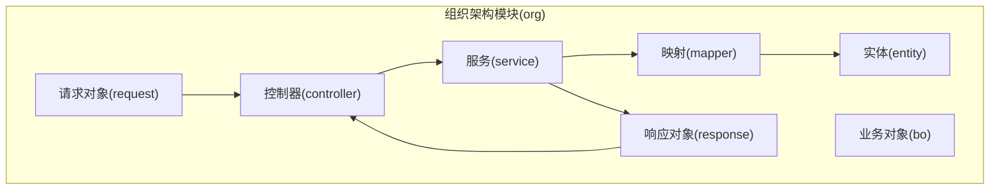
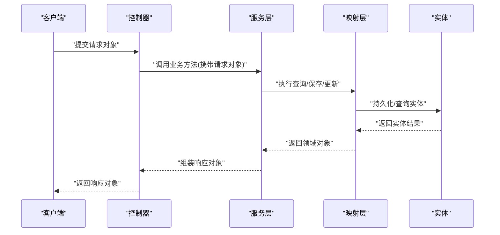
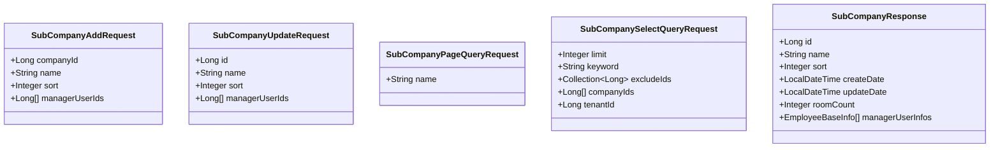
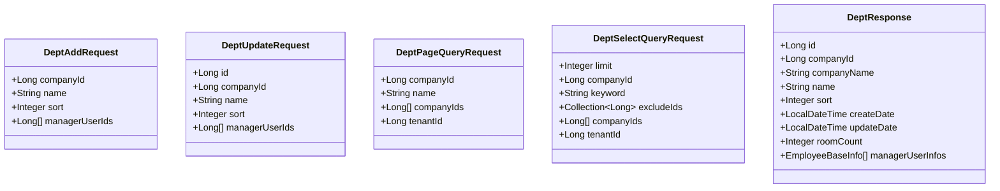
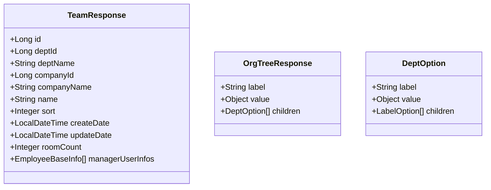
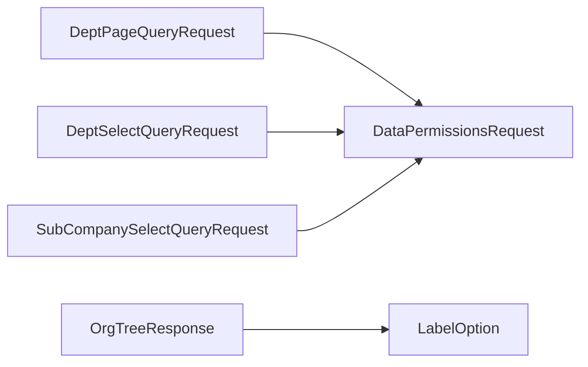

# 组织架构请求响应

<cite>
**本文引用的文件**
- [DeptAddRequest.java](file://src/main/java/com/jiuyu/governance/business/org/pojo/request/DeptAddRequest.java)
- [DeptUpdateRequest.java](file://src/main/java/com/jiuyu/governance/business/org/pojo/request/DeptUpdateRequest.java)
- [DeptPageQueryRequest.java](file://src/main/java/com/jiuyu/governance/business/org/pojo/request/DeptPageQueryRequest.java)
- [DeptSelectQueryRequest.java](file://src/main/java/com/jiuyu/governance/business/org/pojo/request/DeptSelectQueryRequest.java)
- [DeptResponse.java](file://src/main/java/com/jiuyu/governance/business/org/pojo/response/DeptResponse.java)
- [SubCompanyAddRequest.java](file://src/main/java/com/jiuyu/governance/business/org/pojo/request/SubCompanyAddRequest.java)
- [SubCompanyUpdateRequest.java](file://src/main/java/com/jiuyu/governance/business/org/pojo/request/SubCompanyUpdateRequest.java)
- [SubCompanyPageQueryRequest.java](file://src/main/java/com/jiuyu/governance/business/org/pojo/request/SubCompanyPageQueryRequest.java)
- [SubCompanySelectQueryRequest.java](file://src/main/java/com/jiuyu/governance/business/org/pojo/request/SubCompanySelectQueryRequest.java)
- [SubCompanyResponse.java](file://src/main/java/com/jiuyu/governance/business/org/pojo/response/SubCompanyResponse.java)
- [TeamResponse.java](file://src/main/java/com/jiuyu/governance/business/org/pojo/response/TeamResponse.java)
- [OrgTreeResponse.java](file://src/main/java/com/jiuyu/governance/business/org/pojo/response/OrgTreeResponse.java)
</cite>

## 目录
1. [简介](#简介)
2. [项目结构](#项目结构)
3. [核心组件](#核心组件)
4. [架构总览](#架构总览)
5. [详细组件分析](#详细组件分析)
6. [依赖分析](#依赖分析)
7. [性能考虑](#性能考虑)
8. [故障排查指南](#故障排查指南)
9. [结论](#结论)

## 简介
本文件系统性梳理组织架构模块的请求与响应模型，覆盖子公司(SubCompany)、部门(Dept)、小组(Team)、岗位(Position)相关请求对象与响应对象。重点说明各请求对象的字段定义、校验规则与典型使用场景，并解释对应的响应对象结构；同时包含组织架构树形结构的特殊响应对象 OrgTreeResponse 的设计与用途。最后给出请求响应的最佳实践与数据验证指导，帮助开发者在新增、更新、查询与展示组织结构时保持一致性和可维护性。

## 项目结构
组织架构相关代码位于业务模块 org 下，按“请求-响应-实体-服务-映射”分层组织，便于职责分离与扩展。

图示来源
- [DeptAddRequest.java:1-46](file://src/main/java/com/jiuyu/governance/business/org/pojo/request/DeptAddRequest.java#L1-L46)
- [DeptResponse.java:1-68](file://src/main/java/com/jiuyu/governance/business/org/pojo/response/DeptResponse.java#L1-L68)
- [SubCompanyAddRequest.java:1-41](file://src/main/java/com/jiuyu/governance/business/org/pojo/request/SubCompanyAddRequest.java#L1-L41)
- [SubCompanyResponse.java:1-57](file://src/main/java/com/jiuyu/governance/business/org/pojo/response/SubCompanyResponse.java#L1-L57)
- [TeamResponse.java:1-77](file://src/main/java/com/jiuyu/governance/business/org/pojo/response/TeamResponse.java#L1-L77)
- [OrgTreeResponse.java:1-39](file://src/main/java/com/jiuyu/governance/business/org/pojo/response/OrgTreeResponse.java#L1-L39)

章节来源
- [DeptAddRequest.java:1-46](file://src/main/java/com/jiuyu/governance/business/org/pojo/request/DeptAddRequest.java#L1-L46)
- [SubCompanyAddRequest.java:1-41](file://src/main/java/com/jiuyu/governance/business/org/pojo/request/SubCompanyAddRequest.java#L1-L41)

## 核心组件
本节对组织架构四大层级的关键请求与响应对象进行逐项说明，包括字段含义、校验规则与典型使用场景。

- 子公司(SubCompany)
  - 请求对象
    - 新增：SubCompanyAddRequest
      - 字段与校验要点
        - 名称：必填，长度限制
        - 排序：必填
        - 管理员用户ID列表：可选
      - 使用场景：新建子公司时提交基础信息与管理员列表
    - 更新：SubCompanyUpdateRequest
      - 字段与校验要点
        - 主键ID：必填
        - 名称：必填，长度限制
        - 排序：必填
        - 管理员用户ID列表：可选
      - 使用场景：修改子公司信息或变更管理员
    - 分页查询：SubCompanyPageQueryRequest
      - 字段与校验要点
        - 名称关键字：可选
      - 使用场景：按名称筛选子公司并分页展示
    - 下拉选择：SubCompanySelectQueryRequest
      - 字段与校验要点
        - 限制条数、关键字、排除ID集合、公司ID列表、租户ID（忽略序列化）
        - 实现数据权限接口，支持按公司维度的数据权限控制
      - 使用场景：前端下拉框加载子公司选项并应用数据权限
  - 响应对象
    - SubCompanyResponse
      - 字段要点
        - 基础信息：ID、名称、排序、创建/更新时间
        - 指标：直播间数量
        - 管理员信息：列表
      - 使用场景：返回子公司详情或列表项

- 部门(Dept)
  - 请求对象
    - 新增：DeptAddRequest
      - 字段与校验要点
        - 所属公司ID：必填
        - 名称：必填，长度限制
        - 排序：必填
        - 管理员用户ID列表：可选
      - 使用场景：在指定公司下创建新部门
    - 更新：DeptUpdateRequest
      - 字段与校验要点
        - 主键ID：必填
        - 所属公司ID：必填
        - 名称：必填，长度限制
        - 排序：必填
        - 管理员用户ID列表：可选
      - 使用场景：修改部门信息或变更管理员
    - 分页查询：DeptPageQueryRequest
      - 字段与校验要点
        - 所属公司ID、名称关键字
        - 公司ID列表、租户ID（忽略序列化），实现数据权限接口
      - 使用场景：按公司与名称筛选部门并分页展示
    - 下拉选择：DeptSelectQueryRequest
      - 字段与校验要点
        - 限制条数、关键字、排除ID集合、公司ID列表、租户ID（忽略序列化）
        - 实现数据权限接口，支持按部门维度的数据权限控制
      - 使用场景：前端下拉框加载部门选项并应用数据权限
  - 响应对象
    - DeptResponse
      - 字段要点
        - 基础信息：ID、所属公司ID、公司名称、名称、排序、创建/更新时间
        - 指标：直播间数量
        - 管理员信息：列表
      - 使用场景：返回部门详情或列表项

- 小组(Team)
  - 响应对象
    - TeamResponse
      - 字段要点
        - 基础信息：ID、所属部门ID、部门名称、所属公司ID、公司名称、名称、排序、创建/更新时间
        - 指标：直播间数量
        - 管理员信息：列表
      - 使用场景：返回小组详情或列表项

- 岗位(Position)
  - 说明：本仓库未提供岗位的请求与响应对象文件。若需使用，请在后续版本中补充对应请求/响应类，并遵循现有命名规范与校验策略。

- 组织架构树形结构
  - OrgTreeResponse
    - 设计要点
      - 继承通用标签选项基类，用于树形结构展示
      - 子节点为部门选项，部门选项内含小组级子节点
    - 使用场景：以树形结构返回组织架构，便于前端渲染层级关系

章节来源
- [SubCompanyAddRequest.java:1-41](file://src/main/java/com/jiuyu/governance/business/org/pojo/request/SubCompanyAddRequest.java#L1-L41)
- [SubCompanyUpdateRequest.java:1-46](file://src/main/java/com/jiuyu/governance/business/org/pojo/request/SubCompanyUpdateRequest.java#L1-L46)
- [SubCompanyPageQueryRequest.java:1-28](file://src/main/java/com/jiuyu/governance/business/org/pojo/request/SubCompanyPageQueryRequest.java#L1-L28)
- [SubCompanySelectQueryRequest.java:1-110](file://src/main/java/com/jiuyu/governance/business/org/pojo/request/SubCompanySelectQueryRequest.java#L1-L110)
- [SubCompanyResponse.java:1-57](file://src/main/java/com/jiuyu/governance/business/org/pojo/response/SubCompanyResponse.java#L1-L57)
- [DeptAddRequest.java:1-46](file://src/main/java/com/jiuyu/governance/business/org/pojo/request/DeptAddRequest.java#L1-L46)
- [DeptUpdateRequest.java:1-52](file://src/main/java/com/jiuyu/governance/business/org/pojo/request/DeptUpdateRequest.java#L1-L52)
- [DeptPageQueryRequest.java:1-110](file://src/main/java/com/jiuyu/governance/business/org/pojo/request/DeptPageQueryRequest.java#L1-L110)
- [DeptSelectQueryRequest.java:1-116](file://src/main/java/com/jiuyu/governance/business/org/pojo/request/DeptSelectQueryRequest.java#L1-L116)
- [DeptResponse.java:1-68](file://src/main/java/com/jiuyu/governance/business/org/pojo/response/DeptResponse.java#L1-L68)
- [TeamResponse.java:1-77](file://src/main/java/com/jiuyu/governance/business/org/pojo/response/TeamResponse.java#L1-L77)
- [OrgTreeResponse.java:1-39](file://src/main/java/com/jiuyu/governance/business/org/pojo/response/OrgTreeResponse.java#L1-L39)

## 架构总览
组织架构请求-服务-响应的整体交互流程如下：

图示来源
- [DeptAddRequest.java:1-46](file://src/main/java/com/jiuyu/governance/business/org/pojo/request/DeptAddRequest.java#L1-L46)
- [DeptResponse.java:1-68](file://src/main/java/com/jiuyu/governance/business/org/pojo/response/DeptResponse.java#L1-L68)
- [SubCompanyAddRequest.java:1-41](file://src/main/java/com/jiuyu/governance/business/org/pojo/request/SubCompanyAddRequest.java#L1-L41)
- [SubCompanyResponse.java:1-57](file://src/main/java/com/jiuyu/governance/business/org/pojo/response/SubCompanyResponse.java#L1-L57)
- [TeamResponse.java:1-77](file://src/main/java/com/jiuyu/governance/business/org/pojo/response/TeamResponse.java#L1-L77)
- [OrgTreeResponse.java:1-39](file://src/main/java/com/jiuyu/governance/business/org/pojo/response/OrgTreeResponse.java#L1-L39)

## 详细组件分析

### 子公司请求与响应对象
- SubCompanyAddRequest
  - 字段与校验
    - 名称：必填，长度限制
    - 排序：必填
    - 管理员用户ID列表：可选
  - 使用场景：新增子公司时提交基础信息与管理员列表
- SubCompanyUpdateRequest
  - 字段与校验
    - 主键ID：必填
    - 名称：必填，长度限制
    - 排序：必填
    - 管理员用户ID列表：可选
  - 使用场景：修改子公司信息或变更管理员
- SubCompanyPageQueryRequest
  - 字段与校验
    - 名称关键字：可选
  - 使用场景：按名称筛选子公司并分页展示
- SubCompanySelectQueryRequest
  - 字段与校验
    - 限制条数、关键字、排除ID集合、公司ID列表、租户ID（忽略序列化）
    - 实现数据权限接口，支持按公司维度的数据权限控制
  - 使用场景：前端下拉框加载子公司选项并应用数据权限
- SubCompanyResponse
  - 字段要点
    - 基础信息：ID、名称、排序、创建/更新时间
    - 指标：直播间数量
    - 管理员信息：列表
  - 使用场景：返回子公司详情或列表项

图示来源
- [SubCompanyAddRequest.java:1-41](file://src/main/java/com/jiuyu/governance/business/org/pojo/request/SubCompanyAddRequest.java#L1-L41)
- [SubCompanyUpdateRequest.java:1-46](file://src/main/java/com/jiuyu/governance/business/org/pojo/request/SubCompanyUpdateRequest.java#L1-L46)
- [SubCompanyPageQueryRequest.java:1-28](file://src/main/java/com/jiuyu/governance/business/org/pojo/request/SubCompanyPageQueryRequest.java#L1-L28)
- [SubCompanySelectQueryRequest.java:1-110](file://src/main/java/com/jiuyu/governance/business/org/pojo/request/SubCompanySelectQueryRequest.java#L1-L110)
- [SubCompanyResponse.java:1-57](file://src/main/java/com/jiuyu/governance/business/org/pojo/response/SubCompanyResponse.java#L1-L57)

章节来源
- [SubCompanyAddRequest.java:1-41](file://src/main/java/com/jiuyu/governance/business/org/pojo/request/SubCompanyAddRequest.java#L1-L41)
- [SubCompanyUpdateRequest.java:1-46](file://src/main/java/com/jiuyu/governance/business/org/pojo/request/SubCompanyUpdateRequest.java#L1-L46)
- [SubCompanyPageQueryRequest.java:1-28](file://src/main/java/com/jiuyu/governance/business/org/pojo/request/SubCompanyPageQueryRequest.java#L1-L28)
- [SubCompanySelectQueryRequest.java:1-110](file://src/main/java/com/jiuyu/governance/business/org/pojo/request/SubCompanySelectQueryRequest.java#L1-L110)
- [SubCompanyResponse.java:1-57](file://src/main/java/com/jiuyu/governance/business/org/pojo/response/SubCompanyResponse.java#L1-L57)

### 部门请求与响应对象
- DeptAddRequest
  - 字段与校验
    - 所属公司ID：必填
    - 名称：必填，长度限制
    - 排序：必填
    - 管理员用户ID列表：可选
  - 使用场景：在指定公司下创建新部门
- DeptUpdateRequest
  - 字段与校验
    - 主键ID：必填
    - 所属公司ID：必填
    - 名称：必填，长度限制
    - 排序：必填
    - 管理员用户ID列表：可选
  - 使用场景：修改部门信息或变更管理员
- DeptPageQueryRequest
  - 字段与校验
    - 所属公司ID、名称关键字
    - 公司ID列表、租户ID（忽略序列化），实现数据权限接口
  - 使用场景：按公司与名称筛选部门并分页展示
- DeptSelectQueryRequest
  - 字段与校验
    - 限制条数、关键字、排除ID集合、公司ID列表、租户ID（忽略序列化）
    - 实现数据权限接口，支持按部门维度的数据权限控制
  - 使用场景：前端下拉框加载部门选项并应用数据权限
- DeptResponse
  - 字段要点
    - 基础信息：ID、所属公司ID、公司名称、名称、排序、创建/更新时间
    - 指标：直播间数量
    - 管理员信息：列表
  - 使用场景：返回部门详情或列表项

图示来源
- [DeptAddRequest.java:1-46](file://src/main/java/com/jiuyu/governance/business/org/pojo/request/DeptAddRequest.java#L1-L46)
- [DeptUpdateRequest.java:1-52](file://src/main/java/com/jiuyu/governance/business/org/pojo/request/DeptUpdateRequest.java#L1-L52)
- [DeptPageQueryRequest.java:1-110](file://src/main/java/com/jiuyu/governance/business/org/pojo/request/DeptPageQueryRequest.java#L1-L110)
- [DeptSelectQueryRequest.java:1-116](file://src/main/java/com/jiuyu/governance/business/org/pojo/request/DeptSelectQueryRequest.java#L1-L116)
- [DeptResponse.java:1-68](file://src/main/java/com/jiuyu/governance/business/org/pojo/response/DeptResponse.java#L1-L68)

章节来源
- [DeptAddRequest.java:1-46](file://src/main/java/com/jiuyu/governance/business/org/pojo/request/DeptAddRequest.java#L1-L46)
- [DeptUpdateRequest.java:1-52](file://src/main/java/com/jiuyu/governance/business/org/pojo/request/DeptUpdateRequest.java#L1-L52)
- [DeptPageQueryRequest.java:1-110](file://src/main/java/com/jiuyu/governance/business/org/pojo/request/DeptPageQueryRequest.java#L1-L110)
- [DeptSelectQueryRequest.java:1-116](file://src/main/java/com/jiuyu/governance/business/org/pojo/request/DeptSelectQueryRequest.java#L1-L116)
- [DeptResponse.java:1-68](file://src/main/java/com/jiuyu/governance/business/org/pojo/response/DeptResponse.java#L1-L68)

### 小组与组织树形结构
- TeamResponse
  - 字段要点
    - 基础信息：ID、所属部门ID、部门名称、所属公司ID、公司名称、名称、排序、创建/更新时间
    - 指标：直播间数量
    - 管理员信息：列表
  - 使用场景：返回小组详情或列表项
- OrgTreeResponse
  - 设计要点
    - 继承通用标签选项基类，用于树形结构展示
    - 子节点为部门选项，部门选项内含小组级子节点
  - 使用场景：以树形结构返回组织架构，便于前端渲染层级关系

图示来源
- [TeamResponse.java:1-77](file://src/main/java/com/jiuyu/governance/business/org/pojo/response/TeamResponse.java#L1-L77)
- [OrgTreeResponse.java:1-39](file://src/main/java/com/jiuyu/governance/business/org/pojo/response/OrgTreeResponse.java#L1-L39)

章节来源
- [TeamResponse.java:1-77](file://src/main/java/com/jiuyu/governance/business/org/pojo/response/TeamResponse.java#L1-L77)
- [OrgTreeResponse.java:1-39](file://src/main/java/com/jiuyu/governance/business/org/pojo/response/OrgTreeResponse.java#L1-L39)

### 岗位(Position)
- 说明：本仓库未提供岗位的请求与响应对象文件。若需使用，请在后续版本中补充对应请求/响应类，并遵循现有命名规范与校验策略。

## 依赖分析
- 数据权限接口(DataPermissionsRequest)
  - DeptPageQueryRequest、DeptSelectQueryRequest、SubCompanySelectQueryRequest 实现了数据权限接口，通过重写数据类型、租户ID、当前用户ID以及数据ID的获取与设置方法，实现按公司/部门维度的数据权限控制。
- 忽略序列化字段(@JsonIgnore)
  - 多个请求对象中存在忽略序列化的字段，用于内部传递或权限控制，避免对外暴露。
- 继承与复用
  - OrgTreeResponse 继承通用标签选项基类，实现树形结构的统一表达。

图示来源
- [DeptPageQueryRequest.java:1-110](file://src/main/java/com/jiuyu/governance/business/org/pojo/request/DeptPageQueryRequest.java#L1-L110)
- [DeptSelectQueryRequest.java:1-116](file://src/main/java/com/jiuyu/governance/business/org/pojo/request/DeptSelectQueryRequest.java#L1-L116)
- [SubCompanySelectQueryRequest.java:1-110](file://src/main/java/com/jiuyu/governance/business/org/pojo/request/SubCompanySelectQueryRequest.java#L1-L110)
- [OrgTreeResponse.java:1-39](file://src/main/java/com/jiuyu/governance/business/org/pojo/response/OrgTreeResponse.java#L1-L39)

章节来源
- [DeptPageQueryRequest.java:1-110](file://src/main/java/com/jiuyu/governance/business/org/pojo/request/DeptPageQueryRequest.java#L1-L110)
- [DeptSelectQueryRequest.java:1-116](file://src/main/java/com/jiuyu/governance/business/org/pojo/request/DeptSelectQueryRequest.java#L1-L116)
- [SubCompanySelectQueryRequest.java:1-110](file://src/main/java/com/jiuyu/governance/business/org/pojo/request/SubCompanySelectQueryRequest.java#L1-L110)
- [OrgTreeResponse.java:1-39](file://src/main/java/com/jiuyu/governance/business/org/pojo/response/OrgTreeResponse.java#L1-L39)

## 性能考虑
- 分页查询
  - 使用 PageRequest 基类的分页请求对象，建议结合数据库索引与合理分页大小，避免一次性加载大量数据。
- 数据权限过滤
  - 在查询请求中通过数据权限接口注入公司/部门维度的ID集合，可在服务层或SQL层面进行过滤，减少无效数据传输。
- 响应字段裁剪
  - 对于树形结构或列表展示，优先返回必要字段，避免冗余信息导致带宽浪费。
- 缓存策略
  - 对于稳定不变的组织树或下拉选项，可考虑在服务层增加缓存，降低重复计算与数据库压力。

## 故障排查指南
- 参数校验失败
  - 现象：请求参数缺失或格式不合法，触发校验异常。
  - 排查：检查必填字段是否为空、长度限制是否超限、数值型字段是否为null。
  - 参考：请求对象中的注解与提示信息。
- 数据权限问题
  - 现象：查询结果为空或与预期不符。
  - 排查：确认租户ID、当前用户ID、数据类型维度与数据ID集合是否正确设置；核对数据权限接口实现。
- 响应字段不完整
  - 现象：树形结构或列表缺少关键字段。
  - 排查：确认响应对象字段是否已填充；核对服务层组装逻辑。
- 岗位对象缺失
  - 现象：岗位相关接口报错或无法找到对应类。
  - 排查：确认是否已在后续版本中补充岗位请求/响应类。

章节来源
- [DeptAddRequest.java:1-46](file://src/main/java/com/jiuyu/governance/business/org/pojo/request/DeptAddRequest.java#L1-L46)
- [DeptPageQueryRequest.java:1-110](file://src/main/java/com/jiuyu/governance/business/org/pojo/request/DeptPageQueryRequest.java#L1-L110)
- [SubCompanySelectQueryRequest.java:1-110](file://src/main/java/com/jiuyu/governance/business/org/pojo/request/SubCompanySelectQueryRequest.java#L1-L110)
- [TeamResponse.java:1-77](file://src/main/java/com/jiuyu/governance/business/org/pojo/response/TeamResponse.java#L1-L77)
- [OrgTreeResponse.java:1-39](file://src/main/java/com/jiuyu/governance/business/org/pojo/response/OrgTreeResponse.java#L1-L39)

## 结论
本文档系统梳理了组织架构模块的请求与响应模型，明确了子公司、部门、小组与岗位相关对象的字段定义、校验规则与使用场景，并解释了树形结构响应的设计思路。建议在实际开发中严格遵循现有命名与校验规范，结合数据权限接口实现安全可控的组织管理能力；对于缺失的岗位对象，应在后续版本补齐，确保模块完整性。