# 请求响应模型

<cite>
**本文引用的文件**
- [DeptAddRequest.java](file://src/main/java/com/jiuyu/governance/business/org/pojo/request/DeptAddRequest.java)
- [DeptUpdateRequest.java](file://src/main/java/com/jiuyu/governance/business/org/pojo/request/DeptUpdateRequest.java)
- [DeptResponse.java](file://src/main/java/com/jiuyu/governance/business/org/pojo/response/DeptResponse.java)
- [EmployeeQueryRequest.java](file://src/main/java/com/jiuyu/governance/business/rbac/pojo/request/EmployeeQueryRequest.java)
- [RolePageQueryRequest.java](file://src/main/java/com/jiuyu/governance/business/rbac/pojo/request/RolePageQueryRequest.java)
- [EmployeeInfoResponse.java](file://src/main/java/com/jiuyu/governance/business/rbac/pojo/response/EmployeeInfoResponse.java)
- [RoleDetailResponse.java](file://src/main/java/com/jiuyu/governance/business/rbac/pojo/response/RoleDetailResponse.java)
- [DataPermissionsPageRequest.java](file://src/main/java/com/jiuyu/governance/common/pojo/request/DataPermissionsPageRequest.java)
- [EmployeeBaseInfo.java](file://src/main/java/com/jiuyu/governance/business/rbac/pojo/response/EmployeeBaseInfo.java)
- [MenuTreeResponse.java](file://src/main/java/com/jiuyu/governance/business/rbac/pojo/response/MenuTreeResponse.java)
</cite>

## 目录
1. [简介](#简介)
2. [项目结构](#项目结构)
3. [核心组件](#核心组件)
4. [架构总览](#架构总览)
5. [详细组件分析](#详细组件分析)
6. [依赖分析](#依赖分析)
7. [性能考量](#性能考量)
8. [故障排查指南](#故障排查指南)
9. [结论](#结论)
10. [附录](#附录)

## 简介
本文件面向前端与API使用者，系统化梳理“fupan-governance-server”中组织架构与人员权限模块的请求与响应模型，覆盖以下主题：
- 组织架构：部门新增/更新请求与部门响应对象
- 人员权限：员工查询请求与员工信息响应、角色分页查询请求与角色详情响应
- 参数校验规则与数据权限集成
- API数据传输格式与最佳实践
- 安全注意事项与常见问题排查

## 项目结构
本次文档聚焦于以下包与类：
- 组织架构请求/响应：org 模块下的 request/response 包
- 人员权限请求/响应：rbac 模块下的 request/response 包
- 数据权限基类：common 模块下的 request 包

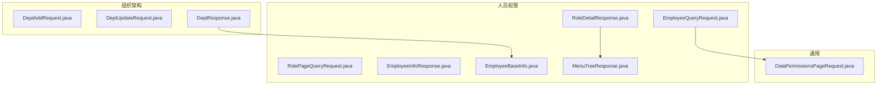

图表来源
- [DeptAddRequest.java:1-46](file://src/main/java/com/jiuyu/governance/business/org/pojo/request/DeptAddRequest.java#L1-L46)
- [DeptUpdateRequest.java:1-52](file://src/main/java/com/jiuyu/governance/business/org/pojo/request/DeptUpdateRequest.java#L1-L52)
- [DeptResponse.java:1-68](file://src/main/java/com/jiuyu/governance/business/org/pojo/response/DeptResponse.java#L1-L68)
- [EmployeeQueryRequest.java:1-60](file://src/main/java/com/jiuyu/governance/business/rbac/pojo/request/EmployeeQueryRequest.java#L1-L60)
- [RolePageQueryRequest.java:1-26](file://src/main/java/com/jiuyu/governance/business/rbac/pojo/request/RolePageQueryRequest.java#L1-L26)
- [EmployeeInfoResponse.java:1-122](file://src/main/java/com/jiuyu/governance/business/rbac/pojo/response/EmployeeInfoResponse.java#L1-L122)
- [RoleDetailResponse.java:1-30](file://src/main/java/com/jiuyu/governance/business/rbac/pojo/response/RoleDetailResponse.java#L1-L30)
- [DataPermissionsPageRequest.java:1-178](file://src/main/java/com/jiuyu/governance/common/pojo/request/DataPermissionsPageRequest.java#L1-L178)
- [EmployeeBaseInfo.java:1-41](file://src/main/java/com/jiuyu/governance/business/rbac/pojo/response/EmployeeBaseInfo.java#L1-L41)
- [MenuTreeResponse.java:1-75](file://src/main/java/com/jiuyu/governance/business/rbac/pojo/response/MenuTreeResponse.java#L1-L75)

章节来源
- [DeptAddRequest.java:1-46](file://src/main/java/com/jiuyu/governance/business/org/pojo/request/DeptAddRequest.java#L1-L46)
- [DeptUpdateRequest.java:1-52](file://src/main/java/com/jiuyu/governance/business/org/pojo/request/DeptUpdateRequest.java#L1-L52)
- [DeptResponse.java:1-68](file://src/main/java/com/jiuyu/governance/business/org/pojo/response/DeptResponse.java#L1-L68)
- [EmployeeQueryRequest.java:1-60](file://src/main/java/com/jiuyu/governance/business/rbac/pojo/request/EmployeeQueryRequest.java#L1-L60)
- [RolePageQueryRequest.java:1-26](file://src/main/java/com/jiuyu/governance/business/rbac/pojo/request/RolePageQueryRequest.java#L1-L26)
- [EmployeeInfoResponse.java:1-122](file://src/main/java/com/jiuyu/governance/business/rbac/pojo/response/EmployeeInfoResponse.java#L1-L122)
- [RoleDetailResponse.java:1-30](file://src/main/java/com/jiuyu/governance/business/rbac/pojo/response/RoleDetailResponse.java#L1-L30)
- [DataPermissionsPageRequest.java:1-178](file://src/main/java/com/jiuyu/governance/common/pojo/request/DataPermissionsPageRequest.java#L1-L178)
- [EmployeeBaseInfo.java:1-41](file://src/main/java/com/jiuyu/governance/business/rbac/pojo/response/EmployeeBaseInfo.java#L1-L41)
- [MenuTreeResponse.java:1-75](file://src/main/java/com/jiuyu/governance/business/rbac/pojo/response/MenuTreeResponse.java#L1-L75)

## 核心组件
本节对关键请求/响应对象进行逐项说明，包括字段含义、校验规则与典型用途。

- 组织架构请求
  - 部门新增请求（DeptAddRequest）
    - 字段：所属公司ID、部门名称、排序、管理员用户ID列表
    - 校验：所属公司ID必填；部门名称非空且长度限制；排序必填；管理员ID可选
    - 用途：新增部门时提交基础信息与初始管理员
  - 部门更新请求（DeptUpdateRequest）
    - 字段：ID、所属公司ID、部门名称、排序、管理员用户ID列表
    - 校验：ID必填；其余与新增一致
    - 用途：更新已有部门信息
  - 部门响应（DeptResponse）
    - 字段：ID、所属公司ID与名称、部门名称、排序、创建/更新时间、直播间数量、部门管理员信息列表
    - 用途：返回部门完整信息，含关联管理员的基础信息

- 人员权限请求
  - 员工分页查询请求（EmployeeQueryRequest）
    - 继承：DataPermissionsPageRequest（分页+数据权限）
    - 字段：姓名、工号、手机号、所属岗位ID列表、开启录制权限、就职类型、账户状态
    - 用途：支持多维条件筛选与数据权限控制的员工分页查询
  - 角色分页查询请求（RolePageQueryRequest）
    - 字段：分页参数、角色名关键字
    - 用途：按角色名关键字进行分页检索

- 人员权限响应
  - 员工信息响应（EmployeeInfoResponse）
    - 字段：ID、姓名、头像、工号、手机、邮箱、所属公司/部门/小组/岗位及名称、角色ID与名称、开启录制权限、就职类型、账户状态、是否租户管理员
    - 用途：返回员工完整档案，用于展示与授权判断
  - 角色详情响应（RoleDetailResponse）
    - 字段：角色ID、角色名、菜单树
    - 用途：返回角色所拥有的菜单树结构，用于前端渲染与权限勾选

- 数据权限基类
  - DataPermissionsPageRequest
    - 字段：租户ID、当前用户ID、公司/部门/小组ID集合、系统用户标记
    - 方法：数据权限类型维度声明、租户与用户初始化、按维度查找/设置数据ID、判空与包含性判断
    - 用途：统一承载数据权限上下文，供各查询请求复用

- 辅助响应
  - 员工基本信息（EmployeeBaseInfo）
    - 字段：ID、姓名、头像、工号、手机
    - 用途：作为部门响应中的管理员信息载体
  - 菜单树（MenuTreeResponse）
    - 字段：菜单ID、父ID、名称、URL、类型、排序、图标、权限码、创建/更新时间、子节点
    - 用途：角色详情中返回的菜单树结构

章节来源
- [DeptAddRequest.java:17-46](file://src/main/java/com/jiuyu/governance/business/org/pojo/request/DeptAddRequest.java#L17-L46)
- [DeptUpdateRequest.java:17-52](file://src/main/java/com/jiuyu/governance/business/org/pojo/request/DeptUpdateRequest.java#L17-L52)
- [DeptResponse.java:16-68](file://src/main/java/com/jiuyu/governance/business/org/pojo/response/DeptResponse.java#L16-L68)
- [EmployeeQueryRequest.java:16-60](file://src/main/java/com/jiuyu/governance/business/rbac/pojo/request/EmployeeQueryRequest.java#L16-L60)
- [RolePageQueryRequest.java:15-26](file://src/main/java/com/jiuyu/governance/business/rbac/pojo/request/RolePageQueryRequest.java#L15-L26)
- [EmployeeInfoResponse.java:15-122](file://src/main/java/com/jiuyu/governance/business/rbac/pojo/response/EmployeeInfoResponse.java#L15-L122)
- [RoleDetailResponse.java:13-30](file://src/main/java/com/jiuyu/governance/business/rbac/pojo/response/RoleDetailResponse.java#L13-L30)
- [DataPermissionsPageRequest.java:19-178](file://src/main/java/com/jiuyu/governance/common/pojo/request/DataPermissionsPageRequest.java#L19-L178)
- [EmployeeBaseInfo.java:12-41](file://src/main/java/com/jiuyu/governance/business/rbac/pojo/response/EmployeeBaseInfo.java#L12-L41)
- [MenuTreeResponse.java:15-75](file://src/main/java/com/jiuyu/governance/business/rbac/pojo/response/MenuTreeResponse.java#L15-L75)

## 架构总览
下图展示了请求对象与响应对象之间的映射关系与数据流向：

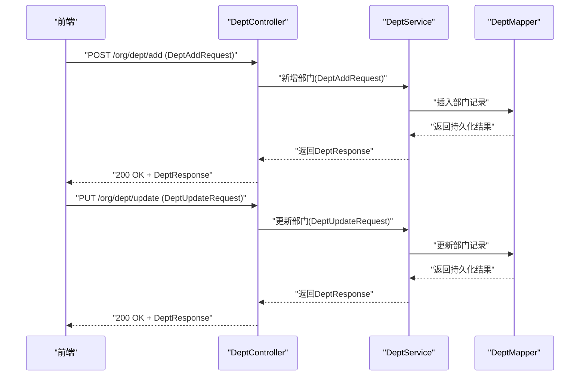

图表来源
- [DeptAddRequest.java:17-46](file://src/main/java/com/jiuyu/governance/business/org/pojo/request/DeptAddRequest.java#L17-L46)
- [DeptUpdateRequest.java:17-52](file://src/main/java/com/jiuyu/governance/business/org/pojo/request/DeptUpdateRequest.java#L17-L52)
- [DeptResponse.java:16-68](file://src/main/java/com/jiuyu/governance/business/org/pojo/response/DeptResponse.java#L16-L68)

## 详细组件分析

### 组织架构请求与响应

#### 部门新增请求（DeptAddRequest）
- 关键字段与校验
  - 所属公司ID：必填
  - 部门名称：必填，长度上限
  - 排序：必填
  - 管理员用户ID列表：可选
- 使用场景
  - 新建部门并指定初始管理员
- 数据传输格式
  - JSON 对象，字段名与类型见类定义

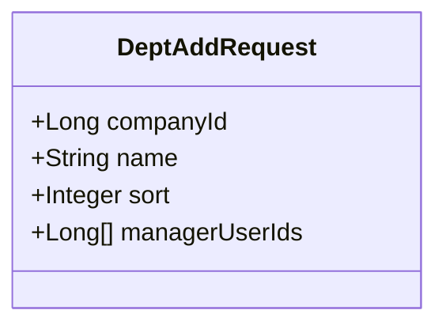

图表来源
- [DeptAddRequest.java:17-46](file://src/main/java/com/jiuyu/governance/business/org/pojo/request/DeptAddRequest.java#L17-L46)

章节来源
- [DeptAddRequest.java:17-46](file://src/main/java/com/jiuyu/governance/business/org/pojo/request/DeptAddRequest.java#L17-L46)

#### 部门更新请求（DeptUpdateRequest）
- 关键字段与校验
  - ID：必填（标识待更新记录）
  - 所属公司ID：必填
  - 部门名称：必填，长度上限
  - 排序：必填
  - 管理员用户ID列表：可选
- 使用场景
  - 更新部门基础信息或管理员变更
- 数据传输格式
  - JSON 对象，字段名与类型见类定义

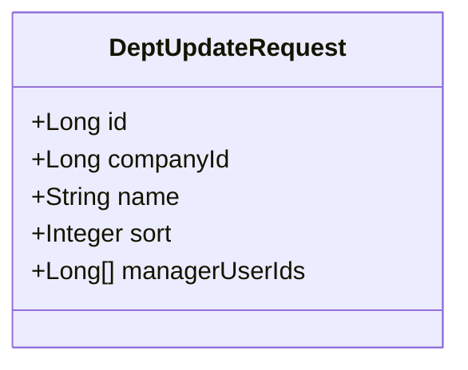

图表来源
- [DeptUpdateRequest.java:17-52](file://src/main/java/com/jiuyu/governance/business/org/pojo/request/DeptUpdateRequest.java#L17-L52)

章节来源
- [DeptUpdateRequest.java:17-52](file://src/main/java/com/jiuyu/governance/business/org/pojo/request/DeptUpdateRequest.java#L17-L52)

#### 部门响应（DeptResponse）
- 关键字段
  - 基础信息：ID、所属公司ID/名称、部门名称、排序、创建/更新时间
  - 业务指标：直播间数量
  - 管理员信息：列表，元素为 EmployeeBaseInfo
- 使用场景
  - 列表与详情展示，含管理员列表
- 数据传输格式
  - JSON 对象，字段名与类型见类定义

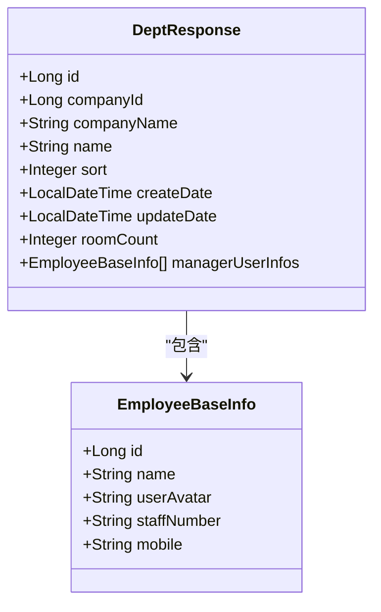

图表来源
- [DeptResponse.java:16-68](file://src/main/java/com/jiuyu/governance/business/org/pojo/response/DeptResponse.java#L16-L68)
- [EmployeeBaseInfo.java:12-41](file://src/main/java/com/jiuyu/governance/business/rbac/pojo/response/EmployeeBaseInfo.java#L12-L41)

章节来源
- [DeptResponse.java:16-68](file://src/main/java/com/jiuyu/governance/business/org/pojo/response/DeptResponse.java#L16-L68)
- [EmployeeBaseInfo.java:12-41](file://src/main/java/com/jiuyu/governance/business/rbac/pojo/response/EmployeeBaseInfo.java#L12-L41)

### 人员权限请求与响应

#### 员工分页查询请求（EmployeeQueryRequest）
- 继承关系
  - 继承自 DataPermissionsPageRequest，具备分页与数据权限能力
- 关键字段
  - 姓名、工号、手机号
  - 所属岗位ID列表
  - 开启录制权限、就职类型、账户状态
- 使用场景
  - 支持多条件组合查询与数据权限过滤
- 数据传输格式
  - JSON 对象，字段名与类型见类定义

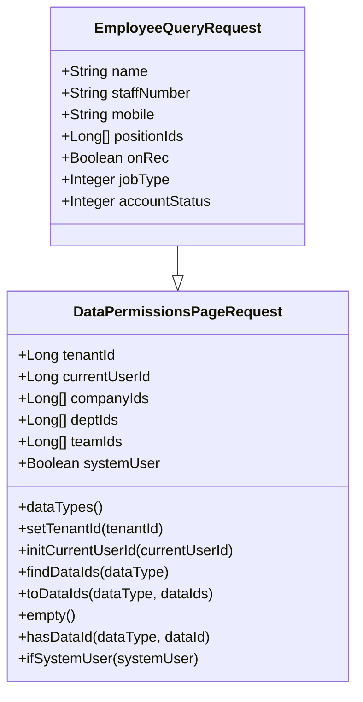

图表来源
- [DataPermissionsPageRequest.java:19-178](file://src/main/java/com/jiuyu/governance/common/pojo/request/DataPermissionsPageRequest.java#L19-L178)
- [EmployeeQueryRequest.java:16-60](file://src/main/java/com/jiuyu/governance/business/rbac/pojo/request/EmployeeQueryRequest.java#L16-L60)

章节来源
- [DataPermissionsPageRequest.java:19-178](file://src/main/java/com/jiuyu/governance/common/pojo/request/DataPermissionsPageRequest.java#L19-L178)
- [EmployeeQueryRequest.java:16-60](file://src/main/java/com/jiuyu/governance/business/rbac/pojo/request/EmployeeQueryRequest.java#L16-L60)

#### 角色分页查询请求（RolePageQueryRequest）
- 关键字段
  - 分页参数（由父类 PageRequest 提供）
  - 角色名关键字
- 使用场景
  - 按关键字分页检索角色
- 数据传输格式
  - JSON 对象，字段名与类型见类定义

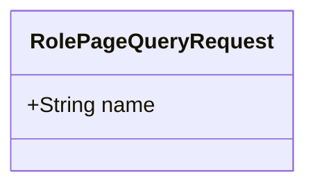

图表来源
- [RolePageQueryRequest.java:15-26](file://src/main/java/com/jiuyu/governance/business/rbac/pojo/request/RolePageQueryRequest.java#L15-L26)

章节来源
- [RolePageQueryRequest.java:15-26](file://src/main/java/com/jiuyu/governance/business/rbac/pojo/request/RolePageQueryRequest.java#L15-L26)

#### 员工信息响应（EmployeeInfoResponse）
- 关键字段
  - 基本信息：ID、姓名、头像、工号、手机、邮箱
  - 组织关系：所属公司/部门/小组/岗位ID与名称
  - 角色：角色ID与名称
  - 权限与状态：开启录制权限、就职类型、账户状态、是否租户管理员
- 使用场景
  - 展示员工档案、权限与组织归属
- 数据传输格式
  - JSON 对象，字段名与类型见类定义

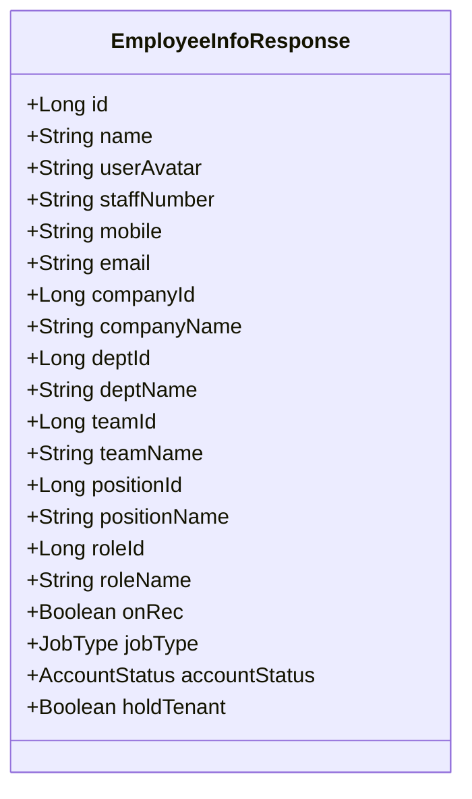

图表来源
- [EmployeeInfoResponse.java:15-122](file://src/main/java/com/jiuyu/governance/business/rbac/pojo/response/EmployeeInfoResponse.java#L15-L122)

章节来源
- [EmployeeInfoResponse.java:15-122](file://src/main/java/com/jiuyu/governance/business/rbac/pojo/response/EmployeeInfoResponse.java#L15-L122)

#### 角色详情响应（RoleDetailResponse）
- 关键字段
  - 角色ID、角色名
  - 菜单树：List<MenuTreeResponse>
- 使用场景
  - 展示角色权限树，用于勾选与授权
- 数据传输格式
  - JSON 对象，字段名与类型见类定义

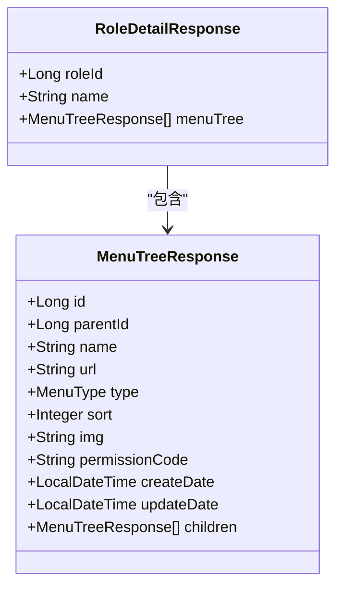

图表来源
- [RoleDetailResponse.java:13-30](file://src/main/java/com/jiuyu/governance/business/rbac/pojo/response/RoleDetailResponse.java#L13-L30)
- [MenuTreeResponse.java:15-75](file://src/main/java/com/jiuyu/governance/business/rbac/pojo/response/MenuTreeResponse.java#L15-L75)

章节来源
- [RoleDetailResponse.java:13-30](file://src/main/java/com/jiuyu/governance/business/rbac/pojo/response/RoleDetailResponse.java#L13-L30)
- [MenuTreeResponse.java:15-75](file://src/main/java/com/jiuyu/governance/business/rbac/pojo/response/MenuTreeResponse.java#L15-L75)

### 数据权限流程（EmployeeQueryRequest）

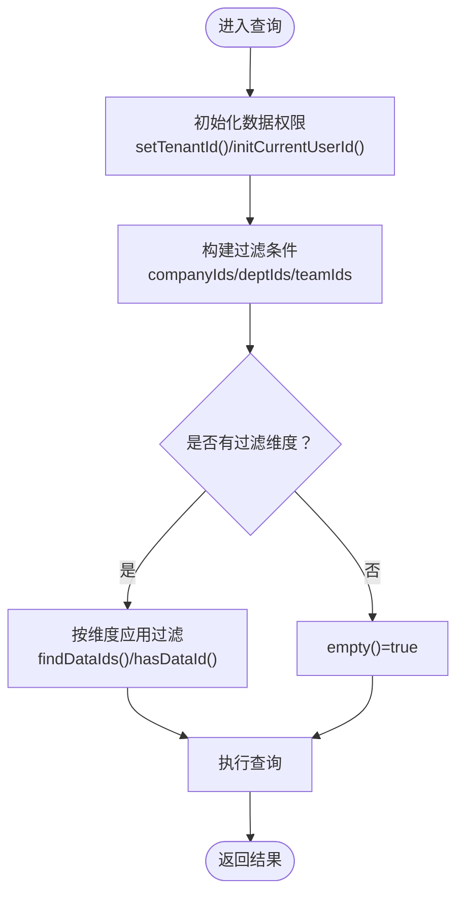

图表来源
- [DataPermissionsPageRequest.java:78-177](file://src/main/java/com/jiuyu/governance/common/pojo/request/DataPermissionsPageRequest.java#L78-L177)

章节来源
- [DataPermissionsPageRequest.java:78-177](file://src/main/java/com/jiuyu/governance/common/pojo/request/DataPermissionsPageRequest.java#L78-L177)

## 依赖分析
- EmployeeQueryRequest 继承 DataPermissionsPageRequest，从而获得数据权限过滤能力
- DeptResponse 中的管理员信息使用 EmployeeBaseInfo，形成轻量级人员信息聚合
- RoleDetailResponse 的菜单树使用 MenuTreeResponse，实现树形结构渲染

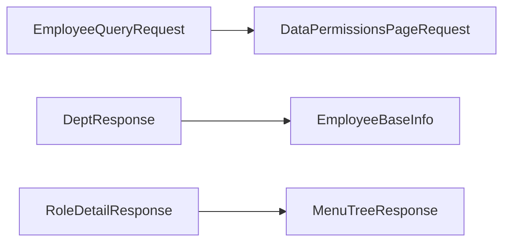

图表来源
- [EmployeeQueryRequest.java:16-60](file://src/main/java/com/jiuyu/governance/business/rbac/pojo/request/EmployeeQueryRequest.java#L16-L60)
- [DataPermissionsPageRequest.java:19-178](file://src/main/java/com/jiuyu/governance/common/pojo/request/DataPermissionsPageRequest.java#L19-L178)
- [DeptResponse.java:16-68](file://src/main/java/com/jiuyu/governance/business/org/pojo/response/DeptResponse.java#L16-L68)
- [EmployeeBaseInfo.java:12-41](file://src/main/java/com/jiuyu/governance/business/rbac/pojo/response/EmployeeBaseInfo.java#L12-L41)
- [RoleDetailResponse.java:13-30](file://src/main/java/com/jiuyu/governance/business/rbac/pojo/response/RoleDetailResponse.java#L13-L30)
- [MenuTreeResponse.java:15-75](file://src/main/java/com/jiuyu/governance/business/rbac/pojo/response/MenuTreeResponse.java#L15-L75)

章节来源
- [EmployeeQueryRequest.java:16-60](file://src/main/java/com/jiuyu/governance/business/rbac/pojo/request/EmployeeQueryRequest.java#L16-L60)
- [DataPermissionsPageRequest.java:19-178](file://src/main/java/com/jiuyu/governance/common/pojo/request/DataPermissionsPageRequest.java#L19-L178)
- [DeptResponse.java:16-68](file://src/main/java/com/jiuyu/governance/business/org/pojo/response/DeptResponse.java#L16-L68)
- [EmployeeBaseInfo.java:12-41](file://src/main/java/com/jiuyu/governance/business/rbac/pojo/response/EmployeeBaseInfo.java#L12-L41)
- [RoleDetailResponse.java:13-30](file://src/main/java/com/jiuyu/governance/business/rbac/pojo/response/RoleDetailResponse.java#L13-L30)
- [MenuTreeResponse.java:15-75](file://src/main/java/com/jiuyu/governance/business/rbac/pojo/response/MenuTreeResponse.java#L15-L75)

## 性能考量
- 分页查询
  - 使用 PageRequest 基类进行分页，建议前端传入合理页码与大小，避免超大结果集
- 数据权限过滤
  - 在 EmployeeQueryRequest 中通过 companyIds/deptIds/teamIds 进行过滤，建议后端在查询层拼接对应 WHERE 条件，减少内存过滤
- 响应体积
  - DeptResponse 返回管理员列表，若管理员较多，建议前端按需加载或分页
  - RoleDetailResponse 返回菜单树，建议前端做懒加载与本地缓存

## 故障排查指南
- 参数校验失败
  - 部门新增/更新请求：所属公司ID、部门名称、排序为必填；部门名称长度受限
  - 员工信息响应：角色ID为必填
  - 建议：前端在提交前进行本地校验，后端统一抛出明确错误信息
- 数据权限异常
  - 若 empty() 为 true 或 hasDataId() 返回 false，可能由于未正确设置租户/用户或过滤维度为空
  - 建议：确认 DataPermissionsPageRequest 的初始化与过滤维度设置
- 响应字段缺失
  - 确认后端版本与前端字段映射一致；关注可选字段（如管理员ID列表、岗位ID列表）可能为空

章节来源
- [DeptAddRequest.java:24-38](file://src/main/java/com/jiuyu/governance/business/org/pojo/request/DeptAddRequest.java#L24-L38)
- [DeptUpdateRequest.java:24-44](file://src/main/java/com/jiuyu/governance/business/org/pojo/request/DeptUpdateRequest.java#L24-L44)
- [EmployeeInfoResponse.java:93-94](file://src/main/java/com/jiuyu/governance/business/rbac/pojo/response/EmployeeInfoResponse.java#L93-L94)
- [DataPermissionsPageRequest.java:138-166](file://src/main/java/com/jiuyu/governance/common/pojo/request/DataPermissionsPageRequest.java#L138-L166)

## 结论
本文档系统梳理了组织架构与人员权限模块的关键请求/响应模型，明确了字段语义、校验规则与数据权限集成方式，并提供了架构与流程图示。建议前后端在字段命名、分页策略与权限过滤上保持一致，以确保API交互稳定可靠。

## 附录
- API 数据传输格式
  - 所有请求/响应均采用 JSON 对象形式
  - 时间字段采用标准时间格式（如 LocalDateTime）
  - 枚举字段（如就职类型、菜单类型）建议以字符串或数值形式传递，前端需与后端枚举值保持一致
- 最佳实践
  - 前端：本地参数校验 + 合理分页 + 缓存菜单树与人员信息
  - 后端：严格参数校验 + 数据权限前置过滤 + 明确错误码与提示
- 安全考虑
  - 避免在响应中泄露敏感字段（如密码、令牌）
  - 对高风险操作（新增/更新部门、分配角色）启用二次确认与审计日志