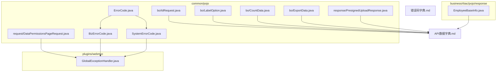
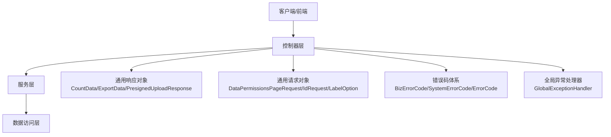
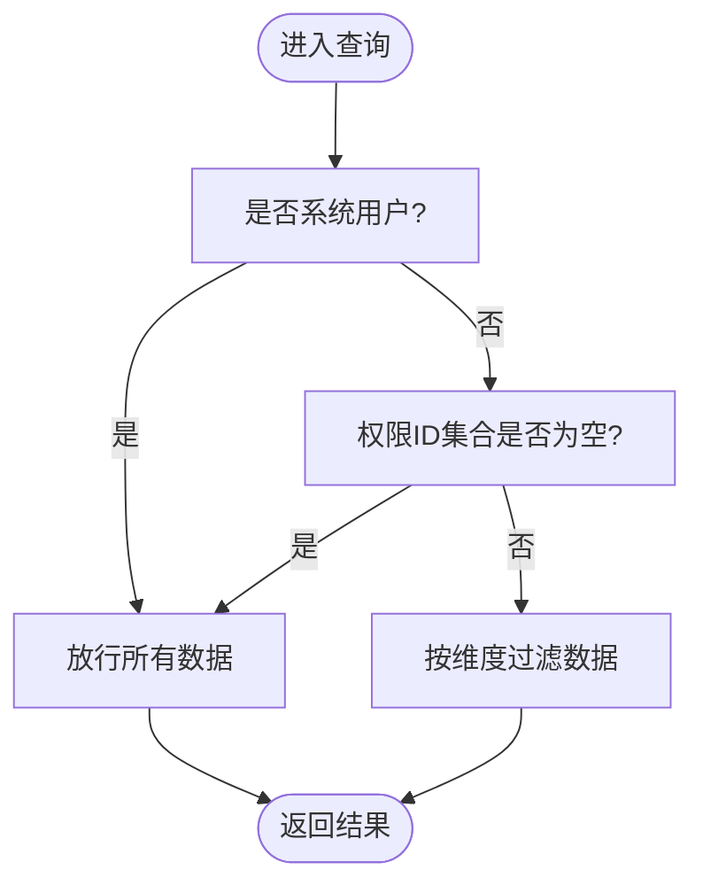
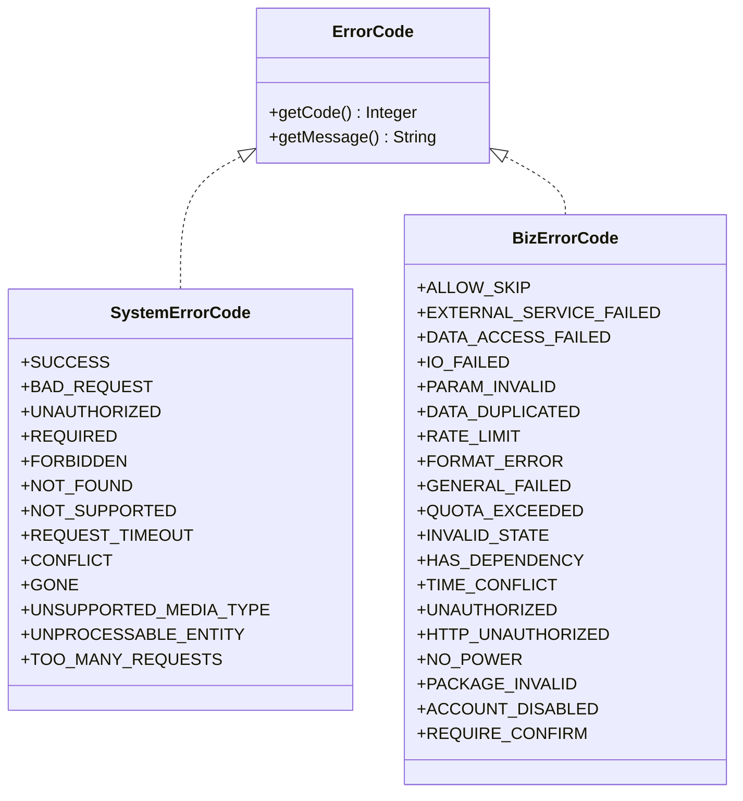
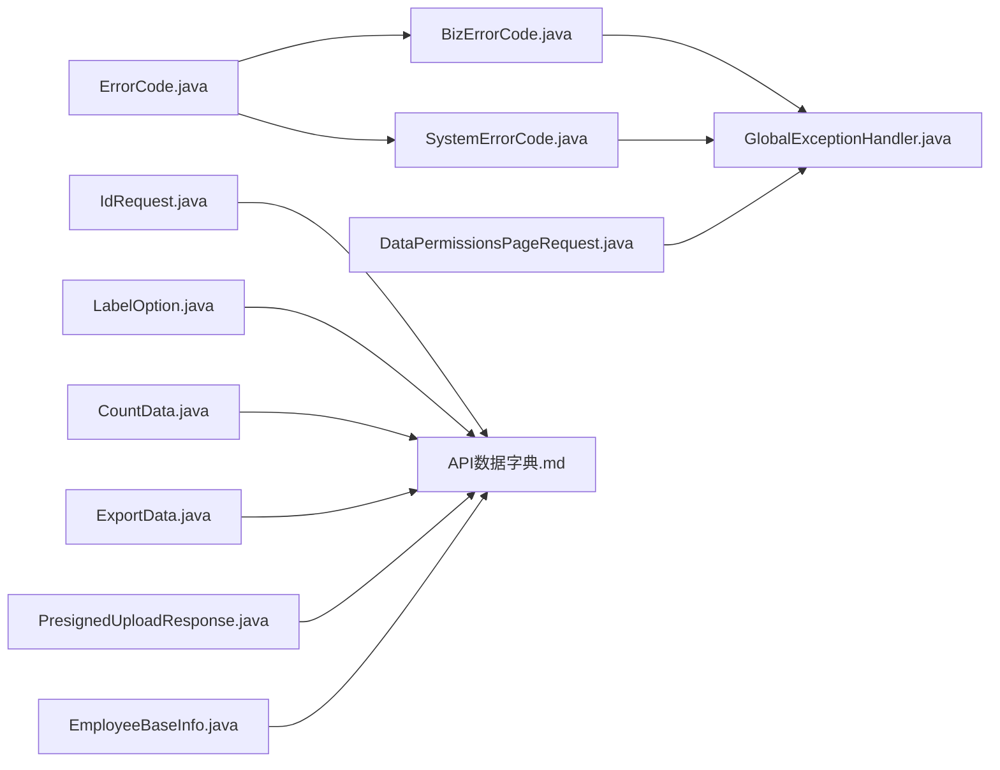

# 通用请求响应

<cite>
**本文引用的文件**
- [DataPermissionsPageRequest.java](file://src/main/java/com/jiuyu/governance/common/pojo/request/DataPermissionsPageRequest.java)
- [IdRequest.java](file://src/main/java/com/jiuyu/governance/common/pojo/bo/IdRequest.java)
- [LabelOption.java](file://src/main/java/com/jiuyu/governance/common/pojo/bo/LabelOption.java)
- [CountData.java](file://src/main/java/com/jiuyu/governance/common/pojo/bo/CountData.java)
- [ExportData.java](file://src/main/java/com/jiuyu/governance/common/pojo/bo/ExportData.java)
- [PresignedUploadResponse.java](file://src/main/java/com/jiuyu/governance/common/pojo/response/PresignedUploadResponse.java)
- [BizErrorCode.java](file://src/main/java/com/jiuyu/governance/common/pojo/BizErrorCode.java)
- [SystemErrorCode.java](file://src/main/java/com/jiuyu/governance/common/pojo/SystemErrorCode.java)
- [ErrorCode.java](file://src/main/java/com/jiuyu/governance/common/pojo/ErrorCode.java)
- [GlobalExceptionHandler.java](file://src/main/java/com/jiuyu/governance/plugins/webmvc/GlobalExceptionHandler.java)
- [EmployeeBaseInfo.java](file://src/main/java/com/jiuyu/governance/business/rbac/pojo/response/EmployeeBaseInfo.java)
- [API数据字典.md](file://API_DATA_DICTIONARY.md)
- [错误码字典.md](file://ERROR_CODE_DICT.md)
</cite>

## 目录
1. [简介](#简介)
2. [项目结构](#项目结构)
3. [核心组件](#核心组件)
4. [架构总览](#架构总览)
5. [详细组件分析](#详细组件分析)
6. [依赖分析](#依赖分析)
7. [性能考虑](#性能考虑)
8. [故障排查指南](#故障排查指南)
9. [结论](#结论)
10. [附录](#附录)

## 简介
本文件系统化梳理并说明本项目的通用请求与响应模型，覆盖以下主题：
- 通用请求对象：带数据权限的分页请求、ID请求、标签选项等
- 通用响应对象：计数数据、导出数据、预签名上传响应等
- 业务错误码：统一的错误码体系与使用规范
- 通用BO业务对象：ID+名称、员工基础信息等
- 系统级请求响应规范与数据传输格式
- 通用组件的使用示例与最佳实践

## 项目结构
通用请求响应相关代码主要位于 common 模块的 pojo 与 plugins/webmvc 包中，同时在业务模块中也存在通用BO与响应对象的复用。

图表来源
- [DataPermissionsPageRequest.java:1-178](file://src/main/java/com/jiuyu/governance/common/pojo/request/DataPermissionsPageRequest.java#L1-L178)
- [IdRequest.java:1-20](file://src/main/java/com/jiuyu/governance/common/pojo/bo/IdRequest.java#L1-L20)
- [LabelOption.java:1-30](file://src/main/java/com/jiuyu/governance/common/pojo/bo/LabelOption.java#L1-L30)
- [CountData.java:1-27](file://src/main/java/com/jiuyu/governance/common/pojo/bo/CountData.java#L1-L27)
- [ExportData.java:1-42](file://src/main/java/com/jiuyu/governance/common/pojo/bo/ExportData.java#L1-L42)
- [PresignedUploadResponse.java:1-32](file://src/main/java/com/jiuyu/governance/common/pojo/response/PresignedUploadResponse.java#L1-L32)
- [BizErrorCode.java:1-55](file://src/main/java/com/jiuyu/governance/common/pojo/BizErrorCode.java#L1-L55)
- [SystemErrorCode.java:1-37](file://src/main/java/com/jiuyu/governance/common/pojo/SystemErrorCode.java#L1-L37)
- [ErrorCode.java:1-25](file://src/main/java/com/jiuyu/governance/common/pojo/ErrorCode.java#L1-L25)
- [GlobalExceptionHandler.java:119-376](file://src/main/java/com/jiuyu/governance/plugins/webmvc/GlobalExceptionHandler.java#L119-L376)
- [EmployeeBaseInfo.java:1-40](file://src/main/java/com/jiuyu/governance/business/rbac/pojo/response/EmployeeBaseInfo.java#L1-L40)
- [API数据字典.md:1-415](file://API_DATA_DICTIONARY.md#L1-L415)
- [错误码字典.md:1-160](file://ERROR_CODE_DICT.md#L1-L160)

章节来源
- [API数据字典.md:1-415](file://API_DATA_DICTIONARY.md#L1-L415)
- [错误码字典.md:1-160](file://ERROR_CODE_DICT.md#L1-L160)

## 核心组件
本节对通用请求与响应对象进行逐项说明，强调职责、字段含义与典型用法。

- DataPermissionsPageRequest（带数据权限的分页请求）
  - 职责：封装分页查询请求，并携带当前用户的数据权限范围（公司/部门/小组ID集合），用于服务端进行数据可见性控制
  - 关键字段：分页参数、公司IDs、部门IDs、小组IDs、租户ID、当前用户ID、系统用户标记
  - 关键方法：数据类型声明、设置租户/用户、按维度查询/设置数据ID、判空与包含性判断
  - 典型用法：在控制器接收后，结合服务层进行数据权限过滤与分页查询

- IdRequest（ID请求）
  - 职责：封装单一ID参数，配合校验注解保证必填
  - 典型用法：删除、详情、状态变更等单ID操作接口

- LabelOption（标签选项）
  - 职责：前端下拉框通用选项载体，包含选项值与显示标签
  - 典型用法：选项接口返回列表，供搜索/筛选组件使用

- CountData（通用计数）
  - 职责：承载“唯一ID+数量”的通用统计结构
  - 典型用法：统计接口返回聚合数据

- ExportData（导出数据载体）
  - 职责：承载导出文件的二进制数据、文件名、MIME类型与创建时间戳，便于Redis等中间态存储
  - 典型用法：异步导出任务完成后，通过该对象回传下载信息

- PresignedUploadResponse（预签名上传响应）
  - 职责：返回OSS直传所需的预签名URL、对象键与过期时间
  - 典型用法：前端发起上传前，先向后端申请预签名URL，再以PUT方式直传

- BizErrorCode（业务错误码）
  - 职责：统一的业务抽象错误码，按1xxx/2xxx/3xxx/4xxx分段，分别对应通用类、规则类、业务类、交互类
  - 典型用法：抛出业务异常或在控制器返回错误时使用

- SystemErrorCode（系统底层错误码）
  - 职责：映射HTTP状态码与系统底层错误，保留原有语义
  - 典型用法：框架层或异常处理器映射底层错误

- ErrorCode（错误码接口）
  - 职责：统一错误码的接口契约，提供获取code/message的方法

- EmployeeBaseInfo（员工基础信息）
  - 职责：复用的员工简要信息结构，用于组织架构返回管理员信息等场景
  - 典型用法：作为列表/详情响应的一部分字段

章节来源
- [DataPermissionsPageRequest.java:1-178](file://src/main/java/com/jiuyu/governance/common/pojo/request/DataPermissionsPageRequest.java#L1-L178)
- [IdRequest.java:1-20](file://src/main/java/com/jiuyu/governance/common/pojo/bo/IdRequest.java#L1-L20)
- [LabelOption.java:1-30](file://src/main/java/com/jiuyu/governance/common/pojo/bo/LabelOption.java#L1-L30)
- [CountData.java:1-27](file://src/main/java/com/jiuyu/governance/common/pojo/bo/CountData.java#L1-L27)
- [ExportData.java:1-42](file://src/main/java/com/jiuyu/governance/common/pojo/bo/ExportData.java#L1-L42)
- [PresignedUploadResponse.java:1-32](file://src/main/java/com/jiuyu/governance/common/pojo/response/PresignedUploadResponse.java#L1-L32)
- [BizErrorCode.java:1-55](file://src/main/java/com/jiuyu/governance/common/pojo/BizErrorCode.java#L1-L55)
- [SystemErrorCode.java:1-37](file://src/main/java/com/jiuyu/governance/common/pojo/SystemErrorCode.java#L1-L37)
- [ErrorCode.java:1-25](file://src/main/java/com/jiuyu/governance/common/pojo/ErrorCode.java#L1-L25)
- [EmployeeBaseInfo.java:1-40](file://src/main/java/com/jiuyu/governance/business/rbac/pojo/response/EmployeeBaseInfo.java#L1-L40)

## 架构总览
通用请求响应在系统中的位置与交互如下：

图表来源
- [GlobalExceptionHandler.java:119-376](file://src/main/java/com/jiuyu/governance/plugins/webmvc/GlobalExceptionHandler.java#L119-L376)
- [BizErrorCode.java:1-55](file://src/main/java/com/jiuyu/governance/common/pojo/BizErrorCode.java#L1-L55)
- [SystemErrorCode.java:1-37](file://src/main/java/com/jiuyu/governance/common/pojo/SystemErrorCode.java#L1-L37)
- [ErrorCode.java:1-25](file://src/main/java/com/jiuyu/governance/common/pojo/ErrorCode.java#L1-L25)
- [DataPermissionsPageRequest.java:1-178](file://src/main/java/com/jiuyu/governance/common/pojo/request/DataPermissionsPageRequest.java#L1-L178)
- [IdRequest.java:1-20](file://src/main/java/com/jiuyu/governance/common/pojo/bo/IdRequest.java#L1-L20)
- [LabelOption.java:1-30](file://src/main/java/com/jiuyu/governance/common/pojo/bo/LabelOption.java#L1-L30)
- [CountData.java:1-27](file://src/main/java/com/jiuyu/governance/common/pojo/bo/CountData.java#L1-L27)
- [ExportData.java:1-42](file://src/main/java/com/jiuyu/governance/common/pojo/bo/ExportData.java#L1-L42)
- [PresignedUploadResponse.java:1-32](file://src/main/java/com/jiuyu/governance/common/pojo/response/PresignedUploadResponse.java#L1-L32)

## 详细组件分析

### DataPermissionsPageRequest 组件分析
- 设计要点
  - 继承分页基类，扩展数据权限维度（公司/部门/小组）
  - 通过接口约定实现数据权限的读写与查询
  - 提供判空与包含性判断，便于快速判定权限范围
- 关键流程（数据权限查询）

图表来源
- [DataPermissionsPageRequest.java:138-166](file://src/main/java/com/jiuyu/governance/common/pojo/request/DataPermissionsPageRequest.java#L138-L166)

章节来源
- [DataPermissionsPageRequest.java:1-178](file://src/main/java/com/jiuyu/governance/common/pojo/request/DataPermissionsPageRequest.java#L1-L178)

### IdRequest 组件分析
- 设计要点
  - 单一ID字段，配合非空校验，确保接口参数最小可用集
- 使用建议
  - 适用于删除、详情、状态切换等单对象操作

章节来源
- [IdRequest.java:1-20](file://src/main/java/com/jiuyu/governance/common/pojo/bo/IdRequest.java#L1-L20)

### LabelOption 组件分析
- 设计要点
  - key-label 结构，适配前端下拉组件
- 使用建议
  - 与通用API数据字典中的“LabelOption”字段定义保持一致

章节来源
- [LabelOption.java:1-30](file://src/main/java/com/jiuyu/governance/common/pojo/bo/LabelOption.java#L1-L30)
- [API数据字典.md:410-415](file://API_DATA_DICTIONARY.md#L410-L415)

### CountData 组件分析
- 设计要点
  - 通用统计载体，适合返回“ID+count”型数据
- 使用建议
  - 与通用API数据字典中的“通用数据结构”保持一致

章节来源
- [CountData.java:1-27](file://src/main/java/com/jiuyu/governance/common/pojo/bo/CountData.java#L1-L27)
- [API数据字典.md:382-415](file://API_DATA_DICTIONARY.md#L382-L415)

### ExportData 组件分析
- 设计要点
  - 承载导出文件二进制、文件名、MIME类型与创建时间
  - 便于异步导出后通过中间态存储传递给前端
- 使用建议
  - 与通用API数据字典中的“通用数据结构”保持一致

章节来源
- [ExportData.java:1-42](file://src/main/java/com/jiuyu/governance/common/pojo/bo/ExportData.java#L1-L42)
- [API数据字典.md:382-415](file://API_DATA_DICTIONARY.md#L382-L415)

### PresignedUploadResponse 组件分析
- 设计要点
  - 返回预签名URL、OSS对象键与过期时间
- 使用建议
  - 前端收到响应后，使用PUT方式直传至OSS

章节来源
- [PresignedUploadResponse.java:1-32](file://src/main/java/com/jiuyu/governance/common/pojo/response/PresignedUploadResponse.java#L1-L32)
- [API数据字典.md:382-415](file://API_DATA_DICTIONARY.md#L382-L415)

### 业务错误码体系（BizErrorCode/SystemErrorCode/ErrorCode）
- 设计理念
  - 行为驱动与高度抽象：前端仅依据code做交互决策；错误码分段明确职责
  - 分段规范：0~999（底层与保留）、1000~1999（通用类）、2000~2999（规则类）、3000~3999（业务类）、4000~4999（交互类）
- 使用规范
  - 抛出业务异常：优先使用带动态message的构造，复用统一错误码
  - 控制器返回：可直接使用具体枚举code
  - 全局异常处理器：将底层异常映射到系统错误码或业务错误码

图表来源
- [ErrorCode.java:1-25](file://src/main/java/com/jiuyu/governance/common/pojo/ErrorCode.java#L1-L25)
- [SystemErrorCode.java:1-37](file://src/main/java/com/jiuyu/governance/common/pojo/SystemErrorCode.java#L1-L37)
- [BizErrorCode.java:1-55](file://src/main/java/com/jiuyu/governance/common/pojo/BizErrorCode.java#L1-L55)

章节来源
- [BizErrorCode.java:1-55](file://src/main/java/com/jiuyu/governance/common/pojo/BizErrorCode.java#L1-L55)
- [SystemErrorCode.java:1-37](file://src/main/java/com/jiuyu/governance/common/pojo/SystemErrorCode.java#L1-L37)
- [ErrorCode.java:1-25](file://src/main/java/com/jiuyu/governance/common/pojo/ErrorCode.java#L1-L25)
- [错误码字典.md:1-160](file://ERROR_CODE_DICT.md#L1-L160)

### 通用BO业务对象（IdName、EmployeeBaseInfo）
- IdName
  - 字段：id、name
  - 用途：通用ID+名称载体，便于跨模块复用
- EmployeeBaseInfo
  - 字段：id、name、userAvatar、staffNumber、mobile
  - 用途：组织架构返回管理员信息等场景复用

章节来源
- [IdName.java:1-30](file://src/main/java/com/jiuyu/governance/common/pojo/bo/IdName.java#L1-L30)
- [EmployeeBaseInfo.java:1-40](file://src/main/java/com/jiuyu/governance/business/rbac/pojo/response/EmployeeBaseInfo.java#L1-L40)
- [API数据字典.md:382-415](file://API_DATA_DICTIONARY.md#L382-L415)

## 依赖分析
- 错误码依赖
  - BizErrorCode/SystemErrorCode实现ErrorCode接口，形成统一错误码契约
  - 全局异常处理器根据异常类型映射到系统错误码或业务错误码
- 请求/响应对象依赖
  - 通用请求对象被控制器广泛使用，贯穿数据权限与分页逻辑
  - 通用响应对象被各模块复用，保持前后端数据结构一致性

图表来源
- [ErrorCode.java:1-25](file://src/main/java/com/jiuyu/governance/common/pojo/ErrorCode.java#L1-L25)
- [BizErrorCode.java:1-55](file://src/main/java/com/jiuyu/governance/common/pojo/BizErrorCode.java#L1-L55)
- [SystemErrorCode.java:1-37](file://src/main/java/com/jiuyu/governance/common/pojo/SystemErrorCode.java#L1-L37)
- [GlobalExceptionHandler.java:119-376](file://src/main/java/com/jiuyu/governance/plugins/webmvc/GlobalExceptionHandler.java#L119-L376)
- [DataPermissionsPageRequest.java:1-178](file://src/main/java/com/jiuyu/governance/common/pojo/request/DataPermissionsPageRequest.java#L1-L178)
- [IdRequest.java:1-20](file://src/main/java/com/jiuyu/governance/common/pojo/bo/IdRequest.java#L1-L20)
- [LabelOption.java:1-30](file://src/main/java/com/jiuyu/governance/common/pojo/bo/LabelOption.java#L1-L30)
- [CountData.java:1-27](file://src/main/java/com/jiuyu/governance/common/pojo/bo/CountData.java#L1-L27)
- [ExportData.java:1-42](file://src/main/java/com/jiuyu/governance/common/pojo/bo/ExportData.java#L1-L42)
- [PresignedUploadResponse.java:1-32](file://src/main/java/com/jiuyu/governance/common/pojo/response/PresignedUploadResponse.java#L1-L32)
- [EmployeeBaseInfo.java:1-40](file://src/main/java/com/jiuyu/governance/business/rbac/pojo/response/EmployeeBaseInfo.java#L1-L40)
- [API数据字典.md:1-415](file://API_DATA_DICTIONARY.md#L1-L415)

章节来源
- [GlobalExceptionHandler.java:119-376](file://src/main/java/com/jiuyu/governance/plugins/webmvc/GlobalExceptionHandler.java#L119-L376)
- [API数据字典.md:1-415](file://API_DATA_DICTIONARY.md#L1-L415)

## 性能考虑
- 分页请求
  - 使用DataPermissionsPageRequest时，应合理设置分页大小与排序字段，避免一次性加载过多数据
- 数据权限
  - 在findDataIds/toDataIds中尽量使用集合操作，减少循环判断
- 导出数据
  - ExportData包含二进制数据，注意内存占用与序列化开销，必要时采用流式处理
- 预签名上传
  - 合理设置过期时间，避免频繁申请预签名URL带来的额外开销

## 故障排查指南
- 常见错误映射
  - 参数解析失败：映射到系统错误码或业务规则类
  - 绑定异常：统一映射为参数无效
  - 方法参数类型不匹配：映射为参数无效
  - 签名异常：映射为禁止访问
  - 默认异常：映射为系统失败
- 建议排查步骤
  - 查看全局异常处理器日志定位异常类型
  - 根据错误码分段判断问题性质（通用/规则/业务/交互）
  - 结合前端拦截器逻辑确认是否触发特定UI行为

章节来源
- [GlobalExceptionHandler.java:119-376](file://src/main/java/com/jiuyu/governance/plugins/webmvc/GlobalExceptionHandler.java#L119-L376)
- [错误码字典.md:1-160](file://ERROR_CODE_DICT.md#L1-L160)

## 结论
本项目的通用请求响应模型通过标准化的请求对象、响应对象与错误码体系，实现了跨模块的一致性与可维护性。遵循本文档的使用规范与最佳实践，可在保证前后端契约稳定的同时，提升开发效率与用户体验。

## 附录
- 通用组件使用示例与最佳实践
  - 分页查询
    - 使用DataPermissionsPageRequest作为请求体，结合服务层进行数据权限过滤
    - 返回分页结果时，保持列表元素与通用数据结构一致
  - 单ID操作
    - 使用IdRequest作为请求体，确保必填校验
  - 下拉选项
    - 使用LabelOption作为选项载体，key为ID，label为展示文本
  - 统计与导出
    - 使用CountData承载统计结果；ExportData承载导出文件元信息
  - 上传
    - 使用PresignedUploadResponse返回预签名URL，前端以PUT直传
  - 错误处理
    - 抛出业务异常时优先使用BizErrorCode并动态覆盖message
    - 控制器返回错误时直接使用具体枚举code
    - 全局异常处理器负责将底层异常映射到系统或业务错误码

章节来源
- [API数据字典.md:1-415](file://API_DATA_DICTIONARY.md#L1-L415)
- [错误码字典.md:1-160](file://ERROR_CODE_DICT.md#L1-L160)