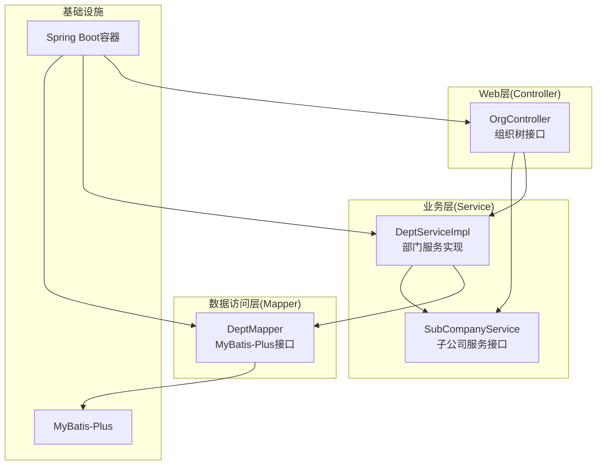
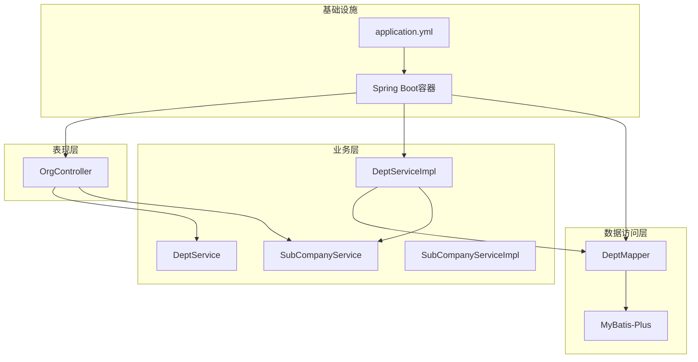
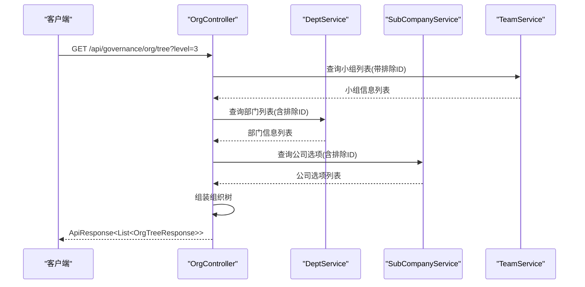
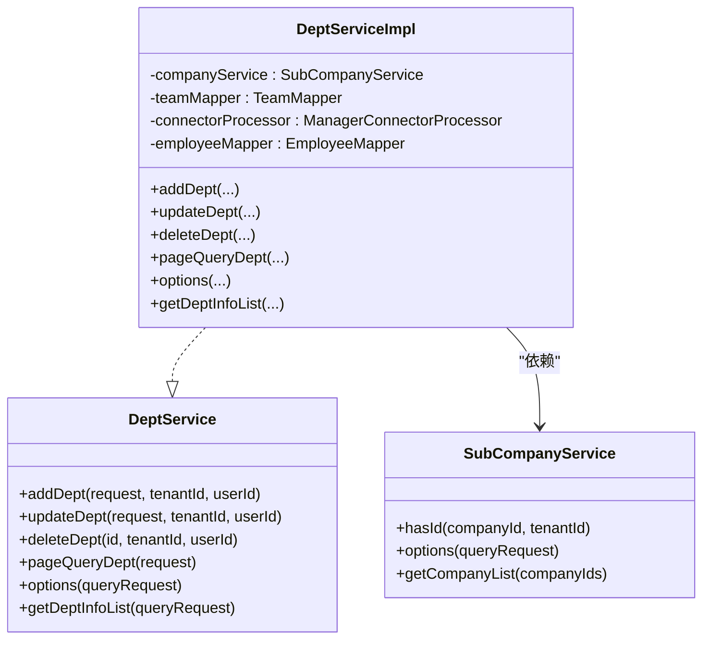
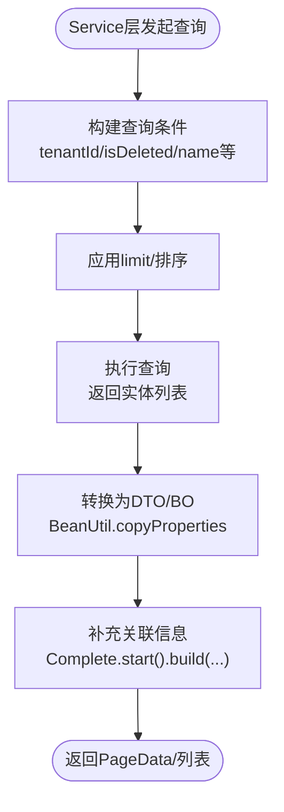
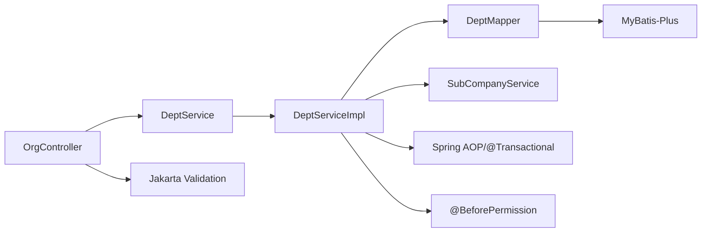

# 分层架构设计

<cite>
**本文档引用的文件**
- [ServerApplication.java](file://src/main/java/com/jiuyu/governance/ServerApplication.java)
- [OrgController.java](file://src/main/java/com/jiuyu/governance/business/org/controller/OrgController.java)
- [DeptService.java](file://src/main/java/com/jiuyu/governance/business/org/service/DeptService.java)
- [DeptServiceImpl.java](file://src/main/java/com/jiuyu/governance/business/org/service/impl/DeptServiceImpl.java)
- [DeptMapper.java](file://src/main/java/com/jiuyu/governance/business/org/mapper/DeptMapper.java)
- [DeptAddRequest.java](file://src/main/java/com/jiuyu/governance/business/org/pojo/request/DeptAddRequest.java)
- [DeptResponse.java](file://src/main/java/com/jiuyu/governance/business/org/pojo/response/DeptResponse.java)
- [SubCompanyService.java](file://src/main/java/com/jiuyu/governance/business/org/service/SubCompanyService.java)
- [BeforePermission.java](file://src/main/java/com/jiuyu/governance/plugins/oauth/data/BeforePermission.java)
- [RequestUtil.java](file://src/main/java/com/jiuyu/governance/common/utils/RequestUtil.java)
- [application.yml](file://src/main/resources/application.yml)
- [pom.xml](file://pom.xml)
</cite>

## 目录
1. [引言](#引言)
2. [项目结构](#项目结构)
3. [核心组件](#核心组件)
4. [架构总览](#架构总览)
5. [详细组件分析](#详细组件分析)
6. [依赖关系分析](#依赖关系分析)
7. [性能考虑](#性能考虑)
8. [故障排查指南](#故障排查指南)
9. [结论](#结论)

## 引言
本文件面向fupan-governance-server项目的分层架构设计，系统性阐述基于Spring Boot的MVC三层架构在本项目中的具体实现：Controller层负责HTTP请求处理与参数校验、Service层承载业务逻辑与事务管理、Mapper层负责数据持久化操作。文档将详细说明各层之间的依赖关系与调用流程，解释分层架构带来的代码复用、可维护性提升与测试便利性等优势，并通过接口抽象实现松耦合设计。同时，结合Spring Boot注解驱动的自动装配机制，说明其在分层架构中的作用与实践方式。

## 项目结构
项目采用按功能域划分的多模块结构，围绕组织管理、绩效管理、RBAC权限控制、房间直播等业务域展开，每个域均遵循MVC分层：
- Controller层：对外暴露REST接口，负责接收请求、参数校验与响应封装
- Service层：封装业务规则、事务控制与跨表/跨域协作
- Mapper层：基于MyBatis-Plus的DAO层，负责数据访问
- POJO层：请求/响应对象与领域实体分离，确保接口契约清晰
- 插件与公共组件：权限校验、签名、缓存、分布式锁等横切能力

图表来源
- [OrgController.java:1-139](file://src/main/java/com/jiuyu/governance/business/org/controller/OrgController.java#L1-L139)
- [DeptServiceImpl.java:1-414](file://src/main/java/com/jiuyu/governance/business/org/service/impl/DeptServiceImpl.java#L1-L414)
- [DeptMapper.java:1-16](file://src/main/java/com/jiuyu/governance/business/org/mapper/DeptMapper.java#L1-L16)

章节来源
- [ServerApplication.java:1-19](file://src/main/java/com/jiuyu/governance/ServerApplication.java#L1-L19)
- [application.yml:1-148](file://src/main/resources/application.yml#L1-L148)
- [pom.xml:1-226](file://pom.xml#L1-L226)

## 核心组件
- 启动类：ServerApplication作为Spring Boot应用入口，启用组件扫描与自动装配
- 控制器：OrgController提供组织树查询接口，聚合子公司、部门、小组数据
- 服务接口与实现：DeptService定义部门能力边界，DeptServiceImpl实现业务规则与事务控制
- 映射器：DeptMapper继承MyBatis-Plus基础接口，提供通用CRUD能力
- 参数校验：DeptAddRequest通过Jakarta Validation注解进行字段级校验
- 权限注解：BeforePermission用于方法执行前的数据权限校验
- 配置：application.yml集中管理数据库、Redis、MyBatis-Plus等基础设施配置

章节来源
- [ServerApplication.java:12-18](file://src/main/java/com/jiuyu/governance/ServerApplication.java#L12-L18)
- [OrgController.java:36-46](file://src/main/java/com/jiuyu/governance/business/org/controller/OrgController.java#L36-L46)
- [DeptService.java:25-127](file://src/main/java/com/jiuyu/governance/business/org/service/DeptService.java#L25-L127)
- [DeptServiceImpl.java:51-54](file://src/main/java/com/jiuyu/governance/business/org/service/impl/DeptServiceImpl.java#L51-L54)
- [DeptMapper.java:13-15](file://src/main/java/com/jiuyu/governance/business/org/mapper/DeptMapper.java#L13-L15)
- [DeptAddRequest.java:17-45](file://src/main/java/com/jiuyu/governance/business/org/pojo/request/DeptAddRequest.java#L17-L45)
- [BeforePermission.java:17-77](file://src/main/java/com/jiuyu/governance/plugins/oauth/data/BeforePermission.java#L17-L77)

## 架构总览
分层架构以“关注点分离”为核心原则，通过接口抽象实现松耦合，降低层间耦合度，提升可测试性与可维护性。Spring Boot通过注解驱动的自动装配机制，将Controller、Service、Mapper等组件纳入容器统一管理，简化配置与依赖注入。

图表来源
- [OrgController.java:36-46](file://src/main/java/com/jiuyu/governance/business/org/controller/OrgController.java#L36-L46)
- [DeptService.java:25-127](file://src/main/java/com/jiuyu/governance/business/org/service/DeptService.java#L25-L127)
- [DeptServiceImpl.java:51-54](file://src/main/java/com/jiuyu/governance/business/org/service/impl/DeptServiceImpl.java#L51-L54)
- [DeptMapper.java:13-15](file://src/main/java/com/jiuyu/governance/business/org/mapper/DeptMapper.java#L13-L15)
- [application.yml:64-83](file://src/main/resources/application.yml#L64-L83)

## 详细组件分析

### Controller层：HTTP请求处理与参数校验
- 职责边界
  - 接收HTTP请求，解析参数，应用数据权限过滤
  - 组织多层级数据（公司-部门-小组），构建树形结构
  - 返回统一封装的ApiResponse响应体
- 关键实现要点
  - 使用@RestController与@RequestMapping声明接口路径
  - 通过@RequiredArgsConstructor与构造器注入Service，体现依赖倒置
  - 在/tree接口中，根据level参数动态加载不同层级数据，避免冗余查询
  - 使用AccessUser参数自动注入当前用户上下文，支撑数据权限过滤
- 参数校验
  - 请求参数通过DeptAddRequest等POJO携带，配合Jakarta Validation注解进行字段级校验
  - 对必填字段、长度、取值范围进行约束，减少无效请求进入业务层

图表来源
- [OrgController.java:66-137](file://src/main/java/com/jiuyu/governance/business/org/controller/OrgController.java#L66-L137)

章节来源
- [OrgController.java:36-137](file://src/main/java/com/jiuyu/governance/business/org/controller/OrgController.java#L36-L137)
- [DeptAddRequest.java:17-45](file://src/main/java/com/jiuyu/governance/business/org/pojo/request/DeptAddRequest.java#L17-L45)

### Service层：业务逻辑与事务管理
- 职责边界
  - 实现业务规则与流程编排，协调跨表/跨域数据
  - 提供事务控制，保证业务一致性
  - 通过接口抽象向上层屏蔽实现细节，便于替换与测试
- 关键实现要点
  - DeptServiceImpl继承MyBatis-Plus的ServiceImpl，获得通用CRUD能力
  - 使用@Transactional标注关键业务方法，确保异常回滚
  - 结合BeforePermission注解，在方法执行前进行数据权限校验
  - 通过connectorProcessor处理管理者关联关系，清理缓存，保持数据一致性
  - 提供options、pageQuery、getDeptInfoList等多样化查询能力，满足不同场景
- 事务与权限
  - @Transactional(rollbackFor = Throwable.class)确保异常时回滚
  - @BeforePermission(type = OauthConstant.DEPT, dataId = "#request.id")在修改/删除时校验数据权限

图表来源
- [DeptService.java:25-127](file://src/main/java/com/jiuyu/governance/business/org/service/DeptService.java#L25-L127)
- [DeptServiceImpl.java:51-54](file://src/main/java/com/jiuyu/governance/business/org/service/impl/DeptServiceImpl.java#L51-L54)
- [SubCompanyService.java:23-97](file://src/main/java/com/jiuyu/governance/business/org/service/SubCompanyService.java#L23-L97)

章节来源
- [DeptServiceImpl.java:93-226](file://src/main/java/com/jiuyu/governance/business/org/service/impl/DeptServiceImpl.java#L93-L226)
- [BeforePermission.java:17-77](file://src/main/java/com/jiuyu/governance/plugins/oauth/data/BeforePermission.java#L17-L77)

### Mapper层：数据持久化操作
- 职责边界
  - 基于MyBatis-Plus的BaseMapper扩展，提供通用CRUD与条件构造器
  - 通过XML映射文件或链式API实现复杂查询与更新
- 关键实现要点
  - DeptMapper继承BaseMapper<Dept>，获得标准的增删改查能力
  - Service层通过lambdaQuery/lambdaUpdate链式API组合查询条件，减少SQL编写
  - MyBatis-Plus全局配置支持下划线转驼峰、逻辑删除、默认批量抓取大小等

图表来源
- [DeptServiceImpl.java:242-261](file://src/main/java/com/jiuyu/governance/business/org/service/impl/DeptServiceImpl.java#L242-L261)

章节来源
- [DeptMapper.java:13-15](file://src/main/java/com/jiuyu/governance/business/org/mapper/DeptMapper.java#L13-L15)
- [application.yml:64-83](file://src/main/resources/application.yml#L64-L83)

### 参数校验与响应封装
- 参数校验
  - DeptAddRequest通过@NotBlank、@NotNull、@Length等注解对必填字段、长度进行约束
  - Controller层可借助Spring Validation在进入业务逻辑前拦截非法参数
- 响应封装
  - 统一使用ApiResponse包装响应体，便于前后端约定与错误码管理
  - DeptResponse作为输出模型，包含基础信息与派生字段（如managerUserInfos）

章节来源
- [DeptAddRequest.java:17-45](file://src/main/java/com/jiuyu/governance/business/org/pojo/request/DeptAddRequest.java#L17-L45)
- [DeptResponse.java:16-67](file://src/main/java/com/jiuyu/governance/business/org/pojo/response/DeptResponse.java#L16-L67)

### Spring Boot注解驱动的自动装配机制
- 组件发现与注册
  - @SpringBootApplication启用组件扫描，默认扫描启动类所在包及其子包
  - @Service、@Mapper、@RestController等注解标识组件，由Spring容器自动注册
- 依赖注入
  - @RequiredArgsConstructor通过构造器注入Service/Repository，实现不可变依赖与测试友好
  - @Transactional、@BeforePermission等注解由Spring AOP代理生效，无需手动代理
- 配置与环境
  - application.yml集中管理数据源、Redis、MyBatis-Plus等配置，支持多环境切换
  - MyBatis-Plus通过mapper-locations与typeAliasesPackage自动扫描映射文件与实体

章节来源
- [ServerApplication.java:12-18](file://src/main/java/com/jiuyu/governance/ServerApplication.java#L12-L18)
- [application.yml:64-83](file://src/main/resources/application.yml#L64-L83)
- [pom.xml:35-167](file://pom.xml#L35-L167)

## 依赖关系分析
- 层间依赖
  - Controller仅依赖Service接口，不直接依赖Mapper，实现松耦合
  - Service实现依赖Mapper接口与外部Service，形成清晰的业务编排
  - Mapper依赖MyBatis-Plus基础能力，向上提供领域对象的持久化接口
- 外部依赖
  - Spring Boot Starter提供Web、Validation、Redis、MyBatis-Plus等能力
  - 自研插件提供权限校验、签名、分布式锁、缓存等横切能力
- 循环依赖规避
  - 通过接口抽象与构造器注入避免循环依赖，确保启动阶段容器可正确解析依赖图

图表来源
- [OrgController.java:36-46](file://src/main/java/com/jiuyu/governance/business/org/controller/OrgController.java#L36-L46)
- [DeptServiceImpl.java:51-54](file://src/main/java/com/jiuyu/governance/business/org/service/impl/DeptServiceImpl.java#L51-L54)
- [BeforePermission.java:17-77](file://src/main/java/com/jiuyu/governance/plugins/oauth/data/BeforePermission.java#L17-L77)

章节来源
- [pom.xml:35-167](file://pom.xml#L35-L167)

## 性能考虑
- 查询优化
  - 使用MyBatis-Plus链式API组合条件，避免复杂SQL手写，提高可读性与可维护性
  - 通过last("limit N")限制查询结果集，减轻数据库压力
  - 使用PageData与CustomPage进行分页，避免一次性加载大量数据
- 缓存与一致性
  - 通过connectorProcessor清理组织缓存与租户缓存，保证读写一致性
  - 结合Redis与本地缓存策略，减少重复查询
- 并发与事务
  - @Transactional确保业务原子性，结合乐观锁/悲观锁策略避免并发冲突
  - 分布式锁用于关键资源保护，防止竞态条件

## 故障排查指南
- 参数校验失败
  - 检查请求参数是否符合DeptAddRequest等POJO的注解约束
  - 确认Controller层未开启宽松校验，必要时启用全局异常处理
- 权限校验失败
  - 检查BeforePermission注解的type与dataId表达式是否正确
  - 确认AccessUser上下文是否正确注入，数据权限过滤逻辑是否生效
- 事务回滚
  - 确认@RollbackFor(Throwable.class)是否覆盖预期异常类型
  - 检查Service层异常是否被上抛至Controller，避免吞异常导致误判
- 数据一致性
  - 确认缓存清理逻辑是否在事务提交后执行
  - 检查逻辑删除字段与查询条件是否一致

章节来源
- [BeforePermission.java:17-77](file://src/main/java/com/jiuyu/governance/plugins/oauth/data/BeforePermission.java#L17-L77)
- [DeptServiceImpl.java:94-135](file://src/main/java/com/jiuyu/governance/business/org/service/impl/DeptServiceImpl.java#L94-L135)
- [RequestUtil.java:93-129](file://src/main/java/com/jiuyu/governance/common/utils/RequestUtil.java#L93-L129)

## 结论
fupan-governance-server通过清晰的MVC三层架构实现了职责分离与松耦合设计：Controller专注于接口与参数校验，Service承载业务规则与事务控制，Mapper负责数据持久化。Spring Boot的注解驱动自动装配机制进一步降低了配置成本，提升了开发效率。该架构在保证代码复用与可维护性的同时，也为单元测试与集成测试提供了良好的基础，便于持续演进与规模化扩展。