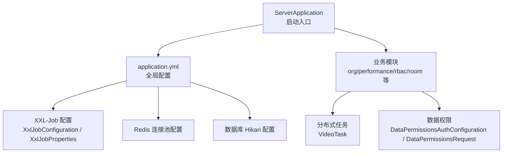
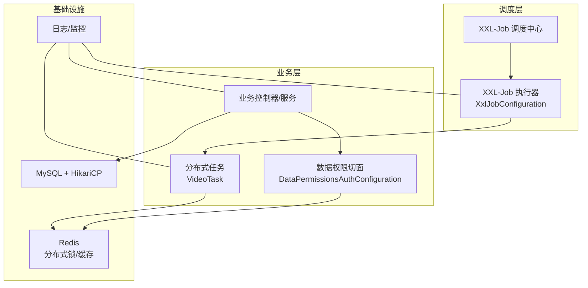
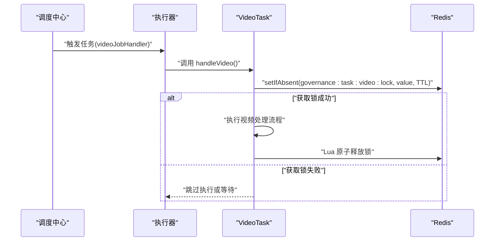
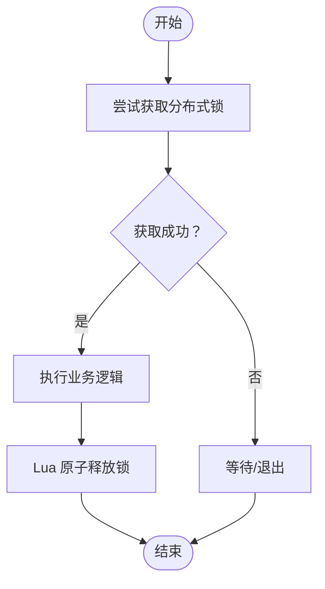
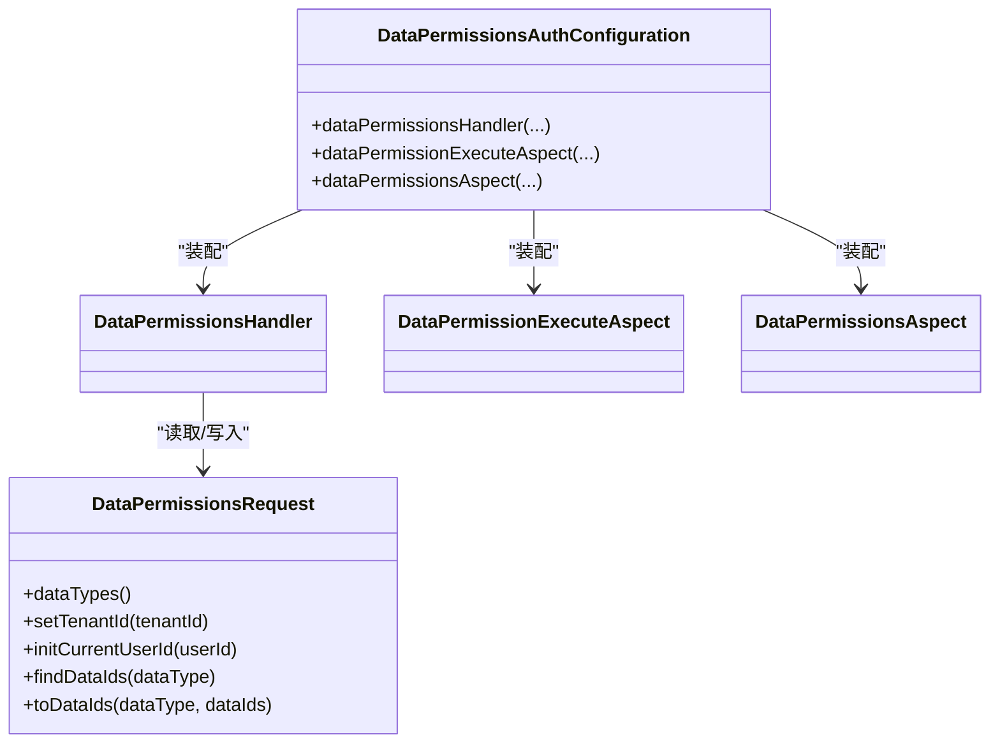
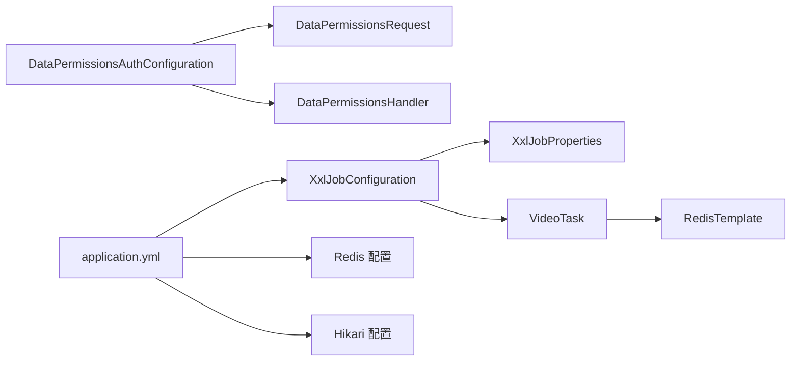

# 分布式系统设计

<cite>
**本文引用的文件**
- [ServerApplication.java](file://src/main/java/com/jiuyu/governance/ServerApplication.java)
- [application.yml](file://src/main/resources/application.yml)
- [XxlJobConfiguration.java](file://src/main/java/com/jiuyu/governance/plugins/xxljob/XxlJobConfiguration.java)
- [XxlJobProperties.java](file://src/main/java/com/jiuyu/governance/plugins/xxljob/XxlJobProperties.java)
- [VideoTask.java](file://src/main/java/com/jiuyu/governance/business/performance/task/VideoTask.java)
- [DataPermissionsAuthConfiguration.java](file://src/main/java/com/jiuyu/governance/plugins/oauth/data/DataPermissionsAuthConfiguration.java)
- [DataPermissionsRequest.java](file://src/main/java/com/jiuyu/governance/plugins/oauth/data/DataPermissionsRequest.java)
- [RequestUtil.java](file://src/main/java/com/jiuyu/governance/common/utils/RequestUtil.java)
- [API_DATA_DICTIONARY.md](file://API_DATA_DICTIONARY.md)
</cite>

## 目录
1. [引言](#引言)
2. [项目结构](#项目结构)
3. [核心组件](#核心组件)
4. [架构总览](#架构总览)
5. [组件详解](#组件详解)
6. [依赖关系分析](#依赖关系分析)
7. [性能考量](#性能考量)
8. [故障排查指南](#故障排查指南)
9. [结论](#结论)
10. [附录](#附录)

## 引言
本设计文档面向 fupan-governance-server 的分布式系统设计，围绕以下目标展开：  
- 深入解释分布式特性设计，重点覆盖 XXL-Job 分布式任务调度的实现原理与配置方式  
- 详述分布式锁机制的应用场景与实现方案，阐述 Redis 在分布式环境中的作用  
- 解释数据权限控制的分布式实现，包括跨服务的数据访问控制与权限验证机制  
- 说明高并发场景下的性能优化策略，涵盖缓存设计、连接池配置、异步处理等  
- 总结分布式系统的关键挑战与解决方案，如数据一致性、服务可用性、故障恢复等  
- 提供分布式部署的最佳实践与监控方案  

## 项目结构
项目采用 Spring Boot 单体微服务风格组织，模块按业务域划分（组织、绩效、RBAC、房间等），并通过插件化扩展（如 XXL-Job、OAuth、签名、短信、对象存储等）。  
- 启动入口位于应用层，负责加载配置与启动容器  
- 配置集中在 application.yml，包含数据库、Redis、XXL-Job、签名等分布式相关能力  
- 业务层包含控制器、服务、Mapper、POJO、任务等  
- 插件层提供可插拔的能力（XXL-Job、OAuth 数据权限、签名、短信、OSS 等）

图表来源
- [ServerApplication.java:12-18](file://src/main/java/com/jiuyu/governance/ServerApplication.java#L12-L18)
- [application.yml:124-148](file://src/main/resources/application.yml#L124-L148)
- [XxlJobConfiguration.java:30-76](file://src/main/java/com/jiuyu/governance/plugins/xxljob/XxlJobConfiguration.java#L30-L76)
- [XxlJobProperties.java:15-91](file://src/main/java/com/jiuyu/governance/plugins/xxljob/XxlJobProperties.java#L15-L91)
- [VideoTask.java:52-98](file://src/main/java/com/jiuyu/governance/business/performance/task/VideoTask.java#L52-L98)
- [DataPermissionsAuthConfiguration.java:29-77](file://src/main/java/com/jiuyu/governance/plugins/oauth/data/DataPermissionsAuthConfiguration.java#L29-L77)
- [DataPermissionsRequest.java:12-64](file://src/main/java/com/jiuyu/governance/plugins/oauth/data/DataPermissionsRequest.java#L12-L64)

章节来源
- [ServerApplication.java:12-18](file://src/main/java/com/jiuyu/governance/ServerApplication.java#L12-L18)
- [application.yml:124-148](file://src/main/resources/application.yml#L124-L148)

## 核心组件
- XXL-Job 执行器与任务调度：通过配置类与属性类装配执行器，结合注解驱动的任务处理器，实现分布式任务的注册、发现与执行  
- 分布式锁与任务幂等：基于 Redis 的 setIfAbsent 实现分布式锁，配合 Lua 原子释放，保障同一时刻仅一个实例执行  
- 数据权限控制：通过 AOP 切面与请求接口抽象，实现跨服务的数据访问控制与权限验证  
- Redis 缓存与连接池：提供分布式锁、会话存储、限流与缓存能力，配置连接池参数以提升吞吐与稳定性  
- 数据库连接池：HikariCP 提供高性能连接池，支持最小空闲、最大连接、生命周期、校验等参数  
- 公共工具：IP 解析与响应封装，辅助分布式环境下的请求追踪与可观测性

章节来源
- [XxlJobConfiguration.java:30-76](file://src/main/java/com/jiuyu/governance/plugins/xxljob/XxlJobConfiguration.java#L30-L76)
- [XxlJobProperties.java:15-91](file://src/main/java/com/jiuyu/governance/plugins/xxljob/XxlJobProperties.java#L15-L91)
- [VideoTask.java:52-124](file://src/main/java/com/jiuyu/governance/business/performance/task/VideoTask.java#L52-L124)
- [DataPermissionsAuthConfiguration.java:29-77](file://src/main/java/com/jiuyu/governance/plugins/oauth/data/DataPermissionsAuthConfiguration.java#L29-L77)
- [DataPermissionsRequest.java:12-64](file://src/main/java/com/jiuyu/governance/plugins/oauth/data/DataPermissionsRequest.java#L12-L64)
- [application.yml:87-100](file://src/main/resources/application.yml#L87-L100)
- [application.yml:44-61](file://src/main/resources/application.yml#L44-L61)
- [RequestUtil.java:93-129](file://src/main/java/com/jiuyu/governance/common/utils/RequestUtil.java#L93-L129)

## 架构总览
系统采用“集中式配置 + 分布式执行 + 统一鉴权与数据权限”的架构模式。XXL-Job 负责任务编排与执行器注册，Redis 提供分布式锁与缓存，数据库通过 HikariCP 提供稳定连接，业务模块通过 AOP 与注解实现权限控制。

图表来源
- [XxlJobConfiguration.java:30-76](file://src/main/java/com/jiuyu/governance/plugins/xxljob/XxlJobConfiguration.java#L30-L76)
- [VideoTask.java:52-98](file://src/main/java/com/jiuyu/governance/business/performance/task/VideoTask.java#L52-L98)
- [DataPermissionsAuthConfiguration.java:29-77](file://src/main/java/com/jiuyu/governance/plugins/oauth/data/DataPermissionsAuthConfiguration.java#L29-L77)
- [application.yml:87-100](file://src/main/resources/application.yml#L87-L100)
- [application.yml:44-61](file://src/main/resources/application.yml#L44-L61)

## 组件详解

### XXL-Job 分布式任务调度
- 设计原理：调度中心下发任务至已注册的执行器，执行器基于 Spring Bean 的 JobHandler 名称执行对应方法；通过 setAdminAddresses、setAccessToken、setAppname、setPort 等参数完成执行器初始化  
- 配置方式：通过 application.yml 中的 xxl.job.enable、admin.addresses、executor.app-name、executor.port 等属性启用与配置；XxlJobConfiguration 条件化装配执行器  
- 任务幂等与分布式锁：VideoTask 使用 Redis 的 setIfAbsent 获取分布式锁，避免并发重复执行；通过 Lua 脚本原子释放，防止误删他人锁  
- 任务参数与日志：任务方法通过 XxlJobHelper 获取参数与记录日志，便于运维与问题定位

图表来源
- [XxlJobConfiguration.java:30-76](file://src/main/java/com/jiuyu/governance/plugins/xxljob/XxlJobConfiguration.java#L30-L76)
- [XxlJobProperties.java:15-91](file://src/main/java/com/jiuyu/governance/plugins/xxljob/XxlJobProperties.java#L15-L91)
- [VideoTask.java:52-124](file://src/main/java/com/jiuyu/governance/business/performance/task/VideoTask.java#L52-L124)

章节来源
- [XxlJobConfiguration.java:30-76](file://src/main/java/com/jiuyu/governance/plugins/xxljob/XxlJobConfiguration.java#L30-L76)
- [XxlJobProperties.java:15-91](file://src/main/java/com/jiuyu/governance/plugins/xxljob/XxlJobProperties.java#L15-L91)
- [VideoTask.java:52-124](file://src/main/java/com/jiuyu/governance/business/performance/task/VideoTask.java#L52-L124)
- [application.yml:124-148](file://src/main/resources/application.yml#L124-L148)

### 分布式锁机制与应用场景
- 应用场景：定时任务去重、批处理幂等、资源竞争保护（如视频处理、报表生成）  
- 实现方案：  
  - 获取锁：使用 RedisTemplate.opsForValue().setIfAbsent(key, value, TTL)  
  - 释放锁：使用 Lua 脚本确保“仅释放属于自己的锁”，避免误删  
  - 超时与重试：设置合理过期时间与处理超时，结合异常处理与日志记录  
- 关键点：锁键命名规范、锁值随机性、原子释放、异常安全释放

图表来源
- [VideoTask.java:52-124](file://src/main/java/com/jiuyu/governance/business/performance/task/VideoTask.java#L52-L124)

章节来源
- [VideoTask.java:52-124](file://src/main/java/com/jiuyu/governance/business/performance/task/VideoTask.java#L52-L124)

### Redis 在分布式环境中的作用
- 分布式锁：保障任务与资源的互斥访问  
- 缓存：热点数据读取、会话与令牌存储、限流与配额控制  
- 连接池配置：最大活跃连接、最大等待时间、最大空闲、最小空闲、驱逐间隔等参数，平衡吞吐与延迟  
- 与业务集成：XXL-Job 任务、数据权限切面、签名与鉴权等模块均可复用 Redis 能力

章节来源
- [application.yml:87-100](file://src/main/resources/application.yml#L87-L100)
- [VideoTask.java:52-124](file://src/main/java/com/jiuyu/governance/business/performance/task/VideoTask.java#L52-L124)

### 数据权限控制的分布式实现
- 自动装配：DataPermissionsAuthConfiguration 条件化装配数据权限处理器、执行切面与查询切面，支持默认与查询增强  
- 请求接口：DataPermissionsRequest 抽象了数据权限维度、租户与用户上下文、数据 ID 的读取与回填  
- 切面与 AOP：通过 BeforePermission 注解与切面拦截，对业务方法进行权限校验与数据范围约束  
- 跨服务访问：结合用户上下文与权限提供器，统一在请求入口处进行权限判定，避免越权访问

图表来源
- [DataPermissionsAuthConfiguration.java:29-77](file://src/main/java/com/jiuyu/governance/plugins/oauth/data/DataPermissionsAuthConfiguration.java#L29-L77)
- [DataPermissionsRequest.java:12-64](file://src/main/java/com/jiuyu/governance/plugins/oauth/data/DataPermissionsRequest.java#L12-L64)

章节来源
- [DataPermissionsAuthConfiguration.java:29-77](file://src/main/java/com/jiuyu/governance/plugins/oauth/data/DataPermissionsAuthConfiguration.java#L29-L77)
- [DataPermissionsRequest.java:12-64](file://src/main/java/com/jiuyu/governance/plugins/oauth/data/DataPermissionsRequest.java#L12-L64)

### 高并发性能优化策略
- 缓存设计：利用 Redis 缓存热点数据与会话，降低数据库压力；注意缓存失效策略与双写一致性  
- 连接池配置：  
  - 数据库：HikariCP 的最小空闲、最大连接、最大存活时间、连接超时、校验超时等参数需结合 QPS 与事务时长调优  
  - Redis：最大活跃连接、最大等待时间、空闲阈值等参数需与任务并发度匹配  
- 异步处理：对非关键路径操作（如日志、通知、统计）采用异步或消息队列，减少请求链路阻塞  
- 线程与任务：为任务线程设置前缀，便于监控与问题定位；合理设置任务超时与重试策略  
- I/O 优化：上传下载、签名与验签、HTTP 客户端池化等均应考虑连接复用与超时控制

章节来源
- [application.yml:44-61](file://src/main/resources/application.yml#L44-L61)
- [application.yml:87-100](file://src/main/resources/application.yml#L87-L100)
- [application.yml:27-30](file://src/main/resources/application.yml#L27-L30)

### 关键挑战与解决方案
- 数据一致性：  
  - 任务幂等：通过分布式锁与状态标记，确保同一批数据仅被处理一次  
  - 事务边界：对关键写操作进行事务控制，必要时拆分长事务  
- 服务可用性：  
  - 执行器注册与心跳：确保执行器可被调度中心发现与调度  
  - 优雅停机：配置优雅关闭与停机宽限期，避免任务中断  
- 故障恢复：  
  - 任务失败重试：结合日志与告警，快速定位失败原因并重试  
  - 降级策略：在 Redis 或数据库不可用时，采用本地缓存或降级接口兜底

章节来源
- [application.yml:34-39](file://src/main/resources/application.yml#L34-L39)
- [VideoTask.java:52-98](file://src/main/java/com/jiuyu/governance/business/performance/task/VideoTask.java#L52-L98)

### 分布式部署最佳实践与监控
- 部署建议：  
  - 多实例部署执行器，避免单点；通过负载均衡暴露服务  
  - Redis 集群化部署，开启持久化与哨兵/集群模式  
  - 数据库主从分离与只读副本，缓解读压力  
- 监控方案：  
  - 任务执行日志：记录任务参数、耗时、结果与异常  
  - 指标采集：CPU、内存、连接池使用率、Redis 命中率、数据库慢查询  
  - 告警策略：任务超时、锁等待、连接池耗尽、Redis 连接异常等

章节来源
- [XxlJobConfiguration.java:30-76](file://src/main/java/com/jiuyu/governance/plugins/xxljob/XxlJobConfiguration.java#L30-L76)
- [VideoTask.java:52-98](file://src/main/java/com/jiuyu/governance/business/performance/task/VideoTask.java#L52-L98)

## 依赖关系分析
- 组件耦合：  
  - 业务模块依赖于 Redis 与数据库；任务模块依赖 Redis 与执行器  
  - 数据权限模块通过切面与接口抽象，与业务服务低耦合  
- 外部依赖：XXL-Job、Redis、MySQL/HikariCP、Spring MVC/WebFlux（按配置）  
- 配置依赖：application.yml 中的 xxl.job、spring.redis、spring.datasource、jiuyu.lock 等

图表来源
- [XxlJobConfiguration.java:30-76](file://src/main/java/com/jiuyu/governance/plugins/xxljob/XxlJobConfiguration.java#L30-L76)
- [XxlJobProperties.java:15-91](file://src/main/java/com/jiuyu/governance/plugins/xxljob/XxlJobProperties.java#L15-L91)
- [VideoTask.java:52-124](file://src/main/java/com/jiuyu/governance/business/performance/task/VideoTask.java#L52-L124)
- [DataPermissionsAuthConfiguration.java:29-77](file://src/main/java/com/jiuyu/governance/plugins/oauth/data/DataPermissionsAuthConfiguration.java#L29-L77)
- [DataPermissionsRequest.java:12-64](file://src/main/java/com/jiuyu/governance/plugins/oauth/data/DataPermissionsRequest.java#L12-L64)
- [application.yml:87-100](file://src/main/resources/application.yml#L87-L100)
- [application.yml:44-61](file://src/main/resources/application.yml#L44-L61)

章节来源
- [application.yml:87-100](file://src/main/resources/application.yml#L87-L100)
- [application.yml:44-61](file://src/main/resources/application.yml#L44-L61)

## 性能考量
- 连接池参数调优：  
  - HikariCP：根据峰值 QPS 与平均事务时长设置最大连接与空闲连接，启用连接测试与校验  
  - Redis：根据任务并发与命令复杂度设置最大连接与等待时间，避免阻塞  
- 缓存策略：热点数据缓存、缓存穿透与击穿防护、缓存更新策略  
- 异步化：对非关键路径异步化，减少同步阻塞；对高频写操作采用批量提交  
- 线程与任务：为任务线程设置前缀，便于监控；合理设置任务超时与重试次数  
- I/O 优化：上传下载、签名与验签、HTTP 客户端池化，避免频繁创建连接

## 故障排查指南
- XXL-Job 任务失败：  
  - 检查调度中心地址与访问令牌配置  
  - 查看执行器日志与任务日志，确认参数与异常栈  
  - 核对分布式锁是否正确释放，避免死锁  
- Redis 异常：  
  - 检查连接池参数与网络连通性  
  - 关注锁键是否存在、锁值是否被误删  
- 数据权限异常：  
  - 核对用户上下文与权限提供器返回的可访问数据 ID  
  - 检查切面是否生效与注解使用是否正确  
- 请求与 IP：  
  - 使用 RequestUtil 获取真实客户端 IP，避免代理导致的 IP 不一致

章节来源
- [XxlJobConfiguration.java:30-76](file://src/main/java/com/jiuyu/governance/plugins/xxljob/XxlJobConfiguration.java#L30-L76)
- [VideoTask.java:52-124](file://src/main/java/com/jiuyu/governance/business/performance/task/VideoTask.java#L52-L124)
- [DataPermissionsAuthConfiguration.java:29-77](file://src/main/java/com/jiuyu/governance/plugins/oauth/data/DataPermissionsAuthConfiguration.java#L29-L77)
- [RequestUtil.java:93-129](file://src/main/java/com/jiuyu/governance/common/utils/RequestUtil.java#L93-L129)

## 结论
本系统通过 XXL-Job 实现分布式任务编排，借助 Redis 提供分布式锁与缓存能力，结合 HikariCP 与连接池配置保障高并发下的稳定性。数据权限通过 AOP 与接口抽象实现跨服务的统一控制。在部署层面，建议采用多实例、Redis 集群与数据库主从分离，并建立完善的监控与告警体系，以应对分布式系统的关键挑战。

## 附录
- 接口权限参考：可结合 RBAC 菜单与权限码，参考接口字典中的菜单与权限字段定义，确保接口访问受控

章节来源
- [API_DATA_DICTIONARY.md:344-384](file://API_DATA_DICTIONARY.md#L344-L384)