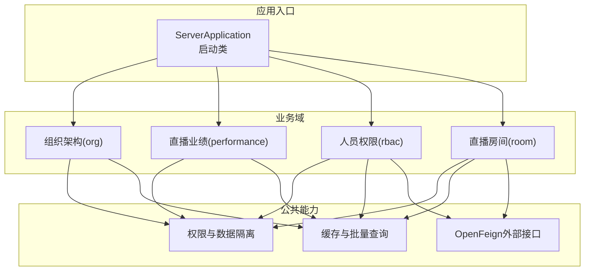
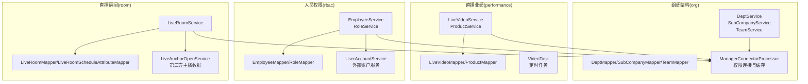
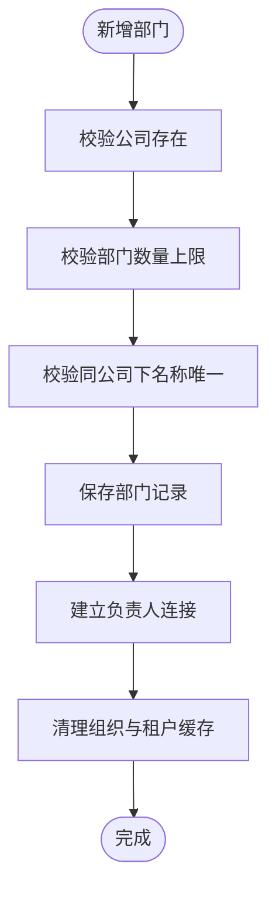
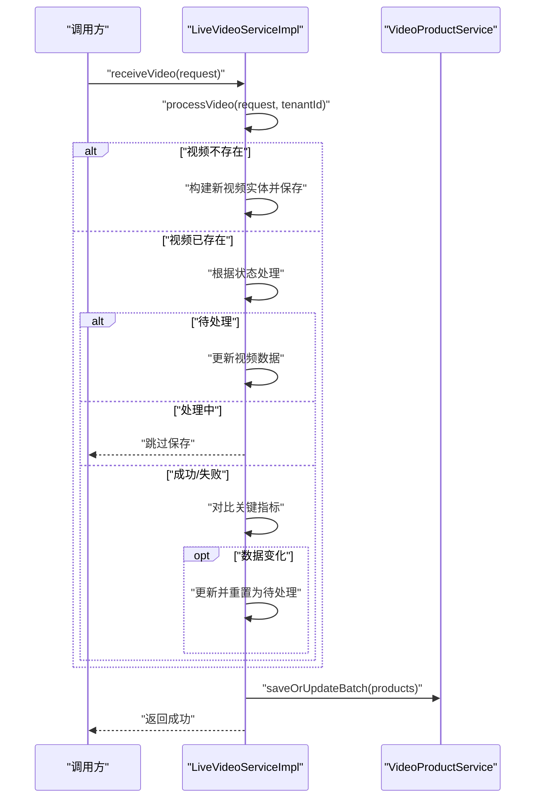
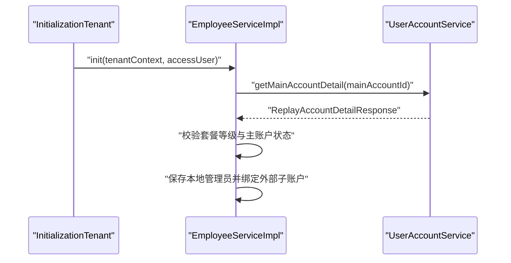
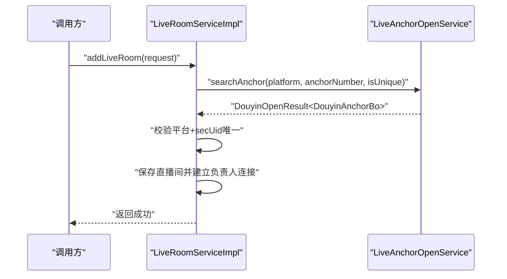
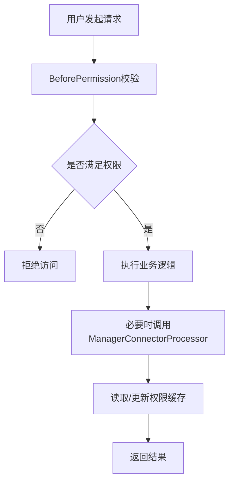
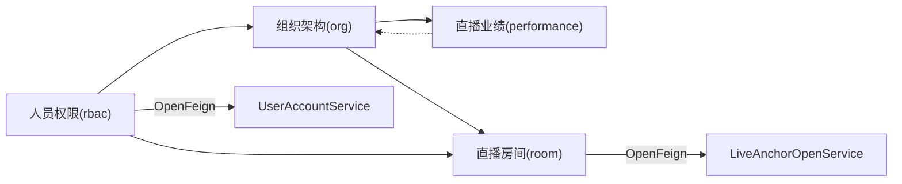

# 微服务架构思想

<cite>
**本文引用的文件**
- [ServerApplication.java](file://src/main/java/com/jiuyu/governance/ServerApplication.java)
- [pom.xml](file://pom.xml)
- [application.yml](file://src/main/resources/application.yml)
- [SKILL.md](file://.trae/skills/java-engineering-standards/SAKILL.md)
- [SKILL.md](file://.trae/skills/global-backend-standards/SAKILL.md)
- [DeptServiceImpl.java](file://src/main/java/com/jiuyu/governance/business/org/service/impl/DeptServiceImpl.java)
- [LiveVideoServiceImpl.java](file://src/main/java/com/jiuyu/governance/business/performance/service/impl/LiveVideoServiceImpl.java)
- [EmployeeServiceImpl.java](file://src/main/java/com/jiuyu/governance/business/rbac/service/impl/EmployeeServiceImpl.java)
- [LiveRoomServiceImpl.java](file://src/main/java/com/jiuyu/governance/business/room/service/impl/LiveRoomServiceImpl.java)
- [UserAccountService.java](file://src/main/java/com/jiuyu/governance/openfeign/replay/UserAccountService.java)
- [LiveAnchorOpenService.java](file://src/main/java/com/jiuyu/governance/openfeign/collect/LiveAnchorOpenService.java)
- [BeforePermission.java](file://src/main/java/com/jiuyu/governance/plugins/oauth/data/BeforePermission.java)
- [ManagerConnectorProcessor.java](file://src/main/java/com/jiuyu/governance/business/org/service/impl/ManagerConnectorProcessor.java)
</cite>

## 目录
1. [引言](#引言)
2. [项目结构](#项目结构)
3. [核心组件](#核心组件)
4. [架构总览](#架构总览)
5. [详细组件分析](#详细组件分析)
6. [依赖分析](#依赖分析)
7. [性能考虑](#性能考虑)
8. [故障排查指南](#故障排查指南)
9. [结论](#结论)
10. [附录](#附录)

## 引言
本项目以“单体应用”形态承载了典型的微服务理念：通过清晰的模块化设计、严格的分层架构、明确的服务边界与职责划分，实现业务的高内聚、低耦合与可演进性。尽管未采用传统意义上的分布式部署，但通过包结构、接口契约、权限与缓存策略、以及对外部系统的OpenFeign调用，模拟了微服务之间的协作方式，具备向真实微服务拆分的工程基础。

## 项目结构
项目采用按业务域划分的包结构，四大核心业务域分别对应组织架构、直播业绩、人员权限、直播房间。每个域均遵循“controller-service-mapper”三层结构，DTO/VO/Entity/Constants统一放置在pojo目录下，确保职责清晰、边界明确。

图表来源
- [ServerApplication.java:12-18](file://src/main/java/com/jiuyu/governance/ServerApplication.java#L12-L18)
- [pom.xml:35-167](file://pom.xml#L35-L167)
- [application.yml:101-148](file://src/main/resources/application.yml#L101-L148)

章节来源
- [ServerApplication.java:12-18](file://src/main/java/com/jiuyu/governance/ServerApplication.java#L12-L18)
- [pom.xml:35-167](file://pom.xml#L35-L167)
- [application.yml:101-148](file://src/main/resources/application.yml#L101-L148)

## 核心组件
- 分层架构与POJO规范：严格区分Controller/Service/Mapper三层，POJO按request/response/entity/constants子包组织，确保职责单一、可测试性强。
- 权限与数据隔离：通过注解驱动的BeforePermission进行数据权限校验，结合租户隔离字段，保障跨租户数据安全。
- 缓存与批量查询：基于Redis的权限缓存与批量查询工具，降低数据库压力，提升响应性能。
- OpenFeign外部集成：对第三方系统（直播开放平台、录制账户系统）以接口契约形式集成，模拟微服务间通信。

章节来源
- [SKILL.md](file://.trae/skills/java-engineering-standards/SAKILL.md:10-31)
- [SKILL.md](file://.trae/skills/global-backend-standards/SAKILL.md:14-41)
- [BeforePermission.java:17-79](file://src/main/java/com/jiuyu/governance/plugins/oauth/data/BeforePermission.java#L17-L79)
- [ManagerConnectorProcessor.java:49-615](file://src/main/java/com/jiuyu/governance/business/org/service/impl/ManagerConnectorProcessor.java#L49-L615)

## 架构总览
下图展示了四大业务域在单体应用中的协作关系与依赖方向。RBAC与ORG域提供基础能力（人员、组织、权限），PERF与ROOM域围绕直播场景进行扩展，OpenFeign作为外部接口桥接。

图表来源
- [DeptServiceImpl.java:54-414](file://src/main/java/com/jiuyu/governance/business/org/service/impl/DeptServiceImpl.java#L54-L414)
- [LiveVideoServiceImpl.java:35-388](file://src/main/java/com/jiuyu/governance/business/performance/service/impl/LiveVideoServiceImpl.java#L35-L388)
- [EmployeeServiceImpl.java:60-800](file://src/main/java/com/jiuyu/governance/business/rbac/service/impl/EmployeeServiceImpl.java#L60-L800)
- [LiveRoomServiceImpl.java:59-530](file://src/main/java/com/jiuyu/governance/business/room/service/impl/LiveRoomServiceImpl.java#L59-L530)
- [UserAccountService.java:14-92](file://src/main/java/com/jiuyu/governance/openfeign/replay/UserAccountService.java#L14-L92)
- [LiveAnchorOpenService.java:14-27](file://src/main/java/com/jiuyu/governance/openfeign/collect/LiveAnchorOpenService.java#L14-L27)
- [ManagerConnectorProcessor.java:49-615](file://src/main/java/com/jiuyu/governance/business/org/service/impl/ManagerConnectorProcessor.java#L49-L615)

## 详细组件分析

### 组织架构域（org）
- 设计要点
  - 以“公司-部门-小组”三级组织树为核心，提供组织增删改查、下拉选项、名称映射等能力。
  - 通过ManagerConnectorProcessor维护“负责人”关系，支持按租户与组织层级的权限缓存与查询。
- 关键流程
  - 新增部门时校验公司存在性、部门数量上限与名称唯一性，必要时联动清理缓存。
  - 删除部门时进行依赖校验（员工、小组），并同步断开负责人连接与缓存清理。
- 依赖关系
  - 依赖SubCompanyService进行公司存在性校验。
  - 依赖TeamMapper与ManagerConnectorProcessor进行依赖检查与缓存维护。

图表来源
- [DeptServiceImpl.java:96-135](file://src/main/java/com/jiuyu/governance/business/org/service/impl/DeptServiceImpl.java#L96-L135)
- [DeptServiceImpl.java:146-186](file://src/main/java/com/jiuyu/governance/business/org/service/impl/DeptServiceImpl.java#L146-L186)
- [DeptServiceImpl.java:197-226](file://src/main/java/com/jiuyu/governance/business/org/service/impl/DeptServiceImpl.java#L197-L226)

章节来源
- [DeptServiceImpl.java:54-414](file://src/main/java/com/jiuyu/governance/business/org/service/impl/DeptServiceImpl.java#L54-L414)
- [ManagerConnectorProcessor.java:76-137](file://src/main/java/com/jiuyu/governance/business/org/service/impl/ManagerConnectorProcessor.java#L76-L137)

### 直播业绩域（performance）
- 设计要点
  - 提供视频数据接收、状态机处理（待处理/处理中/成功/失败）、商品数据落库与批量更新。
  - 通过批处理分组与锁机制，保证幂等与并发安全。
- 关键流程
  - 接收视频数据：根据状态与关键指标变化决定是否更新与重置状态。
  - 商品数据：对传入商品进行存在性判断，存在则更新，不存在则新增。
  - 超时处理：将长时间处于处理中的视频重置为待处理，避免死锁。

图表来源
- [LiveVideoServiceImpl.java:49-128](file://src/main/java/com/jiuyu/governance/business/performance/service/impl/LiveVideoServiceImpl.java#L49-L128)
- [LiveVideoServiceImpl.java:211-221](file://src/main/java/com/jiuyu/governance/business/performance/service/impl/LiveVideoServiceImpl.java#L211-L221)

章节来源
- [LiveVideoServiceImpl.java:35-388](file://src/main/java/com/jiuyu/governance/business/performance/service/impl/LiveVideoServiceImpl.java#L35-L388)

### 人员权限域（rbac）
- 设计要点
  - 提供员工增删改查、角色分配、手机号与工号校验、登录场景特殊查询等能力。
  - 在租户初始化时，通过OpenFeign调用外部账户服务，完成主账户校验与绑定。
- 关键流程
  - 租户初始化：校验外部账户套餐等级与主账户状态，创建本地管理员并绑定外部子账户。
  - 员工增改：校验手机号/工号唯一性，必要时调用外部账户服务更新手机号。

图表来源
- [EmployeeServiceImpl.java:94-149](file://src/main/java/com/jiuyu/governance/business/rbac/service/impl/EmployeeServiceImpl.java#L94-L149)
- [UserAccountService.java:67-68](file://src/main/java/com/jiuyu/governance/openfeign/replay/UserAccountService.java#L67-L68)

章节来源
- [EmployeeServiceImpl.java:60-800](file://src/main/java/com/jiuyu/governance/business/rbac/service/impl/EmployeeServiceImpl.java#L60-L800)
- [UserAccountService.java:14-92](file://src/main/java/com/jiuyu/governance/openfeign/replay/UserAccountService.java#L14-L92)

### 直播房间域（room）
- 设计要点
  - 提供直播间增删改、启用停用、排班配置、负责人绑定与查询等能力。
  - 新增时调用第三方主播开放接口，获取主播信息并校验唯一性。
- 关键流程
  - 新增直播间：调用第三方接口获取主播信息，校验平台+secUid唯一，保存并建立负责人连接。
  - 修改/删除：更新或逻辑删除，同步断开负责人连接与缓存清理。

图表来源
- [LiveRoomServiceImpl.java:92-148](file://src/main/java/com/jiuyu/governance/business/room/service/impl/LiveRoomServiceImpl.java#L92-L148)
- [LiveAnchorOpenService.java:25](file://src/main/java/com/jiuyu/governance/openfeign/collect/LiveAnchorOpenService.java#L25)

章节来源
- [LiveRoomServiceImpl.java:59-530](file://src/main/java/com/jiuyu/governance/business/room/service/impl/LiveRoomServiceImpl.java#L59-L530)
- [LiveAnchorOpenService.java:14-27](file://src/main/java/com/jiuyu/governance/openfeign/collect/LiveAnchorOpenService.java#L14-L27)

### 权限与数据隔离（RBAC/Org）
- 设计要点
  - 通过BeforePermission注解在方法级别进行数据权限校验，支持多组校验与层级校验。
  - ManagerConnectorProcessor提供“用户-目标对象”的连接关系管理与缓存，支持按租户与组织层级的权限扩散查询。
- 关键流程
  - 用户权限查询：从缓存或数据库加载用户连接关系，按组织层级计算可访问的目标ID集合。
  - 组织变更：在组织/负责人变更时清理相关缓存，确保权限一致性。

图表来源
- [BeforePermission.java:17-79](file://src/main/java/com/jiuyu/governance/plugins/oauth/data/BeforePermission.java#L17-L79)
- [ManagerConnectorProcessor.java:250-280](file://src/main/java/com/jiuyu/governance/business/org/service/impl/ManagerConnectorProcessor.java#L250-L280)
- [ManagerConnectorProcessor.java:471-496](file://src/main/java/com/jiuyu/governance/business/org/service/impl/ManagerConnectorProcessor.java#L471-L496)

章节来源
- [BeforePermission.java:17-79](file://src/main/java/com/jiuyu/governance/plugins/oauth/data/BeforePermission.java#L17-L79)
- [ManagerConnectorProcessor.java:49-615](file://src/main/java/com/jiuyu/governance/business/org/service/impl/ManagerConnectorProcessor.java#L49-L615)

## 依赖分析
- 内聚性与耦合度
  - org域内部高内聚，通过ManagerConnectorProcessor与RBAC域共享“负责人”关系；与performance域弱耦合，仅在分页查询时通过Complete工具装配组织名称。
  - rbac域承担租户初始化与外部账户对接，与room域在“录制权限”上产生交互。
  - performance域独立完成视频与商品数据处理，通过定时任务与状态机保障幂等。
  - room域强依赖第三方开放接口，内部通过排班配置与负责人管理实现业务闭环。
- 外部依赖
  - OpenFeign接口UserAccountService与LiveAnchorOpenService作为外部系统抽象，便于未来替换与扩展。
- 配置与运行
  - Spring Boot启动类集中管理应用生命周期；application.yml集中配置数据库、Redis、签名、xxl-job等公共能力。

图表来源
- [pom.xml:35-167](file://pom.xml#L35-L167)
- [application.yml:101-148](file://src/main/resources/application.yml#L101-L148)
- [UserAccountService.java:14-92](file://src/main/java/com/jiuyu/governance/openfeign/replay/UserAccountService.java#L14-L92)
- [LiveAnchorOpenService.java:14-27](file://src/main/java/com/jiuyu/governance/openfeign/collect/LiveAnchorOpenService.java#L14-L27)

章节来源
- [pom.xml:35-167](file://pom.xml#L35-L167)
- [application.yml:101-148](file://src/main/resources/application.yml#L101-L148)

## 性能考虑
- 缓存策略
  - 用户权限缓存：单用户1小时，组织层级缓存3天，租户全量缓存按类型设定不同过期时间，减少重复查询。
  - 批量查询：通过BatchQuery与多Key批量读取，降低网络往返与数据库压力。
- 并发与幂等
  - 视频状态机与锁机制：通过“待处理/处理中/成功/失败”状态与批处理分组，避免重复处理与竞态。
- 分页与装配
  - 使用Complete工具链一次性装配组织名称与负责人信息，减少多次查询与组装成本。

## 故障排查指南
- 权限相关
  - 若出现“无权限修改/删除”，检查BeforePermission注解配置与ManagerConnectorProcessor缓存是否一致。
  - 使用clearOrgCache/clearTenantCache主动清理缓存，验证权限是否恢复。
- 视频处理
  - 若视频长时间处于“处理中”，检查resetTimeoutProcessingVideos逻辑与定时任务是否生效。
  - 对比关键指标（场观、销售额、退款、投放金额）确认是否触发重置。
- 外部接口
  - 对第三方主播数据或账户服务调用失败，检查OpenFeign配置与返回码，必要时增加重试与熔断策略。

章节来源
- [ManagerConnectorProcessor.java:471-496](file://src/main/java/com/jiuyu/governance/business/org/service/impl/ManagerConnectorProcessor.java#L471-L496)
- [LiveVideoServiceImpl.java:247-258](file://src/main/java/com/jiuyu/governance/business/performance/service/impl/LiveVideoServiceImpl.java#L247-L258)

## 结论
本项目以单体形态实现了微服务的核心思想：清晰的业务域划分、严格的分层与POJO规范、完善的权限与数据隔离、高效的缓存与批量查询、以及通过OpenFeign模拟微服务间的通信。这种设计既满足当前业务规模的快速迭代需求，又为未来的微服务拆分与演进提供了坚实的工程基础。

## 附录
- 术语
  - “微服务思想”：强调高内聚低耦合、清晰边界、可独立演进与测试、面向接口协作。
  - “单体应用中的微服务化”：通过包结构、注解、缓存与外部接口契约，模拟分布式协作。
- 参考技能
  - Java工程与架构标准、API设计标准、数据安全与隔离、服务逻辑与工具、数据库与SQL性能。