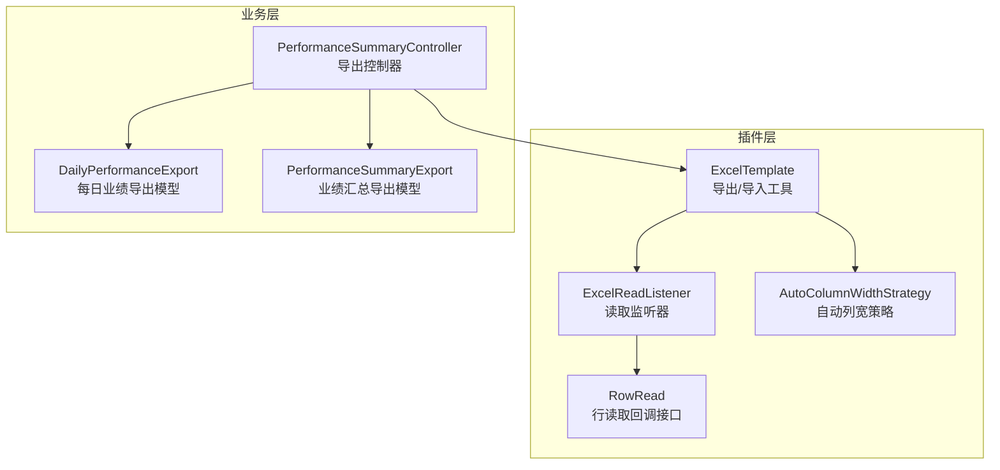
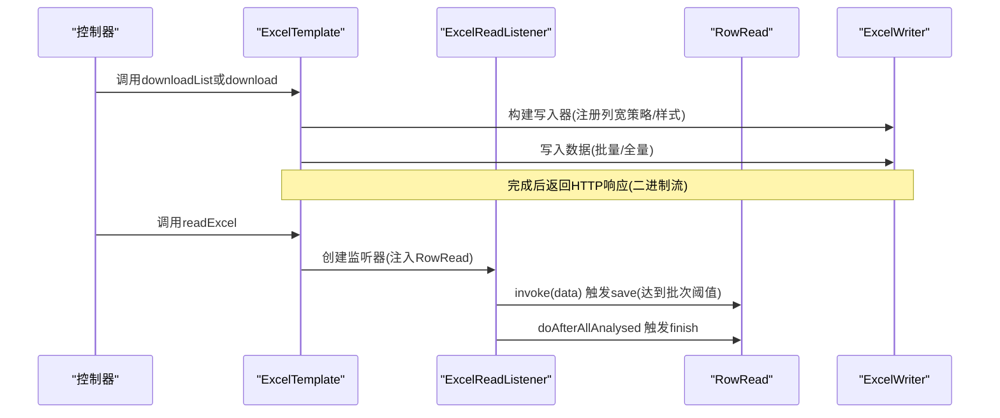
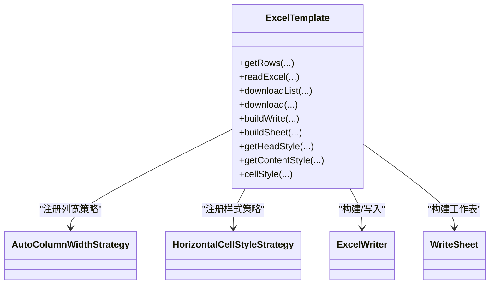
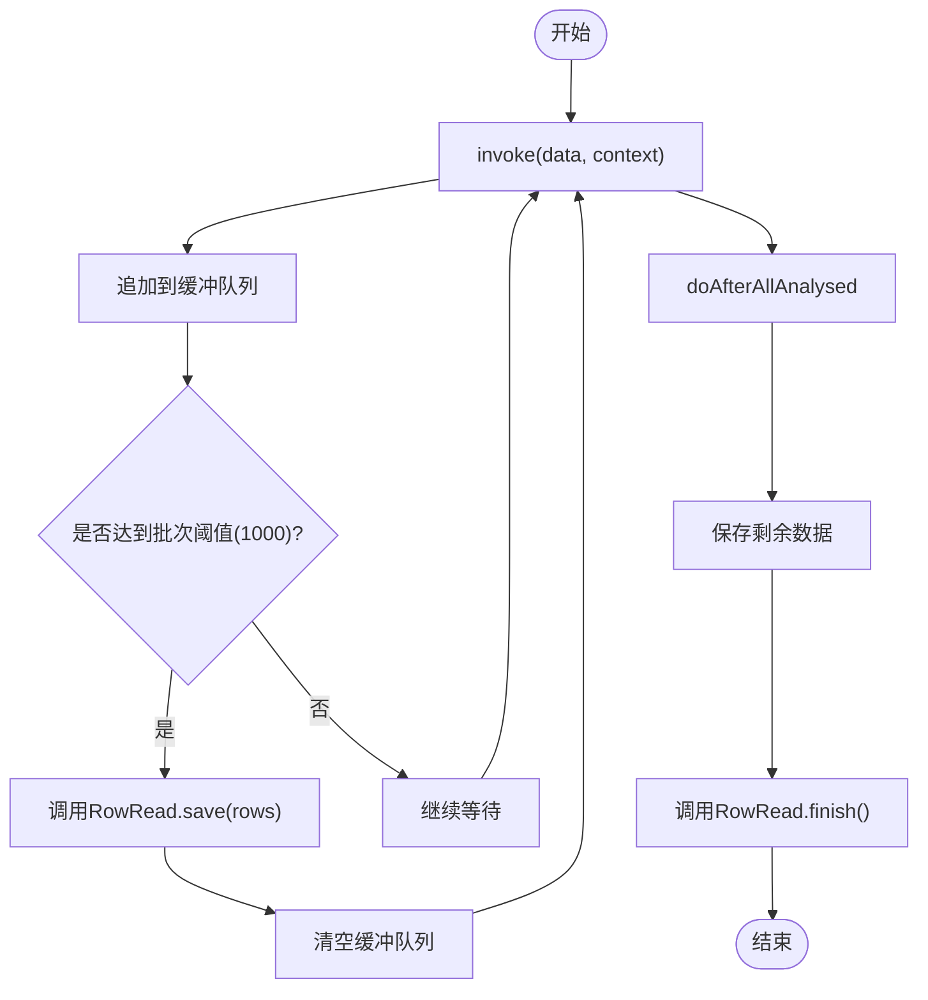
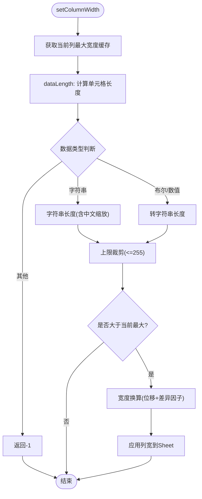
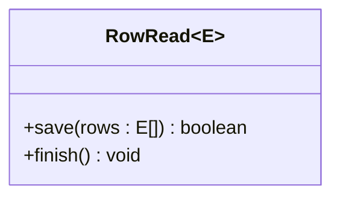
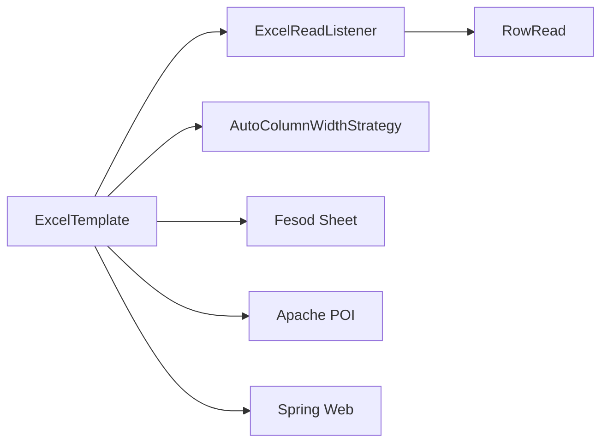

# Excel处理插件

<cite>
**本文引用的文件**
- [ExcelTemplate.java](file://src/main/java/com/jiuyu/governance/plugins/excel/ExcelTemplate.java)
- [ExcelReadListener.java](file://src/main/java/com/jiuyu/governance/plugins/excel/ExcelReadListener.java)
- [AutoColumnWidthStrategy.java](file://src/main/java/com/jiuyu/governance/plugins/excel/AutoColumnWidthStrategy.java)
- [RowRead.java](file://src/main/java/com/jiuyu/governance/plugins/excel/RowRead.java)
- [PerformanceSummaryController.java](file://src/main/java/com/jiuyu/governance/business/performance/controller/PerformanceSummaryController.java)
- [DailyPerformanceExport.java](file://src/main/java/com/jiuyu/governance/business/performance/pojo/response/export/DailyPerformanceExport.java)
- [PerformanceSummaryExport.java](file://src/main/java/com/jiuyu/governance/business/performance/pojo/response/export/PerformanceSummaryExport.java)
</cite>

## 目录
1. [简介](#简介)
2. [项目结构](#项目结构)
3. [核心组件](#核心组件)
4. [架构总览](#架构总览)
5. [详细组件分析](#详细组件分析)
6. [依赖分析](#依赖分析)
7. [性能考虑](#性能考虑)
8. [故障排查指南](#故障排查指南)
9. [结论](#结论)
10. [附录](#附录)

## 简介
本技术文档围绕Excel处理插件展开，系统性阐述其设计架构与实现原理，重点覆盖以下方面：
- ExcelTemplate模板引擎的设计思路与使用方式
- ExcelReadListener读取监听器的工作机制与批量处理策略
- AutoColumnWidthStrategy自动列宽策略的实现细节
- RowRead行数据读取接口的抽象设计与扩展点
- 插件如何实现数据导入导出功能，包括模板解析、数据验证、批量处理等核心能力
- 插件的配置选项、使用方法与最佳实践
- 提供具体代码示例路径，展示如何在业务中集成Excel处理功能

## 项目结构
Excel处理插件位于业务治理系统的插件模块中，采用“插件化+工具类”的组织方式：
- 插件层：提供Excel读写能力封装与策略扩展
- 控制器层：通过控制器暴露导出接口，调用ExcelTemplate完成数据落盘
- 数据模型层：使用注解驱动的导出模型类，配合模板引擎完成字段映射

图表来源
- [ExcelTemplate.java:1-370](file://src/main/java/com/jiuyu/governance/plugins/excel/ExcelTemplate.java#L1-L370)
- [ExcelReadListener.java:1-58](file://src/main/java/com/jiuyu/governance/plugins/excel/ExcelReadListener.java#L1-L58)
- [AutoColumnWidthStrategy.java:1-142](file://src/main/java/com/jiuyu/governance/plugins/excel/AutoColumnWidthStrategy.java#L1-L142)
- [RowRead.java:1-33](file://src/main/java/com/jiuyu/governance/plugins/excel/RowRead.java#L1-L33)
- [PerformanceSummaryController.java:220-344](file://src/main/java/com/jiuyu/governance/business/performance/controller/PerformanceSummaryController.java#L220-L344)
- [DailyPerformanceExport.java:1-62](file://src/main/java/com/jiuyu/governance/business/performance/pojo/response/export/DailyPerformanceExport.java#L1-L62)
- [PerformanceSummaryExport.java:1-67](file://src/main/java/com/jiuyu/governance/business/performance/pojo/response/export/PerformanceSummaryExport.java#L1-L67)

章节来源
- [ExcelTemplate.java:1-370](file://src/main/java/com/jiuyu/governance/plugins/excel/ExcelTemplate.java#L1-L370)
- [PerformanceSummaryController.java:220-344](file://src/main/java/com/jiuyu/governance/business/performance/controller/PerformanceSummaryController.java#L220-L344)

## 核心组件
- ExcelTemplate：统一的Excel读写入口，封装同步读取、流式读取、批量下载、样式与列宽策略注册、模板构建等能力
- ExcelReadListener：基于Fesod的监听器，负责逐行解析并按批次触发RowRead回调，最后统一finish收尾
- AutoColumnWidthStrategy：列宽自适应策略，依据单元格内容长度与字符集特征动态计算列宽
- RowRead：行读取回调接口，定义save与finish两个关键钩子，便于业务侧实现批量持久化与收尾逻辑

章节来源
- [ExcelTemplate.java:34-370](file://src/main/java/com/jiuyu/governance/plugins/excel/ExcelTemplate.java#L34-L370)
- [ExcelReadListener.java:16-58](file://src/main/java/com/jiuyu/governance/plugins/excel/ExcelReadListener.java#L16-L58)
- [AutoColumnWidthStrategy.java:24-142](file://src/main/java/com/jiuyu/governance/plugins/excel/AutoColumnWidthStrategy.java#L24-L142)
- [RowRead.java:12-33](file://src/main/java/com/jiuyu/governance/plugins/excel/RowRead.java#L12-L33)

## 架构总览
Excel处理插件采用“模板引擎 + 监听器 + 策略 + 回调”的分层架构：
- 模板引擎：集中管理写入器构建、样式与列宽策略、工作表构建、批量下载流程
- 读取监听：将流式解析与业务回调解耦，支持大文件分批入库
- 策略扩展：通过注册写入处理器实现样式与列宽等渲染增强
- 回调接口：业务侧仅需实现RowRead.save即可完成批量写入

图表来源
- [ExcelTemplate.java:72-230](file://src/main/java/com/jiuyu/governance/plugins/excel/ExcelTemplate.java#L72-L230)
- [ExcelReadListener.java:34-56](file://src/main/java/com/jiuyu/governance/plugins/excel/ExcelReadListener.java#L34-L56)
- [RowRead.java:22-29](file://src/main/java/com/jiuyu/governance/plugins/excel/RowRead.java#L22-L29)

## 详细组件分析

### ExcelTemplate：模板引擎与导出入口
- 同步读取：支持指定标题行、Sheet编号、密码解密，返回完整列表
- 流式读取：通过RowRead回调逐行处理，内置1000条批次阈值，避免内存峰值
- 批量下载：基于BatchQuery分页拉取，边拉边写，适合大数据量导出
- 样式与列宽：自动注册列宽策略与水平样式策略，支持自定义样式与模板路径
- 响应输出：统一封装ContentDisposition与二进制流响应

图表来源
- [ExcelTemplate.java:52-280](file://src/main/java/com/jiuyu/governance/plugins/excel/ExcelTemplate.java#L52-L280)
- [AutoColumnWidthStrategy.java:24-64](file://src/main/java/com/jiuyu/governance/plugins/excel/AutoColumnWidthStrategy.java#L24-L64)

章节来源
- [ExcelTemplate.java:52-280](file://src/main/java/com/jiuyu/governance/plugins/excel/ExcelTemplate.java#L52-L280)

### ExcelReadListener：读取监听器与批量处理
- 逐行解析：invoke(data, context)在每行解析后将数据加入缓冲队列
- 批次触发：当缓冲队列达到1000条即调用RowRead.save批量保存
- 收尾处理：doAfterAllAnalysed确保剩余数据与finish回调执行

图表来源
- [ExcelReadListener.java:34-56](file://src/main/java/com/jiuyu/governance/plugins/excel/ExcelReadListener.java#L34-L56)

章节来源
- [ExcelReadListener.java:16-58](file://src/main/java/com/jiuyu/governance/plugins/excel/ExcelReadListener.java#L16-L58)

### AutoColumnWidthStrategy：自动列宽策略
- 缓存机制：按Sheet编号与列索引维护最大宽度缓存，避免重复计算
- 动态宽度：依据单元格数据长度与字符集特征计算宽度，中文字符采用比例缩放
- 上限控制：最大列宽限制为255个字符宽度单位，防止极端情况
- 宽度单位：通过位移运算优化乘法，结合差异因子实现动态扩容

图表来源
- [AutoColumnWidthStrategy.java:34-110](file://src/main/java/com/jiuyu/governance/plugins/excel/AutoColumnWidthStrategy.java#L34-L110)

章节来源
- [AutoColumnWidthStrategy.java:24-142](file://src/main/java/com/jiuyu/governance/plugins/excel/AutoColumnWidthStrategy.java#L24-L142)

### RowRead：行数据读取接口
- save：批量保存接口，返回boolean用于控制后续流程
- finish：默认空实现，可在业务侧实现资源释放、事务提交等收尾逻辑

图表来源
- [RowRead.java:12-33](file://src/main/java/com/jiuyu/governance/plugins/excel/RowRead.java#L12-L33)

章节来源
- [RowRead.java:12-33](file://src/main/java/com/jiuyu/governance/plugins/excel/RowRead.java#L12-L33)

### 导入导出使用示例与最佳实践
- 导出示例路径
  - 控制器导出每日业绩：[PerformanceSummaryController.java:225-232](file://src/main/java/com/jiuyu/governance/business/performance/controller/PerformanceSummaryController.java#L225-L232)
  - 控制器导出各分公司/部门/小组/直播间业绩：[PerformanceSummaryController.java:271](file://src/main/java/com/jiuyu/governance/business/performance/controller/PerformanceSummaryController.java#L271), [PerformanceSummaryController.java:294](file://src/main/java/com/jiuyu/governance/business/performance/controller/PerformanceSummaryController.java#L294), [PerformanceSummaryController.java:317](file://src/main/java/com/jiuyu/governance/business/performance/controller/PerformanceSummaryController.java#L317), [PerformanceSummaryController.java:340](file://src/main/java/com/jiuyu/governance/business/performance/controller/PerformanceSummaryController.java#L340)
- 导出模型类
  - 每日业绩导出模型：[DailyPerformanceExport.java:24-61](file://src/main/java/com/jiuyu/governance/business/performance/pojo/response/export/DailyPerformanceExport.java#L24-L61)
  - 业绩汇总导出模型：[PerformanceSummaryExport.java:23-66](file://src/main/java/com/jiuyu/governance/business/performance/pojo/response/export/PerformanceSummaryExport.java#L23-L66)
- 最佳实践
  - 导出全量数据：优先使用downloadList，简单直接
  - 导出海量数据：使用download与BatchQuery配合，避免一次性加载内存
  - 列宽与样式：保持AutoColumnWidthStrategy与HorizontalCellStyleStrategy注册，确保可读性
  - 读取大文件：使用readExcel + RowRead，结合save的批量持久化，降低内存压力

章节来源
- [PerformanceSummaryController.java:220-344](file://src/main/java/com/jiuyu/governance/business/performance/controller/PerformanceSummaryController.java#L220-L344)
- [DailyPerformanceExport.java:1-62](file://src/main/java/com/jiuyu/governance/business/performance/pojo/response/export/DailyPerformanceExport.java#L1-L62)
- [PerformanceSummaryExport.java:1-67](file://src/main/java/com/jiuyu/governance/business/performance/pojo/response/export/PerformanceSummaryExport.java#L1-L67)

## 依赖分析
- 组件内聚与耦合
  - ExcelTemplate高内聚地封装了写入器构建、样式与列宽策略、工作表构建与批量下载流程
  - ExcelReadListener与RowRead通过回调解耦，提升可测试性与可扩展性
  - AutoColumnWidthStrategy专注于列宽计算，职责单一，易于替换或扩展
- 外部依赖
  - 基于Fesod Sheet与Apache POI实现读写与样式控制
  - 使用Spring的HTTP响应封装，便于Web层直接返回Excel文件

图表来源
- [ExcelTemplate.java:245-265](file://src/main/java/com/jiuyu/governance/plugins/excel/ExcelTemplate.java#L245-L265)
- [ExcelReadListener.java:16-25](file://src/main/java/com/jiuyu/governance/plugins/excel/ExcelReadListener.java#L16-L25)
- [RowRead.java:12-33](file://src/main/java/com/jiuyu/governance/plugins/excel/RowRead.java#L12-L33)

章节来源
- [ExcelTemplate.java:245-265](file://src/main/java/com/jiuyu/governance/plugins/excel/ExcelTemplate.java#L245-L265)

## 性能考虑
- 内存占用
  - 流式读取：监听器内部缓冲1000条，避免单行解析导致的内存抖动
  - 批量下载：基于BatchQuery分页拉取，边拉边写，显著降低峰值内存
- I/O效率
  - 使用ByteArrayOutputStream减少磁盘写入次数
  - 列宽计算采用缓存与位运算优化，避免重复计算与浮点开销
- 可扩展性
  - 通过RowRead.save返回值控制流程，便于接入事务与幂等校验
  - 支持自定义ExcelWriterBuilder，满足复杂样式与模板需求

## 故障排查指南
- 导出异常
  - 现象：导出过程中抛出运行时异常
  - 排查：检查ExcelTemplate.buildWrite中的异常捕获与日志记录，确认模板路径、密码、字段排除集合是否正确
  - 参考：[ExcelTemplate.java:245-265](file://src/main/java/com/jiuyu/governance/plugins/excel/ExcelTemplate.java#L245-L265)
- 列宽异常
  - 现象：列宽未生效或异常增大
  - 排查：确认AutoColumnWidthStrategy的缓存键与列索引映射，检查MAX_COLUMN_WIDTH裁剪逻辑
  - 参考：[AutoColumnWidthStrategy.java:34-64](file://src/main/java/com/jiuyu/governance/plugins/excel/AutoColumnWidthStrategy.java#L34-L64)
- 读取未触发
  - 现象：数据未进入RowRead.save
  - 排查：确认headRowNumber、sheetNo、密码是否正确；检查监听器批次阈值与finish回调
  - 参考：[ExcelReadListener.java:34-56](file://src/main/java/com/jiuyu/governance/plugins/excel/ExcelReadListener.java#L34-L56), [ExcelTemplate.java:72-82](file://src/main/java/com/jiuyu/governance/plugins/excel/ExcelTemplate.java#L72-L82)
- 响应问题
  - 现象：浏览器无法下载或文件名乱码
  - 排查：确认ContentDisposition与UTF-8编码，检查文件名是否包含特殊字符
  - 参考：[ExcelTemplate.java:106-112](file://src/main/java/com/jiuyu/governance/plugins/excel/ExcelTemplate.java#L106-L112)

章节来源
- [ExcelTemplate.java:106-112](file://src/main/java/com/jiuyu/governance/plugins/excel/ExcelTemplate.java#L106-L112)
- [ExcelTemplate.java:245-265](file://src/main/java/com/jiuyu/governance/plugins/excel/ExcelTemplate.java#L245-L265)
- [AutoColumnWidthStrategy.java:34-64](file://src/main/java/com/jiuyu/governance/plugins/excel/AutoColumnWidthStrategy.java#L34-L64)
- [ExcelReadListener.java:34-56](file://src/main/java/com/jiuyu/governance/plugins/excel/ExcelReadListener.java#L34-L56)

## 结论
Excel处理插件通过模板引擎、监听器、策略与回调接口的协同，实现了高性能、可扩展的Excel导入导出能力。其核心优势在于：
- 统一的导出入口与灵活的批量下载策略
- 流式读取与回调驱动的批量入库机制
- 可配置的样式与列宽策略，兼顾可读性与性能
- 易于扩展的接口设计，便于业务侧快速集成

## 附录
- 配置选项速览
  - 标题行位置：headRowNumber
  - Sheet编号：sheetNo
  - 密码解密：password
  - 排除列字段：excludeColumnFieldNames
  - Excel类型：excelType(XLSX)
  - 模板路径：withTemplate(templatePath)
  - 自定义写入器：customized(ExcelWriterBuilder)
- 使用建议
  - 小数据量：downloadList最简洁
  - 大数据量：download + BatchQuery，结合RowRead.save实现分页入库
  - 复杂样式：通过customized函数扩展ExcelWriterBuilder
  - 中文列宽：依赖AutoColumnWidthStrategy，避免手动设置