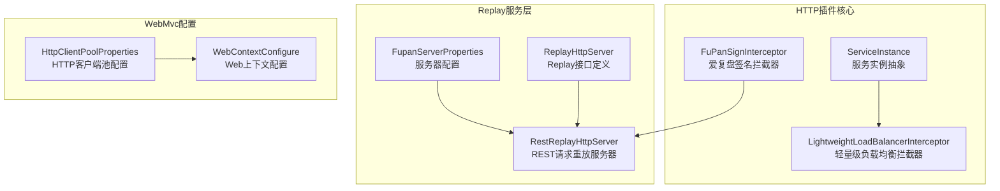
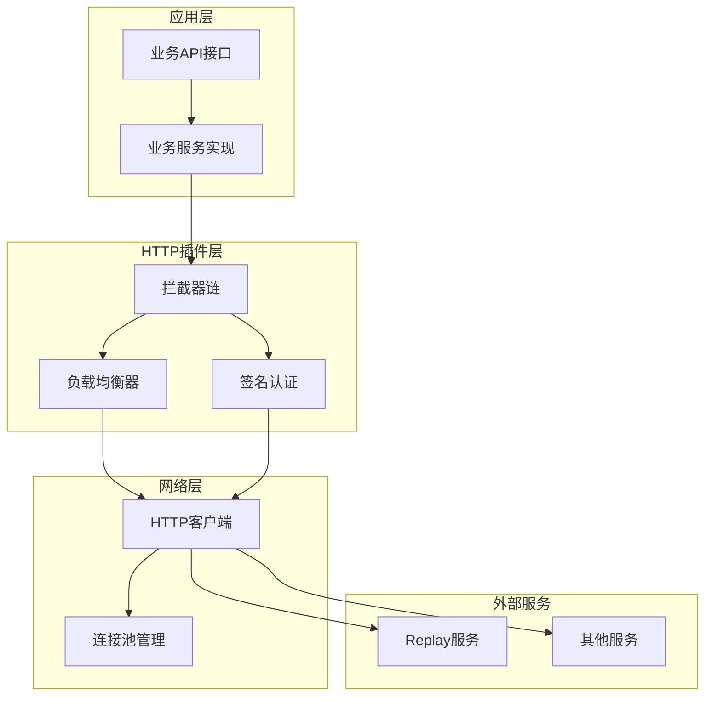
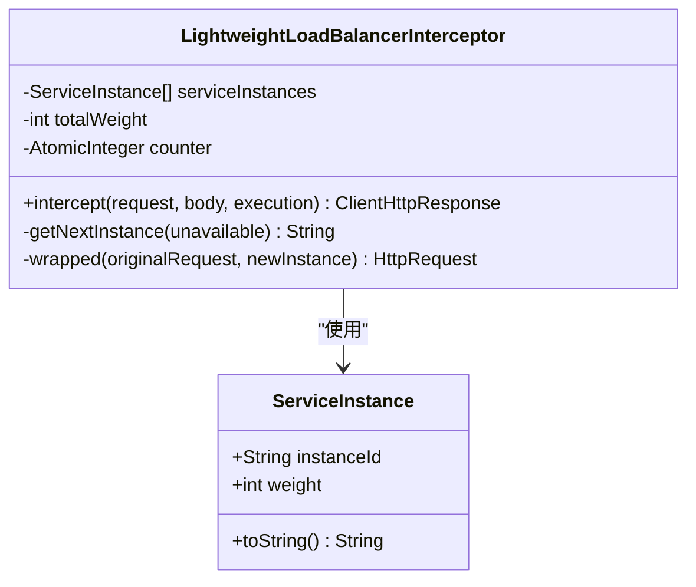
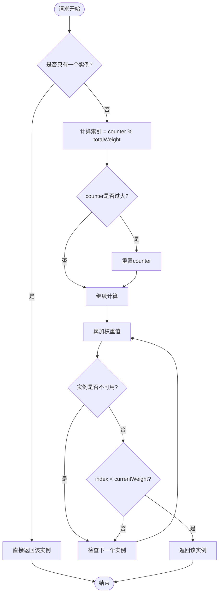
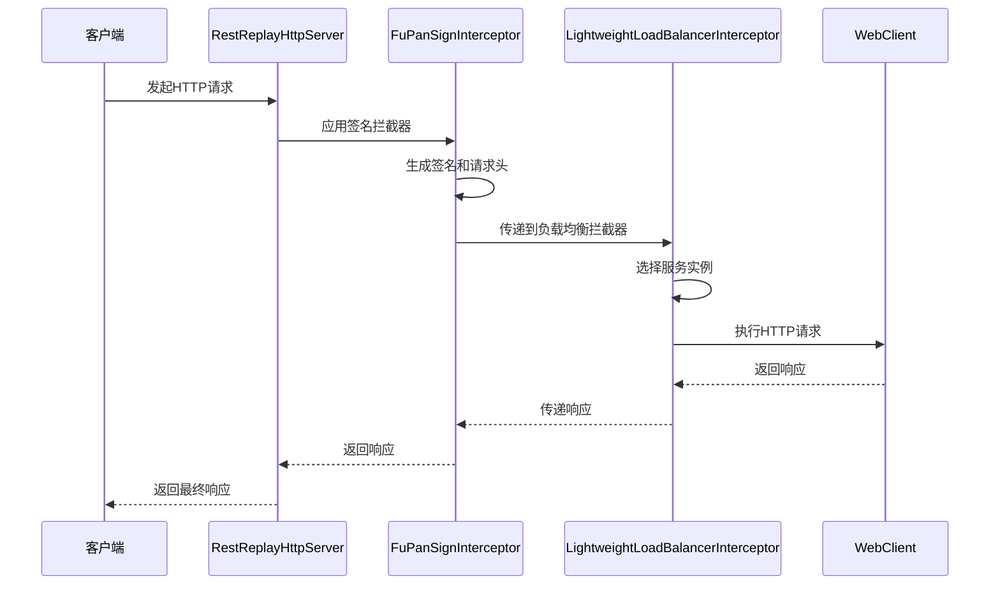
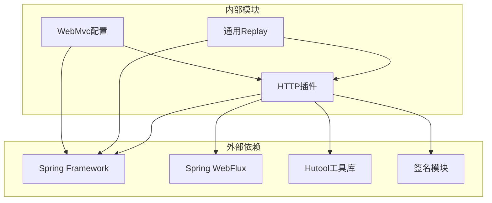
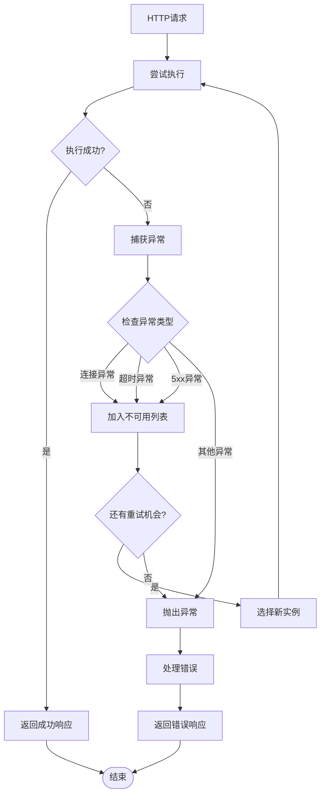
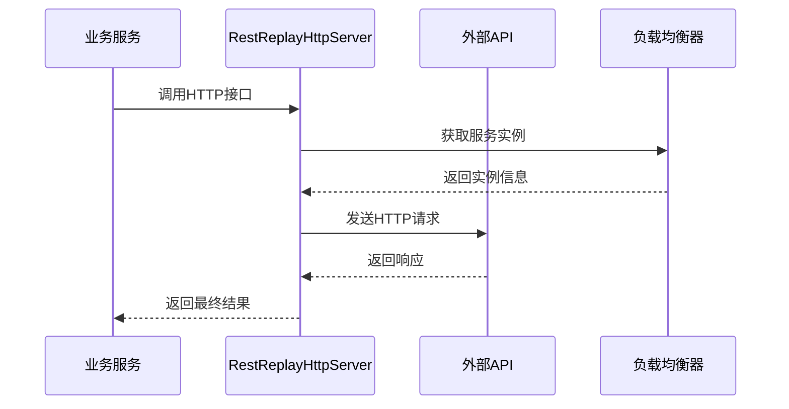

# HTTP客户端插件

<cite>
**本文档引用的文件**
- [ServiceInstance.java](file://src/main/java/com/jiuyu/governance/plugins/http/ServiceInstance.java)
- [LightweightLoadBalancerInterceptor.java](file://src/main/java/com/jiuyu/governance/plugins/http/LightweightLoadBalancerInterceptor.java)
- [FuPanSignInterceptor.java](file://src/main/java/com/jiuyu/governance/plugins/http/FuPanSignInterceptor.java)
- [RestReplayHttpServer.java](file://src/main/java/com/jiuyu/governance/common/replay/RestReplayHttpServer.java)
- [ReplayHttpServer.java](file://src/main/java/com/jiuyu/governance/common/replay/ReplayHttpServer.java)
- [FupanServerProperties.java](file://src/main/java/com/jiuyu/governance/common/replay/FupanServerProperties.java)
- [HttpClientPoolProperties.java](file://src/main/java/com/jiuyu/governance/plugins/webmvc/HttpClientPoolProperties.java)
- [WebContextConfigure.java](file://src/main/java/com/jiuyu/governance/plugins/webmvc/WebContextConfigure.java)
- [application.yml](file://src/main/resources/application.yml)
- [application-dev.yml](file://src/main/resources/application-dev.yml)
- [UserAccountServiceImpl.java](file://src/main/java/com/jiuyu/governance/openfeign/replay/impl/UserAccountServiceImpl.java)
</cite>

## 目录
1. [简介](#简介)
2. [项目结构](#项目结构)
3. [核心组件](#核心组件)
4. [架构概览](#架构概览)
5. [详细组件分析](#详细组件分析)
6. [依赖关系分析](#依赖关系分析)
7. [性能考虑](#性能考虑)
8. [故障处理指南](#故障处理指南)
9. [配置参数详解](#配置参数详解)
10. [使用场景与集成示例](#使用场景与集成示例)
11. [结论](#结论)

## 简介

HTTP客户端插件是爱复盘治理服务的核心组件，负责实现服务间的HTTP通信、负载均衡和安全认证。该插件采用Spring WebClient技术栈，提供了轻量级的负载均衡拦截器、签名认证拦截器以及REST请求重放服务器，为微服务架构下的服务间通信提供了完整的解决方案。

插件的主要功能包括：
- **服务间HTTP通信**：基于Spring WebClient实现的高性能HTTP客户端
- **负载均衡**：支持加权轮询算法的轻量级负载均衡器
- **安全认证**：基于HMAC-SHA256的签名认证机制
- **故障转移**：自动重试和故障实例排除机制
- **配置管理**：基于Spring Boot配置属性的灵活配置

## 项目结构

HTTP客户端插件位于`src/main/java/com/jiuyu/governance/plugins/http/`目录下，主要包含以下核心文件：



**图表来源**
- [ServiceInstance.java:1-36](file://src/main/java/com/jiuyu/governance/plugins/http/ServiceInstance.java#L1-L36)
- [LightweightLoadBalancerInterceptor.java:1-190](file://src/main/java/com/jiuyu/governance/plugins/http/LightweightLoadBalancerInterceptor.java#L1-L190)
- [RestReplayHttpServer.java:1-118](file://src/main/java/com/jiuyu/governance/common/replay/RestReplayHttpServer.java#L1-L118)

**章节来源**
- [ServiceInstance.java:1-36](file://src/main/java/com/jiuyu/governance/plugins/http/ServiceInstance.java#L1-L36)
- [LightweightLoadBalancerInterceptor.java:1-190](file://src/main/java/com/jiuyu/governance/plugins/http/LightweightLoadBalancerInterceptor.java#L1-L190)
- [RestReplayHttpServer.java:1-118](file://src/main/java/com/jiuyu/governance/common/replay/RestReplayHttpServer.java#L1-L118)

## 核心组件

### 服务实例抽象

ServiceInstance类是HTTP插件的基础数据结构，用于表示可访问的服务实例及其权重配置。

**关键特性**：
- **实例标识**：使用`instanceId`字段标识具体的服务实例
- **权重配置**：支持可配置的权重值，默认权重为1
- **线程安全**：使用Lombok注解提供线程安全的getter/setter方法

### 轻量级负载均衡拦截器

LightweightLoadBalancerInterceptor实现了基于加权轮询算法的负载均衡机制，支持故障转移和自动重试。

**核心算法**：
- **加权轮询**：根据实例权重分配请求流量
- **故障排除**：自动识别并排除不可用实例
- **重试机制**：基于指数退避的智能重试策略

### 爱复盘签名拦截器

FuPanSignInterceptor实现了基于HMAC-SHA256的签名认证机制，确保服务间通信的安全性。

**安全特性**：
- **时间戳验证**：防止重放攻击
- **随机数生成**：每个请求生成唯一的随机数
- **参数排序**：按ASCII码排序确保签名一致性

**章节来源**
- [ServiceInstance.java:12-35](file://src/main/java/com/jiuyu/governance/plugins/http/ServiceInstance.java#L12-L35)
- [LightweightLoadBalancerInterceptor.java:31-87](file://src/main/java/com/jiuyu/governance/plugins/http/LightweightLoadBalancerInterceptor.java#L31-L87)
- [FuPanSignInterceptor.java:33-111](file://src/main/java/com/jiuyu/governance/plugins/http/FuPanSignInterceptor.java#L33-L111)

## 架构概览

HTTP客户端插件采用分层架构设计，各组件职责明确，耦合度低：



**图表来源**
- [RestReplayHttpServer.java:21-33](file://src/main/java/com/jiuyu/governance/common/replay/RestReplayHttpServer.java#L21-L33)
- [WebContextConfigure.java:172-216](file://src/main/java/com/jiuyu/governance/plugins/webmvc/WebContextConfigure.java#L172-L216)

## 详细组件分析

### ServiceInstance类分析

ServiceInstance是最基础的数据结构，为负载均衡提供实例信息：



**图表来源**
- [ServiceInstance.java:14-35](file://src/main/java/com/jiuyu/governance/plugins/http/ServiceInstance.java#L14-L35)
- [LightweightLoadBalancerInterceptor.java:37-52](file://src/main/java/com/jiuyu/governance/plugins/http/LightweightLoadBalancerInterceptor.java#L37-L52)

**章节来源**
- [ServiceInstance.java:14-35](file://src/main/java/com/jiuyu/governance/plugins/http/ServiceInstance.java#L14-L35)

### 轻量级负载均衡拦截器算法

负载均衡拦截器实现了复杂的加权轮询算法：



**图表来源**
- [LightweightLoadBalancerInterceptor.java:140-159](file://src/main/java/com/jiuyu/governance/plugins/http/LightweightLoadBalancerInterceptor.java#L140-L159)

**章节来源**
- [LightweightLoadBalancerInterceptor.java:140-159](file://src/main/java/com/jiuyu/governance/plugins/http/LightweightLoadBalancerInterceptor.java#L140-L159)

### REST请求重放服务器

RestReplayHttpServer提供了统一的HTTP客户端接口：



**图表来源**
- [RestReplayHttpServer.java:26-33](file://src/main/java/com/jiuyu/governance/common/replay/RestReplayHttpServer.java#L26-L33)
- [FuPanSignInterceptor.java:59-86](file://src/main/java/com/jiuyu/governance/plugins/http/FuPanSignInterceptor.java#L59-L86)

**章节来源**
- [RestReplayHttpServer.java:26-33](file://src/main/java/com/jiuyu/governance/common/replay/RestReplayHttpServer.java#L26-L33)

## 依赖关系分析

HTTP客户端插件的依赖关系清晰，遵循单一职责原则：



**图表来源**
- [RestReplayHttpServer.java:4-6](file://src/main/java/com/jiuyu/governance/common/replay/RestReplayHttpServer.java#L4-L6)
- [WebContextConfigure.java:172-216](file://src/main/java/com/jiuyu/governance/plugins/webmvc/WebContextConfigure.java#L172-L216)

**章节来源**
- [RestReplayHttpServer.java:4-6](file://src/main/java/com/jiuyu/governance/common/replay/RestReplayHttpServer.java#L4-L6)

## 性能考虑

### 连接池优化

WebContextConfigure类提供了高性能的HTTP客户端连接池配置：

**关键配置参数**：
- **最大连接数**：默认200，可根据业务需求调整
- **每路由最大连接数**：默认50，避免单点过载
- **连接超时**：2秒，平衡响应速度和资源占用
- **套接字超时**：10秒，确保长时间操作的稳定性
- **连接TTL**：30分钟，减少连接重建开销

### 响应式编程优化

负载均衡拦截器采用响应式编程模型：
- **异步执行**：使用Mono和Schedulers.boundedElastic()实现非阻塞
- **内存友好**：避免大量线程创建，降低内存占用
- **背压处理**：支持流量控制和压力缓解

### 缓存策略

签名拦截器实现了智能缓存机制：
- **请求ID缓存**：每个请求生成唯一ID，防止重复请求
- **时间戳验证**：防止重放攻击的同时保持性能
- **参数排序**：使用TreeMap确保签名生成的一致性

**章节来源**
- [WebContextConfigure.java:172-216](file://src/main/java/com/jiuyu/governance/plugins/webmvc/WebContextConfigure.java#L172-L216)
- [HttpClientPoolProperties.java:20-46](file://src/main/java/com/jiuyu/governance/plugins/webmvc/HttpClientPoolProperties.java#L20-L46)

## 故障处理指南

### 错误分类与处理

HTTP客户端插件采用多层次的错误处理机制：



**图表来源**
- [LightweightLoadBalancerInterceptor.java:109-126](file://src/main/java/com/jiuyu/governance/plugins/http/LightweightLoadBalancerInterceptor.java#L109-L126)

### 重试策略配置

默认重试策略针对不同类型的异常进行了专门处理：
- **连接异常**：自动重试，最多重试n次（n为实例数量-1）
- **超时异常**：自动重试，支持抖动避免雪崩效应
- **5xx异常**：自动重试，模拟服务端临时故障
- **其他异常**：直接抛出，不进行重试

### 故障转移机制

当检测到服务实例不可用时，系统会自动进行故障转移：
- **实例排除**：将故障实例加入不可用列表
- **重新选择**：从剩余可用实例中重新选择
- **权重保持**：确保故障实例的权重分配不受影响
- **兜底机制**：如果所有实例都不可用，返回NoResourceFoundException

**章节来源**
- [LightweightLoadBalancerInterceptor.java:80-87](file://src/main/java/com/jiuyu/governance/plugins/http/LightweightLoadBalancerInterceptor.java#L80-L87)
- [LightweightLoadBalancerInterceptor.java:111-125](file://src/main/java/com/jiuyu/governance/plugins/http/LightweightLoadBalancerInterceptor.java#L111-L125)

## 配置参数详解

### 服务器配置参数

FupanServerProperties提供了完整的服务器配置选项：

| 参数名 | 类型 | 默认值 | 描述 |
|--------|------|--------|------|
| baseUrl | String | "http://replay" | 服务基础URL |
| clientId | String | - | 客户端ID |
| clientSecret | String | - | 客户端密钥 |
| enableLoadBalance | Boolean | false | 是否启用负载均衡 |
| serviceInstances | List<ServiceInstance> | [] | 服务实例列表 |

### HTTP客户端池配置

HttpClientPoolProperties定义了连接池的详细配置：

| 参数名 | 类型 | 默认值 | 描述 |
|--------|------|--------|------|
| enabled | Boolean | true | 是否启用连接池 |
| maxTotal | Integer | 200 | 最大连接总数 |
| defaultMaxPerRoute | Integer | 50 | 每路由最大连接数 |
| connectTimeout | Duration | 2s | 连接超时时间 |
| socketTimeout | Duration | 10s | 套接字超时时间 |
| connectionRequestTimeout | Duration | 1s | 连接请求超时时间 |
| timeToLive | Duration | 30m | 连接存活时间 |
| maxIdleTime | Duration | 30s | 最大空闲时间 |
| validateAfterInactivity | Duration | 5s | 不活跃验证间隔 |

### 配置示例

在application-dev.yml中的配置示例：

```yaml
jiuyu:
  fupan-server:
    client-id: "governance"
    client-secret: "123456"
    enable-load-balance: true
    service-instances:
      - instance-id: 127.0.0.1:6607
        weight: 1
```

**章节来源**
- [FupanServerProperties.java:20-47](file://src/main/java/com/jiuyu/governance/common/replay/FupanServerProperties.java#L20-L47)
- [HttpClientPoolProperties.java:20-46](file://src/main/java/com/jiuyu/governance/plugins/webmvc/HttpClientPoolProperties.java#L20-L46)
- [application-dev.yml:51-58](file://src/main/resources/application-dev.yml#L51-L58)

## 使用场景与集成示例

### 基本使用流程

HTTP客户端插件的典型使用场景：



**图表来源**
- [UserAccountServiceImpl.java:27-52](file://src/main/java/com/jiuyu/governance/openfeign/replay/impl/UserAccountServiceImpl.java#L27-L52)

### 集成示例

在业务服务中集成HTTP客户端插件的完整示例：

1. **依赖注入**：通过构造函数注入ReplayHttpServer
2. **参数准备**：准备请求URL、请求体和请求头
3. **接口调用**：调用相应的HTTP方法（get/post/put/delete/patch）
4. **响应处理**：使用retrieve()方法获取响应并转换为指定类型

### 高级配置场景

**多实例负载均衡配置**：
```yaml
service-instances:
  - instance-id: "127.0.0.1:6607"
    weight: 2
  - instance-id: "127.0.0.1:6608"
    weight: 1
```

**安全配置**：
- 启用签名认证自动添加必要的请求头
- 支持HTTPS协议的自动端口识别
- 提供完整的错误处理和重试机制

**章节来源**
- [UserAccountServiceImpl.java:27-135](file://src/main/java/com/jiuyu/governance/openfeign/replay/impl/UserAccountServiceImpl.java#L27-L135)

## 结论

HTTP客户端插件是一个设计精良、功能完备的服务间通信解决方案。其核心优势包括：

**架构优势**：
- 清晰的分层设计，职责分离明确
- 响应式编程模型，性能优异
- 灵活的配置机制，适应性强

**功能特性**：
- 完整的负载均衡算法，支持加权轮询
- 强大的安全认证机制，基于HMAC-SHA256
- 智能的故障转移和重试策略
- 高效的连接池管理和资源优化

**适用场景**：
- 微服务架构下的服务间通信
- 高并发场景下的HTTP客户端
- 需要安全认证的API调用
- 需要负载均衡的分布式系统

该插件为爱复盘治理服务提供了稳定可靠的技术支撑，能够满足各种复杂业务场景的需求。通过合理的配置和使用，可以显著提升系统的性能和可靠性。