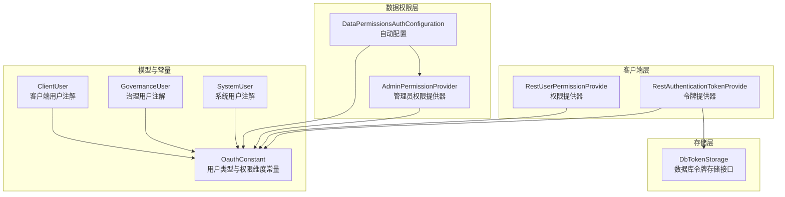
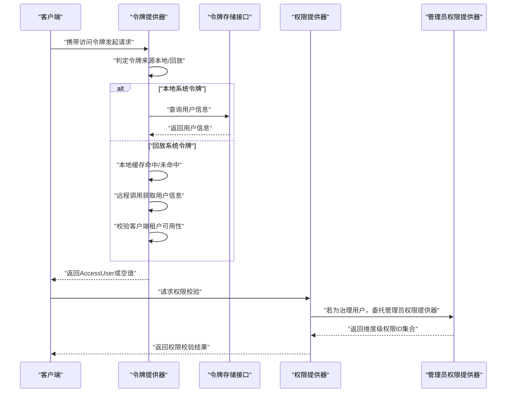
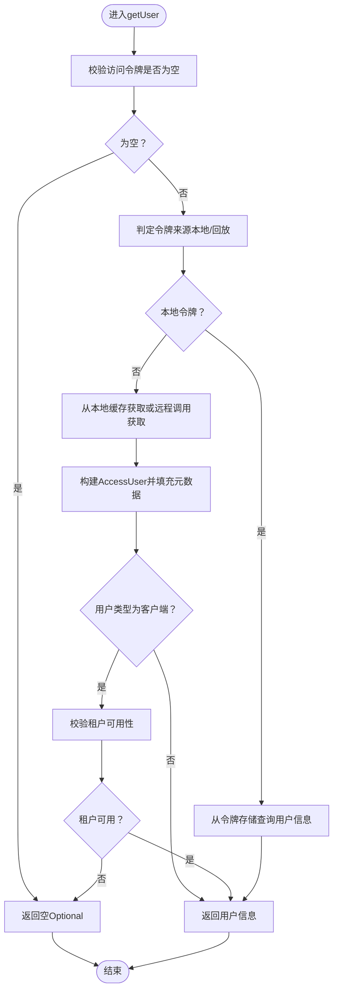
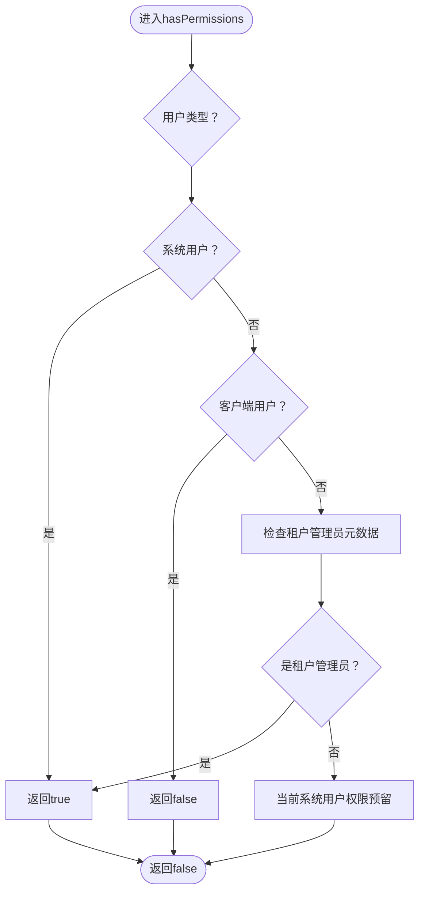
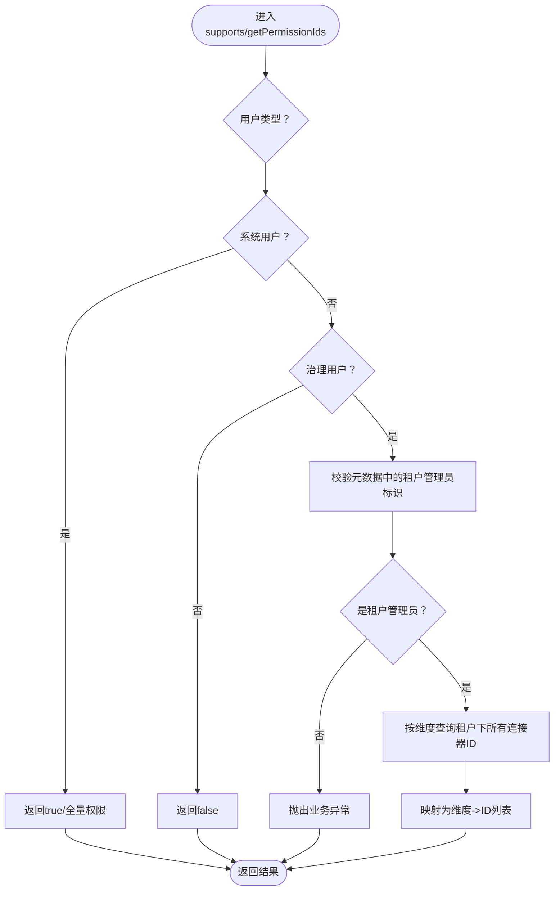
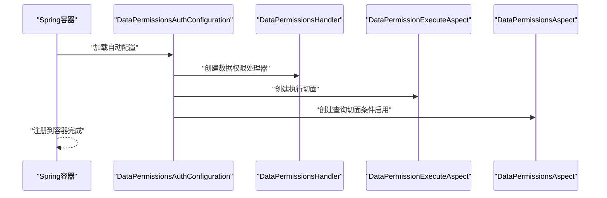
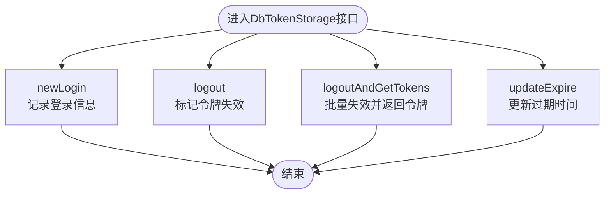
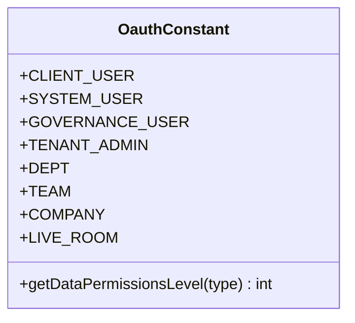
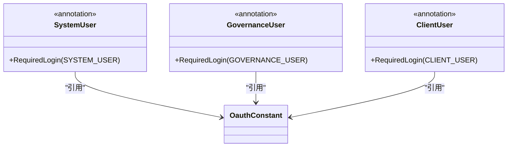
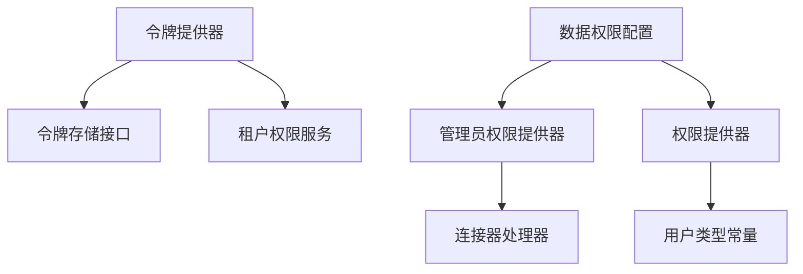

# OAuth认证插件

<cite>
**本文档引用的文件**
- [RestAuthenticationTokenProvide.java](file://src/main/java/com/jiuyu/governance/plugins/oauth/client/RestAuthenticationTokenProvide.java)
- [RestUserPermissionProvide.java](file://src/main/java/com/jiuyu/governance/plugins/oauth/client/RestUserPermissionProvide.java)
- [AdminPermissionProvider.java](file://src/main/java/com/jiuyu/governance/plugins/oauth/data/provider/AdminPermissionProvider.java)
- [DbTokenStorage.java](file://src/main/java/com/jiuyu/governance/plugins/oauth/server/DbTokenStorage.java)
- [OauthConstant.java](file://src/main/java/com/jiuyu/governance/plugins/oauth/pojo/OauthConstant.java)
- [SystemUser.java](file://src/main/java/com/jiuyu/governance/plugins/oauth/SystemUser.java)
- [GovernanceUser.java](file://src/main/java/com/jiuyu/governance/plugins/oauth/GovernanceUser.java)
- [ClientUser.java](file://src/main/java/com/jiuyu/governance/plugins/oauth/ClientUser.java)
- [DataPermissionsAuthConfiguration.java](file://src/main/java/com/jiuyu/governance/plugins/oauth/data/DataPermissionsAuthConfiguration.java)
</cite>

## 目录
1. [简介](#简介)
2. [项目结构](#项目结构)
3. [核心组件](#核心组件)
4. [架构总览](#架构总览)
5. [详细组件分析](#详细组件分析)
6. [依赖关系分析](#依赖关系分析)
7. [性能考量](#性能考量)
8. [故障排查指南](#故障排查指南)
9. [结论](#结论)
10. [附录](#附录)

## 简介
本文件为OAuth认证插件的技术文档，聚焦于认证授权架构与实现细节，涵盖以下主题：
- RestAuthenticationTokenProvide令牌提供器的认证机制与令牌来源判定
- RestUserPermissionProvide权限提供器的权限验证流程与用户角色区分
- AdminPermissionProvider管理员权限提供器的特殊处理与数据权限授予
- DbTokenStorage数据库令牌存储的持久化策略与会话生命周期管理
- 插件如何实现用户认证、权限验证、令牌管理、角色区分、权限继承、会话管理等核心能力
- 插件的配置方法、安全考虑与扩展接口，以及集成指南与使用示例

## 项目结构
OAuth插件位于治理服务的插件模块中，主要分为三层：
- 客户端层：负责远程认证与权限判断，适配多用户类型
- 数据权限层：基于注解与AOP实现数据维度的权限控制
- 存储层：抽象令牌存储接口，支持数据库持久化与扩展

图表来源
- [RestAuthenticationTokenProvide.java:1-122](file://src/main/java/com/jiuyu/governance/plugins/oauth/client/RestAuthenticationTokenProvide.java#L1-L122)
- [RestUserPermissionProvide.java:1-60](file://src/main/java/com/jiuyu/governance/plugins/oauth/client/RestUserPermissionProvide.java#L1-L60)
- [AdminPermissionProvider.java:1-100](file://src/main/java/com/jiuyu/governance/plugins/oauth/data/provider/AdminPermissionProvider.java#L1-L100)
- [DbTokenStorage.java:1-70](file://src/main/java/com/jiuyu/governance/plugins/oauth/server/DbTokenStorage.java#L1-L70)
- [OauthConstant.java:1-81](file://src/main/java/com/jiuyu/governance/plugins/oauth/pojo/OauthConstant.java#L1-L81)
- [SystemUser.java:1-20](file://src/main/java/com/jiuyu/governance/plugins/oauth/SystemUser.java#L1-L20)
- [GovernanceUser.java:1-20](file://src/main/java/com/jiuyu/governance/plugins/oauth/GovernanceUser.java#L1-L20)
- [ClientUser.java:1-20](file://src/main/java/com/jiuyu/governance/plugins/oauth/ClientUser.java#L1-L20)
- [DataPermissionsAuthConfiguration.java:1-78](file://src/main/java/com/jiuyu/governance/plugins/oauth/data/DataPermissionsAuthConfiguration.java#L1-L78)

章节来源
- [RestAuthenticationTokenProvide.java:1-122](file://src/main/java/com/jiuyu/governance/plugins/oauth/client/RestAuthenticationTokenProvide.java#L1-L122)
- [RestUserPermissionProvide.java:1-60](file://src/main/java/com/jiuyu/governance/plugins/oauth/client/RestUserPermissionProvide.java#L1-L60)
- [AdminPermissionProvider.java:1-100](file://src/main/java/com/jiuyu/governance/plugins/oauth/data/provider/AdminPermissionProvider.java#L1-L100)
- [DbTokenStorage.java:1-70](file://src/main/java/com/jiuyu/governance/plugins/oauth/server/DbTokenStorage.java#L1-L70)
- [OauthConstant.java:1-81](file://src/main/java/com/jiuyu/governance/plugins/oauth/pojo/OauthConstant.java#L1-L81)
- [SystemUser.java:1-20](file://src/main/java/com/jiuyu/governance/plugins/oauth/SystemUser.java#L1-L20)
- [GovernanceUser.java:1-20](file://src/main/java/com/jiuyu/governance/plugins/oauth/GovernanceUser.java#L1-L20)
- [ClientUser.java:1-20](file://src/main/java/com/jiuyu/governance/plugins/oauth/ClientUser.java#L1-L20)
- [DataPermissionsAuthConfiguration.java:1-78](file://src/main/java/com/jiuyu/governance/plugins/oauth/data/DataPermissionsAuthConfiguration.java#L1-L78)

## 核心组件
- 令牌提供器（RestAuthenticationTokenProvide）
  - 负责根据访问令牌获取用户信息，支持本地系统令牌与“回放”系统令牌的差异化处理
  - 使用本地缓存提升回放系统令牌的查询效率，并对客户端用户进行租户可用性校验
- 权限提供器（RestUserPermissionProvide）
  - 基于用户类型与元数据判断是否具备权限，系统用户始终有权限，客户端用户无权限
  - 对租户管理员进行元数据标记校验，支持租户管理员的权限特例
- 管理员权限提供器（AdminPermissionProvider）
  - 支持系统管理员与治理平台租户管理员两类用户，授予其全量数据访问权限
  - 提供按维度查询租户下所有连接器ID的能力，确保租户管理员的即时性与准确性
- 数据权限自动配置（DataPermissionsAuthConfiguration）
  - 自动装配数据权限处理器、执行切面与查询切面，支持注解驱动的权限控制
- 令牌存储接口（DbTokenStorage）
  - 抽象数据库持久化的令牌存储能力，支持新登录、登出、批量登出与过期时间更新
- 用户类型与权限维度常量（OauthConstant）
  - 统一定义用户类型标识与数据权限维度标识，提供维度级别的排序与映射
- 用户类型注解（SystemUser、GovernanceUser、ClientUser）
  - 基于框架注解实现方法级/类级的登录用户类型限制

章节来源
- [RestAuthenticationTokenProvide.java:31-122](file://src/main/java/com/jiuyu/governance/plugins/oauth/client/RestAuthenticationTokenProvide.java#L31-L122)
- [RestUserPermissionProvide.java:24-60](file://src/main/java/com/jiuyu/governance/plugins/oauth/client/RestUserPermissionProvide.java#L24-L60)
- [AdminPermissionProvider.java:29-100](file://src/main/java/com/jiuyu/governance/plugins/oauth/data/provider/AdminPermissionProvider.java#L29-L100)
- [DataPermissionsAuthConfiguration.java:29-78](file://src/main/java/com/jiuyu/governance/plugins/oauth/data/DataPermissionsAuthConfiguration.java#L29-L78)
- [DbTokenStorage.java:14-70](file://src/main/java/com/jiuyu/governance/plugins/oauth/server/DbTokenStorage.java#L14-L70)
- [OauthConstant.java:9-81](file://src/main/java/com/jiuyu/governance/plugins/oauth/pojo/OauthConstant.java#L9-L81)
- [SystemUser.java:14-20](file://src/main/java/com/jiuyu/governance/plugins/oauth/SystemUser.java#L14-L20)
- [GovernanceUser.java:14-20](file://src/main/java/com/jiuyu/governance/plugins/oauth/GovernanceUser.java#L14-L20)
- [ClientUser.java:14-20](file://src/main/java/com/jiuyu/governance/plugins/oauth/ClientUser.java#L14-L20)

## 架构总览
OAuth插件通过“令牌提供器 + 权限提供器 + 数据权限AOP”的组合实现认证与授权闭环，同时以统一的用户类型与权限维度常量支撑跨模块一致性。

图表来源
- [RestAuthenticationTokenProvide.java:62-122](file://src/main/java/com/jiuyu/governance/plugins/oauth/client/RestAuthenticationTokenProvide.java#L62-L122)
- [RestUserPermissionProvide.java:26-60](file://src/main/java/com/jiuyu/governance/plugins/oauth/client/RestUserPermissionProvide.java#L26-L60)
- [AdminPermissionProvider.java:73-98](file://src/main/java/com/jiuyu/governance/plugins/oauth/data/provider/AdminPermissionProvider.java#L73-L98)
- [DbTokenStorage.java:14-70](file://src/main/java/com/jiuyu/governance/plugins/oauth/server/DbTokenStorage.java#L14-L70)

## 详细组件分析

### 令牌提供器（RestAuthenticationTokenProvide）
- 功能要点
  - 令牌来源判定：通过长度阈值快速区分本地系统令牌与回放系统令牌
  - 回放令牌处理：采用本地缓存（Caffeine）降低远程调用频率，缓存有效期与容量可控
  - 客户端用户校验：当令牌属于客户端用户时，进一步校验其所在租户是否可用
  - 有效性判定：基于用户信息是否存在判断令牌是否有效
- 关键流程

图表来源
- [RestAuthenticationTokenProvide.java:62-122](file://src/main/java/com/jiuyu/governance/plugins/oauth/client/RestAuthenticationTokenProvide.java#L62-L122)

章节来源
- [RestAuthenticationTokenProvide.java:31-122](file://src/main/java/com/jiuyu/governance/plugins/oauth/client/RestAuthenticationTokenProvide.java#L31-L122)

### 权限提供器（RestUserPermissionProvide）
- 功能要点
  - 用户类型优先级：系统用户始终有权限；客户端用户无权限
  - 租户管理员特例：通过元数据中的租户管理员标识进行判断
  - 当前系统用户权限：预留扩展点（当前返回false）
- 关键流程

图表来源
- [RestUserPermissionProvide.java:26-60](file://src/main/java/com/jiuyu/governance/plugins/oauth/client/RestUserPermissionProvide.java#L26-L60)

章节来源
- [RestUserPermissionProvide.java:24-60](file://src/main/java/com/jiuyu/governance/plugins/oauth/client/RestUserPermissionProvide.java#L24-L60)

### 管理员权限提供器（AdminPermissionProvider）
- 功能要点
  - 支持类型：系统管理员（全局权限）、治理平台租户管理员（按维度全量权限）
  - 数据维度：将请求的维度过滤为可管理类型，查询租户下所有连接器ID
  - 错误处理：当元数据缺失或非管理员时抛出业务异常
- 关键流程

图表来源
- [AdminPermissionProvider.java:44-98](file://src/main/java/com/jiuyu/governance/plugins/oauth/data/provider/AdminPermissionProvider.java#L44-L98)

章节来源
- [AdminPermissionProvider.java:29-100](file://src/main/java/com/jiuyu/governance/plugins/oauth/data/provider/AdminPermissionProvider.java#L29-L100)

### 数据权限自动配置（DataPermissionsAuthConfiguration）
- 功能要点
  - 自动装配数据权限处理器：聚合业务权限与用户权限提供器
  - 注册执行切面与查询切面：支持方法执行与查询阶段的权限拦截
  - 条件化启用：可通过配置开关控制查询切面的启用
- 关键流程

图表来源
- [DataPermissionsAuthConfiguration.java:39-76](file://src/main/java/com/jiuyu/governance/plugins/oauth/data/DataPermissionsAuthConfiguration.java#L39-L76)

章节来源
- [DataPermissionsAuthConfiguration.java:29-78](file://src/main/java/com/jiuyu/governance/plugins/oauth/data/DataPermissionsAuthConfiguration.java#L29-L78)

### 令牌存储接口（DbTokenStorage）
- 功能要点
  - 新登录：记录用户登录信息与令牌关联
  - 登出：将指定令牌标记为失效
  - 批量登出：按用户类型与用户ID集合批量失效令牌
  - 更新过期：延长或重置令牌有效期
- 关键流程

图表来源
- [DbTokenStorage.java:28-68](file://src/main/java/com/jiuyu/governance/plugins/oauth/server/DbTokenStorage.java#L28-L68)

章节来源
- [DbTokenStorage.java:14-70](file://src/main/java/com/jiuyu/governance/plugins/oauth/server/DbTokenStorage.java#L14-L70)

### 用户类型与权限维度常量（OauthConstant）
- 用户类型
  - 系统用户、治理用户、客户端用户
- 权限维度
  - 公司、部门、小组、直播间等维度标识及对应的数据权限级别
- 关键流程

图表来源
- [OauthConstant.java:9-81](file://src/main/java/com/jiuyu/governance/plugins/oauth/pojo/OauthConstant.java#L9-L81)

章节来源
- [OauthConstant.java:9-81](file://src/main/java/com/jiuyu/governance/plugins/oauth/pojo/OauthConstant.java#L9-L81)

### 用户类型注解（SystemUser、GovernanceUser、ClientUser）
- 功能要点
  - 基于RequiredLogin注解，限定方法或类的访问用户类型
  - 与OauthConstant中的用户类型标识保持一致
- 关键流程

图表来源
- [SystemUser.java:14-20](file://src/main/java/com/jiuyu/governance/plugins/oauth/SystemUser.java#L14-L20)
- [GovernanceUser.java:14-20](file://src/main/java/com/jiuyu/governance/plugins/oauth/GovernanceUser.java#L14-L20)
- [ClientUser.java:14-20](file://src/main/java/com/jiuyu/governance/plugins/oauth/ClientUser.java#L14-L20)
- [OauthConstant.java:18-30](file://src/main/java/com/jiuyu/governance/plugins/oauth/pojo/OauthConstant.java#L18-L30)

章节来源
- [SystemUser.java:14-20](file://src/main/java/com/jiuyu/governance/plugins/oauth/SystemUser.java#L14-L20)
- [GovernanceUser.java:14-20](file://src/main/java/com/jiuyu/governance/plugins/oauth/GovernanceUser.java#L14-L20)
- [ClientUser.java:14-20](file://src/main/java/com/jiuyu/governance/plugins/oauth/ClientUser.java#L14-L20)

## 依赖关系分析
- 组件耦合
  - 令牌提供器依赖令牌存储接口与租户权限服务，用于本地查询与客户端租户可用性校验
  - 权限提供器依赖用户类型常量与租户管理员元数据判断
  - 管理员权限提供器依赖连接器处理器与业务异常处理
  - 数据权限自动配置依赖多个AOP组件与参数配置
- 外部依赖
  - 框架注解（RequiredLogin）与响应封装（ApiResponse）
  - 缓存框架（Caffeine）用于令牌信息缓存
- 循环依赖
  - 当前结构未发现循环依赖迹象，职责边界清晰

图表来源
- [RestAuthenticationTokenProvide.java:33-52](file://src/main/java/com/jiuyu/governance/plugins/oauth/client/RestAuthenticationTokenProvide.java#L33-L52)
- [RestUserPermissionProvide.java:24-41](file://src/main/java/com/jiuyu/governance/plugins/oauth/client/RestUserPermissionProvide.java#L24-L41)
- [AdminPermissionProvider.java:29-98](file://src/main/java/com/jiuyu/governance/plugins/oauth/data/provider/AdminPermissionProvider.java#L29-L98)
- [DataPermissionsAuthConfiguration.java:39-76](file://src/main/java/com/jiuyu/governance/plugins/oauth/data/DataPermissionsAuthConfiguration.java#L39-L76)

章节来源
- [RestAuthenticationTokenProvide.java:33-52](file://src/main/java/com/jiuyu/governance/plugins/oauth/client/RestAuthenticationTokenProvide.java#L33-L52)
- [RestUserPermissionProvide.java:24-41](file://src/main/java/com/jiuyu/governance/plugins/oauth/client/RestUserPermissionProvide.java#L24-L41)
- [AdminPermissionProvider.java:29-98](file://src/main/java/com/jiuyu/governance/plugins/oauth/data/provider/AdminPermissionProvider.java#L29-L98)
- [DataPermissionsAuthConfiguration.java:39-76](file://src/main/java/com/jiuyu/governance/plugins/oauth/data/DataPermissionsAuthConfiguration.java#L39-L76)

## 性能考量
- 本地缓存优化
  - 回放系统令牌采用Caffeine缓存，设置合理的过期时间与最大容量，减少远程调用开销
- 权限判断短路
  - 系统用户与客户端用户在权限判断上采用早期返回，避免不必要的后续计算
- 数据权限即时性
  - 租户管理员场景不使用本地缓存，确保权限变更的实时生效
- 批量操作
  - 批量登出接口支持按用户ID集合一次性失效令牌，降低多次调用成本

## 故障排查指南
- 令牌无效或为空
  - 检查令牌是否为空、是否为回放系统令牌且远程调用失败
  - 查看令牌存储中是否存在对应记录
- 客户端用户被拒绝
  - 确认客户端用户所在租户是否仍处于可用状态
- 租户管理员权限异常
  - 检查元数据中租户管理员标识是否正确设置
  - 确认连接器处理器返回的维度ID集合是否为空
- 权限校验失败
  - 确认当前系统用户权限预留逻辑是否按预期扩展
  - 检查数据权限AOP是否正确启用与拦截

章节来源
- [RestAuthenticationTokenProvide.java:72-92](file://src/main/java/com/jiuyu/governance/plugins/oauth/client/RestAuthenticationTokenProvide.java#L72-L92)
- [RestUserPermissionProvide.java:28-41](file://src/main/java/com/jiuyu/governance/plugins/oauth/client/RestUserPermissionProvide.java#L28-L41)
- [AdminPermissionProvider.java:77-84](file://src/main/java/com/jiuyu/governance/plugins/oauth/data/provider/AdminPermissionProvider.java#L77-L84)

## 结论
OAuth认证插件通过清晰的分层设计与可扩展的接口，实现了多用户类型的认证与权限控制，并结合数据权限AOP提供了细粒度的维度级访问控制。DbTokenStorage接口为令牌持久化提供了标准化入口，便于后续扩展其他存储实现。整体架构兼顾了性能与安全性，适合在复杂的企业治理场景中部署与演进。

## 附录
- 集成指南
  - 在控制器或服务层使用用户类型注解（SystemUser、GovernanceUser、ClientUser）限制访问范围
  - 通过数据权限自动配置启用AOP切面，确保方法执行与查询阶段的权限拦截
  - 实现DbTokenStorage的具体存储（如数据库）以满足会话管理需求
- 使用示例
  - 方法级限制：在Controller的方法上添加SystemUser注解，仅允许系统用户访问
  - 权限校验：在业务方法中调用权限提供器进行权限判断
  - 数据权限：在查询方法上使用数据权限注解，自动注入维度级权限ID集合