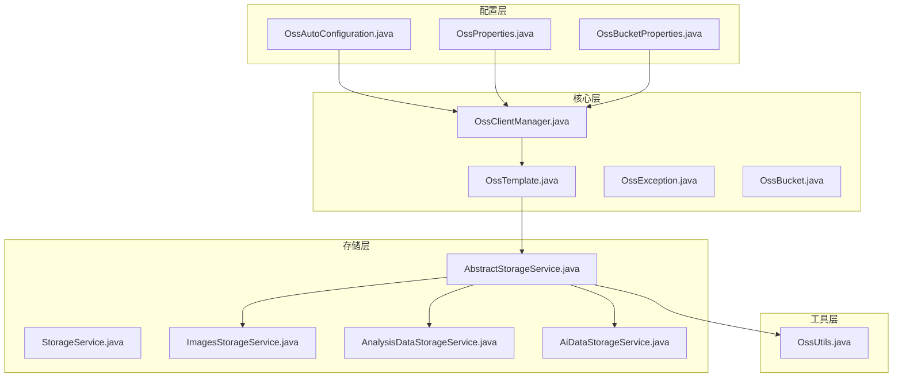
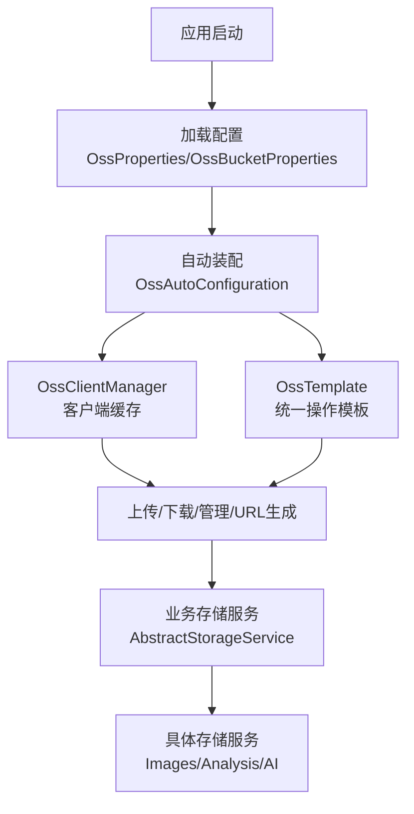
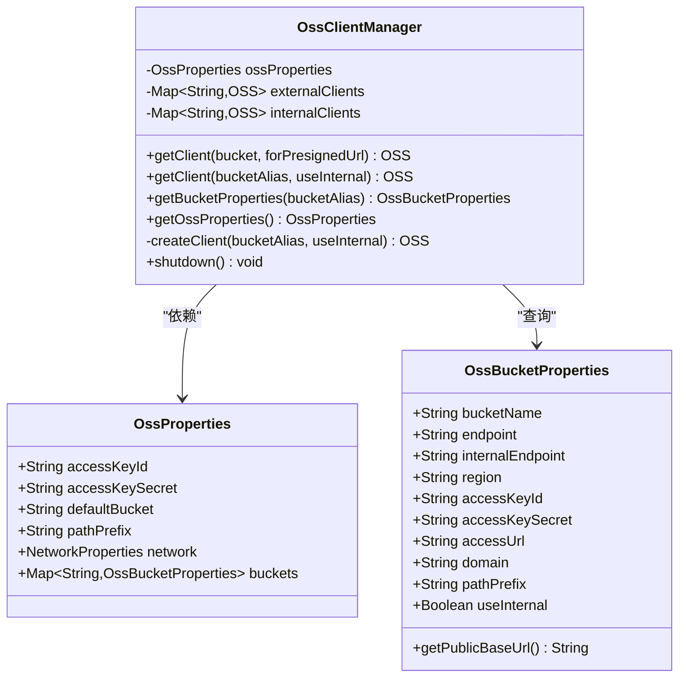
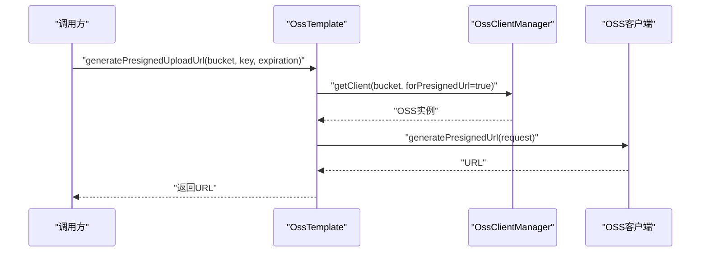
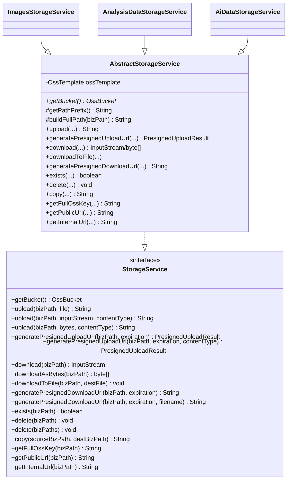
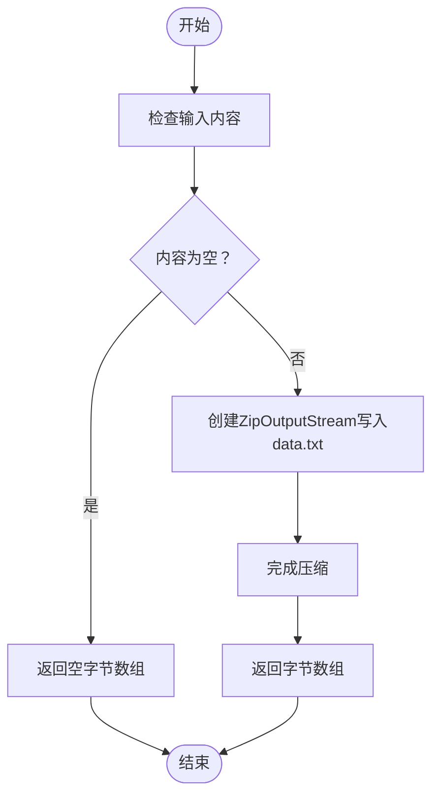
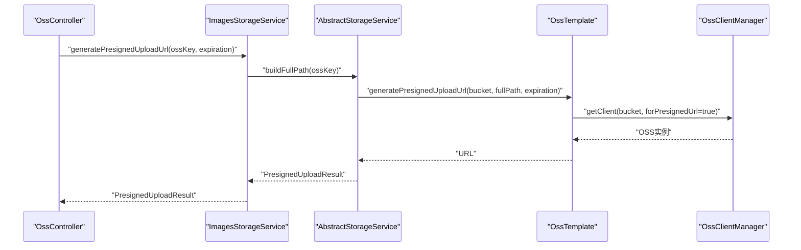
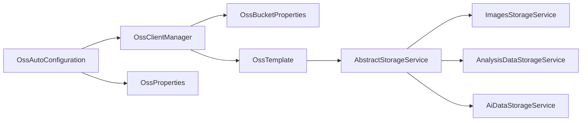

# OSS存储插件

<cite>
**本文档引用的文件**
- [OssAutoConfiguration.java](file://src/main/java/com/jiuyu/governance/plugins/oss/config/OssAutoConfiguration.java)
- [OssProperties.java](file://src/main/java/com/jiuyu/governance/plugins/oss/config/OssProperties.java)
- [OssBucketProperties.java](file://src/main/java/com/jiuyu/governance/plugins/oss/config/OssBucketProperties.java)
- [OssClientManager.java](file://src/main/java/com/jiuyu/governance/plugins/oss/core/OssClientManager.java)
- [OssTemplate.java](file://src/main/java/com/jiuyu/governance/plugins/oss/core/OssTemplate.java)
- [OssException.java](file://src/main/java/com/jiuyu/governance/plugins/oss/core/OssException.java)
- [OssBucket.java](file://src/main/java/com/jiuyu/governance/plugins/oss/enums/OssBucket.java)
- [StorageService.java](file://src/main/java/com/jiuyu/governance/plugins/oss/storage/StorageService.java)
- [AbstractStorageService.java](file://src/main/java/com/jiuyu/governance/plugins/oss/storage/AbstractStorageService.java)
- [OssUtils.java](file://src/main/java/com/jiuyu/governance/plugins/oss/utils/OssUtils.java)
- [OssController.java](file://src/main/java/com/jiuyu/governance/common/controller/OssController.java)
- [ImagesStorageService.java](file://src/main/java/com/jiuyu/governance/plugins/oss/storage/impl/ImagesStorageService.java)
- [AnalysisDataStorageService.java](file://src/main/java/com/jiuyu/governance/plugins/oss/storage/impl/AnalysisDataStorageService.java)
- [AiDataStorageService.java](file://src/main/java/com/jiuyu/governance/plugins/oss/storage/impl/AiDataStorageService.java)
- [application.yml](file://src/main/resources/application.yml)
</cite>

## 目录
1. [简介](#简介)
2. [项目结构](#项目结构)
3. [核心组件](#核心组件)
4. [架构总览](#架构总览)
5. [详细组件分析](#详细组件分析)
6. [依赖分析](#依赖分析)
7. [性能考虑](#性能考虑)
8. [故障排查指南](#故障排查指南)
9. [结论](#结论)
10. [附录](#附录)

## 简介
本文件为OSS存储插件的全面技术文档，面向需要在系统中集成阿里云OSS能力的开发者与运维人员。文档围绕以下目标展开：
- 深入解析OSS插件的存储架构与实现原理
- 详述OssClientManager客户端管理器的连接池设计
- 讲解OssTemplate模板操作的统一接口
- 解释AbstractStorageService抽象存储服务的扩展机制
- 规范StorageService存储服务接口的标准化设计
- 说明OssUtils工具类的辅助功能
- 全面阐述插件如何实现文件的上传下载、预签名URL生成、存储桶管理等核心功能
- 总结配置参数、性能优化、错误处理与安全策略
- 提供完整的使用示例与集成指南

## 项目结构
OSS插件位于plugins/oss模块下，采用“配置-核心-存储-工具”的分层组织方式：
- config：自动装配与配置属性
- core：客户端管理与模板操作
- storage：存储服务接口与抽象实现
- utils：OSS相关工具方法
- enums：桶枚举定义

**图表来源**
- [OssAutoConfiguration.java:1-40](file://src/main/java/com/jiuyu/governance/plugins/oss/config/OssAutoConfiguration.java#L1-L40)
- [OssProperties.java:1-140](file://src/main/java/com/jiuyu/governance/plugins/oss/config/OssProperties.java#L1-L140)
- [OssBucketProperties.java:1-77](file://src/main/java/com/jiuyu/governance/plugins/oss/config/OssBucketProperties.java#L1-L77)
- [OssClientManager.java:1-154](file://src/main/java/com/jiuyu/governance/plugins/oss/core/OssClientManager.java#L1-L154)
- [OssTemplate.java:1-358](file://src/main/java/com/jiuyu/governance/plugins/oss/core/OssTemplate.java#L1-L358)
- [OssException.java:1-45](file://src/main/java/com/jiuyu/governance/plugins/oss/core/OssException.java#L1-L45)
- [OssBucket.java:1-61](file://src/main/java/com/jiuyu/governance/plugins/oss/enums/OssBucket.java#L1-L61)
- [StorageService.java:1-184](file://src/main/java/com/jiuyu/governance/plugins/oss/storage/StorageService.java#L1-L184)
- [AbstractStorageService.java:1-187](file://src/main/java/com/jiuyu/governance/plugins/oss/storage/AbstractStorageService.java#L1-L187)
- [OssUtils.java:1-88](file://src/main/java/com/jiuyu/governance/plugins/oss/utils/OssUtils.java#L1-L88)

**章节来源**
- [OssAutoConfiguration.java:1-40](file://src/main/java/com/jiuyu/governance/plugins/oss/config/OssAutoConfiguration.java#L1-L40)
- [OssProperties.java:1-140](file://src/main/java/com/jiuyu/governance/plugins/oss/config/OssProperties.java#L1-L140)
- [OssBucketProperties.java:1-77](file://src/main/java/com/jiuyu/governance/plugins/oss/config/OssBucketProperties.java#L1-L77)

## 核心组件
本节聚焦于OSS插件的核心构件及其职责：
- 自动装配与配置：通过条件化装配启用OSS客户端与模板
- 客户端管理器：按桶与网络策略缓存OSS实例，提供统一客户端获取
- 模板操作：封装上传、下载、预签名URL生成、管理操作与URL生成
- 存储服务接口与抽象实现：标准化业务存储服务，降低重复代码
- 工具类：提供zip压缩/解压等辅助能力

**章节来源**
- [OssAutoConfiguration.java:24-38](file://src/main/java/com/jiuyu/governance/plugins/oss/config/OssAutoConfiguration.java#L24-L38)
- [OssClientManager.java:22-154](file://src/main/java/com/jiuyu/governance/plugins/oss/core/OssClientManager.java#L22-L154)
- [OssTemplate.java:28-358](file://src/main/java/com/jiuyu/governance/plugins/oss/core/OssTemplate.java#L28-L358)
- [StorageService.java:18-184](file://src/main/java/com/jiuyu/governance/plugins/oss/storage/StorageService.java#L18-L184)
- [AbstractStorageService.java:25-187](file://src/main/java/com/jiuyu/governance/plugins/oss/storage/AbstractStorageService.java#L25-L187)
- [OssUtils.java:16-88](file://src/main/java/com/jiuyu/governance/plugins/oss/utils/OssUtils.java#L16-L88)

## 架构总览
OSS插件采用“配置驱动 + 客户端管理 + 模板封装 + 业务服务抽象”的分层架构。自动装配根据配置属性动态创建客户端管理器与模板；模板基于客户端管理器按需获取OSS实例并执行底层操作；业务存储服务通过继承抽象类复用统一逻辑。

**图表来源**
- [OssAutoConfiguration.java:24-38](file://src/main/java/com/jiuyu/governance/plugins/oss/config/OssAutoConfiguration.java#L24-L38)
- [OssClientManager.java:22-154](file://src/main/java/com/jiuyu/governance/plugins/oss/core/OssClientManager.java#L22-L154)
- [OssTemplate.java:28-358](file://src/main/java/com/jiuyu/governance/plugins/oss/core/OssTemplate.java#L28-L358)
- [AbstractStorageService.java:25-187](file://src/main/java/com/jiuyu/governance/plugins/oss/storage/AbstractStorageService.java#L25-L187)

## 详细组件分析

### OssClientManager 客户端管理器
- 设计要点
  - 按桶别名维护内外网两套客户端缓存，避免重复创建
  - 支持桶级别覆盖全局网络策略与密钥配置
  - 提供按桶枚举或别名获取客户端的能力
  - 在容器销毁时优雅关闭所有客户端
- 关键流程
  - 获取客户端：根据是否用于预签名URL选择网络策略，再决定使用内网或外网客户端缓存
  - 创建客户端：校验endpoint与密钥配置，构建OSS实例
  - 关闭客户端：遍历缓存逐个shutdown并清空缓存

**图表来源**
- [OssClientManager.java:22-154](file://src/main/java/com/jiuyu/governance/plugins/oss/core/OssClientManager.java#L22-L154)
- [OssProperties.java:35-139](file://src/main/java/com/jiuyu/governance/plugins/oss/config/OssProperties.java#L35-L139)
- [OssBucketProperties.java:10-77](file://src/main/java/com/jiuyu/governance/plugins/oss/config/OssBucketProperties.java#L10-L77)

**章节来源**
- [OssClientManager.java:48-128](file://src/main/java/com/jiuyu/governance/plugins/oss/core/OssClientManager.java#L48-L128)
- [OssClientManager.java:133-152](file://src/main/java/com/jiuyu/governance/plugins/oss/core/OssClientManager.java#L133-L152)

### OssTemplate 模板操作
- 统一接口
  - 上传：支持File、InputStream、byte[]
  - 下载：支持InputStream、byte[]、File
  - 预签名URL：PUT（上传）与GET（下载），支持设置Content-Type与下载文件名
  - 管理操作：存在性判断、删除、批量删除、复制
  - URL生成：公开访问URL、内网访问URL
  - 路径处理：自动拼接环境前缀与业务路径
- 关键流程
  - 上传/下载/管理：先构建完整对象键，再按网络策略获取客户端执行
  - 预签名URL：按策略构造请求，设置过期时间与响应头，返回URL字符串
  - URL生成：优先使用自定义域名，否则回退至默认OSS域名

**图表来源**
- [OssTemplate.java:92-121](file://src/main/java/com/jiuyu/governance/plugins/oss/core/OssTemplate.java#L92-L121)
- [OssClientManager.java:48-75](file://src/main/java/com/jiuyu/governance/plugins/oss/core/OssClientManager.java#L48-L75)

**章节来源**
- [OssTemplate.java:39-87](file://src/main/java/com/jiuyu/governance/plugins/oss/core/OssTemplate.java#L39-L87)
- [OssTemplate.java:125-172](file://src/main/java/com/jiuyu/governance/plugins/oss/core/OssTemplate.java#L125-L172)
- [OssTemplate.java:175-211](file://src/main/java/com/jiuyu/governance/plugins/oss/core/OssTemplate.java#L175-L211)
- [OssTemplate.java:215-287](file://src/main/java/com/jiuyu/governance/plugins/oss/core/OssTemplate.java#L215-L287)
- [OssTemplate.java:291-326](file://src/main/java/com/jiuyu/governance/plugins/oss/core/OssTemplate.java#L291-L326)
- [OssTemplate.java:337-349](file://src/main/java/com/jiuyu/governance/plugins/oss/core/OssTemplate.java#L337-L349)

### AbstractStorageService 抽象存储服务与StorageService接口
- 接口职责
  - 定义标准的上传、下载、预签名URL、管理与URL生成方法
  - 统一业务路径构建与环境前缀处理
- 抽象实现
  - 子类只需实现getBucket()并可选重写getPathPrefix()
  - 复用OssTemplate完成实际操作，屏蔽底层差异
- 典型实现
  - ImagesStorageService：图片存储
  - AnalysisDataStorageService：分析数据存储
  - AiDataStorageService：AI数据存储（扩展zip文本提取能力）

**图表来源**
- [StorageService.java:18-184](file://src/main/java/com/jiuyu/governance/plugins/oss/storage/StorageService.java#L18-L184)
- [AbstractStorageService.java:25-187](file://src/main/java/com/jiuyu/governance/plugins/oss/storage/AbstractStorageService.java#L25-L187)
- [ImagesStorageService.java:16-27](file://src/main/java/com/jiuyu/governance/plugins/oss/storage/impl/ImagesStorageService.java#L16-L27)
- [AnalysisDataStorageService.java:16-27](file://src/main/java/com/jiuyu/governance/plugins/oss/storage/impl/AnalysisDataStorageService.java#L16-L27)
- [AiDataStorageService.java:18-42](file://src/main/java/com/jiuyu/governance/plugins/oss/storage/impl/AiDataStorageService.java#L18-L42)

**章节来源**
- [AbstractStorageService.java:38-185](file://src/main/java/com/jiuyu/governance/plugins/oss/storage/AbstractStorageService.java#L38-L185)

### OssUtils 工具类
- 功能
  - 将文本内容压缩为zip字节数组（内部条目为data.txt）
  - 从zip字节数组中提取UTF-8编码的txt文件内容
- 适用场景
  - AI数据存储服务中对zip文件进行读取与解析

**图表来源**
- [OssUtils.java:26-42](file://src/main/java/com/jiuyu/governance/plugins/oss/utils/OssUtils.java#L26-L42)

**章节来源**
- [OssUtils.java:26-85](file://src/main/java/com/jiuyu/governance/plugins/oss/utils/OssUtils.java#L26-L85)

### 预签名URL生成流程
- 上传预签名（PUT）
  - 按策略选择外网客户端
  - 设置过期时间与可选Content-Type
  - 返回URL字符串
- 下载预签名（GET）
  - 按策略选择外网客户端
  - 可设置下载文件名（Content-Disposition）
  - 返回URL字符串

**图表来源**
- [OssController.java:42-60](file://src/main/java/com/jiuyu/governance/common/controller/OssController.java#L42-L60)
- [AbstractStorageService.java:91-104](file://src/main/java/com/jiuyu/governance/plugins/oss/storage/AbstractStorageService.java#L91-L104)
- [OssTemplate.java:92-121](file://src/main/java/com/jiuyu/governance/plugins/oss/core/OssTemplate.java#L92-L121)

**章节来源**
- [OssController.java:42-60](file://src/main/java/com/jiuyu/governance/common/controller/OssController.java#L42-L60)
- [AbstractStorageService.java:91-136](file://src/main/java/com/jiuyu/governance/plugins/oss/storage/AbstractStorageService.java#L91-L136)
- [OssTemplate.java:92-211](file://src/main/java/com/jiuyu/governance/plugins/oss/core/OssTemplate.java#L92-L211)

## 依赖分析
- 组件耦合
  - OssAutoConfiguration依赖OssProperties与OssClientManager
  - OssClientManager依赖OssProperties与OssBucketProperties
  - OssTemplate依赖OssClientManager
  - AbstractStorageService依赖OssTemplate
  - 具体存储服务依赖AbstractStorageService
- 外部依赖
  - 阿里云OSS SDK（OSS、OSSClientBuilder、请求/响应对象）
- 循环依赖
  - 无循环依赖，层次清晰

**图表来源**
- [OssAutoConfiguration.java:26-38](file://src/main/java/com/jiuyu/governance/plugins/oss/config/OssAutoConfiguration.java#L26-L38)
- [OssClientManager.java:25-106](file://src/main/java/com/jiuyu/governance/plugins/oss/core/OssClientManager.java#L25-L106)
- [OssTemplate.java:31-35](file://src/main/java/com/jiuyu/governance/plugins/oss/core/OssTemplate.java#L31-L35)
- [AbstractStorageService.java:27-31](file://src/main/java/com/jiuyu/governance/plugins/oss/storage/AbstractStorageService.java#L27-L31)

**章节来源**
- [OssAutoConfiguration.java:26-38](file://src/main/java/com/jiuyu/governance/plugins/oss/config/OssAutoConfiguration.java#L26-L38)
- [OssClientManager.java:25-106](file://src/main/java/com/jiuyu/governance/plugins/oss/core/OssClientManager.java#L25-L106)
- [OssTemplate.java:31-35](file://src/main/java/com/jiuyu/governance/plugins/oss/core/OssTemplate.java#L31-L35)
- [AbstractStorageService.java:27-31](file://src/main/java/com/jiuyu/governance/plugins/oss/storage/AbstractStorageService.java#L27-L31)

## 性能考虑
- 客户端缓存
  - 按桶与网络策略分别缓存OSS实例，避免重复初始化
  - 建议合理设置桶数量与网络策略，减少不必要的客户端数量
- 流式操作
  - 下载与上传均支持InputStream，建议在大文件场景使用流式传输，避免内存峰值
- 预签名URL
  - 合理设置过期时间，平衡安全性与易用性
- 路径前缀
  - 通过环境前缀与业务前缀组合，便于分层管理与清理

[本节为通用性能建议，无需特定文件引用]

## 故障排查指南
- 常见异常
  - OssException：封装桶别名与对象键，便于定位问题
- 排查步骤
  - 确认配置项（access-key-id、access-key-secret、endpoint、internal-endpoint、default-bucket、path-prefix）
  - 检查桶别名是否正确，是否存在桶级别覆盖
  - 核对网络策略（server-operation与presigned-url）是否符合预期
  - 查看客户端缓存状态与是否已优雅关闭
- 日志
  - 关键操作均有日志输出，便于审计与排错

**章节来源**
- [OssException.java:8-44](file://src/main/java/com/jiuyu/governance/plugins/oss/core/OssException.java#L8-L44)
- [OssClientManager.java:133-152](file://src/main/java/com/jiuyu/governance/plugins/oss/core/OssClientManager.java#L133-L152)

## 结论
OSS存储插件通过清晰的分层设计与标准化接口，实现了对阿里云OSS的高效、安全与易用封装。客户端管理器的连接池设计、模板操作的统一接口、抽象存储服务的扩展机制以及工具类的辅助功能，共同构成了一个可维护、可扩展的存储解决方案。结合合理的配置与性能优化策略，可在生产环境中稳定运行并满足多样化的业务需求。

[本节为总结性内容，无需特定文件引用]

## 附录

### 配置参数说明
- 全局配置
  - access-key-id/access-key-secret：全局访问凭据
  - default-bucket：默认桶别名
  - path-prefix：全局路径前缀（默认使用环境名）
  - network.server-operation：服务端操作网络策略（internal/external，默认internal）
  - network.presignedUrl：预签名URL网络策略（internal/external，默认external）
- 桶配置（buckets.*）
  - bucket-name：实际桶名称
  - endpoint/internal-endpoint：外网/内网Endpoint
  - region：区域
  - accessKeyId/accessKeySecret：桶级别凭据（可选）
  - accessUrl/domain：公开访问URL或自定义域名（domain优先）
  - pathPrefix/useInternal：桶级别路径前缀与网络策略覆盖（可选）

**章节来源**
- [OssProperties.java:39-139](file://src/main/java/com/jiuyu/governance/plugins/oss/config/OssProperties.java#L39-L139)
- [OssBucketProperties.java:13-76](file://src/main/java/com/jiuyu/governance/plugins/oss/config/OssBucketProperties.java#L13-L76)

### 使用示例与集成指南
- 自动装配
  - 当配置了全局access-key-id时自动启用
- 控制器示例
  - 提供图片预上传链接接口，生成30分钟有效期的PUT预签名URL
- 存储服务使用
  - 注入具体存储服务（如ImagesStorageService），调用上传/下载/预签名URL等方法
  - 通过buildFullPath自动拼接环境前缀与业务路径

**章节来源**
- [OssAutoConfiguration.java:23-38](file://src/main/java/com/jiuyu/governance/plugins/oss/config/OssAutoConfiguration.java#L23-L38)
- [OssController.java:31-60](file://src/main/java/com/jiuyu/governance/common/controller/OssController.java#L31-L60)
- [ImagesStorageService.java:16-27](file://src/main/java/com/jiuyu/governance/plugins/oss/storage/impl/ImagesStorageService.java#L16-L27)