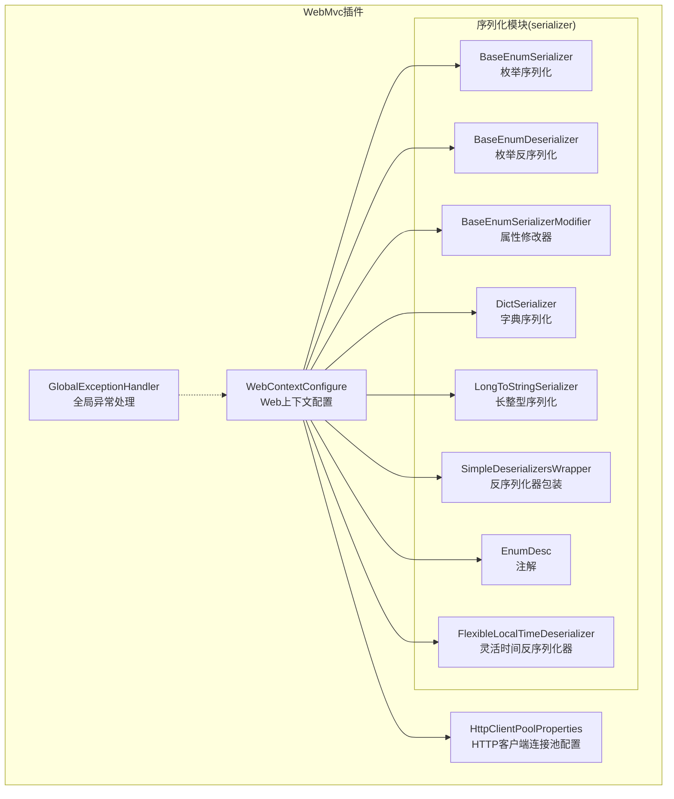
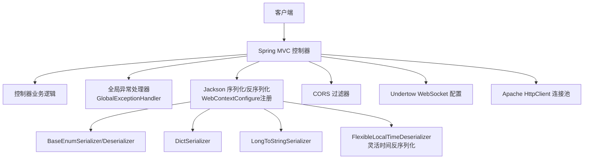
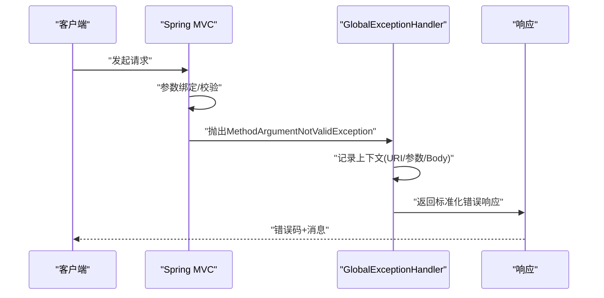
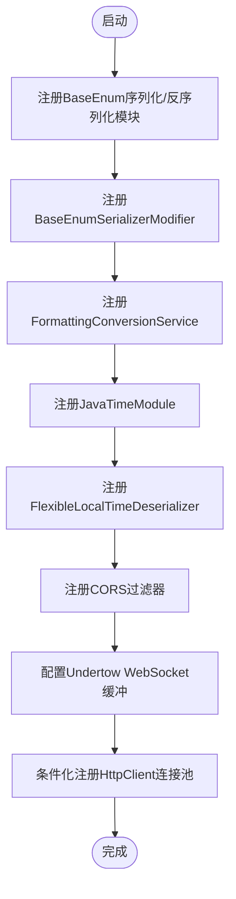
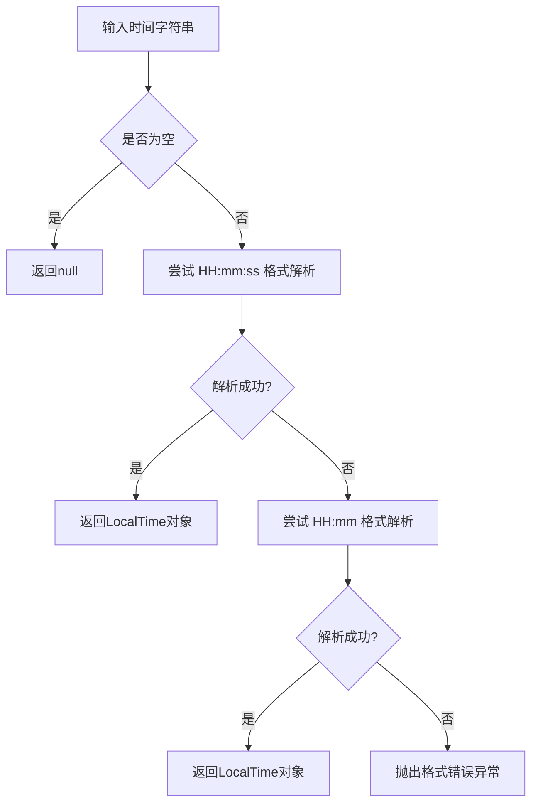
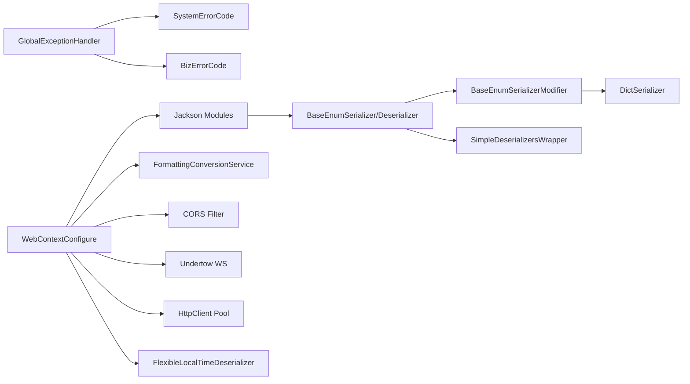

# WebMvc插件

<cite>
**本文引用的文件**
- [WebContextConfigure.java](file://src/main/java/com/jiuyu/governance/plugins/webmvc/WebContextConfigure.java)
- [GlobalExceptionHandler.java](file://src/main/java/com/jiuyu/governance/plugins/webmvc/GlobalExceptionHandler.java)
- [BaseEnumSerializer.java](file://src/main/java/com/jiuyu/governance/plugins/webmvc/serializer/BaseEnumSerializer.java)
- [BaseEnumDeserializer.java](file://src/main/java/com/jiuyu/governance/plugins/webmvc/serializer/BaseEnumDeserializer.java)
- [BaseEnumSerializerModifier.java](file://src/main/java/com/jiuyu/governance/plugins/webmvc/serializer/BaseEnumSerializerModifier.java)
- [DictSerializer.java](file://src/main/java/com/jiuyu/governance/plugins/webmvc/serializer/DictSerializer.java)
- [LongToStringSerializer.java](file://src/main/java/com/jiuyu/governance/plugins/webmvc/serializer/LongToStringSerializer.java)
- [SimpleDeserializersWrapper.java](file://src/main/java/com/jiuyu/governance/plugins/webmvc/serializer/SimpleDeserializersWrapper.java)
- [EnumDesc.java](file://src/main/java/com/jiuyu/governance/plugins/webmvc/serializer/EnumDesc.java)
- [HttpClientPoolProperties.java](file://src/main/java/com/jiuyu/governance/plugins/webmvc/HttpClientPoolProperties.java)
- [SystemErrorCode.java](file://src/main/java/com/jiuyu/governance/common/pojo/SystemErrorCode.java)
- [BizErrorCode.java](file://src/main/java/com/jiuyu/governance/common/pojo/BizErrorCode.java)
- [ERROR_CODE_DICT.md](file://ERROR_CODE_DICT.md)
</cite>

## 更新摘要
**所做更改**
- 新增 FlexibleLocalTimeDeserializer 组件，支持 HH:mm 和 HH:mm:ss 两种时间格式的灵活解析
- 增强时间序列化配置，提供更灵活的时间格式处理能力
- 更新时间格式模式使用 BasicConstant 常量，确保统一的时间格式规范

## 目录
1. [简介](#简介)
2. [项目结构](#项目结构)
3. [核心组件](#核心组件)
4. [架构总览](#架构总览)
5. [组件详解](#组件详解)
6. [依赖关系分析](#依赖关系分析)
7. [性能考量](#性能考量)
8. [故障排查指南](#故障排查指南)
9. [结论](#结论)
10. [附录](#附录)

## 简介
本文件面向WebMvc插件的技术文档，系统性阐述其在Spring Web MVC生态中的集成与实现机制，重点覆盖以下方面：
- 全局异常处理：统一错误输出、上下文采集、异常分类与响应封装
- Web上下文配置：Jackson模块注册、灵活时间格式处理、枚举与长整型序列化、格式化转换服务、CORS、Undertow WebSocket、Apache HttpClient连接池
- 数据序列化：BaseEnumSerializer与BaseEnumDeserializer的类型转换、DictSerializer的字典格式化、LongToStringSerializer的大数安全序列化、BaseEnumSerializerModifier的自动派生字段、SimpleDeserializersWrapper的接口反序列化增强、EnumDesc注解驱动的字段派生
- 配置选项与扩展点：HttpClient连接池参数、序列化开关、CORS策略、Undertow WebSocket缓冲配置
- 性能优化策略与最佳实践：连接池参数、序列化阈值、日志与上下文采集的权衡

## 项目结构
WebMvc插件位于plugins/webmvc目录，核心由三部分组成：
- 异常处理：GlobalExceptionHandler
- 上下文配置：WebContextConfigure
- 序列化器与注解：serializer包下的若干类与EnumDesc注解

**图表来源**
- [WebContextConfigure.java:1-289](file://src/main/java/com/jiuyu/governance/plugins/webmvc/WebContextConfigure.java#L1-L289)
- [GlobalExceptionHandler.java:1-377](file://src/main/java/com/jiuyu/governance/plugins/webmvc/GlobalExceptionHandler.java#L1-L377)
- [BaseEnumSerializer.java:1-26](file://src/main/java/com/jiuyu/governance/plugins/webmvc/serializer/BaseEnumSerializer.java#L1-L26)
- [BaseEnumDeserializer.java:1-113](file://src/main/java/com/jiuyu/governance/plugins/webmvc/serializer/BaseEnumDeserializer.java#L1-L113)
- [BaseEnumSerializerModifier.java:1-90](file://src/main/java/com/jiuyu/governance/plugins/webmvc/serializer/BaseEnumSerializerModifier.java#L1-L90)
- [DictSerializer.java:1-54](file://src/main/java/com/jiuyu/governance/plugins/webmvc/serializer/DictSerializer.java#L1-L54)
- [LongToStringSerializer.java:1-43](file://src/main/java/com/jiuyu/governance/plugins/webmvc/serializer/LongToStringSerializer.java#L1-L43)
- [SimpleDeserializersWrapper.java:1-68](file://src/main/java/com/jiuyu/governance/plugins/webmvc/serializer/SimpleDeserializersWrapper.java#L1-L68)
- [EnumDesc.java:1-34](file://src/main/java/com/jiuyu/governance/plugins/webmvc/serializer/EnumDesc.java#L1-L34)
- [HttpClientPoolProperties.java:1-47](file://src/main/java/com/jiuyu/governance/plugins/webmvc/HttpClientPoolProperties.java#L1-L47)

**章节来源**
- [WebContextConfigure.java:1-289](file://src/main/java/com/jiuyu/governance/plugins/webmvc/WebContextConfigure.java#L1-L289)
- [GlobalExceptionHandler.java:1-377](file://src/main/java/com/jiuyu/governance/plugins/webmvc/GlobalExceptionHandler.java#L1-L377)

## 核心组件
- 全局异常处理器：统一捕获各类异常，构造标准响应，记录上下文信息，确保对外一致的错误语义
- Web上下文配置：集中注册Jackson模块、格式化服务、CORS、WebSocket、HttpClient连接池，提供可配置的统一Web行为
- 枚举序列化体系：基于BaseEnum接口的序列化/反序列化、自动派生字典字段、接口级反序列化增强
- 字典序列化器：将枚举值映射为描述文本，支持注解驱动的字段命名
- 长整型序列化器：保障大数值在JavaScript安全整数范围外的安全输出
- HTTP客户端连接池：可配置的连接总数、路由并发、超时与回收策略
- **新增** 灵活时间反序列化器：支持 HH:mm 和 HH:mm:ss 两种时间格式的智能解析

**章节来源**
- [GlobalExceptionHandler.java:94-374](file://src/main/java/com/jiuyu/governance/plugins/webmvc/GlobalExceptionHandler.java#L94-L374)
- [WebContextConfigure.java:62-246](file://src/main/java/com/jiuyu/governance/plugins/webmvc/WebContextConfigure.java#L62-L246)
- [BaseEnumSerializer.java:17-25](file://src/main/java/com/jiuyu/governance/plugins/webmvc/serializer/BaseEnumSerializer.java#L17-L25)
- [DictSerializer.java:16-53](file://src/main/java/com/jiuyu/governance/plugins/webmvc/serializer/DictSerializer.java#L16-L53)
- [LongToStringSerializer.java:15-42](file://src/main/java/com/jiuyu/governance/plugins/webmvc/serializer/LongToStringSerializer.java#L15-L42)
- [SimpleDeserializersWrapper.java:30-67](file://src/main/java/com/jiuyu/governance/plugins/webmvc/serializer/SimpleDeserializersWrapper.java#L30-L67)
- [EnumDesc.java:14-33](file://src/main/java/com/jiuyu/governance/plugins/webmvc/serializer/EnumDesc.java#L14-L33)
- [HttpClientPoolProperties.java:17-46](file://src/main/java/com/jiuyu/governance/plugins/webmvc/HttpClientPoolProperties.java#L17-L46)

## 架构总览
WebMvc插件通过Spring Boot自动装配与条件化Bean注册，将全局异常处理与Web上下文配置无缝集成到应用中。序列化器模块作为Jackson扩展，贯穿请求/响应的序列化与反序列化过程。

**图表来源**
- [WebContextConfigure.java:62-246](file://src/main/java/com/jiuyu/governance/plugins/webmvc/WebContextConfigure.java#L62-L246)
- [GlobalExceptionHandler.java:54-374](file://src/main/java/com/jiuyu/governance/plugins/webmvc/GlobalExceptionHandler.java#L54-L374)

## 组件详解

### 全局异常处理器（GlobalExceptionHandler）
职责与特性
- 统一捕获业务异常、参数校验异常、HTTP方法不支持、SQL异常、签名异常、认证异常等
- 构造标准化响应体，使用系统/业务错误码
- 采集请求上下文（用户标识、URI、查询参数、JSON请求体），便于定位问题
- 对常见异常进行人性化提示与精确错误码映射

关键流程（以参数校验为例）

**图表来源**
- [GlobalExceptionHandler.java:287-291](file://src/main/java/com/jiuyu/governance/plugins/webmvc/GlobalExceptionHandler.java#L287-L291)

**章节来源**
- [GlobalExceptionHandler.java:58-91](file://src/main/java/com/jiuyu/governance/plugins/webmvc/GlobalExceptionHandler.java#L58-L91)
- [GlobalExceptionHandler.java:94-374](file://src/main/java/com/jiuyu/governance/plugins/webmvc/GlobalExceptionHandler.java#L94-L374)
- [SystemErrorCode.java:12-37](file://src/main/java/com/jiuyu/governance/common/pojo/SystemErrorCode.java#L12-L37)
- [BizErrorCode.java:38-54](file://src/main/java/com/jiuyu/governance/common/pojo/BizErrorCode.java#L38-L54)
- [ERROR_CODE_DICT.md:21-115](file://ERROR_CODE_DICT.md#L21-L115)

### Web上下文配置（WebContextConfigure）
职责与特性
- 注册JavaTimeModule，统一LocalDateTime/LocalDate/LocalTime的序列化/反序列化格式
- **更新** 新增FlexibleLocalTimeDeserializer，支持 HH:mm 和 HH:mm:ss 两种时间格式的灵活解析
- 注册BaseEnum序列化器与反序列化器，以及Long->String序列化器
- 提供BaseEnumSerializerModifier，自动为BaseEnum属性派生"描述"字段
- 配置FormattingConversionService，统一日期/时间格式化
- 配置CORS过滤器，支持跨域与凭证
- 配置Undertow WebSocket缓冲池
- 条件化启用Apache HttpClient连接池，提供可调参数

序列化模块注册流程

**图表来源**
- [WebContextConfigure.java:62-246](file://src/main/java/com/jiuyu/governance/plugins/webmvc/WebContextConfigure.java#L62-L246)

**章节来源**
- [WebContextConfigure.java:62-246](file://src/main/java/com/jiuyu/governance/plugins/webmvc/WebContextConfigure.java#L62-L246)

### 灵活时间反序列化器（FlexibleLocalTimeDeserializer）
**新增组件** 专为解决LocalTime反序列化格式灵活性而设计

职责与特性
- 支持 HH:mm:ss 标准格式优先解析
- 回退支持 HH:mm 精简格式解析
- 提供详细的错误信息，明确支持的格式范围
- 保持空值安全处理

解析流程

**图表来源**
- [WebContextConfigure.java:103-127](file://src/main/java/com/jiuyu/governance/plugins/webmvc/WebContextConfigure.java#L103-L127)

**章节来源**
- [WebContextConfigure.java:96-128](file://src/main/java/com/jiuyu/governance/plugins/webmvc/WebContextConfigure.java#L96-L128)

### 枚举序列化器（BaseEnumSerializer）
- 将实现了BaseEnum接口的枚举序列化为其"值"
- 与BaseEnumDeserializer配合，实现双向转换

**章节来源**
- [BaseEnumSerializer.java:17-25](file://src/main/java/com/jiuyu/governance/plugins/webmvc/serializer/BaseEnumSerializer.java#L17-L25)

### 枚举反序列化器（BaseEnumDeserializer）
- 支持从"值/描述/名称"反序列化为BaseEnum
- 通过反射定位字段类型，判断是否为BaseEnum枚举
- 增强对Integer类型值的字符串化比较

**章节来源**
- [BaseEnumDeserializer.java:35-111](file://src/main/java/com/jiuyu/governance/plugins/webmvc/serializer/BaseEnumDeserializer.java#L35-L111)

### 枚举序列化修饰器（BaseEnumSerializerModifier）
- 遍历Bean属性，若属性类型为BaseEnum，则为该属性派生一个"描述"字段
- 若属性标注EnumDesc注解，则按注解指定的枚举类与字段后缀派生描述字段
- 通过DictSerializer将值映射为描述文本

**章节来源**
- [BaseEnumSerializerModifier.java:46-87](file://src/main/java/com/jiuyu/governance/plugins/webmvc/serializer/BaseEnumSerializerModifier.java#L46-L87)

### 字典序列化器（DictSerializer）
- 当输入为BaseEnum时，输出其描述
- 当输入为枚举值（如数字/字符串）时，通过枚举类常量匹配描述
- 支持空值安全处理

**章节来源**
- [DictSerializer.java:33-52](file://src/main/java/com/jiuyu/governance/plugins/webmvc/serializer/DictSerializer.java#L33-L52)

### 长整型序列化器（LongToStringSerializer）
- 当数值在JavaScript安全整数范围内，直接输出数字
- 当数值超出范围，输出字符串，避免精度丢失

**章节来源**
- [LongToStringSerializer.java:26-40](file://src/main/java/com/jiuyu/governance/plugins/webmvc/serializer/LongToStringSerializer.java#L26-L40)

### 反序列化器包装（SimpleDeserializersWrapper）
- 在默认枚举反序列化器查找失败时，尝试通过枚举实现的接口（BaseEnum）查找反序列化器
- 增强对接口级反序列化的支持

**章节来源**
- [SimpleDeserializersWrapper.java:45-66](file://src/main/java/com/jiuyu/governance/plugins/webmvc/serializer/SimpleDeserializersWrapper.java#L45-L66)

### 注解（EnumDesc）
- 作用于字段，声明该字段应派生的描述字段及其枚举类
- 可自定义描述字段的后缀，默认"Desc"

**章节来源**
- [EnumDesc.java:14-33](file://src/main/java/com/jiuyu/governance/plugins/webmvc/serializer/EnumDesc.java#L14-L33)

### HTTP客户端连接池（HttpClientPoolProperties）
- 支持启用/禁用、最大连接数、每路由并发、连接/套接字/请求超时、TTL、空闲回收、重试策略等
- 通过条件化Bean在开启时注入

**章节来源**
- [HttpClientPoolProperties.java:17-46](file://src/main/java/com/jiuyu/governance/plugins/webmvc/HttpClientPoolProperties.java#L17-L46)

## 依赖关系分析
- GlobalExceptionHandler依赖系统/业务错误码与请求上下文工具，统一输出
- WebContextConfigure依赖Jackson模块、Spring格式化服务、Undertow、Apache HttpClient
- 序列化器模块之间存在协作：BaseEnumSerializerModifier依赖DictSerializer与EnumDesc；BaseEnumDeserializer依赖SimpleDeserializersWrapper提升接口反序列化能力
- **新增** FlexibleLocalTimeDeserializer作为JavaTimeModule的组成部分，增强时间格式处理能力

**图表来源**
- [WebContextConfigure.java:62-246](file://src/main/java/com/jiuyu/governance/plugins/webmvc/WebContextConfigure.java#L62-L246)
- [GlobalExceptionHandler.java:94-374](file://src/main/java/com/jiuyu/governance/plugins/webmvc/GlobalExceptionHandler.java#L94-L374)

**章节来源**
- [WebContextConfigure.java:62-246](file://src/main/java/com/jiuyu/governance/plugins/webmvc/WebContextConfigure.java#L62-L246)
- [GlobalExceptionHandler.java:94-374](file://src/main/java/com/jiuyu/governance/plugins/webmvc/GlobalExceptionHandler.java#L94-L374)

## 性能考量
- 连接池参数
  - 合理设置maxTotal与defaultMaxPerRoute，避免过度连接导致资源争用
  - socketTimeout与connectTimeout需结合网络环境与下游SLA权衡
  - timeToLive与maxIdleTime影响连接复用与内存占用
- 序列化优化
  - BaseEnumSerializerModifier会为每个BaseEnum属性派生描述字段，注意DTO数量与层级，避免过度膨胀
  - DictSerializer在未命中枚举常量时无输出，保持空安全
  - LongToStringSerializer在大数场景输出字符串，避免精度损失但增加体积
  - **新增** FlexibleLocalTimeDeserializer采用双重解析策略，HH:mm:ss优先解析，回退HH:mm解析，确保兼容性同时保持解析效率
- 日志与上下文采集
  - getContext在JSON请求体过大时读取请求体，可能带来IO开销，建议在生产环境谨慎开启

**章节来源**
- [WebContextConfigure.java:172-215](file://src/main/java/com/jiuyu/governance/plugins/webmvc/WebContextConfigure.java#L172-L215)
- [GlobalExceptionHandler.java:58-91](file://src/main/java/com/jiuyu/governance/plugins/webmvc/GlobalExceptionHandler.java#L58-L91)
- [LongToStringSerializer.java:26-40](file://src/main/java/com/jiuyu/governance/plugins/webmvc/serializer/LongToStringSerializer.java#L26-L40)

## 故障排查指南
- 参数校验失败
  - 现象：返回参数无效错误
  - 排查：查看MethodArgumentNotValidException与BindException分支，核对字段名与类型
- JSON解析错误
  - 现象：返回JSON格式非法
  - 排查：关注HttpMessageNotReadableException分支，检查Content-Type与请求体
- **新增** 时间格式解析错误
  - 现象：LocalTime字段解析失败
  - 排查：确认时间格式是否符合 HH:mm:ss 或 HH:mm 标准，检查FlexibleLocalTimeDeserializer配置
- SQL相关异常
  - 现象：返回系统错误提示
  - 排查：区分PersistenceException、MyBatisSystemException、SQLException与DataIntegrityViolationException
- 未授权/认证过期
  - 现象：返回未授权访问
  - 排查：确认鉴权上下文与AccessUser属性是否存在
- CORS跨域问题
  - 现象：浏览器报跨域错误
  - 排查：确认CORS配置与预检缓存设置
- WebSocket连接异常
  - 现象：WS握手失败或缓冲不足
  - 排查：检查Undertow WebSocketDeploymentInfo缓冲配置

**章节来源**
- [GlobalExceptionHandler.java:131-334](file://src/main/java/com/jiuyu/governance/plugins/webmvc/GlobalExceptionHandler.java#L131-L334)
- [WebContextConfigure.java:226-246](file://src/main/java/com/jiuyu/governance/plugins/webmvc/WebContextConfigure.java#L226-L246)
- [WebContextConfigure.java:148-161](file://src/main/java/com/jiuyu/governance/plugins/webmvc/WebContextConfigure.java#L148-L161)

## 结论
WebMvc插件通过全局异常处理与Web上下文配置，提供了统一的错误语义与Web行为；通过完善的枚举序列化体系，实现了类型安全与可读性兼顾的序列化输出。**新增的FlexibleLocalTimeDeserializer进一步增强了时间格式处理的灵活性，支持多种时间格式的智能解析**。结合可配置的连接池与格式化服务，插件在保证一致性的同时兼顾性能与可扩展性。

## 附录

### 配置项与扩展点
- 序列化开关
  - jiuyu.web.rest.serializer=true（默认启用）
- HTTP客户端连接池
  - jiuyu.http.client.enabled=true
  - jiuyu.http.client.maxTotal、defaultMaxPerRoute、connectTimeout、socketTimeout、connectionRequestTimeout、timeToLive、maxIdleTime、validateAfterInactivity
- CORS
  - 允许任意源、方法、头部，允许凭证，预检缓存1小时
- Undertow WebSocket
  - 缓冲池大小可调
- **新增** 时间格式配置
  - 使用BasicConstant.NORM_TIME_PATTERN统一时间格式模式
  - 支持 HH:mm 和 HH:mm:ss 两种LocalTime解析格式

**章节来源**
- [WebContextConfigure.java:70-87](file://src/main/java/com/jiuyu/governance/plugins/webmvc/WebContextConfigure.java#L70-L87)
- [WebContextConfigure.java:172-215](file://src/main/java/com/jiuyu/governance/plugins/webmvc/WebContextConfigure.java#L172-L215)
- [WebContextConfigure.java:226-246](file://src/main/java/com/jiuyu/governance/plugins/webmvc/WebContextConfigure.java#L226-L246)
- [WebContextConfigure.java:148-161](file://src/main/java/com/jiuyu/governance/plugins/webmvc/WebContextConfigure.java#L148-L161)
- [HttpClientPoolProperties.java:22-46](file://src/main/java/com/jiuyu/governance/plugins/webmvc/HttpClientPoolProperties.java#L22-L46)

### 时间格式支持详情
**新增功能** FlexibleLocalTimeDeserializer提供以下格式支持：

| 格式 | 描述 | 示例 |
|------|------|------|
| HH:mm:ss | 标准时间格式 | 14:30:45 |
| HH:mm | 精简时间格式 | 14:30 |

解析优先级：
1. 首选 HH:mm:ss 格式解析
2. 失败时回退到 HH:mm 格式解析
3. 解析失败时抛出详细错误信息

**章节来源**
- [WebContextConfigure.java:88-92](file://src/main/java/com/jiuyu/governance/plugins/webmvc/WebContextConfigure.java#L88-L92)
- [WebContextConfigure.java:103-127](file://src/main/java/com/jiuyu/governance/plugins/webmvc/WebContextConfigure.java#L103-L127)