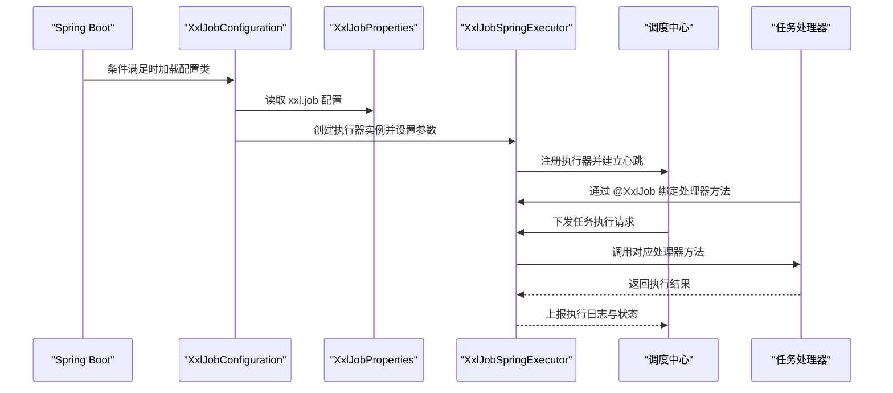
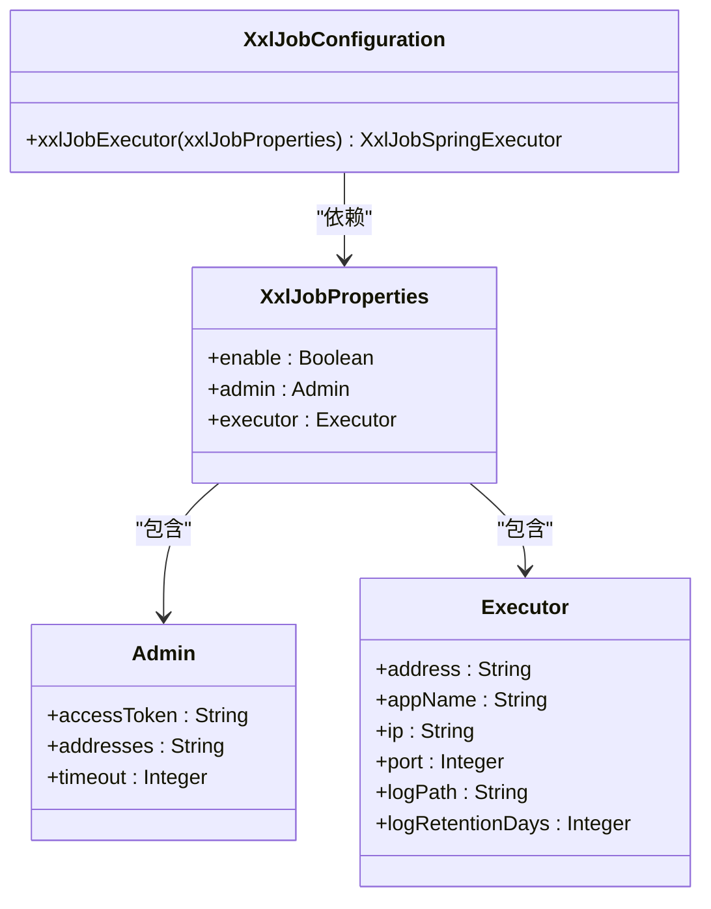
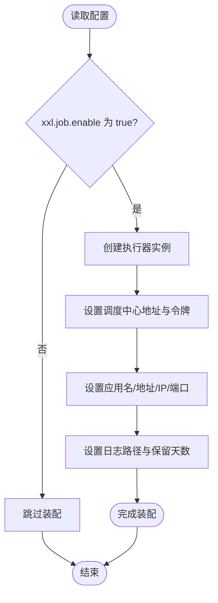
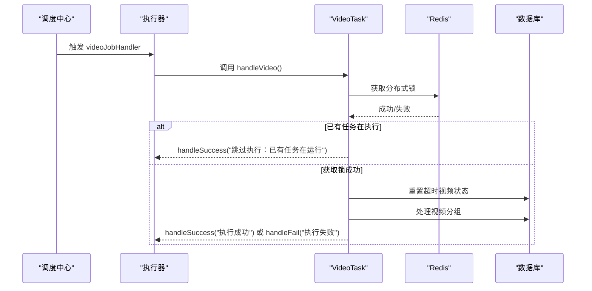
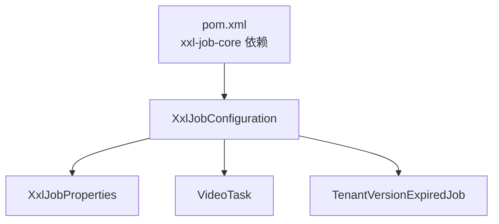

# XXL-Job插件

<cite>
**本文档引用的文件**
- [XxlJobConfiguration.java](file://src/main/java/com/jiuyu/governance/plugins/xxljob/XxlJobConfiguration.java)
- [XxlJobProperties.java](file://src/main/java/com/jiuyu/governance/plugins/xxljob/XxlJobProperties.java)
- [application.yml](file://src/main/resources/application.yml)
- [VideoTask.java](file://src/main/java/com/jiuyu/governance/business/performance/task/VideoTask.java)
- [TenantVersionExpiredJob.java](file://src/main/java/com/jiuyu/governance/business/rbac/task/TenantVersionExpiredJob.java)
- [pom.xml](file://pom.xml)
</cite>

## 目录
1. [简介](#简介)
2. [项目结构](#项目结构)
3. [核心组件](#核心组件)
4. [架构总览](#架构总览)
5. [详细组件分析](#详细组件分析)
6. [依赖关系分析](#依赖关系分析)
7. [性能考虑](#性能考虑)
8. [故障排查指南](#故障排查指南)
9. [结论](#结论)
10. [附录](#附录)

## 简介
本文件为 XXL-Job 插件的专业技术文档，面向任务调度架构与实现原理的深度解析。文档围绕以下目标展开：
- 详细解释 XXL-Job 插件的任务调度架构与实现机制
- 深入说明配置类 XxlJobConfiguration 的参数设置与装配流程
- 详解 XxlJobProperties 属性配置项及其作用域
- 阐述插件如何实现分布式任务调度（任务注册、执行器管理、调度策略、监控告警等）
- 提供部署配置、性能调优、故障处理与扩展接口的完整指南
- 结合实际任务处理器示例，给出任务开发、调度配置与运维管理的最佳实践

## 项目结构
XXL-Job 插件位于治理服务的插件模块中，采用 Spring Boot 自动装配的方式集成 XXL-Job 执行器，并通过 YAML 配置文件集中管理调度中心与执行器参数。项目中还包含多个基于注解的任务处理器示例，展示如何在调度中心创建任务并绑定到具体处理器方法。

```mermaid
graph TB
subgraph "插件模块"
cfg["XxlJobConfiguration<br/>执行器装配"]
props["XxlJobProperties<br/>配置属性"]
end
subgraph "配置文件"
yml["application.yml<br/>xxl.job 配置"]
end
subgraph "任务处理器示例"
vt["VideoTask<br/>@XxlJob(\"videoJobHandler\")"]
tvej["TenantVersionExpiredJob<br/>@XxlJob(\"tenantVersionExpired\")"]
end
cfg --> props
yml --> cfg
yml --> props
cfg --> vt
cfg --> tvej
```

**图表来源**
- [XxlJobConfiguration.java:18-76](file://src/main/java/com/jiuyu/governance/plugins/xxljob/XxlJobConfiguration.java#L18-L76)
- [XxlJobProperties.java:15-91](file://src/main/java/com/jiuyu/governance/plugins/xxljob/XxlJobProperties.java#L15-L91)
- [application.yml:124-147](file://src/main/resources/application.yml#L124-L147)
- [VideoTask.java:52](file://src/main/java/com/jiuyu/governance/business/performance/task/VideoTask.java#L52)
- [TenantVersionExpiredJob.java:48](file://src/main/java/com/jiuyu/governance/business/rbac/task/TenantVersionExpiredJob.java#L48)

**章节来源**
- [XxlJobConfiguration.java:18-76](file://src/main/java/com/jiuyu/governance/plugins/xxljob/XxlJobConfiguration.java#L18-L76)
- [XxlJobProperties.java:15-91](file://src/main/java/com/jiuyu/governance/plugins/xxljob/XxlJobProperties.java#L15-L91)
- [application.yml:124-147](file://src/main/resources/application.yml#L124-L147)

## 核心组件
本节聚焦于插件的核心组件：配置类与属性类，以及它们如何驱动 XXL-Job 执行器的初始化与运行。

- XxlJobConfiguration：负责在满足条件时创建并装配 XXL-Job 执行器 Bean，将配置属性映射到执行器实例的关键参数。
- XxlJobProperties：定义 xxl.job 命名空间下的配置项，包括是否启用、调度中心地址与令牌、执行器的应用名、地址、IP、端口、日志路径与保留天数等。
- application.yml：集中声明 xxl.job 的启用开关与各子配置项，支持环境变量覆盖，便于多环境部署。

这些组件共同构成 XXL-Job 插件的配置与装配层，确保执行器能够正确连接调度中心并参与分布式任务调度。

**章节来源**
- [XxlJobConfiguration.java:18-76](file://src/main/java/com/jiuyu/governance/plugins/xxljob/XxlJobConfiguration.java#L18-L76)
- [XxlJobProperties.java:15-91](file://src/main/java/com/jiuyu/governance/plugins/xxljob/XxlJobProperties.java#L15-L91)
- [application.yml:124-147](file://src/main/resources/application.yml#L124-L147)

## 架构总览
下图展示了 XXL-Job 插件在系统中的位置与交互关系：配置类与属性类负责装配执行器；执行器通过调度中心地址与令牌与调度中心通信；任务处理器通过注解注册到执行器，接收调度中心的触发并执行业务逻辑。



**图表来源**
- [XxlJobConfiguration.java:30-75](file://src/main/java/com/jiuyu/governance/plugins/xxljob/XxlJobConfiguration.java#L30-L75)
- [XxlJobProperties.java:15-91](file://src/main/java/com/jiuyu/governance/plugins/xxljob/XxlJobProperties.java#L15-L91)
- [VideoTask.java:52](file://src/main/java/com/jiuyu/governance/business/performance/task/VideoTask.java#L52)
- [TenantVersionExpiredJob.java:48](file://src/main/java/com/jiuyu/governance/business/rbac/task/TenantVersionExpiredJob.java#L48)

## 详细组件分析

### 配置类 XxlJobConfiguration
- 功能定位：在满足启用条件时创建并装配 XXL-Job 执行器 Bean，完成调度中心地址、访问令牌、应用名、执行器地址/IP/端口、日志路径与保留天数等关键参数的设置。
- 关键点：
  - 使用条件注解仅在 xxl.job.enable 为 true 时生效，避免不必要的 Bean 创建。
  - 对可选参数（如 address、ip、port、logPath、logRetentionDays）进行判空或非空判断后设置，增强健壮性。
  - 通过日志输出关键配置项，便于启动阶段核对参数。



**图表来源**
- [XxlJobConfiguration.java:18-76](file://src/main/java/com/jiuyu/governance/plugins/xxljob/XxlJobConfiguration.java#L18-L76)
- [XxlJobProperties.java:15-91](file://src/main/java/com/jiuyu/governance/plugins/xxljob/XxlJobProperties.java#L15-L91)

**章节来源**
- [XxlJobConfiguration.java:18-76](file://src/main/java/com/jiuyu/governance/plugins/xxljob/XxlJobConfiguration.java#L18-L76)

### 属性类 XxlJobProperties
- 功能定位：承载 xxl.job 命名空间下的全部配置项，支持 Spring Boot 配置属性绑定与环境变量覆盖。
- 关键配置项说明：
  - enable：是否启用 XXL-Job 插件（默认 false）
  - admin.addresses：调度中心部署地址（支持多个逗号分隔）
  - admin.access-token：调度中心通信令牌
  - admin.timeout：请求超时时间（秒）
  - executor.app-name：执行器应用名
  - executor.address：执行器注册地址（留空则自动获取）
  - executor.ip：执行器 IP（留空则自动获取）
  - executor.port：执行器端口（默认 9999）
  - executor.log-path：执行器日志存储路径
  - executor.log-retention-days：执行器日志保留天数（默认 30）



**图表来源**
- [XxlJobConfiguration.java:30-75](file://src/main/java/com/jiuyu/governance/plugins/xxljob/XxlJobConfiguration.java#L30-L75)
- [XxlJobProperties.java:15-91](file://src/main/java/com/jiuyu/governance/plugins/xxljob/XxlJobProperties.java#L15-L91)

**章节来源**
- [XxlJobProperties.java:15-91](file://src/main/java/com/jiuyu/governance/plugins/xxljob/XxlJobProperties.java#L15-L91)

### 任务处理器示例
- VideoTask：演示了基于注解的任务处理器，包含参数获取、分布式锁、异常处理与执行结果上报等典型流程。
- TenantVersionExpiredJob：演示了批量处理与外部服务调用的场景，展示如何在任务中进行分批消费与状态更新。



**图表来源**
- [VideoTask.java:52-98](file://src/main/java/com/jiuyu/governance/business/performance/task/VideoTask.java#L52-L98)

**章节来源**
- [VideoTask.java:52-239](file://src/main/java/com/jiuyu/governance/business/performance/task/VideoTask.java#L52-L239)
- [TenantVersionExpiredJob.java:48-96](file://src/main/java/com/jiuyu/governance/business/rbac/task/TenantVersionExpiredJob.java#L48-L96)

## 依赖关系分析
- 依赖声明：项目在 pom.xml 中引入了 XXL-Job 核心依赖，确保执行器与调度中心通信能力。
- 组件耦合：配置类与属性类之间为松耦合设计，通过 Spring Boot 配置属性绑定实现参数传递；任务处理器与执行器通过注解绑定，进一步降低耦合度。
- 外部依赖：任务处理器示例中使用了 Redis 作为分布式锁，体现了插件在分布式场景下的协同能力。



**图表来源**
- [pom.xml:144-149](file://pom.xml#L144-L149)
- [XxlJobConfiguration.java:18-76](file://src/main/java/com/jiuyu/governance/plugins/xxljob/XxlJobConfiguration.java#L18-L76)
- [XxlJobProperties.java:15-91](file://src/main/java/com/jiuyu/governance/plugins/xxljob/XxlJobProperties.java#L15-L91)
- [VideoTask.java:52](file://src/main/java/com/jiuyu/governance/business/performance/task/VideoTask.java#L52)
- [TenantVersionExpiredJob.java:48](file://src/main/java/com/jiuyu/governance/business/rbac/task/TenantVersionExpiredJob.java#L48)

**章节来源**
- [pom.xml:144-149](file://pom.xml#L144-L149)

## 性能考虑
- 执行器参数优化
  - 端口与日志：合理设置 executor.port 与 executor.log-path，确保执行器监听端口可用且日志目录具备充足磁盘空间。
  - 日志保留：executor.log-retention-days 控制日志清理周期，建议结合磁盘容量与审计需求调整。
- 任务执行优化
  - 分布式锁：任务处理器应使用可靠的分布式锁（如 Redis）避免并发重复执行，提升任务幂等性。
  - 批处理：对于大批量数据处理，采用分批消费与事务内/外分离策略，减少锁持有时间与数据库压力。
- 调度中心通信
  - admin.addresses 与 admin.timeout：根据网络状况与调度中心部署情况调整，确保心跳与任务下发稳定可靠。

[本节为通用性能指导，无需特定文件来源]

## 故障排查指南
- 启动阶段
  - 检查 xxl.job.enable 是否为 true，确认配置类被加载。
  - 查看执行器关键参数日志输出，核对 admin.addresses、executor.app-name、executor.port 等是否符合预期。
- 任务执行阶段
  - 使用 XxlJobHelper 记录日志与执行结果，便于定位异常与统计执行状态。
  - 对于分布式锁导致的跳过执行，检查锁的获取与释放逻辑，确保异常情况下也能安全释放。
- 通信与鉴权
  - 确认 admin.access-token 与调度中心令牌一致，避免鉴权失败导致任务无法下发。
  - 若网络不稳定，适当增大 admin.timeout 并检查调度中心可达性。

**章节来源**
- [XxlJobConfiguration.java:30-75](file://src/main/java/com/jiuyu/governance/plugins/xxljob/XxlJobConfiguration.java#L30-L75)
- [VideoTask.java:52-98](file://src/main/java/com/jiuyu/governance/business/performance/task/VideoTask.java#L52-L98)

## 结论
XXL-Job 插件通过简洁的配置类与属性类实现了对执行器的自动化装配，配合任务处理器注解与分布式锁等机制，提供了可靠的分布式任务调度能力。结合合理的参数配置与性能优化策略，可在生产环境中稳定支撑各类定时与周期性任务。

[本节为总结性内容，无需特定文件来源]

## 附录

### 配置项对照表
- xxl.job.enable：是否启用插件（布尔）
- xxl.job.admin.addresses：调度中心地址（字符串，支持多个逗号分隔）
- xxl.job.admin.access-token：调度中心通信令牌（字符串）
- xxl.job.admin.timeout：请求超时时间（秒）
- xxl.job.executor.app-name：执行器应用名（字符串）
- xxl.job.executor.address：执行器注册地址（字符串，留空自动获取）
- xxl.job.executor.ip：执行器 IP（字符串，留空自动获取）
- xxl.job.executor.port：执行器端口（整数，默认 9999）
- xxl.job.executor.log-path：执行器日志存储路径（字符串）
- xxl.job.executor.log-retention-days：执行器日志保留天数（整数，默认 30）

**章节来源**
- [application.yml:124-147](file://src/main/resources/application.yml#L124-L147)
- [XxlJobProperties.java:15-91](file://src/main/java/com/jiuyu/governance/plugins/xxljob/XxlJobProperties.java#L15-L91)

### 任务开发与调度配置清单
- 在任务处理器类上添加 @Component 与 @XxlJob 注解，确保被 Spring 扫描与执行器识别。
- 在调度中心创建任务时，JobHandler 填写与注解一致的方法标识符。
- 在任务处理器中使用 XxlJobHelper 获取参数、记录日志与上报执行结果。
- 对于需要避免并发执行的任务，使用分布式锁保障幂等性。

**章节来源**
- [VideoTask.java:52-98](file://src/main/java/com/jiuyu/governance/business/performance/task/VideoTask.java#L52-L98)
- [TenantVersionExpiredJob.java:48-96](file://src/main/java/com/jiuyu/governance/business/rbac/task/TenantVersionExpiredJob.java#L48-L96)