# 插件化架构设计

<cite>
**本文引用的文件**
- [ServerApplication.java](file://src/main/java/com/jiuyu/governance/ServerApplication.java)
- [ExcelTemplate.java](file://src/main/java/com/jiuyu/governance/plugins/excel/ExcelTemplate.java)
- [ExcelReadListener.java](file://src/main/java/com/jiuyu/governance/plugins/excel/ExcelReadListener.java)
- [RowRead.java](file://src/main/java/com/jiuyu/governance/plugins/excel/RowRead.java)
- [AutoColumnWidthStrategy.java](file://src/main/java/com/jiuyu/governance/plugins/excel/AutoColumnWidthStrategy.java)
- [FuPanSignInterceptor.java](file://src/main/java/com/jiuyu/governance/plugins/http/FuPanSignInterceptor.java)
- [LightweightLoadBalancerInterceptor.java](file://src/main/java/com/jiuyu/governance/plugins/http/LightweightLoadBalancerInterceptor.java)
- [ServiceInstance.java](file://src/main/java/com/jiuyu/governance/plugins/http/ServiceInstance.java)
- [RestAuthenticationTokenProvide.java](file://src/main/java/com/jiuyu/governance/plugins/oauth/client/RestAuthenticationTokenProvide.java)
- [DbTokenStorage.java](file://src/main/java/com/jiuyu/governance/plugins/oauth/server/DbTokenStorage.java)
- [ReplaySignatureCalculate.java](file://src/main/java/com/jiuyu/governance/plugins/sign/ReplaySignatureCalculate.java)
- [SmsConfiguration.java](file://src/main/java/com/jiuyu/governance/plugins/sms/SmsConfiguration.java)
- [OssAutoConfiguration.java](file://src/main/java/com/jiuyu/governance/plugins/oss/config/OssAutoConfiguration.java)
- [GlobalExceptionHandler.java](file://src/main/java/com/jiuyu/governance/plugins/webmvc/GlobalExceptionHandler.java)
- [XxlJobConfiguration.java](file://src/main/java/com/jiuyu/governance/plugins/xxljob/XxlJobConfiguration.java)
</cite>

## 目录
1. [引言](#引言)
2. [项目结构](#项目结构)
3. [核心组件](#核心组件)
4. [架构总览](#架构总览)
5. [详细组件分析](#详细组件分析)
6. [依赖分析](#依赖分析)
7. [性能考虑](#性能考虑)
8. [故障排查指南](#故障排查指南)
9. [结论](#结论)
10. [附录](#附录)

## 引言
本设计文档围绕 fupan-governance-server 的插件化架构展开，系统性阐述插件接口定义、插件注册机制、插件生命周期管理，并深入解析各插件模块的设计思路与实现要点，包括：
- Excel 处理插件的模板引擎设计
- HTTP 客户端插件的负载均衡策略
- OAuth 认证插件的权限验证机制
- 签名验证插件的安全防护设计
- 短信服务插件的验证码管理
- OSS 存储插件的对象存储集成
- WebMvc 插件的全局异常处理
- XXL-Job 插件的任务调度实现

通过插件化架构，系统实现了功能模块的解耦与可扩展性，便于按需启用、替换与演进。

## 项目结构
项目采用基于功能域的分层组织，核心入口位于 Spring Boot 启动类，插件模块集中于 plugins 目录下，按功能域划分子包，如 excel、http、oauth、oss、sign、sms、webmvc、xxljob 等。每个插件模块封装独立的能力边界，通过 Spring 配置或条件装配实现自动注册与启用。

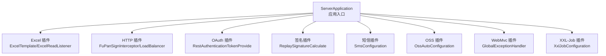

图表来源
- [ServerApplication.java:12-18](file://src/main/java/com/jiuyu/governance/ServerApplication.java#L12-L18)
- [ExcelTemplate.java:34](file://src/main/java/com/jiuyu/governance/plugins/excel/ExcelTemplate.java#L34)
- [FuPanSignInterceptor.java:33](file://src/main/java/com/jiuyu/governance/plugins/http/FuPanSignInterceptor.java#L33)
- [LightweightLoadBalancerInterceptor.java:31](file://src/main/java/com/jiuyu/governance/plugins/http/LightweightLoadBalancerInterceptor.java#L31)
- [RestAuthenticationTokenProvide.java:31](file://src/main/java/com/jiuyu/governance/plugins/oauth/client/RestAuthenticationTokenProvide.java#L31)
- [ReplaySignatureCalculate.java:30](file://src/main/java/com/jiuyu/governance/plugins/sign/ReplaySignatureCalculate.java#L30)
- [SmsConfiguration.java:21](file://src/main/java/com/jiuyu/governance/plugins/sms/SmsConfiguration.java#L21)
- [OssAutoConfiguration.java:20](file://src/main/java/com/jiuyu/governance/plugins/oss/config/OssAutoConfiguration.java#L20)
- [GlobalExceptionHandler.java:54](file://src/main/java/com/jiuyu/governance/plugins/webmvc/GlobalExceptionHandler.java#L54)
- [XxlJobConfiguration.java:18](file://src/main/java/com/jiuyu/governance/plugins/xxljob/XxlJobConfiguration.java#L18)

章节来源
- [ServerApplication.java:12-18](file://src/main/java/com/jiuyu/governance/ServerApplication.java#L12-L18)

## 核心组件
本节概述各插件模块的核心职责与关键接口/类：
- Excel 插件：提供模板写入、批量读取、样式与列宽策略等能力
- HTTP 插件：提供签名拦截器与轻量级负载均衡拦截器
- OAuth 插件：提供基于远程调用的认证令牌提供与数据库 Token 存储接口
- 签名插件：提供统一的签名生成与验证逻辑
- 短信插件：提供短信服务 Bean 的条件装配与验证码提供者
- OSS 插件：提供对象存储客户端与模板的自动配置
- WebMvc 插件：提供全局异常处理与统一响应封装
- XXL-Job 插件：提供任务调度执行器的条件装配

章节来源
- [ExcelTemplate.java:34](file://src/main/java/com/jiuyu/governance/plugins/excel/ExcelTemplate.java#L34)
- [ExcelReadListener.java:16](file://src/main/java/com/jiuyu/governance/plugins/excel/ExcelReadListener.java#L16)
- [RowRead.java:11](file://src/main/java/com/jiuyu/governance/plugins/excel/RowRead.java#L11)
- [FuPanSignInterceptor.java:33](file://src/main/java/com/jiuyu/governance/plugins/http/FuPanSignInterceptor.java#L33)
- [LightweightLoadBalancerInterceptor.java:31](file://src/main/java/com/jiuyu/governance/plugins/http/LightweightLoadBalancerInterceptor.java#L31)
- [ServiceInstance.java:1](file://src/main/java/com/jiuyu/governance/plugins/http/ServiceInstance.java#L1)
- [RestAuthenticationTokenProvide.java:31](file://src/main/java/com/jiuyu/governance/plugins/oauth/client/RestAuthenticationTokenProvide.java#L31)
- [DbTokenStorage.java:14](file://src/main/java/com/jiuyu/governance/plugins/oauth/server/DbTokenStorage.java#L14)
- [ReplaySignatureCalculate.java:30](file://src/main/java/com/jiuyu/governance/plugins/sign/ReplaySignatureCalculate.java#L30)
- [SmsConfiguration.java:21](file://src/main/java/com/jiuyu/governance/plugins/sms/SmsConfiguration.java#L21)
- [OssAutoConfiguration.java:20](file://src/main/java/com/jiuyu/governance/plugins/oss/config/OssAutoConfiguration.java#L20)
- [GlobalExceptionHandler.java:54](file://src/main/java/com/jiuyu/governance/plugins/webmvc/GlobalExceptionHandler.java#L54)
- [XxlJobConfiguration.java:18](file://src/main/java/com/jiuyu/governance/plugins/xxljob/XxlJobConfiguration.java#L18)

## 架构总览
插件化架构以 Spring Boot 自动装配为核心，结合条件注解与配置类实现按需启用；各插件通过独立的配置类暴露 Bean，供业务模块按需注入与使用。整体控制流如下：

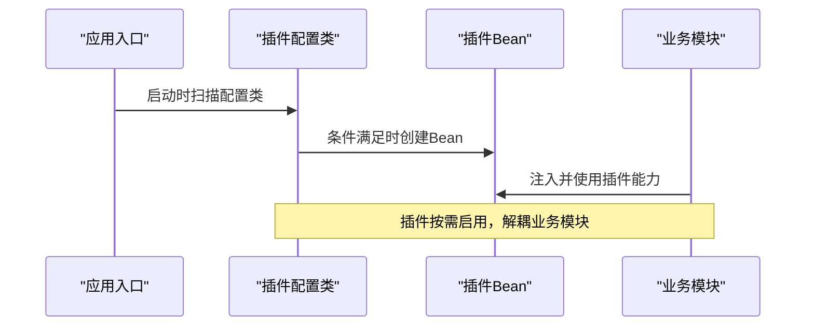

图表来源
- [ServerApplication.java:12-18](file://src/main/java/com/jiuyu/governance/ServerApplication.java#L12-L18)
- [SmsConfiguration.java:21](file://src/main/java/com/jiuyu/governance/plugins/sms/SmsConfiguration.java#L21)
- [OssAutoConfiguration.java:20](file://src/main/java/com/jiuyu/governance/plugins/oss/config/OssAutoConfiguration.java#L20)
- [XxlJobConfiguration.java:18](file://src/main/java/com/jiuyu/governance/plugins/xxljob/XxlJobConfiguration.java#L18)

## 详细组件分析

### Excel 处理插件
- 模板引擎设计
  - 写入器构建：支持密码保护、排除列、模板路径、自定义构建器回调等
  - 样式与列宽：内置自动列宽策略与水平样式策略，提升导出体验
  - 批量读取：监听器按批次收集数据并在完成后统一落库
- 接口与职责
  - ExcelTemplate：导出/导入主入口，封装 Writer/Reader 生命周期
  - ExcelReadListener：读取监听器，按批保存并完成收尾
  - RowRead：读取回调接口，抽象保存与完成钩子
- 复杂度与性能
  - 写入：O(n) 线性写入，批量写入降低内存峰值
  - 读取：监听器按批处理，避免一次性加载全部数据
- 错误处理
  - 导出异常统一包装为运行时异常，便于上层捕获与提示

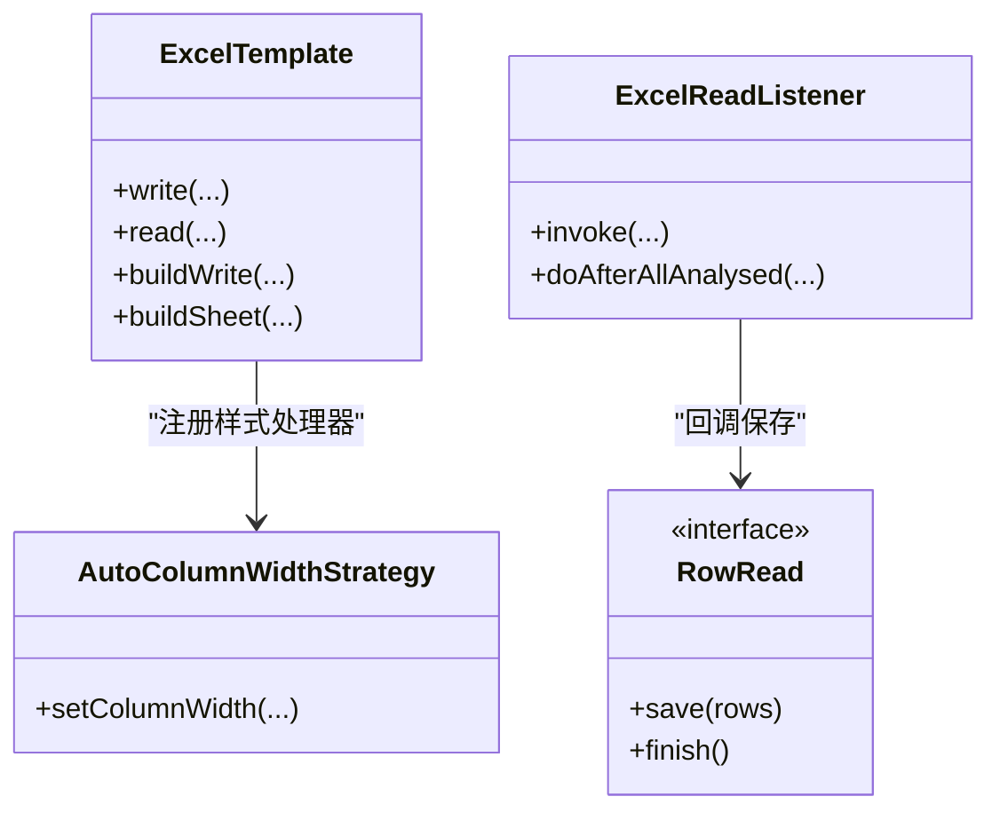

图表来源
- [ExcelTemplate.java:34](file://src/main/java/com/jiuyu/governance/plugins/excel/ExcelTemplate.java#L34)
- [ExcelReadListener.java:16](file://src/main/java/com/jiuyu/governance/plugins/excel/ExcelReadListener.java#L16)
- [RowRead.java:11](file://src/main/java/com/jiuyu/governance/plugins/excel/RowRead.java#L11)
- [AutoColumnWidthStrategy.java:24](file://src/main/java/com/jiuyu/governance/plugins/excel/AutoColumnWidthStrategy.java#L24)

章节来源
- [ExcelTemplate.java:34](file://src/main/java/com/jiuyu/governance/plugins/excel/ExcelTemplate.java#L34)
- [ExcelReadListener.java:16](file://src/main/java/com/jiuyu/governance/plugins/excel/ExcelReadListener.java#L16)
- [RowRead.java:11](file://src/main/java/com/jiuyu/governance/plugins/excel/RowRead.java#L11)
- [AutoColumnWidthStrategy.java:24](file://src/main/java/com/jiuyu/governance/plugins/excel/AutoColumnWidthStrategy.java#L24)

### HTTP 客户端插件
- 签名拦截器
  - 生成请求头：appId、timestamp、nonce、requestId、signType
  - 签名计算：对参数键值对排序后拼接，使用 HMAC-SHA256 或 MD5 生成签名
  - 异常处理：签名失败时抛出业务异常
- 轻量级负载均衡拦截器
  - 实例选择：加权轮询算法，支持不可用实例剔除
  - 重试策略：基于 Reactor 的退避重试，过滤网络与 5xx 异常
  - URI 替换：动态替换主机与端口，支持 HTTPS/HTTP

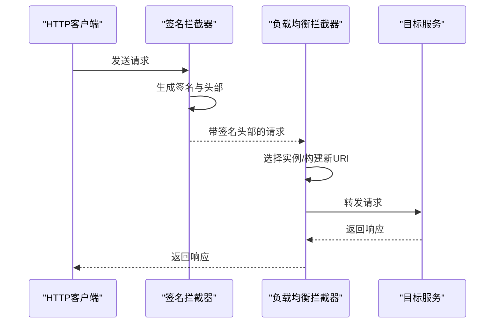

图表来源
- [FuPanSignInterceptor.java:33](file://src/main/java/com/jiuyu/governance/plugins/http/FuPanSignInterceptor.java#L33)
- [LightweightLoadBalancerInterceptor.java:31](file://src/main/java/com/jiuyu/governance/plugins/http/LightweightLoadBalancerInterceptor.java#L31)
- [ServiceInstance.java:1](file://src/main/java/com/jiuyu/governance/plugins/http/ServiceInstance.java#L1)

章节来源
- [FuPanSignInterceptor.java:33](file://src/main/java/com/jiuyu/governance/plugins/http/FuPanSignInterceptor.java#L33)
- [LightweightLoadBalancerInterceptor.java:31](file://src/main/java/com/jiuyu/governance/plugins/http/LightweightLoadBalancerInterceptor.java#L31)
- [ServiceInstance.java:1](file://src/main/java/com/jiuyu/governance/plugins/http/ServiceInstance.java#L1)

### OAuth 认证插件
- 认证令牌提供
  - 支持本地与“回放”场景的用户信息获取
  - 基于 Caffeine 缓存加速回放用户查询
  - 租户权限校验：对客户端用户进行租户可用性检查
- Token 存储接口
  - 提供新登录、登出、批量登出、更新过期时间等能力

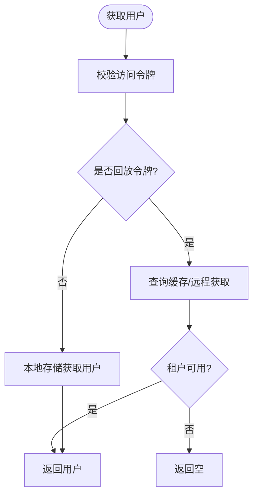

图表来源
- [RestAuthenticationTokenProvide.java:31](file://src/main/java/com/jiuyu/governance/plugins/oauth/client/RestAuthenticationTokenProvide.java#L31)
- [DbTokenStorage.java:14](file://src/main/java/com/jiuyu/governance/plugins/oauth/server/DbTokenStorage.java#L14)

章节来源
- [RestAuthenticationTokenProvide.java:31](file://src/main/java/com/jiuyu/governance/plugins/oauth/client/RestAuthenticationTokenProvide.java#L31)
- [DbTokenStorage.java:14](file://src/main/java/com/jiuyu/governance/plugins/oauth/server/DbTokenStorage.java#L14)

### 签名验证插件
- 签名生成
  - 支持 MD5 与 HMAC-SHA256 两种算法
  - 参数按 ASCII 排序拼接，必要字段包含 appId、timestamp、nonce、requestId、body 等
- 签名验证
  - 从请求头提取 appId/requestId 等，构造待签字符串并比对
  - 支持 JSON 与表单两种 body 形态

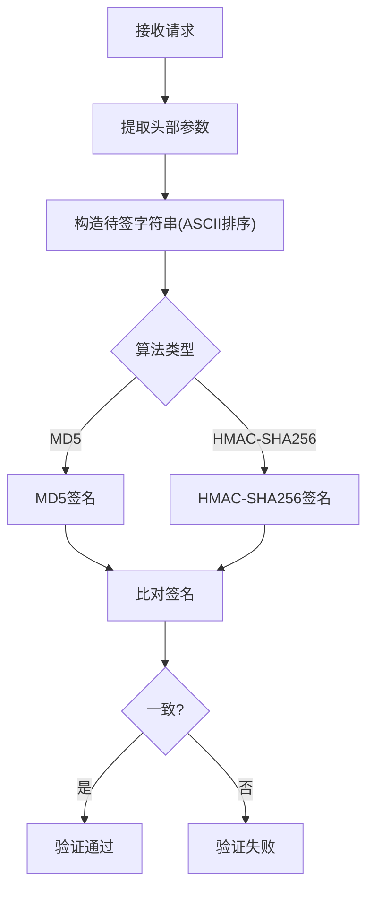

图表来源
- [ReplaySignatureCalculate.java:30](file://src/main/java/com/jiuyu/governance/plugins/sign/ReplaySignatureCalculate.java#L30)

章节来源
- [ReplaySignatureCalculate.java:30](file://src/main/java/com/jiuyu/governance/plugins/sign/ReplaySignatureCalculate.java#L30)

### 短信服务插件
- 条件装配
  - 仅当配置项开启时创建 Bean
  - 支持固定验证码或随机验证码提供者
- 服务实现
  - 基于 Redis 缓存验证码，支持模板、超时、错误次数限制等参数

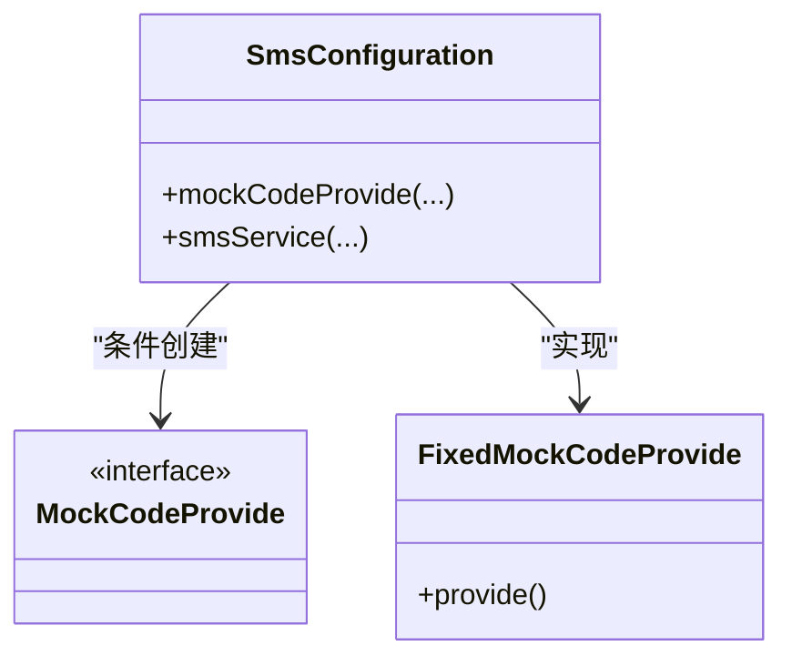

图表来源
- [SmsConfiguration.java:21](file://src/main/java/com/jiuyu/governance/plugins/sms/SmsConfiguration.java#L21)

章节来源
- [SmsConfiguration.java:21](file://src/main/java/com/jiuyu/governance/plugins/sms/SmsConfiguration.java#L21)

### OSS 存储插件
- 自动配置
  - 仅当配置存在 AK 时启用
  - 创建客户端管理器与模板 Bean，供业务注入使用
- 能力边界
  - 通过配置类暴露管理器与模板，业务侧按桶/区域进行对象存取

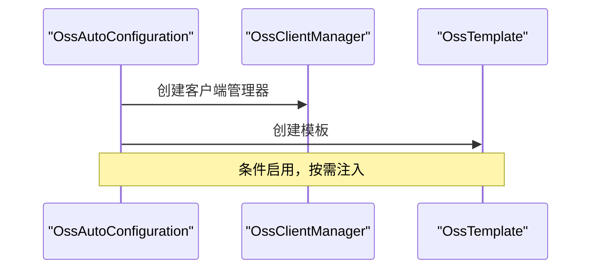

图表来源
- [OssAutoConfiguration.java:20](file://src/main/java/com/jiuyu/governance/plugins/oss/config/OssAutoConfiguration.java#L20)

章节来源
- [OssAutoConfiguration.java:20](file://src/main/java/com/jiuyu/governance/plugins/oss/config/OssAutoConfiguration.java#L20)

### WebMvc 插件
- 全局异常处理
  - 统一封装 ApiResponse，覆盖认证、参数校验、SQL、签名等多种异常
  - 上下文采集：记录访问用户、URI、查询参数、JSON 请求体等
- 适用范围
  - 作为@RestControllerAdvice，对全站接口生效

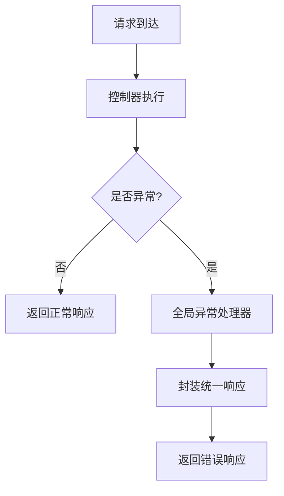

图表来源
- [GlobalExceptionHandler.java:54](file://src/main/java/com/jiuyu/governance/plugins/webmvc/GlobalExceptionHandler.java#L54)

章节来源
- [GlobalExceptionHandler.java:54](file://src/main/java/com/jiuyu/governance/plugins/webmvc/GlobalExceptionHandler.java#L54)

### XXL-Job 插件
- 条件装配
  - 仅当配置开启时创建执行器 Bean
  - 支持设置调度中心地址、令牌、应用名、地址/IP/端口、日志路径与保留天数
- 生命周期
  - 由 Spring 容器管理，随应用启动而启动

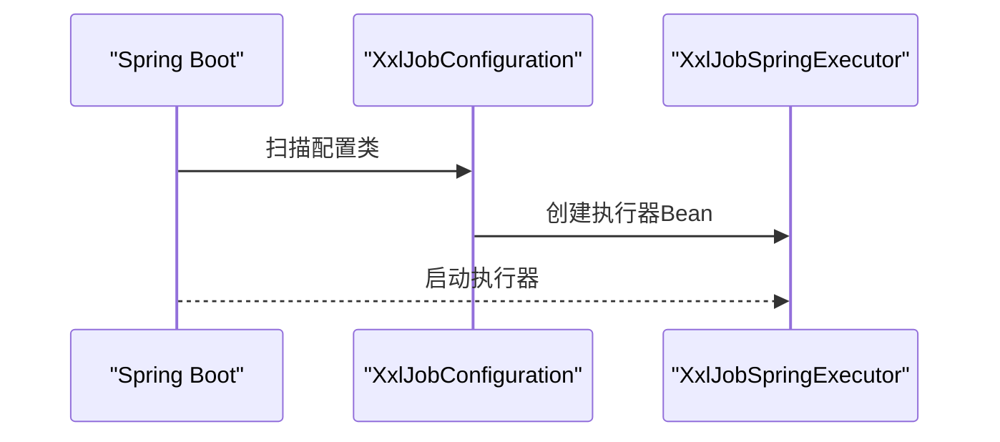

图表来源
- [XxlJobConfiguration.java:18](file://src/main/java/com/jiuyu/governance/plugins/xxljob/XxlJobConfiguration.java#L18)

章节来源
- [XxlJobConfiguration.java:18](file://src/main/java/com/jiuyu/governance/plugins/xxljob/XxlJobConfiguration.java#L18)

## 依赖分析
- 组件内聚与耦合
  - 插件内部高内聚，跨插件依赖通过接口或配置暴露，降低耦合
- 外部依赖
  - Excel：Fesod Sheet、POI
  - HTTP：Spring WebClient、Reactor Retry
  - OAuth：Caffeine、Replay HTTP Server
  - 签名：HMAC/MD5、签名框架
  - 短信：Redis Template
  - OSS：对象存储 SDK（通过管理器封装）
  - XXL-Job：XxlJobSpringExecutor
- 条件装配与自动配置
  - 通过 @ConditionalOnProperty/@ConditionalOnMissingBean 控制启用与替代

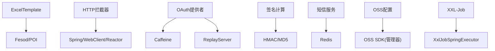

图表来源
- [ExcelTemplate.java:34](file://src/main/java/com/jiuyu/governance/plugins/excel/ExcelTemplate.java#L34)
- [FuPanSignInterceptor.java:33](file://src/main/java/com/jiuyu/governance/plugins/http/FuPanSignInterceptor.java#L33)
- [RestAuthenticationTokenProvide.java:31](file://src/main/java/com/jiuyu/governance/plugins/oauth/client/RestAuthenticationTokenProvide.java#L31)
- [ReplaySignatureCalculate.java:30](file://src/main/java/com/jiuyu/governance/plugins/sign/ReplaySignatureCalculate.java#L30)
- [SmsConfiguration.java:21](file://src/main/java/com/jiuyu/governance/plugins/sms/SmsConfiguration.java#L21)
- [OssAutoConfiguration.java:20](file://src/main/java/com/jiuyu/governance/plugins/oss/config/OssAutoConfiguration.java#L20)
- [XxlJobConfiguration.java:18](file://src/main/java/com/jiuyu/governance/plugins/xxljob/XxlJobConfiguration.java#L18)

## 性能考虑
- Excel 导出
  - 批量写入与列宽策略优化渲染性能，建议合理设置模板与排除列
- HTTP 调用
  - 负载均衡与重试策略降低单点与瞬时故障影响；注意重试上限与抖动参数
  - 签名计算为轻量级操作，建议在网关或前置层统一处理以减轻业务压力
- OAuth
  - 回放用户查询使用缓存，建议评估缓存容量与过期策略
- 短信
  - Redis 缓存验证码，建议设置合理的过期与错误次数阈值
- OSS
  - 管理器统一管理多桶/多区域客户端，注意连接池与超时配置
- WebMvc
  - 全局异常处理尽量避免读取大体积请求体，减少 IO 开销
- XXL-Job
  - 任务粒度拆分，避免长时间阻塞；合理设置日志路径与保留天数

## 故障排查指南
- Excel 导出失败
  - 检查模板路径与列映射，确认构建器回调与样式处理器配置
- HTTP 调用异常
  - 核对签名参数与算法，确认请求头是否正确注入
  - 关注负载均衡实例列表与不可用实例剔除逻辑
- OAuth 认证失败
  - 校验令牌有效性与租户可用性，检查回放缓存与远程调用链路
- 签名验证失败
  - 对比 appId、timestamp、nonce、requestId、body 等参数是否完整且排序一致
- 短信验证码异常
  - 检查 Redis 可用性、缓存键前缀与过期时间、错误次数上限
- OSS 上传/下载异常
  - 校验 AK/SK、桶配置与区域设置，关注客户端管理器初始化日志
- WebMvc 异常响应
  - 查看全局异常处理器日志，定位具体异常类型与上下文
- XXL-Job 任务未执行
  - 检查执行器配置、调度中心连通性与令牌

章节来源
- [GlobalExceptionHandler.java:54](file://src/main/java/com/jiuyu/governance/plugins/webmvc/GlobalExceptionHandler.java#L54)

## 结论
本插件化架构通过清晰的职责边界与条件装配机制，实现了功能模块的解耦与可扩展性。各插件模块在保障独立性的同时，通过统一的配置与接口约定，确保系统整体一致性与可维护性。建议在后续演进中持续完善监控与可观测性，强化安全与性能基线，以支撑业务的长期发展。

## 附录
- 插件开发最佳实践
  - 明确接口契约与异常语义，保持幂等与可重试性
  - 使用条件装配与配置类，避免硬编码与强耦合
  - 重视日志与指标，提供可观测性与可诊断性
  - 控制第三方依赖版本，定期审计与升级
  - 单元测试与集成测试并重，确保变更质量