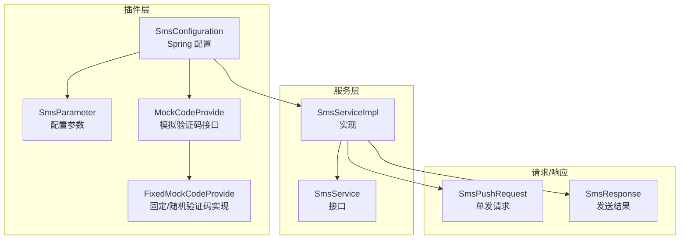
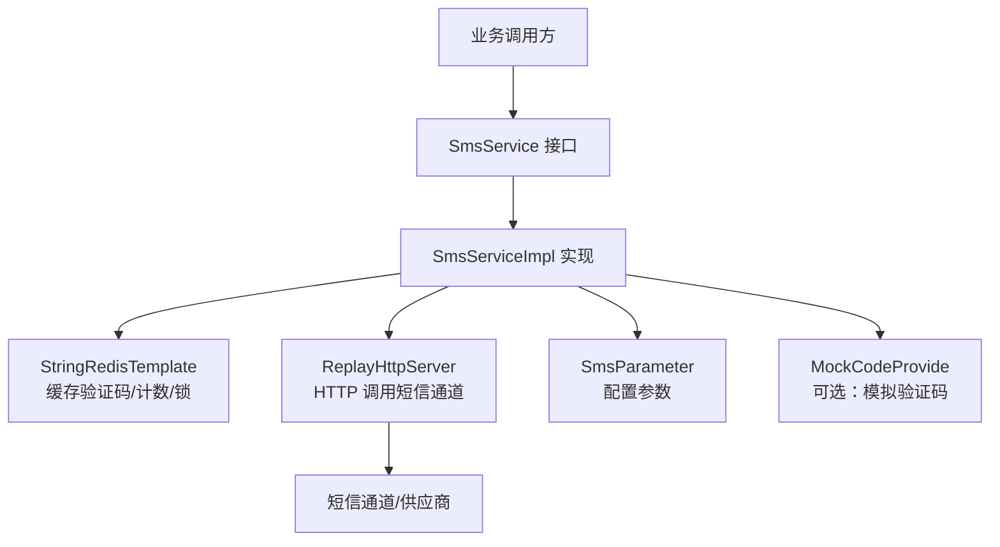
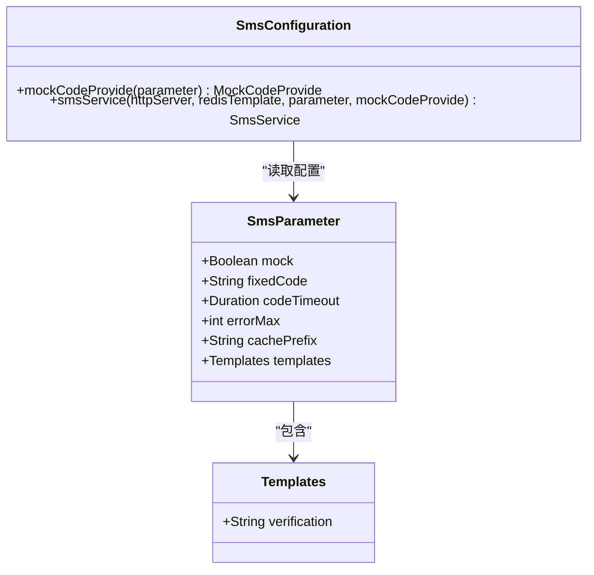
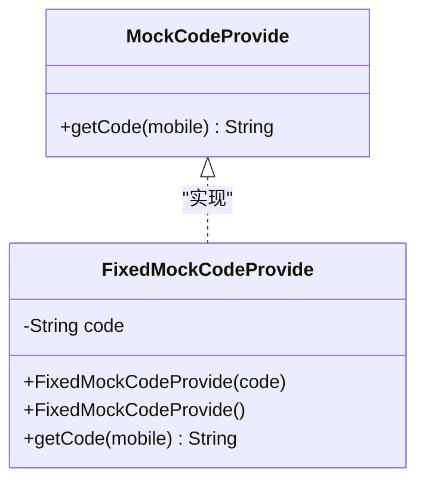
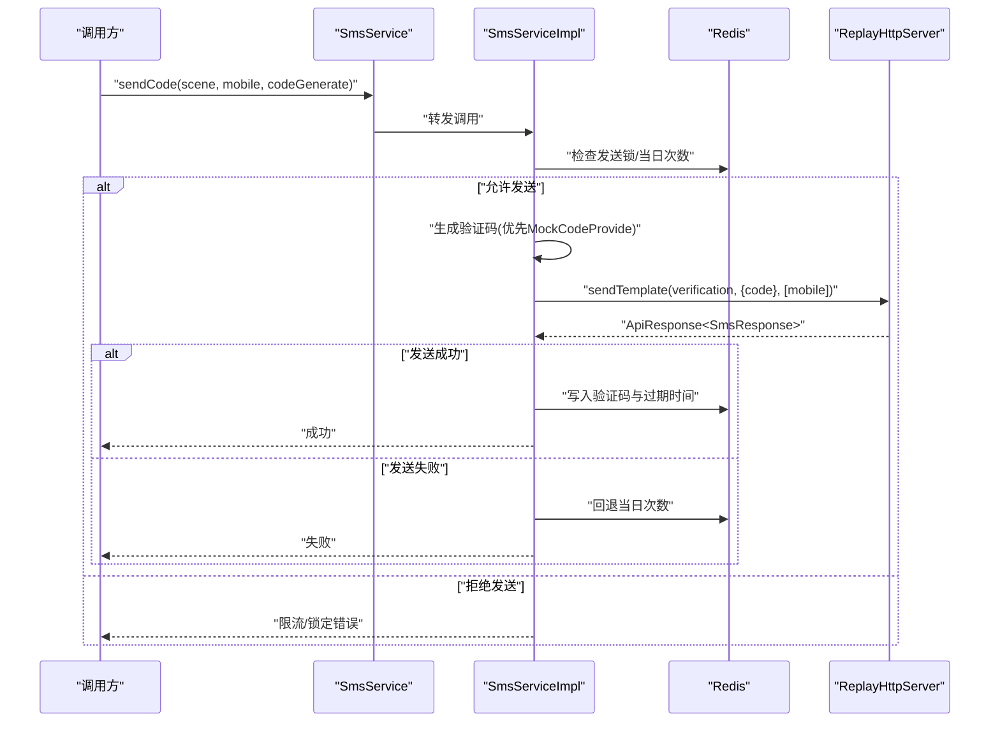
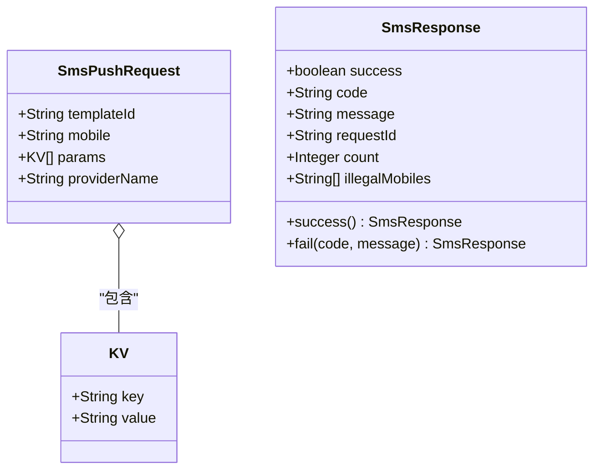
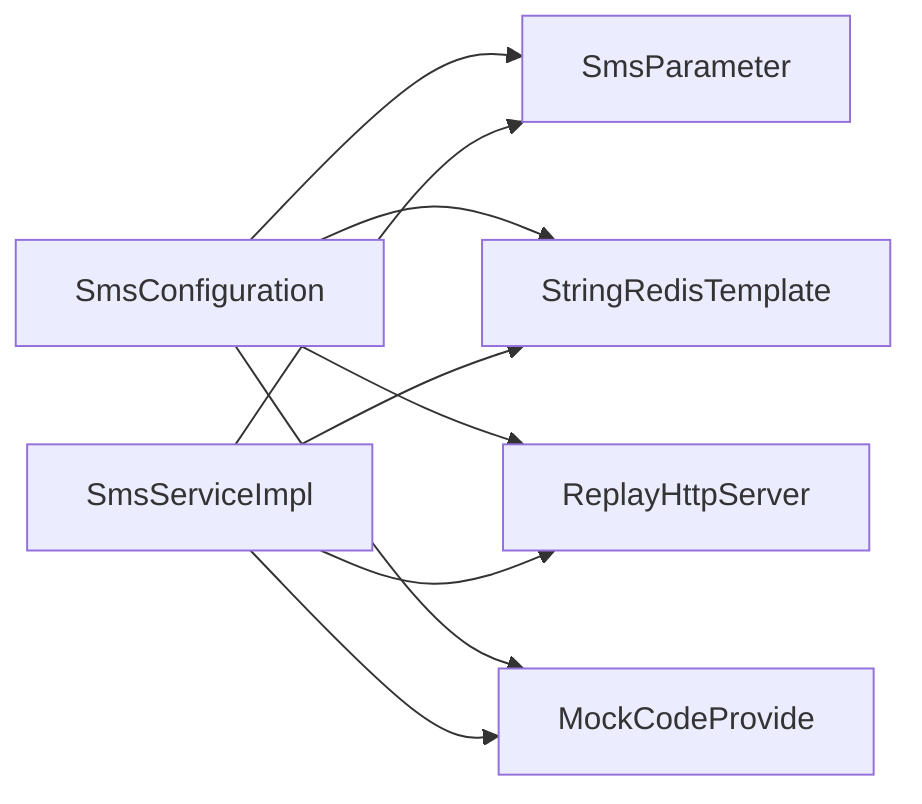

# 短信服务插件

<cite>
**本文引用的文件**
- [SmsConfiguration.java](file://src/main/java/com/jiuyu/governance/plugins/sms/SmsConfiguration.java)
- [SmsParameter.java](file://src/main/java/com/jiuyu/governance/plugins/sms/SmsParameter.java)
- [MockCodeProvide.java](file://src/main/java/com/jiuyu/governance/plugins/sms/MockCodeProvide.java)
- [FixedMockCodeProvide.java](file://src/main/java/com/jiuyu/governance/plugins/sms/FixedMockCodeProvide.java)
- [SmsService.java](file://src/main/java/com/jiuyu/governance/openfeign/replay/SmsService.java)
- [SmsServiceImpl.java](file://src/main/java/com/jiuyu/governance/openfeign/replay/impl/SmsServiceImpl.java)
- [SmsPushRequest.java](file://src/main/java/com/jiuyu/governance/openfeign/replay/request/SmsPushRequest.java)
- [SmsResponse.java](file://src/main/java/com/jiuyu/governance/openfeign/replay/response/SmsResponse.java)
- [application.yml](file://src/main/resources/application.yml)
</cite>

## 目录
1. [简介](#简介)
2. [项目结构](#项目结构)
3. [核心组件](#核心组件)
4. [架构总览](#架构总览)
5. [详细组件分析](#详细组件分析)
6. [依赖关系分析](#依赖关系分析)
7. [性能考量](#性能考量)
8. [故障排查指南](#故障排查指南)
9. [结论](#结论)
10. [附录](#附录)

## 简介
本文件为短信服务插件的完整使用文档，覆盖以下内容：
- 插件功能架构与实现机制
- 固定验证码提供器与模拟验证码提供器在测试与开发阶段的支持
- 短信配置参数与短信参数封装
- 短信发送流程：验证码生成、模板与渠道、频率限制与错误处理
- 配置方法、使用限制、错误处理与测试策略
- 实际集成示例与最佳实践

## 项目结构
短信服务插件位于 plugins/sms 与 openfeign/replay 子模块中，主要由配置类、参数类、接口与实现类、以及请求/响应模型组成。

图表来源
- [SmsConfiguration.java:1-58](file://src/main/java/com/jiuyu/governance/plugins/sms/SmsConfiguration.java#L1-L58)
- [SmsParameter.java:1-70](file://src/main/java/com/jiuyu/governance/plugins/sms/SmsParameter.java#L1-L70)
- [MockCodeProvide.java:1-23](file://src/main/java/com/jiuyu/governance/plugins/sms/MockCodeProvide.java#L1-L23)
- [FixedMockCodeProvide.java:1-40](file://src/main/java/com/jiuyu/governance/plugins/sms/FixedMockCodeProvide.java#L1-L40)
- [SmsService.java:1-57](file://src/main/java/com/jiuyu/governance/openfeign/replay/SmsService.java#L1-L57)
- [SmsServiceImpl.java:1-279](file://src/main/java/com/jiuyu/governance/openfeign/replay/impl/SmsServiceImpl.java#L1-L279)
- [SmsPushRequest.java:1-70](file://src/main/java/com/jiuyu/governance/openfeign/replay/request/SmsPushRequest.java#L1-L70)
- [SmsResponse.java:1-77](file://src/main/java/com/jiuyu/governance/openfeign/replay/response/SmsResponse.java#L1-L77)

章节来源
- [SmsConfiguration.java:1-58](file://src/main/java/com/jiuyu/governance/plugins/sms/SmsConfiguration.java#L1-L58)
- [SmsParameter.java:1-70](file://src/main/java/com/jiuyu/governance/plugins/sms/SmsParameter.java#L1-L70)
- [SmsService.java:1-57](file://src/main/java/com/jiuyu/governance/openfeign/replay/SmsService.java#L1-L57)
- [SmsServiceImpl.java:1-279](file://src/main/java/com/jiuyu/governance/openfeign/replay/impl/SmsServiceImpl.java#L1-L279)

## 核心组件
- 配置类：负责装配短信服务 Bean、按条件创建模拟验证码提供器、注入 Redis 与重放 HTTP 服务器。
- 参数类：集中管理短信配置项，如验证码有效期、最大错误次数、缓存前缀、模板等。
- 接口与实现：定义短信发送能力（模板短信、验证码发送、验证码校验），并实现具体逻辑。
- 请求/响应模型：封装短信发送请求体与返回体，便于统一处理。

章节来源
- [SmsConfiguration.java:21-58](file://src/main/java/com/jiuyu/governance/plugins/sms/SmsConfiguration.java#L21-L58)
- [SmsParameter.java:15-70](file://src/main/java/com/jiuyu/governance/plugins/sms/SmsParameter.java#L15-L70)
- [SmsService.java:18-56](file://src/main/java/com/jiuyu/governance/openfeign/replay/SmsService.java#L18-L56)
- [SmsServiceImpl.java:35-68](file://src/main/java/com/jiuyu/governance/openfeign/replay/impl/SmsServiceImpl.java#L35-L68)

## 架构总览
短信服务通过 Spring 配置类自动装配，结合 Redis 实现验证码缓存与限流控制，通过重放 HTTP 服务器对接短信通道，支持单发与批量发送。

图表来源
- [SmsConfiguration.java:34-57](file://src/main/java/com/jiuyu/governance/plugins/sms/SmsConfiguration.java#L34-L57)
- [SmsServiceImpl.java:58-68](file://src/main/java/com/jiuyu/governance/openfeign/replay/impl/SmsServiceImpl.java#L58-L68)
- [SmsService.java:29-55](file://src/main/java/com/jiuyu/governance/openfeign/replay/SmsService.java#L29-L55)

## 详细组件分析

### 组件一：配置与参数
- SmsConfiguration
  - 条件创建 MockCodeProvide：当配置开启 mock 且未存在同名 Bean 时，根据是否配置固定验证码选择固定或随机验证码提供器。
  - 创建 SmsService：注入 Redis、重放 HTTP 服务器、配置参数与可选的 MockCodeProvide，构造 SmsServiceImpl。
- SmsParameter
  - 前缀：jiuyu.sms
  - 关键配置项：mock、fixedCode、codeTimeout、errorMax、cachePrefix、templates.verification

图表来源
- [SmsConfiguration.java:34-57](file://src/main/java/com/jiuyu/governance/plugins/sms/SmsConfiguration.java#L34-L57)
- [SmsParameter.java:18-68](file://src/main/java/com/jiuyu/governance/plugins/sms/SmsParameter.java#L18-L68)

章节来源
- [SmsConfiguration.java:21-58](file://src/main/java/com/jiuyu/governance/plugins/sms/SmsConfiguration.java#L21-L58)
- [SmsParameter.java:15-70](file://src/main/java/com/jiuyu/governance/plugins/sms/SmsParameter.java#L15-L70)

### 组件二：模拟验证码提供器
- MockCodeProvide：函数式接口，提供 getCode(mobile) 获取验证码。
- FixedMockCodeProvide：默认生成 6 位随机验证码；也可传入固定验证码。

图表来源
- [MockCodeProvide.java:11-22](file://src/main/java/com/jiuyu/governance/plugins/sms/MockCodeProvide.java#L11-L22)
- [FixedMockCodeProvide.java:13-39](file://src/main/java/com/jiuyu/governance/plugins/sms/FixedMockCodeProvide.java#L13-L39)

章节来源
- [MockCodeProvide.java:1-23](file://src/main/java/com/jiuyu/governance/plugins/sms/MockCodeProvide.java#L1-L23)
- [FixedMockCodeProvide.java:1-40](file://src/main/java/com/jiuyu/governance/plugins/sms/FixedMockCodeProvide.java#L1-L40)

### 组件三：短信服务接口与实现
- SmsService：定义模板短信发送、验证码发送、验证码校验三个核心方法。
- SmsServiceImpl：
  - sendTemplate：校验模板与手机号，单发/批量分别构造请求并调用重放 HTTP 服务器。
  - sendCode：生成缓存键，检查发送锁与当日发送次数，按需使用 MockCodeProvide 或外部生成器生成验证码，调用模板短信发送并将验证码写入 Redis。
  - checkCode：校验验证码，错误次数累计与上限控制，超过阈值设置锁定并清理缓存。

图表来源
- [SmsService.java:41-41](file://src/main/java/com/jiuyu/governance/openfeign/replay/SmsService.java#L41-L41)
- [SmsServiceImpl.java:142-198](file://src/main/java/com/jiuyu/governance/openfeign/replay/impl/SmsServiceImpl.java#L142-L198)

章节来源
- [SmsService.java:18-56](file://src/main/java/com/jiuyu/governance/openfeign/replay/SmsService.java#L18-L56)
- [SmsServiceImpl.java:79-129](file://src/main/java/com/jiuyu/governance/openfeign/replay/impl/SmsServiceImpl.java#L79-L129)
- [SmsServiceImpl.java:141-198](file://src/main/java/com/jiuyu/governance/openfeign/replay/impl/SmsServiceImpl.java#L141-L198)
- [SmsServiceImpl.java:211-236](file://src/main/java/com/jiuyu/governance/openfeign/replay/impl/SmsServiceImpl.java#L211-L236)

### 组件四：请求与响应模型
- SmsPushRequest：单发短信请求，包含模板 ID、手机号、参数列表等。
- SmsResponse：短信发送结果，包含成功标志、状态码、消息、请求 ID、发送数量、非法手机号列表等。

图表来源
- [SmsPushRequest.java:18-67](file://src/main/java/com/jiuyu/governance/openfeign/replay/request/SmsPushRequest.java#L18-L67)
- [SmsResponse.java:21-76](file://src/main/java/com/jiuyu/governance/openfeign/replay/response/SmsResponse.java#L21-L76)

章节来源
- [SmsPushRequest.java:1-70](file://src/main/java/com/jiuyu/governance/openfeign/replay/request/SmsPushRequest.java#L1-L70)
- [SmsResponse.java:1-77](file://src/main/java/com/jiuyu/governance/openfeign/replay/response/SmsResponse.java#L1-L77)

## 依赖关系分析
- 组件耦合
  - SmsConfiguration 依赖 SmsParameter、ReplayHttpServer、StringRedisTemplate、MockCodeProvide。
  - SmsServiceImpl 依赖 ReplayHttpServer、StringRedisTemplate、SmsParameter.Templates、MockCodeProvide。
- 外部依赖
  - Redis 用于验证码缓存、错误计数与发送锁。
  - 重放 HTTP 服务器用于对接短信通道。
  - Hutool 工具库用于手机号校验、脱敏与随机数生成。

图表来源
- [SmsConfiguration.java:34-57](file://src/main/java/com/jiuyu/governance/plugins/sms/SmsConfiguration.java#L34-L57)
- [SmsServiceImpl.java:58-68](file://src/main/java/com/jiuyu/governance/openfeign/replay/impl/SmsServiceImpl.java#L58-L68)

章节来源
- [SmsConfiguration.java:21-58](file://src/main/java/com/jiuyu/governance/plugins/sms/SmsConfiguration.java#L21-L58)
- [SmsServiceImpl.java:35-68](file://src/main/java/com/jiuyu/governance/openfeign/replay/impl/SmsServiceImpl.java#L35-L68)

## 性能考量
- 缓存与过期
  - 验证码有效期与上下文窗口：验证码键与上下文键均设置过期时间，避免长期占用内存。
  - 错误计数与发送锁：错误次数超过阈值会设置发送锁，防止暴力尝试。
- 限流策略
  - 单日最大发送次数与验证码有效期区间内防刷，减少短信通道压力。
- 批量发送
  - 对非法手机号进行过滤，仅对合法手机号发起批量请求，降低无效调用。

章节来源
- [SmsServiceImpl.java:146-172](file://src/main/java/com/jiuyu/governance/openfeign/replay/impl/SmsServiceImpl.java#L146-L172)
- [SmsServiceImpl.java:154-162](file://src/main/java/com/jiuyu/governance/openfeign/replay/impl/SmsServiceImpl.java#L154-L162)
- [SmsServiceImpl.java:108-128](file://src/main/java/com/jiuyu/governance/openfeign/replay/impl/SmsServiceImpl.java#L108-L128)

## 故障排查指南
- 常见错误码与含义
  - 参数无效：模板代码为空、手机号为空或格式错误。
  - 频繁请求/限流：短期内频繁获取验证码或超出单日最大发送次数。
  - 通道不可达/发送失败：短信通道返回非成功状态，返回具体消息。
- 定位步骤
  - 检查 Redis 中验证码键、错误计数键与发送锁是否存在与过期时间。
  - 查看接口返回的错误码与消息，确认是参数问题还是通道问题。
  - 在测试环境启用 mock 并设置固定验证码，便于快速验证流程。
- 日志要点
  - 发送成功/失败日志、验证码生成与校验过程日志、错误次数与锁定日志。

章节来源
- [SmsServiceImpl.java:80-92](file://src/main/java/com/jiuyu/governance/openfeign/replay/impl/SmsServiceImpl.java#L80-L92)
- [SmsServiceImpl.java:146-172](file://src/main/java/com/jiuyu/governance/openfeign/replay/impl/SmsServiceImpl.java#L146-L172)
- [SmsServiceImpl.java:189-197](file://src/main/java/com/jiuyu/governance/openfeign/replay/impl/SmsServiceImpl.java#L189-L197)
- [SmsServiceImpl.java:216-235](file://src/main/java/com/jiuyu/governance/openfeign/replay/impl/SmsServiceImpl.java#L216-L235)

## 结论
短信服务插件通过清晰的配置与参数体系、完善的验证码生命周期管理与限流策略、以及可选的模拟验证码提供器，实现了稳定可靠的短信发送能力。在生产环境中建议关闭 mock，合理配置验证码有效期与错误上限；在测试环境中可通过固定验证码快速回归验证。

## 附录

### 配置方法与参数说明
- 配置前缀：jiuyu.sms
- 关键参数
  - mock：是否启用模拟验证码提供器
  - fixedCode：固定验证码（可选）
  - codeTimeout：验证码有效期，默认 10 分钟
  - errorMax：最大错误次数，默认 4
  - cachePrefix：缓存键前缀，默认 governance:sms-code
  - templates.verification：验证码模板代码，默认 verification_code

章节来源
- [SmsParameter.java:20-68](file://src/main/java/com/jiuyu/governance/plugins/sms/SmsParameter.java#L20-L68)
- [SmsConfiguration.java:34-42](file://src/main/java/com/jiuyu/governance/plugins/sms/SmsConfiguration.java#L34-L42)

### 使用限制与注意事项
- 手机号必须符合中国大陆手机号格式。
- 单日最大发送次数与验证码有效期区间内防刷策略。
- 错误次数超过阈值将触发发送锁，需等待解锁后方可继续。

章节来源
- [SmsServiceImpl.java:89-92](file://src/main/java/com/jiuyu/governance/openfeign/replay/impl/SmsServiceImpl.java#L89-L92)
- [SmsServiceImpl.java:156-162](file://src/main/java/com/jiuyu/governance/openfeign/replay/impl/SmsServiceImpl.java#L156-L162)
- [SmsServiceImpl.java:167-172](file://src/main/java/com/jiuyu/governance/openfeign/replay/impl/SmsServiceImpl.java#L167-L172)

### 集成示例与最佳实践
- 生产环境
  - 关闭 mock，确保验证码由外部生成器提供。
  - 合理设置验证码有效期与错误上限，平衡安全与用户体验。
  - 监控 Redis 中验证码键与错误计数键，及时发现异常。
- 测试环境
  - 开启 mock，设置 fixedCode 以便自动化测试。
  - 使用 FixedMockCodeProvide 的随机模式进行多轮测试。
- 通道对接
  - 确保重放 HTTP 服务器正确配置短信通道地址与鉴权。
  - 单发与批量发送分别处理，注意非法手机号过滤。

章节来源
- [SmsConfiguration.java:34-42](file://src/main/java/com/jiuyu/governance/plugins/sms/SmsConfiguration.java#L34-L42)
- [SmsServiceImpl.java:174-179](file://src/main/java/com/jiuyu/governance/openfeign/replay/impl/SmsServiceImpl.java#L174-L179)
- [SmsServiceImpl.java:108-128](file://src/main/java/com/jiuyu/governance/openfeign/replay/impl/SmsServiceImpl.java#L108-L128)

### 配置文件参考
- Redis 连接与超时、应用名、端口等基础配置位于 application.yml。

章节来源
- [application.yml:87-100](file://src/main/resources/application.yml#L87-L100)
- [application.yml:101-116](file://src/main/resources/application.yml#L101-L116)