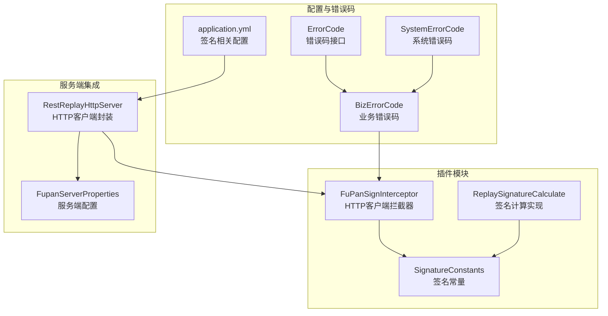
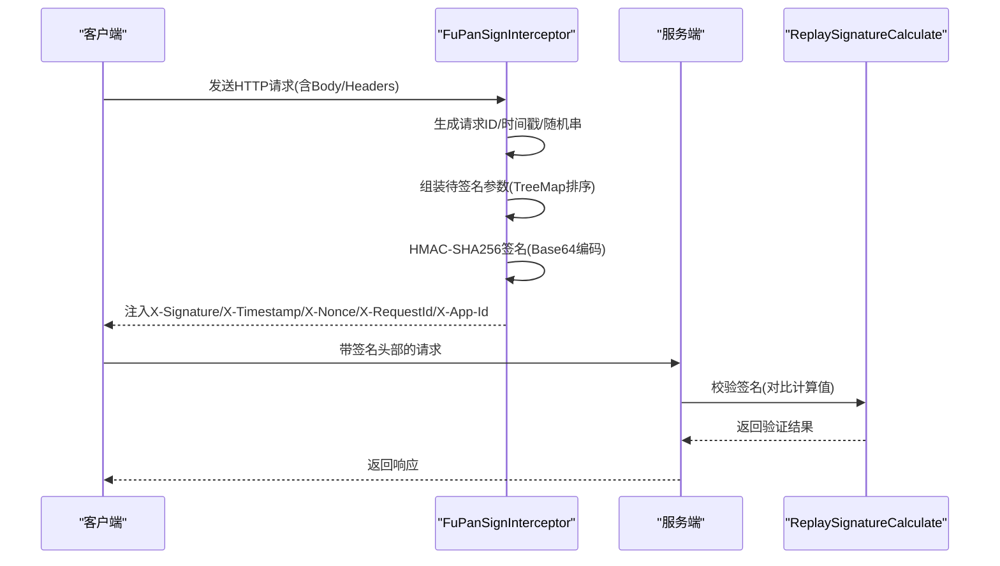
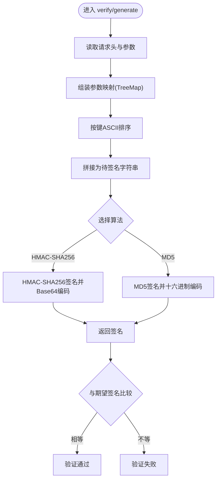
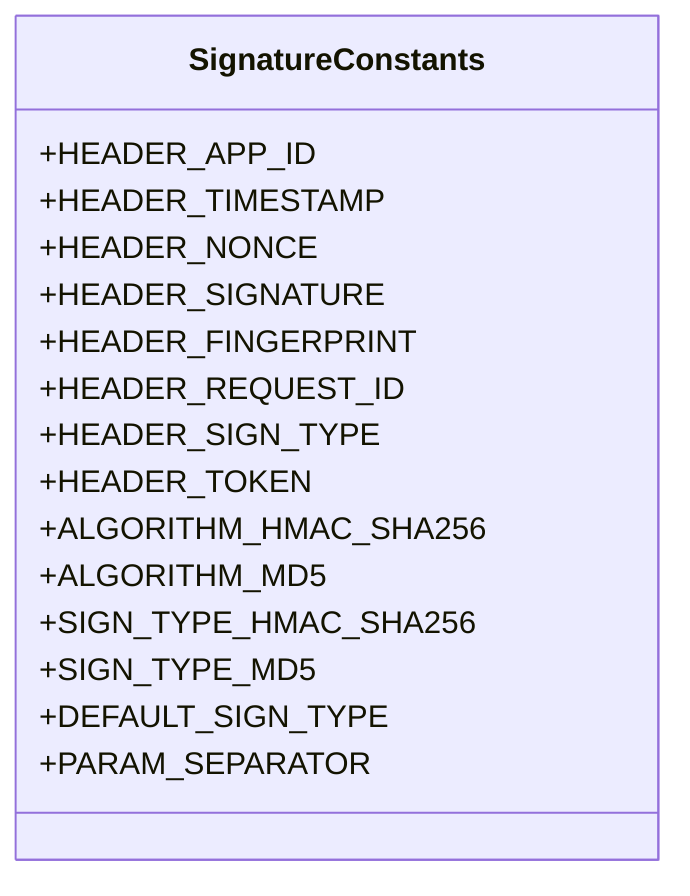
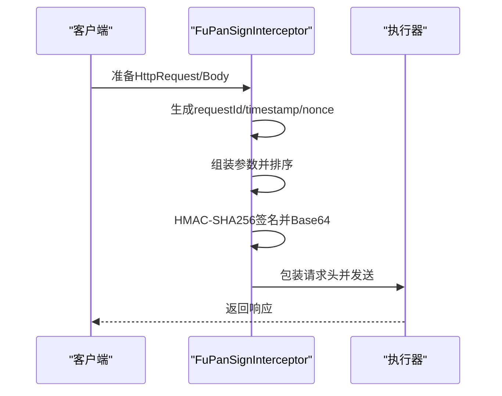
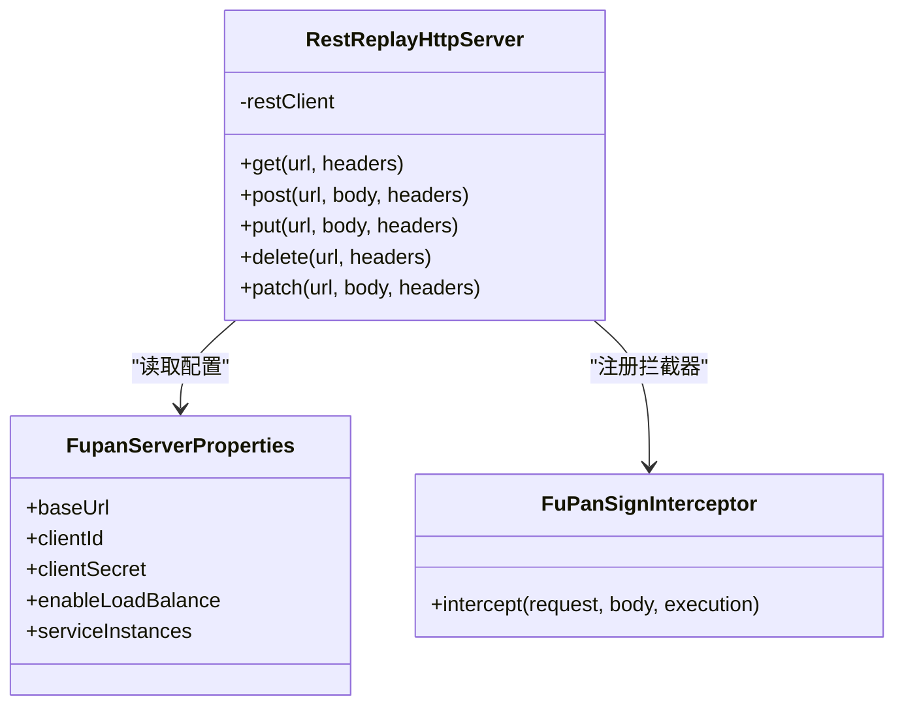
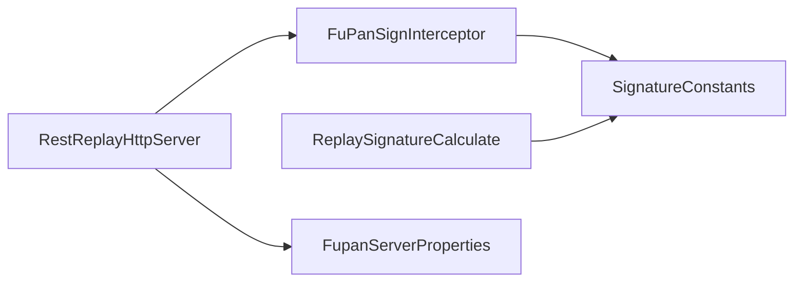

# 签名验证插件

<cite>
**本文引用的文件**
- [ReplaySignatureCalculate.java](file://src/main/java/com/jiuyu/governance/plugins/sign/ReplaySignatureCalculate.java)
- [SignatureConstants.java](file://src/main/java/com/jiuyu/governance/plugins/sign/SignatureConstants.java)
- [FuPanSignInterceptor.java](file://src/main/java/com/jiuyu/governance/plugins/http/FuPanSignInterceptor.java)
- [FupanServerProperties.java](file://src/main/java/com/jiuyu/governance/common/replay/FupanServerProperties.java)
- [RestReplayHttpServer.java](file://src/main/java/com/jiuyu/governance/common/replay/RestReplayHttpServer.java)
- [application.yml](file://src/main/resources/application.yml)
- [BizErrorCode.java](file://src/main/java/com/jiuyu/governance/common/pojo/BizErrorCode.java)
- [ErrorCode.java](file://src/main/java/com/jiuyu/governance/common/pojo/ErrorCode.java)
- [SystemErrorCode.java](file://src/main/java/com/jiuyu/governance/common/pojo/SystemErrorCode.java)
</cite>

## 目录
1. [简介](#简介)
2. [项目结构](#项目结构)
3. [核心组件](#核心组件)
4. [架构总览](#架构总览)
5. [详细组件分析](#详细组件分析)
6. [依赖分析](#依赖分析)
7. [性能考虑](#性能考虑)
8. [故障排查指南](#故障排查指南)
9. [结论](#结论)
10. [附录](#附录)

## 简介
本文件面向签名验证插件的技术文档，系统阐述其安全设计理念与实现原理，重点覆盖以下方面：
- ReplaySignatureCalculate 签名计算算法的数学原理与实现细节
- SignatureConstants 签名常量配置的标准化设计
- 插件如何实现 API 请求的安全验证：签名生成、签名验证、时间戳防重放攻击等
- 插件的安全策略、加密算法选择、密钥管理等关键技术点
- 提供安全配置指南与常见安全问题的解决方案

## 项目结构
签名验证插件位于 governance 工程的 plugins 子模块中，围绕“签名常量”“签名计算”“HTTP 客户端拦截器”“服务端配置”展开，形成从客户端到服务端的完整链路。

图表来源
- [SignatureConstants.java:1-81](file://src/main/java/com/jiuyu/governance/plugins/sign/SignatureConstants.java#L1-L81)
- [ReplaySignatureCalculate.java:1-199](file://src/main/java/com/jiuyu/governance/plugins/sign/ReplaySignatureCalculate.java#L1-L199)
- [FuPanSignInterceptor.java:1-111](file://src/main/java/com/jiuyu/governance/plugins/http/FuPanSignInterceptor.java#L1-L111)
- [FupanServerProperties.java:1-48](file://src/main/java/com/jiuyu/governance/common/replay/FupanServerProperties.java#L1-L48)
- [RestReplayHttpServer.java:1-118](file://src/main/java/com/jiuyu/governance/common/replay/RestReplayHttpServer.java#L1-L118)
- [application.yml:101-116](file://src/main/resources/application.yml#L101-L116)
- [BizErrorCode.java:1-55](file://src/main/java/com/jiuyu/governance/common/pojo/BizErrorCode.java#L1-L55)
- [ErrorCode.java:1-25](file://src/main/java/com/jiuyu/governance/common/pojo/ErrorCode.java#L1-L25)
- [SystemErrorCode.java:1-38](file://src/main/java/com/jiuyu/governance/common/pojo/SystemErrorCode.java#L1-L38)

章节来源
- [application.yml:101-116](file://src/main/resources/application.yml#L101-L116)

## 核心组件
- 签名常量：统一定义请求头字段、算法与签名方式、默认签名方式与参数分隔符，确保客户端与服务端对签名上下文达成一致。
- 签名计算：实现签名生成与验证流程，支持 HMAC-SHA256 与 MD5 两种模式；在生成阶段按 ASCII 排序拼接参数，最终以 Base64 或十六进制编码输出。
- HTTP 客户端拦截器：在出站请求中自动注入签名、时间戳、随机串、请求 ID 等头部，并以 HMAC-SHA256 计算签名。
- 服务端配置与封装：通过配置类读取基础 URL、clientId、clientSecret、负载均衡开关与服务实例列表；在 RestReplayHttpServer 中装配拦截器与负载均衡器。

章节来源
- [SignatureConstants.java:1-81](file://src/main/java/com/jiuyu/governance/plugins/sign/SignatureConstants.java#L1-L81)
- [ReplaySignatureCalculate.java:1-199](file://src/main/java/com/jiuyu/governance/plugins/sign/ReplaySignatureCalculate.java#L1-L199)
- [FuPanSignInterceptor.java:1-111](file://src/main/java/com/jiuyu/governance/plugins/http/FuPanSignInterceptor.java#L1-L111)
- [FupanServerProperties.java:1-48](file://src/main/java/com/jiuyu/governance/common/replay/FupanServerProperties.java#L1-L48)
- [RestReplayHttpServer.java:1-118](file://src/main/java/com/jiuyu/governance/common/replay/RestReplayHttpServer.java#L1-L118)

## 架构总览
签名验证插件采用“客户端自动签名 + 服务端统一验证”的架构。客户端通过拦截器在发送请求前完成签名注入；服务端通过签名计算实现对请求的完整性与来源校验。

图表来源
- [FuPanSignInterceptor.java:58-86](file://src/main/java/com/jiuyu/governance/plugins/http/FuPanSignInterceptor.java#L58-L86)
- [ReplaySignatureCalculate.java:49-59](file://src/main/java/com/jiuyu/governance/plugins/sign/ReplaySignatureCalculate.java#L49-L59)

## 详细组件分析

### ReplaySignatureCalculate：签名计算与验证
- 签名生成
  - 输入：appId、appSecret、timestamp、nonce、fingerprint、requestId、body、signType
  - 处理：将关键参数放入有序映射（TreeMap），按 ASCII 排序拼接为待签名字符串；根据 signType 选择 HMAC-SHA256 或 MD5；HMAC-SHA256 输出 Base64 编码，MD5 输出十六进制小写字符串
  - 输出：签名字符串
- 签名验证
  - 输入：请求对象、签名模型、请求体、参数、secretKey、sign、timestamp、paths
  - 处理：从请求头读取 X-App-Id、X-RequestId、X-Timestamp、X-Nonce、X-Fingerprint；构造待签名字符串；调用 generateSignature 计算签名并与传入签名比较
  - 输出：布尔值表示是否匹配
- 关键点
  - 参数排序：TreeMap 自动按键的 ASCII 升序排列，保证签名一致性
  - 空值处理：当 appSecret 为空时记录告警并返回空；当 body 为 JSON 时直接使用，否则序列化为键值对字符串
  - 算法选择：默认 HMAC-SHA256，兼容 MD5 作为降级选项

图表来源
- [ReplaySignatureCalculate.java:107-163](file://src/main/java/com/jiuyu/governance/plugins/sign/ReplaySignatureCalculate.java#L107-L163)
- [ReplaySignatureCalculate.java:49-59](file://src/main/java/com/jiuyu/governance/plugins/sign/ReplaySignatureCalculate.java#L49-L59)

章节来源
- [ReplaySignatureCalculate.java:1-199](file://src/main/java/com/jiuyu/governance/plugins/sign/ReplaySignatureCalculate.java#L1-L199)

### SignatureConstants：签名常量配置
- 请求头字段
  - X-App-Id、X-Timestamp、X-Nonce、X-Signature、X-Fingerprint、X-RequestId、X-Sign-Type、token
- 算法与签名方式
  - ALGORITHM_HMAC_SHA256、ALGORITHM_MD5
  - SIGN_TYPE_HMAC_SHA256、SIGN_TYPE_MD5、DEFAULT_SIGN_TYPE
- 其他
  - PARAM_SEPARATOR 参数分隔符

图表来源
- [SignatureConstants.java:1-81](file://src/main/java/com/jiuyu/governance/plugins/sign/SignatureConstants.java#L1-L81)

章节来源
- [SignatureConstants.java:1-81](file://src/main/java/com/jiuyu/governance/plugins/sign/SignatureConstants.java#L1-L81)

### FuPanSignInterceptor：HTTP 客户端签名拦截器
- 职责
  - 在请求发送前自动注入签名相关头部：X-App-Id、X-Timestamp、X-Nonce、X-RequestId、X-Signature、X-Sign-Type
  - 使用 HMAC-SHA256 对排序后的参数进行签名，并以 Base64 编码附加到 X-Signature
- 关键点
  - 请求 ID 使用 UUID 生成，时间戳为毫秒级，随机串与请求 ID 同值，增强不可预测性
  - 当请求体非空时将其加入待签名参数，确保对请求体的完整性保护

图表来源
- [FuPanSignInterceptor.java:58-86](file://src/main/java/com/jiuyu/governance/plugins/http/FuPanSignInterceptor.java#L58-L86)
- [FuPanSignInterceptor.java:95-107](file://src/main/java/com/jiuyu/governance/plugins/http/FuPanSignInterceptor.java#L95-L107)

章节来源
- [FuPanSignInterceptor.java:1-111](file://src/main/java/com/jiuyu/governance/plugins/http/FuPanSignInterceptor.java#L1-L111)

### 服务端配置与封装：RestReplayHttpServer
- 功能
  - 基于 RestClient.Builder 配置基础 URL、签名拦截器与可选的负载均衡拦截器
  - 提供 GET/POST/PUT/DELETE/PATCH 方法的便捷封装
- 集成点
  - 从 FupanServerProperties 读取 baseUrl、clientId、clientSecret、enableLoadBalance、serviceInstances
  - 注册 FuPanSignInterceptor 实现签名注入

图表来源
- [RestReplayHttpServer.java:21-33](file://src/main/java/com/jiuyu/governance/common/replay/RestReplayHttpServer.java#L21-L33)
- [FupanServerProperties.java:20-47](file://src/main/java/com/jiuyu/governance/common/replay/FupanServerProperties.java#L20-L47)
- [FuPanSignInterceptor.java:33-56](file://src/main/java/com/jiuyu/governance/plugins/http/FuPanSignInterceptor.java#L33-L56)

章节来源
- [RestReplayHttpServer.java:1-118](file://src/main/java/com/jiuyu/governance/common/replay/RestReplayHttpServer.java#L1-L118)
- [FupanServerProperties.java:1-48](file://src/main/java/com/jiuyu/governance/common/replay/FupanServerProperties.java#L1-L48)

## 依赖分析
- 组件耦合
  - FuPanSignInterceptor 依赖 SignatureConstants 与 SignatureModel（HMAC-SHA256）
  - ReplaySignatureCalculate 依赖 SignatureConstants 与 SignatureModel（HMAC-SHA256/MD5）
  - RestReplayHttpServer 依赖 FupanServerProperties 与 FuPanSignInterceptor
- 外部依赖
  - Spring WebClient/RestClient（用于 HTTP 请求封装）
  - Java JCE（HMAC-SHA256、MessageDigest）
  - Hutool（UUID 生成）

图表来源
- [FuPanSignInterceptor.java:9-11](file://src/main/java/com/jiuyu/governance/plugins/http/FuPanSignInterceptor.java#L9-L11)
- [ReplaySignatureCalculate.java:3-7](file://src/main/java/com/jiuyu/governance/plugins/sign/ReplaySignatureCalculate.java#L3-L7)
- [RestReplayHttpServer.java:3-5](file://src/main/java/com/jiuyu/governance/common/replay/RestReplayHttpServer.java#L3-L5)

章节来源
- [FuPanSignInterceptor.java:1-111](file://src/main/java/com/jiuyu/governance/plugins/http/FuPanSignInterceptor.java#L1-L111)
- [ReplaySignatureCalculate.java:1-199](file://src/main/java/com/jiuyu/governance/plugins/sign/ReplaySignatureCalculate.java#L1-L199)
- [RestReplayHttpServer.java:1-118](file://src/main/java/com/jiuyu/governance/common/replay/RestReplayHttpServer.java#L1-L118)

## 性能考虑
- 签名计算复杂度
  - 参数组装与排序：O(n log n)，n 为参数数量
  - HMAC-SHA256：常数级开销，整体近似 O(n log n)
  - MD5：常数级开销，整体近似 O(n log n)
- 字符串拼接与编码
  - Base64 编码与十六进制编码均为线性时间，对性能影响较小
- 建议
  - 控制请求体大小，避免过大的 body 影响签名与传输性能
  - 在高并发场景下，优先使用 HMAC-SHA256 并确保密钥缓存与线程安全

## 故障排查指南
- 常见错误与定位
  - 未设置 X-App-Id 或 X-RequestId：verify 流程会直接返回失败，检查客户端拦截器是否正确注入
  - appSecret 为空：生成签名时记录告警并返回空，需检查服务端配置
  - 签名不匹配：核对参数排序、编码方式、算法选择是否一致
  - 时间戳过期：结合服务端配置的过期时间阈值进行排查
- 错误码参考
  - 业务错误码：包含 GENERAL_FAILED 等通用业务失败场景
  - 系统错误码：包含 HTTP 状态映射与系统级错误

章节来源
- [ReplaySignatureCalculate.java:109-112](file://src/main/java/com/jiuyu/governance/plugins/sign/ReplaySignatureCalculate.java#L109-L112)
- [BizErrorCode.java:33-35](file://src/main/java/com/jiuyu/governance/common/pojo/BizErrorCode.java#L33-L35)
- [SystemErrorCode.java:14-28](file://src/main/java/com/jiuyu/governance/common/pojo/SystemErrorCode.java#L14-L28)

## 结论
签名验证插件通过标准化的常量定义、严谨的签名生成与验证流程、以及自动化的 HTTP 拦截器，实现了对 API 请求的完整性、来源与时效性保障。建议在生产环境中优先采用 HMAC-SHA256，并配合严格的时间戳校验与密钥管理策略，确保系统的安全性与稳定性。

## 附录

### 安全配置指南
- 客户端配置
  - 在 application.yml 中配置 jiuyu.signature 下的相关头部名称映射
  - 确保 clientId 与 clientSecret 正确配置，避免空密钥导致签名失败
- 服务端配置
  - 设置合理的过期时间阈值（如毫秒级），防止重放攻击
  - 统一使用 HMAC-SHA256 算法，必要时才启用 MD5
- 密钥管理
  - 密钥仅在内存中使用，避免明文落盘
  - 定期轮换密钥，变更后同步更新所有客户端与服务端配置

章节来源
- [application.yml:101-116](file://src/main/resources/application.yml#L101-L116)
- [FupanServerProperties.java:20-47](file://src/main/java/com/jiuyu/governance/common/replay/FupanServerProperties.java#L20-L47)
- [RestReplayHttpServer.java:26-33](file://src/main/java/com/jiuyu/governance/common/replay/RestReplayHttpServer.java#L26-L33)