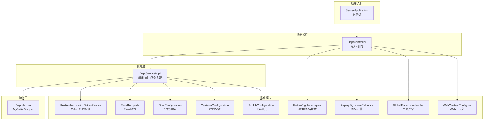
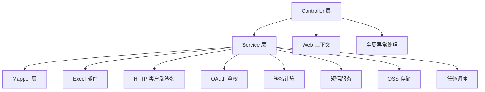
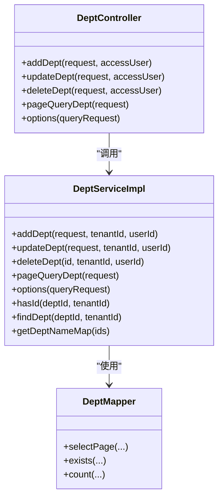
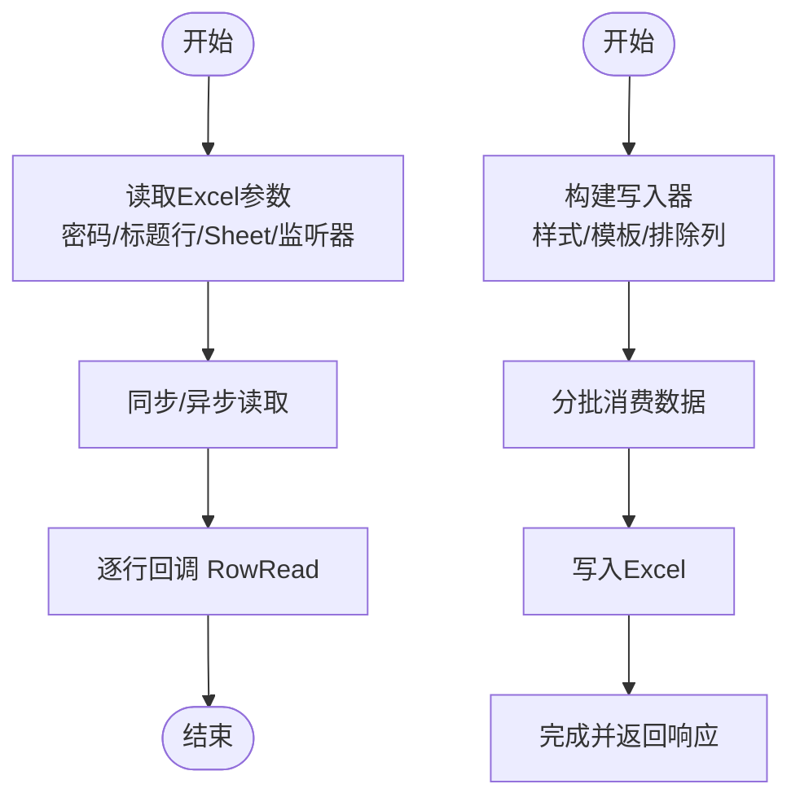
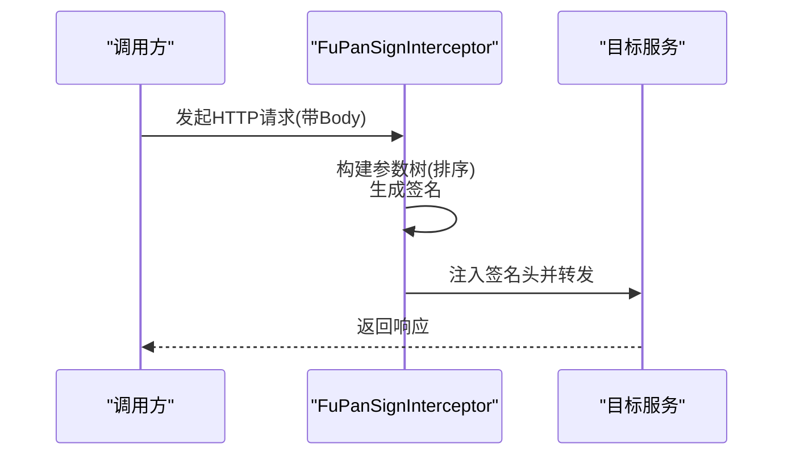
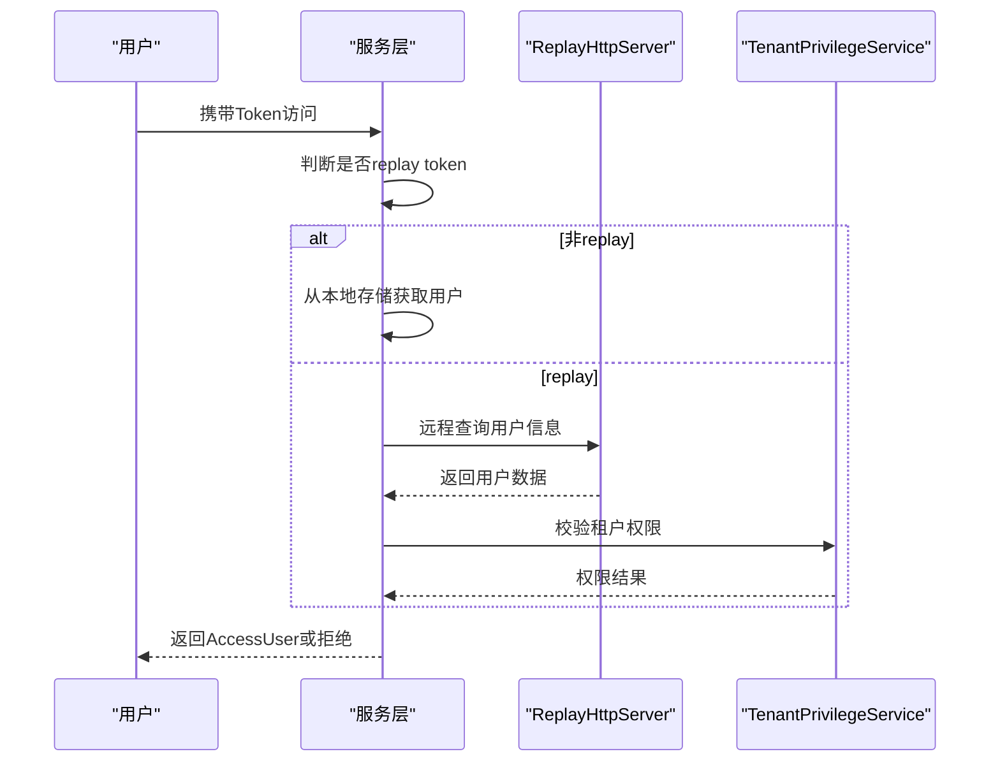
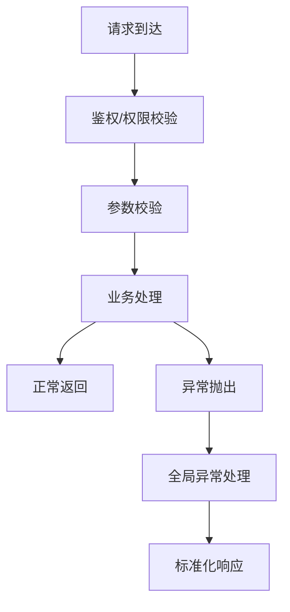
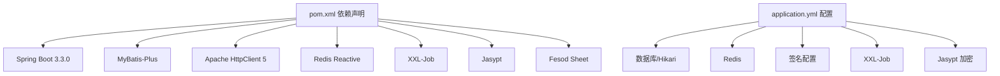

# 架构设计

<cite>
**本文引用的文件**
- [ServerApplication.java](file://src/main/java/com/jiuyu/governance/ServerApplication.java)
- [pom.xml](file://pom.xml)
- [application.yml](file://src/main/resources/application.yml)
- [ExcelTemplate.java](file://src/main/java/com/jiuyu/governance/plugins/excel/ExcelTemplate.java)
- [FuPanSignInterceptor.java](file://src/main/java/com/jiuyu/governance/plugins/http/FuPanSignInterceptor.java)
- [RestAuthenticationTokenProvide.java](file://src/main/java/com/jiuyu/governance/plugins/oauth/client/RestAuthenticationTokenProvide.java)
- [ReplaySignatureCalculate.java](file://src/main/java/com/jiuyu/governance/plugins/sign/ReplaySignatureCalculate.java)
- [SmsConfiguration.java](file://src/main/java/com/jiuyu/governance/plugins/sms/SmsConfiguration.java)
- [OssAutoConfiguration.java](file://src/main/java/com/jiuyu/governance/plugins/oss/config/OssAutoConfiguration.java)
- [XxlJobConfiguration.java](file://src/main/java/com/jiuyu/governance/plugins/xxljob/XxlJobConfiguration.java)
- [DeptServiceImpl.java](file://src/main/java/com/jiuyu/governance/business/org/service/impl/DeptServiceImpl.java)
- [DeptController.java](file://src/main/java/com/jiuyu/governance/business/org/controller/DeptController.java)
- [RequestUtil.java](file://src/main/java/com/jiuyu/governance/common/utils/RequestUtil.java)
- [GlobalExceptionHandler.java](file://src/main/java/com/jiuyu/governance/plugins/webmvc/GlobalExceptionHandler.java)
- [WebContextConfigure.java](file://src/main/java/com/jiuyu/governance/plugins/webmvc/WebContextConfigure.java)
</cite>

## 目录
1. [引言](#引言)
2. [项目结构](#项目结构)
3. [核心组件](#核心组件)
4. [架构总览](#架构总览)
5. [详细组件分析](#详细组件分析)
6. [依赖分析](#依赖分析)
7. [性能考量](#性能考量)
8. [故障排查指南](#故障排查指南)
9. [结论](#结论)
10. [附录](#附录)

## 引言
本项目为“fupan-governance-server”，是一个基于 Spring Boot 3 的企业级治理平台后端服务。其目标是通过清晰的分层架构（Controller/Service/Mapper）与插件化设计，支撑组织、绩效、RBAC、房间直播等多业务域的统一治理能力。同时，系统采用微服务思想在单体应用中落地，强调模块化、可扩展与可维护性；并通过分布式锁、任务调度、签名与鉴权、对象存储、短信等插件模块，实现高可用与安全可控。

## 项目结构
项目采用按业务域分包的组织方式，核心目录如下：
- business：业务域模块，如 org（组织）、performance（绩效）、rbac（权限）、room（直播）
- common：通用工具、异常、上下文等
- openfeign：对外/对内服务调用封装
- plugins：插件化能力，如 Excel、HTTP、OAuth、签名、短信、OSS、webmvc、xxljob
- resources：配置、XML 映射、SQL 初始化脚本

图表来源
- [ServerApplication.java:12-17](file://src/main/java/com/jiuyu/governance/ServerApplication.java#L12-L17)
- [DeptController.java:30-36](file://src/main/java/com/jiuyu/governance/business/org/controller/DeptController.java#L30-L36)
- [DeptServiceImpl.java:54-62](file://src/main/java/com/jiuyu/governance/business/org/service/impl/DeptServiceImpl.java#L54-L62)
- [ExcelTemplate.java:35](file://src/main/java/com/jiuyu/governance/plugins/excel/ExcelTemplate.java#L35)
- [FuPanSignInterceptor.java:33](file://src/main/java/com/jiuyu/governance/plugins/http/FuPanSignInterceptor.java#L33)
- [RestAuthenticationTokenProvide.java:31](file://src/main/java/com/jiuyu/governance/plugins/oauth/client/RestAuthenticationTokenProvide.java#L31)
- [ReplaySignatureCalculate.java:30](file://src/main/java/com/jiuyu/governance/plugins/sign/ReplaySignatureCalculate.java#L30)
- [SmsConfiguration.java:22](file://src/main/java/com/jiuyu/governance/plugins/sms/SmsConfiguration.java#L22)
- [OssAutoConfiguration.java:21](file://src/main/java/com/jiuyu/governance/plugins/oss/config/OssAutoConfiguration.java#L21)
- [XxlJobConfiguration.java:18](file://src/main/java/com/jiuyu/governance/plugins/xxljob/XxlJobConfiguration.java#L18)
- [GlobalExceptionHandler.java:55](file://src/main/java/com/jiuyu/governance/plugins/webmvc/GlobalExceptionHandler.java#L55)
- [WebContextConfigure.java:60](file://src/main/java/com/jiuyu/governance/plugins/webmvc/WebContextConfigure.java#L60)

章节来源
- [ServerApplication.java:12-17](file://src/main/java/com/jiuyu/governance/ServerApplication.java#L12-L17)
- [pom.xml:35-167](file://pom.xml#L35-L167)
- [application.yml:1-148](file://src/main/resources/application.yml#L1-L148)

## 核心组件
- 启动类：负责应用启动与容器初始化
- 控制器层：面向业务接口，负责参数接收、权限校验、调用服务层并返回标准响应
- 服务层：封装业务流程、事务控制、权限前置校验、缓存与依赖清理
- 插件化模块：Excel 导入导出、HTTP 客户端签名、OAuth 鉴权、签名计算、短信、OSS、Web 上下文、任务调度
- 公共模块：异常处理、请求工具、配置与资源

章节来源
- [DeptController.java:30-102](file://src/main/java/com/jiuyu/governance/business/org/controller/DeptController.java#L30-L102)
- [DeptServiceImpl.java:54-413](file://src/main/java/com/jiuyu/governance/business/org/service/impl/DeptServiceImpl.java#L54-L413)
- [GlobalExceptionHandler.java:55-376](file://src/main/java/com/jiuyu/governance/plugins/webmvc/GlobalExceptionHandler.java#L55-L376)
- [WebContextConfigure.java:60-248](file://src/main/java/com/jiuyu/governance/plugins/webmvc/WebContextConfigure.java#L60-L248)

## 架构总览
系统采用“三层分离 + 插件化”的架构设计：
- 分层架构
  - Controller：暴露 REST 接口，进行权限注解与参数校验
  - Service：编排业务、事务、权限前置校验、缓存与依赖清理
  - Mapper：数据访问层，结合 MyBatis-Plus 与 XML 映射
- 插件化架构
  - Excel：Fesod Sheet 封装，支持读取、写入、模板与样式
  - HTTP 客户端：Apache HttpClient 5 + Undertow Web 容器
  - OAuth：基于 AccessUser 的远程鉴权提供器
  - 签名：HMAC-SHA256 与 MD5 双模式签名计算
  - 短信：基于 Redis 缓存与 Feign 的短信服务
  - OSS：阿里云 OSS SDK，自动装配与模板封装
  - 任务调度：XXL-Job 执行器集成
  - Web 上下文：Jackson 模块、枚举序列化、CORS、Undertow WebSocket
- 微服务思想在单体中的体现
  - 通过插件化与配置开关实现能力的按需启用
  - 通过条件装配与属性驱动实现环境隔离与能力开关
  - 通过模块化目录与权限注解实现职责边界与可演进性

图表来源
- [DeptController.java:30-102](file://src/main/java/com/jiuyu/governance/business/org/controller/DeptController.java#L30-L102)
- [DeptServiceImpl.java:54-413](file://src/main/java/com/jiuyu/governance/business/org/service/impl/DeptServiceImpl.java#L54-L413)
- [ExcelTemplate.java:35](file://src/main/java/com/jiuyu/governance/plugins/excel/ExcelTemplate.java#L35)
- [FuPanSignInterceptor.java:33](file://src/main/java/com/jiuyu/governance/plugins/http/FuPanSignInterceptor.java#L33)
- [RestAuthenticationTokenProvide.java:31](file://src/main/java/com/jiuyu/governance/plugins/oauth/client/RestAuthenticationTokenProvide.java#L31)
- [ReplaySignatureCalculate.java:30](file://src/main/java/com/jiuyu/governance/plugins/sign/ReplaySignatureCalculate.java#L30)
- [SmsConfiguration.java:22](file://src/main/java/com/jiuyu/governance/plugins/sms/SmsConfiguration.java#L22)
- [OssAutoConfiguration.java:21](file://src/main/java/com/jiuyu/governance/plugins/oss/config/OssAutoConfiguration.java#L21)
- [XxlJobConfiguration.java:18](file://src/main/java/com/jiuyu/governance/plugins/xxljob/XxlJobConfiguration.java#L18)
- [WebContextConfigure.java:60-248](file://src/main/java/com/jiuyu/governance/plugins/webmvc/WebContextConfigure.java#L60-L248)
- [GlobalExceptionHandler.java:55-376](file://src/main/java/com/jiuyu/governance/plugins/webmvc/GlobalExceptionHandler.java#L55-L376)

## 详细组件分析

### 分层架构与职责边界
- 控制器层
  - 以 DeptController 为例，负责接收请求、权限注解校验、调用服务层并返回 ApiResponse
  - 权限注解与 GovernanceUser 注解确保访问控制
- 服务层
  - DeptServiceImpl 实现业务逻辑，包含新增/更新/删除/分页/选项查询等
  - 使用事务注解保证一致性，使用权限前置注解 BeforePermission 进行数据级权限校验
  - 通过连接器处理器管理组织关系与缓存清理
- 持久层
  - 使用 MyBatis-Plus 与 XML 映射，提供链式查询与分页能力

图表来源
- [DeptController.java:30-102](file://src/main/java/com/jiuyu/governance/business/org/controller/DeptController.java#L30-L102)
- [DeptServiceImpl.java:54-413](file://src/main/java/com/jiuyu/governance/business/org/service/impl/DeptServiceImpl.java#L54-L413)

章节来源
- [DeptController.java:30-102](file://src/main/java/com/jiuyu/governance/business/org/controller/DeptController.java#L30-L102)
- [DeptServiceImpl.java:54-413](file://src/main/java/com/jiuyu/governance/business/org/service/impl/DeptServiceImpl.java#L54-L413)

### 插件化架构设计

#### Excel 处理插件
- 能力概述
  - 支持读取 Excel（含密码、标题行、Sheet 选择、空行忽略）
  - 支持批量写入与模板导出，内置样式策略
  - 提供分批下载与全量下载两种模式
- 关键点
  - 使用 Fesod Sheet 与 Apache POI
  - 通过 BatchQuery 实现游标分批下载
  - 支持排除列、样式与模板注入

图表来源
- [ExcelTemplate.java:52-82](file://src/main/java/com/jiuyu/governance/plugins/excel/ExcelTemplate.java#L52-L82)
- [ExcelTemplate.java:200-230](file://src/main/java/com/jiuyu/governance/plugins/excel/ExcelTemplate.java#L200-L230)

章节来源
- [ExcelTemplate.java:35-370](file://src/main/java/com/jiuyu/governance/plugins/excel/ExcelTemplate.java#L35-L370)

#### HTTP 客户端与签名插件
- 能力概述
  - FuPanSignInterceptor 在请求发起前注入签名头（X-Signature、X-Timestamp、X-Nonce、X-Request-Id、X-App-Id）
  - ReplaySignatureCalculate 提供签名验证与生成，支持 HMAC-SHA256 与 MD5
- 关键点
  - 通过拦截器统一注入签名参数
  - 通过签名计算模块支持多种签名模式

图表来源
- [FuPanSignInterceptor.java:58-86](file://src/main/java/com/jiuyu/governance/plugins/http/FuPanSignInterceptor.java#L58-L86)

章节来源
- [FuPanSignInterceptor.java:33-111](file://src/main/java/com/jiuyu/governance/plugins/http/FuPanSignInterceptor.java#L33-L111)
- [ReplaySignatureCalculate.java:30-199](file://src/main/java/com/jiuyu/governance/plugins/sign/ReplaySignatureCalculate.java#L30-L199)

#### OAuth 认证与权限插件
- 能力概述
  - RestAuthenticationTokenProvide 基于远程调用与本地缓存提供 AccessUser
  - 支持 replay token 识别与租户权限校验
- 关键点
  - 使用 Caffeine 缓存短期 replay 用户信息
  - 结合 TenantPrivilegeService 校验租户可用性

图表来源
- [RestAuthenticationTokenProvide.java:62-92](file://src/main/java/com/jiuyu/governance/plugins/oauth/client/RestAuthenticationTokenProvide.java#L62-L92)

章节来源
- [RestAuthenticationTokenProvide.java:31-122](file://src/main/java/com/jiuyu/governance/plugins/oauth/client/RestAuthenticationTokenProvide.java#L31-L122)

#### 短信服务插件
- 能力概述
  - SmsConfiguration 条件化装配短信服务 Bean
  - 支持 mock 验证码提供者（固定/随机）
  - 基于 Redis 缓存验证码与错误次数
- 关键点
  - 通过 @ConditionalOnProperty 与 @ConditionalOnMissingBean 控制装配
  - 与 ReplayHttpServer 协作实现远程短信发送

章节来源
- [SmsConfiguration.java:22-58](file://src/main/java/com/jiuyu/governance/plugins/sms/SmsConfiguration.java#L22-L58)

#### OSS 对象存储插件
- 能力概述
  - OssAutoConfiguration 条件化装配 OssClientManager 与 OssTemplate
  - 通过 OssProperties 驱动桶配置
- 关键点
  - 仅在配置存在时启用
  - 日志记录初始化信息

章节来源
- [OssAutoConfiguration.java:21-40](file://src/main/java/com/jiuyu/governance/plugins/oss/config/OssAutoConfiguration.java#L21-L40)

#### 任务调度插件（XXL-Job）
- 能力概述
  - XxlJobConfiguration 条件化装配 XxlJobSpringExecutor
  - 通过 XxlJobProperties 配置调度中心地址、执行器地址、日志路径等
- 关键点
  - 仅在配置开启时启用
  - 日志输出关键配置项

章节来源
- [XxlJobConfiguration.java:18-78](file://src/main/java/com/jiuyu/governance/plugins/xxljob/XxlJobConfiguration.java#L18-L78)

#### Web 上下文与全局异常
- Web 上下文
  - WebContextConfigure 提供 Jackson 模块、枚举序列化、CORS、Undertow WebSocket、HttpClient 连接池
- 全局异常
  - GlobalExceptionHandler 统一捕获各类异常，返回标准化 ApiResponse

图表来源
- [GlobalExceptionHandler.java:94-376](file://src/main/java/com/jiuyu/governance/plugins/webmvc/GlobalExceptionHandler.java#L94-L376)
- [WebContextConfigure.java:172-216](file://src/main/java/com/jiuyu/governance/plugins/webmvc/WebContextConfigure.java#L172-L216)

章节来源
- [GlobalExceptionHandler.java:55-376](file://src/main/java/com/jiuyu/governance/plugins/webmvc/GlobalExceptionHandler.java#L55-L376)
- [WebContextConfigure.java:60-248](file://src/main/java/com/jiuyu/governance/plugins/webmvc/WebContextConfigure.java#L60-L248)

## 依赖分析
- 技术栈与版本
  - Spring Boot 3.3.0、Spring MVC、MyBatis-Plus、Undertow、Apache HttpClient 5、Redis Reactive、XXL-Job、Jasypt、Fesod Sheet
- 关键外部依赖
  - 分布式锁：distributed-starter-lock
  - 缓存：spring-boot-cache-starter、Caffeine
  - OAuth 客户端：oauth-client-starter
  - 签名：signature-spring-boot-starter
  - OSS：aliyun-sdk-oss
- 配置与资源
  - application.yml 中包含数据库、Redis、签名、xxl-job、jasypt 等配置
  - Maven 资源打包包含 XML 与 YAML

图表来源
- [pom.xml:35-167](file://pom.xml#L35-L167)
- [application.yml:42-148](file://src/main/resources/application.yml#L42-L148)

章节来源
- [pom.xml:18-32](file://pom.xml#L18-L32)
- [pom.xml:106-167](file://pom.xml#L106-L167)
- [application.yml:1-148](file://src/main/resources/application.yml#L1-L148)

## 性能考量
- Web 容器与连接池
  - Undertow 替代 Tomcat，具备更好的非阻塞性能
  - Apache HttpClient 5 连接池参数可调，支持连接复用与空闲回收
- 序列化与格式化
  - Jackson 模块化配置，统一时间与枚举序列化策略
- 缓存与降压
  - Caffeine 缓存短期 replay 用户信息
  - Redis 缓存短信验证码与锁资源
- IO 与导出
  - Excel 批量写入与流式输出，避免内存峰值
- 线程与优雅停机
  - 线程池命名、任务线程前缀、优雅停机宽限期配置

章节来源
- [WebContextConfigure.java:172-216](file://src/main/java/com/jiuyu/governance/plugins/webmvc/WebContextConfigure.java#L172-L216)
- [ExcelTemplate.java:200-230](file://src/main/java/com/jiuyu/governance/plugins/excel/ExcelTemplate.java#L200-L230)
- [application.yml:27-40](file://src/main/resources/application.yml#L27-L40)

## 故障排查指南
- 常见异常与处理
  - 业务异常：统一包装为 ApiResponse 失败
  - 鉴权异常：返回未授权提示
  - SQL 异常：MyBatis/数据库异常统一转为系统错误
  - 签名异常：返回禁止访问
  - 参数异常：参数缺失、类型不匹配、JSON 解析错误等
- 定位要点
  - 全局异常上下文包含访问用户、URI、查询参数与请求体摘要
  - 请求工具支持内网 IP 过滤与代理链解析
- 建议流程
  - 查看全局异常日志定位来源与参数
  - 核对权限注解与 BeforePermission 校验
  - 检查签名头与签名计算一致性
  - 核对 Redis 与缓存键前缀
  - 检查 XXL-Job 执行器配置与日志路径

章节来源
- [GlobalExceptionHandler.java:58-376](file://src/main/java/com/jiuyu/governance/plugins/webmvc/GlobalExceptionHandler.java#L58-L376)
- [RequestUtil.java:24-177](file://src/main/java/com/jiuyu/governance/common/utils/RequestUtil.java#L24-L177)

## 结论
本项目通过清晰的分层架构与插件化设计，在单体应用中实现了微服务化的可演进能力。以 Controller/Service/Mapper 三层分离为基础，结合 Excel、HTTP 签名、OAuth、签名计算、短信、OSS、Web 上下文与任务调度等插件模块，既满足了当前业务需求，也为未来扩展提供了稳定基座。配合全局异常处理与 Web 上下文配置，系统在安全性、稳定性与可维护性方面均具备良好表现。

## 附录
- 系统边界与组件交互
  - 控制器层与服务层：通过权限注解与事务注解明确边界
  - 服务层与插件层：通过条件装配与配置开关实现按需启用
  - 插件层之间：通过公共接口与配置属性解耦
- 数据流向
  - 请求从 Controller 进入，经权限与参数校验后进入 Service
  - Service 调用 Mapper 与插件模块，最终返回 ApiResponse
  - 异常在全局异常处理器统一捕获并格式化