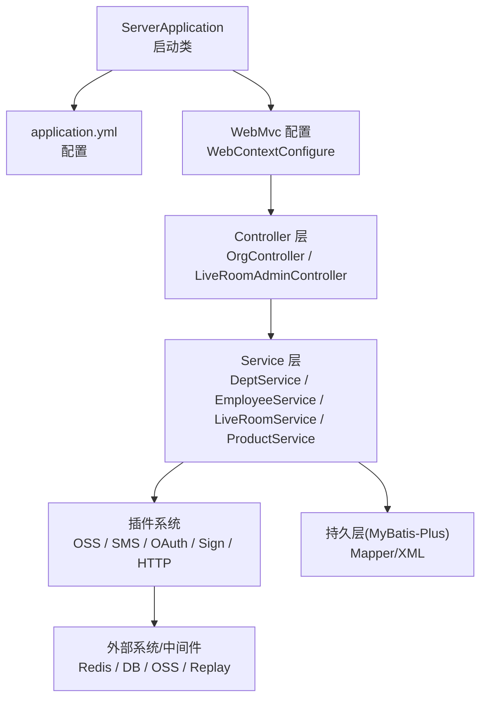
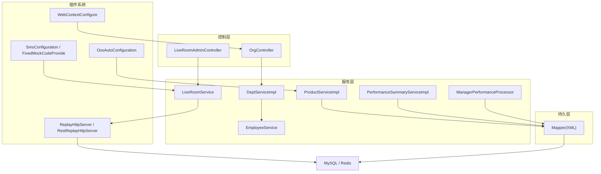
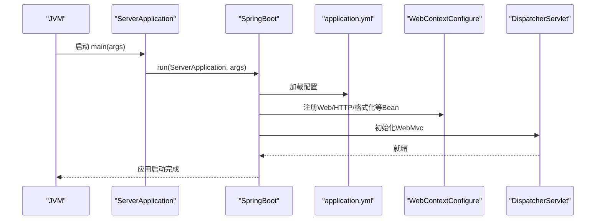
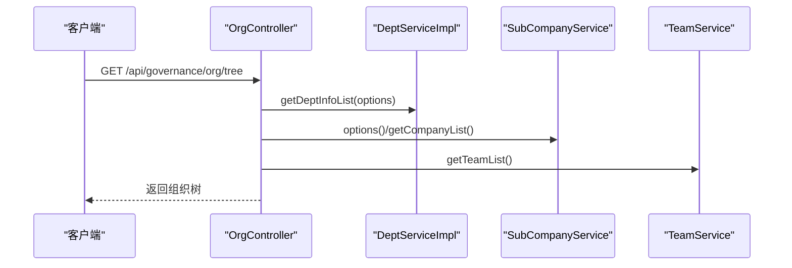
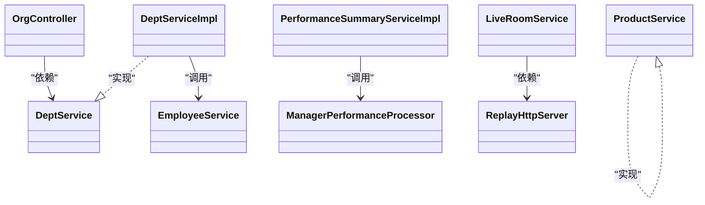
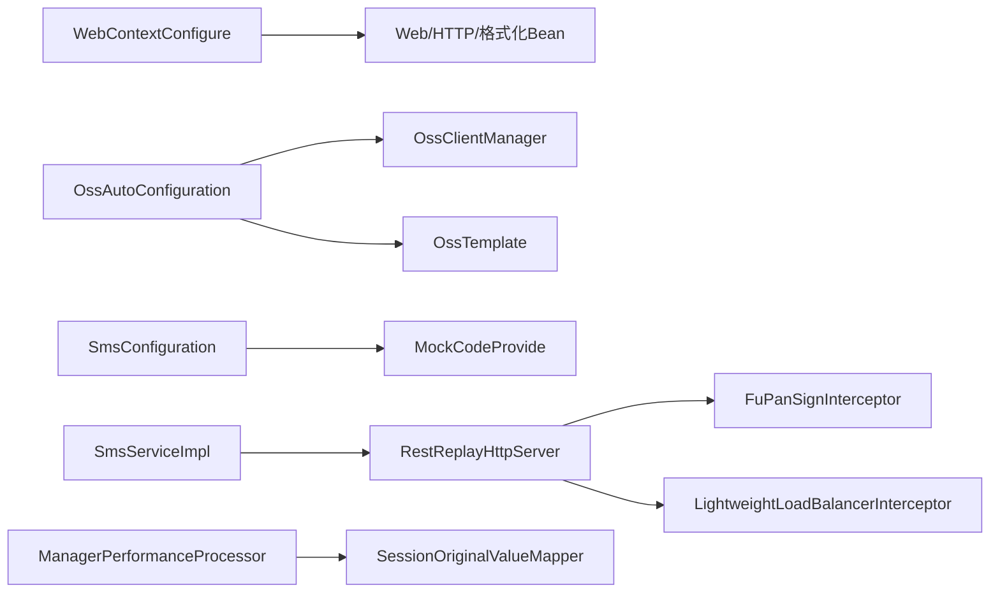
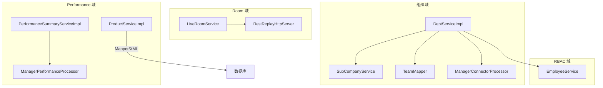
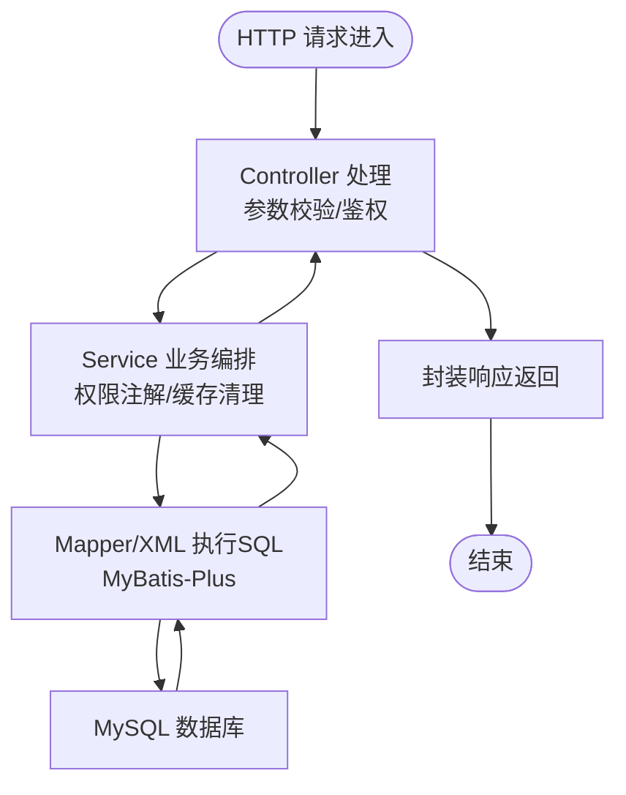
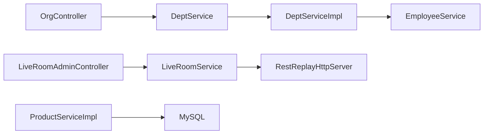

# 组件交互关系

<cite>
**本文引用的文件**   
- [ServerApplication.java](file://src/main/java/com/jiuyu/governance/ServerApplication.java)
- [application.yml](file://src/main/resources/application.yml)
- [pom.xml](file://pom.xml)
- [OrgController.java](file://src/main/java/com/jiuyu/governance/business/org/controller/OrgController.java)
- [DeptService.java](file://src/main/java/com/jiuyu/governance/business/org/service/DeptService.java)
- [DeptServiceImpl.java](file://src/main/java/com/jiuyu/governance/business/org/service/impl/DeptServiceImpl.java)
- [EmployeeService.java](file://src/main/java/com/jiuyu/governance/business/rbac/service/EmployeeService.java)
- [LiveRoomService.java](file://src/main/java/com/jiuyu/governance/business/room/service/LiveRoomService.java)
- [LiveRoomAdminController.java](file://src/main/java/com/jiuyu/governance/business/room/controller/LiveRoomAdminController.java)
- [ProductServiceImpl.java](file://src/main/java/com/jiuyu/governance/business/performance/service/impl/ProductServiceImpl.java)
- [PerformanceSummaryServiceImpl.java](file://src/main/java/com/jiuyu/governance/business/performance/service/impl/PerformanceSummaryServiceImpl.java)
- [ManagerPerformanceProcessor.java](file://src/main/java/com/jiuyu/governance/business/performance/service/impl/ManagerPerformanceProcessor.java)
- [WebContextConfigure.java](file://src/main/java/com/jiuyu/governance/plugins/webmvc/WebContextConfigure.java)
- [OssAutoConfiguration.java](file://src/main/java/com/jiuyu/governance/plugins/oss/config/OssAutoConfiguration.java)
- [SmsConfiguration.java](file://src/main/java/com/jiuyu/governance/plugins/sms/SmsConfiguration.java)
- [FixedMockCodeProvide.java](file://src/main/java/com/jiuyu/governance/plugins/sms/FixedMockCodeProvide.java)
- [SmsServiceImpl.java](file://src/main/java/com/jiuyu/governance/openfeign/replay/impl/SmsServiceImpl.java)
- [ReplayHttpServer.java](file://src/main/java/com/jiuyu/governance/common/replay/ReplayHttpServer.java)
- [RestReplayHttpServer.java](file://src/main/java/com/jiuyu/governance/common/replay/RestReplayHttpServer.java)
- [spy.properties](file://src/main/resources/spy.properties)
- [SKILL.md（业务-组织）](file://.trae/skills/business-org/SKILL.md)
- [SKILL.md（MyBatis-标准）](file://.trae/skills/mybatis-sql-standard/SKILL.md)
</cite>

## 目录
1. [简介](#简介)
2. [项目结构](#项目结构)
3. [核心组件](#核心组件)
4. [架构总览](#架构总览)
5. [详细组件分析](#详细组件分析)
6. [依赖分析](#依赖分析)
7. [性能考量](#性能考量)
8. [故障排查指南](#故障排查指南)
9. [结论](#结论)
10. [附录](#附录)

## 简介
本文件聚焦 fupan-governance-server 的组件交互关系，围绕 ServerApplication 启动类如何协调模块初始化、Controller 如何调用 Service、Service 如何依赖插件模块展开；同时梳理 org、performance、rbac、room 四个业务域之间的协作模式，解释插件系统与业务模块的交互方式（含 SPI 机制说明）、数据流向（从 HTTP 请求到数据库操作）以及配置文件在组件初始化中的作用与 Spring 容器的 Bean 生命周期与依赖注入。

## 项目结构
项目采用 Spring Boot 多模块分层设计，主要目录与职责如下：
- business：业务域模块，按领域拆分 org、performance、rbac、room
- common：公共工具、异常、常量与通用响应模型
- openfeign：对外/对内 HTTP 适配层（Replay 服务）
- plugins：插件化能力（webmvc、oss、sms、oauth、sign、http、useragent、webmvc、xxljob 等）
- resources：配置与 Mapper XML、SQL

图表来源
- [ServerApplication.java:12-17](file://src/main/java/com/jiuyu/governance/ServerApplication.java#L12-L17)
- [application.yml:1-148](file://src/main/resources/application.yml#L1-L148)
- [WebContextConfigure.java:22-173](file://src/main/java/com/jiuyu/governance/plugins/webmvc/WebContextConfigure.java#L22-L173)
- [OrgController.java:40-139](file://src/main/java/com/jiuyu/governance/business/org/controller/OrgController.java#L40-L139)
- [DeptServiceImpl.java:54-135](file://src/main/java/com/jiuyu/governance/business/org/service/impl/DeptServiceImpl.java#L54-L135)
- [OssAutoConfiguration.java:24-38](file://src/main/java/com/jiuyu/governance/plugins/oss/config/OssAutoConfiguration.java#L24-L38)
- [SmsConfiguration.java:21-35](file://src/main/java/com/jiuyu/governance/plugins/sms/SmsConfiguration.java#L21-L35)

章节来源
- [ServerApplication.java:12-17](file://src/main/java/com/jiuyu/governance/ServerApplication.java#L12-L17)
- [application.yml:1-148](file://src/main/resources/application.yml#L1-L148)

## 核心组件
- 启动类 ServerApplication：负责应用启动与组件扫描
- 配置文件 application.yml：定义数据库、Redis、MyBatis-Plus、签名、XXL-Job 等全局配置
- 插件系统：OSS、SMS、WebMvc、OAuth、HTTP、Sign、XxlJob 等
- 业务域 Service：org（DeptService）、rbac（EmployeeService）、room（LiveRoomService）、performance（ProductService、PerformanceSummaryServiceImpl、ManagerPerformanceProcessor）
- 控制器：OrgController、LiveRoomAdminController 等

章节来源
- [ServerApplication.java:12-17](file://src/main/java/com/jiuyu/governance/ServerApplication.java#L12-L17)
- [application.yml:1-148](file://src/main/resources/application.yml#L1-L148)
- [DeptService.java:25-127](file://src/main/java/com/jiuyu/governance/business/org/service/DeptService.java#L25-L127)
- [EmployeeService.java:23-299](file://src/main/java/com/jiuyu/governance/business/rbac/service/EmployeeService.java#L23-L299)
- [LiveRoomService.java:30-148](file://src/main/java/com/jiuyu/governance/business/room/service/LiveRoomService.java#L30-L148)
- [ProductServiceImpl.java:15-17](file://src/main/java/com/jiuyu/governance/business/performance/service/impl/ProductServiceImpl.java#L15-L17)

## 架构总览
系统采用“Controller → Service → Mapper/XML → 数据库”的经典分层架构，并通过插件系统扩展能力（如签名、负载均衡、OSS、短信、WebMvc）。业务域之间通过实体与服务边界解耦，跨域协作通过 OpenFeign Replay 通道与 RBAC/Room/Performance 的实体关联体现。

图表来源
- [OrgController.java:40-139](file://src/main/java/com/jiuyu/governance/business/org/controller/OrgController.java#L40-L139)
- [LiveRoomAdminController.java:1-23](file://src/main/java/com/jiuyu/governance/business/room/controller/LiveRoomAdminController.java#L1-L23)
- [DeptServiceImpl.java:54-135](file://src/main/java/com/jiuyu/governance/business/org/service/impl/DeptServiceImpl.java#L54-L135)
- [EmployeeService.java:23-299](file://src/main/java/com/jiuyu/governance/business/rbac/service/EmployeeService.java#L23-L299)
- [LiveRoomService.java:30-148](file://src/main/java/com/jiuyu/governance/business/room/service/LiveRoomService.java#L30-L148)
- [ProductServiceImpl.java:15-17](file://src/main/java/com/jiuyu/governance/business/performance/service/impl/ProductServiceImpl.java#L15-L17)
- [PerformanceSummaryServiceImpl.java:221-244](file://src/main/java/com/jiuyu/governance/business/performance/service/impl/PerformanceSummaryServiceImpl.java#L221-L244)
- [ManagerPerformanceProcessor.java:18-38](file://src/main/java/com/jiuyu/governance/business/performance/service/impl/ManagerPerformanceProcessor.java#L18-L38)
- [WebContextConfigure.java:22-173](file://src/main/java/com/jiuyu/governance/plugins/webmvc/WebContextConfigure.java#L22-L173)
- [OssAutoConfiguration.java:24-38](file://src/main/java/com/jiuyu/governance/plugins/oss/config/OssAutoConfiguration.java#L24-L38)
- [SmsConfiguration.java:21-35](file://src/main/java/com/jiuyu/governance/plugins/sms/SmsConfiguration.java#L21-L35)
- [RestReplayHttpServer.java:21-35](file://src/main/java/com/jiuyu/governance/common/replay/RestReplayHttpServer.java#L21-L35)

## 详细组件分析

### 启动类与配置初始化
- ServerApplication 使用 @SpringBootApplication 启动，交由 Spring Boot 自动装配
- application.yml 提供数据库、Redis、MyBatis-Plus、签名、XXL-Job 等全局配置，支撑各模块初始化
- WebContextConfigure 注册 Undertow WebSocket、CORS、日期格式化、HTTP 客户端连接池等 Bean
- Maven 资源配置确保 Mapper XML 与 YAML 资源被打包

图表来源
- [ServerApplication.java:12-17](file://src/main/java/com/jiuyu/governance/ServerApplication.java#L12-L17)
- [application.yml:1-148](file://src/main/resources/application.yml#L1-L148)
- [WebContextConfigure.java:22-173](file://src/main/java/com/jiuyu/governance/plugins/webmvc/WebContextConfigure.java#L22-L173)
- [pom.xml:204-222](file://pom.xml#L204-L222)

章节来源
- [ServerApplication.java:12-17](file://src/main/java/com/jiuyu/governance/ServerApplication.java#L12-L17)
- [application.yml:1-148](file://src/main/resources/application.yml#L1-L148)
- [WebContextConfigure.java:22-173](file://src/main/java/com/jiuyu/governance/plugins/webmvc/WebContextConfigure.java#L22-L173)
- [pom.xml:204-222](file://pom.xml#L204-L222)

### Controller → Service 协作
- OrgController 通过 @RequiredArgsConstructor 注入 SubCompanyService、DeptService、TeamService，提供组织树查询
- LiveRoomAdminController 通过注解权限与服务交互，调用 LiveRoomService 完成直播间的增删改查与排班属性设置

图表来源
- [OrgController.java:66-136](file://src/main/java/com/jiuyu/governance/business/org/controller/OrgController.java#L66-L136)
- [DeptServiceImpl.java:356-383](file://src/main/java/com/jiuyu/governance/business/org/service/impl/DeptServiceImpl.java#L356-L383)

章节来源
- [OrgController.java:40-139](file://src/main/java/com/jiuyu/governance/business/org/controller/OrgController.java#L40-L139)
- [DeptServiceImpl.java:54-135](file://src/main/java/com/jiuyu/governance/business/org/service/impl/DeptServiceImpl.java#L54-L135)

### Service 层依赖与业务协作
- DeptServiceImpl 依赖 SubCompanyService、TeamMapper、ManagerConnectorProcessor、EmployeeMapper，执行部门新增/修改/删除与分页查询，结合权限注解 BeforePermission 与缓存清理
- EmployeeService 提供员工增删改查、角色/岗位统计、登录/手机号校验等
- LiveRoomService 依赖 OpenFeign Replay 服务获取第三方主播信息，完成直播间的全生命周期管理
- ProductService/PerformanceSummaryServiceImpl/ManagerPerformanceProcessor 负责商品与绩效数据聚合与原始值保存

图表来源
- [OrgController.java:40-139](file://src/main/java/com/jiuyu/governance/business/org/controller/OrgController.java#L40-L139)
- [DeptServiceImpl.java:54-135](file://src/main/java/com/jiuyu/governance/business/org/service/impl/DeptServiceImpl.java#L54-L135)
- [EmployeeService.java:23-299](file://src/main/java/com/jiuyu/governance/business/rbac/service/EmployeeService.java#L23-L299)
- [LiveRoomService.java:30-148](file://src/main/java/com/jiuyu/governance/business/room/service/LiveRoomService.java#L30-L148)
- [ProductServiceImpl.java:15-17](file://src/main/java/com/jiuyu/governance/business/performance/service/impl/ProductServiceImpl.java#L15-L17)
- [PerformanceSummaryServiceImpl.java:221-244](file://src/main/java/com/jiuyu/governance/business/performance/service/impl/PerformanceSummaryServiceImpl.java#L221-L244)
- [ManagerPerformanceProcessor.java:18-38](file://src/main/java/com/jiuyu/governance/business/performance/service/impl/ManagerPerformanceProcessor.java#L18-L38)

章节来源
- [DeptServiceImpl.java:54-135](file://src/main/java/com/jiuyu/governance/business/org/service/impl/DeptServiceImpl.java#L54-L135)
- [LiveRoomService.java:30-148](file://src/main/java/com/jiuyu/governance/business/room/service/LiveRoomService.java#L30-L148)
- [ProductServiceImpl.java:15-17](file://src/main/java/com/jiuyu/governance/business/performance/service/impl/ProductServiceImpl.java#L15-L17)

### 插件系统与 SPI 机制
- WebMvc 插件：WebContextConfigure 注册 Undertow WebSocket、CORS、日期格式化、HTTP 客户端连接池等 Bean
- OSS 插件：OssAutoConfiguration 基于配置自动装配 OssClientManager 与 OssTemplate
- SMS 插件：SmsConfiguration 条件化装配 MockCodeProvide（固定/随机验证码），SmsServiceImpl 通过 ReplayHttpServer 调用下游服务
- HTTP 插件：RestReplayHttpServer 注入签名拦截器与轻量负载均衡拦截器，统一访问下游服务
- OAuth 插件：通过注解 BeforePermission 在 Service 方法执行前进行权限校验

图表来源
- [WebContextConfigure.java:22-173](file://src/main/java/com/jiuyu/governance/plugins/webmvc/WebContextConfigure.java#L22-L173)
- [OssAutoConfiguration.java:24-38](file://src/main/java/com/jiuyu/governance/plugins/oss/config/OssAutoConfiguration.java#L24-L38)
- [SmsConfiguration.java:21-35](file://src/main/java/com/jiuyu/governance/plugins/sms/SmsConfiguration.java#L21-L35)
- [FixedMockCodeProvide.java:13-39](file://src/main/java/com/jiuyu/governance/plugins/sms/FixedMockCodeProvide.java#L13-L39)
- [SmsServiceImpl.java:35-40](file://src/main/java/com/jiuyu/governance/openfeign/replay/impl/SmsServiceImpl.java#L35-L40)
- [RestReplayHttpServer.java:21-35](file://src/main/java/com/jiuyu/governance/common/replay/RestReplayHttpServer.java#L21-L35)
- [ManagerPerformanceProcessor.java:18-38](file://src/main/java/com/jiuyu/governance/business/performance/service/impl/ManagerPerformanceProcessor.java#L18-L38)

章节来源
- [WebContextConfigure.java:22-173](file://src/main/java/com/jiuyu/governance/plugins/webmvc/WebContextConfigure.java#L22-L173)
- [OssAutoConfiguration.java:24-38](file://src/main/java/com/jiuyu/governance/plugins/oss/config/OssAutoConfiguration.java#L24-L38)
- [SmsConfiguration.java:21-35](file://src/main/java/com/jiuyu/governance/plugins/sms/SmsConfiguration.java#L21-L35)
- [FixedMockCodeProvide.java:13-39](file://src/main/java/com/jiuyu/governance/plugins/sms/FixedMockCodeProvide.java#L13-L39)
- [SmsServiceImpl.java:35-40](file://src/main/java/com/jiuyu/governance/openfeign/replay/impl/SmsServiceImpl.java#L35-L40)
- [RestReplayHttpServer.java:21-35](file://src/main/java/com/jiuyu/governance/common/replay/RestReplayHttpServer.java#L21-L35)

### 业务域协作模式（org/performance/rbac/room）
- 组织域（org）：DeptServiceImpl 与 SubCompanyService/TeamMapper/ManagerConnectorProcessor 协作，保障组织层级约束与管理员关系维护
- RBAC 域（rbac）：EmployeeService 提供员工与权限相关能力，为其他域提供数据隔离与权限校验
- Room 域（room）：LiveRoomService 与 Replay 通道集成，完成第三方主播信息同步与直播间的全生命周期管理
- Performance 域（performance）：ProductServiceImpl、PerformanceSummaryServiceImpl、ManagerPerformanceProcessor 负责商品与绩效数据的聚合与原始值落库

图表来源
- [DeptServiceImpl.java:54-135](file://src/main/java/com/jiuyu/governance/business/org/service/impl/DeptServiceImpl.java#L54-L135)
- [EmployeeService.java:23-299](file://src/main/java/com/jiuyu/governance/business/rbac/service/EmployeeService.java#L23-L299)
- [LiveRoomService.java:30-148](file://src/main/java/com/jiuyu/governance/business/room/service/LiveRoomService.java#L30-L148)
- [RestReplayHttpServer.java:21-35](file://src/main/java/com/jiuyu/governance/common/replay/RestReplayHttpServer.java#L21-L35)
- [ProductServiceImpl.java:15-17](file://src/main/java/com/jiuyu/governance/business/performance/service/impl/ProductServiceImpl.java#L15-L17)
- [PerformanceSummaryServiceImpl.java:221-244](file://src/main/java/com/jiuyu/governance/business/performance/service/impl/PerformanceSummaryServiceImpl.java#L221-L244)
- [ManagerPerformanceProcessor.java:18-38](file://src/main/java/com/jiuyu/governance/business/performance/service/impl/ManagerPerformanceProcessor.java#L18-L38)

章节来源
- [SKILL.md（业务-组织）:1-39](file://.trae/skills/business-org/SKILL.md#L1-L39)
- [SKILL.md（MyBatis-标准）:1-55](file://.trae/skills/mybatis-sql-standard/SKILL.md#L1-L55)

### 数据流向图（HTTP 到数据库）
从一次 HTTP 请求到数据库操作的典型流程如下：

图表来源
- [OrgController.java:66-136](file://src/main/java/com/jiuyu/governance/business/org/controller/OrgController.java#L66-L136)
- [DeptServiceImpl.java:235-261](file://src/main/java/com/jiuyu/governance/business/org/service/impl/DeptServiceImpl.java#L235-L261)
- [application.yml:63-83](file://src/main/resources/application.yml#L63-L83)

章节来源
- [application.yml:63-83](file://src/main/resources/application.yml#L63-L83)

## 依赖分析
- 组件耦合与内聚
  - Controller 与 Service 通过接口解耦，Service 内部通过注解与工具类（如 Complete、CustomPage）提升内聚性
  - 插件系统通过条件化配置与自动装配降低对业务代码的侵入
- 外部依赖
  - MySQL、Redis、OSS、Replay 服务、XXL-Job
- 循环依赖
  - 未见直接循环依赖迹象；Service 间通过接口与工具链协作，避免直接互相引用

图表来源
- [OrgController.java:40-139](file://src/main/java/com/jiuyu/governance/business/org/controller/OrgController.java#L40-L139)
- [DeptServiceImpl.java:54-135](file://src/main/java/com/jiuyu/governance/business/org/service/impl/DeptServiceImpl.java#L54-L135)
- [LiveRoomAdminController.java:1-23](file://src/main/java/com/jiuyu/governance/business/room/controller/LiveRoomAdminController.java#L1-L23)
- [LiveRoomService.java:30-148](file://src/main/java/com/jiuyu/governance/business/room/service/LiveRoomService.java#L30-L148)
- [ProductServiceImpl.java:15-17](file://src/main/java/com/jiuyu/governance/business/performance/service/impl/ProductServiceImpl.java#L15-L17)

章节来源
- [OrgController.java:40-139](file://src/main/java/com/jiuyu/governance/business/org/controller/OrgController.java#L40-L139)
- [DeptServiceImpl.java:54-135](file://src/main/java/com/jiuyu/governance/business/org/service/impl/DeptServiceImpl.java#L54-L135)
- [LiveRoomAdminController.java:1-23](file://src/main/java/com/jiuyu/governance/business/room/controller/LiveRoomAdminController.java#L1-L23)
- [LiveRoomService.java:30-148](file://src/main/java/com/jiuyu/governance/business/room/service/LiveRoomService.java#L30-L148)
- [ProductServiceImpl.java:15-17](file://src/main/java/com/jiuyu/governance/business/performance/service/impl/ProductServiceImpl.java#L15-L17)

## 性能考量
- SQL 编写与索引：遵循“应用层组装优先、尽量避免 JOIN、显式租户隔离条件、避免大 IN 集合”等规范
- 连接池与线程：application.yml 配置 Hikari 连接池与线程前缀，WebMvc 使用 Undertow 并配置 WebSocket 缓冲
- 日志与监控：P6Spy 配置用于 SQL 观察与慢查询定位

章节来源
- [SKILL.md（MyBatis-标准）:1-55](file://.trae/skills/mybatis-sql-standard/SKILL.md#L1-L55)
- [application.yml:43-61](file://src/main/resources/application.yml#L43-L61)
- [WebContextConfigure.java:148-161](file://src/main/java/com/jiuyu/governance/plugins/webmvc/WebContextConfigure.java#L148-L161)
- [spy.properties:1-13](file://src/main/resources/spy.properties#L1-L13)

## 故障排查指南
- 插件 Bean 未生效
  - 检查条件化配置（如 SmsConfiguration、OssAutoConfiguration）是否满足属性开关
  - 确认 @ConditionalOnMissingBean 与 @ConditionalOnProperty 生效
- HTTP 调用失败
  - 核对 RestReplayHttpServer 的签名拦截器与负载均衡拦截器是否正确注入
  - 检查下游服务地址与 Token 配置
- 数据库连接问题
  - 校验 application.yml 中的数据库连接参数与驱动
  - 关注 Hikari 连接池参数与验证策略
- SQL 性能问题
  - 使用 spy.properties 观察 SQL，结合索引与“应用层组装”策略优化

章节来源
- [SmsConfiguration.java:21-35](file://src/main/java/com/jiuyu/governance/plugins/sms/SmsConfiguration.java#L21-L35)
- [OssAutoConfiguration.java:24-38](file://src/main/java/com/jiuyu/governance/plugins/oss/config/OssAutoConfiguration.java#L24-L38)
- [RestReplayHttpServer.java:21-35](file://src/main/java/com/jiuyu/governance/common/replay/RestReplayHttpServer.java#L21-L35)
- [application.yml:43-61](file://src/main/resources/application.yml#L43-L61)
- [spy.properties:1-13](file://src/main/resources/spy.properties#L1-L13)

## 结论
本系统通过清晰的分层与插件化设计实现了高内聚低耦合的组件交互：ServerApplication 统一启动与装配，Controller 专注请求编排，Service 负责业务编排与权限校验，插件系统提供横切能力（签名、负载均衡、OSS、短信、WebMvc），最终通过 MyBatis-Plus 与数据库交互。业务域（org/performance/rbac/room）通过实体与服务边界协同，形成稳定可扩展的治理能力。

## 附录
- 关键配置项参考
  - 数据库连接与 MyBatis-Plus：application.yml
  - Redis：application.yml
  - 签名与 HTTP 客户端：application.yml 与 RestReplayHttpServer
  - OSS：OssAutoConfiguration
  - SMS：SmsConfiguration 与 FixedMockCodeProvide
  - WebMvc：WebContextConfigure

章节来源
- [application.yml:1-148](file://src/main/resources/application.yml#L1-L148)
- [RestReplayHttpServer.java:21-35](file://src/main/java/com/jiuyu/governance/common/replay/RestReplayHttpServer.java#L21-L35)
- [OssAutoConfiguration.java:24-38](file://src/main/java/com/jiuyu/governance/plugins/oss/config/OssAutoConfiguration.java#L24-L38)
- [SmsConfiguration.java:21-35](file://src/main/java/com/jiuyu/governance/plugins/sms/SmsConfiguration.java#L21-L35)
- [WebContextConfigure.java:22-173](file://src/main/java/com/jiuyu/governance/plugins/webmvc/WebContextConfigure.java#L22-L173)