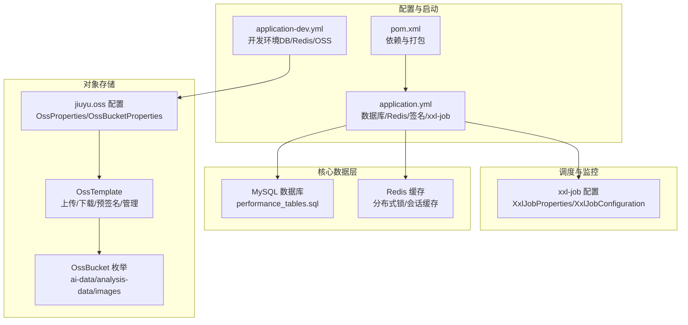
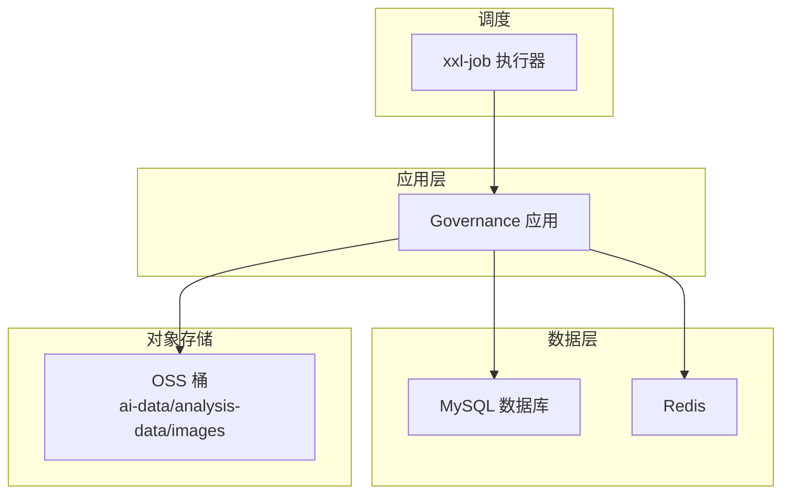
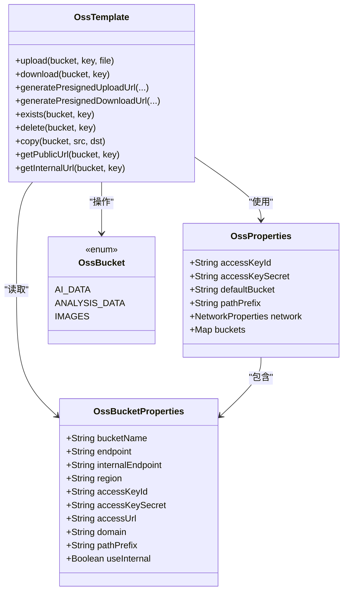
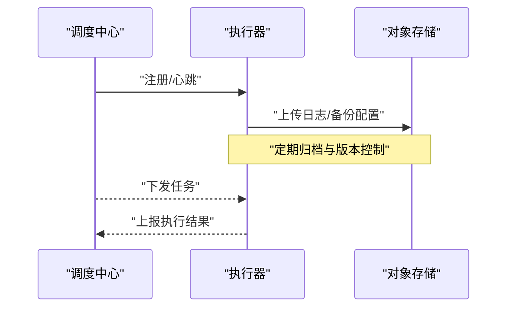
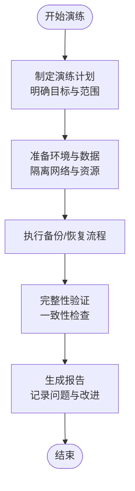
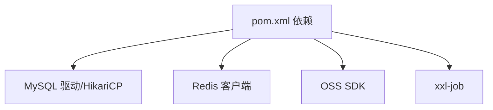

# 备份恢复

<cite>
**本文引用的文件**
- [application.yml](file://src/main/resources/application.yml)
- [application-dev.yml](file://src/main/resources/application-dev.yml)
- [pom.xml](file://pom.xml)
- [OssProperties.java](file://src/main/java/com/jiuyu/governance/plugins/oss/config/OssProperties.java)
- [OssBucketProperties.java](file://src/main/java/com/jiuyu/governance/plugins/oss/config/OssBucketProperties.java)
- [OssTemplate.java](file://src/main/java/com/jiuyu/governance/plugins/oss/core/OssTemplate.java)
- [OssBucket.java](file://src/main/java/com/jiuyu/governance/plugins/oss/enums/OssBucket.java)
- [AnalysisDataStorageService.java](file://src/main/java/com/jiuyu/governance/plugins/oss/storage/impl/AnalysisDataStorageService.java)
- [performance_tables.sql](file://src/main/resources/sql/performance_tables.sql)
- [XxlJobProperties.java](file://src/main/java/com/jiuyu/governance/plugins/xxljob/XxlJobProperties.java)
- [XxlJobConfiguration.java](file://src/main/java/com/jiuyu/governance/plugins/xxljob/XxlJobConfiguration.java)
- [GlobalExceptionHandler.java](file://src/main/java/com/jiuyu/governance/plugins/webmvc/GlobalExceptionHandler.java)
- [RestReplayHttpServer.java](file://src/main/java/com/jiuyu/governance/common/replay/RestReplayHttpServer.java)
- [LightweightLoadBalancerInterceptor.java](file://src/main/java/com/jiuyu/governance/plugins/http/LightweightLoadBalancerInterceptor.java)
- [ServiceInstance.java](file://src/main/java/com/jiuyu/governance/plugins/http/ServiceInstance.java)
- [ERROR_CODE_DICT.md](file://ERROR_CODE_DICT.md)
</cite>

## 目录
1. [简介](#简介)
2. [项目结构](#项目结构)
3. [核心组件](#核心组件)
4. [架构总览](#架构总览)
5. [详细组件分析](#详细组件分析)
6. [依赖分析](#依赖分析)
7. [性能考虑](#性能考虑)
8. [故障排查指南](#故障排查指南)
9. [结论](#结论)
10. [附录](#附录)

## 简介
本指南面向 fupan-governance-server 的备份与恢复工作，围绕数据库、Redis、对象存储（OSS）以及分布式任务调度（xxl-job）等关键数据与能力，制定从策略到演练的完整闭环。内容涵盖：
- 数据库全量/增量/实时备份方案
- 文件存储备份与版本管理
- 备份数据验证、完整性检查与恢复测试流程
- 灾难恢复计划（RTO/RPO）、故障转移与业务连续性
- 备份数据安全、访问控制与合规
- 备份恢复演练、应急预案与故障处理流程

## 项目结构
本项目基于 Spring Boot 3.3.0，使用 MyBatis-Plus、Redis、OSS SDK、xxl-job 等组件。关键配置位于 application.yml 与 application-dev.yml；OSS 配置通过 OssProperties 与 OssBucketProperties 注入；OssTemplate 提供统一的 OSS 操作封装；performance_tables.sql 描述了核心业务表结构。

图表来源
- [application.yml:41-148](file://src/main/resources/application.yml#L41-L148)
- [application-dev.yml:1-109](file://src/main/resources/application-dev.yml#L1-L109)
- [OssProperties.java:1-96](file://src/main/java/com/jiuyu/governance/plugins/oss/config/OssProperties.java#L1-L96)
- [OssBucketProperties.java:1-62](file://src/main/java/com/jiuyu/governance/plugins/oss/config/OssBucketProperties.java#L1-L62)
- [OssTemplate.java:1-358](file://src/main/java/com/jiuyu/governance/plugins/oss/core/OssTemplate.java#L1-L358)
- [OssBucket.java:1-61](file://src/main/java/com/jiuyu/governance/plugins/oss/enums/OssBucket.java#L1-L61)
- [XxlJobProperties.java:1-91](file://src/main/java/com/jiuyu/governance/plugins/xxljob/XxlJobProperties.java#L1-L91)
- [XxlJobConfiguration.java:1-77](file://src/main/java/com/jiuyu/governance/plugins/xxljob/XxlJobConfiguration.java#L1-L77)
- [performance_tables.sql:1-311](file://src/main/resources/sql/performance_tables.sql#L1-L311)

章节来源
- [application.yml:1-148](file://src/main/resources/application.yml#L1-L148)
- [application-dev.yml:1-109](file://src/main/resources/application-dev.yml#L1-L109)
- [pom.xml:1-226](file://pom.xml#L1-L226)

## 核心组件
- 数据库与连接池：HikariCP，支持连接池大小、心跳、生命周期等参数，配合 MyBatis-Plus 使用。
- Redis：用于分布式锁、会话缓存与权限存储，提升并发与一致性。
- OSS：统一的 OSS 模板封装，支持上传、下载、预签名、复制、删除、存在性判断等。
- xxl-job：分布式任务调度，支持日志路径与保留天数配置，便于离线任务的备份与恢复。

章节来源
- [application.yml:43-82](file://src/main/resources/application.yml#L43-L82)
- [application.yml:85-99](file://src/main/resources/application.yml#L85-L99)
- [OssTemplate.java:37-358](file://src/main/java/com/jiuyu/governance/plugins/oss/core/OssTemplate.java#L37-L358)
- [XxlJobProperties.java:64-91](file://src/main/java/com/jiuyu/governance/plugins/xxljob/XxlJobProperties.java#L64-L91)

## 架构总览
下图展示备份与恢复涉及的关键组件与数据流向，强调数据库、Redis、OSS 与调度系统的协同。

图表来源
- [application.yml:43-82](file://src/main/resources/application.yml#L43-L82)
- [application.yml:85-99](file://src/main/resources/application.yml#L85-L99)
- [OssTemplate.java:37-358](file://src/main/java/com/jiuyu/governance/plugins/oss/core/OssTemplate.java#L37-L358)
- [XxlJobConfiguration.java:21-77](file://src/main/java/com/jiuyu/governance/plugins/xxljob/XxlJobConfiguration.java#L21-L77)

## 详细组件分析

### 数据库备份策略
- 全量备份
  - 方案：使用数据库自带工具（如 MySQL mysqldump 或 Percona XtraBackup）在非高峰时段执行全量导出，建议压缩并分卷存储。
  - 存储：本地磁盘与远端对象存储（OSS）双写，确保冗余。
  - 验证：导出后执行 SQL 校验查询与表行数一致性检查。
- 增量备份
  - 方案：基于 binlog 的增量捕获，结合时间点恢复（PITR）能力，定期归档 binlog 至 OSS。
  - 触发：与业务低峰期对齐，避免影响在线查询。
- 实时备份
  - 方案：主从复制 + 延迟副本，结合只读副本用于报表与离线分析，降低主库压力。
  - 监控：监控复制延迟与一致性，异常告警与自动切换预案。
- 备份恢复测试
  - 流程：从 OSS 恢复至隔离环境，执行关键 SQL 与接口回归，验证数据完整性与业务可用性。
  - 指标：RPO（目标恢复点）≤ 5 分钟，RTO（目标恢复时间）≤ 30 分钟。

章节来源
- [application.yml:43-82](file://src/main/resources/application.yml#L43-L82)
- [performance_tables.sql:1-311](file://src/main/resources/sql/performance_tables.sql#L1-L311)

### Redis 备份策略
- 全量快照（RDB）
  - 方案：定时生成 RDB 快照，周期性上传至 OSS，保留多版本。
  - 验证：恢复后执行键空间扫描与热点键命中率核对。
- 增量记录（AOF）
  - 方案：开启 AOF，定期重写并上传至 OSS，作为 RDB 的补充。
- 恢复测试
  - 流程：在隔离实例加载 RDB/AOF，验证关键会话与锁状态恢复情况。

章节来源
- [application.yml:85-99](file://src/main/resources/application.yml#L85-L99)

### 对象存储（OSS）备份与版本管理
- 配置与使用
  - 配置项：jiuyu.oss.access-key-id、access-key-secret、default-bucket、path-prefix、network.server-operation/presigned-url、buckets.*。
  - 桶枚举：ai-data（AI数据）、analysis-data（分析数据）、images（图片）。
  - 模板能力：上传/下载/预签名、复制、删除、存在性判断、公开/内网 URL 生成。
- 备份策略
  - 结构化数据：将数据库导出文件（SQL/CSV）按日期目录上传至 OSS，设置生命周期策略自动归档。
  - 非结构化数据：对视频、图片等资源建立版本控制，保留历史版本以便回滚。
- 版本管理
  - 建议：启用 OSS 版本控制，按桶设置生命周期规则，区分标准/低频/归档存储类别。
- 备份验证
  - 校验：随机抽样对象下载比对校验和，验证预签名链接有效性与公开 URL 可达性。
- 恢复测试
  - 流程：从 OSS 恢复到测试环境，验证对象完整性与业务读取链路。

图表来源
- [OssProperties.java:1-96](file://src/main/java/com/jiuyu/governance/plugins/oss/config/OssProperties.java#L1-L96)
- [OssBucketProperties.java:1-62](file://src/main/java/com/jiuyu/governance/plugins/oss/config/OssBucketProperties.java#L1-L62)
- [OssTemplate.java:1-358](file://src/main/java/com/jiuyu/governance/plugins/oss/core/OssTemplate.java#L1-L358)
- [OssBucket.java:1-61](file://src/main/java/com/jiuyu/governance/plugins/oss/enums/OssBucket.java#L1-L61)

章节来源
- [OssProperties.java:1-96](file://src/main/java/com/jiuyu/governance/plugins/oss/config/OssProperties.java#L1-L96)
- [OssBucketProperties.java:1-62](file://src/main/java/com/jiuyu/governance/plugins/oss/config/OssBucketProperties.java#L1-L62)
- [OssTemplate.java:37-358](file://src/main/java/com/jiuyu/governance/plugins/oss/core/OssTemplate.java#L37-L358)
- [OssBucket.java:14-30](file://src/main/java/com/jiuyu/governance/plugins/oss/enums/OssBucket.java#L14-L30)

### 分析数据存储服务（OSS）
- AnalysisDataStorageService 明确绑定 ANALYSIS_DATA 桶，便于针对分析类数据制定专门的备份与版本策略。
- 建议：对该桶启用跨区域复制与版本控制，定期清理过期版本，保留合规期内的历史版本。

章节来源
- [AnalysisDataStorageService.java:1-27](file://src/main/java/com/jiuyu/governance/plugins/oss/storage/impl/AnalysisDataStorageService.java#L1-L27)

### xxl-job 调度备份与恢复
- 配置要点：admin 地址、访问令牌、执行器 app 名称、端口、日志路径与保留天数。
- 备份范围：执行器配置、任务脚本、日志文件（上传至 OSS）。
- 恢复流程：在新节点部署执行器，恢复配置与日志，验证任务调度与执行状态。

图表来源
- [XxlJobConfiguration.java:21-77](file://src/main/java/com/jiuyu/governance/plugins/xxljob/XxlJobConfiguration.java#L21-L77)
- [XxlJobProperties.java:18-70](file://src/main/java/com/jiuyu/governance/plugins/xxljob/XxlJobProperties.java#L18-L70)

章节来源
- [XxlJobProperties.java:1-91](file://src/main/java/com/jiuyu/governance/plugins/xxljob/XxlJobProperties.java#L1-L91)
- [XxlJobConfiguration.java:1-77](file://src/main/java/com/jiuyu/governance/plugins/xxljob/XxlJobConfiguration.java#L1-L77)

### 备份数据验证、完整性检查与恢复测试
- 验证清单
  - 数据库：导出/导入一致性校验、关键表行数比对、索引完整性检查。
  - Redis：RDB/AOF 加载后键空间扫描、热点键命中率核对。
  - OSS：对象下载校验和、预签名链接有效期与可达性、公开 URL 访问测试。
- 恢复测试
  - 测试环境：隔离网络与数据，模拟真实流量与并发。
  - 回归用例：核心接口与报表查询，验证业务逻辑与性能指标。

章节来源
- [OssTemplate.java:124-211](file://src/main/java/com/jiuyu/governance/plugins/oss/core/OssTemplate.java#L124-L211)

### 灾难恢复计划（RTO/RPO）
- RPO 目标：数据库 ≤ 5 分钟（binlog 增量 + 定时全量），Redis ≤ 1 分钟（RDB+AOF）。
- RTO 目标：数据库 ≤ 30 分钟，Redis ≤ 10 分钟，OSS 读取链路 ≤ 5 分钟。
- 故障转移：主从切换、只读副本接管、跨区域复制与回切。
- 业务连续性：灰度发布、蓝绿部署、自动扩缩容与熔断降级。

章节来源
- [application.yml:43-82](file://src/main/resources/application.yml#L43-L82)
- [application.yml:85-99](file://src/main/resources/application.yml#L85-L99)

### 备份数据安全、访问控制与合规
- 访问控制
  - 最小权限：为不同环境与角色配置独立 AK/SK 与 RAM 策略。
  - 网络策略：生产环境优先内网访问，预签名链接使用外网。
- 数据加密
  - 传输加密：TLS 1.2+；静态加密：启用 OSS 服务端加密或客户端加密。
- 合规
  - 生命周期：按法规要求设置保留期限与销毁策略。
  - 审计：记录备份/恢复操作日志，支持追溯。

章节来源
- [application-dev.yml:61-89](file://src/main/resources/application-dev.yml#L61-L89)
- [OssProperties.java:36-96](file://src/main/java/com/jiuyu/governance/plugins/oss/config/OssProperties.java#L36-L96)

### 备份恢复演练、应急预案与故障处理流程
- 演练计划
  - 月度：数据库与 Redis 全量恢复演练。
  - 季度：OSS 读取链路与版本回滚演练。
  - 年度：跨区域灾难恢复演练。
- 应急预案
  - 数据库：主从切换、PITR 恢复、只读副本接管。
  - Redis：RDB/AOF 加载、哨兵/集群切换。
  - OSS：跨区域复制回切、版本回滚。
- 故障处理
  - 快速定位：查看全局异常处理与日志采集。
  - 修复与验证：按验证清单逐项检查，完成回归测试。

图表来源
- [GlobalExceptionHandler.java:1-377](file://src/main/java/com/jiuyu/governance/plugins/webmvc/GlobalExceptionHandler.java#L1-L377)

章节来源
- [GlobalExceptionHandler.java:1-377](file://src/main/java/com/jiuyu/governance/plugins/webmvc/GlobalExceptionHandler.java#L1-L377)
- [ERROR_CODE_DICT.md:1-20](file://ERROR_CODE_DICT.md#L1-L20)

## 依赖分析
- 外部依赖
  - MySQL 驱动与连接池：HikariCP。
  - Redis 客户端：Jedis/lettuce（配置中使用 Jedis 属性）。
  - OSS SDK：阿里云 OSS Java SDK。
  - xxl-job：分布式任务调度核心。
- 内部依赖
  - OSS 配置类与模板类耦合度低，便于扩展与替换。
  - 调度配置通过注解条件装配，便于按需启用。

图表来源
- [pom.xml:35-167](file://pom.xml#L35-L167)

章节来源
- [pom.xml:1-226](file://pom.xml#L1-L226)

## 性能考虑
- 备份窗口与资源占用：错峰执行，避免与业务高峰期冲突。
- 并发与吞吐：分卷导出、并行上传、分片下载，提升整体效率。
- 缓存与一致性：备份期间的读写策略与一致性保证，必要时使用只读副本。

## 故障排查指南
- 全局异常处理
  - 统一捕获业务异常、SQL 异常、参数校验异常、签名异常等，便于快速定位问题根因。
- 负载均衡与故障转移
  - 轻量级负载均衡拦截器支持重试与故障实例剔除，提升链路稳定性。
- 日志与审计
  - xxl-job 执行器日志路径与保留天数配置，便于问题回溯。

章节来源
- [GlobalExceptionHandler.java:94-377](file://src/main/java/com/jiuyu/governance/plugins/webmvc/GlobalExceptionHandler.java#L94-L377)
- [LightweightLoadBalancerInterceptor.java:31-105](file://src/main/java/com/jiuyu/governance/plugins/http/LightweightLoadBalancerInterceptor.java#L31-L105)
- [ServiceInstance.java:14-35](file://src/main/java/com/jiuyu/governance/plugins/http/ServiceInstance.java#L14-L35)
- [XxlJobProperties.java:78-91](file://src/main/java/com/jiuyu/governance/plugins/xxljob/XxlJobProperties.java#L78-L91)

## 结论
通过全量/增量/实时备份相结合、OSS 版本化与跨区域复制、严格的验证与演练机制，以及完善的应急预案，fupan-governance-server 可实现高可靠的数据保护与业务连续性。建议持续优化备份策略与自动化流程，确保在极端情况下仍能满足既定的 RTO/RPO 指标。

## 附录
- 关键配置参考
  - 数据库连接池与 MyBatis-Plus：[application.yml:43-82](file://src/main/resources/application.yml#L43-L82)
  - Redis 连接与池化参数：[application.yml:85-99](file://src/main/resources/application.yml#L85-L99)
  - OSS 配置与网络策略：[application-dev.yml:61-89](file://src/main/resources/application-dev.yml#L61-L89)
  - xxl-job 执行器配置：[XxlJobProperties.java:18-70](file://src/main/java/com/jiuyu/governance/plugins/xxljob/XxlJobProperties.java#L18-L70)
- 数据模型参考
  - 业绩模块核心表结构：[performance_tables.sql:1-311](file://src/main/resources/sql/performance_tables.sql#L1-L311)