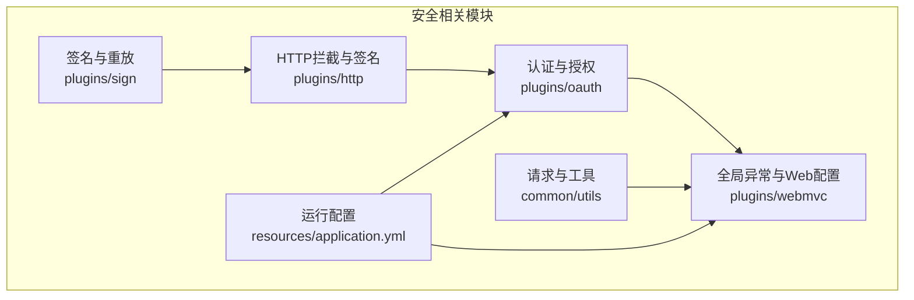
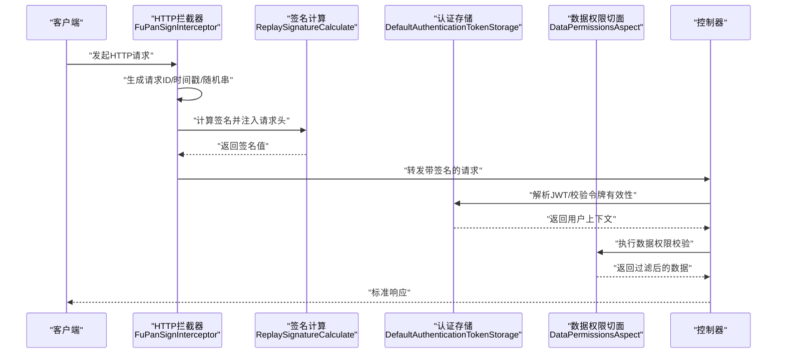
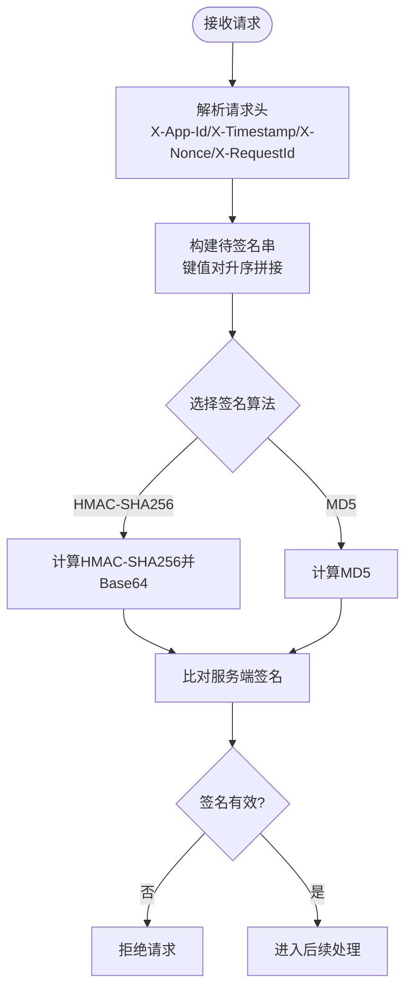
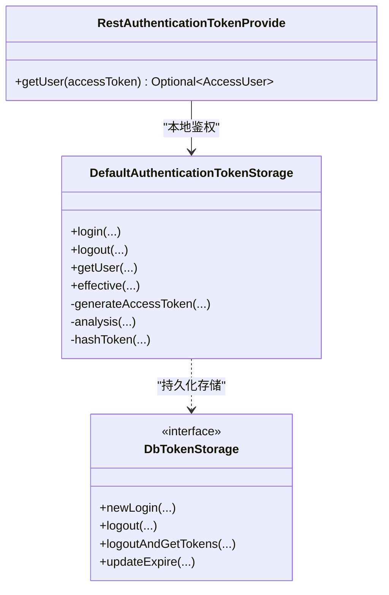
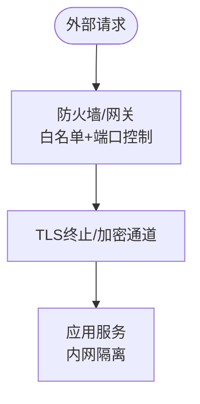
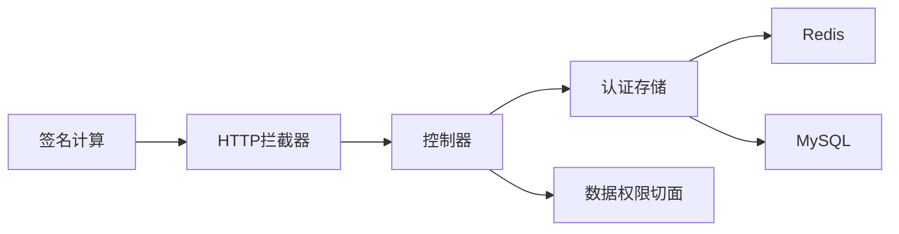

# 安全加固

<cite>
**本文引用的文件**   
- [ReplaySignatureCalculate.java](file://src/main/java/com/jiuyu/governance/plugins/sign/ReplaySignatureCalculate.java)
- [SignatureConstants.java](file://src/main/java/com/jiuyu/governance/plugins/sign/SignatureConstants.java)
- [FuPanSignInterceptor.java](file://src/main/java/com/jiuyu/governance/plugins/http/FuPanSignInterceptor.java)
- [FupanServerProperties.java](file://src/main/java/com/jiuyu/governance/common/replay/FupanServerProperties.java)
- [DefaultAuthenticationTokenStorage.java](file://src/main/java/com/jiuyu/governance/plugins/oauth/server/DefaultAuthenticationTokenStorage.java)
- [DbTokenStorage.java](file://src/main/java/com/jiuyu/governance/plugins/oauth/server/DbTokenStorage.java)
- [OauthConstant.java](file://src/main/java/com/jiuyu/governance/plugins/oauth/pojo/OauthConstant.java)
- [GlobalExceptionHandler.java](file://src/main/java/com/jiuyu/governance/plugins/webmvc/GlobalExceptionHandler.java)
- [RequestUtil.java](file://src/main/java/com/jiuyu/governance/common/utils/RequestUtil.java)
- [application.yml](file://src/main/resources/application.yml)
- [DataPermissionsAuthConfiguration.java](file://src/main/java/com/jiuyu/governance/plugins/oauth/data/DataPermissionsAuthConfiguration.java)
- [RbacTestController.java](file://src/main/java/com/jiuyu/governance/business/rbac/RbacTestController.java)
- [RestAuthenticationTokenProvide.java](file://src/main/java/com/jiuyu/governance/plugins/oauth/client/RestAuthenticationTokenProvide.java)
</cite>

## 目录
1. [简介](#简介)
2. [项目结构](#项目结构)
3. [核心组件](#核心组件)
4. [架构总览](#架构总览)
5. [详细组件分析](#详细组件分析)
6. [依赖分析](#依赖分析)
7. [性能考虑](#性能考虑)
8. [故障排查指南](#故障排查指南)
9. [结论](#结论)
10. [附录](#附录)

## 简介
本指南面向 fupan-governance-server 的安全加固工作，围绕 API 安全防护（签名验证、请求限流、防重放、参数校验）、身份认证与授权（JWT、OAuth2.0、RBAC）、网络安全配置（防火墙、TLS、内网隔离）、数据安全保护（传输与存储加密）、系统安全审计（操作日志、访问日志、安全事件监控）以及安全运维（漏洞扫描、渗透测试、补丁管理）等方面，结合代码库现有实现给出可落地的加固建议与最佳实践。

## 项目结构
项目采用分层与功能域划分的组织方式，安全相关能力主要分布在以下模块：
- 签名与重放防护：plugins/sign、plugins/http
- 身份认证与授权：plugins/oauth（server、client、data）
- 全局异常与日志：plugins/webmvc
- 网络与请求工具：common/utils
- 配置与资源：resources/application.yml

图表来源
- [ReplaySignatureCalculate.java:1-199](file://src/main/java/com/jiuyu/governance/plugins/sign/ReplaySignatureCalculate.java#L1-L199)
- [FuPanSignInterceptor.java:1-111](file://src/main/java/com/jiuyu/governance/plugins/http/FuPanSignInterceptor.java#L1-L111)
- [DefaultAuthenticationTokenStorage.java:1-387](file://src/main/java/com/jiuyu/governance/plugins/oauth/server/DefaultAuthenticationTokenStorage.java#L1-L387)
- [GlobalExceptionHandler.java:1-377](file://src/main/java/com/jiuyu/governance/plugins/webmvc/GlobalExceptionHandler.java#L1-L377)
- [RequestUtil.java:1-177](file://src/main/java/com/jiuyu/governance/common/utils/RequestUtil.java#L1-L177)
- [application.yml:1-148](file://src/main/resources/application.yml#L1-L148)

章节来源
- [application.yml:1-148](file://src/main/resources/application.yml#L1-L148)

## 核心组件
- 签名与重放防护：基于请求头与请求体构造待签名串，支持 HMAC-SHA256 与 MD5 签名算法，具备请求 ID、时间戳、随机串等防重放要素。
- 身份认证与授权：JWT 令牌签发与校验，Redis 缓存 + MySQL 存储双轨策略，支持按用户类型与租户维度的令牌管理与续期。
- 全局异常处理：统一捕获签名异常、参数异常、业务异常等，输出标准化响应并记录上下文。
- 数据权限：基于 AOP 的数据权限查询与执行切面，支持按租户/部门/小组/直播间等维度的权限控制。
- 网络与工具：内网 IP 判定、请求头解析、响应封装等基础能力。

章节来源
- [ReplaySignatureCalculate.java:1-199](file://src/main/java/com/jiuyu/governance/plugins/sign/ReplaySignatureCalculate.java#L1-L199)
- [SignatureConstants.java:1-81](file://src/main/java/com/jiuyu/governance/plugins/sign/SignatureConstants.java#L1-L81)
- [FuPanSignInterceptor.java:1-111](file://src/main/java/com/jiuyu/governance/plugins/http/FuPanSignInterceptor.java#L1-L111)
- [DefaultAuthenticationTokenStorage.java:1-387](file://src/main/java/com/jiuyu/governance/plugins/oauth/server/DefaultAuthenticationTokenStorage.java#L1-L387)
- [DbTokenStorage.java:1-70](file://src/main/java/com/jiuyu/governance/plugins/oauth/server/DbTokenStorage.java#L1-L70)
- [OauthConstant.java:1-81](file://src/main/java/com/jiuyu/governance/plugins/oauth/pojo/OauthConstant.java#L1-L81)
- [GlobalExceptionHandler.java:1-377](file://src/main/java/com/jiuyu/governance/plugins/webmvc/GlobalExceptionHandler.java#L1-L377)
- [DataPermissionsAuthConfiguration.java:1-78](file://src/main/java/com/jiuyu/governance/plugins/oauth/data/DataPermissionsAuthConfiguration.java#L1-L78)
- [RequestUtil.java:1-177](file://src/main/java/com/jiuyu/governance/common/utils/RequestUtil.java#L1-L177)

## 架构总览
下图展示从客户端到服务端的关键交互链路，涵盖签名、认证、授权与数据权限控制。

图表来源
- [FuPanSignInterceptor.java:58-86](file://src/main/java/com/jiuyu/governance/plugins/http/FuPanSignInterceptor.java#L58-L86)
- [ReplaySignatureCalculate.java:49-59](file://src/main/java/com/jiuyu/governance/plugins/sign/ReplaySignatureCalculate.java#L49-L59)
- [DefaultAuthenticationTokenStorage.java:230-255](file://src/main/java/com/jiuyu/governance/plugins/oauth/server/DefaultAuthenticationTokenStorage.java#L230-L255)
- [DataPermissionsAuthConfiguration.java:71-76](file://src/main/java/com/jiuyu/governance/plugins/oauth/data/DataPermissionsAuthConfiguration.java#L71-L76)

## 详细组件分析

### API 安全防护
- 签名验证机制
  - 请求头字段：应用ID、时间戳、随机串、请求ID、签名、签名算法类型等。
  - 待签名串构建：按键升序拼接，支持 JSON 请求体与表单参数两种模式。
  - 签名算法：默认 HMAC-SHA256，兼容 MD5。
  - 防重放：依赖请求 ID、时间戳与随机串，服务端可配置过期时间阈值。
- 请求限流
  - 代码库未发现内置限流实现，建议结合网关/中间件或 Spring Cloud Gateway 的限流策略实施。
- 防重放攻击
  - 服务端可基于请求 ID 去重缓存，结合时间戳窗口校验，拒绝过期请求。
- 参数校验
  - 全局异常处理对参数类型不匹配、缺失、JSON 解析错误等进行统一拦截与告警。

图表来源
- [SignatureConstants.java:14-44](file://src/main/java/com/jiuyu/governance/plugins/sign/SignatureConstants.java#L14-L44)
- [ReplaySignatureCalculate.java:107-163](file://src/main/java/com/jiuyu/governance/plugins/sign/ReplaySignatureCalculate.java#L107-L163)
- [FuPanSignInterceptor.java:58-86](file://src/main/java/com/jiuyu/governance/plugins/http/FuPanSignInterceptor.java#L58-L86)

章节来源
- [ReplaySignatureCalculate.java:49-59](file://src/main/java/com/jiuyu/governance/plugins/sign/ReplaySignatureCalculate.java#L49-L59)
- [SignatureConstants.java:14-44](file://src/main/java/com/jiuyu/governance/plugins/sign/SignatureConstants.java#L14-L44)
- [FuPanSignInterceptor.java:58-86](file://src/main/java/com/jiuyu/governance/plugins/http/FuPanSignInterceptor.java#L58-L86)
- [GlobalExceptionHandler.java:357-361](file://src/main/java/com/jiuyu/governance/plugins/webmvc/GlobalExceptionHandler.java#L357-L361)

### 身份认证与授权机制
- JWT 令牌管理
  - 令牌签发：包含用户ID、用户名、租户ID、用户类型、登录IP、元数据等声明，使用 HS256 签名。
  - 令牌校验：服务端解析并验证签名，同时检查缓存有效性与租户状态。
  - 续期策略：当剩余有效期低于阈值时，刷新 Redis 过期时间并更新数据库过期时间。
- OAuth2.0 集成
  - 提供基于远程调用的令牌鉴权提供器，支持跨系统鉴权与本地鉴权的统一入口。
- RBAC 权限控制
  - 通过注解与 AOP 切面实现数据权限与功能权限的统一控制，支持按公司/部门/小组/直播间等维度的权限模型。

图表来源
- [DefaultAuthenticationTokenStorage.java:143-255](file://src/main/java/com/jiuyu/governance/plugins/oauth/server/DefaultAuthenticationTokenStorage.java#L143-L255)
- [DbTokenStorage.java:14-70](file://src/main/java/com/jiuyu/governance/plugins/oauth/server/DbTokenStorage.java#L14-L70)
- [RestAuthenticationTokenProvide.java:62-70](file://src/main/java/com/jiuyu/governance/plugins/oauth/client/RestAuthenticationTokenProvide.java#L62-L70)

章节来源
- [DefaultAuthenticationTokenStorage.java:143-255](file://src/main/java/com/jiuyu/governance/plugins/oauth/server/DefaultAuthenticationTokenStorage.java#L143-L255)
- [DbTokenStorage.java:14-70](file://src/main/java/com/jiuyu/governance/plugins/oauth/server/DbTokenStorage.java#L14-L70)
- [RestAuthenticationTokenProvide.java:62-70](file://src/main/java/com/jiuyu/governance/plugins/oauth/client/RestAuthenticationTokenProvide.java#L62-L70)
- [OauthConstant.java:15-80](file://src/main/java/com/jiuyu/governance/plugins/oauth/pojo/OauthConstant.java#L15-L80)

### 网络安全配置
- 防火墙规则
  - 仅开放必要端口（如 8080），限制来源 IP 白名单，内网专用网段放通。
- SSL/TLS 加密
  - 通过 HTTP 客户端连接池配置启用 TLS，确保服务间通信加密。
- 内网隔离
  - 使用内网 IP 判定工具识别真实来源，避免代理伪造；结合 Nginx/网关做内网前置与证书终止。

图表来源
- [RequestUtil.java:71-129](file://src/main/java/com/jiuyu/governance/common/utils/RequestUtil.java#L71-L129)
- [WebContextConfigure.java:174-194](file://src/main/java/com/jiuyu/governance/plugins/webmvc/WebContextConfigure.java#L174-L194)

章节来源
- [RequestUtil.java:71-129](file://src/main/java/com/jiuyu/governance/common/utils/RequestUtil.java#L71-L129)
- [WebContextConfigure.java:174-194](file://src/main/java/com/jiuyu/governance/plugins/webmvc/WebContextConfigure.java#L174-L194)

### 数据安全保护
- 敏感数据加密
  - 令牌在返回前进行对称加密（Base64 输出），降低明文泄露风险。
- 传输加密
  - 服务间 HTTP 通信启用 TLS，确保中间环节不被窃听。
- 存储加密
  - 建议对数据库中涉及敏感字段（如手机号、身份证号）进行静态加密存储。

章节来源
- [DefaultAuthenticationTokenStorage.java:152-152](file://src/main/java/com/jiuyu/governance/plugins/oauth/server/DefaultAuthenticationTokenStorage.java#L152-L152)
- [WebContextConfigure.java:191-191](file://src/main/java/com/jiuyu/governance/plugins/webmvc/WebContextConfigure.java#L191-L191)

### 系统安全审计
- 操作日志与访问日志
  - 全局异常处理器记录请求上下文（URI、参数、Body），便于审计与追踪。
- 安全事件监控
  - 对签名异常、认证失败、参数异常等进行统一告警与日志落库。

章节来源
- [GlobalExceptionHandler.java:58-91](file://src/main/java/com/jiuyu/governance/plugins/webmvc/GlobalExceptionHandler.java#L58-L91)
- [GlobalExceptionHandler.java:357-361](file://src/main/java/com/jiuyu/governance/plugins/webmvc/GlobalExceptionHandler.java#L357-L361)

### 安全漏洞扫描、渗透测试与补丁管理
- 漏洞扫描
  - 定期对依赖库执行 SBOM 与漏洞扫描，修复高危与中危漏洞。
- 渗透测试
  - 对 API 端点进行黑盒/灰盒测试，覆盖越权、注入、重放、暴力破解等场景。
- 补丁管理
  - 建立版本基线与升级审批流程，优先修复 CVE 高危漏洞，灰度发布验证后全量上线。

## 依赖分析
- 组件耦合
  - 签名模块与拦截器强耦合，保证请求在进入业务前完成签名校验。
  - 认证存储依赖 Redis 与数据库，形成“缓存优先、持久兜底”的高可用架构。
  - 数据权限通过 AOP 切面与权限提供器解耦，便于扩展不同业务维度。
- 外部依赖
  - HTTP 客户端连接池启用 TLS，提升服务间通信安全性。
  - 配置文件集中管理密钥与过期时间等敏感参数。

图表来源
- [FuPanSignInterceptor.java:58-86](file://src/main/java/com/jiuyu/governance/plugins/http/FuPanSignInterceptor.java#L58-L86)
- [DefaultAuthenticationTokenStorage.java:143-255](file://src/main/java/com/jiuyu/governance/plugins/oauth/server/DefaultAuthenticationTokenStorage.java#L143-L255)
- [DataPermissionsAuthConfiguration.java:71-76](file://src/main/java/com/jiuyu/governance/plugins/oauth/data/DataPermissionsAuthConfiguration.java#L71-L76)

章节来源
- [application.yml:101-116](file://src/main/resources/application.yml#L101-L116)
- [WebContextConfigure.java:174-194](file://src/main/java/com/jiuyu/governance/plugins/webmvc/WebContextConfigure.java#L174-L194)

## 性能考虑
- 签名与校验
  - HMAC-SHA256 相对 MD5 更安全但开销更高，建议在高并发场景下评估 CPU 占用与缓存命中率。
- 令牌续期
  - 按阈值刷新 Redis 过期时间与数据库过期时间，避免频繁 IO。
- 数据权限
  - AOP 切面在查询路径上增加校验成本，建议对热点接口进行缓存与索引优化。

## 故障排查指南
- 签名失败
  - 检查请求头字段是否完整、签名算法是否一致、时间戳是否在允许窗口内。
- 认证失败
  - 核对 JWT 签名密钥、Redis 缓存键与租户状态。
- 参数异常
  - 查看全局异常日志中的请求上下文，定位具体字段与类型不匹配问题。
- 数据权限异常
  - 确认用户所属角色与目标资源的权限映射关系，检查切面是否生效。

章节来源
- [GlobalExceptionHandler.java:357-361](file://src/main/java/com/jiuyu/governance/plugins/webmvc/GlobalExceptionHandler.java#L357-L361)
- [DefaultAuthenticationTokenStorage.java:230-255](file://src/main/java/com/jiuyu/governance/plugins/oauth/server/DefaultAuthenticationTokenStorage.java#L230-L255)

## 结论
本指南基于现有代码实现了 API 安全、认证授权、数据与网络安全、审计与运维等维度的安全加固建议。建议在生产环境中补充请求限流、更严格的重放防护、数据库静态加密与密钥轮换机制，并持续开展漏洞扫描与渗透测试，确保系统整体安全可控。

## 附录
- 配置项参考
  - 签名过期时间、请求头名称等可在配置文件中集中管理。
- 示例接口
  - 控制器层可通过注解快速实现 RBAC 与登录校验。

章节来源
- [application.yml:101-116](file://src/main/resources/application.yml#L101-L116)
- [RbacTestController.java:36-88](file://src/main/java/com/jiuyu/governance/business/rbac/RbacTestController.java#L36-L88)