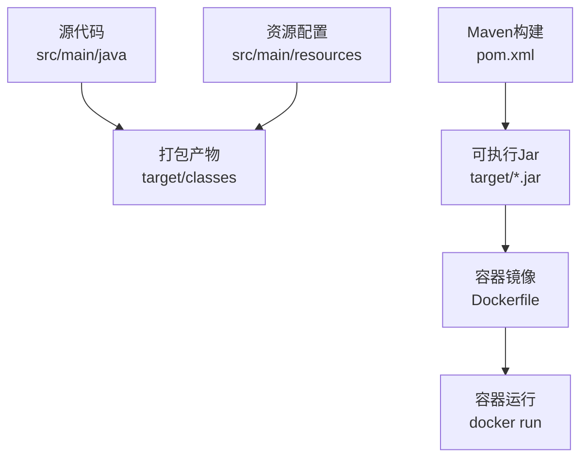
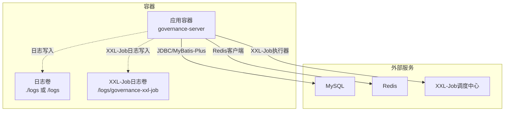
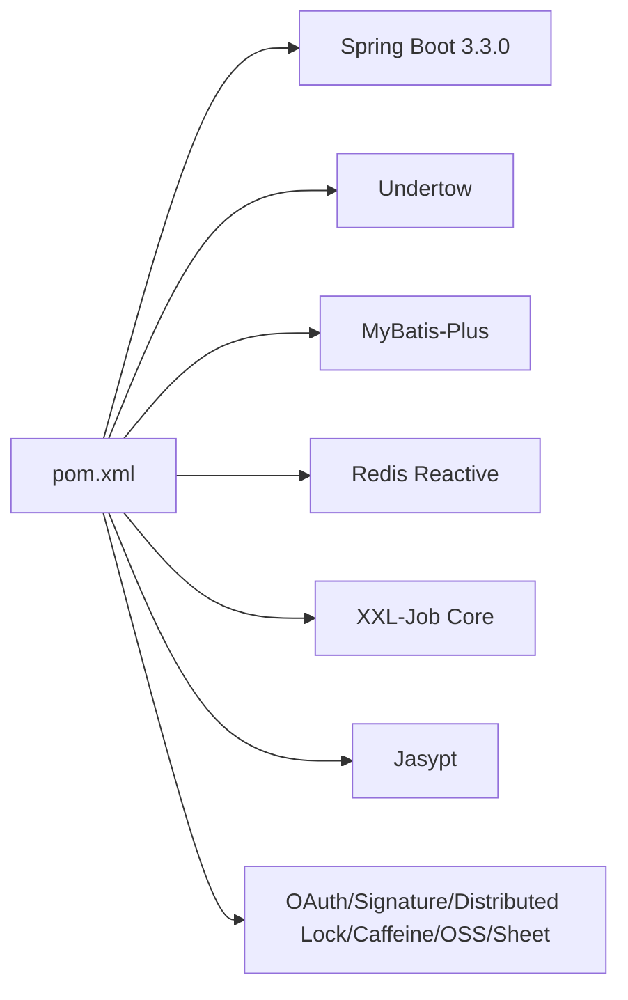

# Docker部署

<cite>
**本文引用的文件**
- [pom.xml](file://pom.xml)
- [ServerApplication.java](file://src/main/java/com/jiuyu/governance/ServerApplication.java)
- [application.yml](file://src/main/resources/application.yml)
- [application-dev.yml](file://src/main/resources/application-dev.yml)
- [application-local.yml](file://src/main/resources/application-local.yml)
- [logback-spring.xml](file://src/main/resources/logback-spring.xml)
- [XxlJobConfiguration.java](file://src/main/java/com/jiuyu/governance/plugins/xxljob/XxlJobConfiguration.java)
- [XxlJobProperties.java](file://src/main/java/com/jiuyu/governance/plugins/xxljob/XxlJobProperties.java)
- [WebContextConfigure.java](file://src/main/java/com/jiuyu/governance/plugins/webmvc/WebContextConfigure.java)
</cite>

## 目录
1. [简介](#简介)
2. [项目结构](#项目结构)
3. [核心组件](#核心组件)
4. [架构总览](#架构总览)
5. [详细组件分析](#详细组件分析)
6. [依赖分析](#依赖分析)
7. [性能考虑](#性能考虑)
8. [故障排查指南](#故障排查指南)
9. [结论](#结论)
10. [附录](#附录)

## 简介
本指南面向fupan-governance-server项目的Docker容器化部署，提供从镜像构建到容器运行、编排部署的完整方案。内容涵盖：
- 基于Maven构建的多阶段Dockerfile设计
- JDK版本与依赖安装策略
- 容器运行配置：端口映射、环境变量、卷挂载、网络
- docker-compose编排：服务定义、依赖关系、健康检查、资源限制
- 与MySQL、Redis、XXL-Job调度中心的连接配置与网络优化
- 常见部署问题与解决方案

## 项目结构
项目采用Spring Boot 3.3.0 + Undertow Web服务器 + MyBatis-Plus + Redis + XXL-Job的组合，核心运行入口为ServerApplication，配置文件位于resources目录下，日志通过Logback输出至文件或控制台。

图表来源
- [pom.xml:170-223](file://pom.xml#L170-L223)
- [ServerApplication.java:12-18](file://src/main/java/com/jiuyu/governance/ServerApplication.java#L12-L18)

章节来源
- [pom.xml:170-223](file://pom.xml#L170-L223)
- [ServerApplication.java:12-18](file://src/main/java/com/jiuyu/governance/ServerApplication.java#L12-L18)

## 核心组件
- Spring Boot应用入口：ServerApplication负责启动Web容器与业务模块。
- Undertow Web服务器：替代Tomcat，具备更好的性能与WebSocket支持。
- 配置体系：application.yml作为主配置，application-dev.yml与application-local.yml提供不同环境的差异化配置。
- 日志系统：Logback按环境输出到控制台或滚动文件，并支持SkyWalking日志采集。
- XXL-Job集成：通过XxlJobConfiguration与XxlJobProperties在启用时初始化执行器。

章节来源
- [ServerApplication.java:12-18](file://src/main/java/com/jiuyu/governance/ServerApplication.java#L12-L18)
- [application.yml:1-148](file://src/main/resources/application.yml#L1-L148)
- [logback-spring.xml:1-120](file://src/main/resources/logback-spring.xml#L1-L120)
- [XxlJobConfiguration.java:18-78](file://src/main/java/com/jiuyu/governance/plugins/xxljob/XxlJobConfiguration.java#L18-L78)
- [XxlJobProperties.java:13-92](file://src/main/java/com/jiuyu/governance/plugins/xxljob/XxlJobProperties.java#L13-L92)

## 架构总览
容器化部署涉及应用容器与外部依赖（MySQL、Redis、XXL-Job调度中心）之间的网络通信。应用通过环境变量注入数据库、Redis与XXL-Job配置，日志输出到挂载卷，端口对外暴露。

图表来源
- [application.yml:42-148](file://src/main/resources/application.yml#L42-L148)
- [XxlJobConfiguration.java:30-76](file://src/main/java/com/jiuyu/governance/plugins/xxljob/XxlJobConfiguration.java#L30-L76)

## 详细组件分析

### Dockerfile编写方案
- 基础镜像选择
  - 使用官方OpenJDK 17镜像作为基础，确保与项目Java版本一致。
  - 选择轻量级Alpine或Debian Slim作为发行版基础，平衡体积与兼容性。
- 多阶段构建
  - 第一阶段：使用Maven构建可执行Jar，开启spring-boot-maven-plugin的repackage目标。
  - 第二阶段：复制第一阶段生成的Jar到运行镜像，仅保留运行时所需依赖。
- JDK版本配置
  - 项目使用Java 17，Dockerfile中应保持一致，避免运行时兼容问题。
- 依赖安装
  - 运行镜像无需编译期依赖，仅需JRE与必要的系统库（如字体、CA证书等）。
- 用户与权限
  - 建议以非root用户运行，降低安全风险；确保日志卷目录具备写权限。
- 启动命令
  - 通过ENTRYPOINT或CMD指定java -jar启动，结合环境变量覆盖配置。

章节来源
- [pom.xml:18-32](file://pom.xml#L18-L32)
- [pom.xml:170-202](file://pom.xml#L170-L202)

### 容器运行配置
- 端口映射
  - 应用监听端口由配置决定，默认在application.yml中server.port为0（随机端口），开发环境为6626。生产建议固定端口并在Docker中显式映射。
- 环境变量传递
  - 数据库：db.host、db.name、db.username、db.password、db.driver-class-name、db.url-prefix、db.min-size、db.max-size、db.max-lifetime、db.idle-timeout、db.keepalive-time。
  - Redis：redis.ip、redis.password、redis.port、redis.database。
  - XXL-Job：xxl.job.admin.addresses、xxl.job.admin.access-token、xxl.job.admin.timeout、xxl.job.executor.app-name、xxl.job.executor.port、xxl.job.executor.log-path、xxl.job.executor.log-retention-days。
  - 日志：logging.file.path（建议映射为卷）。
  - 加密：JASYPT_PASSWORD（用于Jasypt解密）。
- 卷挂载
  - 日志文件：将日志根目录映射到宿主机，便于收集与持久化。
  - XXL-Job任务日志：将executor.log-path指向的目录映射到宿主机。
- 网络配置
  - 将容器加入与MySQL、Redis、XXL-Job相同的Docker网络，或使用服务名进行DNS解析。
  - 如需公网访问，确保防火墙放行对应端口。

章节来源
- [application.yml:1-148](file://src/main/resources/application.yml#L1-L148)
- [application-dev.yml:1-109](file://src/main/resources/application-dev.yml#L1-L109)
- [application-local.yml:1-101](file://src/main/resources/application-local.yml#L1-L101)

### docker-compose编排配置
- 服务定义
  - governance-server：应用服务，暴露HTTP端口，挂载日志卷，注入环境变量。
  - mysql：提供数据库服务，初始化schema（可使用sql脚本）。
  - redis：提供缓存服务。
  - xxl-job-admin：调度中心管理界面与调度服务。
- 依赖关系
  - governance-server依赖mysql与redis；XXL-Job执行器需要连接xxl-job-admin。
- 健康检查
  - 对mysql与redis添加健康检查，确保应用启动前依赖可用。
- 资源限制
  - 为应用容器设置内存与CPU限制，避免资源争抢。

章节来源
- [application.yml:42-148](file://src/main/resources/application.yml#L42-L148)
- [XxlJobConfiguration.java:30-76](file://src/main/java/com/jiuyu/governance/plugins/xxljob/XxlJobConfiguration.java#L30-L76)

### 容器启动命令示例
- 基于构建好的镜像启动应用容器，映射端口与挂载日志卷，注入必要环境变量。
- 示例命令（不含具体值）：docker run -d --name governance-server -p 8080:8080 -v /host/logs:/logs -e db.host=... -e redis.ip=... -e xxl.job.admin.addresses=... governance-server:latest

### 环境变量配置模板
- 数据库
  - db.host、db.name、db.username、db.password、db.driver-class-name、db.url-prefix、db.min-size、db.max-size、db.max-lifetime、db.idle-timeout、db.keepalive-time
- Redis
  - redis.ip、redis.password、redis.port、redis.database
- XXL-Job
  - xxl.job.admin.addresses、xxl.job.admin.access-token、xxl.job.admin.timeout、xxl.job.executor.app-name、xxl.job.executor.port、xxl.job.executor.log-path、xxl.job.executor.log-retention-days
- 日志
  - logging.file.path
- 加密
  - JASYPT_PASSWORD

章节来源
- [application.yml:42-148](file://src/main/resources/application.yml#L42-L148)
- [application-dev.yml:1-109](file://src/main/resources/application-dev.yml#L1-L109)
- [application-local.yml:1-101](file://src/main/resources/application-local.yml#L1-L101)

### 与MySQL、Redis、XXL-Job的连接配置与网络优化
- MySQL
  - 使用Hikari连接池配置，合理设置连接池大小与生命周期，避免频繁创建销毁连接。
  - 在容器网络中通过服务名或内部IP访问，减少跨主机延迟。
- Redis
  - 通过spring.data.redis配置连接参数，注意连接超时与池大小，避免阻塞。
- XXL-Job
  - 执行器端口默认9999，可通过环境变量覆盖；日志路径建议映射到宿主机卷。
  - 与调度中心建立稳定连接，确保心跳与任务调度正常。

章节来源
- [application.yml:42-100](file://src/main/resources/application.yml#L42-L100)
- [application.yml:124-148](file://src/main/resources/application.yml#L124-L148)
- [XxlJobConfiguration.java:30-76](file://src/main/java/com/jiuyu/governance/plugins/xxljob/XxlJobConfiguration.java#L30-L76)
- [XxlJobProperties.java:58-90](file://src/main/java/com/jiuyu/governance/plugins/xxljob/XxlJobProperties.java#L58-L90)

## 依赖分析
- 运行时依赖
  - Spring Boot Starter Web（Undertow）、MyBatis-Plus、Redis Reactive、XXL-Job Core、Jasypt加密等。
- 构建时依赖
  - spring-boot-maven-plugin用于生成可执行Jar。
- 容器化影响
  - 运行镜像仅包含JRE与运行时依赖，不包含Maven与编译工具链。

图表来源
- [pom.xml:35-167](file://pom.xml#L35-L167)

章节来源
- [pom.xml:35-167](file://pom.xml#L35-L167)

## 性能考虑
- Undertow与线程池
  - Undertow作为嵌入式Web服务器，具备较好的并发能力；结合spring.task.execution.pool配置可提升异步任务吞吐。
- 日志性能
  - Logback采用异步Appender与滚动策略，建议在容器中将日志目录映射到高性能磁盘。
- 连接池优化
  - 数据库连接池大小与生命周期需根据业务峰值调优；Redis连接池大小与超时需与容器资源配额匹配。
- XXL-Job执行器
  - 合理设置执行器端口与日志路径，避免磁盘IO瓶颈；日志保留天数按容量规划。

章节来源
- [WebContextConfigure.java:148-161](file://src/main/java/com/jiuyu/governance/plugins/webmvc/WebContextConfigure.java#L148-L161)
- [logback-spring.xml:39-73](file://src/main/resources/logback-spring.xml#L39-L73)
- [application.yml:27-39](file://src/main/resources/application.yml#L27-L39)
- [application.yml:46-58](file://src/main/resources/application.yml#L46-L58)
- [application.yml:92-99](file://src/main/resources/application.yml#L92-L99)

## 故障排查指南
- 启动失败
  - 检查JVM参数与Java版本是否匹配；确认端口未被占用。
- 数据库连接异常
  - 核对db.host、db.name、db.username、db.password与驱动类名；确认容器网络可达。
- Redis连接异常
  - 核对redis.ip、redis.port、redis.password、redis.database；检查密码与网络ACL。
- XXL-Job无法注册
  - 核对xxl.job.admin.addresses与access-token；确认执行器端口与日志路径可写。
- 日志无法写入
  - 确认logging.file.path映射的卷存在且具备写权限；检查容器用户权限。
- 加密配置问题
  - 确认JASYPT_PASSWORD环境变量已正确注入。

章节来源
- [application.yml:42-148](file://src/main/resources/application.yml#L42-L148)
- [application-local.yml:22-26](file://src/main/resources/application-local.yml#L22-L26)
- [logback-spring.xml:8-12](file://src/main/resources/logback-spring.xml#L8-L12)

## 结论
通过多阶段Dockerfile与合理的环境变量注入，fupan-governance-server可在容器环境中稳定运行。配合docker-compose实现与MySQL、Redis、XXL-Job的编排部署，结合日志与连接池优化，可满足生产级的性能与可靠性要求。建议在上线前完成端到端连通性测试与资源配额评估。

## 附录
- Dockerfile要点
  - 基于OpenJDK 17镜像
  - 多阶段构建：构建阶段使用Maven，运行阶段仅复制可执行Jar
  - 非root用户运行
  - 显式暴露应用端口
- docker-compose要点
  - 定义服务、依赖、健康检查、资源限制
  - 映射日志卷与XXL-Job日志卷
  - 注入所有必要环境变量
- 启动命令示例
  - docker run -d --name governance-server -p 8080:8080 -v /host/logs:/logs -e db.host=... -e redis.ip=... -e xxl.job.admin.addresses=... governance-server:latest