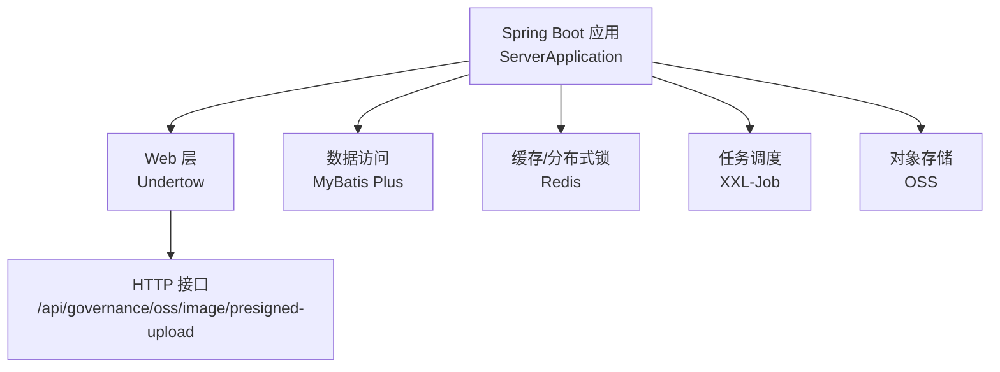
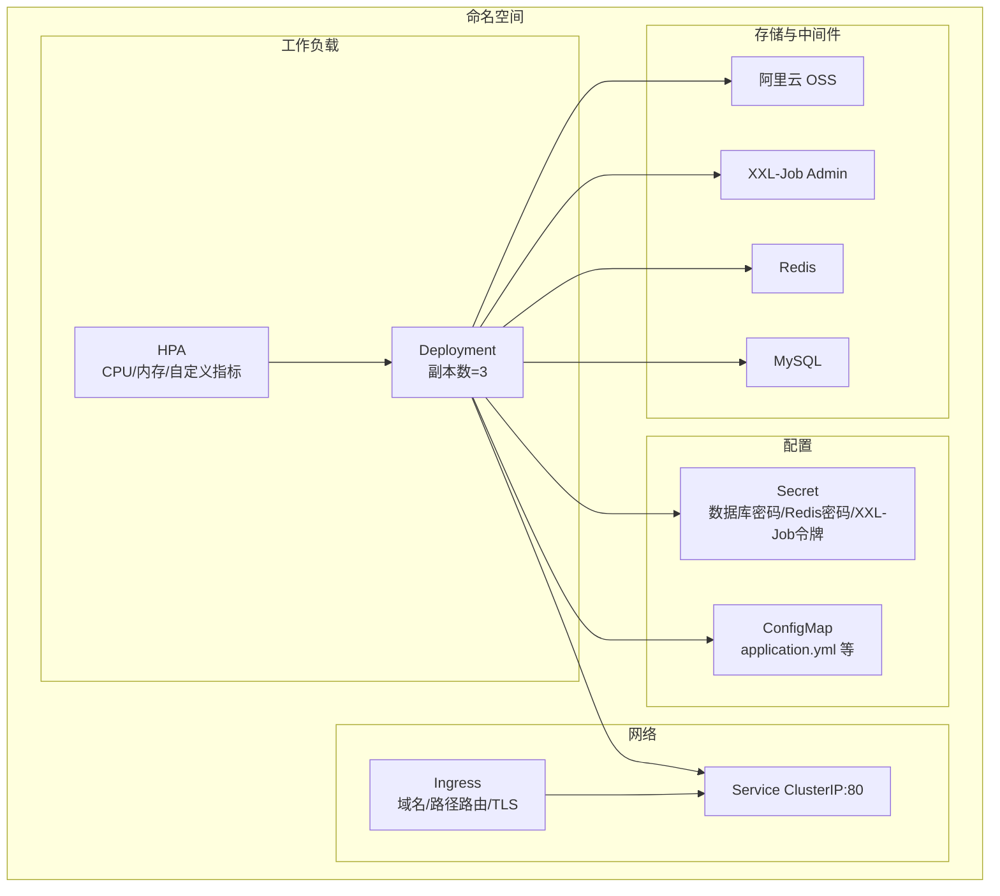
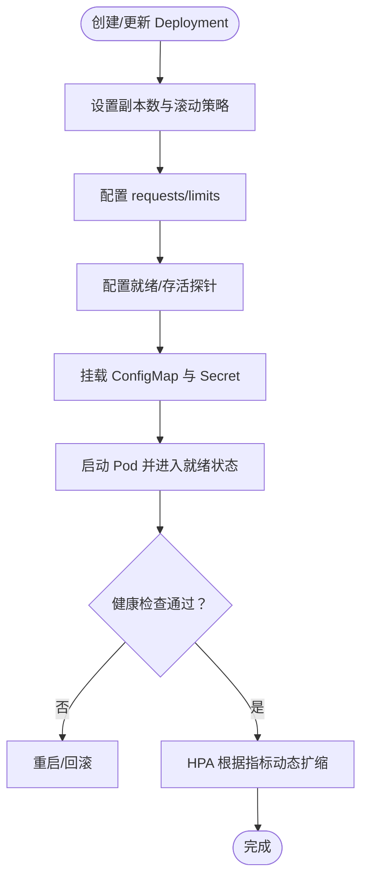
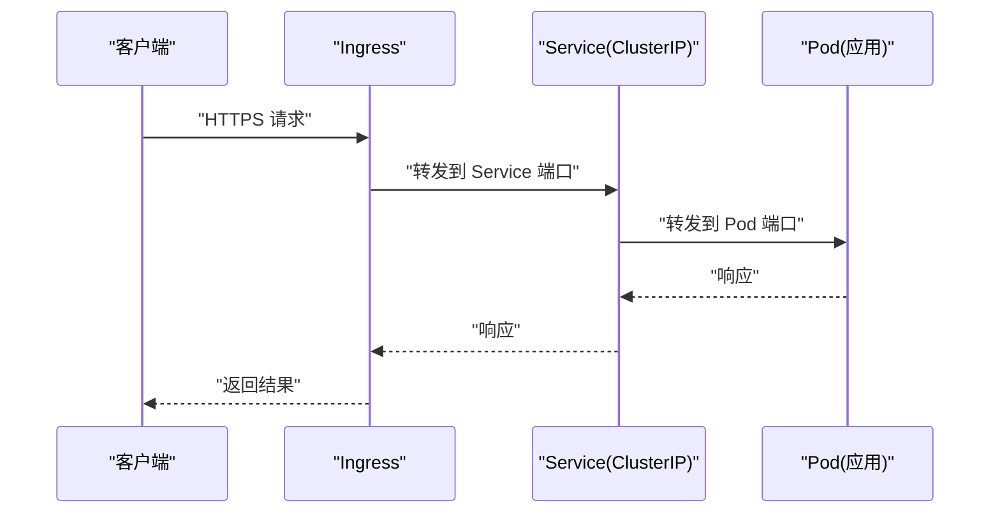
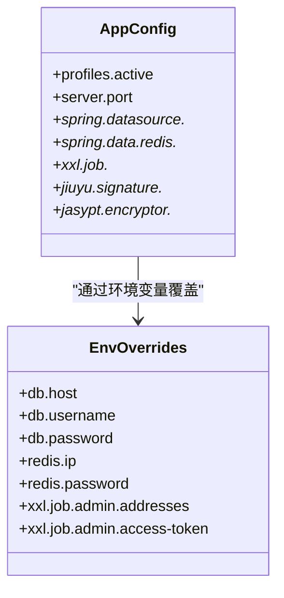
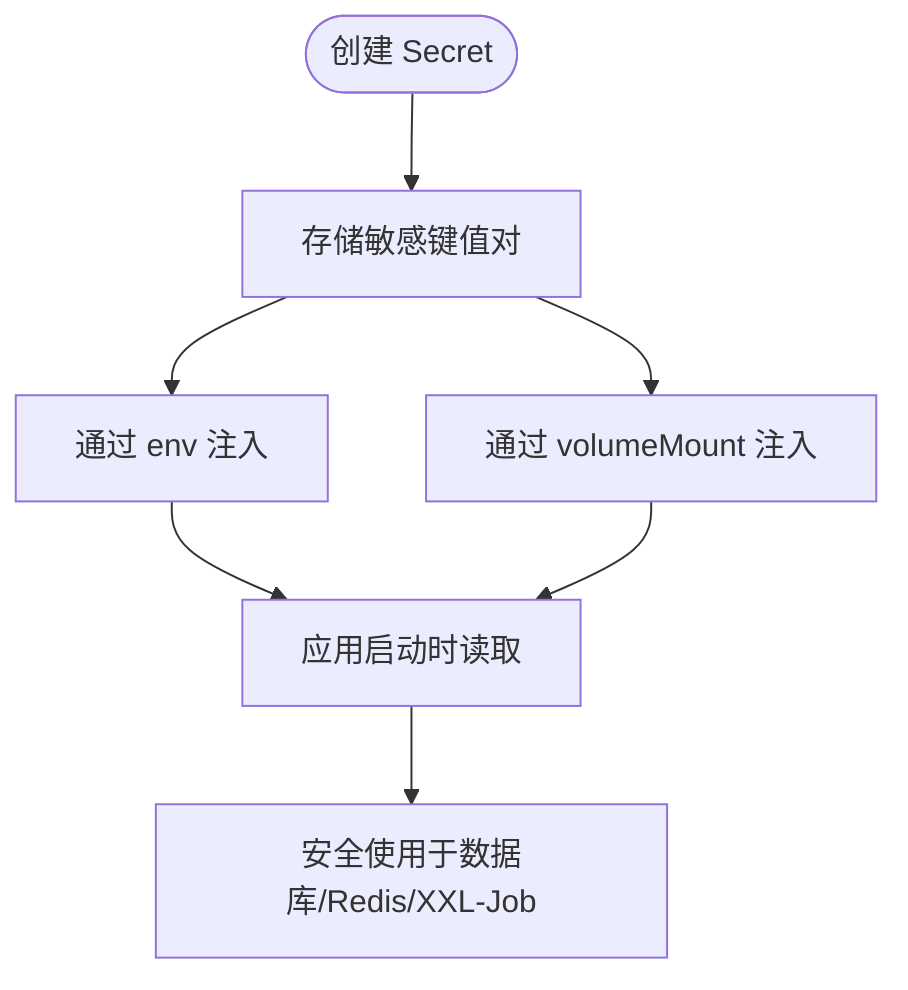
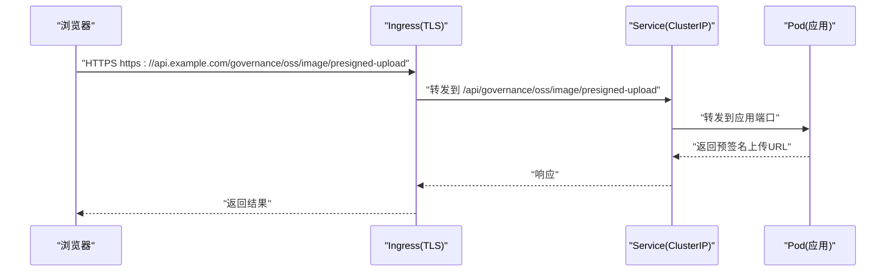
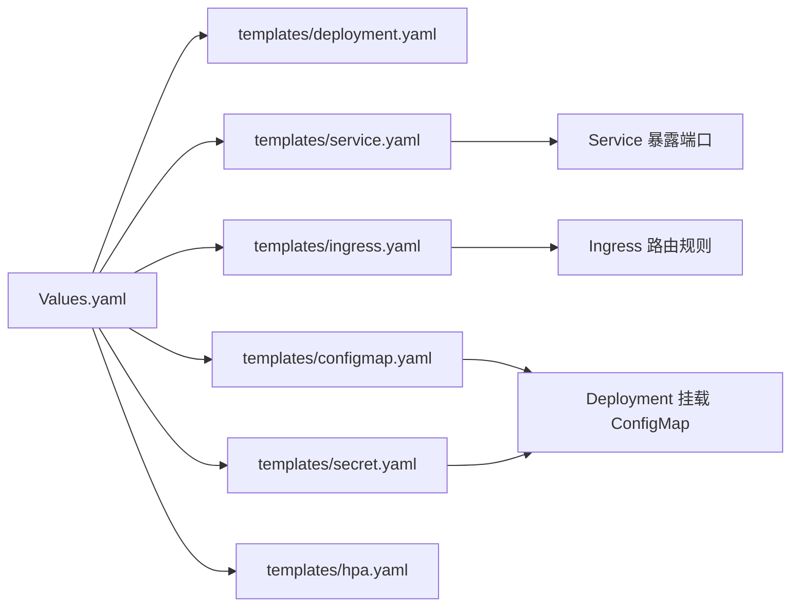
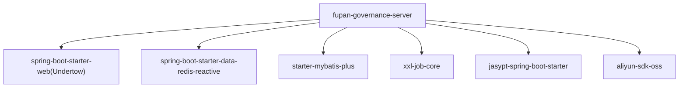

# Kubernetes部署

<cite>
**本文引用的文件**
- [application.yml](file://src/main/resources/application.yml)
- [application-dev.yml](file://src/main/resources/application-dev.yml)
- [application-local.yml](file://src/main/resources/application-local.yml)
- [pom.xml](file://pom.xml)
- [ServerApplication.java](file://src/main/java/com/jiuyu/governance/ServerApplication.java)
- [XxlJobConfiguration.java](file://src/main/java/com/jiuyu/governance/plugins/xxljob/XxlJobConfiguration.java)
- [XxlJobProperties.java](file://src/main/java/com/jiuyu/governance/plugins/xxljob/XxlJobProperties.java)
- [OssController.java](file://src/main/java/com/jiuyu/governance/common/controller/OssController.java)
- [OssProperties.java](file://src/main/java/com/jiuyu/governance/plugins/oss/config/OssProperties.java)
- [OssBucketProperties.java](file://src/main/java/com/jiuyu/governance/plugins/oss/config/OssBucketProperties.java)
- [OssClientManager.java](file://src/main/java/com/jiuyu/governance/plugins/oss/core/OssClientManager.java)
- [OssTemplate.java](file://src/main/java/com/jiuyu/governance/plugins/oss/core/OssTemplate.java)
- [.gitignore](file://.gitignore)
</cite>

## 目录
1. [简介](#简介)
2. [项目结构](#项目结构)
3. [核心组件](#核心组件)
4. [架构总览](#架构总览)
5. [详细组件分析](#详细组件分析)
6. [依赖分析](#依赖分析)
7. [性能考虑](#性能考虑)
8. [故障排查指南](#故障排查指南)
9. [结论](#结论)
10. [附录](#附录)

## 简介
本指南面向在Kubernetes中部署 fupan-governance-server 的运维与开发团队，提供从Deployment、Service、ConfigMap、Secret到Ingress的完整配置思路，以及Helm Chart模板与Values.yaml的编写要点、部署脚本建议、健康检查与资源监控、故障恢复策略，以及HPA与性能优化建议。文档严格基于仓库中的配置文件与源码进行分析，避免臆测。

## 项目结构
- 应用采用 Spring Boot 3.3.0 + Undertow，通过 Maven 构建打包。
- 配置采用多环境 YAML（application.yml、application-dev.yml、application-local.yml），集中管理数据库、Redis、XXL-Job、OSS等外部依赖。
- 启动类位于 com.jiuyu.governance.ServerApplication，应用入口为 main 方法。
- XXL-Job 作为可选任务调度模块，通过配置类与属性类启用与装配。
- OSS 插件提供预签名上传能力，控制器暴露 /api/governance/oss/image/presigned-upload 接口。

**图表来源**
- [ServerApplication.java:1-19](file://src/main/java/com/jiuyu/governance/ServerApplication.java#L1-L19)
- [application.yml:1-148](file://src/main/resources/application.yml#L1-L148)
- [application-dev.yml:1-109](file://src/main/resources/application-dev.yml#L1-L109)
- [application-local.yml:1-101](file://src/main/resources/application-local.yml#L1-L101)
- [XxlJobConfiguration.java:1-37](file://src/main/java/com/jiuyu/governance/plugins/xxljob/XxlJobConfiguration.java#L1-L37)
- [OssController.java:1-61](file://src/main/java/com/jiuyu/governance/common/controller/OssController.java#L1-L61)

**章节来源**
- [pom.xml:1-226](file://pom.xml#L1-L226)
- [ServerApplication.java:1-19](file://src/main/java/com/jiuyu/governance/ServerApplication.java#L1-L19)

## 核心组件
- 应用容器镜像：基于 Java 17，使用 Spring Boot 原生打包，入口类为 ServerApplication。
- 端口与协议：HTTP/1.1（Undertow），端口由配置决定；XXL-Job 执行器端口可配置。
- 外部依赖：MySQL（HikariCP连接池）、Redis（Jedis连接池）、XXL-Job（调度中心与执行器）、阿里云 OSS。
- 关键配置项：
  - 数据库：连接池大小、连接超时、心跳间隔、逻辑删除配置。
  - Redis：主机、密码、端口、数据库索引、连接池参数。
  - XXL-Job：开关、调度中心地址、访问令牌、执行器端口、日志路径与保留天数。
  - OSS：全局AK/SK、默认桶、路径前缀、网络策略（内外网）与桶级覆盖。

**章节来源**
- [application.yml:43-148](file://src/main/resources/application.yml#L43-L148)
- [application-dev.yml:1-109](file://src/main/resources/application-dev.yml#L1-L109)
- [application-local.yml:1-101](file://src/main/resources/application-local.yml#L1-L101)
- [XxlJobProperties.java:1-91](file://src/main/java/com/jiuyu/governance/plugins/xxljob/XxlJobProperties.java#L1-L91)
- [OssProperties.java:1-60](file://src/main/java/com/jiuyu/governance/plugins/oss/config/OssProperties.java#L1-L60)
- [OssBucketProperties.java:1-76](file://src/main/java/com/jiuyu/governance/plugins/oss/config/OssBucketProperties.java#L1-L76)

## 架构总览
下图展示应用在Kubernetes中的典型部署形态：Deployment承载Pod副本，Service提供稳定访问入口，ConfigMap与Secret注入配置与敏感信息，Ingress负责域名解析与TLS终止，HPA根据CPU/内存或自定义指标扩展。

[本图为概念性架构示意，无需图表来源]

## 详细组件分析

### Deployment 配置要点
- 副本数量：建议初始3个副本，结合业务峰值与延迟容忍度调整。
- 滚动更新策略：设置最大不可用/最大同时扩容，保证升级过程中的可用性。
- 资源限制：基于应用运行时观察，为CPU与内存设置requests/limits，避免资源争抢。
- 就绪探针：以HTTP GET /actuator/health/readiness 或应用内部健康端点为准，探测失败时不会被加入流量。
- 存活探针：定期探测，异常时触发重启。
- 环境变量与挂载：通过ConfigMap注入application.yml等配置；敏感信息通过Secret注入，避免硬编码。

[本图为流程示意，无需图表来源]

**章节来源**
- [application.yml:1-148](file://src/main/resources/application.yml#L1-L148)
- [application-dev.yml:1-109](file://src/main/resources/application-dev.yml#L1-L109)
- [application-local.yml:1-101](file://src/main/resources/application-local.yml#L1-L101)

### Service 配置要点
- 类型：ClusterIP，仅集群内访问；若需外部访问，配合Ingress或LoadBalancer。
- 端口：根据应用监听端口映射（例如6626或由配置决定），确保与容器端口一致。
- 负载均衡：Kubernetes Service 层面实现四层LB，结合Pod就绪状态进行流量转发。

[本图为概念性序列示意，无需图表来源]

**章节来源**
- [application-dev.yml:1-10](file://src/main/resources/application-dev.yml#L1-L10)
- [application-local.yml:1-2](file://src/main/resources/application-local.yml#L1-L2)

### ConfigMap 配置管理
- application.yml：集中存放数据库、Redis、XXL-Job、签名与加密等配置，支持通过环境变量覆盖。
- application-{env}.yml：按环境拆分，覆盖生产/测试/本地差异。
- 注入方式：将application.yml与各profile文件打包进ConfigMap，挂载到容器指定路径，由Spring Boot加载。

**图表来源**
- [application.yml:1-148](file://src/main/resources/application.yml#L1-L148)
- [application-dev.yml:1-109](file://src/main/resources/application-dev.yml#L1-L109)
- [application-local.yml:1-101](file://src/main/resources/application-local.yml#L1-L101)

**章节来源**
- [application.yml:1-148](file://src/main/resources/application.yml#L1-L148)
- [application-dev.yml:1-109](file://src/main/resources/application-dev.yml#L1-L109)
- [application-local.yml:1-101](file://src/main/resources/application-local.yml#L1-L101)

### Secret 资源管理
- 敏感信息：数据库密码、Redis密码、XXL-Job访问令牌、Jasypt加密密码等。
- 存储策略：使用Kubernetes Secret，避免明文写入镜像或配置文件。
- 使用方式：通过环境变量或挂载文件注入到容器，供Spring Boot与Jasypt读取。

[本图为流程示意，无需图表来源]

**章节来源**
- [application.yml:43-148](file://src/main/resources/application.yml#L43-L148)
- [application-dev.yml:1-109](file://src/main/resources/application-dev.yml#L1-L109)
- [application-local.yml:22-26](file://src/main/resources/application-local.yml#L22-L26)

### Ingress 配置
- 域名解析：将业务域名指向Ingress控制器。
- TLS证书：通过Ingress注解或证书管理器（如cert-manager）自动签发/续期。
- 流量路由：基于Host与Path将请求转发至Service端口。
- 安全：开启WAF、限流、灰度发布等策略（视平台而定）。

[本图为概念性序列示意，无需图表来源]

**章节来源**
- [OssController.java:1-61](file://src/main/java/com/jiuyu/governance/common/controller/OssController.java#L1-L61)

### Helm Chart 模板与 Values.yaml
- Chart 结构建议：
  - templates/deployment.yaml、service.yaml、ingress.yaml、configmap.yaml、secret.yaml、hpa.yaml
  - charts/ 子依赖（如 cert-manager 可作为子Chart）
- Values.yaml 关键字段：
  - image.repository、image.tag、image.pullPolicy
  - replicas、strategy、resources.requests/limits
  - ingress.hosts、tls、annotations
  - config.applicationYaml、config.applicationDevYaml、config.applicationLocalYaml
  - secrets.dbPassword、secrets.redisPassword、secrets.xxlJobToken、secrets.jasyptPassword
  - envs（用于覆盖application.yml中的占位符）

[本图为概念性结构示意，无需图表来源]

### 部署脚本建议
- kubectl apply -f manifests/（推荐使用Helm）
- Helm 示例命令：
  - helm install fupan-governance ./chart -n ns --create-namespace -f values-production.yaml
  - helm upgrade fupan-governance ./chart -n ns -f values-production.yaml
- CI/CD流水线：构建镜像 → 推送Registry → Helm升级 → 健康检查 → 回滚策略

[本节为通用实践说明，无需章节来源]

## 依赖分析
- 应用依赖 Undertow Web 服务器、Redis、MyBatis Plus、XXL-Job、Jasypt、OSS SDK 等。
- XXL-Job 通过配置类与属性类启用，执行器端口可配置。
- OSS 通过配置类与模板封装，提供预签名上传能力。

**图表来源**
- [pom.xml:35-167](file://pom.xml#L35-L167)
- [XxlJobConfiguration.java:1-37](file://src/main/java/com/jiuyu/governance/plugins/xxljob/XxlJobConfiguration.java#L1-L37)
- [OssClientManager.java:1-47](file://src/main/java/com/jiuyu/governance/plugins/oss/core/OssClientManager.java#L1-L47)

**章节来源**
- [pom.xml:35-167](file://pom.xml#L35-L167)

## 性能考虑
- 连接池调优：
  - MySQL：根据并发与RT目标调整最小/最大连接数、空闲超时、最大生命周期。
  - Redis：根据QPS与延迟目标调整最大连接数、最大等待时间、空闲连接数。
- JVM与容器：
  - 设置合理的JVM堆大小与GC策略；容器requests/limits避免突发抢占。
- IO与网络：
  - OSS上传建议使用预签名直传，减少应用侧压力；合理设置预签名有效期。
- 任务调度：
  - XXL-Job 执行器端口与日志路径需与部署环境匹配，避免冲突与磁盘压力。

[本节为通用指导，无需章节来源]

## 故障排查指南
- 健康检查失败：
  - 检查就绪探针路径与端口；确认数据库/Redis连通性；查看应用日志。
- 连接池耗尽：
  - 观察数据库/Redis连接数与等待队列；调整最大连接数与超时。
- XXL-Job 无法注册：
  - 核对调度中心地址、访问令牌与执行器端口；确认网络可达。
- OSS 上传失败：
  - 检查AK/SK、桶权限、网络策略（内外网）与预签名URL有效期。
- 配置未生效：
  - 确认ConfigMap/Secret已正确挂载；环境变量覆盖顺序；Jasypt密文是否正确。

**章节来源**
- [application.yml:43-148](file://src/main/resources/application.yml#L43-L148)
- [XxlJobProperties.java:1-91](file://src/main/java/com/jiuyu/governance/plugins/xxljob/XxlJobProperties.java#L1-L91)
- [OssProperties.java:1-60](file://src/main/java/com/jiuyu/governance/plugins/oss/config/OssProperties.java#L1-L60)
- [OssBucketProperties.java:1-76](file://src/main/java/com/jiuyu/governance/plugins/oss/config/OssBucketProperties.java#L1-L76)

## 结论
通过将应用配置集中于ConfigMap、敏感信息置于Secret、以Ingress统一接入与路由，并结合HPA实现弹性伸缩，可在Kubernetes上稳定、安全地运行 fupan-governance-server。建议在生产环境中启用严格的TLS、审计与告警机制，并持续优化连接池与JVM参数以获得最佳性能。

## 附录
- 镜像构建：使用Java 17基础镜像，复制Spring Boot可执行jar，ENTRYPOINT 指向应用入口类。
- 配置文件打包：将application.yml与各profile打包为ConfigMap，按需覆盖。
- 部署清单：Deployment、Service、Ingress、ConfigMap、Secret、HPA按需生成。
- 回滚策略：滚动更新设置最大不可用/最大同时扩容，失败时回滚至上一版本。

[本节为通用附录，无需章节来源]