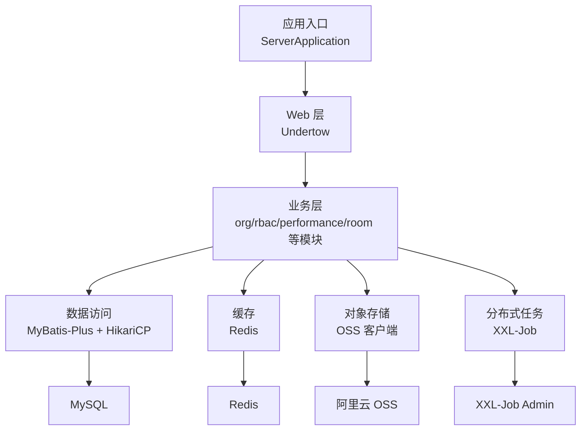
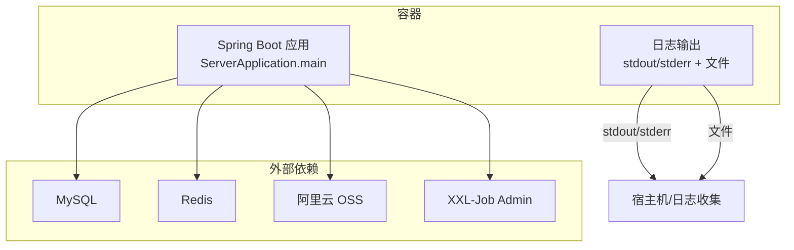
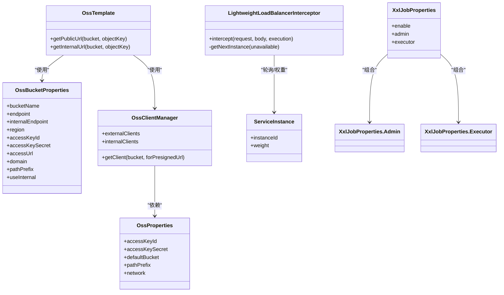
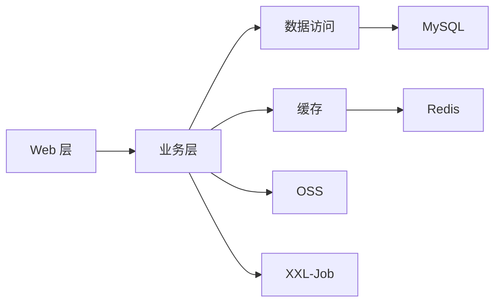

# 容器化部署

<cite>
**本文引用的文件**
- [pom.xml](file://pom.xml)
- [application.yml](file://src/main/resources/application.yml)
- [application-dev.yml](file://src/main/resources/application-dev.yml)
- [logback-spring.xml](file://src/main/resources/logback-spring.xml)
- [ServerApplication.java](file://src/main/java/com/jiuyu/governance/ServerApplication.java)
- [OssProperties.java](file://src/main/java/com/jiuyu/governance/plugins/oss/config/OssProperties.java)
- [OssBucketProperties.java](file://src/main/java/com/jiuyu/governance/plugins/oss/config/OssBucketProperties.java)
- [OssClientManager.java](file://src/main/java/com/jiuyu/governance/plugins/oss/core/OssClientManager.java)
- [OssTemplate.java](file://src/main/java/com/jiuyu/governance/plugins/oss/core/OssTemplate.java)
- [LightweightLoadBalancerInterceptor.java](file://src/main/java/com/jiuyu/governance/plugins/http/LightweightLoadBalancerInterceptor.java)
- [ServiceInstance.java](file://src/main/java/com/jiuyu/governance/plugins/http/ServiceInstance.java)
- [XxlJobProperties.java](file://src/main/java/com/jiuyu/governance/plugins/xxljob/XxlJobProperties.java)
- [API_DATA_DICTIONARY.md](file://API_DATA_DICTIONARY.md)
- [接口权限列表.md](file://docs/接口权限列表.md)
</cite>

## 目录
1. [简介](#简介)
2. [项目结构](#项目结构)
3. [核心组件](#核心组件)
4. [架构总览](#架构总览)
5. [详细组件分析](#详细组件分析)
6. [依赖分析](#依赖分析)
7. [性能考虑](#性能考虑)
8. [故障排查指南](#故障排查指南)
9. [结论](#结论)
10. [附录](#附录)

## 简介
本指南面向 fupan-governance-server 的容器化部署，提供从 Docker 镜像构建、运行配置、编排部署到健康检查、资源限制、扩缩容策略、监控与日志、以及与外部服务连接与网络优化的完整方案。内容基于仓库中的 Spring Boot 应用配置与插件特性，确保方案可落地且与代码实际行为一致。

## 项目结构
- 应用采用 Spring Boot 3.3.0 + Undertow Web 服务器，打包为可执行 JAR。
- 配置通过 application.yml 和多环境配置文件（如 application-dev.yml）控制。
- 日志通过 logback-spring.xml 配置，支持异步与按级别滚动。
- 外部依赖包括 MySQL（MyBatis-Plus）、Redis、阿里云 OSS、XXL-Job 等。

图表来源
- [ServerApplication.java:1-19](file://src/main/java/com/jiuyu/governance/ServerApplication.java#L1-L19)
- [application.yml:1-148](file://src/main/resources/application.yml#L1-L148)
- [logback-spring.xml:1-120](file://src/main/resources/logback-spring.xml#L1-L120)

章节来源
- [pom.xml:1-226](file://pom.xml#L1-L226)
- [application.yml:1-148](file://src/main/resources/application.yml#L1-L148)
- [application-dev.yml:1-109](file://src/main/resources/application-dev.yml#L1-L109)
- [logback-spring.xml:1-120](file://src/main/resources/logback-spring.xml#L1-L120)

## 核心组件
- Web 服务器：Undertow（非 Tomcat），支持 HTTP/2 与异步 IO。
- 数据源：HikariCP 连接池，支持最小/最大连接数、空闲超时、心跳等。
- 缓存：Redis，支持连接池大小与超时配置。
- 对象存储：OSS 客户端管理器，支持内网/外网 Endpoint 切换与多桶配置。
- 分布式任务：XXL-Job 执行器，支持端口、日志路径、保留天数等配置。
- 日志：Logback 异步 Appender，按级别滚动，支持 SkyWalking 日志采集。

章节来源
- [pom.xml:35-167](file://pom.xml#L35-L167)
- [application.yml:41-148](file://src/main/resources/application.yml#L41-L148)
- [application-dev.yml:1-109](file://src/main/resources/application-dev.yml#L1-L109)
- [logback-spring.xml:1-120](file://src/main/resources/logback-spring.xml#L1-L120)

## 架构总览
容器化部署建议采用“单容器一进程”模式，将 Spring Boot 可执行 JAR 作为容器主进程，通过环境变量注入数据库、Redis、OSS、XXL-Job 等外部依赖的连接参数。

图表来源
- [ServerApplication.java:1-19](file://src/main/java/com/jiuyu/governance/ServerApplication.java#L1-L19)
- [application.yml:41-148](file://src/main/resources/application.yml#L41-L148)
- [application-dev.yml:1-109](file://src/main/resources/application-dev.yml#L1-L109)

## 详细组件分析

### Docker 镜像构建方案
- 基础镜像：建议使用官方 OpenJDK 17 基础镜像，兼顾体积与兼容性。
- 多阶段构建：
  - 构建阶段：使用 Maven 在构建镜像中完成依赖下载与打包，生成可执行 JAR。
  - 运行阶段：仅复制最终 JAR 至运行镜像，避免携带构建工具与依赖缓存。
- 镜像安全加固：
  - 使用只读根文件系统与非 root 用户运行。
  - 启用只读配置卷与敏感参数通过环境变量注入。
  - 固定基础镜像版本，定期扫描漏洞。
- 运行参数：
  - JVM 参数建议通过 JAVA_TOOL_OPTIONS 或 spring-boot-maven-plugin 的 jvmArguments 注入。
  - 通过 -Djava.security.egd=file:/dev/./urandom 优化容器启动随机性。

章节来源
- [pom.xml:170-203](file://pom.xml#L170-L203)

### 容器运行配置
- 端口映射：
  - 容器暴露端口由 server.port 控制；生产环境建议固定端口以便服务发现与负载均衡。
- 环境变量传递：
  - 数据库：db.host、db.name、db.username、db.password、db.driver-class-name、db.min-size、db.max-size、db.max-lifetime、db.keepalive-time 等。
  - Redis：redis.ip、redis.password、redis.port、redis.database。
  - 日志：logging.file.path。
  - XXL-Job：xxl.job.admin.addresses、xxl.job.admin.access-token、xxl.job.executor.port、xxl.job.executor.log-path、xxl.job.executor.log-retention-days、xxl.job.executor.app-name。
  - OSS：jiuyu.oss.access-key-id、jiuyu.oss.access-key-secret、jiuyu.oss.default-bucket、jiuyu.oss.network.server-operation、jiuyu.oss.network.presigned-url、jiuyu.oss.buckets.<bucket>.endpoint 等。
  - 签名校验：jiuyu.signature.overdue-time、jiuyu.signature.app-name、jiuyu.signature.sign-name、jiuyu.signature.time-name、jiuyu.signature.model-name、jiuyu.signature.nonce-name。
- 卷挂载：
  - 日志目录：挂载 logging.file.path 指向的目录至持久化存储，便于日志收集与分析。
  - XXL-Job 日志：挂载 xxl.job.executor.log-path 指向的目录。
- 网络配置：
  - 生产环境建议使用 Kubernetes ClusterIP/Headless Service，通过服务发现访问数据库与 Redis。
  - OSS 访问建议根据网络策略选择内网 Endpoint 以降低公网流量成本。

章节来源
- [application.yml:41-148](file://src/main/resources/application.yml#L41-L148)
- [application-dev.yml:1-109](file://src/main/resources/application-dev.yml#L1-L109)
- [logback-spring.xml:1-120](file://src/main/resources/logback-spring.xml#L1-L120)

### 容器编排部署
- docker-compose：
  - 定义服务：web（应用）、mysql（数据库）、redis（缓存）、xxl-job-admin（任务调度中心）。
  - 使用环境变量注入数据库、Redis、OSS、XXL-Job 等参数。
  - 挂载日志目录与 XXL-Job 日志目录。
- Kubernetes：
  - Deployment：副本数、滚动更新策略、就绪/存活探针。
  - Service：ClusterIP/NodePort/LoadBalancer，配合 Ingress。
  - ConfigMap：存放非敏感配置（如日志路径、线程池大小等）。
  - Secret：存放数据库密码、Redis 密码、OSS 密钥、XXL-Job 访问令牌等。
  - PersistentVolumeClaim：为日志与 XXL-Job 日志提供持久化存储。

章节来源
- [application.yml:41-148](file://src/main/resources/application.yml#L41-L148)
- [application-dev.yml:1-109](file://src/main/resources/application-dev.yml#L1-L109)

### 健康检查、资源限制与扩缩容
- 健康检查：
  - 使用 HTTP GET /actuator/health/liveness 与 /actuator/health/readiness（需启用 Actuator）。
  - 若无 Actuator，可基于端口探测与应用端口连通性进行粗粒度健康检查。
- 资源限制：
  - CPU/内存限额结合 HikariCP、线程池、Redis 连接池与日志异步队列容量综合评估。
  - 建议为日志异步 Appender 配置合理的队列大小与丢弃阈值，避免内存压力。
- 扩缩容策略：
  - 水平扩展：多副本部署，结合负载均衡与会话粘性策略（若需要）。
  - 垂直扩展：根据 QPS 与延迟调整 JVM 堆大小与线程池参数。

章节来源
- [application.yml:1-40](file://src/main/resources/application.yml#L1-L40)
- [logback-spring.xml:40-73](file://src/main/resources/logback-spring.xml#L40-L73)

### 监控、日志收集与故障排查
- 监控：
  - JVM 指标：Prometheus/JMX Exporter。
  - 应用指标：Actuator 暴露端点，结合 Prometheus 抓取。
  - SkyWalking：logback-spring.xml 中已集成 SkyWalking 日志采集，可统一链路追踪。
- 日志收集：
  - stdout/stderr：容器标准输出，便于集中收集。
  - 文件日志：挂载日志目录，结合 Fluent Bit/Filebeat 收集。
- 故障排查：
  - 数据库连接：检查 db.host、db.name、db.username、db.password 与驱动类名。
  - Redis 连接：检查 redis.ip、redis.port、redis.password、redis.database。
  - OSS 访问：确认 OSS Endpoint、Bucket 名称与网络策略（内网/外网）。
  - XXL-Job：确认 xxl.job.admin.addresses、access-token 与执行器端口。

章节来源
- [logback-spring.xml:77-84](file://src/main/resources/logback-spring.xml#L77-L84)
- [application.yml:119-148](file://src/main/resources/application.yml#L119-L148)
- [application-dev.yml:90-109](file://src/main/resources/application-dev.yml#L90-L109)

### 与外部服务的连接配置与网络优化
- 数据库（MySQL）：
  - 使用 HikariCP 连接池参数优化连接生命周期与并发能力。
- 缓存（Redis）：
  - 通过连接池参数控制最大连接数与等待时间，避免阻塞。
- 对象存储（OSS）：
  - OssClientManager 支持内网/外网 Endpoint 切换，建议在内网环境下优先使用内网 Endpoint 降低公网流量。
  - OssTemplate 提供公开访问 URL 与内网 URL 生成，便于不同场景下的访问优化。
- 负载均衡与故障转移：
  - LightweightLoadBalancerInterceptor 实现基于权重轮询的负载均衡与重试策略，提升对外部服务调用的稳定性。
- 分布式任务（XXL-Job）：
  - 执行器端口与日志路径可配置，便于任务执行与日志收集。

图表来源
- [OssProperties.java:1-60](file://src/main/java/com/jiuyu/governance/plugins/oss/config/OssProperties.java#L1-L60)
- [OssBucketProperties.java:1-62](file://src/main/java/com/jiuyu/governance/plugins/oss/config/OssBucketProperties.java#L1-L62)
- [OssClientManager.java:1-47](file://src/main/java/com/jiuyu/governance/plugins/oss/core/OssClientManager.java#L1-L47)
- [OssTemplate.java:290-329](file://src/main/java/com/jiuyu/governance/plugins/oss/core/OssTemplate.java#L290-L329)
- [LightweightLoadBalancerInterceptor.java:78-189](file://src/main/java/com/jiuyu/governance/plugins/http/LightweightLoadBalancerInterceptor.java#L78-L189)
- [ServiceInstance.java:1-35](file://src/main/java/com/jiuyu/governance/plugins/http/ServiceInstance.java#L1-L35)
- [XxlJobProperties.java:1-70](file://src/main/java/com/jiuyu/governance/plugins/xxljob/XxlJobProperties.java#L1-L70)

章节来源
- [OssProperties.java:1-60](file://src/main/java/com/jiuyu/governance/plugins/oss/config/OssProperties.java#L1-L60)
- [OssBucketProperties.java:1-62](file://src/main/java/com/jiuyu/governance/plugins/oss/config/OssBucketProperties.java#L1-L62)
- [OssClientManager.java:1-47](file://src/main/java/com/jiuyu/governance/plugins/oss/core/OssClientManager.java#L1-L47)
- [OssTemplate.java:290-329](file://src/main/java/com/jiuyu/governance/plugins/oss/core/OssTemplate.java#L290-L329)
- [LightweightLoadBalancerInterceptor.java:78-189](file://src/main/java/com/jiuyu/governance/plugins/http/LightweightLoadBalancerInterceptor.java#L78-L189)
- [ServiceInstance.java:1-35](file://src/main/java/com/jiuyu/governance/plugins/http/ServiceInstance.java#L1-L35)
- [XxlJobProperties.java:1-70](file://src/main/java/com/jiuyu/governance/plugins/xxljob/XxlJobProperties.java#L1-L70)

## 依赖分析
- 外部依赖：
  - MySQL：HikariCP 连接池参数决定连接数与生命周期。
  - Redis：连接池大小与超时影响并发与延迟。
  - OSS：Endpoint 与 Bucket 配置影响访问路径与网络成本。
  - XXL-Job：执行器端口与日志路径影响任务执行与运维。
- 内部依赖：
  - Web 层依赖业务层，业务层依赖数据访问与缓存，数据访问依赖数据库，缓存依赖 Redis。

图表来源
- [application.yml:41-148](file://src/main/resources/application.yml#L41-L148)
- [application-dev.yml:1-109](file://src/main/resources/application-dev.yml#L1-L109)

章节来源
- [application.yml:41-148](file://src/main/resources/application.yml#L41-L148)
- [application-dev.yml:1-109](file://src/main/resources/application-dev.yml#L1-L109)

## 性能考虑
- JVM 与线程池：
  - 结合 HikariCP 连接池参数与线程池大小，避免过度连接导致数据库压力。
  - 日志异步队列容量与丢弃阈值应与吞吐量匹配，防止阻塞。
- 网络与存储：
  - OSS 内网 Endpoint 优先，减少公网流量。
  - Redis 连接池参数与超时时间应与 QPS 匹配。
- 负载均衡：
  - 对外服务调用使用 LightweightLoadBalancerInterceptor 的权重轮询与重试策略，提升可用性。

章节来源
- [application.yml:41-148](file://src/main/resources/application.yml#L41-L148)
- [logback-spring.xml:40-73](file://src/main/resources/logback-spring.xml#L40-L73)
- [LightweightLoadBalancerInterceptor.java:78-189](file://src/main/java/com/jiuyu/governance/plugins/http/LightweightLoadBalancerInterceptor.java#L78-L189)

## 故障排查指南
- 启动失败：
  - 检查数据库连接参数与驱动类名。
  - 检查 Redis 连接参数与认证。
- 运行异常：
  - 查看日志文件与 stdout/stderr，定位错误堆栈。
  - 检查 HikariCP 连接池状态与超时配置。
- 外部服务问题：
  - OSS：确认 Endpoint、Bucket、网络策略。
  - XXL-Job：确认 Admin 地址与访问令牌、执行器端口与日志路径。

章节来源
- [application.yml:41-148](file://src/main/resources/application.yml#L41-L148)
- [application-dev.yml:1-109](file://src/main/resources/application-dev.yml#L1-L109)
- [logback-spring.xml:1-120](file://src/main/resources/logback-spring.xml#L1-L120)

## 结论
通过多阶段 Docker 构建、严格的环境变量注入、合理的资源与健康检查策略，以及对 OSS、Redis、MySQL、XXL-Job 等外部依赖的参数化配置，fupan-governance-server 可实现稳定、可观测、可扩展的容器化部署。结合负载均衡与网络优化策略，可在保证性能的同时降低运营成本。

## 附录
- API 与权限参考：用于理解对外接口与权限标识，便于容器化后的 API 网关与鉴权策略设计。
  - [API_DATA_DICTIONARY.md:1-415](file://API_DATA_DICTIONARY.md#L1-L415)
  - [接口权限列表.md:1-116](file://docs/接口权限列表.md#L1-L116)