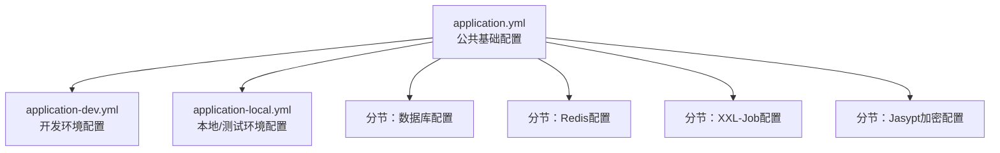
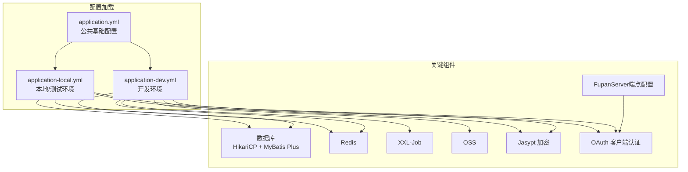
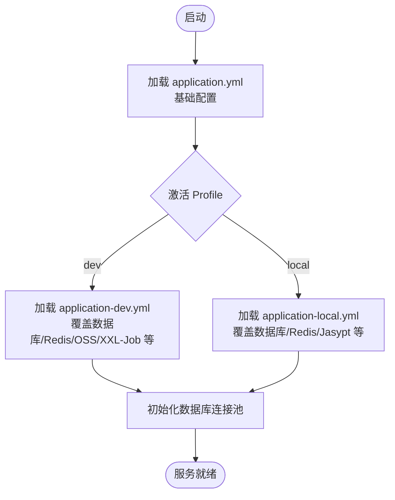
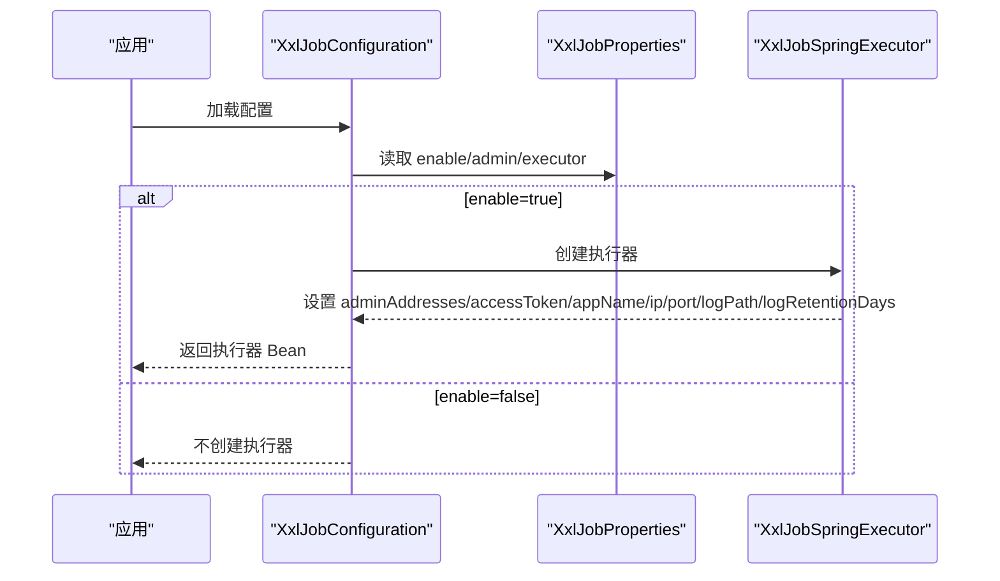
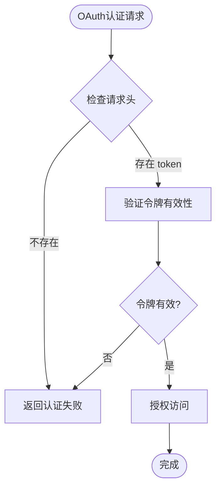
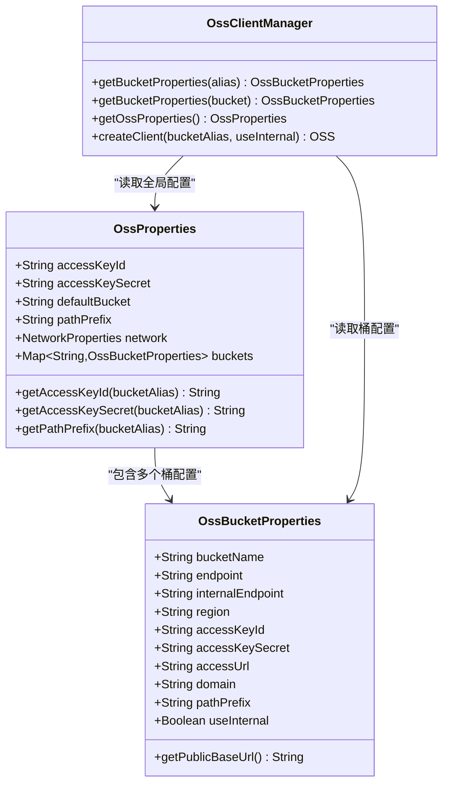
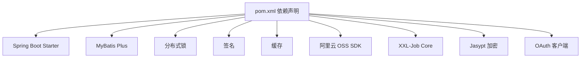

# 环境配置

<cite>
**本文引用的文件**
- [application.yml](file://src/main/resources/application.yml)
- [application-dev.yml](file://src/main/resources/application-dev.yml)
- [application-local.yml](file://src/main/resources/application-local.yml)
- [spy.properties](file://src/main/resources/spy.properties)
- [pom.xml](file://pom.xml)
- [OssProperties.java](file://src/main/java/com/jiuyu/governance/plugins/oss/config/OssProperties.java)
- [OssBucketProperties.java](file://src/main/java/com/jiuyu/governance/plugins/oss/config/OssBucketProperties.java)
- [OssClientManager.java](file://src/main/java/com/jiuyu/governance/plugins/oss/core/OssClientManager.java)
- [XxlJobProperties.java](file://src/main/java/com/jiuyu/governance/plugins/xxljob/XxlJobProperties.java)
- [XxlJobConfiguration.java](file://src/main/java/com/jiuyu/governance/plugins/xxljob/XxlJobConfiguration.java)
- [DefaultAuthenticationTokenStorage.java](file://src/main/java/com/jiuyu/governance/plugins/oauth/server/DefaultAuthenticationTokenStorage.java)
- [RestAuthenticationTokenProvide.java](file://src/main/java/com/jiuyu/governance/plugins/oauth/client/RestAuthenticationTokenProvide.java)
- [FupanServerProperties.java](file://src/main/java/com/jiuyu/governance/common/replay/FupanServerProperties.java)
- [XXHash.java](file://src/main/java/com/jiuyu/governance/common/utils/XXHash.java)
- [ServiceInstance.java](file://src/main/java/com/jiuyu/governance/plugins/http/ServiceInstance.java)
</cite>

## 更新摘要
**所做更改**
- 更新OAuth客户端配置部分，修正header-name从'Token'到'token'的配置变更
- 新增OAuth客户端配置与API请求兼容性的说明
- 补充OAuth配置一致性检查和最佳实践建议
- 更新fupan-server客户端凭据配置，从测试值更新为生产级安全哈希值
- 新增XXHash安全哈希算法在OAuth认证中的应用说明

## 目录
1. [简介](#简介)
2. [项目结构](#项目结构)
3. [核心组件](#核心组件)
4. [架构总览](#架构总览)
5. [详细组件分析](#详细组件分析)
6. [依赖关系分析](#依赖关系分析)
7. [性能考量](#性能考量)
8. [故障排查指南](#故障排查指南)
9. [结论](#结论)
10. [附录](#附录)

## 简介
本指南面向 fupan-governance-server 的多环境配置管理，聚焦于 dev 开发环境、local 本地环境与 prod 生产环境的配置差异与最佳实践。内容涵盖数据库连接、Redis 缓存、XXL-Job 任务调度、OSS 存储等关键组件的参数设置；同时提供环境变量配置方法、密钥加密配置与敏感信息保护措施，并说明配置文件加载顺序、覆盖规则与验证方法，辅以配置模板与实用建议，帮助开发者在不同环境中正确配置与运行。

**更新** 本次更新重点关注OAuth客户端配置的header-name参数调整，从'Token'改为'token'以改善API请求兼容性，以及fupan-server客户端凭据从测试值更新为生产级安全哈希值的变更。

## 项目结构
- 配置文件位于 resources 目录，采用 Spring Profile 分层配置：
  - application.yml：公共基础配置与分节（数据库、Redis、XXL-Job、Jasypt 加密等）
  - application-dev.yml：开发环境专用配置（数据库、Redis、OSS、XXL-Job、签名与 OAuth 密钥等）
  - application-local.yml：本地/测试环境专用配置（数据库、Redis、Jasypt 密码、OSS、XXL-Job 等）

**图表来源**
- [application.yml:1-148](file://src/main/resources/application.yml#L1-L148)
- [application-dev.yml:1-109](file://src/main/resources/application-dev.yml#L1-L109)
- [application-local.yml:1-101](file://src/main/resources/application-local.yml#L1-L101)

**章节来源**
- [application.yml:1-148](file://src/main/resources/application.yml#L1-L148)
- [application-dev.yml:1-109](file://src/main/resources/application-dev.yml#L1-L109)
- [application-local.yml:1-101](file://src/main/resources/application-local.yml#L1-L101)

## 核心组件
- 数据库（MyBatis Plus + HikariCP）
  - 支持通过占位符注入连接参数，含连接池大小、生命周期、心跳、校验等参数
  - 开发环境使用 P6Spy 驱动便于 SQL 调试
- Redis 缓存
  - 通过 spring.data.redis 配置主机、密码、端口、数据库、连接超时与连接池参数
  - 使用分布式锁与 HTTP 客户端能力
- XXL-Job 任务调度
  - 通过 xxl.job.enable 控制开关，admin 地址、令牌、超时；executor 应用名、IP、端口、日志路径与保留天数
- OSS 存储
  - 通过 jiuyu.oss 配置全局 AK/SK、默认桶、路径前缀与网络策略；支持按桶覆盖 AK/SK、路径前缀与内网使用
- Jasypt 加密
  - 通过 jasypt.encryptor.algorithm 与 iv-generator-classname 配置算法；本地环境通过环境变量 JASYPT_PASSWORD 注入密钥
- OAuth 客户端认证
  - 通过 jiuyu.oauth.client.header-name 配置请求头名称，现为小写 'token'
  - 支持客户端用户认证与令牌验证
  - 使用XXHash算法进行令牌哈希处理，提升安全性

**更新** OAuth客户端配置现已统一使用小写 'token' 作为请求头名称，提升API请求兼容性。fupan-server客户端凭据已更新为生产级安全哈希值，增强了系统安全性。

**章节来源**
- [application.yml:43-147](file://src/main/resources/application.yml#L43-L147)
- [application-dev.yml:3-102](file://src/main/resources/application-dev.yml#L3-L102)
- [application-local.yml:3-100](file://src/main/resources/application-local.yml#L3-L100)
- [OssProperties.java:1-139](file://src/main/java/com/jiuyu/governance/plugins/oss/config/OssProperties.java#L1-L139)
- [XxlJobProperties.java:1-91](file://src/main/java/com/jiuyu/governance/plugins/xxljob/XxlJobProperties.java#L1-L91)
- [RestAuthenticationTokenProvide.java:72](file://src/main/java/com/jiuyu/governance/plugins/oauth/client/RestAuthenticationTokenProvide.java#L72)
- [DefaultAuthenticationTokenStorage.java:291-302](file://src/main/java/com/jiuyu/governance/plugins/oauth/server/DefaultAuthenticationTokenStorage.java#L291-L302)

## 架构总览
下图展示多环境配置在启动时的加载与覆盖关系，以及关键组件的配置来源与生效范围。

**图表来源**
- [application.yml:1-148](file://src/main/resources/application.yml#L1-L148)
- [application-dev.yml:1-109](file://src/main/resources/application-dev.yml#L1-L109)
- [application-local.yml:1-101](file://src/main/resources/application-local.yml#L1-L101)

## 详细组件分析

### 数据库配置（dev/local/prod 差异）
- 通用参数（application.yml）
  - HikariCP 连接池：最小空闲、最大池大小、最大存活时间、连接超时、心跳间隔、初始化 SQL、测试查询
  - JDBC URL 由 db.url-prefix、db.databases-type、db.host、db.name 组合，支持时区与字符集
  - MyBatis Plus：Mapper XML 路径、实体包扫描、逻辑删除值、驼峰映射、默认批处理大小等
- 开发环境（application-dev.yml）
  - 使用 P6Spy 驱动与前缀 jdbc:p6spy，便于 SQL 输出与调试
  - 连接池参数与日志路径、端口等针对开发场景优化
- 本地/测试环境（application-local.yml）
  - 同样使用 P6Spy 驱动，连接池大小更偏向"min=max"以减少抖动
  - 引入 Jasypt 密码，从环境变量 JASYPT_PASSWORD 读取解密密钥

**图表来源**
- [application.yml:43-82](file://src/main/resources/application.yml#L43-L82)
- [application-dev.yml:3-14](file://src/main/resources/application-dev.yml#L3-L14)
- [application-local.yml:3-14](file://src/main/resources/application-local.yml#L3-L14)

**章节来源**
- [application.yml:43-82](file://src/main/resources/application.yml#L43-L82)
- [application-dev.yml:3-14](file://src/main/resources/application-dev.yml#L3-L14)
- [application-local.yml:3-14](file://src/main/resources/application-local.yml#L3-L14)

### Redis 缓存配置（dev/local 差异）
- 通用参数（application.yml）
  - 主机、密码、端口、数据库、连接超时、Jedis 连接池参数（最大活跃、最大等待、最大空闲、最小空闲、空闲回收周期）
  - 分布式锁前缀、HTTP 客户端开关、签名相关头部字段
- 开发/本地环境（application-dev.yml、application-local.yml）
  - 服务器端口、Redis 主机、密码、数据库编号等
  - 本地环境引入 Jasypt 密码配置项

**章节来源**
- [application.yml:85-115](file://src/main/resources/application.yml#L85-L115)
- [application-dev.yml:17-21](file://src/main/resources/application-dev.yml#L17-L21)
- [application-local.yml:17-21](file://src/main/resources/application-local.yml#L17-L21)

### XXL-Job 任务调度配置（dev/local 差异）
- 通用参数（application.yml）
  - enable 开关、admin 地址、令牌、超时；executor 应用名、IP、端口、日志路径与保留天数
- 开发/本地环境（application-dev.yml、application-local.yml）
  - admin 地址指向本地或测试地址；executor 端口、日志路径、应用名差异化
  - enable 默认开启

**图表来源**
- [XxlJobConfiguration.java:30-76](file://src/main/java/com/jiuyu/governance/plugins/xxljob/XxlJobConfiguration.java#L30-L76)
- [XxlJobProperties.java:15-91](file://src/main/java/com/jiuyu/governance/plugins/xxljob/XxlJobProperties.java#L15-L91)
- [application.yml:124-147](file://src/main/resources/application.yml#L124-L147)
- [application-dev.yml:90-102](file://src/main/resources/application-dev.yml#L90-L102)
- [application-local.yml:89-100](file://src/main/resources/application-local.yml#L89-L100)

**章节来源**
- [XxlJobConfiguration.java:1-77](file://src/main/java/com/jiuyu/governance/plugins/xxljob/XxlJobConfiguration.java#L1-L77)
- [XxlJobProperties.java:1-91](file://src/main/java/com/jiuyu/governance/plugins/xxljob/XxlJobProperties.java#L1-L91)
- [application.yml:124-147](file://src/main/resources/application.yml#L124-L147)
- [application-dev.yml:90-102](file://src/main/resources/application-dev.yml#L90-L102)
- [application-local.yml:89-100](file://src/main/resources/application-local.yml#L89-L100)

### OAuth 客户端认证配置（dev/local 差异）
- 通用参数（application.yml）
  - jiuyu.oauth.client.header-name：配置OAuth认证请求头名称
  - jiuyu.oauth.client.secret：用于加密JWT的AES密钥
  - jiuyu.oauth.server.secret：JWT签名密钥
  - jiuyu.oauth.server.token-expire-hour：登录态有效期（小时）
- 开发/本地环境（application-dev.yml、application-local.yml）
  - header-name 已调整为小写 'token'，提升API请求兼容性
  - 客户端密钥与服务器密钥配置
  - API Key Secret配置，支持多应用ID
  - fupan-server客户端凭据使用生产级安全哈希值

**更新** OAuth客户端配置现已统一使用小写 'token' 作为请求头名称，解决了大小写不一致的问题。fupan-server客户端凭据已更新为生产级安全哈希值，增强了系统安全性。

**图表来源**
- [RestAuthenticationTokenProvide.java:72](file://src/main/java/com/jiuyu/governance/plugins/oauth/client/RestAuthenticationTokenProvide.java#L72)
- [application-dev.yml:43](file://src/main/resources/application-dev.yml#L43)
- [application-local.yml:43](file://src/main/resources/application-local.yml#L43)

**章节来源**
- [application.yml:41-51](file://src/main/resources/application.yml#L41-L51)
- [application-dev.yml:41-50](file://src/main/resources/application-dev.yml#L41-L50)
- [application-local.yml:41-51](file://src/main/resources/application-local.yml#L41-L51)
- [RestAuthenticationTokenProvide.java:72](file://src/main/java/com/jiuyu/governance/plugins/oauth/client/RestAuthenticationTokenProvide.java#L72)

### fupan-server客户端凭据配置
- 配置位置
  - jiuyu.fupan-server.client-id：客户端ID，固定为"governance"
  - jiuyu.fupan-server.client-secret：客户端密钥，使用生产级安全哈希值
- 安全特性
  - 使用XXHash算法生成的安全哈希值，提升令牌安全性
  - 支持负载均衡配置，可配置多个服务实例
  - 支持基础URL配置，适应不同环境部署需求

**更新** fupan-server客户端凭据已从测试值更新为生产级安全哈希值，增强了系统安全性。

**章节来源**
- [application-dev.yml:51-54](file://src/main/resources/application-dev.yml#L51-L54)
- [application-local.yml:52-56](file://src/main/resources/application-local.yml#L52-L56)
- [FupanServerProperties.java:20-47](file://src/main/java/com/jiuyu/governance/common/replay/FupanServerProperties.java#L20-L47)
- [DefaultAuthenticationTokenStorage.java:291-302](file://src/main/java/com/jiuyu/governance/plugins/oauth/server/DefaultAuthenticationTokenStorage.java#L291-L302)

### XXHash安全哈希算法应用
- 算法特性
  - 非安全性但速度超快的xxHash算法，比MD5快10倍
  - 提供32位和64位哈希计算功能
  - 支持字符串和字节数组输入
- 在OAuth中的应用
  - 用于从JWT令牌中提取payload的哈希值
  - 提升令牌处理的性能和安全性
  - 支持自定义种子参数

**更新** 新增XXHash安全哈希算法在OAuth认证中的应用说明，提升系统安全性。

**章节来源**
- [XXHash.java:1-387](file://src/main/java/com/jiuyu/governance/common/utils/XXHash.java#L1-L387)
- [DefaultAuthenticationTokenStorage.java:291-302](file://src/main/java/com/jiuyu/governance/plugins/oauth/server/DefaultAuthenticationTokenStorage.java#L291-L302)

### OSS 存储配置（dev/local 差异）
- 通用参数（application.yml）
  - jiuyu.oss 前缀下的全局 AK/SK、默认桶、路径前缀（默认使用环境名）、网络策略（服务端操作与预签名链接）
- 开发/本地环境（application-dev.yml、application-local.yml）
  - access-key-id/access-key-secret、default-bucket、path-prefix、network.server-operation/presigned-url
  - buckets 列表包含 ai-data、analysis-data、images 等桶的 endpoint、internal-endpoint、region、access-url 等
- 框架实现要点（OssProperties、OssBucketProperties、OssClientManager）
  - 桶级别配置优先于全局配置（AK/SK、路径前缀）
  - 支持按桶选择内网/外网 Endpoint
  - 提供获取桶配置与客户端创建的接口

**图表来源**
- [OssProperties.java:36-139](file://src/main/java/com/jiuyu/governance/plugins/oss/config/OssProperties.java#L36-L139)
- [OssBucketProperties.java:10-76](file://src/main/java/com/jiuyu/governance/plugins/oss/config/OssBucketProperties.java#L10-L76)
- [OssClientManager.java:83-119](file://src/main/java/com/jiuyu/governance/plugins/oss/core/OssClientManager.java#L83-L119)
- [application.yml:101-115](file://src/main/resources/application.yml#L101-L115)
- [application-dev.yml:61-88](file://src/main/resources/application-dev.yml#L61-L88)
- [application-local.yml:60-87](file://src/main/resources/application-local.yml#L60-L87)

**章节来源**
- [OssProperties.java:1-139](file://src/main/java/com/jiuyu/governance/plugins/oss/config/OssProperties.java#L1-L139)
- [OssBucketProperties.java:1-76](file://src/main/java/com/jiuyu/governance/plugins/oss/config/OssBucketProperties.java#L1-L76)
- [OssClientManager.java:75-119](file://src/main/java/com/jiuyu/governance/plugins/oss/core/OssClientManager.java#L75-L119)
- [application.yml:101-115](file://src/main/resources/application.yml#L101-L115)
- [application-dev.yml:61-88](file://src/main/resources/application-dev.yml#L61-L88)
- [application-local.yml:60-87](file://src/main/resources/application-local.yml#L60-L87)

### Jasypt 加密配置（本地环境）
- 通用参数（application.yml）
  - jasypt.encryptor.algorithm 与 iv-generator-classname
- 本地环境（application-local.yml）
  - 通过 JASYPT_PASSWORD 环境变量注入密钥，若未设置则使用默认值
- 数据库凭证（application-dev.yml、application-local.yml）
  - db.username/db.password 使用 ENC(...) 包裹，需配合 Jasypt 解密

**章节来源**
- [application.yml:119-122](file://src/main/resources/application.yml#L119-L122)
- [application-local.yml:22-25](file://src/main/resources/application-local.yml#L22-L25)
- [application-dev.yml:5-6](file://src/main/resources/application-dev.yml#L5-L6)
- [application-local.yml:5-6](file://src/main/resources/application-local.yml#L5-L6)

### 环境变量与敏感信息保护
- Jasypt 密钥
  - 本地环境通过 JASYPT_PASSWORD 注入，避免明文写入配置文件
- 数据库凭据
  - 使用 ENC(...) 包裹，结合 Jasypt 解密
- Redis 密码
  - 通过配置项直接注入，建议在 CI/CD 中使用密文或密钥管理服务
- XXL-Job 令牌
  - 通过配置项注入，建议在 CI/CD 中使用密文或密钥管理服务
- OSS AK/SK
  - 支持桶级别覆盖，建议按桶隔离权限与密钥
- OAuth 密钥
  - 客户端密钥与服务器密钥分离，建议在 CI/CD 中使用密文或密钥管理服务
  - fupan-server客户端凭据使用生产级安全哈希值，增强安全性

**更新** OAuth客户端配置现已统一使用小写 'token'，建议在API调用时保持一致的大小写规范。fupan-server客户端凭据已更新为生产级安全哈希值，提升了系统安全性。

**章节来源**
- [application-local.yml:22-25](file://src/main/resources/application-local.yml#L22-L25)
- [application-dev.yml:5-6](file://src/main/resources/application-dev.yml#L5-L6)
- [application-local.yml:5-6](file://src/main/resources/application-local.yml#L5-L6)
- [application-dev.yml:62-64](file://src/main/resources/application-dev.yml#L62-L64)
- [application-local.yml:62-64](file://src/main/resources/application-local.yml#L62-L64)
- [application-dev.yml:43-44](file://src/main/resources/application-dev.yml#L43-L44)
- [application-local.yml:43-44](file://src/main/resources/application-local.yml#L43-L44)
- [application-dev.yml:51-54](file://src/main/resources/application-dev.yml#L51-L54)
- [application-local.yml:52-56](file://src/main/resources/application-local.yml#L52-L56)

### 配置文件加载顺序与覆盖规则
- 加载顺序
  - application.yml 作为公共基础配置
  - 按激活的 profile 加载对应环境配置文件（application-dev.yml 或 application-local.yml）
- 覆盖规则
  - 环境配置文件对 application.yml 中同名键进行覆盖
  - 框架层面的占位符（如 ${db.host}、${redis.ip}）优先从环境变量或系统属性解析
- 验证方法
  - 启动后检查日志输出的配置项（如 XXL-Job 初始化日志）
  - 通过健康检查或内部接口验证数据库、Redis、OSS 连通性
  - OAuth认证可通过测试接口验证请求头配置

**更新** OAuth配置加载顺序与其他配置相同，通过Spring Profile机制自动加载。

**章节来源**
- [application.yml:13-15](file://src/main/resources/application.yml#L13-L15)
- [application-dev.yml:1-109](file://src/main/resources/application-dev.yml#L1-L109)
- [application-local.yml:1-101](file://src/main/resources/application-local.yml#L1-L101)
- [XxlJobConfiguration.java:30-38](file://src/main/java/com/jiuyu/governance/plugins/xxljob/XxlJobConfiguration.java#L30-L38)

### P6Spy SQL 调试（开发环境）
- 通过 spy.properties 配置 P6Spy 日志输出、过滤类别、日期格式、过滤 SQL 等
- application-dev.yml 使用 jdbc:p6spy 前缀与 P6Spy 驱动，便于开发阶段观察 SQL

**章节来源**
- [spy.properties:1-14](file://src/main/resources/spy.properties#L1-L14)
- [application-dev.yml:13-14](file://src/main/resources/application-dev.yml#L13-L14)

## 依赖关系分析
- Maven 依赖
  - Spring Boot Starter（Web、Validation、Undertow、Redis Reactive、AOP）
  - MyBatis Plus、分布式锁、签名、缓存、OAuth 客户端等框架依赖
  - 阿里云 OSS SDK、XXL-Job Core
  - Jasypt Spring Boot Starter（配置加密）

**图表来源**
- [pom.xml:35-167](file://pom.xml#L35-L167)

**章节来源**
- [pom.xml:1-226](file://pom.xml#L1-L226)

## 性能考量
- 数据库连接池
  - 开发环境建议开启 P6Spy 以便观察慢 SQL；生产环境建议关闭或仅在问题定位时开启
  - 连接池大小与生命周期参数需结合业务并发与数据库承载能力调优
- Redis
  - 连接池参数需与应用线程池规模匹配，避免阻塞等待
  - 分布式锁前缀需统一，避免跨服务冲突
- XXL-Job
  - 执行器端口与日志路径需与调度中心配置一致
  - 日志保留天数需结合磁盘空间与合规要求
- OSS
  - 服务端操作与预签名链接的网络策略需根据内外网访问场景选择
  - 桶级别 AK/SK 与路径前缀可按业务域隔离，降低风险
- OAuth
  - 客户端请求头配置需保持一致性，避免大小写导致的认证失败
  - 令牌有效期需根据业务场景合理设置
  - XXHash算法提供高性能的令牌处理能力

**更新** OAuth客户端配置的header-name参数已优化为小写形式，提升性能和兼容性。新增XXHash算法在OAuth认证中的应用，提升了令牌处理的性能和安全性。

## 故障排查指南
- 数据库连接失败
  - 检查 db.host、db.name、db.username、db.password 是否正确解析
  - 开发环境确认 P6Spy 驱动与 jdbc:p6spy 前缀
- Redis 连接失败
  - 检查 redis.ip、redis.password、redis.port、redis.database
  - 关注连接池参数与超时设置
- XXL-Job 无法注册
  - 检查 xxl.job.admin.addresses、xxl.job.admin.access-token
  - 确认 xxl.job.executor.app-name、ip、port、log-path、log-retention-days
- OSS 访问异常
  - 检查 jiuyu.oss.access-key-id/access-key-secret、default-bucket、path-prefix
  - 确认 buckets 中 endpoint/internal-endpoint、region、access-url 配置
- Jasypt 解密失败
  - 确认 JASYPT_PASSWORD 环境变量已设置且与 ENC(...) 内容匹配
- OAuth 认证失败
  - 检查 jiuyu.oauth.client.header-name 是否为 'token'（小写）
  - 确认客户端密钥与服务器密钥配置正确
  - 验证API请求头是否使用正确的 'token' 大小写
  - 检查fupan-server客户端凭据是否为生产级安全哈希值
- XXHash算法相关问题
  - 确认令牌格式正确，包含有效的JWT结构
  - 检查payload提取逻辑是否正常工作

**更新** 新增OAuth认证故障排查指导，重点关注header-name配置的一致性。新增fupan-server客户端凭据和XXHash算法相关故障排查内容。

**章节来源**
- [application.yml:43-147](file://src/main/resources/application.yml#L43-L147)
- [application-dev.yml:3-102](file://src/main/resources/application-dev.yml#L3-L102)
- [application-local.yml:3-100](file://src/main/resources/application-local.yml#L3-L100)
- [OssProperties.java:69-103](file://src/main/java/com/jiuyu/governance/plugins/oss/config/OssProperties.java#L69-L103)
- [XxlJobProperties.java:15-91](file://src/main/java/com/jiuyu/governance/plugins/xxljob/XxlJobProperties.java#L15-L91)
- [RestAuthenticationTokenProvide.java:72](file://src/main/java/com/jiuyu/governance/plugins/oauth/client/RestAuthenticationTokenProvide.java#L72)
- [DefaultAuthenticationTokenStorage.java:291-302](file://src/main/java/com/jiuyu/governance/plugins/oauth/server/DefaultAuthenticationTokenStorage.java#L291-L302)

## 结论
通过分层配置与 Profile 管理，fupan-governance-server 在 dev/local 环境实现了清晰的差异化配置，并通过 Jasypt、OSS 桶级覆盖、XXL-Job 执行器等机制保障了安全性与可维护性。OAuth客户端配置的header-name从'Token'改为'token'提升了API请求兼容性，建议在所有API调用中保持一致的大小写规范。fupan-server客户端凭据已更新为生产级安全哈希值，增强了系统整体安全性。建议在生产环境进一步强化密钥管理与审计日志，确保配置变更可追溯、可回滚。

**更新** OAuth配置优化为小写形式，建议在所有集成环境中统一使用 'token' 请求头，避免大小写不一致导致的认证问题。新增XXHash算法在OAuth认证中的应用，提升了系统性能和安全性。

## 附录

### 配置模板（示例）
- 数据库
  - db.host、db.name、db.username、db.password、db.driver-class-name、db.url-prefix、db.databases-type
  - HikariCP 参数：db.min-size、db.max-size、db.idle-timeout、db.keepalive-time、db.max-lifetime
- Redis
  - redis.ip、redis.password、redis.port、redis.database
  - 连接池参数：jedis.pool.max-active、max-wait、max-idle、min-idle、time-between-eviction-runs
- XXL-Job
  - xxl.job.enable、xxl.job.admin.addresses、xxl.job.admin.access-token、xxl.job.admin.timeout
  - xxl.job.executor.app-name、xxl.job.executor.ip、xxl.job.executor.port、xxl.job.executor.log-path、xxl.job.executor.log-retention-days
- OSS
  - jiuyu.oss.access-key-id、jiuyu.oss.access-key-secret、jiuyu.oss.default-bucket、jiuyu.oss.path-prefix
  - jiuyu.oss.network.server-operation、jiuyu.oss.network.presigned-url
  - buckets 列表：bucket-name、endpoint、internal-endpoint、region、access-url、domain、path-prefix、useInternal
- Jasypt
  - jasypt.encryptor.algorithm、jasypt.encryptor.iv-generator-classname
  - JASYPT_PASSWORD 环境变量
- OAuth
  - jiuyu.oauth.client.header-name：token（小写）
  - jiuyu.oauth.client.secret：客户端密钥
  - jiuyu.oauth.server.secret：服务器密钥
  - jiuyu.oauth.server.token-expire-hour：登录态有效期
- fupan-server客户端凭据
  - jiuyu.fupan-server.client-id：governance
  - jiuyu.fupan-server.client-secret：生产级安全哈希值
  - jiuyu.fupan-server.enable-load-balance：true/false
  - jiuyu.fupan-server.base-url：服务基础URL

**更新** 新增OAuth配置模板，明确header-name使用小写 'token'。新增fupan-server客户端凭据配置模板，包含生产级安全哈希值的使用说明。

**章节来源**
- [application.yml:43-147](file://src/main/resources/application.yml#L43-L147)
- [application-dev.yml:3-102](file://src/main/resources/application-dev.yml#L3-L102)
- [application-local.yml:3-100](file://src/main/resources/application-local.yml#L3-L100)
- [OssProperties.java:36-139](file://src/main/java/com/jiuyu/governance/plugins/oss/config/OssProperties.java#L36-L139)
- [XxlJobProperties.java:15-91](file://src/main/java/com/jiuyu/governance/plugins/xxljob/XxlJobProperties.java#L15-L91)
- [application-dev.yml:43-44](file://src/main/resources/application-dev.yml#L43-L44)
- [application-local.yml:43-44](file://src/main/resources/application-local.yml#L43-L44)
- [application-dev.yml:51-54](file://src/main/resources/application-dev.yml#L51-L54)
- [application-local.yml:52-56](file://src/main/resources/application-local.yml#L52-L56)

### OAuth配置最佳实践
- 请求头命名规范
  - 统一使用小写 'token' 作为OAuth认证请求头
  - 避免大小写混用，确保API调用一致性
- 密钥管理
  - 客户端密钥与服务器密钥分离管理
  - 在CI/CD环境中使用密文或密钥管理服务
  - fupan-server客户端凭据使用生产级安全哈希值
- 版本兼容性
  - 新版本应用应使用小写 'token' 头
  - 旧版本客户端需升级以支持新的大小写规范
- 安全性考虑
  - XXHash算法提供高性能的令牌处理能力
  - 建议定期轮换OAuth密钥
  - 实施适当的令牌过期策略
- 测试验证
  - 集成测试中验证OAuth认证流程
  - 确保不同环境下的配置一致性
  - 验证fupan-server客户端凭据的正确性

**更新** 新增OAuth配置最佳实践指导，强调大小写一致性和版本兼容性。新增fupan-server客户端凭据和XXHash算法的安全性考虑。

**章节来源**
- [RestAuthenticationTokenProvide.java:72](file://src/main/java/com/jiuyu/governance/plugins/oauth/client/RestAuthenticationTokenProvide.java#L72)
- [application-dev.yml:43-44](file://src/main/resources/application-dev.yml#L43-L44)
- [application-local.yml:43-44](file://src/main/resources/application-local.yml#L43-L44)
- [DefaultAuthenticationTokenStorage.java:291-302](file://src/main/java/com/jiuyu/governance/plugins/oauth/server/DefaultAuthenticationTokenStorage.java#L291-L302)
- [XXHash.java:1-387](file://src/main/java/com/jiuyu/governance/common/utils/XXHash.java#L1-L387)