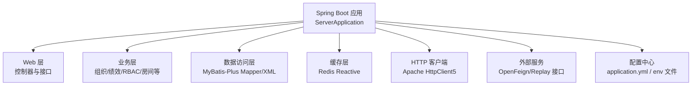
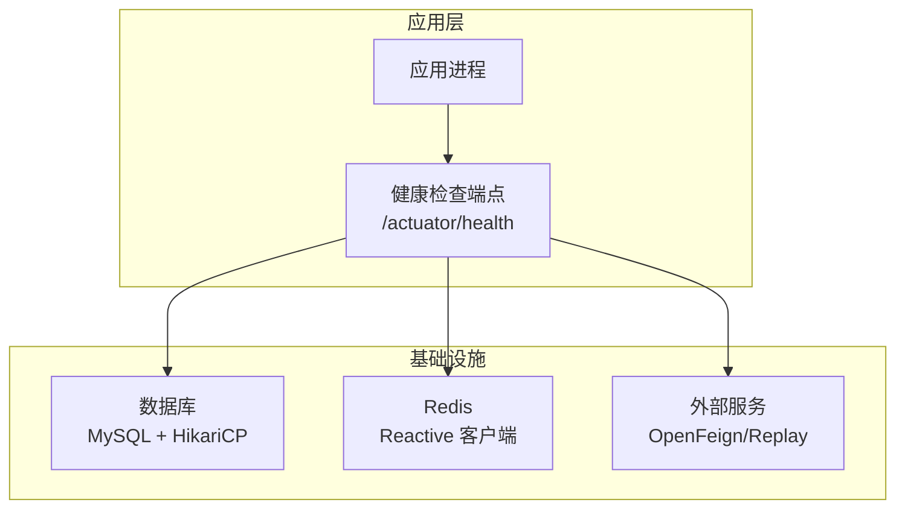
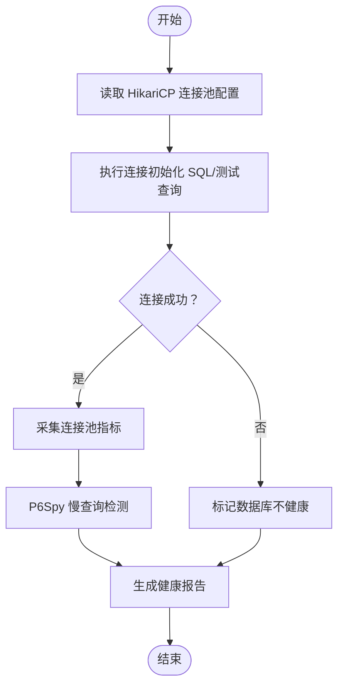
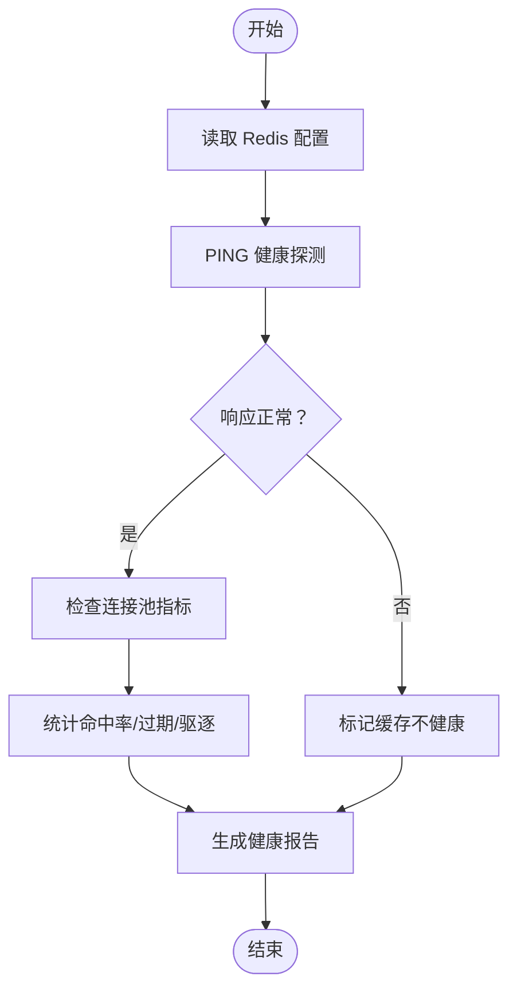
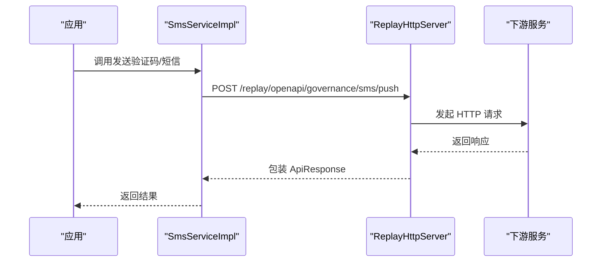
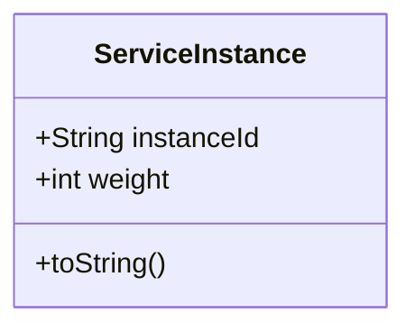
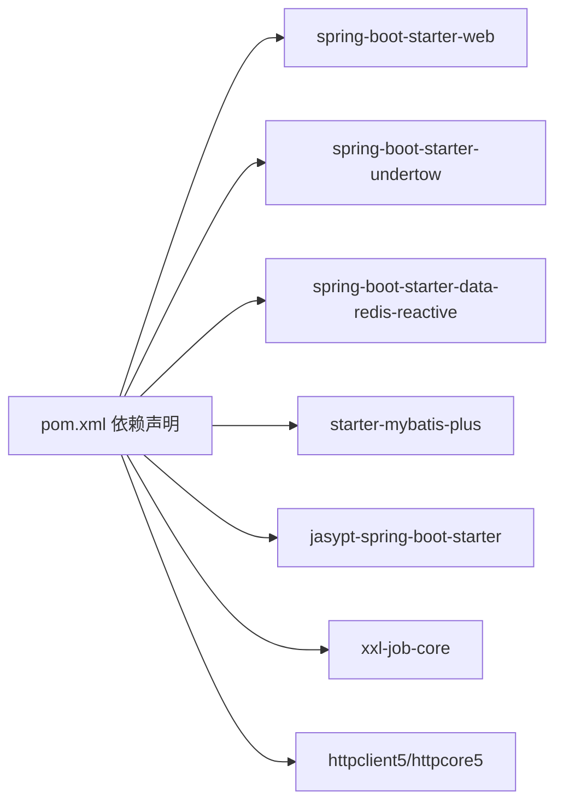

# 健康检查

<cite>
**本文引用的文件**
- [application.yml](file://src/main/resources/application.yml)
- [application-dev.yml](file://src/main/resources/application-dev.yml)
- [pom.xml](file://pom.xml)
- [SmsServiceImpl.java](file://src/main/java/com/jiuyu/governance/openfeign/replay/impl/SmsServiceImpl.java)
- [UserAccountServiceImpl.java](file://src/main/java/com/jiuyu/governance/openfeign/replay/impl/UserAccountServiceImpl.java)
- [TradeServiceImpl.java](file://src/main/java/com/jiuyu/governance/openfeign/replay/impl/TradeServiceImpl.java)
- [ManagerConnectorProcessor.java](file://src/main/java/com/jiuyu/governance/business/org/service/impl/ManagerConnectorProcessor.java)
- [TenantPrivilegeServiceImpl.java](file://src/main/java/com/jiuyu/governance/business/rbac/service/impl/TenantPrivilegeServiceImpl.java)
- [WebContextConfigure.java](file://src/main/java/com/jiuyu/governance/plugins/webmvc/WebContextConfigure.java)
- [ServiceInstance.java](file://src/main/java/com/jiuyu/governance/plugins/http/ServiceInstance.java)
</cite>

## 目录
1. [简介](#简介)
2. [项目结构](#项目结构)
3. [核心组件](#核心组件)
4. [架构总览](#架构总览)
5. [详细组件分析](#详细组件分析)
6. [依赖关系分析](#依赖关系分析)
7. [性能考量](#性能考量)
8. [故障排查指南](#故障排查指南)
9. [结论](#结论)
10. [附录](#附录)

## 简介
本指南面向 fupan-governance-server 的健康检查配置与运维实践，围绕以下目标展开：
- 应用健康检查端点配置：/actuator/health 端点、自定义健康指示器与依赖服务健康检查
- 数据库连接健康检查：连接池状态、数据库可用性检测与慢查询监控
- 缓存健康检查：Redis 连接状态、缓存可用性与性能指标监控
- 外部服务健康检查：OpenFeign 服务调用健康检查与第三方 API 可用性监控
- 健康检查自动化脚本、健康报告生成与故障自动恢复机制

说明：当前仓库未发现 Spring Boot Actuator 的显式依赖与 Actuator 自定义健康指示器实现，因此本指南提供基于现有配置与代码的健康检查最佳实践与可落地方案，帮助在不侵入性前提下扩展健康检查能力。

## 项目结构
项目采用 Spring Boot 3.3.0 + Undertow + MyBatis-Plus + Redis Reactive + Feign/OpenFeign 的技术栈。关键配置集中在 application.yml 与多环境配置文件中，数据库、Redis、线程池、签名与定时任务等均通过 YAML 注入。

图表来源
- [application.yml:1-148](file://src/main/resources/application.yml#L1-L148)
- [pom.xml:35-167](file://pom.xml#L35-L167)

章节来源
- [application.yml:1-148](file://src/main/resources/application.yml#L1-L148)
- [pom.xml:1-226](file://pom.xml#L1-L226)

## 核心组件
- 数据库连接与连接池：HikariCP，配置最小空闲、最大连接、连接超时、验证超时、心跳间隔等
- 缓存：Redis Reactive，连接池大小、超时、空闲配置
- HTTP 客户端：Apache HttpClient5，连接池、请求配置、TLS 策略
- 外部服务：OpenFeign/Replay 接口封装，通过 ReplayHttpServer 调用下游服务
- 线程池：Spring Task Execution 线程池，队列容量、核心/最大线程数
- 定时任务：XXL-Job 执行器配置

章节来源
- [application.yml:42-83](file://src/main/resources/application.yml#L42-L83)
- [application.yml:85-100](file://src/main/resources/application.yml#L85-L100)
- [application.yml:124-148](file://src/main/resources/application.yml#L124-L148)
- [WebContextConfigure.java:15-23](file://src/main/java/com/jiuyu/governance/plugins/webmvc/WebContextConfigure.java#L15-L23)
- [pom.xml:61-77](file://pom.xml#L61-L77)

## 架构总览
下图展示健康检查涉及的关键组件与数据流：

图表来源
- [application.yml:42-61](file://src/main/resources/application.yml#L42-L61)
- [application.yml:85-100](file://src/main/resources/application.yml#L85-L100)
- [SmsServiceImpl.java:37-68](file://src/main/java/com/jiuyu/governance/openfeign/replay/impl/SmsServiceImpl.java#L37-L68)
- [UserAccountServiceImpl.java:27](file://src/main/java/com/jiuyu/governance/openfeign/replay/impl/UserAccountServiceImpl.java#L27)

## 详细组件分析

### 数据库健康检查
- 连接池状态检查
  - HikariCP 连接池参数：最小空闲、最大连接、空闲超时、最大存活时间、连接超时、验证超时、心跳间隔
  - 建议通过连接池指标（活跃连接、空闲连接、等待线程、超时计数）评估健康
- 数据库可用性检测
  - 连接初始化 SQL 与测试查询：SELECT 1
  - 建议在启动阶段与周期性任务中执行轻量查询，探测可用性
- 慢查询监控
  - P6Spy 驱动已启用，可用于慢查询捕获与日志输出
  - 建议结合慢查询阈值与日志聚合进行告警

图表来源
- [application.yml:44-58](file://src/main/resources/application.yml#L44-L58)
- [application-dev.yml:13-14](file://src/main/resources/application-dev.yml#L13-L14)

章节来源
- [application.yml:42-61](file://src/main/resources/application.yml#L42-L61)
- [application-dev.yml:1-21](file://src/main/resources/application-dev.yml#L1-L21)

### 缓存健康检查
- Redis 连接状态
  - 连接超时、连接池最大活跃数、最大等待、最大空闲、最小空闲、驱逐间隔
  - 建议通过 ping/echo 命令与连接池指标判断可用性
- 缓存可用性与性能
  - 业务中广泛使用 RedisTemplate 进行键值读写与缓存更新
  - 建议对热点键设置 TTL 并监控命中率、过期与驱逐事件

图表来源
- [application.yml:87-100](file://src/main/resources/application.yml#L87-L100)

章节来源
- [application.yml:85-100](file://src/main/resources/application.yml#L85-L100)
- [ManagerConnectorProcessor.java:164-196](file://src/main/java/com/jiuyu/governance/business/org/service/impl/ManagerConnectorProcessor.java#L164-L196)
- [TenantPrivilegeServiceImpl.java:71-78](file://src/main/java/com/jiuyu/governance/business/rbac/service/impl/TenantPrivilegeServiceImpl.java#L71-L78)

### 外部服务健康检查（OpenFeign/Replay）
- 服务调用链路
  - 通过 ReplayHttpServer 封装 HTTP 调用，调用下游 /replay/openapi/* 接口
  - SmsService、UserAccountService、TradeService 等对外部服务进行封装
- 健康检查要点
  - 对下游接口执行轻量 GET/HEAD 探测，结合超时与重试策略
  - 记录成功率、延迟分布与错误类型，形成健康报告

图表来源
- [SmsServiceImpl.java:80-129](file://src/main/java/com/jiuyu/governance/openfeign/replay/impl/SmsServiceImpl.java#L80-L129)
- [UserAccountServiceImpl.java:94-96](file://src/main/java/com/jiuyu/governance/openfeign/replay/impl/UserAccountServiceImpl.java#L94-L96)
- [TradeServiceImpl.java:30-37](file://src/main/java/com/jiuyu/governance/openfeign/replay/impl/TradeServiceImpl.java#L30-L37)

章节来源
- [SmsServiceImpl.java:1-279](file://src/main/java/com/jiuyu/governance/openfeign/replay/impl/SmsServiceImpl.java#L1-L279)
- [UserAccountServiceImpl.java:1-135](file://src/main/java/com/jiuyu/governance/openfeign/replay/impl/UserAccountServiceImpl.java#L1-L135)
- [TradeServiceImpl.java:1-38](file://src/main/java/com/jiuyu/governance/openfeign/replay/impl/TradeServiceImpl.java#L1-L38)

### 服务实例与负载均衡
- 服务实例配置
  - 通过配置项维护服务实例列表与权重，便于负载均衡与故障隔离
- 健康检查建议
  - 结合实例权重与可用性，动态调整流量分配
  - 对不可用实例进行摘除与熔断

图表来源
- [ServiceInstance.java:14-35](file://src/main/java/com/jiuyu/governance/plugins/http/ServiceInstance.java#L14-L35)

章节来源
- [ServiceInstance.java:1-35](file://src/main/java/com/jiuyu/governance/plugins/http/ServiceInstance.java#L1-L35)
- [application-dev.yml:54-58](file://src/main/resources/application-dev.yml#L54-L58)

## 依赖关系分析
- 核心依赖
  - Spring Boot Starter Web、Undertow、Validation、Data Redis Reactive、MyBatis Plus、Jasypt 加密、XXL-Job
  - Apache HttpClient5 与核心依赖
- 健康检查相关
  - 数据库：HikariCP（application.yml 中配置）
  - 缓存：Redis Reactive（application.yml 中配置）
  - HTTP 客户端：Apache HttpClient5（WebContextConfigure 中装配）

图表来源
- [pom.xml:35-167](file://pom.xml#L35-L167)

章节来源
- [pom.xml:1-226](file://pom.xml#L1-L226)
- [WebContextConfigure.java:15-23](file://src/main/java/com/jiuyu/governance/plugins/webmvc/WebContextConfigure.java#L15-L23)

## 性能考量
- 连接池与线程池
  - HikariCP：合理设置最小空闲与最大连接，避免过度连接导致资源争用
  - Redis：控制连接池大小与超时，避免阻塞
  - 线程池：根据业务并发与 IO 特性调整队列容量与核心/最大线程数
- HTTP 客户端
  - 合理配置连接池、请求超时与重试策略，避免雪崩效应
- 监控与日志
  - P6Spy 慢查询日志与业务日志需配合日志聚合平台进行分析

章节来源
- [application.yml:44-61](file://src/main/resources/application.yml#L44-L61)
- [application.yml:87-100](file://src/main/resources/application.yml#L87-L100)
- [application.yml:27-33](file://src/main/resources/application.yml#L27-L33)
- [application-dev.yml:27-34](file://src/main/resources/application-dev.yml#L27-L34)

## 故障排查指南
- 数据库
  - 现象：连接超时、验证失败、慢查询增多
  - 排查：检查连接池参数、网络连通性、慢查询日志、数据库负载
- 缓存
  - 现象：连接失败、命令超时、命中率低
  - 排查：检查 Redis 配置、连接池指标、网络与 ACL 设置
- 外部服务
  - 现象：调用失败、超时、错误码集中
  - 排查：检查下游接口可用性、鉴权与限流、重试策略与熔断
- 自动化与恢复
  - 建议：基于健康检查结果触发降级、熔断与实例摘除；对缓存与数据库异常可触发快速重试与告警

章节来源
- [SmsServiceImpl.java:142-198](file://src/main/java/com/jiuyu/governance/openfeign/replay/impl/SmsServiceImpl.java#L142-L198)
- [UserAccountServiceImpl.java:94-96](file://src/main/java/com/jiuyu/governance/openfeign/replay/impl/UserAccountServiceImpl.java#L94-L96)

## 结论
- 当前仓库未包含 Actuator 依赖与自定义健康指示器实现，但通过现有配置与代码可构建完善的健康检查体系
- 建议在不侵入现有业务的前提下，补充 Actuator 依赖与自定义健康指示器，完善数据库、缓存与外部服务的健康检查
- 结合自动化脚本与健康报告，实现故障自动恢复与流量治理

## 附录
- 健康检查端点建议
  - /actuator/health：暴露应用与依赖健康状态
  - /actuator/health/db、/actuator/health/redis、/actuator/health/feign：细分依赖健康
- 自定义健康指示器实现思路
  - 数据库：执行连接初始化 SQL/测试查询，采集连接池指标
  - Redis：执行 PING/GET 命令，统计连接池与键空间指标
  - 外部服务：对关键下游接口执行轻量探测，记录成功率与延迟
- 健康报告与自动化
  - 健康报告：包含状态、指标、告警与恢复建议
  - 自动化脚本：定时探测、失败告警、自动切换与回滚
  - 故障自动恢复：熔断、降级、实例摘除与重试