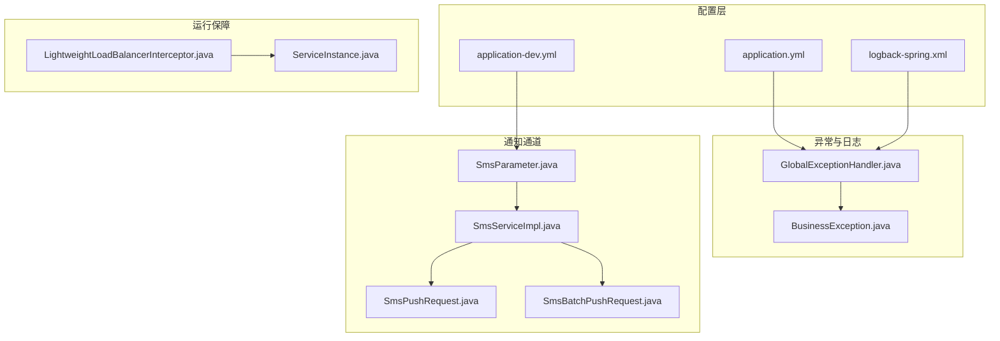
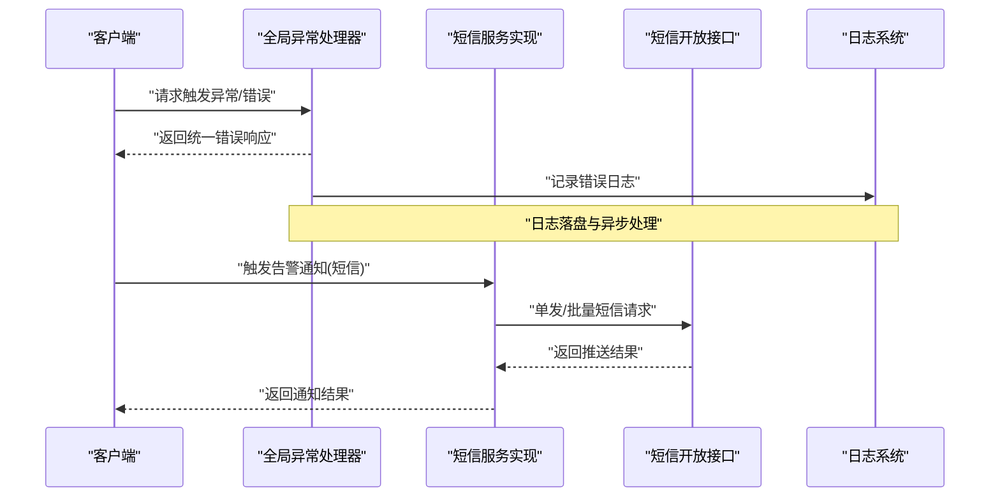
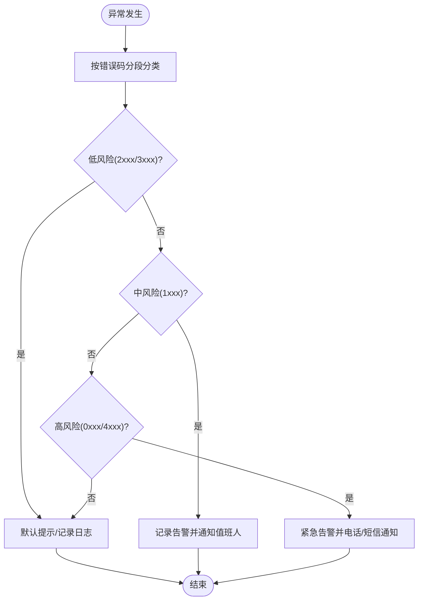
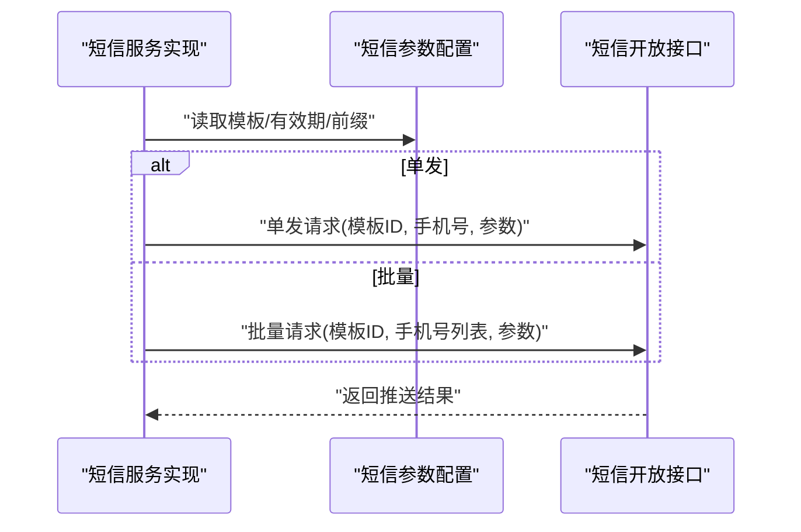
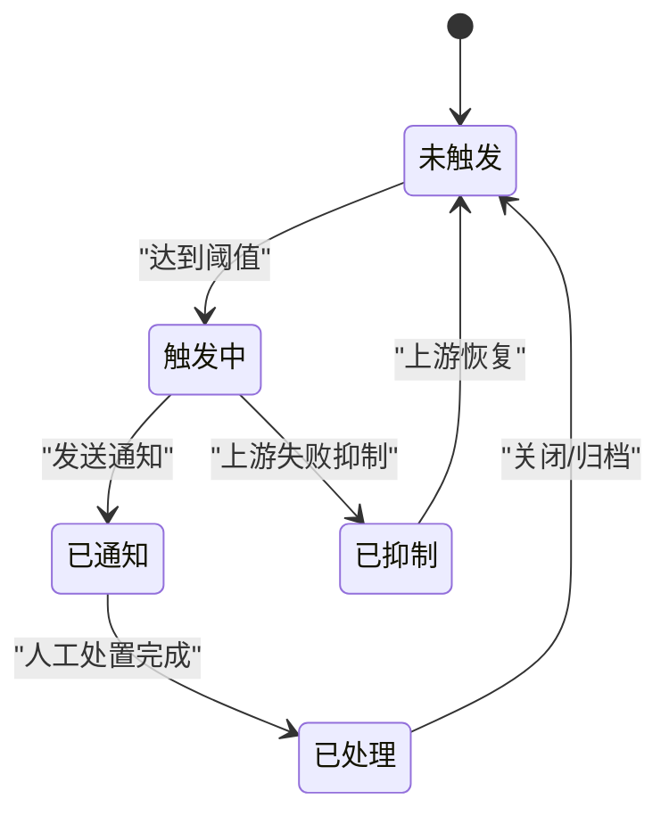
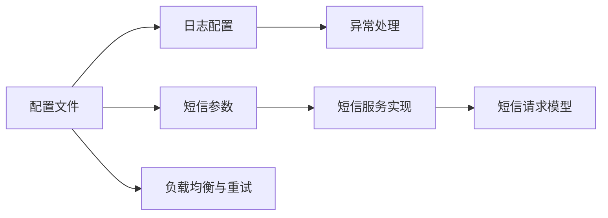

# 告警通知

<cite>
**本文引用的文件**
- [application.yml](file://src/main/resources/application.yml)
- [application-dev.yml](file://src/main/resources/application-dev.yml)
- [logback-spring.xml](file://src/main/resources/logback-spring.xml)
- [GlobalExceptionHandler.java](file://src/main/java/com/jiuyu/governance/plugins/webmvc/GlobalExceptionHandler.java)
- [BusinessException.java](file://src/main/java/com/jiuyu/governance/common/exceptions/BusinessException.java)
- [SmsParameter.java](file://src/main/java/com/jiuyu/governance/plugins/sms/SmsParameter.java)
- [SmsServiceImpl.java](file://src/main/java/com/jiuyu/governance/openfeign/replay/impl/SmsServiceImpl.java)
- [SmsPushRequest.java](file://src/main/java/com/jiuyu/governance/openfeign/replay/request/SmsPushRequest.java)
- [SmsBatchPushRequest.java](file://src/main/java/com/jiuyu/governance/openfeign/replay/request/SmsBatchPushRequest.java)
- [LightweightLoadBalancerInterceptor.java](file://src/main/java/com/jiuyu/governance/plugins/http/LightweightLoadBalancerInterceptor.java)
- [ServiceInstance.java](file://src/main/java/com/jiuyu/governance/plugins/http/ServiceInstance.java)
- [ERROR_CODE_DICT.md](file://ERROR_CODE_DICT.md)
- [接口权限列表.md](file://docs/接口权限列表.md)
</cite>

## 目录
1. [简介](#简介)
2. [项目结构](#项目结构)
3. [核心组件](#核心组件)
4. [架构总览](#架构总览)
5. [详细组件分析](#详细组件分析)
6. [依赖关系分析](#依赖关系分析)
7. [性能考量](#性能考量)
8. [故障排查指南](#故障排查指南)
9. [结论](#结论)
10. [附录](#附录)

## 简介
本指南面向fupan-governance-server项目的告警通知配置与落地实践，目标是帮助运维与开发团队建立完善的告警规则、通知渠道与处理流程，覆盖业务错误、性能与可用性三类告警，并结合现有工程能力（异常统一处理、短信通道、日志采集、负载均衡与重试）给出可操作的配置建议与最佳实践。

## 项目结构
围绕告警通知的关键工程要素主要分布在如下位置：
- 配置层：Spring Boot多环境配置文件，集中承载短信、XXL-Job、签名与Redis等与告警/通知相关的参数
- 异常与日志：全局异常处理器与日志配置，为告警来源与根因定位提供支撑
- 通知通道：短信通道实现与请求模型，作为告警通知的重要载体之一
- 运行保障：负载均衡与重试拦截器，提升系统可用性，降低告警风暴概率

**图示来源**
- [application.yml:1-148](file://src/main/resources/application.yml#L1-L148)
- [application-dev.yml:1-109](file://src/main/resources/application-dev.yml#L1-L109)
- [logback-spring.xml:21-77](file://src/main/resources/logback-spring.xml#L21-L77)
- [GlobalExceptionHandler.java:1-377](file://src/main/java/com/jiuyu/governance/plugins/webmvc/GlobalExceptionHandler.java#L1-L377)
- [BusinessException.java:1-48](file://src/main/java/com/jiuyu/governance/common/exceptions/BusinessException.java#L1-L48)
- [SmsServiceImpl.java:98-147](file://src/main/java/com/jiuyu/governance/openfeign/replay/impl/SmsServiceImpl.java#L98-L147)
- [SmsPushRequest.java:1-69](file://src/main/java/com/jiuyu/governance/openfeign/replay/request/SmsPushRequest.java#L1-L69)
- [SmsBatchPushRequest.java:1-67](file://src/main/java/com/jiuyu/governance/openfeign/replay/request/SmsBatchPushRequest.java#L1-L67)
- [SmsParameter.java:1-69](file://src/main/java/com/jiuyu/governance/plugins/sms/SmsParameter.java#L1-L69)
- [LightweightLoadBalancerInterceptor.java:78-105](file://src/main/java/com/jiuyu/governance/plugins/http/LightweightLoadBalancerInterceptor.java#L78-L105)
- [ServiceInstance.java:1-35](file://src/main/java/com/jiuyu/governance/plugins/http/ServiceInstance.java#L1-L35)

**章节来源**
- [application.yml:1-148](file://src/main/resources/application.yml#L1-L148)
- [application-dev.yml:1-109](file://src/main/resources/application-dev.yml#L1-L109)
- [logback-spring.xml:21-77](file://src/main/resources/logback-spring.xml#L21-L77)
- [GlobalExceptionHandler.java:1-377](file://src/main/java/com/jiuyu/governance/plugins/webmvc/GlobalExceptionHandler.java#L1-L377)
- [BusinessException.java:1-48](file://src/main/java/com/jiuyu/governance/common/exceptions/BusinessException.java#L1-L48)
- [SmsServiceImpl.java:98-147](file://src/main/java/com/jiuyu/governance/openfeign/replay/impl/SmsServiceImpl.java#L98-L147)
- [SmsPushRequest.java:1-69](file://src/main/java/com/jiuyu/governance/openfeign/replay/request/SmsPushRequest.java#L1-L69)
- [SmsBatchPushRequest.java:1-67](file://src/main/java/com/jiuyu/governance/openfeign/replay/request/SmsBatchPushRequest.java#L1-L67)
- [SmsParameter.java:1-69](file://src/main/java/com/jiuyu/governance/plugins/sms/SmsParameter.java#L1-L69)
- [LightweightLoadBalancerInterceptor.java:78-105](file://src/main/java/com/jiuyu/governance/plugins/http/LightweightLoadBalancerInterceptor.java#L78-L105)
- [ServiceInstance.java:1-35](file://src/main/java/com/jiuyu/governance/plugins/http/ServiceInstance.java#L1-L35)

## 核心组件
- 异常统一处理与告警来源
  - 全局异常处理器将各类异常转化为标准响应，便于接入统一告警平台或日志平台进行采集与告警
  - 业务异常封装在统一异常类中，便于区分业务错误与系统错误
- 通知通道（短信）
  - 提供单发与批量短信推送能力，支持模板参数注入，适合作为告警通知渠道之一
- 日志与异步落盘
  - 日志配置包含异步Appender与滚动策略，保证高吞吐下的稳定性与可观测性
- 运行保障（负载均衡与重试）
  - 轻量级负载均衡与重试拦截器，降低外部依赖抖动引发的告警风暴

**章节来源**
- [GlobalExceptionHandler.java:94-374](file://src/main/java/com/jiuyu/governance/plugins/webmvc/GlobalExceptionHandler.java#L94-L374)
- [BusinessException.java:17-48](file://src/main/java/com/jiuyu/governance/common/exceptions/BusinessException.java#L17-L48)
- [SmsServiceImpl.java:98-147](file://src/main/java/com/jiuyu/governance/openfeign/replay/impl/SmsServiceImpl.java#L98-L147)
- [logback-spring.xml:21-77](file://src/main/resources/logback-spring.xml#L21-L77)
- [LightweightLoadBalancerInterceptor.java:78-105](file://src/main/java/com/jiuyu/governance/plugins/http/LightweightLoadBalancerInterceptor.java#L78-L105)

## 架构总览
告警通知在系统中的位置与交互如下：

**图示来源**
- [GlobalExceptionHandler.java:94-374](file://src/main/java/com/jiuyu/governance/plugins/webmvc/GlobalExceptionHandler.java#L94-L374)
- [SmsServiceImpl.java:98-147](file://src/main/java/com/jiuyu/governance/openfeign/replay/impl/SmsServiceImpl.java#L98-L147)
- [logback-spring.xml:21-77](file://src/main/resources/logback-spring.xml#L21-L77)

## 详细组件分析

### 异常统一处理与告警规则
- 规则要点
  - 将业务异常与系统异常统一为标准响应，便于接入统一告警平台
  - 通过错误码分段与前端交互约定，明确不同级别的处理动作
  - 结合日志系统，实现错误事件的持久化与检索
- 告警条件建议
  - 业务错误：针对规则类与业务类错误码，按模块/接口维度统计异常频次，超过阈值触发告警
  - 系统错误：针对通用类与底层类错误码，按服务实例维度统计异常率，超过阈值触发告警
  - 交互类错误：针对需要前端强感知的错误码，建议纳入“重要告警”清单
- 告警级别定义
  - 低：规则类与业务类（2xxx/3xxx），默认提示，非阻断性
  - 中：通用类（1xxx），系统组件异常，需关注
  - 高：底层类（0xxx）与交互类（4xxx），阻断性或强交互，需立即处理
- 去重与抑制
  - 对同一接口/模块在固定窗口内的重复错误码进行去重
  - 对上游依赖失败导致的级联错误进行抑制，避免告警风暴

**图示来源**
- [ERROR_CODE_DICT.md:11-17](file://ERROR_CODE_DICT.md#L11-L17)
- [ERROR_CODE_DICT.md:54-84](file://ERROR_CODE_DICT.md#L54-L84)
- [GlobalExceptionHandler.java:94-374](file://src/main/java/com/jiuyu/governance/plugins/webmvc/GlobalExceptionHandler.java#L94-L374)

**章节来源**
- [ERROR_CODE_DICT.md:1-160](file://ERROR_CODE_DICT.md#L1-L160)
- [GlobalExceptionHandler.java:94-374](file://src/main/java/com/jiuyu/governance/plugins/webmvc/GlobalExceptionHandler.java#L94-L374)

### 通知渠道配置：短信告警
- 单发与批量短信
  - 单发：适用于点对点告警，如负责人或值班人
  - 批量：适用于群组告警，如团队或模块
- 模板与参数
  - 模板ID与参数键值对通过请求模型传递，支持动态替换
- 频控与风控
  - 建议结合短信配置参数中的有效期、最大错误次数与缓存前缀，实现验证码/告警短信的发送频率控制
- 配置要点
  - 在配置文件中开启/关闭Mock模式，便于测试与灰度
  - 固定验证码用于联调与演示，生产环境应关闭Mock

**图示来源**
- [SmsServiceImpl.java:98-147](file://src/main/java/com/jiuyu/governance/openfeign/replay/impl/SmsServiceImpl.java#L98-L147)
- [SmsPushRequest.java:1-69](file://src/main/java/com/jiuyu/governance/openfeign/replay/request/SmsPushRequest.java#L1-L69)
- [SmsBatchPushRequest.java:1-67](file://src/main/java/com/jiuyu/governance/openfeign/replay/request/SmsBatchPushRequest.java#L1-L67)
- [SmsParameter.java:1-69](file://src/main/java/com/jiuyu/governance/plugins/sms/SmsParameter.java#L1-L69)
- [application-dev.yml:105-109](file://src/main/resources/application-dev.yml#L105-L109)

**章节来源**
- [SmsServiceImpl.java:98-147](file://src/main/java/com/jiuyu/governance/openfeign/replay/impl/SmsServiceImpl.java#L98-L147)
- [SmsPushRequest.java:1-69](file://src/main/java/com/jiuyu/governance/openfeign/replay/request/SmsPushRequest.java#L1-L69)
- [SmsBatchPushRequest.java:1-67](file://src/main/java/com/jiuyu/governance/openfeign/replay/request/SmsBatchPushRequest.java#L1-L67)
- [SmsParameter.java:1-69](file://src/main/java/com/jiuyu/governance/plugins/sms/SmsParameter.java#L1-L69)
- [application-dev.yml:105-109](file://src/main/resources/application-dev.yml#L105-L109)

### 通知渠道配置：邮件/企业微信/钉钉告警
- 建议方案
  - 邮件：通过企业邮箱或第三方邮件服务集成，适合非实时但需留痕的告警
  - 企业微信/钉钉：通过官方机器人或开放平台API，适合即时通知与快速处置
- 实施步骤
  - 在配置文件中新增对应渠道的接入参数（如Webhook地址、应用密钥等）
  - 在通知服务中扩展渠道适配器，复用短信通道的模板与参数模型
  - 在告警规则中增加渠道路由，按级别/模块选择不同通知方式
- 注意事项
  - 控制发送频率，避免骚扰
  - 对敏感信息进行脱敏处理
  - 建立渠道可用性监控与降级策略

[本节为概念性说明，不直接分析具体文件，故无“章节来源”]

### 业务告警配置
- 业务错误监控
  - 按接口/模块统计规则类与业务类错误码占比，设置阈值触发告警
  - 关注重复错误码的收敛情况，避免“热点错误”长期存在
- 性能告警
  - 结合负载均衡与重试拦截器，观察上游依赖的失败率与延迟分布
  - 对慢请求与超时请求设置阈值，触发性能告警
- 可用性告警
  - 监控服务实例健康状态与存活率，结合日志系统定位异常
  - 对交互类错误码进行重点监控，确保前端强感知告警及时触达

**章节来源**
- [LightweightLoadBalancerInterceptor.java:78-105](file://src/main/java/com/jiuyu/governance/plugins/http/LightweightLoadBalancerInterceptor.java#L78-L105)
- [ERROR_CODE_DICT.md:54-84](file://ERROR_CODE_DICT.md#L54-L84)

### 告警去重与抑制机制
- 去重
  - 在固定时间窗口内，对同一接口/模块/错误码进行聚合，仅保留首次告警
- 抑制
  - 对由上游依赖失败引发的级联错误，进行抑制，待上游恢复后再触发
- 实现建议
  - 使用Redis等缓存存储告警指纹与抑制状态
  - 配置合理的窗口与冷却时间，平衡告警及时性与稳定性

**章节来源**
- [SmsParameter.java:37-48](file://src/main/java/com/jiuyu/governance/plugins/sms/SmsParameter.java#L37-L48)

### 告警历史记录、统计分析与处理流程
- 历史记录
  - 通过日志系统记录每次异常与通知事件，支持检索与回溯
- 统计分析
  - 按错误码、模块、接口、时间段进行统计，形成趋势图与热力图
- 处理流程
  - 告警触发 → 自动通知 → 人工处置 → 处理反馈 → 关闭/升级

**图示来源**
- [logback-spring.xml:21-77](file://src/main/resources/logback-spring.xml#L21-L77)

**章节来源**
- [logback-spring.xml:21-77](file://src/main/resources/logback-spring.xml#L21-L77)

## 依赖关系分析
- 配置依赖
  - application.yml与application-dev.yml分别承载通用与环境特有配置
  - 日志配置与异常处理共同构成可观测性基础
- 通知依赖
  - 短信服务实现依赖短信参数配置与请求模型
- 运行依赖
  - 负载均衡与重试拦截器提升系统韧性，降低告警风暴概率

**图示来源**
- [application.yml:1-148](file://src/main/resources/application.yml#L1-L148)
- [application-dev.yml:1-109](file://src/main/resources/application-dev.yml#L1-L109)
- [logback-spring.xml:21-77](file://src/main/resources/logback-spring.xml#L21-L77)
- [SmsParameter.java:1-69](file://src/main/java/com/jiuyu/governance/plugins/sms/SmsParameter.java#L1-L69)
- [SmsServiceImpl.java:98-147](file://src/main/java/com/jiuyu/governance/openfeign/replay/impl/SmsServiceImpl.java#L98-L147)
- [SmsPushRequest.java:1-69](file://src/main/java/com/jiuyu/governance/openfeign/replay/request/SmsPushRequest.java#L1-L69)
- [LightweightLoadBalancerInterceptor.java:78-105](file://src/main/java/com/jiuyu/governance/plugins/http/LightweightLoadBalancerInterceptor.java#L78-L105)

**章节来源**
- [application.yml:1-148](file://src/main/resources/application.yml#L1-L148)
- [application-dev.yml:1-109](file://src/main/resources/application-dev.yml#L1-L109)
- [logback-spring.xml:21-77](file://src/main/resources/logback-spring.xml#L21-L77)
- [SmsParameter.java:1-69](file://src/main/java/com/jiuyu/governance/plugins/sms/SmsParameter.java#L1-L69)
- [SmsServiceImpl.java:98-147](file://src/main/java/com/jiuyu/governance/openfeign/replay/impl/SmsServiceImpl.java#L98-L147)
- [SmsPushRequest.java:1-69](file://src/main/java/com/jiuyu/governance/openfeign/replay/request/SmsPushRequest.java#L1-L69)
- [LightweightLoadBalancerInterceptor.java:78-105](file://src/main/java/com/jiuyu/governance/plugins/http/LightweightLoadBalancerInterceptor.java#L78-L105)

## 性能考量
- 日志异步化与滚动策略
  - 使用异步Appender与大小/时间滚动，降低磁盘IO压力
- 负载均衡与重试
  - 合理配置重试次数与抖动，避免雪崩效应
- 短信发送频率控制
  - 通过配置参数限制发送速率，避免渠道限流与投诉

**章节来源**
- [logback-spring.xml:48-77](file://src/main/resources/logback-spring.xml#L48-L77)
- [LightweightLoadBalancerInterceptor.java:78-105](file://src/main/java/com/jiuyu/governance/plugins/http/LightweightLoadBalancerInterceptor.java#L78-L105)
- [SmsParameter.java:37-48](file://src/main/java/com/jiuyu/governance/plugins/sms/SmsParameter.java#L37-L48)

## 故障排查指南
- 常见问题
  - 短信发送失败：检查模板ID、手机号格式与渠道可用性
  - 频控触发：调整发送频率或优化缓存键设计
  - 日志未落盘：检查日志配置与异步Appender队列
  - 异常未被捕获：确认异常是否被全局异常处理器覆盖
- 排查步骤
  - 通过日志定位异常上下文与堆栈
  - 核对错误码分段与前端交互约定
  - 检查通知渠道配置与参数
  - 验证负载均衡与重试策略是否生效

**章节来源**
- [GlobalExceptionHandler.java:94-374](file://src/main/java/com/jiuyu/governance/plugins/webmvc/GlobalExceptionHandler.java#L94-L374)
- [logback-spring.xml:21-77](file://src/main/resources/logback-spring.xml#L21-L77)
- [SmsServiceImpl.java:98-147](file://src/main/java/com/jiuyu/governance/openfeign/replay/impl/SmsServiceImpl.java#L98-L147)

## 结论
通过统一异常处理、完备的日志与异步落盘、以及可扩展的通知通道，fupan-governance-server具备了构建稳定告警体系的良好基础。结合本文提供的规则、渠道与流程建议，可有效降低告警风暴、提升告警质量，并完善业务错误、性能与可用性三类告警的闭环管理。

## 附录
- 权限接口列表（与告警无关，仅供参考）
  - 项目包含大量权限接口清单，便于理解系统边界与职责划分

**章节来源**
- [接口权限列表.md:1-116](file://docs/接口权限列表.md#L1-L116)