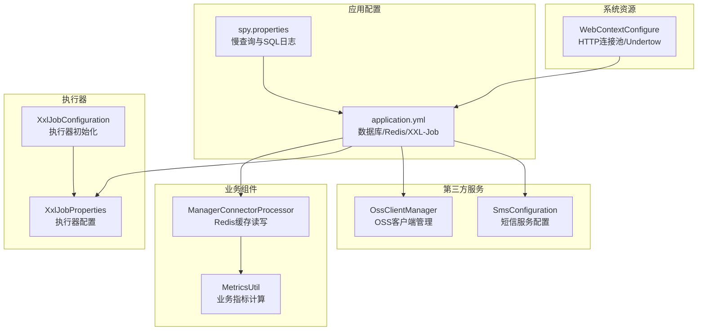
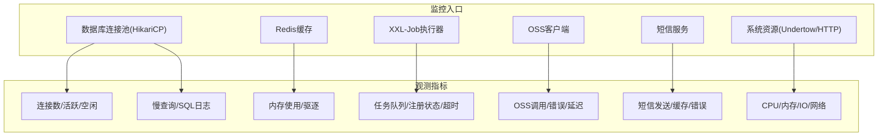
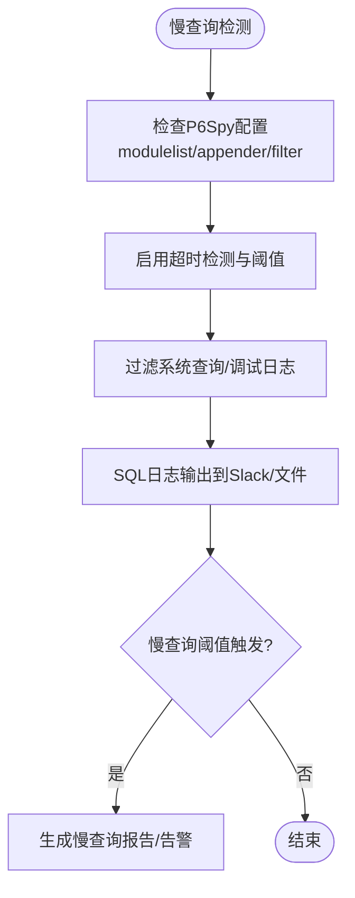
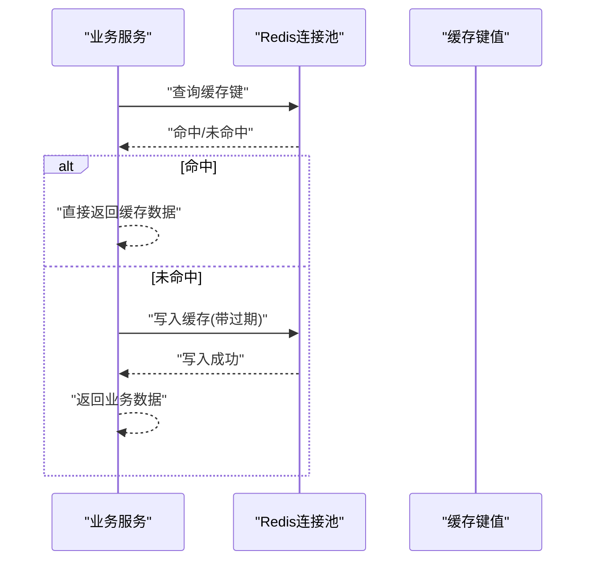
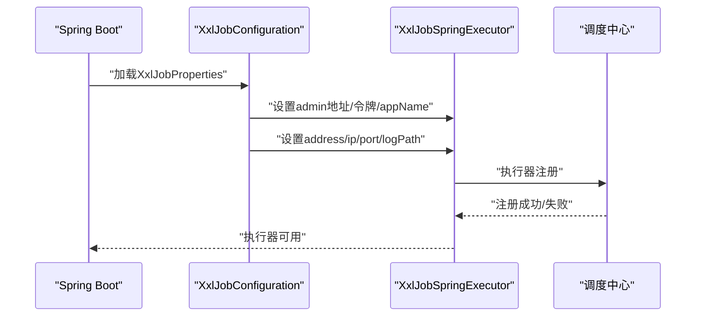
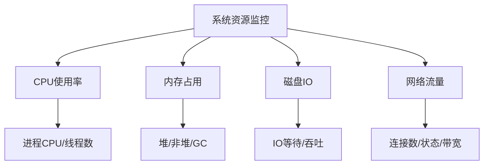
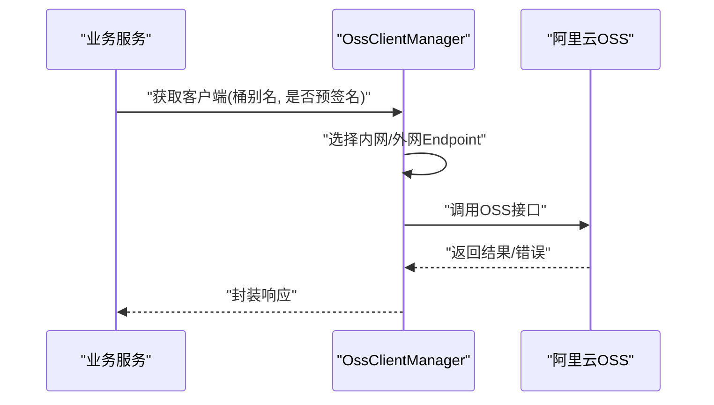
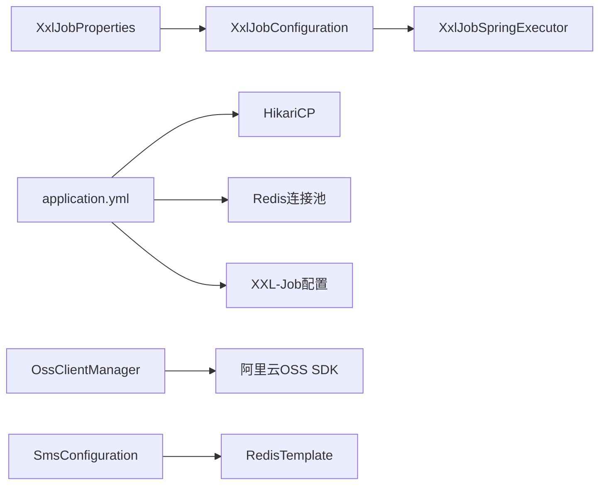

# 基础设施监控

<cite>
**本文引用的文件**
- [application.yml](file://src/main/resources/application.yml)
- [spy.properties](file://src/main/resources/spy.properties)
- [XxlJobProperties.java](file://src/main/java/com/jiuyu/governance/plugins/xxljob/XxlJobProperties.java)
- [XxlJobConfiguration.java](file://src/main/java/com/jiuyu/governance/plugins/xxljob/XxlJobConfiguration.java)
- [OssClientManager.java](file://src/main/java/com/jiuyu/governance/plugins/oss/core/OssClientManager.java)
- [SmsConfiguration.java](file://src/main/java/com/jiuyu/governance/plugins/sms/SmsConfiguration.java)
- [MetricsUtil.java](file://src/main/java/com/jiuyu/governance/business/performance/utils/MetricsUtil.java)
- [ManagerConnectorProcessor.java](file://src/main/java/com/jiuyu/governance/business/org/service/impl/ManagerConnectorProcessor.java)
- [WebContextConfigure.java](file://src/main/java/com/jiuyu/governance/plugins/webmvc/WebContextConfigure.java)
</cite>

## 目录
1. [简介](#简介)
2. [项目结构](#项目结构)
3. [核心组件](#核心组件)
4. [架构总览](#架构总览)
5. [详细组件分析](#详细组件分析)
6. [依赖分析](#依赖分析)
7. [性能考虑](#性能考虑)
8. [故障排查指南](#故障排查指南)
9. [结论](#结论)
10. [附录](#附录)

## 简介
本指南面向 fupan-governance-server 的基础设施监控，聚焦以下方面：
- 数据库连接池监控：MySQL 连接数、慢查询、连接池性能指标
- Redis 缓存监控：连接状态、内存使用、命中率、命令统计
- XXL-Job 执行器监控：任务执行队列、执行器注册状态、任务超时监控
- 系统资源监控：CPU 使用率、内存占用、磁盘 IO、网络流量
- 第三方服务监控：阿里云 OSS 存储监控、短信服务调用监控

本指南结合项目现有配置与代码实现，给出可落地的监控方案与观测点。

## 项目结构
围绕基础设施监控，项目中与之相关的关键位置如下：
- 数据库连接池与慢查询：application.yml 中 HikariCP 连接池配置；spy.properties 中 P6Spy 慢查询与 SQL 日志
- Redis 缓存：application.yml 中 Redis 连接池配置；ManagerConnectorProcessor 中缓存读写
- XXL-Job：XxlJobProperties 与 XxlJobConfiguration 中执行器配置与初始化
- OSS 与短信：OssClientManager 与 SmsConfiguration 中第三方服务封装
- 系统资源：WebContextConfigure 中 Undertow 与 HTTP 客户端连接池配置

图表来源
- [application.yml:42-148](file://src/main/resources/application.yml#L42-L148)
- [spy.properties:1-13](file://src/main/resources/spy.properties#L1-L13)
- [ManagerConnectorProcessor.java:174-197](file://src/main/java/com/jiuyu/governance/business/org/service/impl/ManagerConnectorProcessor.java#L174-L197)
- [MetricsUtil.java:1-267](file://src/main/java/com/jiuyu/governance/business/performance/utils/MetricsUtil.java#L1-L267)
- [XxlJobProperties.java:1-70](file://src/main/java/com/jiuyu/governance/plugins/xxljob/XxlJobProperties.java#L1-L70)
- [XxlJobConfiguration.java:1-77](file://src/main/java/com/jiuyu/governance/plugins/xxljob/XxlJobConfiguration.java#L1-L77)
- [OssClientManager.java:1-154](file://src/main/java/com/jiuyu/governance/plugins/oss/core/OssClientManager.java#L1-L154)
- [SmsConfiguration.java:1-59](file://src/main/java/com/jiuyu/governance/plugins/sms/SmsConfiguration.java#L1-L59)
- [WebContextConfigure.java:22-173](file://src/main/java/com/jiuyu/governance/plugins/webmvc/WebContextConfigure.java#L22-L173)

章节来源
- [application.yml:42-148](file://src/main/resources/application.yml#L42-L148)
- [spy.properties:1-13](file://src/main/resources/spy.properties#L1-L13)

## 核心组件
- 数据库连接池（HikariCP）
  - 最小空闲连接、最大连接数、连接生命周期、连接超时、空闲超时、心跳 SQL、验证超时、保持活跃间隔等
- Redis 缓存
  - 连接池最大并发、最大等待、最大空闲、最小空闲、驱逐周期等
- XXL-Job 执行器
  - 启用开关、调度中心地址、访问令牌、执行器应用名、注册地址/IP/端口、日志路径与保留天数
- OSS 客户端
  - 多桶客户端缓存、内外网 Endpoint 切换、AccessKey 配置、客户端创建与销毁
- 短信服务
  - 模板配置、验证码缓存、Mock 模式、服务 Bean 注册
- 系统资源
  - Undertow 配置、HTTP 客户端连接池、WebSocket 缓冲区

章节来源
- [application.yml:42-148](file://src/main/resources/application.yml#L42-L148)
- [XxlJobProperties.java:1-70](file://src/main/java/com/jiuyu/governance/plugins/xxljob/XxlJobProperties.java#L1-L70)
- [XxlJobConfiguration.java:1-77](file://src/main/java/com/jiuyu/governance/plugins/xxljob/XxlJobConfiguration.java#L1-L77)
- [OssClientManager.java:1-154](file://src/main/java/com/jiuyu/governance/plugins/oss/core/OssClientManager.java#L1-L154)
- [SmsConfiguration.java:1-59](file://src/main/java/com/jiuyu/governance/plugins/sms/SmsConfiguration.java#L1-L59)
- [WebContextConfigure.java:22-173](file://src/main/java/com/jiuyu/governance/plugins/webmvc/WebContextConfigure.java#L22-L173)

## 架构总览
下图展示了基础设施监控的关键交互路径与观测点。

图表来源
- [application.yml:42-148](file://src/main/resources/application.yml#L42-L148)
- [spy.properties:1-13](file://src/main/resources/spy.properties#L1-L13)
- [XxlJobConfiguration.java:1-77](file://src/main/java/com/jiuyu/governance/plugins/xxljob/XxlJobConfiguration.java#L1-L77)
- [OssClientManager.java:1-154](file://src/main/java/com/jiuyu/governance/plugins/oss/core/OssClientManager.java#L1-L154)
- [SmsConfiguration.java:1-59](file://src/main/java/com/jiuyu/governance/plugins/sms/SmsConfiguration.java#L1-L59)
- [WebContextConfigure.java:22-173](file://src/main/java/com/jiuyu/governance/plugins/webmvc/WebContextConfigure.java#L22-L173)

## 详细组件分析

### 数据库连接池监控（MySQL/HikariCP）
- 连接池参数
  - 最小空闲连接、最大连接数、自动提交、空闲超时、连接池名称、最大生命周期、连接超时、验证超时、保持活跃间隔、初始化 SQL、测试查询
- 慢查询与 SQL 日志
  - P6Spy 模块启用、日志适配器、过滤类别、日期格式、超时检测与阈值、过滤 SQL
- 监控建议
  - 连接池健康：活跃连接、空闲连接、等待队列长度、连接创建/销毁速率
  - 性能指标：连接获取等待时间、连接存活时间分布、连接泄漏检测
  - 慢查询：慢查询阈值、慢查询占比、慢查询 Top SQL、执行计划分析
  - 健康检查：连接测试查询成功率、连接初始化失败率

图表来源
- [spy.properties:1-13](file://src/main/resources/spy.properties#L1-L13)
- [application.yml:42-61](file://src/main/resources/application.yml#L42-L61)

章节来源
- [application.yml:42-61](file://src/main/resources/application.yml#L42-L61)
- [spy.properties:1-13](file://src/main/resources/spy.properties#L1-L13)

### Redis 缓存监控
- 连接池参数
  - 最大并发、最大等待、最大空闲、最小空闲、驱逐周期
- 缓存使用模式
  - 业务中通过 RedisTemplate 对缓存进行读写，典型场景为组织架构缓存键值
- 监控建议
  - 连接状态：连接池活跃/空闲/等待/拒绝数
  - 内存使用：内存使用量、内存碎片率、过期/淘汰键数量
  - 命令统计：命令执行次数、慢命令、KEYS/SCAN 使用情况
  - 命中率：GET/SET 命中率、缓存穿透/击穿防护
  - 延迟：命令延迟分布、网络往返时间

图表来源
- [application.yml:85-100](file://src/main/resources/application.yml#L85-L100)
- [ManagerConnectorProcessor.java:174-197](file://src/main/java/com/jiuyu/governance/business/org/service/impl/ManagerConnectorProcessor.java#L174-L197)

章节来源
- [application.yml:85-100](file://src/main/resources/application.yml#L85-L100)
- [ManagerConnectorProcessor.java:174-197](file://src/main/java/com/jiuyu/governance/business/org/service/impl/ManagerConnectorProcessor.java#L174-L197)

### XXL-Job 执行器监控
- 配置项
  - 启用开关、调度中心地址、访问令牌、请求超时
  - 执行器应用名、注册地址/IP/端口、日志路径与保留天数
- 初始化流程
  - 条件化装配，按配置设置执行器属性并启动
- 监控建议
  - 注册状态：执行器是否成功注册到调度中心、心跳状态
  - 任务队列：任务排队长度、执行耗时分布、失败重试次数
  - 超时监控：任务超时阈值、超时任务占比、超时告警
  - 日志：执行器日志路径、日志轮转与保留策略

图表来源
- [XxlJobConfiguration.java:1-77](file://src/main/java/com/jiuyu/governance/plugins/xxljob/XxlJobConfiguration.java#L1-L77)
- [XxlJobProperties.java:1-70](file://src/main/java/com/jiuyu/governance/plugins/xxljob/XxlJobProperties.java#L1-L70)
- [application.yml:124-148](file://src/main/resources/application.yml#L124-L148)

章节来源
- [XxlJobConfiguration.java:1-77](file://src/main/java/com/jiuyu/governance/plugins/xxljob/XxlJobConfiguration.java#L1-L77)
- [XxlJobProperties.java:1-70](file://src/main/java/com/jiuyu/governance/plugins/xxljob/XxlJobProperties.java#L1-L70)
- [application.yml:124-148](file://src/main/resources/application.yml#L124-L148)

### 系统资源监控（CPU/内存/磁盘/网络）
- Undertow 配置
  - WebSocket 缓冲区大小配置
- HTTP 客户端连接池
  - 连接管理器、Socket 配置、并发/复用策略、超时设置
- 监控建议
  - CPU：进程 CPU 使用率、线程数、阻塞线程数
  - 内存：堆/非堆使用、GC 次数与耗时、Full GC 频率
  - 磁盘：IO 等待、吞吐、队列长度、磁盘空间使用
  - 网络：连接数、连接状态分布、带宽使用、丢包/重传

图表来源
- [WebContextConfigure.java:22-173](file://src/main/java/com/jiuyu/governance/plugins/webmvc/WebContextConfigure.java#L22-L173)

章节来源
- [WebContextConfigure.java:22-173](file://src/main/java/com/jiuyu/governance/plugins/webmvc/WebContextConfigure.java#L22-L173)

### 第三方服务监控（阿里云 OSS 与短信）
- OSS 客户端管理
  - 多桶客户端缓存（内外网）、桶配置覆盖、客户端创建与销毁
  - 监控建议：客户端创建/销毁次数、内外网 Endpoint 使用比例、错误率与超时
- 短信服务
  - 模板配置、验证码缓存、Mock 模式、服务 Bean 注册
  - 监控建议：发送成功率、失败原因分类、缓存命中率、Mock 模式开关

图表来源
- [OssClientManager.java:1-154](file://src/main/java/com/jiuyu/governance/plugins/oss/core/OssClientManager.java#L1-L154)

章节来源
- [OssClientManager.java:1-154](file://src/main/java/com/jiuyu/governance/plugins/oss/core/OssClientManager.java#L1-L154)
- [SmsConfiguration.java:1-59](file://src/main/java/com/jiuyu/governance/plugins/sms/SmsConfiguration.java#L1-L59)

## 依赖分析
- 组件耦合
  - XXL-Job 执行器依赖配置类与调度中心
  - Redis 缓存读写依赖连接池配置
  - OSS 客户端依赖桶配置与 Endpoint
  - 短信服务依赖 Redis 缓存与模板配置
- 外部依赖
  - HikariCP、P6Spy、Undertow、Apache HttpClient、Redis、OSS SDK、XXL-Job

图表来源
- [XxlJobProperties.java:1-70](file://src/main/java/com/jiuyu/governance/plugins/xxljob/XxlJobProperties.java#L1-L70)
- [XxlJobConfiguration.java:1-77](file://src/main/java/com/jiuyu/governance/plugins/xxljob/XxlJobConfiguration.java#L1-L77)
- [application.yml:42-148](file://src/main/resources/application.yml#L42-L148)
- [OssClientManager.java:1-154](file://src/main/java/com/jiuyu/governance/plugins/oss/core/OssClientManager.java#L1-L154)
- [SmsConfiguration.java:1-59](file://src/main/java/com/jiuyu/governance/plugins/sms/SmsConfiguration.java#L1-L59)

章节来源
- [XxlJobProperties.java:1-70](file://src/main/java/com/jiuyu/governance/plugins/xxljob/XxlJobProperties.java#L1-L70)
- [XxlJobConfiguration.java:1-77](file://src/main/java/com/jiuyu/governance/plugins/xxljob/XxlJobConfiguration.java#L1-L77)
- [application.yml:42-148](file://src/main/resources/application.yml#L42-L148)
- [OssClientManager.java:1-154](file://src/main/java/com/jiuyu/governance/plugins/oss/core/OssClientManager.java#L1-L154)
- [SmsConfiguration.java:1-59](file://src/main/java/com/jiuyu/governance/plugins/sms/SmsConfiguration.java#L1-L59)

## 性能考虑
- 连接池优化
  - 合理设置最小空闲与最大连接，避免过大导致资源浪费，过小导致排队
  - 启用连接测试查询与验证超时，降低连接失效风险
- 缓存策略
  - 为热点数据设置合理过期时间，避免缓存雪崩
  - 监控慢命令与 KEYS/SCAN 使用，避免阻塞
- XXL-Job
  - 控制任务执行时长与超时阈值，避免长时间阻塞
  - 合理设置日志路径与保留天数，平衡磁盘占用
- 系统资源
  - Undertow 与 HTTP 客户端连接池参数需与业务并发匹配
  - 监控 GC 与内存使用，避免频繁 Full GC

## 故障排查指南
- 数据库连接池
  - 现象：连接池耗尽、获取连接超时
  - 排查：检查最大连接数、等待队列、连接超时、慢查询日志
- Redis
  - 现象：连接池拒绝、命令超时
  - 排查：检查连接池上限、驱逐策略、慢命令、内存使用
- XXL-Job
  - 现象：执行器未注册、任务超时
  - 排查：检查调度中心地址/令牌、执行器注册地址/IP/端口、日志路径
- OSS
  - 现象：客户端创建失败、Endpoint 未配置
  - 排查：检查桶别名、Endpoint、AccessKey 配置
- 短信
  - 现象：发送失败、验证码缓存异常
  - 排查：检查模板配置、缓存前缀、Mock 模式开关

章节来源
- [spy.properties:1-13](file://src/main/resources/spy.properties#L1-L13)
- [application.yml:42-148](file://src/main/resources/application.yml#L42-L148)
- [OssClientManager.java:1-154](file://src/main/java/com/jiuyu/governance/plugins/oss/core/OssClientManager.java#L1-L154)
- [SmsConfiguration.java:1-59](file://src/main/java/com/jiuyu/governance/plugins/sms/SmsConfiguration.java#L1-L59)
- [XxlJobConfiguration.java:1-77](file://src/main/java/com/jiuyu/governance/plugins/xxljob/XxlJobConfiguration.java#L1-L77)

## 结论
通过结合 application.yml 中的连接池与执行器配置、spy.properties 中的慢查询与 SQL 日志、以及各组件的初始化与使用逻辑，可以构建完善的基础设施监控体系。建议以“连接池健康、缓存命中率、任务执行质量、第三方服务可用性、系统资源瓶颈”为主线，持续观测与优化，保障系统稳定与高性能。

## 附录
- 业务指标工具（可辅助监控口径）
  - 指标计算工具类提供 ROI、退款率、转化率等常用业务指标计算，便于在监控面板中展示

章节来源
- [MetricsUtil.java:1-267](file://src/main/java/com/jiuyu/governance/business/performance/utils/MetricsUtil.java#L1-L267)