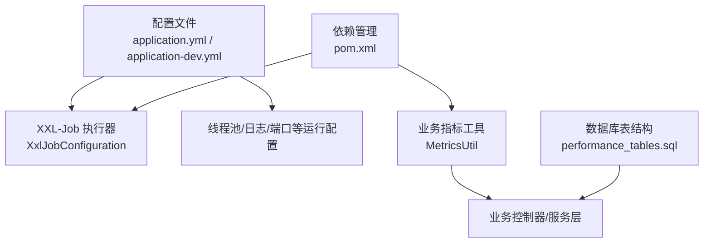
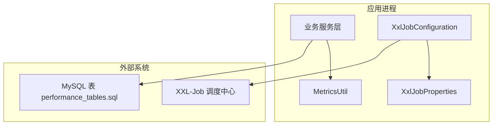
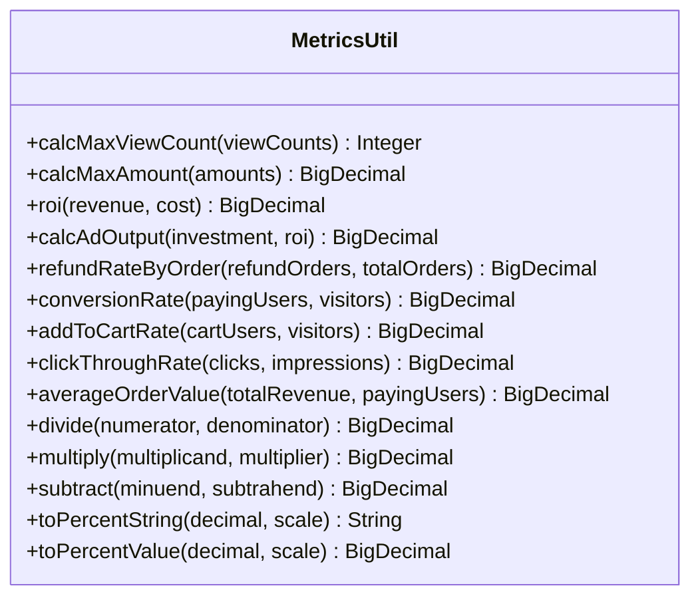
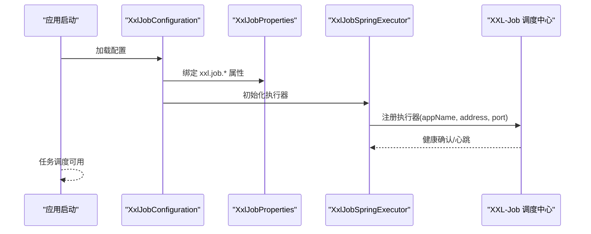
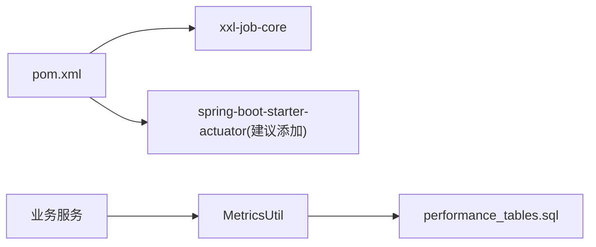

# 应用监控

<cite>
**本文引用的文件**
- [application.yml](file://src/main/resources/application.yml)
- [application-dev.yml](file://src/main/resources/application-dev.yml)
- [MetricsUtil.java](file://src/main/java/com/jiuyu/governance/business/performance/utils/MetricsUtil.java)
- [XxlJobConfiguration.java](file://src/main/java/com/jiuyu/governance/plugins/xxljob/XxlJobConfiguration.java)
- [XxlJobProperties.java](file://src/main/java/com/jiuyu/governance/plugins/xxljob/XxlJobProperties.java)
- [pom.xml](file://pom.xml)
- [performance_tables.sql](file://src/main/resources/sql/performance_tables.sql)
</cite>

## 目录
1. [简介](#简介)
2. [项目结构](#项目结构)
3. [核心组件](#核心组件)
4. [架构总览](#架构总览)
5. [详细组件分析](#详细组件分析)
6. [依赖关系分析](#依赖关系分析)
7. [性能考量](#性能考量)
8. [故障排查指南](#故障排查指南)
9. [结论](#结论)
10. [附录](#附录)

## 简介
本指南面向 fupan-governance-server 的运维与开发团队，提供一套可落地的应用监控配置方案。内容覆盖：
- Spring Boot Actuator 监控端点配置（健康检查、指标收集、应用状态）
- MetricsUtil 工具类的使用方式与扩展建议（自定义指标、业务指标）
- XXL-Job 任务监控配置（执行状态、调度性能、失败告警）
- 应用性能监控指标（响应时间、吞吐量、错误率、资源使用）
- 监控数据可视化与 Prometheus 集成、Grafana 仪表板建议
- 与现有项目配置的衔接与最佳实践

说明：当前仓库未包含 Actuator 监控端点的显式配置，但项目基于 Spring Boot 3.3.0，具备集成 Actuator 的能力；本指南在“Actuator 配置”部分给出推荐步骤，便于后续快速落地。

## 项目结构
围绕监控主题，本项目的关键位置如下：
- 配置层：application.yml、application-dev.yml 中包含 XXL-Job、线程池、日志等运行期配置
- 业务指标工具：MetricsUtil 提供业务指标计算方法
- 任务调度：XxlJobConfiguration、XxlJobProperties 提供执行器初始化与属性绑定
- 数据模型：performance_tables.sql 定义了业绩相关指标的持久化结构
- 依赖层：pom.xml 中包含 XXL-Job 依赖，Actuator 依赖需按需添加

图表来源
- [application.yml:124-148](file://src/main/resources/application.yml#L124-L148)
- [application-dev.yml:90-102](file://src/main/resources/application-dev.yml#L90-L102)
- [XxlJobConfiguration.java:30-76](file://src/main/java/com/jiuyu/governance/plugins/xxljob/XxlJobConfiguration.java#L30-L76)
- [XxlJobProperties.java:15-91](file://src/main/java/com/jiuyu/governance/plugins/xxljob/XxlJobProperties.java#L15-L91)
- [MetricsUtil.java:14-267](file://src/main/java/com/jiuyu/governance/business/performance/utils/MetricsUtil.java#L14-L267)
- [pom.xml:144-149](file://pom.xml#L144-L149)

章节来源
- [application.yml:124-148](file://src/main/resources/application.yml#L124-L148)
- [application-dev.yml:90-102](file://src/main/resources/application-dev.yml#L90-L102)
- [XxlJobConfiguration.java:30-76](file://src/main/java/com/jiuyu/governance/plugins/xxljob/XxlJobConfiguration.java#L30-L76)
- [XxlJobProperties.java:15-91](file://src/main/java/com/jiuyu/governance/plugins/xxljob/XxlJobProperties.java#L15-L91)
- [MetricsUtil.java:14-267](file://src/main/java/com/jiuyu/governance/business/performance/utils/MetricsUtil.java#L14-L267)
- [pom.xml:144-149](file://pom.xml#L144-L149)

## 核心组件
- XXL-Job 执行器配置：通过 XxlJobConfiguration 在启用开关开启时初始化执行器，读取 XxlJobProperties 中的 admin 与 executor 配置，完成调度中心地址、令牌、应用名、日志路径与端口等设置。
- MetricsUtil：提供业务侧指标计算方法，如最大场观、最大金额、ROI、退款率、转化率、点击率、客单价、百分比转换等，统一返回 BigDecimal，避免空指针与除零风险。
- 运行期配置：application.yml 与 application-dev.yml 提供端口、优雅停机、线程池、日志路径、XXL-Job 地址与端口等关键参数。

章节来源
- [XxlJobConfiguration.java:30-76](file://src/main/java/com/jiuyu/governance/plugins/xxljob/XxlJobConfiguration.java#L30-L76)
- [XxlJobProperties.java:15-91](file://src/main/java/com/jiuyu/governance/plugins/xxljob/XxlJobProperties.java#L15-L91)
- [MetricsUtil.java:14-267](file://src/main/java/com/jiuyu/governance/business/performance/utils/MetricsUtil.java#L14-L267)
- [application.yml:124-148](file://src/main/resources/application.yml#L124-L148)
- [application-dev.yml:90-102](file://src/main/resources/application-dev.yml#L90-L102)

## 架构总览
下图展示监控相关组件在应用中的交互关系：

图表来源
- [XxlJobConfiguration.java:30-76](file://src/main/java/com/jiuyu/governance/plugins/xxljob/XxlJobConfiguration.java#L30-L76)
- [XxlJobProperties.java:15-91](file://src/main/java/com/jiuyu/governance/plugins/xxljob/XxlJobProperties.java#L15-L91)
- [performance_tables.sql:7-311](file://src/main/resources/sql/performance_tables.sql#L7-L311)

## 详细组件分析

### Spring Boot Actuator 监控端点配置
- 当前仓库未包含 Actuator 的显式配置，但项目基于 Spring Boot 3.3.0，具备集成能力。
- 建议步骤（不包含具体代码内容，仅说明配置要点）：
  - 在依赖中引入 actuator（如未引入，请在 pom.xml 中添加对应依赖）。
  - 在 application.yml 中启用健康检查、指标暴露、HTTP 端点访问控制与安全策略。
  - 按需启用 JVM/进程指标、业务指标（Micrometer）与自定义指标。
  - 若使用 Prometheus，确保暴露端点与抓取配置一致。
- Actuator 与 Prometheus/Grafana 的对接属于通用实践，建议结合企业监控平台进行统一配置。

章节来源
- [pom.xml:35-167](file://pom.xml#L35-L167)

### MetricsUtil 工具类使用指南
- 设计目标：提供业务侧常用指标计算方法，统一返回 BigDecimal，避免空指针与除零异常。
- 关键能力：
  - 最大场观、最大金额
  - ROI、投放产出
  - 退款率（订单/金额）、支付转化率、加购率、点击率（CTR）、客单价
  - 除法、乘法、减法、百分比转换
- 使用建议：
  - 在业务服务层调用 MetricsUtil 方法进行指标计算，避免重复实现。
  - 对于需要持久化的指标，结合 performance_tables.sql 的字段设计，将计算结果写入数据库或缓存。
  - 对于需要对外暴露的指标，可通过 Micrometer 注册为自定义指标，便于 Prometheus/Grafana 展示。

图表来源
- [MetricsUtil.java:14-267](file://src/main/java/com/jiuyu/governance/business/performance/utils/MetricsUtil.java#L14-L267)

章节来源
- [MetricsUtil.java:14-267](file://src/main/java/com/jiuyu/governance/business/performance/utils/MetricsUtil.java#L14-L267)

### XXL-Job 任务监控配置
- 执行器初始化：当 xxl.job.enable=true 时，XxlJobConfiguration 会创建 XxlJobSpringExecutor，并读取 XxlJobProperties 中的 admin 与 executor 配置。
- 关键配置项（来自 application.yml 与 application-dev.yml）：
  - enable：是否启用执行器
  - admin.addresses：调度中心地址（可多地址）
  - admin.access-token：调度中心通信令牌
  - executor.app-name：执行器应用名
  - executor.port：执行器端口
  - executor.log-path：日志路径
  - executor.log-retention-days：日志保留天数
- 建议：
  - 在生产环境为 admin.access-token 设置强口令并在 CI/CD 中加密注入。
  - 将 executor.log-path 指向集中化日志目录，便于采集与检索。
  - 结合 XXL-Job 控制台查看任务执行状态、失败告警与调度性能趋势。

图表来源
- [XxlJobConfiguration.java:30-76](file://src/main/java/com/jiuyu/governance/plugins/xxljob/XxlJobConfiguration.java#L30-L76)
- [XxlJobProperties.java:15-91](file://src/main/java/com/jiuyu/governance/plugins/xxljob/XxlJobProperties.java#L15-L91)
- [application.yml:124-148](file://src/main/resources/application.yml#L124-L148)
- [application-dev.yml:90-102](file://src/main/resources/application-dev.yml#L90-L102)

章节来源
- [XxlJobConfiguration.java:30-76](file://src/main/java/com/jiuyu/governance/plugins/xxljob/XxlJobConfiguration.java#L30-L76)
- [XxlJobProperties.java:15-91](file://src/main/java/com/jiuyu/governance/plugins/xxljob/XxlJobProperties.java#L15-L91)
- [application.yml:124-148](file://src/main/resources/application.yml#L124-L148)
- [application-dev.yml:90-102](file://src/main/resources/application-dev.yml#L90-L102)

### 应用性能监控指标
- 响应时间：通过 Actuator HTTP 指标或 Micrometer 计时器记录请求耗时，结合 Prometheus 抓取与 Grafana 展示。
- 吞吐量：记录每秒请求数（QPS）与并发数，区分不同端点与业务路径。
- 错误率：统计 4xx/5xx 比例与异常堆栈分布，结合日志与告警联动。
- 资源使用：JVM 堆/非堆内存、GC 次数与耗时、线程数、文件句柄、CPU 利用率等。
- 业务指标：结合 MetricsUtil 与 performance_tables.sql 字段，构建 ROI、退款率、转化率等 KPI 指标。

章节来源
- [MetricsUtil.java:14-267](file://src/main/java/com/jiuyu/governance/business/performance/utils/MetricsUtil.java#L14-L267)
- [performance_tables.sql:7-311](file://src/main/resources/sql/performance_tables.sql#L7-L311)

### 监控数据可视化与 Prometheus 集成
- Prometheus 抓取：在 Actuator 暴露端点与 Micrometer 指标基础上，配置 Prometheus 抓取规则与标签规范化。
- Grafana 仪表板：建议创建以下面板：
  - 应用健康状态（up、进程存活、磁盘/内存/负载）
  - QPS/响应时间/错误率（按端点/业务）
  - JVM 指标（堆使用、GC、线程）
  - XXL-Job 任务执行成功率、耗时、失败数
  - 业务指标（ROI、退款率、转化率、客单价）
- 本节为通用实践说明，不直接分析具体文件。

### 任务执行状态监控、调度性能分析与失败告警
- 执行状态：在 XXL-Job 控制台查看任务状态、最近执行时间、耗时与日志。
- 调度性能：关注任务触发频率、并发度、队列积压与执行器负载。
- 失败告警：结合调度中心的失败通知与应用日志，建立告警规则（如连续失败阈值、超时阈值）。

章节来源
- [XxlJobConfiguration.java:30-76](file://src/main/java/com/jiuyu/governance/plugins/xxljob/XxlJobConfiguration.java#L30-L76)
- [XxlJobProperties.java:15-91](file://src/main/java/com/jiuyu/governance/plugins/xxljob/XxlJobProperties.java#L15-L91)

## 依赖关系分析
- XXL-Job 依赖：pom.xml 中已引入 xxl-job-core，用于分布式任务调度。
- Actuator 依赖：当前未在 pom.xml 中显式声明，建议按需引入以启用监控端点。
- 业务指标：MetricsUtil 为纯工具类，无外部依赖，可在服务层直接调用。

图表来源
- [pom.xml:144-149](file://pom.xml#L144-L149)
- [MetricsUtil.java:14-267](file://src/main/java/com/jiuyu/governance/business/performance/utils/MetricsUtil.java#L14-L267)
- [performance_tables.sql:7-311](file://src/main/resources/sql/performance_tables.sql#L7-L311)

章节来源
- [pom.xml:144-149](file://pom.xml#L144-L149)
- [MetricsUtil.java:14-267](file://src/main/java/com/jiuyu/governance/business/performance/utils/MetricsUtil.java#L14-L267)
- [performance_tables.sql:7-311](file://src/main/resources/sql/performance_tables.sql#L7-L311)

## 性能考量
- 线程池与任务执行：application-dev.yml 中定义了线程池容量与队列长度，建议根据业务峰值与 IO 特性进行压测与调优。
- 日志与 IO：XXL-Job 日志路径与保留天数需与磁盘配额匹配，避免日志膨胀影响系统稳定性。
- 指标计算成本：MetricsUtil 的计算为纯内存操作，复杂业务场景建议缓存中间结果，减少重复计算。
- 监控开销：Actuator 指标与 Micrometer 采样需评估对 CPU/内存的影响，建议在生产环境按需开启。

章节来源
- [application-dev.yml:27-34](file://src/main/resources/application-dev.yml#L27-L34)
- [application.yml:124-148](file://src/main/resources/application.yml#L124-L148)

## 故障排查指南
- XXL-Job 无法注册/执行失败
  - 检查 admin.addresses 与 access-token 是否正确
  - 确认 executor.app-name、port、log-path 配置有效
  - 查看执行器日志目录与权限
- 指标为空或异常
  - 检查 MetricsUtil 参数是否为 null 或除数为 0
  - 核对业务数据是否按预期写入 performance_tables.sql
- Actuator 端点不可用
  - 确认已引入 actuator 依赖并正确启用端点
  - 检查暴露端口与安全策略

章节来源
- [XxlJobConfiguration.java:30-76](file://src/main/java/com/jiuyu/governance/plugins/xxljob/XxlJobConfiguration.java#L30-L76)
- [XxlJobProperties.java:15-91](file://src/main/java/com/jiuyu/governance/plugins/xxljob/XxlJobProperties.java#L15-L91)
- [MetricsUtil.java:14-267](file://src/main/java/com/jiuyu/governance/business/performance/utils/MetricsUtil.java#L14-L267)
- [performance_tables.sql:7-311](file://src/main/resources/sql/performance_tables.sql#L7-L311)

## 结论
本指南提供了 fupan-governance-server 的应用监控实施路径：以 XXL-Job 任务监控为基础，结合 MetricsUtil 的业务指标计算能力，配合 Actuator 指标与 Prometheus/Grafana 可视化，形成完整的可观测性闭环。建议尽快补充 Actuator 依赖与 Prometheus 抓取配置，并在生产环境完善告警策略与日志归档。

## 附录
- 配置清单（要点）
  - XXL-Job：enable、admin.addresses、admin.access-token、executor.app-name、executor.port、executor.log-path、executor.log-retention-days
  - Actuator：端点启用、暴露端口、安全策略（建议）
  - 线程池：core-size、max-size、queue-capacity
  - 日志：server.port、logging.file.path、XXL-Job log-path

章节来源
- [application.yml:124-148](file://src/main/resources/application.yml#L124-L148)
- [application-dev.yml:27-34](file://src/main/resources/application-dev.yml#L27-L34)
- [application-dev.yml:90-102](file://src/main/resources/application-dev.yml#L90-L102)