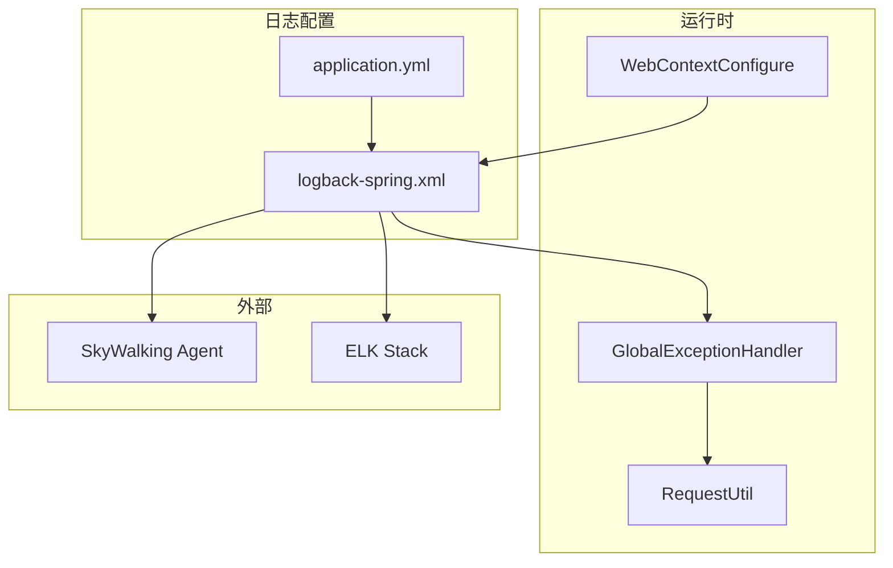
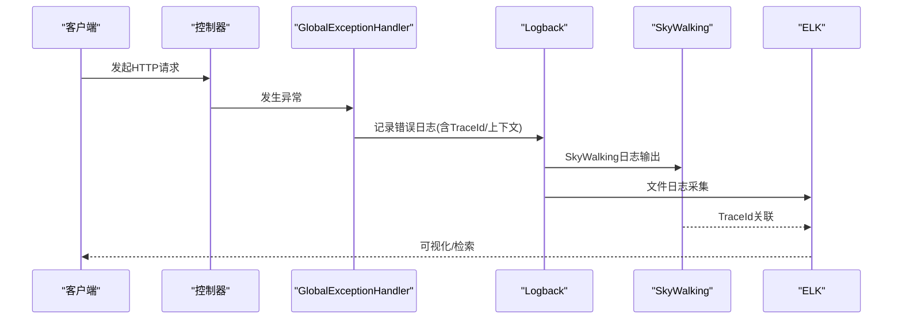
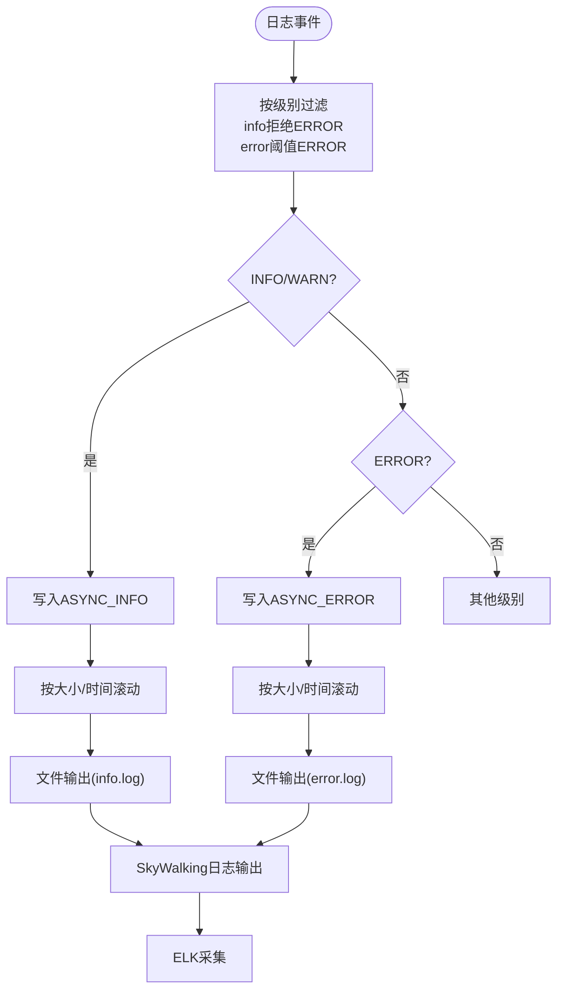
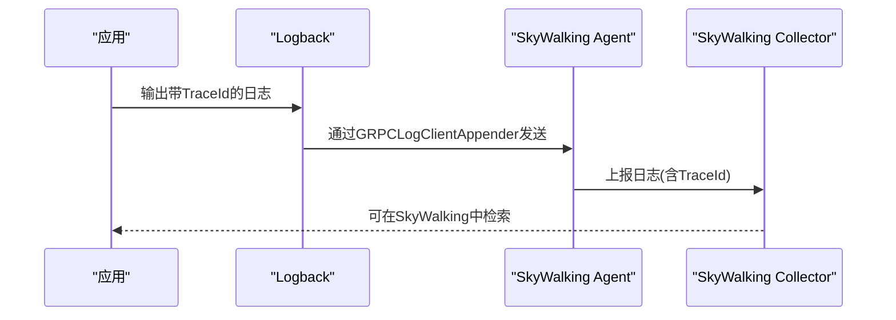
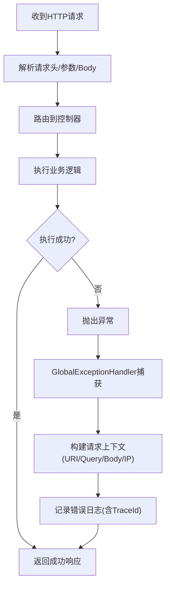
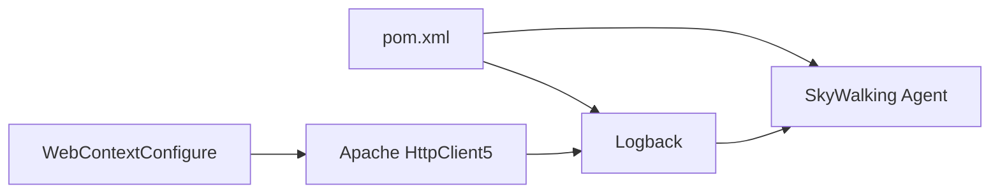

# 日志监控

<cite>
**本文引用的文件**
- [logback-spring.xml](file://src/main/resources/logback-spring.xml)
- [application.yml](file://src/main/resources/application.yml)
- [GlobalExceptionHandler.java](file://src/main/java/com/jiuyu/governance/plugins/webmvc/GlobalExceptionHandler.java)
- [RequestUtil.java](file://src/main/java/com/jiuyu/governance/common/utils/RequestUtil.java)
- [WebContextConfigure.java](file://src/main/java/com/jiuyu/governance/plugins/webmvc/WebContextConfigure.java)
- [pom.xml](file://pom.xml)
</cite>

## 目录
1. [简介](#简介)
2. [项目结构](#项目结构)
3. [核心组件](#核心组件)
4. [架构总览](#架构总览)
5. [详细组件分析](#详细组件分析)
6. [依赖分析](#依赖分析)
7. [性能考虑](#性能考虑)
8. [故障排查指南](#故障排查指南)
9. [结论](#结论)
10. [附录](#附录)

## 简介
本指南面向 fupan-governance-server 的日志监控配置，覆盖以下主题：
- Logback 日志配置：异步日志处理、日志级别过滤、日志轮转策略
- SkyWalking 链路追踪日志：TraceId 传递、分布式链路日志、调用链分析
- HTTP 请求日志监控：请求/响应日志、异常请求监控、API 调用统计
- 错误日志监控：错误分类、错误频率监控、错误趋势分析
- 日志聚合与 ELK Stack 集成：日志采集、索引与分析
- 日志分析工具使用指南

## 项目结构
围绕日志监控的关键文件与模块如下：
- 日志配置：logback-spring.xml（根配置）、application.yml（日志路径）
- 异常处理：GlobalExceptionHandler（统一异常日志）
- 请求工具：RequestUtil（IP、请求体提取）
- Web 上下文：WebContextConfigure（HTTP 客户端连接池、CORS 等）
- 依赖：pom.xml（SkyWalking Agent、日志相关依赖）

图表来源
- [logback-spring.xml:1-120](file://src/main/resources/logback-spring.xml#L1-L120)
- [application.yml:1-148](file://src/main/resources/application.yml#L1-L148)
- [GlobalExceptionHandler.java:1-377](file://src/main/java/com/jiuyu/governance/plugins/webmvc/GlobalExceptionHandler.java#L1-L377)
- [RequestUtil.java:1-177](file://src/main/java/com/jiuyu/governance/common/utils/RequestUtil.java#L1-L177)
- [WebContextConfigure.java:1-249](file://src/main/java/com/jiuyu/governance/plugins/webmvc/WebContextConfigure.java#L1-L249)
- [pom.xml:1-226](file://pom.xml#L1-L226)

章节来源
- [logback-spring.xml:1-120](file://src/main/resources/logback-spring.xml#L1-L120)
- [application.yml:1-148](file://src/main/resources/application.yml#L1-L148)

## 核心组件
- Logback 配置：定义控制台与文件输出、异步 Appender、按级别过滤、滚动策略、SkyWalking 输出
- 异常处理：统一捕获各类异常，构造上下文信息并输出带 TraceId 的日志
- 请求工具：提取客户端 IP、请求体、用户上下文，辅助异常日志定位
- Web 上下文：HTTP 客户端连接池配置，影响日志输出的外部调用链路质量
- SkyWalking Agent：通过日志插件将 TraceId 注入日志，实现链路关联

章节来源
- [logback-spring.xml:1-120](file://src/main/resources/logback-spring.xml#L1-L120)
- [GlobalExceptionHandler.java:1-377](file://src/main/java/com/jiuyu/governance/plugins/webmvc/GlobalExceptionHandler.java#L1-L377)
- [RequestUtil.java:1-177](file://src/main/java/com/jiuyu/governance/common/utils/RequestUtil.java#L1-L177)
- [WebContextConfigure.java:1-249](file://src/main/java/com/jiuyu/governance/plugins/webmvc/WebContextConfigure.java#L1-L249)
- [pom.xml:1-226](file://pom.xml#L1-L226)

## 架构总览
日志从应用产生，经 Logback 输出到文件与 SkyWalking，再由 ELK Stack 采集与分析。异常处理层负责在发生错误时输出结构化上下文信息，便于定位问题。

图表来源
- [GlobalExceptionHandler.java:58-91](file://src/main/java/com/jiuyu/governance/plugins/webmvc/GlobalExceptionHandler.java#L58-L91)
- [logback-spring.xml:76-84](file://src/main/resources/logback-spring.xml#L76-L84)

## 详细组件分析

### Logback 日志配置
- 控制台与文件输出
  - 控制台输出：本地开发环境使用控制台输出，便于实时查看
  - 文件输出：info/error 分别落盘，按大小与时间滚动压缩
- 异步日志处理
  - info 与 error 分别包装 AsyncAppender，队列容量与丢弃阈值可调
  - 异步写入提升吞吐，降低同步 IO 对主线程的影响
- 日志级别过滤
  - info Appender 使用 LevelFilter 拒绝 ERROR 级别，确保 ERROR 专走 error Appender
  - error Appender 使用 ThresholdFilter 设置 ERROR 阈值
- 日志轮转策略
  - info：按月目录、按日切分、按文件大小切分、最多历史天数
  - error：同上，独立策略，便于快速定位严重问题
- SkyWalking 日志输出
  - 通过 GRPCLogClientAppender 与 TraceIdMDCPatternLogbackLayout 输出带 TraceId 的日志
  - 适用于 SkyWalking 日志采集场景，便于链路关联

图表来源
- [logback-spring.xml:20-84](file://src/main/resources/logback-spring.xml#L20-L84)

章节来源
- [logback-spring.xml:1-120](file://src/main/resources/logback-spring.xml#L1-L120)

### SkyWalking 链路追踪日志
- TraceId 传递
  - 使用 MDC 注入 TraceId，日志模式包含 %X{traceId}
  - SkyWalking 日志输出 Appender 采用 TraceIdMDCPatternLogbackLayout
- 分布式链路日志
  - 通过 GRPCLogClientAppender 将日志上报至 SkyWalking
  - 结合服务端 TraceId，实现跨进程日志关联
- 调用链分析
  - 建议在关键业务点打印带 TraceId 的日志，便于 SkyWalking 中检索与分析

图表来源
- [logback-spring.xml:76-84](file://src/main/resources/logback-spring.xml#L76-L84)
- [pom.xml](file://pom.xml#L29)

章节来源
- [logback-spring.xml:76-84](file://src/main/resources/logback-spring.xml#L76-L84)
- [pom.xml](file://pom.xml#L29)

### HTTP 请求日志监控
- 请求/响应日志
  - 全局异常处理器在记录异常时，会拼接请求 URI、查询参数、JSON 请求体等上下文
  - 通过 RequestUtil 提供的 IP、请求体读取能力，增强日志可追溯性
- 异常请求监控
  - 针对参数缺失、参数类型不匹配、消息不可读、签名错误、SQL 异常等进行分类记录
  - 统一返回 ApiResponse，前端可据此展示错误信息
- API 调用统计
  - 建议结合 SkyWalking 的服务/端点指标与日志聚合，统计接口成功率、耗时分布、错误率

图表来源
- [GlobalExceptionHandler.java:58-91](file://src/main/java/com/jiuyu/governance/plugins/webmvc/GlobalExceptionHandler.java#L58-L91)
- [RequestUtil.java:93-129](file://src/main/java/com/jiuyu/governance/common/utils/RequestUtil.java#L93-L129)

章节来源
- [GlobalExceptionHandler.java:58-91](file://src/main/java/com/jiuyu/governance/plugins/webmvc/GlobalExceptionHandler.java#L58-L91)
- [RequestUtil.java:93-129](file://src/main/java/com/jiuyu/governance/common/utils/RequestUtil.java#L93-L129)

### 错误日志监控配置
- 错误分类
  - 业务异常、参数校验异常、SQL 异常、签名异常、文件上传异常、未授权访问等
- 错误频率监控
  - 建议在 ELK 中基于错误类型、TraceId、时间窗口统计错误频率
- 错误趋势分析
  - 通过日志聚合与可视化，观察错误数量、错误类型占比、Top N 错误

章节来源
- [GlobalExceptionHandler.java:94-374](file://src/main/java/com/jiuyu/governance/plugins/webmvc/GlobalExceptionHandler.java#L94-L374)

### 日志聚合与 ELK Stack 集成
- 日志采集
  - 使用 Filebeat 或 Logstash 采集 info/error 日志文件
  - SkyWalking Agent 已内置日志上报，可直接对接 SkyWalking
- 索引与分析
  - 在 Kibana 中创建索引模式，映射 TraceId、级别、消息、时间戳等字段
  - 建立仪表板：错误率、Top N 错误、接口耗时、TraceId 检索
- 最佳实践
  - 为 info/error 日志分别建立索引策略，控制保留周期
  - 对敏感字段（如请求体）进行脱敏处理

[本节为概念性说明，无需代码来源]

### 日志分析工具使用指南
- Kibana
  - 构建错误仪表板：按错误类型、TraceId、时间分布统计
  - 使用 Lens/Discover 进行交互式探索
- SkyWalking UI
  - 基于 TraceId 快速检索调用链
  - 查看服务/端点的错误率与响应时间
- Prometheus/Grafana（可选）
  - 若需要更细粒度的指标，可在应用中暴露日志相关指标并接入 Prometheus

[本节为概念性说明，无需代码来源]

## 依赖分析
- Logback 与 SkyWalking
  - pom.xml 中声明了 SkyWalking Agent 版本，配合 logback-spring.xml 的 SkyWalking 日志输出生效
- HTTP 客户端连接池
  - WebContextConfigure 提供 Apache HttpClient5 连接池配置，间接影响外部调用链路的稳定性与可观测性

图表来源
- [pom.xml](file://pom.xml#L29)
- [logback-spring.xml:76-84](file://src/main/resources/logback-spring.xml#L76-L84)
- [WebContextConfigure.java:172-216](file://src/main/java/com/jiuyu/governance/plugins/webmvc/WebContextConfigure.java#L172-L216)

章节来源
- [pom.xml](file://pom.xml#L29)
- [WebContextConfigure.java:172-216](file://src/main/java/com/jiuyu/governance/plugins/webmvc/WebContextConfigure.java#L172-L216)

## 性能考虑
- 异步日志
  - ASYNC_INFO/ASYNC_ERROR 的队列大小与丢弃阈值需根据吞吐量调优
  - 关闭 includeCallerData 可减少开销
- 滚动策略
  - 合理设置 maxFileSize 与 maxHistory，避免过多小文件影响 IO
- 过滤策略
  - 通过 LevelFilter/ThresholdFilter 精准分流，减少不必要的磁盘写入
- HTTP 客户端
  - 连接池参数（最大连接、每路由最大连接、空闲回收）影响外部调用稳定性，进而影响日志质量

[本节为通用指导，无需代码来源]

## 故障排查指南
- 日志不落盘
  - 检查 logging.file.path 是否正确挂载，以及目录权限
- TraceId 为空
  - 确认 SkyWalking Agent 已正确注入，且日志模式包含 %X{traceId}
- 异常未被统一处理
  - 检查 GlobalExceptionHandler 是否生效，确认异常类型分支是否覆盖
- 请求体过大导致日志膨胀
  - 控制请求体读取范围，避免在非 JSON 类型时读取请求体
- HTTP 客户端连接异常
  - 检查连接池参数与超时配置，关注连接泄漏与超时重试

章节来源
- [application.yml:5-7](file://src/main/resources/application.yml#L5-L7)
- [logback-spring.xml:76-84](file://src/main/resources/logback-spring.xml#L76-L84)
- [GlobalExceptionHandler.java:58-91](file://src/main/java/com/jiuyu/governance/plugins/webmvc/GlobalExceptionHandler.java#L58-L91)
- [WebContextConfigure.java:172-216](file://src/main/java/com/jiuyu/governance/plugins/webmvc/WebContextConfigure.java#L172-L216)

## 结论
本指南基于现有配置与代码，给出了 Logback 异步处理、级别过滤、轮转策略、SkyWalking TraceId 传递与日志采集的完整方案，并提供了 HTTP 请求日志监控、错误分类与趋势分析、ELK 集成与工具使用建议。建议在生产环境中结合实际流量与资源情况，持续优化异步队列、滚动策略与连接池参数，确保日志系统的高可用与高性能。

[本节为总结，无需代码来源]

## 附录
- 配置项参考
  - logging.file.path：日志文件根目录
  - Spring Profile：dev/yz/prod/local 对应不同的日志输出策略
- 建议新增
  - 在 SkyWalking 中开启日志采集与 TraceId 注入
  - 在 ELK 中建立错误日志仪表板与告警规则
  - 对敏感字段进行脱敏处理

[本节为补充说明，无需代码来源]