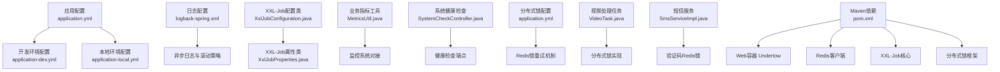
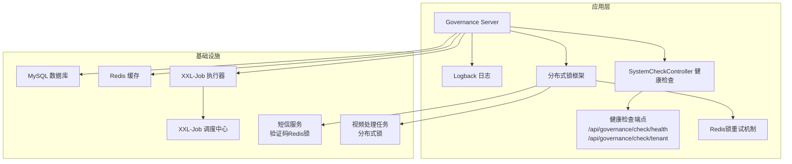
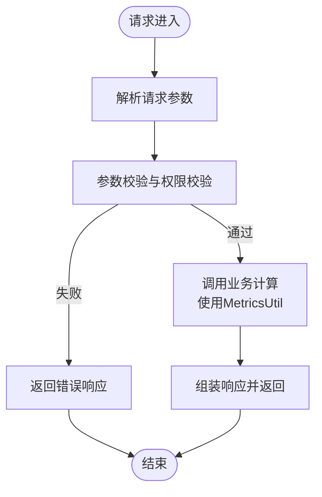
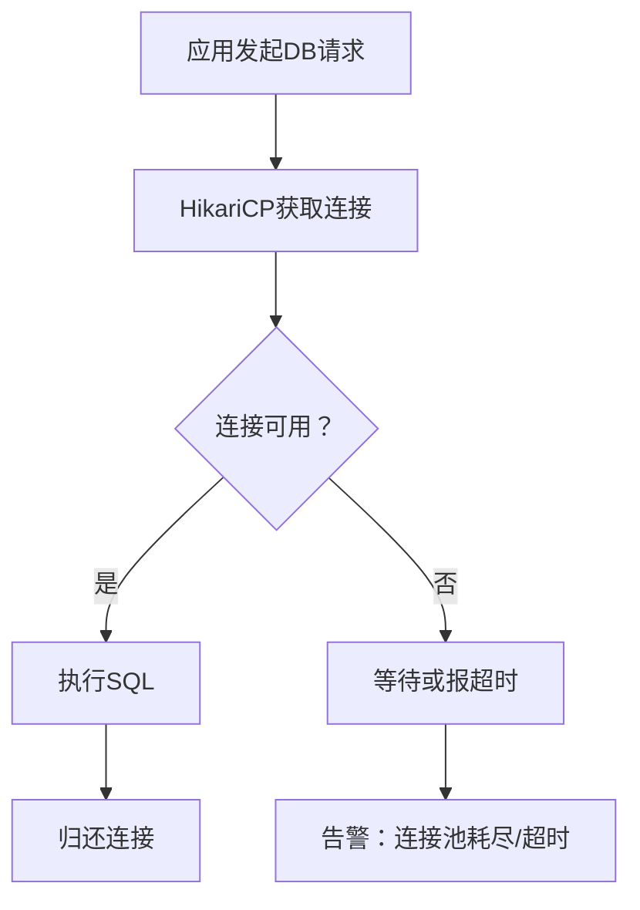
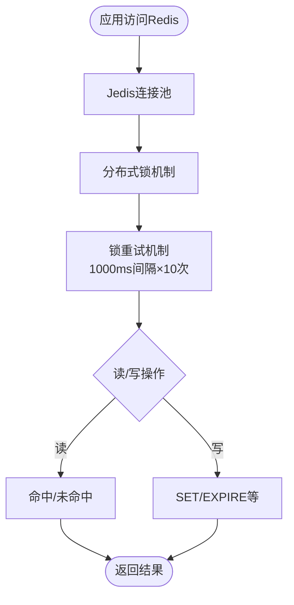
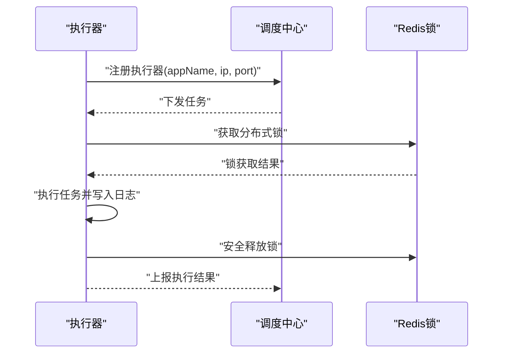
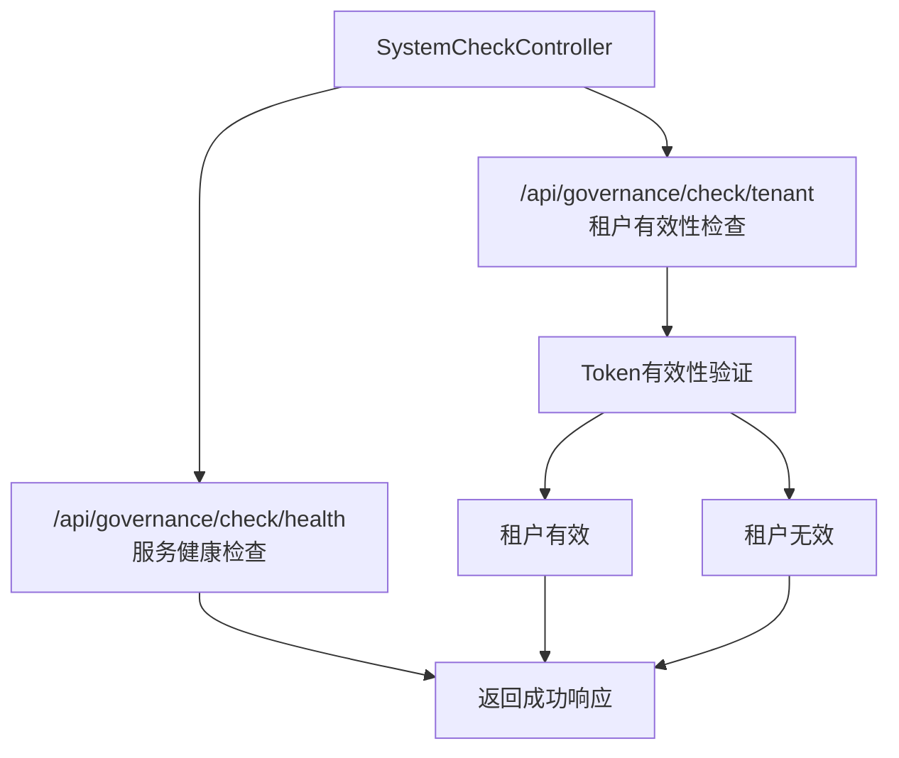
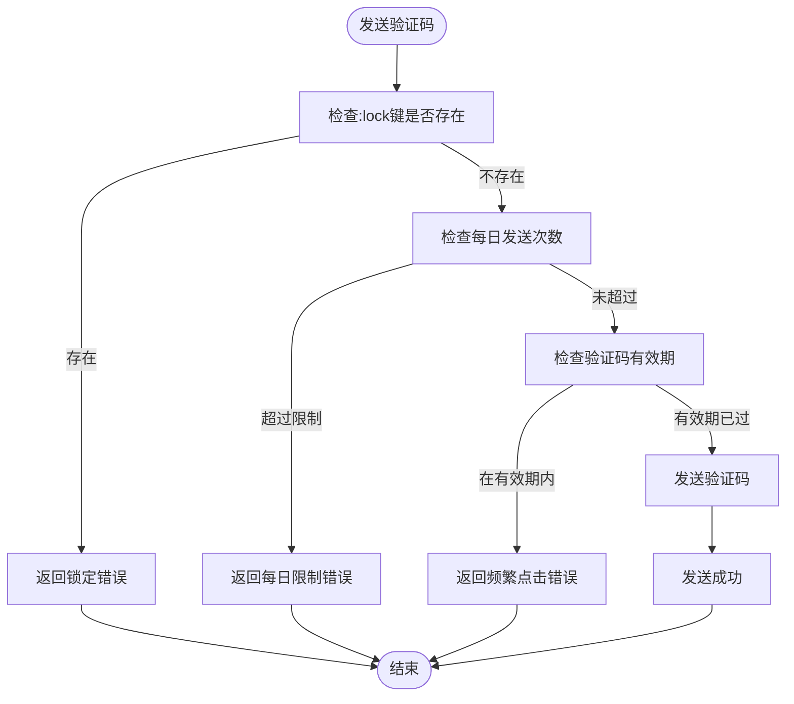
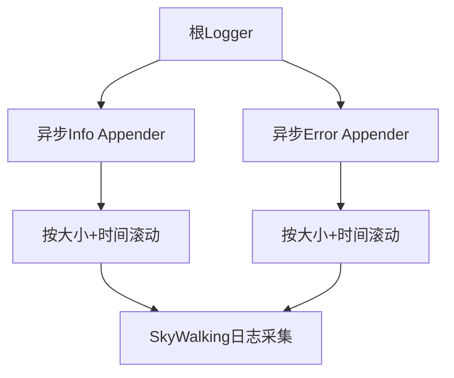
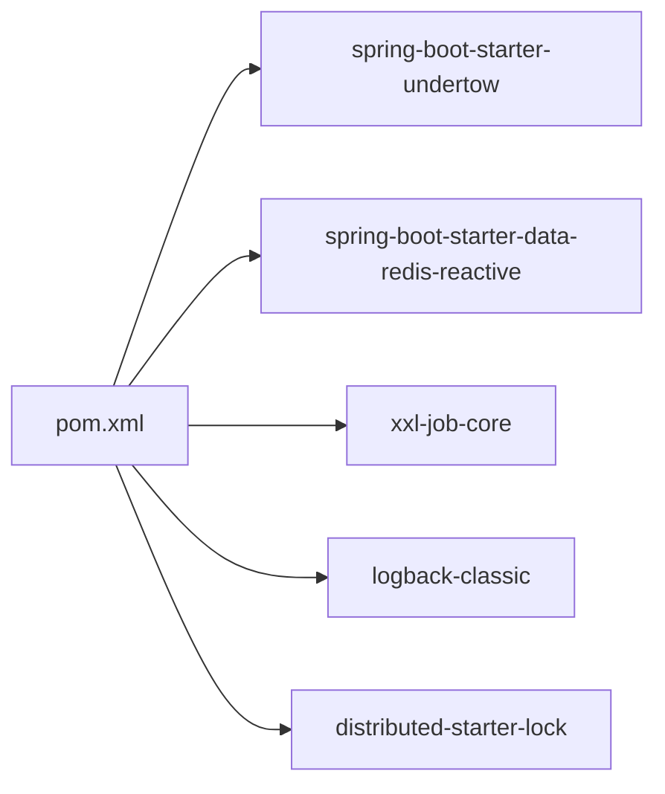

# 监控运维

<cite>
**本文引用的文件**   
- [application.yml](file://src/main/resources/application.yml)
- [application-dev.yml](file://src/main/resources/application-dev.yml)
- [application-local.yml](file://src/main/resources/application-local.yml)
- [logback-spring.xml](file://src/main/resources/logback-spring.xml)
- [XxlJobConfiguration.java](file://src/main/java/com/jiuyu/governance/plugins/xxljob/XxlJobConfiguration.java)
- [XxlJobProperties.java](file://src/main/java/com/jiuyu/governance/plugins/xxljob/XxlJobProperties.java)
- [MetricsUtil.java](file://src/main/java/com/jiuyu/governance/business/performance/utils/MetricsUtil.java)
- [SystemCheckController.java](file://src/main/java/com/jiuyu/governance/business/SystemCheckController.java)
- [SmsServiceImpl.java](file://src/main/java/com/jiuyu/governance/openfeign/replay/impl/SmsServiceImpl.java)
- [VideoTask.java](file://src/main/java/com/jiuyu/governance/business/performance/task/VideoTask.java)
- [pom.xml](file://pom.xml)
</cite>

## 更新摘要
**变更内容**   
- 新增SystemCheckController健康检查端点监控章节
- 新增分布式锁配置与Redis锁重试机制监控章节
- 更新健康检查与可用性监控章节，包含新的健康检查接口
- 新增验证码发送与验证的Redis锁监控策略
- 更新视频处理任务的分布式锁监控实现

## 目录
1. [简介](#简介)
2. [项目结构](#项目结构)
3. [核心组件](#核心组件)
4. [架构总览](#架构总览)
5. [详细组件分析](#详细组件分析)
6. [依赖分析](#依赖分析)
7. [性能考虑](#性能考虑)
8. [故障排查指南](#故障排查指南)
9. [结论](#结论)
10. [附录](#附录)

## 简介
本指南面向fupan-governance-server项目的监控与运维团队，围绕应用性能、数据库、Redis缓存与XXL-Job任务调度四个维度，提供指标配置、日志采集与轮转、告警规则、健康检查与可用性保障、性能调优、容量规划与扩容策略，以及监控仪表板与自动化脚本的落地建议。文档同时结合项目现有配置与实现，给出可操作的实施步骤与最佳实践。

**更新** 本版本新增了系统监控框架的完整监控策略，包括健康检查端点、分布式锁监控和Redis锁重试机制。

## 项目结构
项目采用Spring Boot标准目录结构，核心运行配置集中在resources下的多环境YAML文件，日志通过Logback配置；XXL-Job通过自定义配置类与属性类进行集成；业务侧提供指标计算工具类，便于在监控系统中统一口径。新增的SystemCheckController提供了系统健康检查能力，分布式锁配置支持Redis锁重试机制。

**图表来源**
- [application.yml:1-151](file://src/main/resources/application.yml#L1-L151)
- [logback-spring.xml:1-120](file://src/main/resources/logback-spring.xml#L1-L120)
- [XxlJobConfiguration.java:1-78](file://src/main/java/com/jiuyu/governance/plugins/xxljob/XxlJobConfiguration.java#L1-L78)
- [XxlJobProperties.java:1-92](file://src/main/java/com/jiuyu/governance/plugins/xxljob/XxlJobProperties.java#L1-L92)
- [MetricsUtil.java:1-267](file://src/main/java/com/jiuyu/governance/business/performance/utils/MetricsUtil.java#L1-L267)
- [SystemCheckController.java:1-56](file://src/main/java/com/jiuyu/governance/business/SystemCheckController.java#L1-L56)
- [VideoTask.java:1-236](file://src/main/java/com/jiuyu/governance/business/performance/task/VideoTask.java#L1-L236)
- [SmsServiceImpl.java:1-276](file://src/main/java/com/jiuyu/governance/openfeign/replay/impl/SmsServiceImpl.java#L1-L276)
- [pom.xml:1-226](file://pom.xml#L1-L226)

**章节来源**
- [application.yml:1-151](file://src/main/resources/application.yml#L1-L151)
- [SystemCheckController.java:1-56](file://src/main/java/com/jiuyu/governance/business/SystemCheckController.java#L1-L56)
- [VideoTask.java:1-236](file://src/main/java/com/jiuyu/governance/business/performance/task/VideoTask.java#L1-L236)
- [SmsServiceImpl.java:1-276](file://src/main/java/com/jiuyu/governance/openfeign/replay/impl/SmsServiceImpl.java#L1-L276)

## 核心组件
- 应用配置与环境隔离：通过多环境YAML实现数据库、Redis、线程池、XXL-Job等参数的差异化管理，支持dev/local/prod等环境切换。
- 日志系统：基于Logback的异步写入与按大小+时间的滚动策略，区分info/error两类日志，并支持SkyWalking日志采集适配。
- XXL-Job执行器：通过配置类与属性类注入调度中心地址、访问令牌、执行器注册信息与日志路径，实现任务调度的集中化管理。
- 指标工具：提供统一的业务指标计算方法，便于在监控平台统一口径展示与告警。
- **新增** 健康检查框架：SystemCheckController提供服务健康检查和租户有效性检测接口。
- **新增** 分布式锁机制：支持Redis分布式锁配置，包含锁重试间隔和重试次数设置。

**章节来源**
- [application.yml:1-151](file://src/main/resources/application.yml#L1-L151)
- [SystemCheckController.java:1-56](file://src/main/java/com/jiuyu/governance/business/SystemCheckController.java#L1-L56)
- [pom.xml:118-120](file://pom.xml#L118-L120)

## 架构总览
下图展示了应用、数据库、Redis与XXL-Job之间的交互关系，以及日志采集路径和新增的健康检查框架。

**图表来源**
- [application.yml:42-151](file://src/main/resources/application.yml#L42-L151)
- [SystemCheckController.java:18-56](file://src/main/java/com/jiuyu/governance/business/SystemCheckController.java#L18-L56)
- [VideoTask.java:35-123](file://src/main/java/com/jiuyu/governance/business/performance/task/VideoTask.java#L35-L123)
- [SmsServiceImpl.java:139-233](file://src/main/java/com/jiuyu/governance/openfeign/replay/impl/SmsServiceImpl.java#L139-L233)

## 详细组件分析

### 应用性能监控（APM）
- 监控目标
  - 响应时间、吞吐量、错误率、线程池队列长度与饱和状态。
  - 业务指标：ROI、退款率、支付转化率、点击率、客单价等。
- 指标来源
  - Web容器：Undertow（由Maven依赖声明）。
  - 线程池：通过spring.task.execution.pool配置（dev/local环境）。
  - 业务指标：通过MetricsUtil提供的统一计算方法，便于在监控平台统一口径。
- 建议
  - 在监控平台接入HTTP请求链路追踪与慢查询分析。
  - 将MetricsUtil中的指标作为统一口径，避免重复计算导致口径漂移。

**图表来源**
- [MetricsUtil.java:1-267](file://src/main/java/com/jiuyu/governance/business/performance/utils/MetricsUtil.java#L1-L267)
- [application-dev.yml:27-34](file://src/main/resources/application-dev.yml#L27-L34)
- [application-local.yml:27-35](file://src/main/resources/application-local.yml#L27-L35)

**章节来源**
- [pom.xml:50-60](file://pom.xml#L50-L60)
- [application-dev.yml:27-34](file://src/main/resources/application-dev.yml#L27-L34)
- [application-local.yml:27-35](file://src/main/resources/application-local.yml#L27-L35)
- [MetricsUtil.java:1-267](file://src/main/java/com/jiuyu/governance/business/performance/utils/MetricsUtil.java#L1-L267)

### 数据库性能监控
- 连接池配置
  - HikariCP连接池参数：最小空闲、最大池大小、空闲超时、最大存活时间、连接超时、验证超时、心跳间隔等。
  - P6Spy驱动用于SQL审计（dev环境）。
- 建议
  - 关注连接池指标：活跃连接数、空闲连接数、等待连接数、连接泄漏、超时次数。
  - 结合慢查询日志与P6Spy输出，定位热点SQL与锁等待。

**图表来源**
- [application.yml:44-61](file://src/main/resources/application.yml#L44-L61)
- [application-dev.yml:3-14](file://src/main/resources/application-dev.yml#L3-L14)

**章节来源**
- [application.yml:44-61](file://src/main/resources/application.yml#L44-L61)
- [application-dev.yml:3-14](file://src/main/resources/application-dev.yml#L3-L14)

### Redis缓存监控
- 连接与池化
  - 连接超时、Jedis连接池最大活跃、最大空闲、最大等待、驱逐周期等。
- **新增** 分布式锁监控
  - Redis锁前缀配置：`jiuyu:lock:`，支持分布式锁重试机制。
  - 锁重试间隔：1000ms，重试次数：10次。
- 建议
  - 关注命中率、内存使用、过期键比例、阻塞命令占比。
  - 针对分布式锁前缀与键空间进行专项监控。

**图表来源**
- [application.yml:87-109](file://src/main/resources/application.yml#L87-L109)
- [application.yml:102-108](file://src/main/resources/application.yml#L102-L108)

**章节来源**
- [application.yml:87-100](file://src/main/resources/application.yml#L87-L100)
- [application.yml:102-108](file://src/main/resources/application.yml#L102-L108)

### XXL-Job任务监控
- 配置要点
  - enable开关、admin地址与访问令牌、executor app-name、address/ip/port、日志路径与保留天数。
- **新增** 分布式锁实现
  - 视频处理任务使用Redis分布式锁，锁键：`governance:task:video:lock`。
  - 锁过期时间：10分钟，处理超时：30分钟。
  - 使用Lua脚本保证锁释放的原子性。
- 建议
  - 为每个执行器配置独立日志目录与保留策略，便于问题定位。
  - 在调度中心配置任务失败重试与告警策略。

**图表来源**
- [XxlJobConfiguration.java:1-78](file://src/main/java/com/jiuyu/governance/plugins/xxljob/XxlJobConfiguration.java#L1-L78)
- [XxlJobProperties.java:1-92](file://src/main/java/com/jiuyu/governance/plugins/xxljob/XxlJobProperties.java#L1-L92)
- [VideoTask.java:51-97](file://src/main/java/com/jiuyu/governance/business/performance/task/VideoTask.java#L51-L97)

**章节来源**
- [XxlJobConfiguration.java:1-78](file://src/main/java/com/jiuyu/governance/plugins/xxljob/XxlJobConfiguration.java#L1-L78)
- [XxlJobProperties.java:1-92](file://src/main/java/com/jiuyu/governance/plugins/xxljob/XxlJobProperties.java#L1-L92)
- [application.yml:127-151](file://src/main/resources/application.yml#L127-L151)
- [VideoTask.java:35-123](file://src/main/java/com/jiuyu/governance/business/performance/task/VideoTask.java#L35-L123)

### 系统健康检查监控
- **新增** 健康检查端点
  - `/api/governance/check/health`：服务健康检查，返回成功响应。
  - `/api/governance/check/tenant`：租户有效性检查，支持Token头部参数。
- **新增** 租户检测机制
  - 通过AuthenticationTokenProvide验证Token有效性。
  - 支持匿名访问，无需认证即可检查租户状态。
- 建议
  - 在负载均衡器和网关中配置健康检查探针。
  - 设置合理的健康检查间隔和超时时间。
  - 结合业务监控指标进行综合健康评估。

**图表来源**
- [SystemCheckController.java:34-54](file://src/main/java/com/jiuyu/governance/business/SystemCheckController.java#L34-L54)

**章节来源**
- [SystemCheckController.java:1-56](file://src/main/java/com/jiuyu/governance/business/SystemCheckController.java#L1-L56)

### 验证码发送与Redis锁监控
- **新增** 验证码发送锁机制
  - 频繁发送防护：检查`:lock`键是否存在，防止短期内频繁错误提交。
  - 每日发送次数限制：`prefix:scene:mobile:num`键，限制10次/时间段。
  - 错误次数统计：`prefix:scene:mobile:error`键，超过阈值设置锁定。
- **新增** 锁重试机制
  - 锁过期时间：`(errorNum - errorMax) × smsCodeTimeoutMillisecond`毫秒。
  - 锁键格式：`prefix:scene:mobile:lock`。
- 建议
  - 监控验证码发送成功率和失败率。
  - 关注`:lock`键的分布情况，避免热点手机号被锁定。
  - 设置合理的错误阈值和锁定时间。

**图表来源**
- [SmsServiceImpl.java:139-195](file://src/main/java/com/jiuyu/governance/openfeign/replay/impl/SmsServiceImpl.java#L139-L195)
- [SmsServiceImpl.java:209-233](file://src/main/java/com/jiuyu/governance/openfeign/replay/impl/SmsServiceImpl.java#L209-L233)

**章节来源**
- [SmsServiceImpl.java:139-233](file://src/main/java/com/jiuyu/governance/openfeign/replay/impl/SmsServiceImpl.java#L139-L233)
- [application.yml:102-108](file://src/main/resources/application.yml#L102-L108)

### 日志收集与轮转
- 日志配置
  - 控制台与文件输出分离，info/error分别落盘并按大小+时间滚动压缩。
  - 异步Appender队列大小与丢弃阈值，提升高并发下的可靠性。
  - SkyWalking日志采集适配，支持TraceId透传。
- 建议
  - 生产环境开启异步写入，合理设置队列长度与历史保留天数。
  - 将日志路径映射至持久化卷，避免容器重启导致日志丢失。

**图表来源**
- [logback-spring.xml:1-120](file://src/main/resources/logback-spring.xml#L1-120)

**章节来源**
- [logback-spring.xml:1-120](file://src/main/resources/logback-spring.xml#L1-L120)

### 健康检查与可用性监控
- **更新** 健康检查框架
  - SystemCheckController提供标准化的健康检查接口。
  - 支持服务健康检查和租户有效性检查。
  - 通过匿名访问简化集成。
- 可用性保障
  - 优雅停机：配置生命周期宽限期，确保流量迁移与任务收尾。
  - 任务执行器优雅退出：XXL-Job执行器支持平滑停止。
  - **新增** 分布式锁安全释放：使用Lua脚本保证锁释放的原子性。
- 建议
  - 在调度中心与监控平台设置健康检查告警。
  - 对关键任务配置失败重试与熔断保护。
  - 监控分布式锁的获取成功率和释放情况。

**章节来源**
- [SystemCheckController.java:1-56](file://src/main/java/com/jiuyu/governance/business/SystemCheckController.java#L1-L56)
- [VideoTask.java:105-123](file://src/main/java/com/jiuyu/governance/business/performance/task/VideoTask.java#L105-L123)
- [application.yml:37-39](file://src/main/resources/application.yml#L37-L39)
- [XxlJobConfiguration.java:1-78](file://src/main/java/com/jiuyu/governance/plugins/xxljob/XxlJobConfiguration.java#L1-L78)

### 告警配置
- 阈值建议
  - 应用：HTTP 5xx错误率>1%、P95/P99延迟>阈值、线程池队列积压>阈值。
  - 数据库：连接池等待数>阈值、慢查询次数>阈值、锁等待>阈值。
  - Redis：命中率<阈值、内存使用率>阈值、阻塞命令占比>阈值、分布式锁获取失败率>阈值。
  - XXL-Job：任务失败率>阈值、执行超时>阈值、日志异常>阈值。
  - **新增** 健康检查：健康检查接口响应时间>阈值、租户检查失败率>阈值。
- 规则与渠道
  - 使用Prometheus Alertmanager或平台自带告警通道（邮件/IM/电话）。
  - 建议分级别：P0（业务中断）、P1（严重）、P2（一般）。
- 通知策略
  - 首次告警立即通知，后续钉钉/企业微信机器人轮询通知，收敛期内不再重复。

**章节来源**
- [application.yml:44-61](file://src/main/resources/application.yml#L44-L61)
- [application.yml:87-100](file://src/main/resources/application.yml#L87-L100)
- [application.yml:127-151](file://src/main/resources/application.yml#L127-L151)
- [SystemCheckController.java:34-54](file://src/main/java/com/jiuyu/governance/business/SystemCheckController.java#L34-L54)

### 性能调优与容量规划
- JVM与容器
  - 根据线程池与业务峰值调整堆大小与GC策略，避免Full GC。
  - 容器资源限制：CPU/内存配额与HPA策略。
- 数据库
  - 连接池大小与等待时间：根据QPS与RT调优，避免过度连接或超时。
  - SQL优化：索引、分页、批量写入、读写分离。
- 缓存
  - 命中率优化：预热、淘汰策略、热点数据分片。
  - **新增** 分布式锁性能优化：合理设置锁过期时间和重试间隔。
- 任务调度
  - 任务粒度拆分与并发度控制，避免单点过载。
  - **新增** 分布式锁竞争优化：避免热点资源的集中访问。
- 容量规划
  - 基于历史峰值与增长趋势，预留30%-50%缓冲。
  - 读写分离与分库分表策略，结合监控指标动态扩容。

**章节来源**
- [application-dev.yml:8-14](file://src/main/resources/application-dev.yml#L8-L14)
- [application-local.yml:8-14](file://src/main/resources/application-local.yml#L8-L14)
- [application-dev.yml:27-34](file://src/main/resources/application-dev.yml#L27-L34)
- [application-local.yml:27-35](file://src/main/resources/application-local.yml#L27-L35)
- [VideoTask.java:36-39](file://src/main/java/com/jiuyu/governance/business/performance/task/VideoTask.java#L36-L39)
- [SmsServiceImpl.java:41-65](file://src/main/java/com/jiuyu/governance/openfeign/replay/impl/SmsServiceImpl.java#L41-L65)

### 运维仪表板与自动化
- 仪表板建议
  - 应用：请求量、错误率、响应时间、线程池、GC。
  - 数据库：连接池、慢查询、锁等待、事务回滚。
  - 缓存：命中率、内存、过期键、阻塞命令、分布式锁状态。
  - 任务：任务成功率、执行时延、失败重试、分布式锁获取成功率。
  - **新增** 健康检查：健康检查接口响应时间、租户检查成功率。
- 自动化
  - CI/CD流水线：构建、镜像推送、滚动发布、回滚。
  - 健康检查：探针与自动扩缩容。
  - 日志采集：Filebeat/Fluent Bit收集，集中到ELK/LS或SaaS平台。
  - 告警：统一接入平台，分级处置。
  - **新增** 分布式锁监控：锁获取成功率、锁释放成功率、锁超时统计。

**章节来源**
- [logback-spring.xml:1-120](file://src/main/resources/logback-spring.xml#L1-L120)
- [application.yml:127-151](file://src/main/resources/application.yml#L127-L151)
- [SystemCheckController.java:1-56](file://src/main/java/com/jiuyu/governance/business/SystemCheckController.java#L1-L56)

## 依赖分析
- Web容器：Undertow替代Tomcat，具备更好的异步与高并发特性。
- Redis：响应式客户端，适合高并发读写场景。
- XXL-Job：分布式任务调度核心依赖。
- 日志：Logback异步+滚动，配合SkyWalking日志采集。
- **新增** 分布式锁框架：`distributed-starter-lock`提供Redis分布式锁能力。

**图表来源**
- [pom.xml:50-60](file://pom.xml#L50-L60)
- [pom.xml:86-87](file://pom.xml#L86-L87)
- [pom.xml:144-149](file://pom.xml#L144-L149)
- [pom.xml:118-120](file://pom.xml#L118-L120)

**章节来源**
- [pom.xml:1-226](file://pom.xml#L1-L226)

## 性能考虑
- I/O密集与CPU密集任务分离，避免线程池互相影响。
- 数据库与缓存双写一致性策略，结合监控指标回溯问题。
- 任务批量化与幂等设计，降低抖动与重复执行风险。
- 日志异步化与滚动策略，避免I/O成为瓶颈。
- **新增** 分布式锁性能优化：合理设置锁过期时间，避免锁持有时间过长。
- **新增** 验证码发送限流：通过Redis键空间实现精细化的限流控制。

## 故障排查指南
- 日志定位
  - 查看info/error异步Appender输出，结合TraceId在SkyWalking中检索。
- 数据库问题
  - 关注连接池等待与超时、慢查询、锁等待；必要时启用P6Spy审计。
- 缓存问题
  - 关注命中率与内存使用，排查过期键与阻塞命令。
  - **新增** 监控分布式锁键空间，检查`:lock`、`:num`、`:error`键的状态。
- 任务问题
  - 检查执行器日志路径与保留策略，核对调度中心任务状态与失败重试。
  - **新增** 监控视频处理任务的锁获取和释放情况。
- **新增** 健康检查问题
  - 检查SystemCheckController接口的响应时间和错误率。
  - 验证租户Token的有效性和认证提供者的可用性。

**章节来源**
- [logback-spring.xml:1-120](file://src/main/resources/logback-spring.xml#L1-L120)
- [application.yml:44-61](file://src/main/resources/application.yml#L44-L61)
- [application.yml:87-100](file://src/main/resources/application.yml#L87-L100)
- [application.yml:127-151](file://src/main/resources/application.yml#L127-L151)
- [SystemCheckController.java:1-56](file://src/main/java/com/jiuyu/governance/business/SystemCheckController.java#L1-L56)
- [VideoTask.java:59-97](file://src/main/java/com/jiuyu/governance/business/performance/task/VideoTask.java#L59-L97)

## 结论
通过完善的配置与监控体系，fupan-governance-server可在高并发场景下保持稳定与可观测。新增的SystemCheckController健康检查框架、分布式锁配置和Redis锁重试机制进一步增强了系统的可用性和可靠性。建议以"指标统一口径、日志异步可靠、任务可观察、健康自动治理、分布式锁安全"为核心，持续迭代监控与告警策略，配合自动化手段实现高效运维。

## 附录
- 关键配置清单
  - 数据库连接池：最小空闲、最大池大小、空闲超时、最大存活时间、连接超时、验证超时、心跳间隔。
  - Redis连接池：最大活跃、最大空闲、最大等待、驱逐周期、连接超时。
  - XXL-Job：enable、admin地址与令牌、executor app-name、address/ip/port、日志路径与保留天数。
  - 日志：info/error异步Appender、滚动策略、SkyWalking日志采集。
  - **新增** 分布式锁：锁类型（redis）、重试间隔（1000ms）、重试次数（10次）、锁前缀（jiuyu:lock:）。
  - **新增** 健康检查：SystemCheckController接口路径、租户Token头部参数。
- 业务指标口径
  - ROI、退款率、支付转化率、点击率、客单价等统一使用MetricsUtil计算，确保跨模块一致。
  - **新增** 验证码发送指标：发送成功率、失败率、锁定率、重试次数。
  - **新增** 分布式锁指标：锁获取成功率、锁释放成功率、锁超时率、锁冲突率。

**章节来源**
- [application.yml:44-61](file://src/main/resources/application.yml#L44-L61)
- [application.yml:87-100](file://src/main/resources/application.yml#L87-L100)
- [application.yml:127-151](file://src/main/resources/application.yml#L127-L151)
- [application.yml:102-108](file://src/main/resources/application.yml#L102-L108)
- [logback-spring.xml:1-120](file://src/main/resources/logback-spring.xml#L1-L120)
- [MetricsUtil.java:1-267](file://src/main/java/com/jiuyu/governance/business/performance/utils/MetricsUtil.java#L1-L267)
- [SystemCheckController.java:18-54](file://src/main/java/com/jiuyu/governance/business/SystemCheckController.java#L18-L54)
- [SmsServiceImpl.java:41-65](file://src/main/java/com/jiuyu/governance/openfeign/replay/impl/SmsServiceImpl.java#L41-L65)