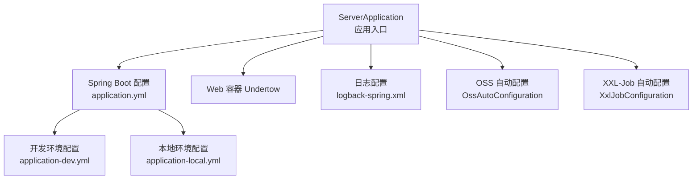
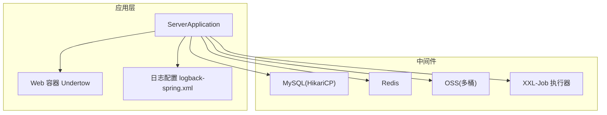
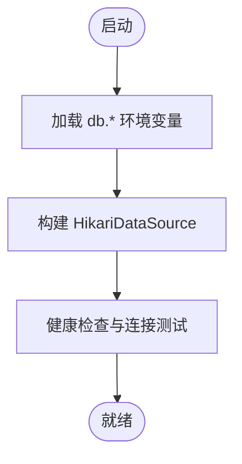
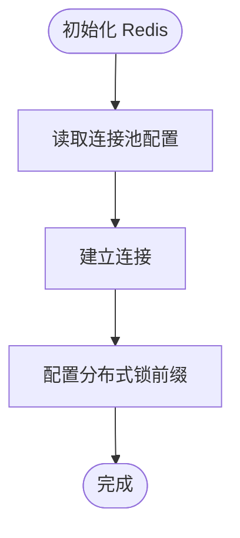
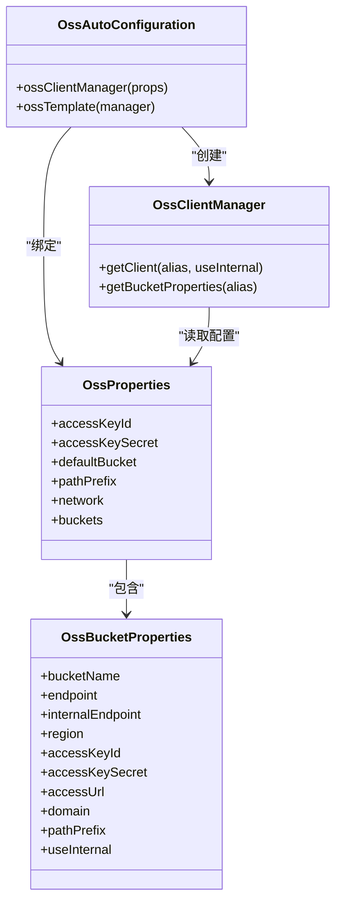
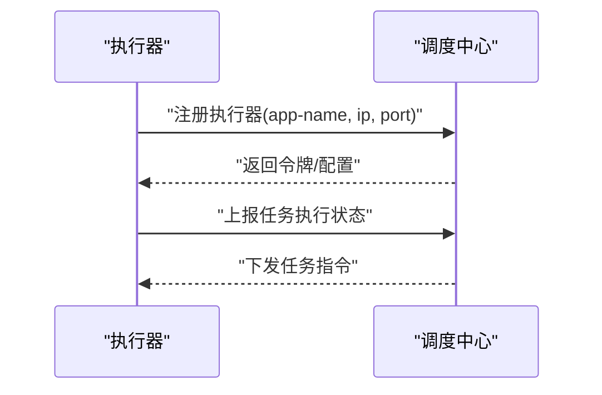
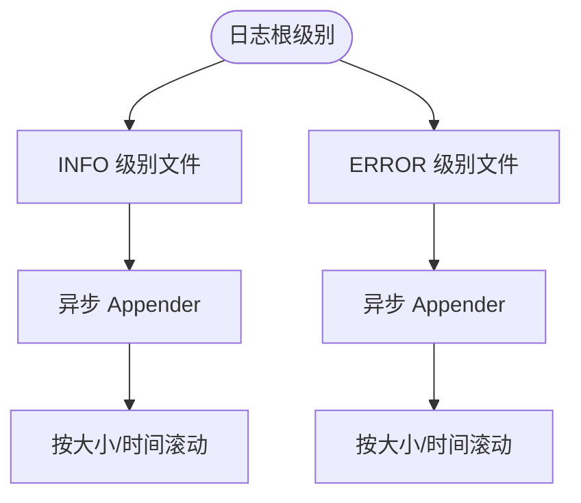
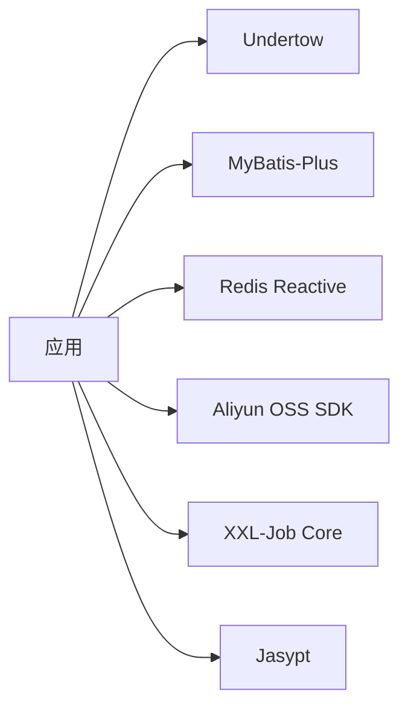

# 部署运维

<cite>
**本文引用的文件**   
- [application.yml](file://src/main/resources/application.yml)
- [application-dev.yml](file://src/main/resources/application-dev.yml)
- [application-local.yml](file://src/main/resources/application-local.yml)
- [logback-spring.xml](file://src/main/resources/logback-spring.xml)
- [pom.xml](file://pom.xml)
- [ServerApplication.java](file://src/main/java/com/jiuyu/governance/ServerApplication.java)
- [OssAutoConfiguration.java](file://src/main/java/com/jiuyu/governance/plugins/oss/config/OssAutoConfiguration.java)
- [OssProperties.java](file://src/main/java/com/jiuyu/governance/plugins/oss/config/OssProperties.java)
- [OssBucketProperties.java](file://src/main/java/com/jiuyu/governance/plugins/oss/config/OssBucketProperties.java)
- [OssClientManager.java](file://src/main/java/com/jiuyu/governance/plugins/oss/core/OssClientManager.java)
- [XxlJobConfiguration.java](file://src/main/java/com/jiuyu/governance/plugins/xxljob/XxlJobConfiguration.java)
- [XxlJobProperties.java](file://src/main/java/com/jiuyu/governance/plugins/xxljob/XxlJobProperties.java)
- [PasswordHandler.java](file://src/main/java/com/jiuyu/governance/common/utils/PasswordHandler.java)
</cite>

## 目录
1. [简介](#简介)
2. [项目结构](#项目结构)
3. [核心组件](#核心组件)
4. [架构总览](#架构总览)
5. [详细组件分析](#详细组件分析)
6. [依赖分析](#依赖分析)
7. [性能考虑](#性能考虑)
8. [故障排查指南](#故障排查指南)
9. [结论](#结论)
10. [附录](#附录)

## 简介
本指南面向运维工程师，提供 fupan-governance-server 在生产环境的完整部署与运维手册。内容涵盖数据库连接、Redis、OSS 存储、XXL-Job 任务调度等关键组件的配置方法；给出 Docker 容器化与 Kubernetes 集群部署策略；解释多环境配置管理、密钥管理与配置热更新机制；说明监控指标、日志收集与告警配置；提供性能调优、容量规划与故障排查建议；并包含备份恢复策略、安全加固与合规性要求，以及应急处理预案。

## 项目结构
- 应用入口位于 Spring Boot 启动类，负责加载配置与启动 Web 容器。
- 配置采用 Spring Profile 分环境管理，核心配置集中在 application.yml 及其环境特化文件 application-{env}.yml 中。
- 日志通过 logback-spring.xml 配置，支持按级别滚动与 SkyWalking 日志采集。
- 关键第三方能力通过 starter 与自动配置注入，如 OSS、XXL-Job、分布式锁、签名校验、缓存等。

**图示来源**
- [ServerApplication.java:12-18](file://src/main/java/com/jiuyu/governance/ServerApplication.java#L12-L18)
- [application.yml:1-148](file://src/main/resources/application.yml#L1-L148)
- [application-dev.yml:1-109](file://src/main/resources/application-dev.yml#L1-L109)
- [application-local.yml:1-101](file://src/main/resources/application-local.yml#L1-L101)
- [logback-spring.xml:1-120](file://src/main/resources/logback-spring.xml#L1-L120)
- [OssAutoConfiguration.java:20-39](file://src/main/java/com/jiuyu/governance/plugins/oss/config/OssAutoConfiguration.java#L20-L39)
- [XxlJobConfiguration.java:18-76](file://src/main/java/com/jiuyu/governance/plugins/xxljob/XxlJobConfiguration.java#L18-L76)

**章节来源**
- [ServerApplication.java:12-18](file://src/main/java/com/jiuyu/governance/ServerApplication.java#L12-L18)
- [application.yml:1-148](file://src/main/resources/application.yml#L1-L148)
- [logback-spring.xml:1-120](file://src/main/resources/logback-spring.xml#L1-L120)

## 核心组件
- 数据库连接：基于 HikariCP 连接池，支持最小/最大连接数、空闲超时、最大存活时间、心跳检测等参数，可通过环境变量注入。
- Redis：配置主机、密码、端口、数据库索引、连接超时与连接池参数，支持分布式锁与签名校验等特性。
- OSS 存储：通过自动配置启用，支持多桶、内网/外网 Endpoint、桶级覆盖、预签名链接网络策略等。
- XXL-Job：作为执行器接入调度中心，支持地址、令牌、日志路径与保留天数等配置。
- 日志：按级别滚动输出至文件，支持异步 Appender 提升吞吐，集成 SkyWalking 日志采集。
- 安全与密钥：Jasypt 加密配置，支持从环境变量读取密钥；密码处理工具提供 MD5 编码能力。

**章节来源**
- [application.yml:42-148](file://src/main/resources/application.yml#L42-L148)
- [application-dev.yml:1-109](file://src/main/resources/application-dev.yml#L1-L109)
- [application-local.yml:1-101](file://src/main/resources/application-local.yml#L1-L101)
- [OssAutoConfiguration.java:20-39](file://src/main/java/com/jiuyu/governance/plugins/oss/config/OssAutoConfiguration.java#L20-L39)
- [OssProperties.java:35-139](file://src/main/java/com/jiuyu/governance/plugins/oss/config/OssProperties.java#L35-L139)
- [OssClientManager.java:22-153](file://src/main/java/com/jiuyu/governance/plugins/oss/core/OssClientManager.java#L22-L153)
- [XxlJobConfiguration.java:18-76](file://src/main/java/com/jiuyu/governance/plugins/xxljob/XxlJobConfiguration.java#L18-L76)
- [XxlJobProperties.java:13-91](file://src/main/java/com/jiuyu/governance/plugins/xxljob/XxlJobProperties.java#L13-L91)
- [logback-spring.xml:1-120](file://src/main/resources/logback-spring.xml#L1-L120)
- [PasswordHandler.java:14-131](file://src/main/java/com/jiuyu/governance/common/utils/PasswordHandler.java#L14-L131)

## 架构总览
系统采用 Spring Boot 自动装配与 Starter 机制，关键外部组件通过配置驱动注入，形成“配置即能力”的部署模式。生产环境推荐使用 Kubernetes 集群编排，结合 ConfigMap/Secret 管理配置与密钥，通过 Ingress 暴露服务，使用 Sidecar 或 DaemonSet 部署日志与探针采集。

**图示来源**
- [ServerApplication.java:12-18](file://src/main/java/com/jiuyu/governance/ServerApplication.java#L12-L18)
- [application.yml:42-148](file://src/main/resources/application.yml#L42-L148)
- [logback-spring.xml:1-120](file://src/main/resources/logback-spring.xml#L1-L120)

## 详细组件分析

### 数据库连接（HikariCP）
- 连接池参数通过环境变量注入，便于在不同环境调整资源占用与并发能力。
- 关键参数包括最小空闲、最大池大小、连接超时、验证超时、心跳周期、最大存活时间等。
- 建议在生产环境根据 QPS 与事务复杂度设置合理的池大小与超时阈值。

**图示来源**
- [application.yml:44-61](file://src/main/resources/application.yml#L44-L61)

**章节来源**
- [application.yml:44-61](file://src/main/resources/application.yml#L44-L61)

### Redis 连接与分布式锁
- 支持主机、密码、端口、数据库索引、连接超时与连接池参数配置。
- 分布式锁类型选择为 redis，锁前缀可配置，便于多实例隔离。
- 建议开启连接池空闲回收与合理的时间窗口，避免连接泄漏。

**图示来源**
- [application.yml:87-99](file://src/main/resources/application.yml#L87-L99)

**章节来源**
- [application.yml:87-105](file://src/main/resources/application.yml#L87-L105)

### OSS 存储（自动配置与客户端管理）
- 自动配置基于 jiuyu.oss.access-key-id 启用，提供 OssClientManager 与 OssTemplate。
- 支持多桶配置、桶级覆盖（AK/SK、Endpoint、路径前缀、是否使用内网），以及按用途选择内网/外网。
- 预签名链接默认使用外网 Endpoint，服务端操作默认使用内网 Endpoint，可按需调整。

**图示来源**
- [OssAutoConfiguration.java:20-39](file://src/main/java/com/jiuyu/governance/plugins/oss/config/OssAutoConfiguration.java#L20-L39)
- [OssProperties.java:35-139](file://src/main/java/com/jiuyu/governance/plugins/oss/config/OssProperties.java#L35-L139)
- [OssBucketProperties.java:10-76](file://src/main/java/com/jiuyu/governance/plugins/oss/config/OssBucketProperties.java#L10-L76)
- [OssClientManager.java:22-153](file://src/main/java/com/jiuyu/governance/plugins/oss/core/OssClientManager.java#L22-L153)

**章节来源**
- [OssAutoConfiguration.java:20-39](file://src/main/java/com/jiuyu/governance/plugins/oss/config/OssAutoConfiguration.java#L20-L39)
- [OssProperties.java:35-139](file://src/main/java/com/jiuyu/governance/plugins/oss/config/OssProperties.java#L35-L139)
- [OssBucketProperties.java:10-76](file://src/main/java/com/jiuyu/governance/plugins/oss/config/OssBucketProperties.java#L10-L76)
- [OssClientManager.java:22-153](file://src/main/java/com/jiuyu/governance/plugins/oss/core/OssClientManager.java#L22-L153)

### XXL-Job 任务调度
- 通过 enable 控制开关，admin.addresses 与 access-token 指向调度中心，executor.port、app-name、log-path、log-retention-days 等控制执行器行为。
- 建议在生产环境固定 app-name 与日志路径，确保任务日志可追踪与轮转。

**图示来源**
- [XxlJobConfiguration.java:30-76](file://src/main/java/com/jiuyu/governance/plugins/xxljob/XxlJobConfiguration.java#L30-L76)
- [XxlJobProperties.java:13-91](file://src/main/java/com/jiuyu/governance/plugins/xxljob/XxlJobProperties.java#L13-L91)
- [application.yml:124-148](file://src/main/resources/application.yml#L124-L148)

**章节来源**
- [XxlJobConfiguration.java:18-76](file://src/main/java/com/jiuyu/governance/plugins/xxljob/XxlJobConfiguration.java#L18-L76)
- [XxlJobProperties.java:13-91](file://src/main/java/com/jiuyu/governance/plugins/xxljob/XxlJobProperties.java#L13-L91)
- [application.yml:124-148](file://src/main/resources/application.yml#L124-L148)

### 日志与监控
- logback-spring.xml 支持按级别滚动与异步 Appender，生产环境建议开启异步以降低 IO 压力。
- SkyWalking 日志采集器已配置，便于链路追踪与日志关联。

**图示来源**
- [logback-spring.xml:20-73](file://src/main/resources/logback-spring.xml#L20-L73)

**章节来源**
- [logback-spring.xml:1-120](file://src/main/resources/logback-spring.xml#L1-L120)

## 依赖分析
- Maven 依赖包含 Undertow Web 容器、MyBatis-Plus、Redis Reactive、阿里云 OSS SDK、XXL-Job、Jasypt 加密等。
- 通过 Spring Boot 自动装配与 Starter，减少手动配置成本。

**图示来源**
- [pom.xml:35-167](file://pom.xml#L35-L167)

**章节来源**
- [pom.xml:1-226](file://pom.xml#L1-L226)

## 性能考虑
- 数据库连接池：根据峰值 QPS 与慢查询比例调整最小/最大池大小、空闲超时与最大存活时间，避免连接抖动。
- Redis：合理设置连接池上限与阻塞等待时间，避免高并发下的排队放大效应。
- OSS：服务端操作使用内网 Endpoint 降低延迟与成本；预签名链接使用外网 Endpoint 保证可达性。
- Web 容器：Undertow 默认异步非阻塞模型，适合高并发场景；注意线程池与背压策略。
- 日志：生产环境开启异步 Appender，控制滚动文件大小与历史保留天数，避免磁盘压力。

[本节为通用指导，无需列出具体文件来源]

## 故障排查指南
- 数据库连接失败：检查 db.host、db.username、db.password、db.driver-class-name 与 db.url-prefix 是否正确；确认网络连通与防火墙策略。
- Redis 连接失败：核对 redis.ip、redis.password、redis.port、redis.database 与连接超时；检查连接池上限与空闲回收。
- OSS 无法访问：确认 jiuyu.oss.access-key-id 与各桶 endpoint/internal-endpoint 配置；区分服务端操作与预签名链接的网络策略。
- XXL-Job 注册失败：核对 xxl.job.admin.addresses 与 access-token；检查执行器端口与日志路径权限。
- 日志异常：检查 logging.file.path 权限与磁盘空间；确认异步队列大小与丢弃阈值设置。
- 密钥解密失败：确认 JASYPT_PASSWORD 环境变量；验证 Jasypt 版本与算法一致性。

**章节来源**
- [application.yml:44-61](file://src/main/resources/application.yml#L44-L61)
- [application.yml:87-99](file://src/main/resources/application.yml#L87-L99)
- [application.yml:124-148](file://src/main/resources/application.yml#L124-L148)
- [logback-spring.xml:20-73](file://src/main/resources/logback-spring.xml#L20-L73)
- [PasswordHandler.java:14-131](file://src/main/java/com/jiuyu/governance/common/utils/PasswordHandler.java#L14-L131)

## 结论
本指南提供了 fupan-governance-server 生产部署与运维的系统性方案。通过环境化配置与自动装配，系统具备良好的可移植性与可维护性。建议在生产环境中完善密钥管理、日志与监控体系、容量规划与应急预案，确保系统稳定、可观测与可恢复。

[本节为总结性内容，无需列出具体文件来源]

## 附录

### A. 生产环境部署配置清单
- 数据库
  - 连接池参数：最小空闲、最大池大小、连接超时、验证超时、心跳周期、最大存活时间
  - 驱动与 URL：确保时区与字符集正确
- Redis
  - 主机、密码、端口、数据库索引、连接超时、连接池上限与等待时间
- OSS
  - 全局 AK/SK、默认桶、路径前缀、网络策略（服务端/预签名）
  - 多桶配置：桶名、Endpoint、Region、访问 URL/自定义域名、桶级覆盖
- XXL-Job
  - enable、admin.addresses、admin.access-token、executor.app-name、executor.port、executor.log-path、executor.log-retention-days
- 日志
  - logging.file.path、异步 Appender、滚动策略、SkyWalking 日志采集

**章节来源**
- [application.yml:44-61](file://src/main/resources/application.yml#L44-L61)
- [application.yml:87-99](file://src/main/resources/application.yml#L87-L99)
- [application.yml:124-148](file://src/main/resources/application.yml#L124-L148)
- [logback-spring.xml:20-73](file://src/main/resources/logback-spring.xml#L20-L73)

### B. Docker 容器化部署要点
- 基础镜像：使用官方 OpenJDK 17 运行时镜像
- 应用打包：使用 Maven 插件生成可执行包
- 环境变量：通过 -e 注入 db.*、redis.*、jiuyu.oss.*、xxl.job.*、JASYPT_PASSWORD 等
- 挂载卷：挂载日志目录与 XXL-Job 日志目录，确保持久化
- 健康检查：暴露 HTTP 健康端点，结合容器编排进行探针检查

[本节为通用实践建议，无需列出具体文件来源]

### C. Kubernetes 集群部署策略
- ConfigMap：存放非敏感配置（如 server.port、multipart、task.execution 等）
- Secret：存放敏感配置（如数据库凭据、Redis 密码、JASYPT_PASSWORD、OSS AK/SK、XXL-Job access-token）
- Deployment：定义副本数、资源限制与滚动升级策略
- Service/Ingress：暴露服务，配置 TLS 与限流
- PodMonitor/ServiceMonitor：对接 Prometheus 抓取指标
- Sidecar/DaemonSet：部署日志与探针采集组件

[本节为通用实践建议，无需列出具体文件来源]

### D. 多环境配置管理与密钥管理
- 多环境：通过 spring.profiles.active 切换 dev/local/prod；各环境 yml 文件覆盖默认配置
- 密钥管理：Jasypt 加密配置，从环境变量读取密钥；数据库凭据与 OSS 凭据放入 Secret
- 配置热更新：建议使用 Spring Cloud Config 或 K8s ConfigMap/Secret 的热更新机制，避免滚动重启

**章节来源**
- [application.yml:13-15](file://src/main/resources/application.yml#L13-L15)
- [application-local.yml:22-25](file://src/main/resources/application-local.yml#L22-L25)

### E. 监控指标、日志与告警
- 指标：Prometheus 暴露 HTTP/DB/Redis/OSS/XXL-Job 关键指标
- 日志：按级别滚动、异步写入、SkyWalking 日志采集
- 告警：基于阈值与趋势的告警策略，覆盖 CPU/内存/磁盘/连接池/任务失败率等

**章节来源**
- [logback-spring.xml:76-84](file://src/main/resources/logback-spring.xml#L76-L84)

### F. 性能调优与容量规划
- 数据库：根据 QPS 与慢查询比例优化连接池参数与 SQL
- Redis：根据热点键与访问模式优化连接池与淘汰策略
- Web：调整 Undertow 线程池与背压，结合限流与熔断
- 存储：OSS 读写分离与 CDN 加速，合理设置预签名链接与内网 Endpoint

[本节为通用指导，无需列出具体文件来源]

### G. 备份恢复策略
- 数据库：定期全量备份与增量备份，验证恢复流程
- 配置：备份 ConfigMap/Secret，支持快速回滚
- 日志：远端集中存储与保留策略，满足合规审计

[本节为通用指导，无需列出具体文件来源]

### H. 安全加固与合规
- 最小权限：数据库、Redis、OSS 凭据按环境最小化授权
- 网络隔离：内网 Endpoint 优先，跨可用区与 VPC 内部通信
- 加密传输：TLS 与 HTTPS，密钥加密存储
- 审计与合规：日志留存与合规检查，定期安全评估

[本节为通用指导，无需列出具体文件来源]

### I. 应急处理预案
- 数据库不可用：快速切换备用实例、降级读请求、通知值班
- Redis 高延迟：扩容连接池、检查慢命令、隔离热点键
- OSS 访问异常：切换 Endpoint、检查 AK/SK、验证桶权限
- XXL-Job 任务堆积：扩容执行器、优化任务粒度、检查调度中心连通性
- 日志风暴：临时提升阈值、关闭异步或限流、清理历史日志

[本节为通用指导，无需列出具体文件来源]