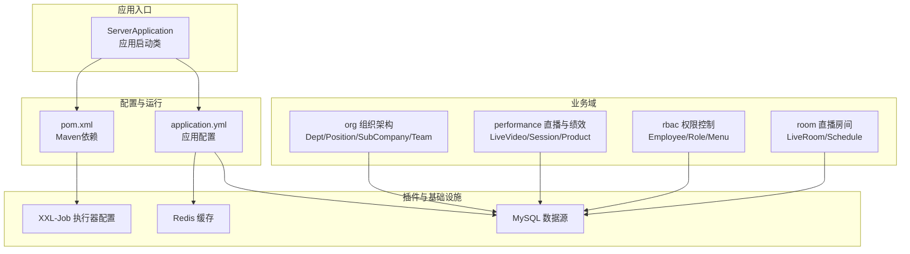
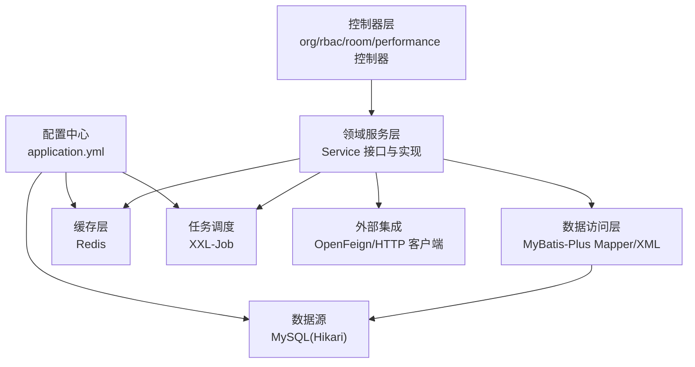
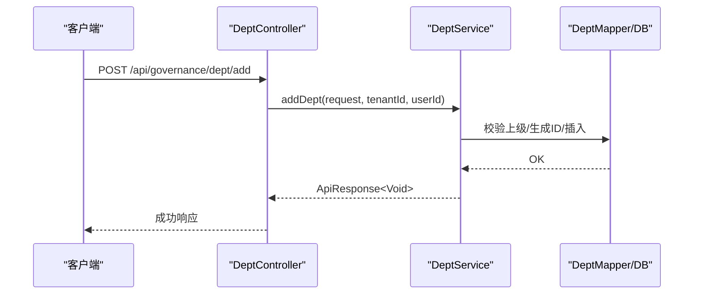
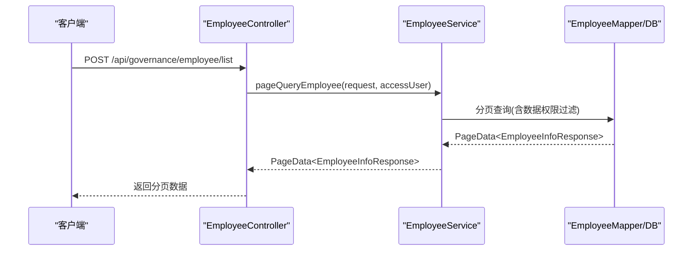
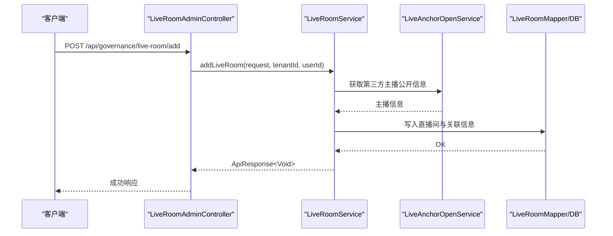
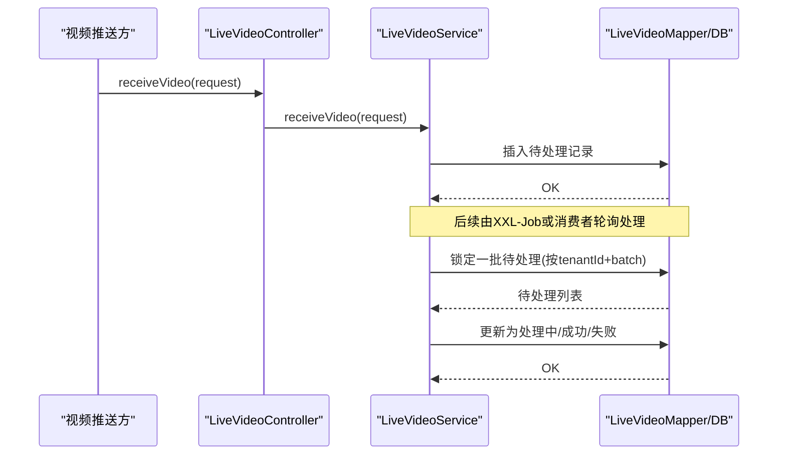
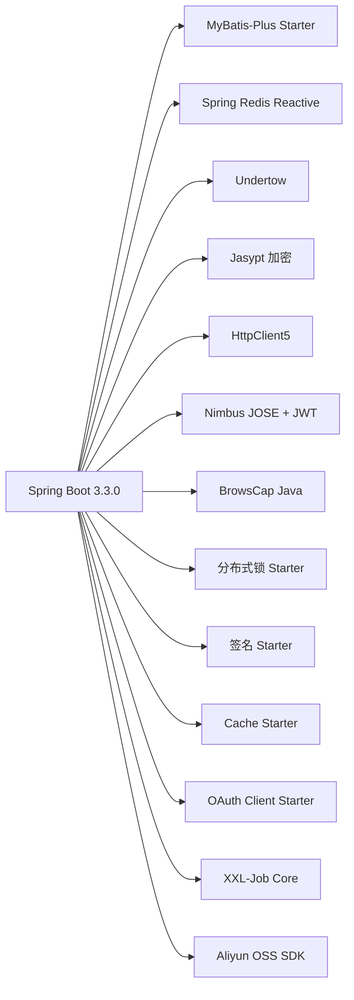

# 项目概述

<cite>
**本文引用的文件**   
- [ServerApplication.java](file://src/main/java/com/jiuyu/governance/ServerApplication.java)
- [pom.xml](file://pom.xml)
- [application.yml](file://src/main/resources/application.yml)
- [API数据字典.md](file://API_DATA_DICTIONARY.md)
- [XxlJob配置类.java](file://src/main/java/com/jiuyu/governance/plugins/xxljob/XxlJobConfiguration.java)
- [组织架构-部门服务接口.java](file://src/main/java/com/jiuyu/governance/business/org/service/DeptService.java)
- [直播视频服务接口.java](file://src/main/java/com/jiuyu/governance/business/performance/service/LiveVideoService.java)
- [RBAC-员工服务接口.java](file://src/main/java/com/jiuyu/governance/business/rbac/service/EmployeeService.java)
- [直播房间服务接口.java](file://src/main/java/com/jiuyu/governance/business/room/service/LiveRoomService.java)
</cite>

## 目录
1. [简介](#简介)
2. [项目结构](#项目结构)
3. [核心组件](#核心组件)
4. [架构总览](#架构总览)
5. [详细组件分析](#详细组件分析)
6. [依赖分析](#依赖分析)
7. [性能考虑](#性能考虑)
8. [故障排查指南](#故障排查指南)
9. [结论](#结论)
10. [附录](#附录)

## 简介
fupan-governance-server 是面向直播电商行业的“复盘治理”后端服务，围绕组织架构治理、人员权限管理、直播业绩统计与直播房间管理四大核心域构建，旨在为直播运营提供统一的组织、人员、房间与数据统计能力。项目采用模块化分层设计，以 Spring Boot 3.3.0 为基础，结合 MyBatis-Plus、Redis、XXL-Job 等技术栈，支撑高并发、可扩展的业务治理需求。

在直播电商场景中，项目的价值体现在：
- 组织架构治理：对子公司、部门、小组进行精细化管理，支撑跨组织的数据权限隔离与资源归属。
- 人员权限管理：基于 RBAC 的员工、角色、菜单权限体系，保障多租户下的安全与合规。
- 直播业绩统计：承接直播视频数据，提供视频接收、处理、统计与报表能力，支撑销售与运营决策。
- 直播房间管理：提供直播间的全生命周期管理，打通与第三方平台的对接与排班配置。

## 项目结构
项目采用标准的 Spring Boot Maven 结构，核心代码位于 src/main/java 下，按业务域划分 package：
- business：业务域模块，包含 org（组织）、performance（绩效/直播）、rbac（权限）、room（直播房间）
- common：公共工具与异常定义
- openfeign：对外能力开放与集成
- plugins：插件化能力，如分布式锁、签名、WebMvc、XXL-Job、OSS、短信等
- resources：配置文件、Mapper XML、SQL 初始化脚本

图表来源
- [ServerApplication.java:1-19](file://src/main/java/com/jiuyu/governance/ServerApplication.java#L1-L19)
- [application.yml:1-148](file://src/main/resources/application.yml#L1-L148)
- [pom.xml:1-226](file://pom.xml#L1-L226)

章节来源
- [ServerApplication.java:1-19](file://src/main/java/com/jiuyu/governance/ServerApplication.java#L1-L19)
- [pom.xml:1-226](file://pom.xml#L1-L226)
- [application.yml:1-148](file://src/main/resources/application.yml#L1-L148)

## 核心组件
- 组织架构治理（org）
  - 职责：维护子公司、部门、小组的层级关系与管理员，提供下拉与分页查询能力。
  - 关键接口：部门服务接口（新增/修改/删除/分页/下拉/名称映射等）。
- 人员权限管理（rbac）
  - 职责：员工、角色、菜单的全生命周期管理；支持手机号占用检查、启用/禁用、角色授权、菜单树等。
  - 关键接口：员工服务接口（新增/修改/详情/分页/状态/权限/角色/手机/密码/资料等）。
- 直播房间管理（room）
  - 职责：直播间的新增/修改/启用/分页查询/排班配置；与第三方平台对接并绑定组织架构。
  - 关键接口：直播房间服务接口（新增/修改/启用/分页/详情/排班设置/员工关联房间等）。
- 直播业绩统计（performance）
  - 职责：视频数据接收、超时重置、待处理队列、批量处理、处理结果回写。
  - 关键接口：直播视频服务接口（接收视频/重置超时/获取待处理分组/锁定处理/更新结果等）。

章节来源
- [组织架构-部门服务接口.java:1-128](file://src/main/java/com/jiuyu/governance/business/org/service/DeptService.java#L1-L128)
- [RBAC-员工服务接口.java:1-300](file://src/main/java/com/jiuyu/governance/business/rbac/service/EmployeeService.java#L1-L300)
- [直播房间服务接口.java:1-149](file://src/main/java/com/jiuyu/governance/business/room/service/LiveRoomService.java#L1-L149)
- [直播视频服务接口.java:1-85](file://src/main/java/com/jiuyu/governance/business/performance/service/LiveVideoService.java#L1-L85)

## 架构总览
系统采用分层架构与模块化设计：
- 表现层：Spring MVC 控制器（各业务域 controller）
- 领域层：Service 接口与实现，封装业务规则
- 数据访问层：MyBatis-Plus Mapper 与 XML，配合 Hikari 连接池
- 基础设施：Redis 缓存、XXL-Job 分布式任务、OSS、签名与安全、WebMvc 全局异常与序列化
- 外部集成：OpenFeign 对接第三方平台（如直播主播信息）

图表来源
- [application.yml:41-148](file://src/main/resources/application.yml#L41-L148)
- [XxlJob配置类.java:1-78](file://src/main/java/com/jiuyu/governance/plugins/xxljob/XxlJobConfiguration.java#L1-L78)

## 详细组件分析

### 组件A：组织架构治理（org）
- 设计要点
  - 以“子公司-部门-小组”三级组织树为核心，提供树形结构与下拉选择。
  - 支持管理员绑定、名称映射、分页查询与存在性校验。
- 关键流程（新增部门）

图表来源
- [API数据字典.md:102-116](file://API_DATA_DICTIONARY.md#L102-L116)
- [组织架构-部门服务接口.java:25-36](file://src/main/java/com/jiuyu/governance/business/org/service/DeptService.java#L25-L36)

章节来源
- [组织架构-部门服务接口.java:1-128](file://src/main/java/com/jiuyu/governance/business/org/service/DeptService.java#L1-L128)
- [API数据字典.md:99-163](file://API_DATA_DICTIONARY.md#L99-L163)

### 组件B：人员权限管理（rbac）
- 设计要点
  - 员工与角色解耦，菜单树动态下发；支持手机号占用检查、启用/禁用、权限开关、角色授权。
  - 提供分页查询与下拉搜索，满足前端复杂筛选与权限树渲染。
- 关键流程（员工分页查询）

图表来源
- [RBAC-员工服务接口.java:86-93](file://src/main/java/com/jiuyu/governance/business/rbac/service/EmployeeService.java#L86-L93)

章节来源
- [RBAC-员工服务接口.java:1-300](file://src/main/java/com/jiuyu/governance/business/rbac/service/EmployeeService.java#L1-L300)
- [API数据字典.md:265-297](file://API_DATA_DICTIONARY.md#L265-L297)

### 组件C：直播房间管理（room）
- 设计要点
  - 直播间与组织架构绑定，支持启用/停用、排班属性设置、员工关联房间查询。
  - 新增时对接第三方平台获取主播公开信息并落库。
- 关键流程（新增直播间）

图表来源
- [直播房间服务接口.java:32-44](file://src/main/java/com/jiuyu/governance/business/room/service/LiveRoomService.java#L32-L44)

章节来源
- [直播房间服务接口.java:1-149](file://src/main/java/com/jiuyu/governance/business/room/service/LiveRoomService.java#L1-L149)
- [API数据字典.md:229-308](file://API_DATA_DICTIONARY.md#L229-L308)

### 组件D：直播业绩统计（performance）
- 设计要点
  - 视频数据接收、超时重置、待处理分组、批量锁定与处理、处理结果回写。
  - 支持按租户与批次号的幂等处理，保障高并发下的数据一致性。
- 关键流程（视频接收与处理）

图表来源
- [直播视频服务接口.java:18-49](file://src/main/java/com/jiuyu/governance/business/performance/service/LiveVideoService.java#L18-L49)
- [XxlJob配置类.java:30-76](file://src/main/java/com/jiuyu/governance/plugins/xxljob/XxlJobConfiguration.java#L30-L76)

章节来源
- [直播视频服务接口.java:1-85](file://src/main/java/com/jiuyu/governance/business/performance/service/LiveVideoService.java#L1-L85)

## 依赖分析
- 技术栈概览
  - 运行环境：Spring Boot 3.3.0、Java 17、Undertow Web 服务器
  - ORM：MyBatis-Plus（starter）
  - 缓存：Redis（reactive starter）
  - 安全与签名：JWT、签名拦截器、分布式锁（starter）
  - 任务调度：XXL-Job（core）
  - 文件存储：阿里云 OSS SDK
  - HTTP 客户端：Apache HttpClient 5
  - 配置加密：Jasypt
- 依赖关系图

图表来源
- [pom.xml:35-167](file://pom.xml#L35-L167)

章节来源
- [pom.xml:1-226](file://pom.xml#L1-L226)

## 性能考虑
- 连接池与数据库
  - 使用 HikariCP，合理配置最小空闲、最大连接、连接超时与验证超时，降低连接抖动。
- 缓存策略
  - Redis 作为热点数据缓存，结合分布式锁避免并发写冲突；注意键空间设计与过期策略。
- 任务调度
  - XXL-Job 执行器按需启用，合理设置日志路径与保留天数，避免磁盘压力。
- 序列化与网络
  - Jackson 时间格式与命名策略统一，避免序列化开销； Undertow 替代 Tomcat，提升异步性能。
- 批处理与幂等
  - 视频处理按租户+批次分组，批量锁定与回写，减少事务粒度与锁竞争。

## 故障排查指南
- 启动与配置
  - 端口冲突：检查 server.port 与 graceful shutdown 配置。
  - 数据源：确认数据库连接串、驱动与 Hikari 参数。
  - Redis：核对 host/password/port/database 及连接池参数。
- 权限与签名
  - 签名头缺失或过期：核对签名相关配置项与请求头。
- 任务调度
  - XXL-Job 不生效：确认 xxl.job.enable 与 admin 地址、access-token、executor 配置。
- 常见问题定位
  - 全局异常：参考 WebMvc 全局异常处理器定位错误。
  - 接口权限：对照 API 数据字典中的权限标识与接口路径核对。

章节来源
- [application.yml:1-148](file://src/main/resources/application.yml#L1-L148)
- [XxlJob配置类.java:30-76](file://src/main/java/com/jiuyu/governance/plugins/xxljob/XxlJobConfiguration.java#L30-L76)
- [API数据字典.md:1-415](file://API_DATA_DICTIONARY.md#L1-L415)

## 结论
fupan-governance-server 以模块化与分层架构为核心，围绕直播电商的关键治理场景构建了组织、人员、房间与数据统计能力。通过 Spring Boot 3.3.0 与 MyBatis-Plus 的稳定组合，辅以 Redis、XXL-Job、OSS、签名与分布式锁等基础设施，项目在可扩展性、安全性与运维效率方面具备良好基础。建议在后续迭代中持续完善监控与可观测性、优化批处理与幂等策略，并加强接口文档与权限治理的自动化校验。

## 附录
- 业务价值
  - 组织治理：清晰的组织树与管理员绑定，支撑跨组织数据隔离与资源归属。
  - 权限治理：RBAC 体系与菜单树下发，满足多租户下的细粒度权限控制。
  - 直播治理：从房间到视频的全链路管理，保障直播数据的准确性与可追溯性。
  - 统计治理：视频处理与指标沉淀，为销售与运营提供数据支撑。
- 应用场景
  - 直播电商运营后台：组织与人员管理、直播房间与排班、直播数据统计。
  - 多租户平台：不同企业租户的独立治理与权限隔离。
  - 第三方平台对接：通过 OpenFeign 与直播平台进行数据互通。
- 技术优势
  - 模块化设计：职责清晰、易于扩展与维护。
  - 高并发能力：连接池、缓存与任务调度协同，满足直播高峰期需求。
  - 安全与合规：签名、JWT、分布式锁与权限标识，保障系统安全。