# 爱复盘企业管理后台 - 人员、排班与业绩全链路管理系统详细需求文档

**文档版本**: V2.60  
**文档状态**: 正式发布  
**编写日期**: 2026年3月18日  
**适用系统**: 爱复盘直播电商管理SaaS平台  
**保密级别**: 内部技术文档

---

## 目录

1. [文档引言](#1-文档引言)
   - 1.1 文档目的
   - 1.2 适用范围
   - 1.3 术语定义
   - 1.4 系统概述
   - 1.5 设计原则

2. [系统架构设计](#2-系统架构设计)
   - 2.1 整体技术架构
   - 2.2 多租户架构设计
   - 2.3 数据隔离策略
   - 2.4 系统模块划分

3. [权限管理模块](#3-权限管理模块)
   - 3.1 权限模型设计
   - 3.2 菜单管理业务流程
   - 3.3 角色管理业务流程
   - 3.4 用户权限分配流程
   - 3.5 权限验证时序图
   - 3.6 权限模块操作细则

4. [组织架构管理模块](#4-组织架构管理模块)
   - 4.1 组织架构模型
   - 4.2 子公司管理流程
   - 4.3 部门管理流程
   - 4.4 小组管理流程
   - 4.5 岗位管理流程
   - 4.6 员工管理流程

5. [直播间管理模块](#5-直播间管理模块)
   - 5.1 直播间数据模型
   - 5.2 直播间创建流程
   - 5.3 直播间绑定流程
   - 5.4 直播间配置管理

6. [排班管理模块](#6-排班管理模块)
   - 6.1 排班业务模型
   - 6.2 排班配置流程
   - 6.3 智能排班算法
   - 6.4 排班调整流程
   - 6.5 排班冲突检测
   - 6.6 排班通知机制

7. [场次管理模块](#7-场次管理模块)
   - 7.1 场次数据采集
   - 7.2 场次自动创建流程
   - 7.3 场次手动录入流程
   - 7.4 场次数据校验

8. [业绩核算模块](#8-业绩核算模块)
   - 8.1 业绩核算模型
   - 8.2 巨量千川数据采集
   - 8.3 业绩分摊算法
   - 8.4 业绩核算流程
   - 8.5 业绩修正流程

9. [统计分析模块](#9-统计分析模块)
   - 9.1 统计维度设计
   - 9.2 每日统计流程
   - 9.3 排行榜生成流程
   - 9.4 数据报表输出

10. [商品管理模块](#10-商品管理模块)
    - 10.1 商品数据模型
    - 10.2 商品关联流程
    - 10.3 商品统计流程

11. [数据库设计详解](#11-数据库设计详解)
    - 11.1 完整ER图
    - 11.2 表结构详细说明
    - 11.3 索引设计说明
    - 11.4 数据字典

12. [接口设计规范](#12-接口设计规范)
    - 12.1 接口命名规范
    - 12.2 请求响应格式
    - 12.3 错误码定义
    - 12.4 安全认证机制

13. [业务流程图汇总](#13-业务流程图汇总)
    - 13.1 整体业务流程图
    - 13.2 权限管理流程图
    - 13.3 排班管理流程图
    - 13.4 业绩核算流程图
    - 13.5 统计分析流程图

14. [时序图汇总](#14-时序图汇总)
    - 14.1 用户登录认证时序图
    - 14.2 排班创建时序图
    - 14.3 业绩核算时序图
    - 14.4 数据采集时序图

15. [附录](#15-附录)
    - 15.1 字段枚举值说明
    - 15.2 业务规则清单
    - 15.3 变更记录

---

## 1. 文档引言

### 1.1 文档目的

本文档是"爱复盘"直播电商企业管理后台V2.60版本的核心技术需求文档，专注于人员管理、排班调度、业绩核算三大核心业务域。文档旨在为开发团队、测试团队、运维团队提供完整、准确、可执行的技术实现指南。

本文档的核心目标包括：

1. **明确业务边界**：清晰定义各功能模块的业务范围、输入输出、处理逻辑
2. **规范数据模型**：基于已确认的数据库表结构，详细说明各表之间的关系、字段含义、约束条件
3. **细化操作流程**：对每个业务操作进行步骤级拆解，确保开发实现与业务需求完全一致
4. **提供可视化参考**：通过流程图、时序图、ER图等形式，直观展示系统运行逻辑
5. **统一技术标准**：定义接口规范、错误处理、安全机制等技术标准

本文档将作为以下工作的核心依据：
- 后端服务开发与代码实现
- 前端页面设计与交互开发
- 测试用例编写与验收测试
- 系统部署与运维配置
- 技术文档与用户手册编写

### 1.2 适用范围

本系统适用于多租户（SaaS）架构下的直播电商企业，具体适用场景包括：

**企业类型**：
- 单一组织架构的直播电商公司
- 多子公司/多品牌的集团型直播企业
- MCN机构及主播经纪公司
- 直播代运营服务商

**业务场景**：
- 抖音、快手、视频号等多平台直播间管理
- 多主播、多场次的排班调度
- 基于巨量引擎、千川平台的广告数据采集
- 主播及运营团队的业绩核算与考核
- 多维度数据分析与报表输出

**用户角色**：
- 系统管理员：负责租户管理、系统配置
- 企业管理员：负责组织架构、权限配置
- 运营主管：负责排班管理、场次管理
- 普通员工：查看个人排班、业绩数据
- 财务人员：查看业绩报表、导出数据

### 1.3 术语定义

| 术语 | 英文 | 定义说明 |
| :--- | :--- | :--- |
| 租户 | Tenant | SaaS系统中的独立客户实例，拥有独立的数据空间和配置 |
| 子公司 | Sub Company | 租户下的独立法人或业务单元，用于多组织架构管理 |
| 部门 | Department | 子公司下的职能划分单元，如运营部、销售部等 |
| 小组 | Team | 部门下的最小组织单元，如直播一组、直播二组 |
| 岗位 | Position | 员工的职务类型，如主播、助播、场控、运营等 |
| 员工 | Employee | 系统中的注册用户，关联具体的组织架构和岗位 |
| 直播间 | Live Room | 绑定了主播账号的直播场所，是排班和业绩的基本单位 |
| 场次 | Session | 直播间的一次具体直播活动，有明确的开始和结束时间 |
| 排班 | Schedule | 员工在特定日期、特定直播间的工作安排 |
| 场观 | View Count | 直播间或场次的累计观看人数 |
| 净销售额 | Net Sales | 销售额减去退款后的实际成交金额 |
| ROI | ROI | 投资回报率，计算公式：净销售额/投放金额 |
| 巨量引擎 | Ocean Engine | 字节跳动旗下的营销服务平台 |
| 千川 | Qianchuan | 巨量引擎旗下的电商广告平台 |
| SecUID | SecUID | 抖音平台用户的唯一标识符 |
| 逻辑删除 | Logical Delete | 通过is_deleted字段标记数据删除状态，而非物理删除 |
| RBAC | Role-Based Access Control | 基于角色的访问控制权限模型 |

### 1.4 系统概述

爱复盘企业管理后台是一套面向直播电商行业的SaaS化管理系统，核心功能涵盖：

**组织权限体系**：
- 多租户数据隔离
- 子公司-部门-小组三级组织架构
- 基于RBAC的菜单、功能权限控制
- 岗位体系与员工管理

**直播业务管理**：
- 多平台直播间绑定（抖音、快手、视频号）
- 直播间排班配置与智能调度
- 场次自动采集与手动录入
- 主播账号与员工关联

**业绩核算体系**：
- 巨量引擎、千川数据自动采集
- 排班与场次业绩智能分摊
- 多维度业绩统计（个人、小组、部门、公司）
- 排行榜与数据可视化

**数据分析报表**：
- 每日统计数据自动生成
- 多维度数据钻取分析
- 自定义报表导出
- 实时数据看板

### 1.5 设计原则

**1.5.1 多租户隔离原则**
- 所有业务表必须包含tenant_id字段
- 查询时必须强制携带tenant_id条件
- 租户间数据完全隔离，不可跨租户访问
- 支持租户级数据备份与恢复

**1.5.2 性能优先原则**
- 时间字段采用int存储（HH:mm格式转换为整数）
- 高频查询字段建立组合索引
- 统计数据采用预计算+冗余存储策略
- 支持大数据量分页查询

**1.5.3 数据一致性原则**
- 核心业务操作采用事务保证
- 关键数据变更保留操作日志
- 支持数据追溯与审计
- 定时任务进行数据校验

**1.5.4 可扩展性原则**
- 模块化设计，支持功能插拔
- 接口设计预留扩展字段
- 支持新直播平台快速接入
- 支持自定义统计维度

**1.5.5 特殊行业规则**
- 直播行业排班不受劳动法约束，按业务需求灵活配置
- 业绩核算规则由租户自定义配置
- 支持24小时不间断直播排班
- 支持跨天场次处理

---

## 2. 系统架构设计

### 2.1 整体技术架构

```
┌─────────────────────────────────────────────────────────────────────────┐
│                           客户端层 (Client Layer)                        │
│  ┌─────────────┐  ┌─────────────┐  ┌─────────────┐  ┌─────────────┐    │
│  │   Web端     │  │  移动端H5   │  │  小程序     │  │  开放API    │    │
│  └─────────────┘  └─────────────┘  └─────────────┘  └─────────────┘    │
└─────────────────────────────────────────────────────────────────────────┘
                                    │
                                    ▼
┌─────────────────────────────────────────────────────────────────────────┐
│                          网关层 (Gateway Layer)                          │
│  ┌─────────────────────────────────────────────────────────────────┐    │
│  │  API Gateway (路由、限流、鉴权、日志、监控)                      │    │
│  └─────────────────────────────────────────────────────────────────┘    │
└─────────────────────────────────────────────────────────────────────────┘
                                    │
                                    ▼
┌─────────────────────────────────────────────────────────────────────────┐
│                         应用服务层 (Application Layer)                   │
│  ┌───────────┐ ┌───────────┐ ┌───────────┐ ┌───────────┐ ┌───────────┐ │
│  │ 权限服务  │ │ 组织服务  │ │ 排班服务  │ │ 业绩服务  │ │ 统计服务  │ │
│  └───────────┘ └───────────┘ └───────────┘ └───────────┘ └───────────┘ │
│  ┌───────────┐ ┌───────────┐ ┌───────────┐ ┌───────────┐ ┌───────────┐ │
│  │ 直播服务  │ │ 场次服务  │ │ 商品服务  │ │ 通知服务  │ │ 文件服务  │ │
│  └───────────┘ └───────────┘ └───────────┘ └───────────┘ └───────────┘ │
└─────────────────────────────────────────────────────────────────────────┘
                                    │
                                    ▼
┌─────────────────────────────────────────────────────────────────────────┐
│                          数据层 (Data Layer)                             │
│  ┌─────────────┐  ┌─────────────┐  ┌─────────────┐  ┌─────────────┐    │
│  │  MySQL主库  │  │ MySQL从库   │  │   Redis     │  │    OSS      │    │
│  │  (写操作)   │  │ (读操作)    │  │  (缓存)     │  │  (文件存储)  │    │
│  └─────────────┘  └─────────────┘  └─────────────┘  └─────────────┘    │
└─────────────────────────────────────────────────────────────────────────┘
                                    │
                                    ▼
┌─────────────────────────────────────────────────────────────────────────┐
│                        外部集成层 (Integration Layer)                    │
│  ┌─────────────┐  ┌─────────────┐  ┌─────────────┐  ┌─────────────┐    │
│  │  巨量引擎   │  │   千川API   │  │   快手API   │  │  视频号API  │    │
│  └─────────────┘  └─────────────┘  └─────────────┘  └─────────────┘    │
└─────────────────────────────────────────────────────────────────────────┘
```

### 2.2 多租户架构设计

系统采用共享数据库、共享Schema、通过tenant_id字段进行逻辑隔离的多租户架构。


### 2.3 数据隔离策略

| 隔离级别 | 实现方式 | 适用场景 |
| :--- | :--- | :--- |
| 租户级隔离 | tenant_id字段过滤 | 所有业务数据 |
| 子公司级隔离 | company_id字段过滤 | 组织架构、业绩统计 |
| 部门级隔离 | dept_id字段过滤 | 团队管理、排班 |
| 个人级隔离 | employee_id字段过滤 | 个人业绩、个人排班 |

### 2.4 系统模块划分

```
爱复盘管理系统
├── 权限管理模块
│   ├── 菜单管理
│   ├── 角色管理
│   ├── 用户角色关联
│   └── 权限验证
├── 组织架构模块
│   ├── 子公司管理
│   ├── 部门管理
│   ├── 小组管理
│   ├── 岗位管理
│   └── 员工管理
├── 直播管理模块
│   ├── 直播间管理
│   ├── 排班配置
│   ├── 排班管理
│   └── 场次管理
├── 业绩管理模块
│   ├── 数据采集
│   ├── 业绩分摊
│   ├── 业绩核算
│   └── 业绩修正
├── 统计分析模块
│   ├── 每日统计
│   ├── 排行榜
│   ├── 数据报表
│   └── 数据导出
└── 商品管理模块
    ├── 商品管理
    └── 场次商品关联
```

---

## 3. 权限管理模块

### 3.1 权限模型设计

系统采用增强型RBAC（Role-Based Access Control）权限模型，支持菜单权限、功能权限、数据权限三级控制。

**权限模型核心要素**：

```
用户 (User) ←→ 角色 (Role) ←→ 菜单/功能 (Menu)
   │              │                  │
   │              │                  ├── 菜单 (type=2)
   │              │                  ├── 页面 (type=0)
   │              │                  └── 按钮/功能 (type=1)
   │              │
   │              └── 
   │                   
   │                   
   │                   
   │                   
   │                   
   │
   └── 直接关联组织架构
        ├── 子公司
        ├── 部门
        ├── 小组
        └── 岗位
```

**涉及数据表**：
- `menu`：菜单/功能权限定义表
- `role`：角色定义表
- `menu_role`：角色-菜单关联表
- `user_role`：用户-角色关联表
- `employee`：员工信息表（含组织架构关联）

### 3.2 菜单管理业务流程

**3.2.1 菜单类型定义**

| type值 | 类型 | 说明 | 是否参与权限控制 |
| :--- | :--- | :--- | :--- |
| 0 | 菜单 | 左侧导航菜单项 | 是 |
| 1 | 功能 | 按钮、API接口权限 | 是 |
| 2 | 目录 | 菜单分组目录 | 否（仅展示） |

**3.2.2 菜单树结构设计**

```
系统管理 (目录，type=2, parent_id=0)
├── 用户管理 (菜单，type=0, parent_id=1)
│   ├── 用户列表 (菜单，type=0, parent_id=2)
│   ├── 新增用户 (功能，type=1, parent_id=2)
│   ├── 编辑用户 (功能，type=1, parent_id=2)
│   └── 删除用户 (功能，type=1, parent_id=2)
├── 角色管理 (菜单，type=0, parent_id=1)
│   ├── 角色列表 (菜单，type=0, parent_id=5)
│   └── 分配权限 (功能，type=1, parent_id=5)
└── 菜单管理 (菜单，type=0, parent_id=1)
    └── 菜单编辑 (功能，type=1, parent_id=8)

直播管理 (目录，type=2, parent_id=0)
├── 直播间管理 (菜单，type=0, parent_id=10)
├── 排班管理 (菜单，type=0, parent_id=10)
└── 场次管理 (菜单，type=0, parent_id=10)
```

**3.2.3 菜单管理操作流程**

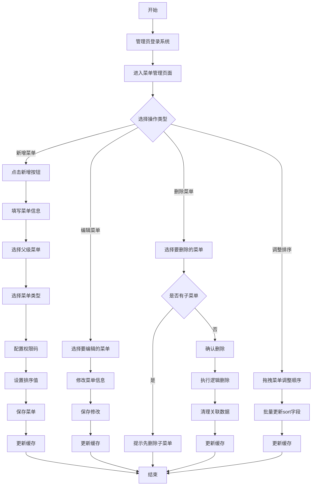

**3.2.4 菜单管理详细操作步骤**

**新增菜单操作步骤**：

| 步骤 | 操作 | 输入字段 | 校验规则 | 系统处理 |
| :--- | :--- | :--- | :--- | :--- |
| 1 | 点击新增按钮 | - | 检查用户是否有菜单管理权限 | 弹出新增表单 |
| 2 | 选择父级菜单 | parent_id | 必须选择，根节点parent_id=0 | 加载菜单树供选择 |
| 3 | 填写菜单名称 | name | 必填，1-50字符，不能重复 | 实时校验名称唯一性 |
| 4 | 填写菜单URL | url | 菜单类型必填，1-100字符 | 校验URL格式 |
| 5 | 选择菜单类型 | type | 必填，0/1/2 | 根据类型显示不同字段 |
| 6 | 填写权限码 | permission_code | 功能类型必填，1-50字符 | 校验权限码唯一性 |
| 7 | 上传图标 | img | 可选，支持图片上传 | 上传至OSS，返回URL |
| 8 | 设置排序值 | sort | 必填，整数，默认0 | 数值越小越靠前 |
| 9 | 确认保存 | - | 所有必填项校验通过 | 插入menu表，生成id |
| 10 | 更新缓存 | - | - | 清除菜单缓存，重新加载 |

**编辑菜单操作步骤**：

| 步骤 | 操作 | 输入字段 | 校验规则 | 系统处理 |
| :--- | :--- | :--- | :--- | :--- |
| 1 | 选择菜单 | - | 必须选择可编辑菜单 | 加载菜单详情 |
| 2 | 修改信息 | 各字段 | 同新增校验规则 | 实时更新表单 |
| 3 | 确认保存 | - | 校验通过 | 更新menu表，记录update_date |
| 4 | 更新缓存 | - | - | 清除菜单缓存 |

**删除菜单操作步骤**：

| 步骤 | 操作 | 校验规则 | 系统处理 |
| :--- | :--- | :--- | :--- |
| 1 | 选择菜单 | 不能删除根节点 | 高亮选中菜单 |
| 2 | 点击删除 | 检查是否有子菜单 | 有子菜单则阻止删除 |
| 3 | 确认删除 | 二次确认弹窗 | 记录操作日志 |
| 4 | 执行删除 | 检查是否有关联角色 | 有关联则提示先解绑 |
| 5 | 逻辑删除 | - | 设置is_deleted=1 |
| 6 | 清理关联 | - | 删除menu_role关联记录 |
| 7 | 更新缓存 | - | 清除菜单缓存 |

### 3.3 角色管理业务流程

**3.3.1 角色类型定义**

| 角色类型 | 说明 | 是否可删除 | 数据权限 |
| :--- | :--- | :--- | :--- |
| 超级管理员 | 系统最高权限，不可删除 | 否 | 全部数据 |
| 租户管理员 | 租户级别管理员 | 否 | 本租户全部数据 |
| 公司管理员 | 子公司级别管理员 | 是 | 本公司数据 |
| 部门管理员 | 部门级别管理员 | 是 | 本部门数据 |
| 普通角色 | 自定义角色 | 是 | 可配置 |

**3.3.2 角色管理操作流程**

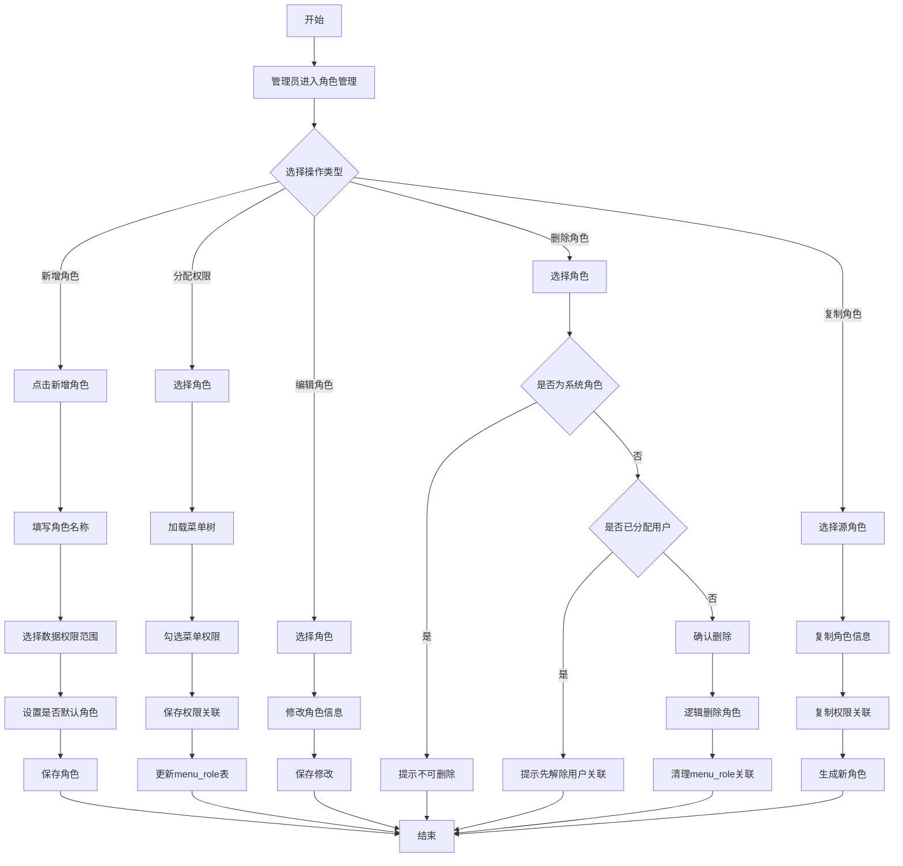

**3.3.3 角色管理详细操作步骤**

**新增角色操作步骤**：

| 步骤 | 操作 | 输入字段 | 校验规则 | 系统处理 |
| :--- | :--- | :--- | :--- | :--- |
| 1 | 进入角色管理 | - | 检查角色管理权限 | 加载角色列表 |
| 2 | 点击新增 | - | - | 弹出新增表单 |
| 3 | 填写角色名称 | name | 必填，1-100字符，租户内唯一 | 实时校验唯一性 |
| 4 | 选择数据权限 | - | 可选，默认仅个人数据 | 存储为角色属性 |
| 5 | 设置默认角色 | is_default | 可选，一个租户只能有一个默认角色 | 校验唯一性 |
| 6 | 确认保存 | - | 所有校验通过 | 插入role表，生成id |

**分配权限操作步骤**：

| 步骤 | 操作 | 输入字段 | 校验规则 | 系统处理 |
| :--- | :--- | :--- | :--- | :--- |
| 1 | 选择角色 | role_id | 必须选择有效角色 | 加载角色详情 |
| 2 | 点击分配权限 | - | - | 加载完整菜单树 |
| 3 | 勾选菜单 | menu_ids | 至少选择一个菜单 | 高亮已选菜单 |
| 4 | 展开子菜单 | - | - | 自动展开父节点 |
| 5 | 确认保存 | - | - | 批量插入menu_role表 |
| 6 | 更新缓存 | - | - | 清除角色权限缓存 |

**删除角色操作步骤**：

| 步骤 | 操作 | 校验规则 | 系统处理 |
| :--- | :--- | :--- | :--- |
| 1 | 选择角色 | 不能删除系统角色 | 系统角色置灰不可选 |
| 2 | 点击删除 | 检查user_role关联 | 有关联用户则阻止 |
| 3 | 确认删除 | 二次确认 | 记录操作日志 |
| 4 | 执行删除 | - | 设置is_deleted=1 |
| 5 | 清理关联 | - | 删除menu_role关联记录 |

### 3.4 用户权限分配流程

**3.4.1 用户-角色关联规则**

- 一个用户可以关联多个角色
- 用户权限为所有关联角色的权限并集
- 数据权限取所有角色中最大的数据范围
- 默认角色在用户创建时自动关联

**3.4.2 用户权限分配操作流程**

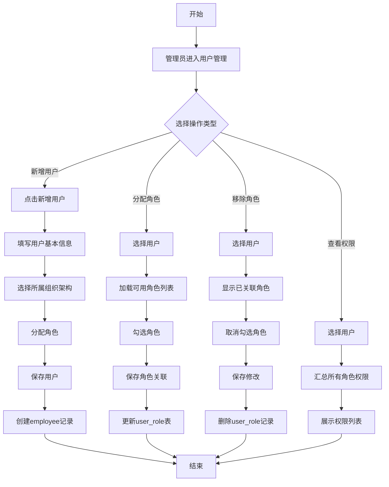

**3.4.3 用户权限分配详细操作步骤**

**新增用户操作步骤**：

| 步骤 | 操作 | 输入字段 | 校验规则 | 系统处理 |
| :--- | :--- | :--- | :--- | :--- |
| 1 | 进入用户管理 | - | 检查用户管理权限 | 加载用户列表 |
| 2 | 点击新增 | - | - | 弹出新增表单 |
| 3 | 填写用户名 | name | 必填，1-20字符 | 校验唯一性 |
| 4 | 填写手机号 | mobile | 必填，11位手机号格式 | 校验格式和唯一性 |
| 5 | 填写邮箱 | email | 可选，邮箱格式 | 校验格式 |
| 6 | 选择子公司 | company_id | 必填 | 加载子公司列表 |
| 7 | 选择部门 | dept_id | 必填 | 根据子公司加载部门 |
| 8 | 选择小组 | team_id | 可选 | 根据部门加载小组 |
| 9 | 选择岗位 | position_id | 必填 | 加载岗位列表 |
| 10 | 分配角色 | role_ids | 至少一个角色 | 加载可用角色 |
| 11 | 设置录制权限 | on_rec | 可选，默认0 | 存储到employee表 |
| 12 | 确认保存 | - | 所有校验通过 | 创建user和employee记录 |

**分配角色操作步骤**：

| 步骤 | 操作 | 输入字段 | 校验规则 | 系统处理 |
| :--- | :--- | :--- | :--- | :--- |
| 1 | 选择用户 | user_id | 必须选择有效用户 | 加载用户详情 |
| 2 | 点击分配角色 | - | - | 弹出角色选择框 |
| 3 | 勾选角色 | role_ids | 至少一个角色 | 显示已关联角色 |
| 4 | 确认保存 | - | - | 批量处理user_role表 |
| 5 | 更新缓存 | - | - | 清除用户权限缓存 |

### 3.5 权限验证时序图

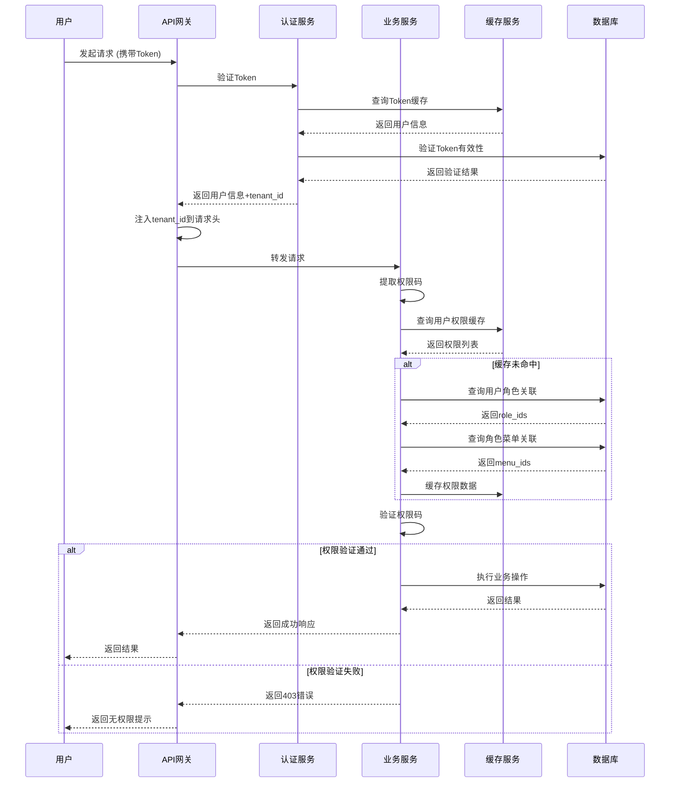

### 3.6 权限模块操作细则

**3.6.1 权限码命名规范**

```
格式：模块:资源:操作
示例：
- system:user:list      系统管理-用户-列表
- system:user:add       系统管理-用户-新增
- system:user:edit      系统管理-用户-编辑
- system:user:delete    系统管理-用户-删除
- live:room:list        直播管理-直播间-列表
- live:room:add         直播管理-直播间-新增
- schedule:plan:add     排班管理-排班-新增
- performance:view      业绩管理-业绩-查看
```


**3.6.4 权限缓存策略**

| 缓存项 | Key格式 | 过期时间 | 更新策略 |
| :--- | :--- | :--- | :--- |
| 用户信息 | user:info:{user_id} | 2小时 | 用户信息变更时失效 |
| 用户角色 | user:roles:{user_id} | 2小时 | 角色分配变更时失效 |
| 角色权限 | role:permissions:{role_id} | 4小时 | 权限分配变更时失效 |
| 菜单树 | menu:tree:{tenant_id} | 1小时 | 菜单变更时失效 |
| Token信息 | token:{token} | 与Token有效期一致 | Token失效时自动过期 |

---

## 4. 组织架构管理模块

### 4.1 组织架构模型

**4.1.1 组织架构层级**

```
租户 (Tenant)
└── 子公司 (Sub Company)
    └── 部门 (Department)
        └── 小组 (Team)
            └── 员工 (Employee)
```

**4.1.2 组织架构与岗位关系**

```
员工 (Employee)
├── 所属子公司 (company_id → sub_company.id)
├── 所属部门 (dept_id → dept.id)
├── 所属小组 (team_id → team.id)
└── 所属岗位 (position_id → position.id)
```

**4.1.3 管理员关联模型**

```
manager_connector表用于存储特殊管理员关系：
- manager_type = 1: 公司管理员
- manager_type = 2: 部门管理员
- manager_type = 3: 小组管理员
- manager_type = 4: 直播间管理员

一个员工可以担任多个管理角色
```

### 4.2 子公司管理流程

**4.2.1 子公司创建操作流程**

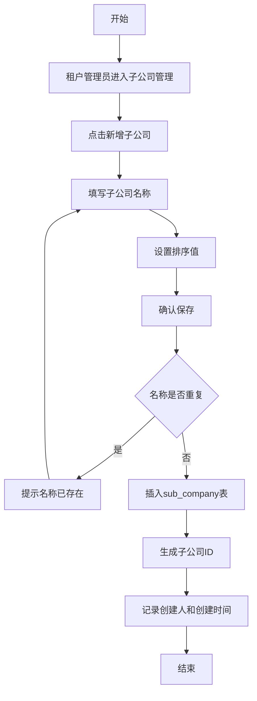

**4.2.2 子公司管理详细操作步骤**

| 步骤 | 操作 | 输入字段 | 校验规则 | 系统处理 |
| :--- | :--- | :--- | :--- | :--- |
| 1 | 进入子公司管理 | - | 检查子公司管理权限 | 加载子公司列表 |
| 2 | 点击新增 | - | - | 弹出新增表单 |
| 3 | 填写名称 | name | 必填，1-50字符，租户内唯一 | 实时校验唯一性 |
| 4 | 设置排序 | sort | 必填，整数，默认0 | 数值越小越靠前 |
| 5 | 确认保存 | - | 校验通过 | 插入sub_company表 |
| 6 | 设置管理员 | - | 可选 | 插入manager_connector表 |

**4.2.3 子公司编辑操作步骤**

| 步骤 | 操作 | 输入字段 | 校验规则 | 系统处理 |
| :--- | :--- | :--- | :--- | :--- |
| 1 | 选择子公司 | - | 必须选择有效子公司 | 加载子公司详情 |
| 2 | 修改名称 | name | 同新增校验 | 校验唯一性（排除自身） |
| 3 | 修改排序 | sort | 同新增校验 | - |
| 4 | 确认保存 | - | 校验通过 | 更新sub_company表 |
| 5 | 记录修改 | - | - | 更新update_date和update_by |

**4.2.4 子公司删除操作步骤**

| 步骤 | 操作 | 校验规则 | 系统处理 |
| :--- | :--- | :--- | :--- |
| 1 | 选择子公司 | - | 高亮选中子公司 |
| 2 | 点击删除 | 检查是否有下属部门 | 有部门则阻止删除 |
| 3 | 确认删除 | 二次确认弹窗 | 记录操作日志 |
| 4 | 执行删除 | - | 设置is_deleted=1 |
| 5 | 级联处理 | 检查关联员工 | 提示先转移员工 |

### 4.3 部门管理流程

**4.3.1 部门创建操作流程**

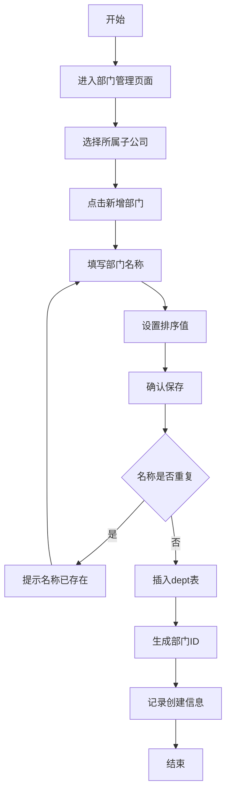

**4.3.2 部门管理详细操作步骤**

| 步骤 | 操作 | 输入字段 | 校验规则 | 系统处理 |
| :--- | :--- | :--- | :--- | :--- |
| 1 | 进入部门管理 | - | 检查部门管理权限 | 加载部门列表 |
| 2 | 选择子公司 | company_id | 必填 | 加载子公司下拉框 |
| 3 | 点击新增 | - | - | 弹出新增表单 |
| 4 | 填写名称 | name | 必填，1-40字符，公司内唯一 | 实时校验唯一性 |
| 5 | 设置排序 | sort | 必填，整数，默认0 | - |
| 6 | 确认保存 | - | 校验通过 | 插入dept表 |
| 7 | 设置管理员 | - | 可选 | 插入manager_connector表 |

**4.3.3 部门删除校验规则**

```sql
-- 删除前检查是否有下属小组
SELECT COUNT(*) FROM team WHERE dept_id = ? AND is_deleted = 0;

-- 删除前检查是否有员工
SELECT COUNT(*) FROM employee WHERE dept_id = ? AND is_deleted = 0;

-- 删除前检查是否有直播间
SELECT COUNT(*) FROM live_room WHERE dept_id = ? AND is_deleted = 0;
```

只有以上检查结果都为0时，才允许删除部门。

### 4.4 小组管理流程

**4.4.1 小组创建操作流程**

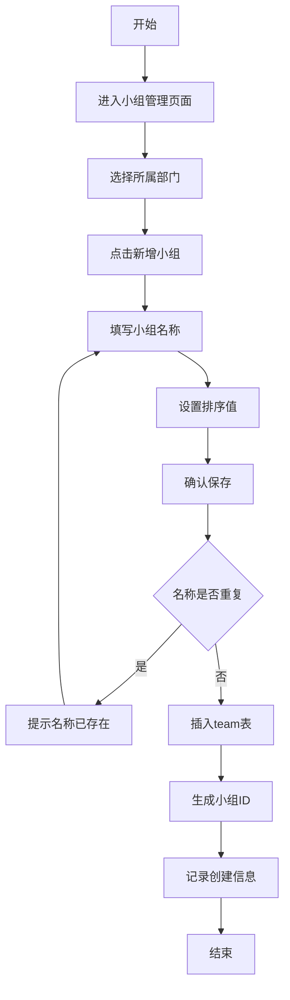

**4.4.2 小组管理详细操作步骤**

| 步骤 | 操作 | 输入字段 | 校验规则 | 系统处理 |
| :--- | :--- | :--- | :--- | :--- |
| 1 | 进入小组管理 | - | 检查小组管理权限 | 加载小组列表 |
| 2 | 选择部门 | dept_id | 必填 | 加载部门下拉框 |
| 3 | 点击新增 | - | - | 弹出新增表单 |
| 4 | 填写名称 | name | 必填，1-30字符，部门内唯一 | 实时校验唯一性 |
| 5 | 设置排序 | sort | 必填，整数，默认0 | - |
| 6 | 确认保存 | - | 校验通过 | 插入team表 |
| 7 | 设置管理员 | - | 可选 | 插入manager_connector表 |

### 4.5 岗位管理流程

**4.5.1 岗位类型定义**

| 岗位类型 | 说明 | 是否需要position_code |
| :--- | :--- | :--- |
| 主播 | 负责直播出镜讲解 | 是（用于业务枚举查询） |
| 助播 | 协助主播进行直播 | 是 |
| 场控 | 负责直播间现场控制 | 是 |
| 运营 | 负责直播运营策划 | 是 |
| 客服 | 负责客户咨询回复 | 否 |
| 其他 | 其他岗位类型 | 否 |

**4.5.2 岗位创建操作流程**

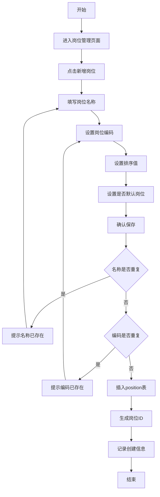

**4.5.3 岗位管理详细操作步骤**

| 步骤 | 操作 | 输入字段 | 校验规则 | 系统处理 |
| :--- | :--- | :--- | :--- | :--- |
| 1 | 进入岗位管理 | - | 检查岗位管理权限 | 加载岗位列表 |
| 2 | 点击新增 | - | - | 弹出新增表单 |
| 3 | 填写名称 | name | 必填，1-100字符，租户内唯一 | 实时校验唯一性 |
| 4 | 填写编码 | position_code | 默认岗位必填，1-30字符，租户内唯一 | 校验唯一性 |
| 5 | 设置排序 | sort | 必填，整数，默认0 | - |
| 6 | 设置默认岗位 | is_default | 可选，一个编码只能有一个默认岗位 | 校验唯一性 |
| 7 | 确认保存 | - | 所有校验通过 | 插入position表 |

**4.5.4 岗位使用统计查询**

```sql
-- 查询岗位关联的员工数量
SELECT p.id, p.name, COUNT(e.id) as employee_count
FROM position p
LEFT JOIN employee e ON p.id = e.position_id AND e.is_deleted = 0
WHERE p.tenant_id = ? AND p.is_deleted = 0
GROUP BY p.id, p.name;

-- 删除前检查是否有员工使用
SELECT COUNT(*) FROM employee WHERE position_id = ? AND is_deleted = 0;
```

### 4.6 员工管理流程

**4.6.1 员工创建操作流程**

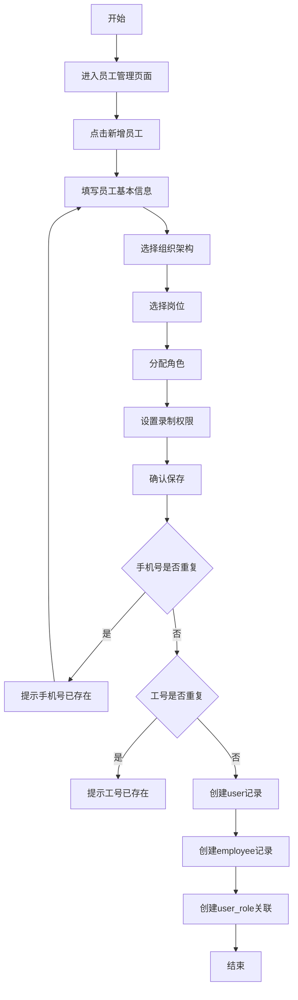

**4.6.2 员工管理详细操作步骤**

| 步骤 | 操作 | 输入字段 | 校验规则 | 系统处理 |
| :--- | :--- | :--- | :--- | :--- |
| 1 | 进入员工管理 | - | 检查员工管理权限 | 加载员工列表 |
| 2 | 点击新增 | - | - | 弹出新增表单 |
| 3 | 填写姓名 | name | 必填，1-20字符 | - |
| 4 | 填写工号 | staff_number | 可选，1-10字符，租户内唯一 | 校验唯一性 |
| 5 | 填写手机号 | mobile | 必填，11位手机号格式，租户内唯一 | 校验格式和唯一性 |
| 6 | 填写邮箱 | email | 可选，邮箱格式 | 校验格式 |
| 7 | 上传头像 | user_avatar | 可选，图片URL | 上传至OSS |
| 8 | 选择子公司 | company_id | 必填 | 加载子公司列表 |
| 9 | 选择部门 | dept_id | 必填 | 根据子公司加载部门 |
| 10 | 选择小组 | team_id | 可选，默认0 | 根据部门加载小组 |
| 11 | 选择岗位 | position_id | 必填，默认0 | 加载岗位列表 |
| 12 | 分配角色 | role_ids | 至少一个角色 | 加载可用角色 |
| 13 | 设置录制权限 | on_rec | 可选，默认0 | 存储到employee表 |
| 14 | 关联客户端账户 | connector_client_user_id | 可选，默认0 | 关联客户端用户 |
| 15 | 确认保存 | - | 所有校验通过 | 创建user和employee记录 |

**4.6.3 员工编辑操作步骤**

| 步骤 | 操作 | 输入字段 | 校验规则 | 系统处理 |
| :--- | :--- | :--- | :--- | :--- |
| 1 | 选择员工 | - | 必须选择有效员工 | 加载员工详情 |
| 2 | 修改基本信息 | name/mobile/email等 | 同新增校验 | 校验唯一性（排除自身） |
| 3 | 修改组织架构 | company_id/dept_id/team_id | - | 级联更新相关数据 |
| 4 | 修改岗位 | position_id | - | - |
| 5 | 修改角色 | role_ids | - | 更新user_role表 |
| 6 | 确认保存 | - | 校验通过 | 更新employee表 |
| 7 | 记录修改 | - | - | 更新update_date和update_by |

**4.6.4 员工删除/离职操作步骤**

| 步骤 | 操作 | 校验规则 | 系统处理 |
| :--- | :--- | :--- | :--- |
| 1 | 选择员工 | - | 高亮选中员工 |
| 2 | 点击删除/离职 | 检查是否有进行中排班 | 有排班则提示先处理 |
| 3 | 确认操作 | 二次确认弹窗 | 记录操作日志 |
| 4 | 处理排班 | - | 将未来排班标记为无效 |
| 5 | 处理直播间 | - | 解除直播间关联 |
| 6 | 执行删除 | - | 设置is_deleted=1 |
| 7 | 保留历史数据 | - | 业绩数据不删除，仅标记员工离职 |

**4.6.5 员工批量导入流程**

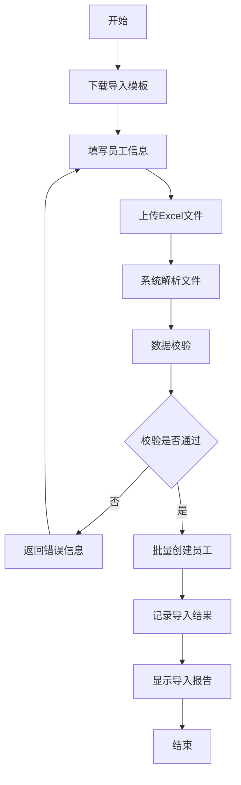

**4.6.6 员工导入数据校验规则**

| 字段 | 校验规则 | 错误提示 |
| :--- | :--- | :--- |
| 姓名 | 必填，1-20字符 | 姓名不能为空，长度不超过20字符 |
| 工号 | 可选，1-10字符，唯一 | 工号已存在 |
| 手机号 | 必填，11位，唯一 | 手机号格式错误或已存在 |
| 邮箱 | 可选，邮箱格式 | 邮箱格式不正确 |
| 子公司 | 必填，名称必须存在 | 子公司不存在 |
| 部门 | 必填，名称必须存在 | 部门不存在 |
| 小组 | 可选，名称必须存在 | 小组不存在 |
| 岗位 | 必填，名称必须存在 | 岗位不存在 |

---

## 5. 直播间管理模块

### 5.1 直播间数据模型

**5.1.1 直播间核心字段说明**

| 字段 | 类型 | 说明 | 校验规则 |
| :--- | :--- | :--- | :--- |
| sec_uid | varchar(500) | 主播唯一标识 | 必填，平台内唯一 |
| platform | tinyint | 平台类型 | 0:抖音 1:快手 2:视频号 |
| anchor_number | varchar(255) | 主播抖音号/快手号 | 可选，用于搜索 |
| anchor_name | varchar(500) | 主播名称 | 必填 |
| home_url | varchar(2000) | 主页URL | 可选 |
| live_url | varchar(2000) | 直播间URL | 可选 |
| anchor_avatar | varchar(2000) | 主播头像URL | 可选 |
| debut_date | date | 首播日期 | 可选 |
| trade_id | bigint | 行业ID | 可选，关联行业分类 |
| company_id | bigint | 所属公司 | 必填 |
| dept_id | bigint | 所属部门 | 必填 |
| team_id | bigint | 所属小组 | 可选，默认0 |

**5.1.2 直播间与员工关联关系**

直播间本身不直接关联员工，而是通过排班系统间接关联：
- 直播间 → 排班 → 员工
- 直播间可以有多个员工轮班
- 员工可以在多个直播间排班

### 5.2 直播间创建流程

**5.2.1 直播间创建操作流程**

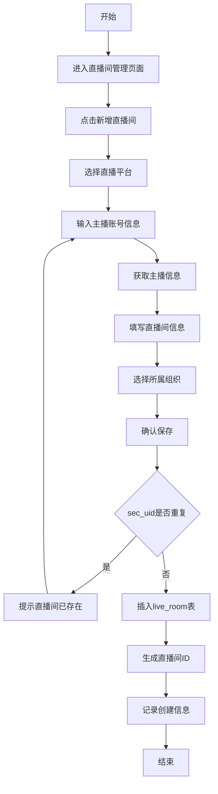

**5.2.2 直播间创建详细操作步骤**

| 步骤 | 操作 | 输入字段 | 校验规则 | 系统处理 |
| :--- | :--- | :--- | :--- | :--- |
| 1 | 进入直播间管理 | - | 检查直播间管理权限 | 加载直播间列表 |
| 2 | 点击新增 | - | - | 弹出新增表单 |
| 3 | 选择平台 | platform | 必填，0/1/2 | 显示对应平台输入项 |
| 4 | 输入主播号 | anchor_number | 根据平台必填 | 用于搜索主播 |
| 5 | 获取主播信息 | - | 调用平台API | 自动填充sec_uid等信息 |
| 6 | 填写主播名称 | anchor_name | 必填，1-500字符 | - |
| 7 | 填写主页URL | home_url | 可选，URL格式 | 校验URL格式 |
| 8 | 填写直播间URL | live_url | 可选，URL格式 | 校验URL格式 |
| 9 | 上传头像 | anchor_avatar | 可选 | 上传至OSS |
| 10 | 选择首播日期 | debut_date | 可选，日期格式 | - |
| 11 | 选择行业 | trade_id | 可选 | 加载行业列表 |
| 12 | 选择公司 | company_id | 必填 | 加载公司列表 |
| 13 | 选择部门 | dept_id | 必填 | 根据公司加载部门 |
| 14 | 选择小组 | team_id | 可选 | 根据部门加载小组 |
| 15 | 确认保存 | - | 所有校验通过 | 插入live_room表 |

**5.2.3 主播信息自动获取流程**

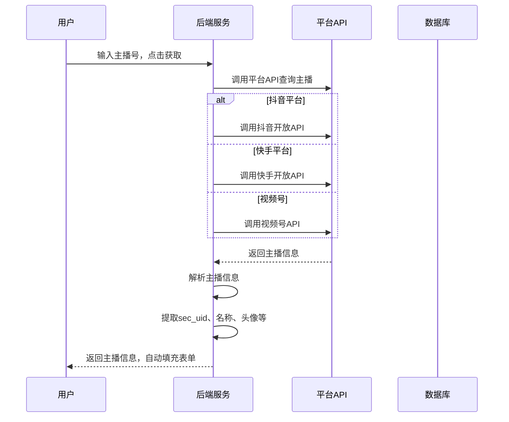

### 5.3 直播间绑定流程

**5.3.1 直播间与员工绑定**

直播间不直接与员工绑定，而是通过排班进行关联。但可以在直播间设置负责人：

```sql
-- 通过manager_connector表设置直播间管理员
INSERT INTO manager_connector (
    employee_id, 
    manager_type, 
    create_date, 
    update_date, 
    is_deleted
) VALUES (
    ?,  -- 员工ID
    4,  -- 管理类型：4=直播间
    NOW(), 
    NOW(), 
    0
);
```

**5.3.2 直播间负责人设置流程**

| 步骤 | 操作 | 输入字段 | 系统处理 |
| :--- | :--- | :--- | :--- |
| 1 | 进入直播间详情 | live_room_id | 加载直播间信息 |
| 2 | 点击设置负责人 | - | 弹出员工选择框 |
| 3 | 选择员工 | employee_id | 加载可用员工列表 |
| 4 | 确认保存 | - | 插入manager_connector表 |
| 5 | 通知员工 | - | 发送系统通知 |

### 5.4 直播间配置管理

**5.4.1 排班配置属性管理**

每个直播间可以配置独立的排班规则，存储在`live_room_schedule_attribute`表中。

| 字段 | 类型 | 说明 | 示例 |
| :--- | :--- | :--- | :--- |
| start_plan | int | 轮班开始时间(HH:mm) | 900 表示 09:00 |
| end_plan | int | 轮班结束时间(HH:mm) | 2300 表示 23:00 |
| shift_options | varchar | 班次时长选项(分钟) | "60,120,180,240" |
| rest_options | varchar | 休息时长选项(分钟) | "10,15,20,30" |
| position_options | varchar | 岗位选项(岗位ID) | "1,2,3,4,5" |

**5.4.2 排班配置操作流程**

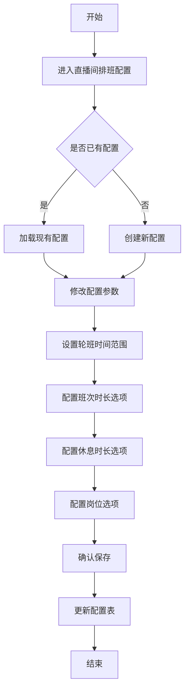

**5.4.3 排班配置详细操作步骤**

| 步骤 | 操作 | 输入字段 | 校验规则 | 系统处理 |
| :--- | :--- | :--- | :--- | :--- |
| 1 | 进入排班配置 | live_room_id | 必须选择有效直播间 | 加载直播间信息 |
| 2 | 设置开始时间 | start_plan | 必填，HH:mm格式 | 转换为整数存储 |
| 3 | 设置结束时间 | end_plan | 必填，HH:mm格式，必须大于开始时间 | 转换为整数存储 |
| 4 | 配置班次时长 | shift_options | 必填，逗号分隔，最多10个 | 校验每个值为正整数 |
| 5 | 配置休息时长 | rest_options | 必填，逗号分隔，最多10个 | 校验每个值为正整数 |
| 6 | 配置岗位选项 | position_options | 必填，逗号分隔，最多10个 | 校验岗位ID存在 |
| 7 | 确认保存 | - | 所有校验通过 | 插入或更新配置表 |

**5.4.4 时间格式转换规则**

```java
// HH:mm 转换为 int 存储
public int timeToInt(String time) {
    String[] parts = time.split(":");
    int hour = Integer.parseInt(parts[0]);
    int minute = Integer.parseInt(parts[1]);
    return hour * 100 + minute;  // 09:30 → 930
}

// int 转换为 HH:mm 展示
public String intToTime(int timeInt) {
    int hour = timeInt / 100;
    int minute = timeInt % 100;
    return String.format("%02d:%02d", hour, minute);  // 930 → 09:30
}
```

---

## 6. 排班管理模块

### 6.1 排班业务模型

**6.1.1 排班核心概念**

| 概念 | 说明 | 关联表 |
| :--- | :--- | :--- |
| 排班日 | 班次归属的日期 | work_schedule.work_day |
| 开始时间 | 班次开始的具体时间 | work_schedule.start_work |
| 结束时间 | 班次结束的具体时间 | work_schedule.end_work |
| 班次时长 | 工作时长（分钟） | work_schedule.schedule_duration |
| 休息时长 | 休息时长（分钟） | work_schedule.rest_duration |
| 直播间 | 排班的工作地点 | work_schedule.live_room_id |
| 员工 | 排班的工作人员 | work_schedule.employee_id |
| 岗位 | 排班的工作岗位 | work_schedule.position_id |

**6.1.2 时间存储格式说明**

```
start_work / end_work 字段格式：月天小时分钟
示例：
- 3月18日 09:30 → 03180930
- 12月25日 23:59 → 12252359

解析方式：
- 月：前2位
- 天：第3-4位
- 小时：第5-6位
- 分钟：第7-8位
```

**6.1.3 排班状态定义**

| 状态 | 说明 | 判断条件 |
| :--- | :--- | :--- |
| 待执行 | 排班日期在未来 | work_day > 当前日期 |
| 进行中 | 排班日期是今天且未结束 | work_day = 今天 && end_work > 当前时间 |
| 已完成 | 排班已结束 | end_work < 当前时间 |
| 已取消 | 排班被取消 | 有取消标记 |

### 6.2 排班配置流程

**6.2.1 单条排班创建流程**

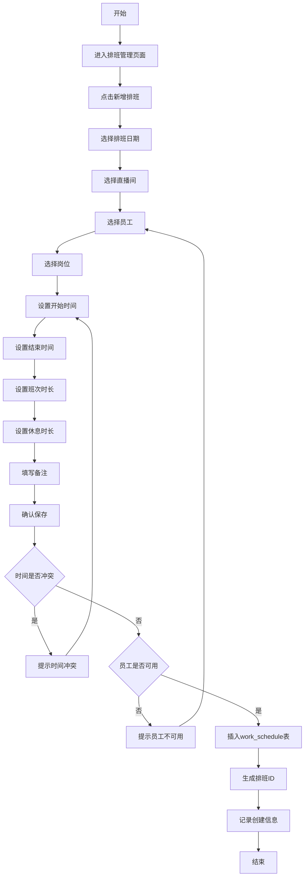

**6.2.2 单条排班创建详细操作步骤**

| 步骤 | 操作 | 输入字段 | 校验规则 | 系统处理 |
| :--- | :--- | :--- | :--- | :--- |
| 1 | 进入排班管理 | - | 检查排班管理权限 | 加载排班列表 |
| 2 | 点击新增 | - | - | 弹出新增表单 |
| 3 | 选择日期 | work_day | 必填，日期格式 | 限制可选日期范围 |
| 4 | 选择直播间 | live_room_id | 必填 | 加载可用直播间 |
| 5 | 选择员工 | employee_id | 必填 | 加载可用员工 |
| 6 | 选择岗位 | position_id | 必填 | 加载岗位列表 |
| 7 | 设置开始时间 | start_work | 必填，HH:mm格式 | 转换为int存储 |
| 8 | 设置结束时间 | end_work | 必填，HH:mm格式，必须大于开始时间 | 转换为int存储 |
| 9 | 设置班次时长 | schedule_duration | 必填，正整数，单位分钟 | 校验合理性 |
| 10 | 设置休息时长 | rest_duration | 必填，正整数，单位分钟 | 校验合理性 |
| 11 | 填写备注 | remark | 可选，0-100字符 | - |
| 12 | 确认保存 | - | 所有校验通过 | 插入work_schedule表 |

**6.2.3 批量排班创建流程**

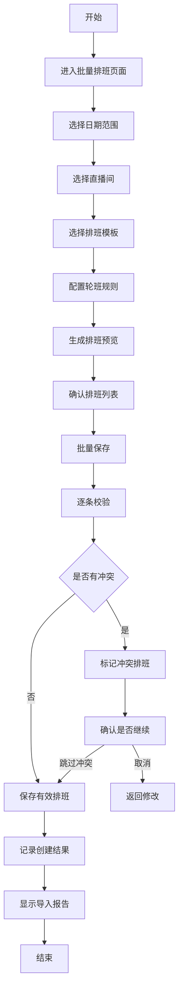

**6.2.4 批量排班详细操作步骤**

| 步骤 | 操作 | 输入字段 | 系统处理 |
| :--- | :--- | :--- | :--- |
| 1 | 进入批量排班 | - | 加载批量排班页面 |
| 2 | 选择日期范围 | start_date, end_date | 限制最大跨度（如31天） |
| 3 | 选择直播间 | live_room_ids | 可多选 |
| 4 | 选择排班模板 | template_id | 加载预设模板 |
| 5 | 配置轮班规则 | 班次时长、休息时长、岗位 | 应用直播间配置或自定义 |
| 6 | 选择员工池 | employee_ids | 可多选，用于轮班 |
| 7 | 生成预览 | - | 根据规则生成排班列表 |
| 8 | 调整排班 | - | 可手动调整生成的排班 |
| 9 | 确认保存 | - | 批量插入work_schedule表 |
| 10 | 显示结果 | - | 显示成功/失败数量 |

### 6.3 智能排班算法

**6.3.1 排班规则引擎**

```
输入：
- 日期范围
- 直播间列表
- 员工池
- 班次配置（时长、休息时长、岗位）
- 约束条件（最大工时、最小间隔等）

输出：
- 排班列表
- 冲突警告
- 覆盖率统计

处理流程：
1. 计算总班次需求
2. 计算员工可用时间
3. 匹配员工与班次
4. 检查约束条件
5. 生成排班结果
```

**6.3.2 排班冲突检测规则**

| 冲突类型 | 检测规则 | 处理方式 |
| :--- | :--- | :--- |
| 员工时间冲突 | 同一员工在同一时间段有多个排班 | 阻止保存或标记警告 |
| 直播间时间冲突 | 同一直播间同一时间段有多个排班 | 允许（多主播场景） |
| 跨天排班 | 结束时间小于开始时间 | 自动计算跨天时长 |
| 超工时 | 员工日工作时长超过配置上限 | 标记警告 |
| 间隔不足 | 两个班次间隔小于配置最小值 | 标记警告 |

**6.3.3 冲突检测SQL实现**

```sql
-- 检测员工时间冲突
SELECT COUNT(*) FROM work_schedule 
WHERE employee_id = ? 
  AND work_day = ?
  AND is_deleted = 0
  AND (
    (start_work <= ? AND end_work > ?)  -- 新班次开始时间在现有班次内
    OR (start_work < ? AND end_work >= ?)  -- 新班次结束时间在现有班次内
    OR (start_work >= ? AND end_work <= ?)  -- 新班次包含现有班次
  );

-- 检测员工日工作时长
SELECT SUM(schedule_duration) as total_duration 
FROM work_schedule 
WHERE employee_id = ? 
  AND work_day = ?
  AND is_deleted = 0;
```

### 6.4 排班调整流程

**6.4.1 排班编辑流程**

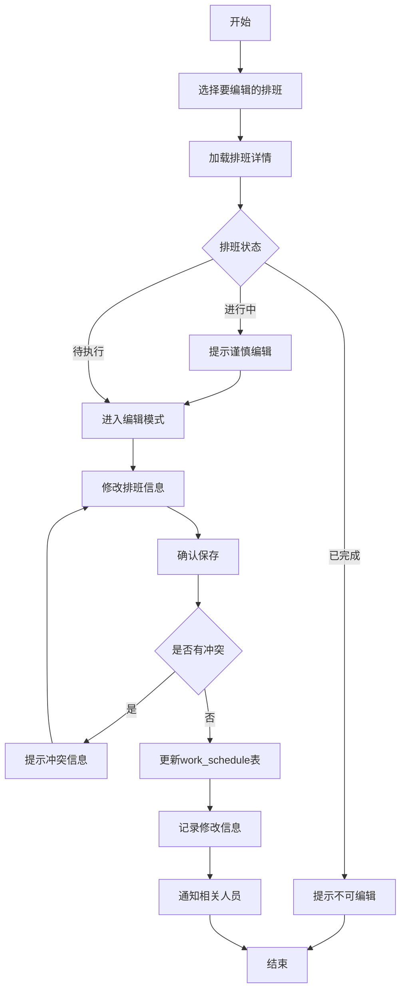

**6.4.2 排班删除流程**

| 步骤 | 操作 | 校验规则 | 系统处理 |
| :--- | :--- | :--- | :--- |
| 1 | 选择排班 | - | 高亮选中排班 |
| 2 | 点击删除 | 检查排班状态 | 已完成的排班需二次确认 |
| 3 | 确认删除 | 二次确认弹窗 | 记录操作日志 |
| 4 | 检查关联 | 检查是否有关联场次 | 有关联则提示先处理 |
| 5 | 执行删除 | - | 设置is_deleted=1 |
| 6 | 清理关联 | - | 删除schedule_session关联 |
| 7 | 通知员工 | - | 发送排班取消通知 |

**6.4.3 排班调班流程**

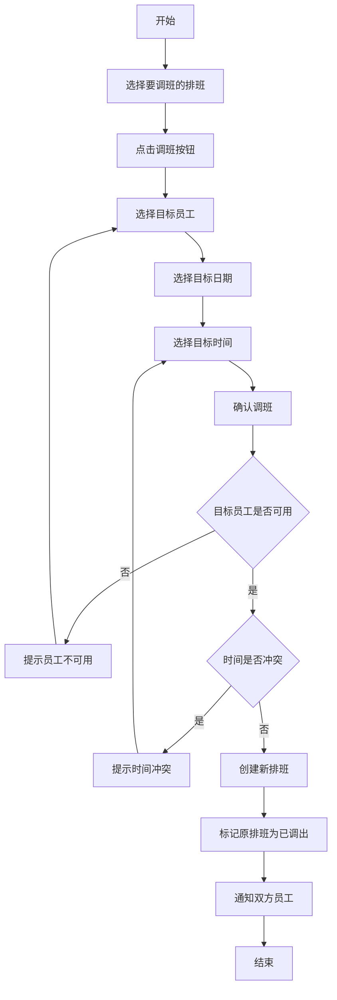

### 6.5 排班冲突检测

**6.5.1 冲突检测时机**

| 时机 | 触发条件 | 检测范围 |
| :--- | :--- | :--- |
| 保存前 | 点击保存按钮时 | 当前排班与所有现有排班 |
| 批量导入 | 上传排班文件时 | 导入排班之间及与现有排班 |
| 定时检查 | 每日凌晨定时任务 | 检测未来7天排班 |
| 实时检测 | 员工排班页面加载时 | 当前员工的所有排班 |

**6.5.2 冲突检测结果处理**

```json
{
  "hasConflict": true,
  "conflicts": [
    {
      "type": "EMPLOYEE_TIME_CONFLICT",
      "employeeId": 1001,
      "employeeName": "张三",
      "conflictScheduleId": 5001,
      "conflictTime": "2026-03-20 09:00-12:00",
      "newScheduleTime": "2026-03-20 10:00-13:00",
      "overlapMinutes": 120
    }
  ],
  "warnings": [
    {
      "type": "OVER_TIME_WARNING",
      "employeeId": 1001,
      "totalDuration": 600,
      "maxAllowed": 480
    }
  ]
}
```

### 6.6 排班通知机制

**6.6.1 通知触发场景**

| 场景 | 通知对象 | 通知内容 | 通知方式 |
| :--- | :--- | :--- | :--- |
| 新增排班 | 被排班员工 | 排班时间、地点、岗位 | 站内信+短信 |
| 排班变更 | 被排班员工 | 变更内容、原排班信息 | 站内信+短信 |
| 排班取消 | 被排班员工 | 取消原因、原排班信息 | 站内信+短信 |
| 调班确认 | 双方员工 | 调班详情 | 站内信 |
| 排班提醒 | 被排班员工 | 开播前提醒（提前1小时） | 站内信+推送 |

**6.6.2 通知发送流程**

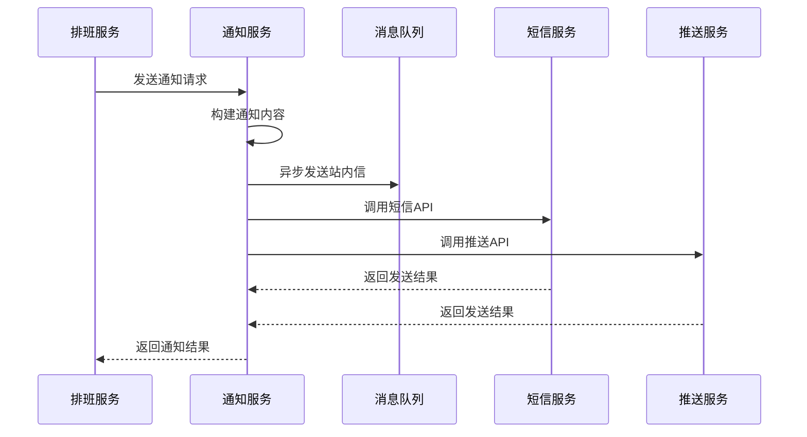

---

## 7. 场次管理模块

### 7.1 场次数据采集

**7.1.1 数据来源说明**

| 数据来源 | 类型 | 采集方式 | 频率 |
| :--- | :--- | :--- | :--- |
| 巨量引擎API | 自动推送 | 平台主动推送 | 实时 |
| 千川API | 自动拉取 | 定时调用API | 每5分钟 |
| 手动录入 | 手动 | 后台录入 | 按需 |

**7.1.2 数据采集字段映射**

```
巨量引擎/千川 API 返回 → live_session 表字段

API字段                     表字段
─────────────────────────────────────────
session_id                 → id (主键)
room_id                    → room_id
start_time                 → start_time
end_time                   → end_time
duration                   → duration
total_view_count           → view_count
start_gmv                  → start_sales
end_gmv                    → end_sales
refund_amount              → refund
ad_cost                    → investment
net_gmv                    → net_sales (计算)
roi                        → roi (计算)
replay_url                 → oss_url
```

### 7.2 场次自动创建流程

**7.2.1 自动创建流程**

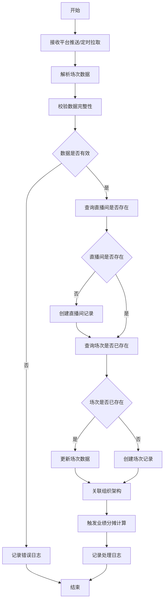

**7.2.2 自动创建详细处理步骤**

| 步骤 | 操作 | 处理逻辑 | 异常处理 |
| :--- | :--- | :--- | :--- |
| 1 | 接收数据 | 解析JSON/XML格式 | 解析失败记录错误日志 |
| 2 | 数据校验 | 检查必填字段 | 缺失字段则丢弃数据 |
| 3 | 直播间匹配 | 根据sec_uid匹配 | 未匹配则创建新直播间 |
| 4 | 场次去重 | 根据session_id判断 | 已存在则更新 |
| 5 | 组织架构关联 | 从直播间继承 | 直播间无组织则使用默认 |
| 6 | 计算衍生字段 | net_sales, roi | 分母为0时设为0 |
| 7 | 持久化存储 | 插入/更新live_session | 事务保证一致性 |
| 8 | 触发后续处理 | 业绩分摊、统计更新 | 异步处理 |

### 7.3 场次手动录入流程

**7.3.1 手动录入操作流程**

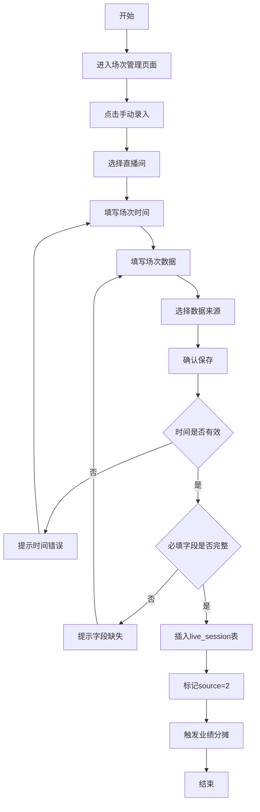

**7.3.2 手动录入字段说明**

| 字段组 | 必填字段 | 可选字段 |
| :--- | :--- | :--- |
| 基础信息 | room_id, start_time, end_time | oss_url |
| 观看数据 | view_count | - |
| 销售数据 | start_sales, end_sales | - |
| 财务数据 | refund, investment | - |
| 衍生数据 | - | net_sales, roi (自动计算) |

### 7.4 场次数据校验

**7.4.1 数据校验规则**

| 校验项 | 规则 | 错误处理 |
| :--- | :--- | :--- |
| 时间有效性 | end_time > start_time | 拒绝保存 |
| 时长合理性 | duration = end_time - start_time (允许±5分钟误差) | 警告提示 |
| 销售额非负 | start_sales >= 0, end_sales >= 0 | 拒绝保存 |
| 退款合理性 | refund <= end_sales | 警告提示 |
| 投放非负 | investment >= 0 | 拒绝保存 |
| ROI计算 | net_sales / investment (investment=0时ROI=0) | 自动计算 |

**7.4.2 数据校验SQL**

```sql
-- 校验场次时长
SELECT 
  TIMESTAMPDIFF(SECOND, start_time, end_time) as actual_duration,
  duration as stored_duration,
  ABS(TIMESTAMPDIFF(SECOND, start_time, end_time) - duration) as diff
FROM live_session 
WHERE id = ?;

-- 校验退款金额
SELECT 
  end_sales, 
  refund,
  CASE WHEN refund > end_sales THEN 'INVALID' ELSE 'VALID' END as status
FROM live_session 
WHERE id = ?;
```

---

## 8. 业绩核算模块

### 8.1 业绩核算模型

**8.1.1 业绩核算层级**

```
场次业绩 (live_session)
    ↓ 分摊
排班-场次关联业绩 (schedule_session)
    ↓ 汇总
人员业绩 (staff_performance)
    ↓ 聚合
每日统计 (daily_stats)
```

**8.1.2 业绩分摊规则**

**规则1：时间重叠分摊**
```
分摊比例 = 排班与场次重叠时长 / 场次总时长

示例：
- 场次时间：10:00-14:00 (4小时)
- 排班时间：10:00-12:00 (2小时)
- 重叠时长：2小时
- 分摊比例：2/4 = 50%

该排班分摊的业绩 = 场次业绩 × 50%
```

**规则2：多排班分摊**
```
当多个排班与同场次重叠时：
- 各排班按重叠时长比例分摊
- 总和可能超过100%（允许重叠排班）
```

**规则3：岗位权重分摊**
```
可配置不同岗位的业绩权重：
- 主播：100%
- 助播：50%
- 场控：30%
- 运营：20%

实际分摊业绩 = 基础分摊业绩 × 岗位权重
```

### 8.2 巨量千川数据采集

**8.2.1 API对接流程**

```mermaid
sequenceDiagram
    participant S as 调度服务
    participant A as 数据采集服务
    participant Q as 千川API
    participant C as 缓存服务
    participant D as 数据库
    
    S->>A: 触发数据采集任务
    A->>C: 获取租户API配置
    C-->>A: 返回access_token等
    A->>Q: 调用场次数据API
    Q-->>A: 返回场次列表
    A->>A: 数据转换与校验
    A->>D: 批量插入/更新live_session
    D-->>A: 返回处理结果
    A->>S: 返回采集结果
```

**8.2.2 API配置管理**

| 配置项 | 说明 | 存储位置 |
| :--- | :--- | :--- |
| app_id | 应用ID | 租户配置表 |
| app_secret | 应用密钥 | 租户配置表（加密） |
| access_token | 访问令牌 | 缓存（定期刷新） |
| refresh_token | 刷新令牌 | 租户配置表（加密） |
| api_rate_limit | API调用限流 | 系统配置 |

**8.2.3 数据采集定时任务**

```java
@Component
public class DataCollectionScheduler {
    
    // 每5分钟采集一次
    @Scheduled(cron = "0 */5 * * * ?")
    public void collectSessionData() {
        // 获取所有活跃租户
        List<Long> tenantIds = tenantService.getActiveTenants();
        
        for (Long tenantId : tenantIds) {
            try {
                // 设置租户上下文
                TenantContext.setTenantId(tenantId);
                
                // 采集千川数据
                qianchuanService.collectSessionData();
                
                // 采集巨量数据
                oceanEngineService.collectSessionData();
                
            } catch (Exception e) {
                log.error("租户{}数据采集失败", tenantId, e);
            } finally {
                TenantContext.clear();
            }
        }
    }
}
```

### 8.3 业绩分摊算法

**8.3.1 分摊计算核心逻辑**

```java
public class PerformanceAllocationService {
    
    /**
     * 计算排班与场次的业绩分摊
     */
    public ScheduleSession calculateAllocation(
        WorkSchedule schedule, 
        LiveSession session
    ) {
        // 1. 计算时间重叠
        TimeOverlap overlap = calculateTimeOverlap(
            schedule.getStartWork(), 
            schedule.getEndWork(),
            session.getStartTime(), 
            session.getEndTime()
        );
        
        if (overlap.getDurationSeconds() <= 0) {
            return null; // 无重叠，不分摊
        }
        
        // 2. 计算分摊比例
        double ratio = (double) overlap.getDurationSeconds() 
                     / session.getDuration();
        
        // 3. 获取岗位权重
        double positionWeight = getPositionWeight(schedule.getPositionId());
        
        // 4. 计算分摊业绩
        ScheduleSession allocation = new ScheduleSession();
        allocation.setDuration(overlap.getDurationSeconds());
        allocation.setViewCount((long) (session.getViewCount() * ratio));
        allocation.setStartSales(session.getStartSales().multiply(BigDecimal.valueOf(ratio)));
        allocation.setEndSales(session.getEndSales().multiply(BigDecimal.valueOf(ratio)));
        allocation.setRefund(session.getRefund().multiply(BigDecimal.valueOf(ratio)));
        allocation.setInvestment(session.getInvestment().multiply(BigDecimal.valueOf(ratio)));
        allocation.setNetSales(allocation.getEndSales().subtract(allocation.getRefund()));
        allocation.setRoi(calculateRoi(allocation.getNetSales(), allocation.getInvestment()));
        allocation.setSource(1); // 自动分摊
        
        return allocation;
    }
    
    /**
     * 计算ROI
     */
    private BigDecimal calculateRoi(BigDecimal netSales, BigDecimal investment) {
        if (investment.compareTo(BigDecimal.ZERO) <= 0) {
            return BigDecimal.ZERO;
        }
        return netSales.divide(investment, 2, RoundingMode.HALF_UP);
    }
}
```

**8.3.2 时间重叠计算**

```java
public class TimeOverlap {
    
    /**
     * 计算两个时间段的重叠
     */
    public static TimeOverlap calculate(
        LocalDateTime start1, LocalDateTime end1,
        LocalDateTime start2, LocalDateTime end2
    ) {
        LocalDateTime overlapStart = start1.isAfter(start2) ? start1 : start2;
        LocalDateTime overlapEnd = end1.isBefore(end2) ? end1 : end2;
        
        long durationSeconds = 0;
        if (overlapStart.isBefore(overlapEnd)) {
            durationSeconds = ChronoUnit.SECONDS.between(overlapStart, overlapEnd);
        }
        
        return new TimeOverlap(overlapStart, overlapEnd, durationSeconds);
    }
}
```

### 8.4 业绩核算流程

**8.4.1 实时核算流程**

```mermaid
flowchart TD
    A[开始] --> B[新场次数据到达]
    B --> C[创建/更新live_session]
    C --> D[查询关联排班]
    D --> E{是否有排班}
    E -->|否 | F[结束]
    E -->|是 | G[遍历每个排班]
    G --> H[计算时间重叠]
    H --> I{是否有重叠}
    I -->|否 | J[跳过该排班]
    I -->|是 | K[计算分摊业绩]
    K --> L[创建schedule_session]
    L --> M[更新staff_performance]
    M --> N{是否还有排班}
    N -->|是 | G
    N -->|否 | O[更新daily_stats]
    O --> P[结束]
```

**8.4.2 定时核算流程**

对于历史数据修正或延迟数据，采用定时任务进行核算：

```java
@Component
public class PerformanceCalculationScheduler {
    
    // 每天凌晨1点执行前一天业绩核算
    @Scheduled(cron = "0 0 1 * * ?")
    public void calculateYesterdayPerformance() {
        LocalDate yesterday = LocalDate.now().minusDays(1);
        
        // 获取昨天的所有场次
        List<LiveSession> sessions = sessionService.getSessionsByDate(yesterday);
        
        for (LiveSession session : sessions) {
            // 执行分摊计算
            allocationService.allocateSessionPerformance(session);
        }
        
        // 更新每日统计
        statsService.updateDailyStats(yesterday);
    }
    
    // 每小时执行一次增量核算
    @Scheduled(cron = "0 0 * * * ?")
    public void calculateIncrementalPerformance() {
        LocalDateTime oneHourAgo = LocalDateTime.now().minusHours(1);
        
        // 获取最近1小时更新的场次
        List<LiveSession> sessions = sessionService.getSessionsUpdatedAfter(oneHourAgo);
        
        for (LiveSession session : sessions) {
            allocationService.allocateSessionPerformance(session);
        }
    }
}
```

### 8.5 业绩修正流程

**8.5.1 修正触发场景**

| 场景 | 说明 | 处理方式 |
| :--- | :--- | :--- |
| 场次数据修正 | 平台数据回调修正 | 重新计算分摊 |
| 排班时间调整 | 排班时间变更 | 重新计算分摊 |
| 排班删除 | 排班被删除 | 删除关联业绩 |
| 手动调整 | 管理员手动修正业绩 | 记录修正日志 |

**8.5.2 业绩修正操作流程**

```mermaid
flowchart TD
    A[开始] --> B[选择要修正的业绩记录]
    B --> C[查看原始数据]
    C --> D{选择修正类型}
    D -->|场次数据修正 | E[重新采集场次数据]
    D -->|排班调整修正 | F[重新计算分摊]
    D -->|手动修正 | G[输入修正值]
    E --> H[重新计算业绩]
    F --> H
    G --> I[记录修正原因]
    H --> J[更新业绩记录]
    I --> J
    J --> K[更新关联统计]
    K --> L[记录操作日志]
    L --> M[结束]
```

**8.5.3 业绩修正权限控制**

| 操作 | 所需权限 | 审批要求 |
| :--- | :--- | :--- |
| 查看业绩 | performance:view | 无 |
| 导出业绩 | performance:export | 无 |
| 修正场次数据 | session:edit | 主管审批 |
| 修正排班 | schedule:edit | 主管审批 |
| 手动修正业绩 | performance:adjust | 经理审批 |

---

## 9. 统计分析模块

### 9.1 统计维度设计

**9.1.1 统计维度层级**

```
统计维度树：
租户 (tenant_id)
└── 公司 (company_id)
    └── 部门 (dept_id)
        └── 小组 (team_id)
            └── 直播间 (room_id)
                └── 场次 (session_id)
```

**9.1.2 统计指标定义**

| 指标 | 字段名 | 计算方式 | 单位 |
| :--- | :--- | :--- | :--- |
| 场观 | view_count | 累计观看人数 | 人 |
| 开始销售额 | start_sales | 场次开始时的累计销售额 | 元 |
| 结束销售额 | end_sales | 场次结束时的累计销售额 | 元 |
| 退款 | refund | 退款金额 | 元 |
| 投放 | investment | 广告投放金额 | 元 |
| 净销售额 | net_sales | end_sales - refund | 元 |
| ROI | roi | net_sales / investment | 比率 |
| 场次数 | session_count | 场次数量 | 个 |
| 总时长 | duration | 累计直播时长 | 秒 |

### 9.2 每日统计流程

**9.2.1 统计生成流程**

```mermaid
flowchart TD
    A[开始] --> B[定时任务触发]
    B --> C[确定统计日期]
    C --> D[遍历所有维度组合]
    D --> E[查询原始数据]
    E --> F[聚合计算指标]
    F --> G[生成统计记录]
    G --> H{是否还有维度}
    H -->|是 | D
    H -->|否 | I[存储到daily_stats]
    I --> J[更新缓存]
    J --> K[结束]
```

**9.2.2 统计维度组合**

每日统计需要生成以下维度组合的数据：

| 维度类型 | dimension值 | 组合说明 |
| :--- | :--- | :--- |
| 场次维度 | 1 | 按场次统计 |
| 排班维度 | 2 | 按排班统计 |
| 全局统计 | company=0,dept=0,team=0,room=0 | 租户整体 |
| 公司统计 | company=X,dept=0,team=0,room=0 | 按公司 |
| 部门统计 | company=X,dept=Y,team=0,room=0 | 按部门 |
| 小组统计 | company=X,dept=Y,team=Z,room=0 | 按小组 |
| 直播间统计 | company=X,dept=Y,team=Z,room=W | 按直播间 |

**9.2.3 统计SQL实现**

```sql
-- 全局统计
INSERT INTO daily_stats (
    tenant_id, stats_date, dimension,
    company_id, dept_id, team_id, room_id,
    view_count, start_sales, end_sales, refund, investment, net_sales, roi,
    session_count, duration
)
SELECT 
    tenant_id, 
    ?,  -- 统计日期
    1,  -- 场次维度
    0, 0, 0, 0,
    SUM(view_count),
    SUM(start_sales),
    SUM(end_sales),
    SUM(refund),
    SUM(investment),
    SUM(end_sales - refund),
    CASE WHEN SUM(investment) > 0 THEN SUM(end_sales - refund) / SUM(investment) ELSE 0 END,
    COUNT(*),
    SUM(duration)
FROM live_session
WHERE DATE(start_time) = ?
  AND is_deleted = 0
GROUP BY tenant_id;

-- 按公司统计
INSERT INTO daily_stats (...)
SELECT 
    tenant_id, ?, 1,
    company_id, 0, 0, 0,
    SUM(view_count), ...
FROM live_session
WHERE DATE(start_time) = ?
  AND is_deleted = 0
GROUP BY tenant_id, company_id;

-- 按部门统计
INSERT INTO daily_stats (...)
SELECT 
    tenant_id, ?, 1,
    company_id, dept_id, 0, 0,
    SUM(view_count), ...
FROM live_session
WHERE DATE(start_time) = ?
  AND is_deleted = 0
GROUP BY tenant_id, company_id, dept_id;
```

### 9.3 排行榜生成流程

**9.3.1 排行榜类型**

| 排行榜类型 | 排序依据 | 统计周期 | 更新频率 |
| :--- | :--- | :--- | :--- |
| 主播业绩榜 | net_sales | 日/周/月 | 每小时 |
| 主播场观榜 | view_count | 日/周/月 | 每小时 |
| 主播ROI榜 | roi | 日/周/月 | 每小时 |
| 直播间业绩榜 | net_sales | 日/周/月 | 每小时 |
| 团队业绩榜 | net_sales | 日/周/月 | 每天 |
| 部门业绩榜 | net_sales | 日/周/月 | 每天 |

**9.3.2 排行榜生成流程**

```mermaid
flowchart TD
    A[开始] --> B[确定排行榜类型]
    B --> C[确定统计周期]
    C --> D[查询业绩数据]
    D --> E[按规则排序]
    E --> F[取前N名]
    F --> G[生成排行榜数据]
    G --> H[存储到缓存]
    H --> I[结束]
```

**9.3.3 排行榜SQL实现**

```sql
-- 主播日业绩排行榜
SELECT 
    e.id as employee_id,
    e.name as employee_name,
    SUM(sp.net_sales) as total_net_sales,
    SUM(sp.view_count) as total_view_count,
    COUNT(sp.id) as session_count,
    RANK() OVER (ORDER BY SUM(sp.net_sales) DESC) as rank
FROM staff_performance sp
JOIN employee e ON sp.user_id = e.id
WHERE sp.stats_date = ?
  AND sp.is_deleted = 0
GROUP BY e.id, e.name
ORDER BY total_net_sales DESC
LIMIT 100;

-- 直播间周业绩排行榜
SELECT 
    lr.id as room_id,
    lr.anchor_name,
    SUM(ls.net_sales) as total_net_sales,
    SUM(ls.view_count) as total_view_count,
    COUNT(ls.id) as session_count,
    RANK() OVER (ORDER BY SUM(ls.net_sales) DESC) as rank
FROM live_session ls
JOIN live_room lr ON ls.room_id = lr.id
WHERE ls.start_time >= ? AND ls.start_time < ?
  AND ls.is_deleted = 0
GROUP BY lr.id, lr.anchor_name
ORDER BY total_net_sales DESC
LIMIT 100;
```

### 9.4 数据报表输出

**9.4.1 报表类型**

| 报表名称 | 维度 | 指标 | 导出格式 |
| :--- | :--- | :--- | :--- |
| 日业绩报表 | 公司/部门/小组 | 场观、销售额、ROI | Excel/PDF |
| 周业绩报表 | 公司/部门/小组 | 场观、销售额、ROI | Excel/PDF |
| 月业绩报表 | 公司/部门/小组 | 场观、销售额、ROI | Excel/PDF |
| 主播业绩明细 | 主播个人 | 场次、业绩、排名 | Excel |
| 直播间明细 | 直播间 | 场次、业绩、趋势 | Excel |
| 排班执行报表 | 排班 | 出勤、业绩 | Excel |

**9.4.2 报表导出流程**

```mermaid
flowchart TD
    A[开始] --> B[用户选择报表类型]
    B --> C[选择时间范围]
    C --> D[选择维度]
    D --> E[点击导出]
    E --> F[生成查询SQL]
    F --> G[执行查询]
    G --> H[数据格式化]
    H --> I[生成文件]
    I --> J[上传至OSS]
    J --> K[返回下载链接]
    K --> L[结束]
```

---

## 10. 商品管理模块

### 10.1 商品数据模型

**10.1.1 商品表结构说明**

| 字段 | 类型 | 说明 | 校验规则 |
| :--- | :--- | :--- | :--- |
| name | varchar(200) | 商品名称 | 必填，1-200字符 |
| price | decimal(10,2) | 单价 | 必填，>=0 |

**10.1.2 场次商品关联表说明**

| 字段 | 类型 | 说明 | 计算方式 |
| :--- | :--- | :--- | :--- |
| quantity | int | 销量 | 从平台API获取 |
| sales_amount | decimal(10,2) | 销售额 | quantity × price |
| exposure_conversion_rate | decimal(5,2) | 曝光成交率 | 从平台API获取 |
| gpm | decimal(10,2) | 千次观看成交额 | sales_amount / view_count × 1000 |
| refund_quantity | int | 退单量 | 从平台API获取 |
| refund_amount | decimal(10,2) | 退款额 | 从平台API获取 |
| refund_rate | decimal(5,2) | 退款率 | refund_quantity / quantity × 100 |
| click_payment_rate | decimal(5,2) | 点击付款率 | 从平台API获取 |

### 10.2 商品关联流程

**10.2.1 商品关联操作流程**

```mermaid
flowchart TD
    A[开始] --> B[进入场次详情页]
    B --> C[查看商品列表]
    C --> D{商品是否已同步}
    D -->|否 | E[从平台同步商品]
    D -->|是 | F[刷新商品数据]
    E --> G[解析商品数据]
    G --> H[创建product记录]
    H --> I[创建session_product记录]
    F --> I
    I --> J[计算衍生指标]
    J --> K[更新缓存]
    K --> L[结束]
```

### 10.3 商品统计流程

**10.3.1 商品统计指标**

| 指标 | 计算方式 | 说明 |
| :--- | :--- | :--- |
| 总销量 | SUM(quantity) | 所有场次累计销量 |
| 总销售额 | SUM(sales_amount) | 所有场次累计销售额 |
| 平均成交价 | SUM(sales_amount) / SUM(quantity) | 加权平均 |
| 总退款率 | SUM(refund_quantity) / SUM(quantity) | 累计退款率 |
| 爆品指数 | 销量 × 转化率 × (1-退款率) | 综合评估指标 |

---

## 11. 数据库设计详解

### 11.1 完整ER图

```mermaid
erDiagram
    TENANT ||--o{ SUB_COMPANY : "1:N"
    SUB_COMPANY ||--o{ DEPT : "1:N"
    DEPT ||--o{ TEAM : "1:N"
    
    TENANT ||--o{ ROLE : "1:N"
    TENANT ||--o{ POSITION : "1:N"
    
    MENU ||--o{ MENU_ROLE : "1:N"
    ROLE ||--o{ MENU_ROLE : "1:N"
    ROLE ||--o{ USER_ROLE : "1:N"
    
    SUB_COMPANY ||--o{ EMPLOYEE : "1:N"
    DEPT ||--o{ EMPLOYEE : "1:N"
    TEAM ||--o{ EMPLOYEE : "1:N"
    POSITION ||--o{ EMPLOYEE : "1:N"
    
    EMPLOYEE ||--o{ USER_ROLE : "1:N"
    EMPLOYEE ||--o{ MANAGER_CONNECTOR : "1:N"
    
    SUB_COMPANY ||--o{ LIVE_ROOM : "1:N"
    DEPT ||--o{ LIVE_ROOM : "1:N"
    TEAM ||--o{ LIVE_ROOM : "1:N"
    
    LIVE_ROOM ||--o{ LIVE_ROOM_SCHEDULE_ATTRIBUTE : "1:1"
    LIVE_ROOM ||--o{ WORK_SCHEDULE : "1:N"
    LIVE_ROOM ||--o{ LIVE_SESSION : "1:N"
    
    EMPLOYEE ||--o{ WORK_SCHEDULE : "1:N"
    POSITION ||--o{ WORK_SCHEDULE : "1:N"
    
    LIVE_SESSION ||--o{ SCHEDULE_SESSION : "1:N"
    WORK_SCHEDULE ||--o{ SCHEDULE_SESSION : "1:N"
    
    EMPLOYEE ||--o{ STAFF_PERFORMANCE : "1:N"
    WORK_SCHEDULE ||--o{ STAFF_PERFORMANCE : "1:N"
    
    LIVE_SESSION ||--o{ LIVE_VIDEO : "1:N"
    LIVE_SESSION ||--o{ SESSION_PRODUCT : "1:N"
    PRODUCT ||--o{ SESSION_PRODUCT : "1:N"
    
    TENANT {
        bigint id PK
    }
    
    SUB_COMPANY {
        bigint id PK
        bigint tenant_id FK
        varchar name
        int sort
        datetime create_date
        datetime update_date
        bigint create_by
        bigint update_by
        tinyint is_deleted
    }
    
    DEPT {
        bigint id PK
        bigint tenant_id FK
        varchar name
        bigint company_id FK
        int sort
        datetime create_date
        datetime update_date
        bigint create_by
        bigint update_by
        tinyint is_deleted
    }
    
    TEAM {
        bigint id PK
        bigint tenant_id FK
        varchar name
        bigint dept_id FK
        int sort
        datetime create_date
        datetime update_date
        bigint create_by
        bigint update_by
        tinyint is_deleted
    }
    
    POSITION {
        bigint id PK
        bigint tenant_id FK
        varchar name
        varchar position_code
        int sort
        tinyint is_default
        datetime create_date
        datetime update_date
        bigint create_by
        bigint update_by
        tinyint is_deleted
    }
    
    ROLE {
        bigint id PK
        bigint tenant_id FK
        varchar name
        tinyint is_default
        datetime create_date
        datetime update_date
        tinyint is_deleted
    }
    
    MENU {
        bigint id PK
        bigint parent_id
        varchar name
        varchar url
        tinyint type
        int sort
        varchar img
        varchar permission_code
        datetime create_date
        datetime update_date
        tinyint is_deleted
    }
    
    MENU_ROLE {
        bigint id PK
        bigint role_id FK
        bigint menu_id FK
        datetime create_date
        datetime update_date
        tinyint is_deleted
    }
    
    USER_ROLE {
        bigint id PK
        bigint user_id FK
        bigint role_id FK
        datetime create_date
        datetime update_date
        tinyint is_deleted
    }
    
    EMPLOYEE {
        bigint id PK
        bigint tenant_id FK
        varchar name
        varchar staff_number
        varchar mobile
        varchar email
        varchar user_avatar
        bigint company_id FK
        bigint dept_id FK
        bigint team_id FK
        bigint position_id FK
        tinyint on_rec
        bigint connector_client_user_id
        datetime create_date
        datetime update_date
        bigint create_by
        bigint update_by
        tinyint is_deleted
    }
    
    MANAGER_CONNECTOR {
        bigint id PK
        int manager_type
        bigint employee_id FK
        datetime create_date
        datetime update_date
        tinyint is_deleted
    }
    
    LIVE_ROOM {
        bigint id PK
        bigint tenant_id FK
        varchar sec_uid
        varchar home_url
        varchar live_url
        varchar anchor_name
        date debut_date
        varchar anchor_avatar
        tinyint platform
        varchar anchor_number
        bigint trade_id
        bigint company_id FK
        bigint dept_id FK
        bigint team_id FK
        datetime create_date
        datetime update_date
        bigint create_by
        bigint update_by
        tinyint is_deleted
    }
    
    LIVE_ROOM_SCHEDULE_ATTRIBUTE {
        bigint id PK "FK to LIVE_ROOM"
        int start_plan
        int end_plan
        varchar shift_options
        varchar rest_options
        varchar position_options
        datetime create_date
        datetime update_date
        bigint create_by
        bigint update_by
    }
    
    WORK_SCHEDULE {
        bigint id PK
        bigint tenant_id FK
        date work_day
        int start_work
        int end_work
        bigint live_room_id FK
        bigint employee_id FK
        bigint position_id FK
        varchar remark
        int schedule_duration
        int rest_duration
        datetime create_date
        datetime update_date
        bigint create_by
        bigint update_by
        tinyint is_deleted
    }
    
    LIVE_SESSION {
        bigint id PK
        bigint tenant_id FK
        bigint room_id FK
        datetime start_time
        datetime end_time
        int duration
        bigint view_count
        decimal start_sales
        decimal end_sales
        decimal refund
        decimal investment
        decimal net_sales
        decimal roi
        varchar oss_url
        bigint company_id FK
        bigint dept_id FK
        bigint team_id FK
        tinyint source
        datetime create_date
        datetime update_date
        bigint create_by
        bigint update_by
        tinyint is_deleted
    }
    
    SCHEDULE_SESSION {
        bigint id PK
        bigint tenant_id FK
        bigint schedule_id FK
        bigint session_id FK
        bigint view_count
        decimal start_sales
        decimal end_sales
        decimal refund
        decimal investment
        decimal net_sales
        decimal roi
        int duration
        tinyint source
        bigint company_id FK
        bigint dept_id FK
        bigint team_id FK
        datetime create_date
        datetime update_date
        bigint create_by
        bigint update_by
        tinyint is_deleted
    }
    
    STAFF_PERFORMANCE {
        bigint id PK
        bigint tenant_id FK
        bigint user_id FK
        bigint schedule_id FK
        date stats_date
        bigint view_count
        decimal start_sales
        decimal end_sales
        decimal refund
        decimal investment
        decimal net_sales
        decimal roi
        bigint company_id FK
        bigint dept_id FK
        bigint team_id FK
        datetime create_date
        datetime update_date
        bigint create_by
        bigint update_by
        tinyint is_deleted
    }
    
    DAILY_STATS {
        bigint id PK
        bigint tenant_id FK
        date stats_date
        tinyint dimension
        bigint company_id FK
        bigint dept_id FK
        bigint team_id FK
        bigint room_id FK
        bigint view_count
        decimal start_sales
        decimal end_sales
        decimal refund
        decimal investment
        decimal net_sales
        decimal roi
        int session_count
        bigint duration
        datetime create_date
        datetime update_date
        bigint create_by
        bigint update_by
        tinyint is_deleted
    }
    
    PRODUCT {
        bigint id PK
        bigint tenant_id FK
        varchar name
        decimal price
        datetime create_date
        datetime update_date
        bigint create_by
        bigint update_by
        tinyint is_deleted
    }
    
    SESSION_PRODUCT {
        bigint id PK
        bigint tenant_id FK
        bigint session_id FK
        bigint product_id FK
        int quantity
        decimal sales_amount
        decimal exposure_conversion_rate
        decimal gpm
        int refund_quantity
        decimal refund_amount
        decimal refund_rate
        decimal click_payment_rate
        bigint company_id FK
        bigint dept_id FK
        bigint team_id FK
        datetime create_date
        datetime update_date
        bigint create_by
        bigint update_by
        tinyint is_deleted
    }
    
    LIVE_VIDEO {
        bigint id PK
        bigint tenant_id FK
        varchar video_id
        bigint session_id FK
        varchar video_oss_url
        datetime start_time
        datetime end_time
        bigint start_cumulative_view
        bigint end_cumulative_view
        decimal start_cumulative_sales
        decimal end_cumulative_sales
        decimal start_cumulative_refund
        decimal end_cumulative_refund
        decimal investment
        varchar anchor_sec_uid
        tinyint process_status
        datetime process_time
        varchar fail_reason
        datetime create_date
        datetime update_date
        bigint create_by
        bigint update_by
        tinyint is_deleted
    }
```

### 11.2 表结构详细说明

#### 11.2.1 menu 菜单表

```sql
CREATE TABLE `menu` (
  `id` bigint(20) NOT NULL COMMENT 'ID',
  `parent_id` bigint(20) NOT NULL DEFAULT '0' COMMENT '父菜单id',
  `name` varchar(50) NOT NULL COMMENT '菜单名',
  `url` varchar(100) DEFAULT NULL COMMENT '菜单url',
  `type` tinyint(4) NOT NULL COMMENT '0：菜单  1：功能 2：目录',
  `sort` int(11) NOT NULL COMMENT '排序',
  `img` varchar(100) CHARACTER SET utf8mb4 COLLATE utf8mb4_unicode_ci DEFAULT NULL COMMENT '图标',
  `create_date` datetime NOT NULL COMMENT '创建时间',
  `update_date` datetime NOT NULL COMMENT '最后修改时间',
  `permission_code` varchar(50) NOT NULL DEFAULT '' COMMENT '权限码',
  `is_deleted` tinyint(4) NOT NULL DEFAULT '0' COMMENT '是否已删除',
  PRIMARY KEY (`id`),
  KEY `idx_menu_parent_id` (`parent_id`),
  KEY `idx_menu_type_sort` (`type`, `sort`)
) ENGINE=InnoDB DEFAULT CHARSET=utf8mb4 COLLATE=utf8mb4_unicode_ci ROW_FORMAT=DYNAMIC COMMENT='菜单';
```

**字段详细说明**：

| 字段名 | 数据类型 | 必填 | 默认值 | 说明 |
| :--- | :--- | :--- | :--- | :--- |
| id | bigint(20) | 是 | - | 主键，自增或雪花算法生成 |
| parent_id | bigint(20) | 是 | 0 | 父菜单ID，0表示根节点 |
| name | varchar(50) | 是 | - | 菜单显示名称 |
| url | varchar(100) | 否 | NULL | 菜单跳转URL，功能类型可为空 |
| type | tinyint(4) | 是 | - | 0:菜单 1:功能 2:目录 |
| sort | int(11) | 是 | - | 排序值，越小越靠前 |
| img | varchar(100) | 否 | NULL | 菜单图标URL |
| create_date | datetime | 是 | - | 创建时间 |
| update_date | datetime | 是 | - | 最后更新时间 |
| permission_code | varchar(50) | 是 | '' | 权限码，功能类型必填 |
| is_deleted | tinyint(4) | 是 | 0 | 0:未删除 1:已删除 |

**索引说明**：
- `PRIMARY KEY (id)`: 主键索引
- `idx_menu_parent_id (parent_id)`: 查询子菜单时使用
- `idx_menu_type_sort (type, sort)`: 按类型和排序查询时使用

---

#### 11.2.2 menu_role 菜单-角色关联表

```sql
CREATE TABLE `menu_role` (
  `id` bigint(20) NOT NULL COMMENT 'ID',
  `role_id` bigint(20) NOT NULL COMMENT '关联的角色id',
  `menu_id` bigint(20) NOT NULL COMMENT '关联的菜单id',
  `create_date` datetime NOT NULL COMMENT '创建时间',
  `update_date` datetime NOT NULL COMMENT '最后修改时间',
  `is_deleted` tinyint(4) NOT NULL DEFAULT '0' COMMENT '是否已删除',
  PRIMARY KEY (`id`),
  KEY `idx_menu_role_id` (`role_id`)
) ENGINE=InnoDB DEFAULT CHARSET=utf8mb4 COLLATE=utf8mb4_unicode_ci ROW_FORMAT=DYNAMIC COMMENT='菜单-角色-中间表';
```

**字段详细说明**：

| 字段名 | 数据类型 | 必填 | 默认值 | 说明 |
| :--- | :--- | :--- | :--- | :--- |
| id | bigint(20) | 是 | - | 主键 |
| role_id | bigint(20) | 是 | - | 角色ID |
| menu_id | bigint(20) | 是 | - | 菜单ID |
| create_date | datetime | 是 | - | 创建时间 |
| update_date | datetime | 是 | - | 最后更新时间 |
| is_deleted | tinyint(4) | 是 | 0 | 0:未删除 1:已删除 |

**唯一约束**：
```sql
ALTER TABLE `menu_role` ADD UNIQUE KEY `uk_role_menu` (`role_id`, `menu_id`, `is_deleted`);
```

---

#### 11.2.3 role 角色表

```sql
CREATE TABLE `role` (
  `id` bigint(20) NOT NULL COMMENT 'ID',
  `tenant_id` bigint(20) NOT NULL COMMENT '租户ID',
  `name` varchar(100) NOT NULL COMMENT '角色名',
  `create_date` datetime NOT NULL COMMENT '创建时间',
  `update_date` datetime NOT NULL COMMENT '最后修改时间',
  `is_deleted` tinyint(1) NOT NULL DEFAULT '0' COMMENT '是否已删除',
  `is_default` tinyint(1) NOT NULL DEFAULT '0' COMMENT '是否默认角色',
  PRIMARY KEY (`id`),
  KEY `idx_role_tenant_id` (`tenant_id`, `is_deleted`)
) ENGINE=InnoDB DEFAULT CHARSET=utf8mb4 COLLATE=utf8mb4_unicode_ci ROW_FORMAT=DYNAMIC COMMENT='角色';
```

**字段详细说明**：

| 字段名 | 数据类型 | 必填 | 默认值 | 说明 |
| :--- | :--- | :--- | :--- | :--- |
| id | bigint(20) | 是 | - | 主键 |
| tenant_id | bigint(20) | 是 | - | 租户ID，数据隔离关键字段 |
| name | varchar(100) | 是 | - | 角色名称，租户内唯一 |
| create_date | datetime | 是 | - | 创建时间 |
| update_date | datetime | 是 | - | 最后更新时间 |
| is_deleted | tinyint(1) | 是 | 0 | 0:未删除 1:已删除 |
| is_default | tinyint(1) | 是 | 0 | 0:非默认 1:默认角色 |

**唯一约束**：
```sql
-- 租户内角色名称唯一
ALTER TABLE `role` ADD UNIQUE KEY `uk_tenant_name` (`tenant_id`, `name`, `is_deleted`);
-- 租户内默认角色唯一
ALTER TABLE `role` ADD UNIQUE KEY `uk_tenant_default` (`tenant_id`, `is_default`, `is_deleted`) WHERE is_default = 1;
```

---

#### 11.2.4 user_role 用户-角色关联表

```sql
CREATE TABLE `user_role` (
  `id` bigint(20) NOT NULL COMMENT 'ID',
  `user_id` bigint(20) NOT NULL COMMENT '用户id',
  `role_id` bigint(20) NOT NULL COMMENT '角色id',
  `create_date` datetime NOT NULL COMMENT '创建时间',
  `update_date` datetime NOT NULL COMMENT '最后修改时间',
  `is_deleted` tinyint(4) NOT NULL DEFAULT '0' COMMENT '是否已删除',
  PRIMARY KEY (`id`),
  KEY `user_id_index` (`user_id`, `is_deleted`)
) ENGINE=InnoDB DEFAULT CHARSET=utf8mb4 COLLATE=utf8mb4_unicode_ci ROW_FORMAT=DYNAMIC COMMENT='用户-角色关联表';
```

**字段详细说明**：

| 字段名 | 数据类型 | 必填 | 默认值 | 说明 |
| :--- | :--- | :--- | :--- | :--- |
| id | bigint(20) | 是 | - | 主键 |
| user_id | bigint(20) | 是 | - | 用户ID（对应employee.id） |
| role_id | bigint(20) | 是 | - | 角色ID |
| create_date | datetime | 是 | - | 创建时间 |
| update_date | datetime | 是 | - | 最后更新时间 |
| is_deleted | tinyint(4) | 是 | 0 | 0:未删除 1:已删除 |

**唯一约束**：
```sql
ALTER TABLE `user_role` ADD UNIQUE KEY `uk_user_role` (`user_id`, `role_id`, `is_deleted`);
```

---

#### 11.2.5 position 岗位表

```sql
create table `position` (
  `id` bigint(20) NOT NULL COMMENT 'ID',
  `tenant_id` bigint(20) NOT NULL COMMENT '租户ID',
  `name` varchar(100) NOT NULL COMMENT '岗位名称',
  `create_date` datetime NOT NULL COMMENT '创建时间',
  `update_date` datetime NOT NULL COMMENT '最后修改时间',
  `create_by` bigint(20) NOT NULL COMMENT '创建人',
  `update_by` bigint(20) NOT NULL COMMENT '修改人',
  `sort` int(10) not null comment '排序',
  `is_deleted` tinyint(1) NOT NULL DEFAULT '0' COMMENT '是否已删除',
  `is_default` tinyint(1) NOT NULL DEFAULT '0' COMMENT '是否默认岗位',
  `position_code` varchar(30) default null comment '岗位code，默认岗位才有的编码，用于系统业务中通过枚举查询岗位',
  PRIMARY KEY (`id`),
  KEY `idx_position_tenant_name` (`tenant_id`, `is_deleted`, `name`)
) ENGINE=InnoDB DEFAULT CHARSET=utf8mb4 COLLATE=utf8mb4_unicode_ci ROW_FORMAT=DYNAMIC COMMENT='岗位';
```

**字段详细说明**：

| 字段名 | 数据类型 | 必填 | 默认值 | 说明 |
| :--- | :--- | :--- | :--- | :--- |
| id | bigint(20) | 是 | - | 主键 |
| tenant_id | bigint(20) | 是 | - | 租户ID |
| name | varchar(100) | 是 | - | 岗位名称 |
| create_date | datetime | 是 | - | 创建时间 |
| update_date | datetime | 是 | - | 最后更新时间 |
| create_by | bigint(20) | 是 | - | 创建人ID |
| update_by | bigint(20) | 是 | - | 修改人ID |
| sort | int(10) | 是 | - | 排序值 |
| is_deleted | tinyint(1) | 是 | 0 | 删除标记 |
| is_default | tinyint(1) | 是 | 0 | 是否默认岗位 |
| position_code | varchar(30) | 否 | NULL | 岗位编码，默认岗位专用 |

**唯一约束**：
```sql
ALTER TABLE `position` ADD UNIQUE KEY `uk_tenant_name` (`tenant_id`, `name`, `is_deleted`);
ALTER TABLE `position` ADD UNIQUE KEY `uk_position_code` (`tenant_id`, `position_code`, `is_deleted`);
```

---

#### 11.2.6 sub_company 子公司表

```sql
create table `sub_company` (
  `id` bigint(20) NOT NULL COMMENT 'ID',
  `tenant_id` bigint(20) NOT NULL COMMENT '租户ID',
  `name` varchar(50) NOT NULL COMMENT '公司名称',
  `create_date` datetime NOT NULL COMMENT '创建时间',
  `update_date` datetime NOT NULL COMMENT '最后修改时间',
  `create_by` bigint(20) NOT NULL COMMENT '创建人',
  `update_by` bigint(20) NOT NULL COMMENT '修改人',
  `sort` int(10) not null comment '排序',  
  `is_deleted` tinyint(1) NOT NULL DEFAULT '0' COMMENT '是否已删除',
  PRIMARY KEY (`id`),
  KEY `idx_sub_company_tenant_name` (`tenant_id`, `is_deleted`,`name`)
) ENGINE=InnoDB DEFAULT CHARSET=utf8mb4 COLLATE=utf8mb4_unicode_ci ROW_FORMAT=DYNAMIC COMMENT='子公司';
```

**字段详细说明**：

| 字段名 | 数据类型 | 必填 | 默认值 | 说明 |
| :--- | :--- | :--- | :--- | :--- |
| id | bigint(20) | 是 | - | 主键 |
| tenant_id | bigint(20) | 是 | - | 租户ID |
| name | varchar(50) | 是 | - | 公司名称 |
| create_date | datetime | 是 | - | 创建时间 |
| update_date | datetime | 是 | - | 最后更新时间 |
| create_by | bigint(20) | 是 | - | 创建人ID |
| update_by | bigint(20) | 是 | - | 修改人ID |
| sort | int(10) | 是 | - | 排序值 |
| is_deleted | tinyint(1) | 是 | 0 | 删除标记 |

---

#### 11.2.7 dept 部门表

```sql
create table `dept` (
  `id` bigint(20) NOT NULL COMMENT 'ID',
  `tenant_id` bigint(20) NOT NULL COMMENT '租户ID',
  `name` varchar(40) NOT NULL COMMENT '部门名称',
  `company_id` bigint(20) NOT NULL COMMENT '所属公司ID',
  `create_date` datetime NOT NULL COMMENT '创建时间',
  `update_date` datetime NOT NULL COMMENT '最后修改时间',
  `create_by` bigint(20) NOT NULL COMMENT '创建人',
  `update_by` bigint(20) NOT NULL COMMENT '修改人',
  `sort` int(10) not null comment '排序',  
  `is_deleted` tinyint(1) NOT NULL DEFAULT '0' COMMENT '是否已删除',
  PRIMARY KEY (`id`),
  KEY `idx_dept_tenant_name` (`tenant_id`, `is_deleted`,`name`),
  KEY `idx_dept_company_id` (`company_id`)
) ENGINE=InnoDB DEFAULT CHARSET=utf8mb4 COLLATE=utf8mb4_unicode_ci ROW_FORMAT=DYNAMIC COMMENT='部门';
```

**字段详细说明**：

| 字段名 | 数据类型 | 必填 | 默认值 | 说明 |
| :--- | :--- | :--- | :--- | :--- |
| id | bigint(20) | 是 | - | 主键 |
| tenant_id | bigint(20) | 是 | - | 租户ID |
| name | varchar(40) | 是 | - | 部门名称 |
| company_id | bigint(20) | 是 | - | 所属子公司ID |
| create_date | datetime | 是 | - | 创建时间 |
| update_date | datetime | 是 | - | 最后更新时间 |
| create_by | bigint(20) | 是 | - | 创建人ID |
| update_by | bigint(20) | 是 | - | 修改人ID |
| sort | int(10) | 是 | - | 排序值 |
| is_deleted | tinyint(1) | 是 | 0 | 删除标记 |

---

#### 11.2.8 team 小组表

```sql
create table `team` (
  `id` bigint(20) NOT NULL COMMENT 'ID',
  `tenant_id` bigint(20) NOT NULL COMMENT '租户ID',
  `name` varchar(30) NOT NULL COMMENT '小组名称',
  `dept_id` bigint(20) NOT NULL COMMENT '所属部门ID',
  `create_date` datetime NOT NULL COMMENT '创建时间',
  `update_date` datetime NOT NULL COMMENT '最后修改时间',
  `create_by` bigint(20) NOT NULL COMMENT '创建人',
  `update_by` bigint(20) NOT NULL COMMENT '修改人',
  `sort` int(10) not null comment '排序',  
  `is_deleted` tinyint(1) NOT NULL DEFAULT '0' COMMENT '是否已删除',
  PRIMARY KEY (`id`),
  KEY `idx_team_tenant_name` (`tenant_id`, `is_deleted`,`name`),
  KEY `idx_team_dept_id` (`dept_id`)
) ENGINE=InnoDB DEFAULT CHARSET=utf8mb4 COLLATE=utf8mb4_unicode_ci ROW_FORMAT=DYNAMIC COMMENT='小组';
```

**字段详细说明**：

| 字段名 | 数据类型 | 必填 | 默认值 | 说明 |
| :--- | :--- | :--- | :--- | :--- |
| id | bigint(20) | 是 | - | 主键 |
| tenant_id | bigint(20) | 是 | - | 租户ID |
| name | varchar(30) | 是 | - | 小组名称 |
| dept_id | bigint(20) | 是 | - | 所属部门ID |
| create_date | datetime | 是 | - | 创建时间 |
| update_date | datetime | 是 | - | 最后更新时间 |
| create_by | bigint(20) | 是 | - | 创建人ID |
| update_by | bigint(20) | 是 | - | 修改人ID |
| sort | int(10) | 是 | - | 排序值 |
| is_deleted | tinyint(1) | 是 | 0 | 删除标记 |

---

#### 11.2.9 manager_connector 管理员连接表

```sql
create table `manager_connector` (
  `id` bigint(20) NOT NULL COMMENT 'ID',
  `create_date` datetime NOT NULL COMMENT '创建时间',
  `update_date` datetime NOT NULL COMMENT '最后修改时间',
  `is_deleted` tinyint(1) NOT NULL DEFAULT '0' COMMENT '是否已删除',
  `manager_type` int(10) not null comment '管理类型，1公司，2部门，3小组，4直播间',
  `employee_id` bigint(20) not null comment '员工ID',
  PRIMARY KEY (`id`),
  KEY `idx_manager_connector_employee_id`(`employee_id`, `manager_type`)
) ENGINE=InnoDB DEFAULT CHARSET=utf8mb4 COLLATE=utf8mb4_unicode_ci ROW_FORMAT=DYNAMIC COMMENT='管理员连接';
```

**字段详细说明**：

| 字段名 | 数据类型 | 必填 | 默认值 | 说明 |
| :--- | :--- | :--- | :--- | :--- |
| id | bigint(20) | 是 | - | 主键 |
| create_date | datetime | 是 | - | 创建时间 |
| update_date | datetime | 是 | - | 最后更新时间 |
| is_deleted | tinyint(1) | 是 | 0 | 删除标记 |
| manager_type | int(10) | 是 | - | 1:公司 2:部门 3:小组 4:直播间 |
| employee_id | bigint(20) | 是 | - | 管理员员工ID |

**注意**：此表设计需要补充管理对象ID字段，建议修改为：
```sql
ALTER TABLE `manager_connector` 
ADD COLUMN `target_id` bigint(20) NOT NULL COMMENT '管理目标ID（公司/部门/小组/直播间ID）' AFTER `manager_type`,
ADD KEY `idx_manager_connector_target` (`manager_type`, `target_id`);
```

---

#### 11.2.10 employee 员工表

```sql
create table `employee` (
  `id` bigint(20) NOT NULL COMMENT 'ID',
  `create_date` datetime NOT NULL COMMENT '创建时间',
  `update_date` datetime NOT NULL COMMENT '最后修改时间',
  `create_by` bigint(20) NOT NULL COMMENT '创建人',
  `update_by` bigint(20) NOT NULL COMMENT '修改人',
  `is_deleted` tinyint(1) NOT NULL DEFAULT '0' COMMENT '是否已删除',
  `tenant_id` bigint(20) NOT NULL COMMENT '租户ID',
  `name` varchar(20) NOT NULL COMMENT '员工名称',  
  `user_avatar` varchar(300) not null default '' comment '头像',
  `staff_number` varchar(10) not null default '' comment '工号',
  `mobile` varchar(20) NOT NULL COMMENT '手机号码',  
  `email` varchar(40) NOT NULL default '' COMMENT '邮箱',  
  `company_id` bigint(20) NOT NULL COMMENT '所属公司ID',
  `dept_id` bigint(20) NOT NULL COMMENT '所属部门ID',
  `team_id` bigint(20) NOT NULL default 0 COMMENT '所属小组ID',
  `position_id` bigint(20) NOT NULL default 0 COMMENT '所属岗位ID',
  `on_rec` tinyint(1) not null default 0 comment '开启录制权限',
  `connector_client_user_id` bigint(20) not null default 0 comment '关联客户端账户ID',
  PRIMARY KEY (`id`),
  KEY `idx_tenant_employee_staff_number`(`tenant_id`, `is_deleted`,`staff_number`),
  KEY `idx_employee_mobile`(`mobile`),
  KEY `idx_employee_dept_id`(`dept_id`),
  KEY `idx_employee_team_id`(`team_id`),
  key `idx_employee_position_id`(`position_id`)
) ENGINE=InnoDB DEFAULT CHARSET=utf8mb4 COLLATE=utf8mb4_unicode_ci ROW_FORMAT=DYNAMIC COMMENT='人员';
```

**字段详细说明**：

| 字段名 | 数据类型 | 必填 | 默认值 | 说明 |
| :--- | :--- | :--- | :--- | :--- |
| id | bigint(20) | 是 | - | 主键 |
| create_date | datetime | 是 | - | 创建时间 |
| update_date | datetime | 是 | - | 最后更新时间 |
| create_by | bigint(20) | 是 | - | 创建人ID |
| update_by | bigint(20) | 是 | - | 修改人ID |
| is_deleted | tinyint(1) | 是 | 0 | 删除标记 |
| tenant_id | bigint(20) | 是 | - | 租户ID |
| name | varchar(20) | 是 | - | 员工姓名 |
| user_avatar | varchar(300) | 是 | '' | 头像URL |
| staff_number | varchar(10) | 是 | '' | 工号 |
| mobile | varchar(20) | 是 | - | 手机号 |
| email | varchar(40) | 是 | '' | 邮箱 |
| company_id | bigint(20) | 是 | - | 所属公司ID |
| dept_id | bigint(20) | 是 | - | 所属部门ID |
| team_id | bigint(20) | 是 | 0 | 所属小组ID，0表示无 |
| position_id | bigint(20) | 是 | 0 | 所属岗位ID，0表示无 |
| on_rec | tinyint(1) | 是 | 0 | 0:关闭 1:开启录制权限 |
| connector_client_user_id | bigint(20) | 是 | 0 | 关联客户端用户ID |

**唯一约束**：
```sql
ALTER TABLE `employee` ADD UNIQUE KEY `uk_tenant_mobile` (`tenant_id`, `mobile`, `is_deleted`);
ALTER TABLE `employee` ADD UNIQUE KEY `uk_tenant_staff_number` (`tenant_id`, `staff_number`, `is_deleted`) WHERE staff_number != '';
```

---

#### 11.2.11 live_room 直播间表

```sql
create table `live_room`(
  `id` bigint(20) NOT NULL COMMENT 'ID',
  `create_date` datetime NOT NULL COMMENT '创建时间',
  `update_date` datetime NOT NULL COMMENT '最后修改时间',
  `create_by` bigint(20) NOT NULL COMMENT '创建人',
  `update_by` bigint(20) NOT NULL COMMENT '修改人',
  `is_deleted` tinyint(1) NOT NULL DEFAULT '0' COMMENT '是否已删除',
  `tenant_id` bigint(20) NOT NULL COMMENT '租户ID',
  `sec_uid` varchar(500) NOT NULL COMMENT '主播唯一标识',
  `home_url` varchar(2000) NOT null DEFAULT '' COMMENT '主页url',
  `live_url` varchar(2000) NOT null DEFAULT '' COMMENT '直播间url',
  `anchor_name` varchar(500) NOT null DEFAULT '' COMMENT '主播名称',
  `debut_date` date default null COMMENT '首播日期', 
  `anchor_avatar` varchar(2000) NOT null DEFAULT '' COMMENT '主播头像',
  `platform` tinyint(4) not null COMMENT '平台类型 0：抖音 1：快手 2：视频号',
  `anchor_number` varchar(255) not NULL DEFAULT '' COMMENT '主播抖音号',
  `trade_id` bigint(20) NOT null default 0 COMMENT '行业id',
  `company_id` bigint(20) NOT NULL COMMENT '所属公司ID',
  `dept_id` bigint(20) NOT NULL COMMENT '所属部门ID',
  `team_id` bigint(20) NOT NULL default 0 COMMENT '所属小组ID',
  PRIMARY KEY (`id`),
  KEY `idx_live_room_account`(`tenant_id`,`is_deleted`,`anchor_number`),
  KEY `idx_live_room_sec_uid`(`platform`, `sec_uid`),
  KEY `idx_live_room_dept_id`(`dept_id`),
  KEY `idx_live_room_team_id`(`team_id`)
) ENGINE=InnoDB DEFAULT CHARSET=utf8mb4 COLLATE=utf8mb4_unicode_ci ROW_FORMAT=DYNAMIC COMMENT='直播间';
```

**字段详细说明**：

| 字段名 | 数据类型 | 必填 | 默认值 | 说明 |
| :--- | :--- | :--- | :--- | :--- |
| id | bigint(20) | 是 | - | 主键 |
| create_date | datetime | 是 | - | 创建时间 |
| update_date | datetime | 是 | - | 最后更新时间 |
| create_by | bigint(20) | 是 | - | 创建人ID |
| update_by | bigint(20) | 是 | - | 修改人ID |
| is_deleted | tinyint(1) | 是 | 0 | 删除标记 |
| tenant_id | bigint(20) | 是 | - | 租户ID |
| sec_uid | varchar(500) | 是 | - | 主播平台唯一标识 |
| home_url | varchar(2000) | 是 | '' | 主播主页URL |
| live_url | varchar(2000) | 是 | '' | 直播间URL |
| anchor_name | varchar(500) | 是 | '' | 主播名称 |
| debut_date | date | 否 | NULL | 首播日期 |
| anchor_avatar | varchar(2000) | 是 | '' | 主播头像URL |
| platform | tinyint(4) | 是 | - | 0:抖音 1:快手 2:视频号 |
| anchor_number | varchar(255) | 是 | '' | 主播账号（抖音号/快手号） |
| trade_id | bigint(20) | 是 | 0 | 行业分类ID |
| company_id | bigint(20) | 是 | - | 所属公司ID |
| dept_id | bigint(20) | 是 | - | 所属部门ID |
| team_id | bigint(20) | 是 | 0 | 所属小组ID |

**唯一约束**：
```sql
ALTER TABLE `live_room` ADD UNIQUE KEY `uk_platform_sec_uid` (`platform`, `sec_uid`, `is_deleted`);
```

---

#### 11.2.12 live_room_schedule_attribute 直播间排班配置表

```sql
create table `live_room_schedule_attribute`(
  `id` bigint(20) NOT NULL COMMENT '直播间ID',
  `create_date` datetime NOT NULL COMMENT '创建时间',
  `update_date` datetime NOT NULL COMMENT '最后修改时间',
  `create_by` bigint(20) NOT NULL COMMENT '创建人',
  `update_by` bigint(20) NOT NULL COMMENT '修改人',
  `start_plan` int(10) not null comment '轮班开始时间，HH:mm',
  `end_plan` int(10) not null comment '轮班结束时间，HH:mm',
  `shift_options` varchar(100) not null comment '班次时长（分钟）可选项，使用逗号拼接。最多添加10个',
  `rest_options` varchar(100) not null comment '休息时长（分钟）可选项，使用逗号拼接。最多添加10个',
  `position_options` varchar(400) not null comment '岗位可选项，使用逗号拼接。最多添加10个',
  PRIMARY KEY (`id`)
) ENGINE=InnoDB DEFAULT CHARSET=utf8mb4 COLLATE=utf8mb4_unicode_ci ROW_FORMAT=DYNAMIC COMMENT='直播间排班配置属性';
```

**字段详细说明**：

| 字段名 | 数据类型 | 必填 | 默认值 | 说明 |
| :--- | :--- | :--- | :--- | :--- |
| id | bigint(20) | 是 | - | 主键，同时也是live_room.id |
| create_date | datetime | 是 | - | 创建时间 |
| update_date | datetime | 是 | - | 最后更新时间 |
| create_by | bigint(20) | 是 | - | 创建人ID |
| update_by | bigint(20) | 是 | - | 修改人ID |
| start_plan | int(10) | 是 | - | 轮班开始时间，如0900表示09:00 |
| end_plan | int(10) | 是 | - | 轮班结束时间，如2300表示23:00 |
| shift_options | varchar(100) | 是 | - | 班次时长选项，如"60,120,180" |
| rest_options | varchar(100) | 是 | - | 休息时长选项，如"10,15,20" |
| position_options | varchar(400) | 是 | - | 岗位ID选项，如"1,2,3,4,5" |

---

#### 11.2.13 work_schedule 排班表

```sql
create table `work_schedule` (
  `id` bigint(20) NOT NULL COMMENT 'ID',
  `create_date` datetime NOT NULL COMMENT '创建时间',
  `update_date` datetime NOT NULL COMMENT '最后修改时间',
  `create_by` bigint(20) NOT NULL COMMENT '创建人',
  `update_by` bigint(20) NOT NULL COMMENT '修改人',
  `is_deleted` tinyint(1) NOT NULL DEFAULT '0' COMMENT '是否已删除',
  `tenant_id` bigint(20) NOT NULL COMMENT '租户ID',
  `work_day` date not null comment '班次归属天',
  `start_work` int (10) not null comment '开始时间，内容格式 月天小时分钟',
  `end_work` int (10) not null comment '结束时间，内容格式 月天小时分钟',
  `live_room_id` bigint(20) not null comment '直播间ID',
  `employee_id` bigint(20) not null comment '用户ID',
  `position_id` bigint(20) not null comment '岗位ID',
  `remark` varchar(100) not null default '' comment '备注',
  `schedule_duration` int(3) not null comment '班次时长 分钟',
  `rest_duration` int(3) not null comment '休息时长 分钟',
  PRIMARY KEY (`id`),
  KEY `idx_work_schedule_position_plan`(`tenant_id`,`is_deleted`, `position_id`),
  KEY `idx_work_schedule_employee`(`employee_id`, `work_day`),
  KEY `idx_work_schedule_live_room`(`live_room_id`, `work_day`)
) ENGINE=InnoDB DEFAULT CHARSET=utf8mb4 COLLATE=utf8mb4_unicode_ci ROW_FORMAT=DYNAMIC COMMENT='班次排班表';
```

**字段详细说明**：

| 字段名 | 数据类型 | 必填 | 默认值 | 说明 |
| :--- | :--- | :--- | :--- | :--- |
| id | bigint(20) | 是 | - | 主键 |
| create_date | datetime | 是 | - | 创建时间 |
| update_date | datetime | 是 | - | 最后更新时间 |
| create_by | bigint(20) | 是 | - | 创建人ID |
| update_by | bigint(20) | 是 | - | 修改人ID |
| is_deleted | tinyint(1) | 是 | 0 | 删除标记 |
| tenant_id | bigint(20) | 是 | - | 租户ID |
| work_day | date | 是 | - | 班次归属日期 |
| start_work | int(10) | 是 | - | 开始时间，格式MMDDHHmm |
| end_work | int(10) | 是 | - | 结束时间，格式MMDDHHmm |
| live_room_id | bigint(20) | 是 | - | 直播间ID |
| employee_id | bigint(20) | 是 | - | 员工ID |
| position_id | bigint(20) | 是 | - | 岗位ID |
| remark | varchar(100) | 是 | '' | 备注信息 |
| schedule_duration | int(3) | 是 | - | 班次时长（分钟） |
| rest_duration | int(3) | 是 | - | 休息时长（分钟） |

---

#### 11.2.14 live_session 场次表

```sql
CREATE TABLE `live_session` (
  `id` bigint(20) NOT NULL COMMENT '主键（与推送的 session_id 对应）',
  `tenant_id` bigint(20) NOT NULL COMMENT '租户ID',
  `room_id` bigint(20) NOT NULL COMMENT '直播间ID',
  `start_time` datetime NOT NULL COMMENT '场次开始时间',
  `end_time` datetime NOT NULL COMMENT '场次结束时间',
  `duration` int(11) NOT NULL COMMENT '总时长（秒）',
  `view_count` bigint(20) NOT NULL COMMENT '总场观',
  `start_sales` decimal(10,2) NOT NULL COMMENT '开始销售额',
  `end_sales` decimal(10,2) NOT NULL COMMENT '结束销售额',
  `refund` decimal(10,2) NOT NULL COMMENT '退款',
  `investment` decimal(10,2) NOT NULL COMMENT '投放',
  `net_sales` decimal(10,2) NOT NULL COMMENT '净销售额（end_sales - refund）',
  `roi` decimal(10,2) NOT NULL COMMENT '投资回报率（net_sales / investment，分母为0时默认为0）',
  `oss_url` varchar(512) DEFAULT NULL COMMENT '场次相关资源地址（如回放、封面）',
  `company_id` bigint(20) NOT NULL COMMENT '所属公司ID（从直播间组织链路固定）',
  `dept_id` bigint(20) NOT NULL DEFAULT 0 COMMENT '所属部门ID',
  `team_id` bigint(20) NOT NULL DEFAULT 0 COMMENT '所属小组ID',
  `source` tinyint(4) NOT NULL COMMENT '数据来源：1-系统推送，2-手动录入',
  `create_date` datetime NOT NULL COMMENT '创建时间',
  `update_date` datetime NOT NULL COMMENT '更新时间',
  `create_by` bigint(20) NOT NULL COMMENT '创建人',
  `update_by` bigint(20) NOT NULL COMMENT '修改人',
  `is_deleted` tinyint(1) NOT NULL DEFAULT '0' COMMENT '是否已删除',
  PRIMARY KEY (`id`)
) ENGINE=InnoDB DEFAULT CHARSET=utf8mb4 COLLATE=utf8mb4_unicode_ci ROW_FORMAT=DYNAMIC COMMENT='场次表';
```

**字段详细说明**：

| 字段名 | 数据类型 | 必填 | 默认值 | 说明 |
| :--- | :--- | :--- | :--- | :--- |
| id | bigint(20) | 是 | - | 主键，与平台session_id对应 |
| tenant_id | bigint(20) | 是 | - | 租户ID |
| room_id | bigint(20) | 是 | - | 直播间ID |
| start_time | datetime | 是 | - | 场次开始时间 |
| end_time | datetime | 是 | - | 场次结束时间 |
| duration | int(11) | 是 | - | 总时长（秒） |
| view_count | bigint(20) | 是 | - | 总场观人数 |
| start_sales | decimal(10,2) | 是 | - | 开始销售额 |
| end_sales | decimal(10,2) | 是 | - | 结束销售额 |
| refund | decimal(10,2) | 是 | - | 退款金额 |
| investment | decimal(10,2) | 是 | - | 投放金额 |
| net_sales | decimal(10,2) | 是 | - | 净销售额 |
| roi | decimal(10,2) | 是 | - | 投资回报率 |
| oss_url | varchar(512) | 否 | NULL | 资源URL |
| company_id | bigint(20) | 是 | - | 公司ID（冗余） |
| dept_id | bigint(20) | 是 | 0 | 部门ID（冗余） |
| team_id | bigint(20) | 是 | 0 | 小组ID（冗余） |
| source | tinyint(4) | 是 | - | 1:系统推送 2:手动录入 |
| create_date | datetime | 是 | - | 创建时间 |
| update_date | datetime | 是 | - | 更新时间 |
| create_by | bigint(20) | 是 | - | 创建人ID |
| update_by | bigint(20) | 是 | - | 修改人ID |
| is_deleted | tinyint(1) | 是 | 0 | 删除标记 |

---

#### 11.2.15 live_video 视频表

```sql
CREATE TABLE `live_video` (
  `id` bigint(20) NOT NULL COMMENT '主键',
  `tenant_id` bigint(20) NOT NULL COMMENT '租户ID',
  `video_id` varchar(100) NOT NULL COMMENT '爱复盘视频ID',
  `session_id` bigint(20) NOT NULL COMMENT '所属场次ID',
  `video_oss_url` varchar(512) DEFAULT NULL COMMENT '视频文件OSS地址',
  `start_time` datetime NOT NULL COMMENT '视频开始时间',
  `end_time` datetime NOT NULL COMMENT '视频结束时间',
  `start_cumulative_view` bigint(20) NOT NULL COMMENT '开始累计观看',
  `end_cumulative_view` bigint(20) NOT NULL COMMENT '结束累计观看',
  `start_cumulative_sales` decimal(10,2) NOT NULL COMMENT '开始累计销售额',
  `end_cumulative_sales` decimal(10,2) NOT NULL COMMENT '结束累计销售额',
  `start_cumulative_refund` decimal(10,2) NOT NULL COMMENT '开始累计退款',
  `end_cumulative_refund` decimal(10,2) NOT NULL COMMENT '结束累计退款',
  `investment` decimal(10,2) NOT NULL COMMENT '投放',
  `anchor_sec_uid` varchar(100) DEFAULT NULL COMMENT '主播secUid',
  `process_status` tinyint(4) NOT NULL COMMENT '处理状态：0-待处理，1-处理中，2-处理成功，3-处理失败',
  `process_time` datetime DEFAULT NULL COMMENT '最近处理时间',
  `fail_reason` varchar(500) DEFAULT NULL COMMENT '处理失败原因',
  `create_date` datetime NOT NULL COMMENT '创建时间',
  `update_date` datetime NOT NULL COMMENT '更新时间',
  `create_by` bigint(20) NOT NULL COMMENT '创建人',
  `update_by` bigint(20) NOT NULL COMMENT '修改人',
  `is_deleted` tinyint(1) NOT NULL DEFAULT '0' COMMENT '是否已删除',
  PRIMARY KEY (`id`)
) ENGINE=InnoDB DEFAULT CHARSET=utf8mb4 COLLATE=utf8mb4_unicode_ci ROW_FORMAT=DYNAMIC COMMENT='视频表';
```

**字段详细说明**：

| 字段名 | 数据类型 | 必填 | 默认值 | 说明 |
| :--- | :--- | :--- | :--- | :--- |
| id | bigint(20) | 是 | - | 主键 |
| tenant_id | bigint(20) | 是 | - | 租户ID |
| video_id | varchar(100) | 是 | - | 视频唯一ID |
| session_id | bigint(20) | 是 | - | 所属场次ID |
| video_oss_url | varchar(512) | 否 | NULL | 视频文件URL |
| start_time | datetime | 是 | - | 视频开始时间 |
| end_time | datetime | 是 | - | 视频结束时间 |
| start_cumulative_view | bigint(20) | 是 | - | 开始累计观看 |
| end_cumulative_view | bigint(20) | 是 | - | 结束累计观看 |
| start_cumulative_sales | decimal(10,2) | 是 | - | 开始累计销售额 |
| end_cumulative_sales | decimal(10,2) | 是 | - | 结束累计销售额 |
| start_cumulative_refund | decimal(10,2) | 是 | - | 开始累计退款 |
| end_cumulative_refund | decimal(10,2) | 是 | - | 结束累计退款 |
| investment | decimal(10,2) | 是 | - | 投放金额 |
| anchor_sec_uid | varchar(100) | 否 | NULL | 主播secUid |
| process_status | tinyint(4) | 是 | - | 0:待处理 1:处理中 2:成功 3:失败 |
| process_time | datetime | 否 | NULL | 处理时间 |
| fail_reason | varchar(500) | 否 | NULL | 失败原因 |
| create_date | datetime | 是 | - | 创建时间 |
| update_date | datetime | 是 | - | 更新时间 |
| create_by | bigint(20) | 是 | - | 创建人ID |
| update_by | bigint(20) | 是 | - | 修改人ID |
| is_deleted | tinyint(1) | 是 | 0 | 删除标记 |

---

#### 11.2.16 schedule_session 排班-场次关联表

```sql
CREATE TABLE `schedule_session` (
  `id` bigint(20) NOT NULL COMMENT '主键',
  `tenant_id` bigint(20) NOT NULL COMMENT '租户ID',
  `schedule_id` bigint(20) NOT NULL COMMENT '排班ID',
  `session_id` bigint(20) NOT NULL COMMENT '场次ID',
  `view_count` bigint(20) NOT NULL COMMENT '该排班在该场次中分摊的场观',
  `start_sales` decimal(10,2) NOT NULL COMMENT '分摊的开始销售额',
  `end_sales` decimal(10,2) NOT NULL COMMENT '分摊的结束销售额',
  `refund` decimal(10,2) NOT NULL COMMENT '分摊的退款',
  `investment` decimal(10,2) NOT NULL COMMENT '分摊的投放',
  `net_sales` decimal(10,2) NOT NULL COMMENT '分摊的净销售额',
  `roi` decimal(10,2) NOT NULL COMMENT '投资回报率',
  `duration` int(11) NOT NULL COMMENT '重叠时长（秒）',
  `source` tinyint(4) NOT NULL COMMENT '数据来源：1-自动分摊，2-手动录入',
  `company_id` bigint(20) NOT NULL COMMENT '所属公司ID',
  `dept_id` bigint(20) NOT NULL DEFAULT 0 COMMENT '所属部门ID',
  `team_id` bigint(20) NOT NULL DEFAULT 0 COMMENT '所属小组ID',
  `create_date` datetime NOT NULL COMMENT '创建时间',
  `update_date` datetime NOT NULL COMMENT '更新时间',
  `create_by` bigint(20) NOT NULL COMMENT '创建人',
  `update_by` bigint(20) NOT NULL COMMENT '修改人',
  `is_deleted` tinyint(1) NOT NULL DEFAULT '0' COMMENT '是否已删除',
  PRIMARY KEY (`id`)
) ENGINE=InnoDB DEFAULT CHARSET=utf8mb4 COLLATE=utf8mb4_unicode_ci ROW_FORMAT=DYNAMIC COMMENT='排班与场次表';
```

**字段详细说明**：

| 字段名 | 数据类型 | 必填 | 默认值 | 说明 |
| :--- | :--- | :--- | :--- | :--- |
| id | bigint(20) | 是 | - | 主键 |
| tenant_id | bigint(20) | 是 | - | 租户ID |
| schedule_id | bigint(20) | 是 | - | 排班ID |
| session_id | bigint(20) | 是 | - | 场次ID |
| view_count | bigint(20) | 是 | - | 分摊场观 |
| start_sales | decimal(10,2) | 是 | - | 分摊开始销售额 |
| end_sales | decimal(10,2) | 是 | - | 分摊结束销售额 |
| refund | decimal(10,2) | 是 | - | 分摊退款 |
| investment | decimal(10,2) | 是 | - | 分摊投放 |
| net_sales | decimal(10,2) | 是 | - | 分摊净销售额 |
| roi | decimal(10,2) | 是 | - | 分摊ROI |
| duration | int(11) | 是 | - | 重叠时长（秒） |
| source | tinyint(4) | 是 | - | 1:自动 2:手动 |
| company_id | bigint(20) | 是 | - | 公司ID（冗余） |
| dept_id | bigint(20) | 是 | 0 | 部门ID（冗余） |
| team_id | bigint(20) | 是 | 0 | 小组ID（冗余） |
| create_date | datetime | 是 | - | 创建时间 |
| update_date | datetime | 是 | - | 更新时间 |
| create_by | bigint(20) | 是 | - | 创建人ID |
| update_by | bigint(20) | 是 | - | 修改人ID |
| is_deleted | tinyint(1) | 是 | 0 | 删除标记 |

**唯一约束**：
```sql
ALTER TABLE `schedule_session` ADD UNIQUE KEY `uk_schedule_session` (`schedule_id`, `session_id`, `is_deleted`);
```

---

#### 11.2.17 staff_performance 人员业绩表

```sql
CREATE TABLE `staff_performance` (
  `id` bigint(20) NOT NULL COMMENT '主键',
  `tenant_id` bigint(20) NOT NULL COMMENT '租户ID',
  `user_id` bigint(20) NOT NULL COMMENT '人员ID',
  `schedule_id` bigint(20) NOT NULL COMMENT '排班ID',
  `stats_date` date NOT NULL COMMENT '排班日期（冗余）',
  `view_count` bigint(20) NOT NULL COMMENT '该排班总场观',
  `start_sales` decimal(10,2) NOT NULL COMMENT '开始销售额',
  `end_sales` decimal(10,2) NOT NULL COMMENT '结束销售额',
  `refund` decimal(10,2) NOT NULL COMMENT '退款',
  `investment` decimal(10,2) NOT NULL COMMENT '投放',
  `net_sales` decimal(10,2) NOT NULL COMMENT '净销售额',
  `roi` decimal(10,2) NOT NULL COMMENT '投资回报率',
  `company_id` bigint(20) NOT NULL COMMENT '所属公司ID',
  `dept_id` bigint(20) NOT NULL DEFAULT 0 COMMENT '所属部门ID',
  `team_id` bigint(20) NOT NULL DEFAULT 0 COMMENT '所属小组ID',
  `create_date` datetime NOT NULL COMMENT '创建时间',
  `update_date` datetime NOT NULL COMMENT '更新时间',
  `create_by` bigint(20) NOT NULL COMMENT '创建人',
  `update_by` bigint(20) NOT NULL COMMENT '修改人',
  `is_deleted` tinyint(1) NOT NULL DEFAULT '0' COMMENT '是否已删除',
  PRIMARY KEY (`id`)
) ENGINE=InnoDB DEFAULT CHARSET=utf8mb4 COLLATE=utf8mb4_unicode_ci ROW_FORMAT=DYNAMIC COMMENT='人员业绩表';
```

**字段详细说明**：

| 字段名 | 数据类型 | 必填 | 默认值 | 说明 |
| :--- | :--- | :--- | :--- | :--- |
| id | bigint(20) | 是 | - | 主键 |
| tenant_id | bigint(20) | 是 | - | 租户ID |
| user_id | bigint(20) | 是 | - | 人员ID |
| schedule_id | bigint(20) | 是 | - | 排班ID |
| stats_date | date | 是 | - | 统计日期 |
| view_count | bigint(20) | 是 | - | 总场观 |
| start_sales | decimal(10,2) | 是 | - | 开始销售额 |
| end_sales | decimal(10,2) | 是 | - | 结束销售额 |
| refund | decimal(10,2) | 是 | - | 退款 |
| investment | decimal(10,2) | 是 | - | 投放 |
| net_sales | decimal(10,2) | 是 | - | 净销售额 |
| roi | decimal(10,2) | 是 | - | ROI |
| company_id | bigint(20) | 是 | - | 公司ID（冗余） |
| dept_id | bigint(20) | 是 | 0 | 部门ID（冗余） |
| team_id | bigint(20) | 是 | 0 | 小组ID（冗余） |
| create_date | datetime | 是 | - | 创建时间 |
| update_date | datetime | 是 | - | 更新时间 |
| create_by | bigint(20) | 是 | - | 创建人ID |
| update_by | bigint(20) | 是 | - | 修改人ID |
| is_deleted | tinyint(1) | 是 | 0 | 删除标记 |

---

#### 11.2.18 daily_stats 每日统计表

```sql
CREATE TABLE `daily_stats` (
  `id` bigint(20) NOT NULL COMMENT '主键',
  `tenant_id` bigint(20) NOT NULL COMMENT '租户ID',
  `stats_date` date NOT NULL COMMENT '统计日期',
  `dimension` tinyint(4) NOT NULL COMMENT '维度：1-场次维度，2-排班维度',
  `company_id` bigint(20) NOT NULL COMMENT '公司ID（0表示全局）',
  `dept_id` bigint(20) NOT NULL DEFAULT 0 COMMENT '部门ID（0表示全局）',
  `team_id` bigint(20) NOT NULL DEFAULT 0 COMMENT '小组ID（0表示全局）',
  `room_id` bigint(20) NOT NULL COMMENT '直播间ID（0表示全局）',
  `view_count` bigint(20) NOT NULL COMMENT '汇总场观',
  `start_sales` decimal(10,2) NOT NULL COMMENT '开始销售额',
  `end_sales` decimal(10,2) NOT NULL COMMENT '结束销售额',
  `refund` decimal(10,2) NOT NULL COMMENT '退款',
  `investment` decimal(10,2) NOT NULL COMMENT '投放',
  `net_sales` decimal(10,2) NOT NULL COMMENT '净销售额',
  `roi` decimal(10,2) NOT NULL COMMENT '投资回报率',
  `session_count` int(11) NOT NULL COMMENT '场次数或排班数',
  `duration` bigint(20) NOT NULL COMMENT '总时长（秒）',
  `create_date` datetime NOT NULL COMMENT '创建时间',
  `update_date` datetime NOT NULL COMMENT '更新时间',
  `create_by` bigint(20) NOT NULL COMMENT '创建人',
  `update_by` bigint(20) NOT NULL COMMENT '修改人',
  `is_deleted` tinyint(1) NOT NULL DEFAULT '0' COMMENT '是否已删除',
  PRIMARY KEY (`id`)
) ENGINE=InnoDB DEFAULT CHARSET=utf8mb4 COLLATE=utf8mb4_unicode_ci ROW_FORMAT=DYNAMIC COMMENT='每日统计表';
```

**字段详细说明**：

| 字段名 | 数据类型 | 必填 | 默认值 | 说明 |
| :--- | :--- | :--- | :--- | :--- |
| id | bigint(20) | 是 | - | 主键 |
| tenant_id | bigint(20) | 是 | - | 租户ID |
| stats_date | date | 是 | - | 统计日期 |
| dimension | tinyint(4) | 是 | - | 1:场次维度 2:排班维度 |
| company_id | bigint(20) | 是 | - | 公司ID，0表示全局 |
| dept_id | bigint(20) | 是 | 0 | 部门ID，0表示全局 |
| team_id | bigint(20) | 是 | 0 | 小组ID，0表示全局 |
| room_id | bigint(20) | 是 | - | 直播间ID，0表示全局 |
| view_count | bigint(20) | 是 | - | 汇总场观 |
| start_sales | decimal(10,2) | 是 | - | 开始销售额 |
| end_sales | decimal(10,2) | 是 | - | 结束销售额 |
| refund | decimal(10,2) | 是 | - | 退款 |
| investment | decimal(10,2) | 是 | - | 投放 |
| net_sales | decimal(10,2) | 是 | - | 净销售额 |
| roi | decimal(10,2) | 是 | - | ROI |
| session_count | int(11) | 是 | - | 场次数或排班数 |
| duration | bigint(20) | 是 | - | 总时长（秒） |
| create_date | datetime | 是 | - | 创建时间 |
| update_date | datetime | 是 | - | 更新时间 |
| create_by | bigint(20) | 是 | - | 创建人ID |
| update_by | bigint(20) | 是 | - | 修改人ID |
| is_deleted | tinyint(1) | 是 | 0 | 删除标记 |

**唯一约束**：
```sql
ALTER TABLE `daily_stats` ADD UNIQUE KEY `uk_date_dimension_org` 
  (`tenant_id`, `stats_date`, `dimension`, `company_id`, `dept_id`, `team_id`, `room_id`, `is_deleted`);
```

---

#### 11.2.19 product 商品表

```sql
CREATE TABLE `product` (
  `id` bigint(20) NOT NULL COMMENT '主键',
  `tenant_id` bigint(20) NOT NULL COMMENT '租户ID',
  `name` varchar(200) NOT NULL COMMENT '商品名称',
  `price` decimal(10,2) NOT NULL COMMENT '单价',
  `create_date` datetime NOT NULL COMMENT '创建时间',
  `update_date` datetime NOT NULL COMMENT '更新时间',
  `create_by` bigint(20) NOT NULL COMMENT '创建人',
  `update_by` bigint(20) NOT NULL COMMENT '修改人',
  `is_deleted` tinyint(1) NOT NULL DEFAULT '0' COMMENT '是否已删除',
  PRIMARY KEY (`id`)
) ENGINE=InnoDB DEFAULT CHARSET=utf8mb4 COLLATE=utf8mb4_unicode_ci ROW_FORMAT=DYNAMIC COMMENT='商品表';
```

**字段详细说明**：

| 字段名 | 数据类型 | 必填 | 默认值 | 说明 |
| :--- | :--- | :--- | :--- | :--- |
| id | bigint(20) | 是 | - | 主键 |
| tenant_id | bigint(20) | 是 | - | 租户ID |
| name | varchar(200) | 是 | - | 商品名称 |
| price | decimal(10,2) | 是 | - | 单价 |
| create_date | datetime | 是 | - | 创建时间 |
| update_date | datetime | 是 | - | 更新时间 |
| create_by | bigint(20) | 是 | - | 创建人ID |
| update_by | bigint(20) | 是 | - | 修改人ID |
| is_deleted | tinyint(1) | 是 | 0 | 删除标记 |

---

#### 11.2.20 session_product 场次商品关联表

```sql
CREATE TABLE `session_product` (
  `id` bigint(20) NOT NULL COMMENT '主键',
  `tenant_id` bigint(20) NOT NULL COMMENT '租户ID',
  `session_id` bigint(20) NOT NULL COMMENT '场次ID',
  `product_id` bigint(20) NOT NULL COMMENT '商品ID',
  `quantity` int(11) NOT NULL COMMENT '销量',
  `sales_amount` decimal(10,2) NOT NULL COMMENT '销售额',
  `exposure_conversion_rate` decimal(5,2) DEFAULT NULL COMMENT '曝光成交率',
  `gpm` decimal(10,2) DEFAULT NULL COMMENT '千次观看成交额',
  `refund_quantity` int(11) DEFAULT NULL COMMENT '退单量',
  `refund_amount` decimal(10,2) DEFAULT NULL COMMENT '退款额',
  `refund_rate` decimal(5,2) DEFAULT NULL COMMENT '退款率',
  `click_payment_rate` decimal(5,2) DEFAULT NULL COMMENT '点击付款率',
  `company_id` bigint(20) NOT NULL COMMENT '所属公司ID',
  `dept_id` bigint(20) NOT NULL DEFAULT 0 COMMENT '所属部门ID',
  `team_id` bigint(20) NOT NULL DEFAULT 0 COMMENT '所属小组ID',
  `create_date` datetime NOT NULL COMMENT '创建时间',
  `update_date` datetime NOT NULL COMMENT '更新时间',
  `create_by` bigint(20) NOT NULL COMMENT '创建人',
  `update_by` bigint(20) NOT NULL COMMENT '修改人',
  `is_deleted` tinyint(1) NOT NULL DEFAULT '0' COMMENT '是否已删除',
  PRIMARY KEY (`id`)
) ENGINE=InnoDB DEFAULT CHARSET=utf8mb4 COLLATE=utf8mb4_unicode_ci ROW_FORMAT=DYNAMIC COMMENT='场次商品关联表';
```

**字段详细说明**：

| 字段名 | 数据类型 | 必填 | 默认值 | 说明 |
| :--- | :--- | :--- | :--- | :--- |
| id | bigint(20) | 是 | - | 主键 |
| tenant_id | bigint(20) | 是 | - | 租户ID |
| session_id | bigint(20) | 是 | - | 场次ID |
| product_id | bigint(20) | 是 | - | 商品ID |
| quantity | int(11) | 是 | - | 销量 |
| sales_amount | decimal(10,2) | 是 | - | 销售额 |
| exposure_conversion_rate | decimal(5,2) | 否 | NULL | 曝光成交率 |
| gpm | decimal(10,2) | 否 | NULL | 千次观看成交额 |
| refund_quantity | int(11) | 否 | NULL | 退单量 |
| refund_amount | decimal(10,2) | 否 | NULL | 退款额 |
| refund_rate | decimal(5,2) | 否 | NULL | 退款率 |
| click_payment_rate | decimal(5,2) | 否 | NULL | 点击付款率 |
| company_id | bigint(20) | 是 | - | 公司ID（冗余） |
| dept_id | bigint(20) | 是 | 0 | 部门ID（冗余） |
| team_id | bigint(20) | 是 | 0 | 小组ID（冗余） |
| create_date | datetime | 是 | - | 创建时间 |
| update_date | datetime | 是 | - | 更新时间 |
| create_by | bigint(20) | 是 | - | 创建人ID |
| update_by | bigint(20) | 是 | - | 修改人ID |
| is_deleted | tinyint(1) | 是 | 0 | 删除标记 |

**唯一约束**：
```sql
ALTER TABLE `session_product` ADD UNIQUE KEY `uk_session_product` (`session_id`, `product_id`, `is_deleted`);
```

---

### 11.3 索引设计说明

**11.3.1 索引设计原则**

1. **主键索引**：所有表必须有主键
2. **外键索引**：所有外键字段必须建立索引
3. **查询索引**：高频查询条件字段建立组合索引
4. **租户隔离**：所有业务查询必须包含tenant_id条件
5. **逻辑删除**：索引必须包含is_deleted字段

**11.3.2 核心索引列表**

| 表名 | 索引名 | 索引字段 | 用途 |
| :--- | :--- | :--- | :--- |
| menu | idx_menu_parent_id | parent_id | 查询子菜单 |
| menu | idx_menu_type_sort | type, sort | 按类型排序查询 |
| role | idx_role_tenant_id | tenant_id, is_deleted | 租户角色查询 |
| user_role | user_id_index | user_id, is_deleted | 用户角色查询 |
| employee | idx_tenant_employee_staff_number | tenant_id, is_deleted, staff_number | 工号查询 |
| employee | idx_employee_mobile | mobile | 手机号查询 |
| employee | idx_employee_dept_id | dept_id | 部门员工查询 |
| work_schedule | idx_work_schedule_employee | employee_id, work_day | 员工排班查询 |
| work_schedule | idx_work_schedule_live_room | live_room_id, work_day | 直播间排班查询 |
| live_session | idx_live_room_sec_uid | platform, sec_uid | 直播间匹配 |
| daily_stats | uk_date_dimension_org | 多维度组合 | 统计查询 |

---

### 11.4 数据字典

**11.4.1 枚举值定义**

**menu.type**：
| 值 | 说明 |
| :--- | :--- |
| 0 | 菜单 |
| 1 | 功能/按钮 |
| 2 | 目录 |

**platform**：
| 值 | 说明 |
| :--- | :--- |
| 0 | 抖音 |
| 1 | 快手 |
| 2 | 视频号 |

**manager_type**：
| 值 | 说明 |
| :--- | :--- |
| 1 | 公司管理员 |
| 2 | 部门管理员 |
| 3 | 小组管理员 |
| 4 | 直播间管理员 |

**source**（场次/分摊）：
| 值 | 说明 |
| :--- | :--- |
| 1 | 系统推送/自动分摊 |
| 2 | 手动录入 |

**process_status**（视频处理）：
| 值 | 说明 |
| :--- | :--- |
| 0 | 待处理 |
| 1 | 处理中 |
| 2 | 处理成功 |
| 3 | 处理失败 |

**dimension**（统计维度）：
| 值 | 说明 |
| :--- | :--- |
| 1 | 场次维度 |
| 2 | 排班维度 |

**is_deleted**：
| 值 | 说明 |
| :--- | :--- |
| 0 | 未删除 |
| 1 | 已删除 |

**is_default**：
| 值 | 说明 |
| :--- | :--- |
| 0 | 非默认 |
| 1 | 默认 |

**on_rec**：
| 值 | 说明 |
| :--- | :--- |
| 0 | 关闭录制权限 |
| 1 | 开启录制权限 |

---


### 12.3 错误码定义

| 错误码 | 说明 |
| :--- | :--- |
| 0 | 成功 |
| 1001 | 参数校验失败 |
| 1002 | 数据不存在 |
| 1003 | 数据已存在 |
| 2001 | 未登录 |
| 2002 | Token过期 |
| 2003 | 无权限访问 |
| 3001 | 系统内部错误 |
| 3002 | 数据库错误 |
| 3003 | 第三方服务错误 |
| 4001 | 排班时间冲突 |
| 4002 | 员工不可用 |
| 4003 | 直播间不存在 |
| 5001 | 数据采集失败 |
| 5002 | 业绩计算失败 |

### 12.4 安全认证机制


---

## 13. 业务流程图汇总

### 13.1 整体业务流程图

```mermaid
flowchart TB
    subgraph 用户端
        U1[管理员登录]
        U2[运营人员]
        U3[普通员工]
    end
    
    subgraph 权限管理
        P1[菜单管理]
        P2[角色管理]
        P3[用户角色分配]
        P4[权限验证]
    end
    
    subgraph 组织架构
        O1[子公司管理]
        O2[部门管理]
        O3[小组管理]
        O4[岗位管理]
        O5[员工管理]
    end
    
    subgraph 直播管理
        L1[直播间管理]
        L2[排班配置]
        L3[排班管理]
        L4[场次管理]
    end
    
    subgraph 业绩管理
        M1[数据采集]
        M2[业绩分摊]
        M3[业绩核算]
        M4[业绩修正]
    end
    
    subgraph 统计分析
        S1[每日统计]
        S2[排行榜]
        S3[数据报表]
        S4[数据导出]
    end
    
    subgraph 外部系统
        E1[巨量引擎API]
        E2[千川API]
        E3[快手API]
        E4[视频号API]
    end
    
    U1 --> P1
    U1 --> O1
    U2 --> L1
    U2 --> L3
    U3 --> S3
    
    P4 --> O5
    O5 --> L3
    L1 --> L2
    L2 --> L3
    L3 --> L4
    
    E1 --> M1
    E2 --> M1
    M1 --> L4
    L4 --> M2
    M2 --> M3
    M3 --> S1
    M3 --> S2
    
    S1 --> S3
    S2 --> S3
    S3 --> S4
```

### 13.2 权限管理流程图

```mermaid
flowchart TD
    A[用户登录] --> B[Token验证]
    B --> C{验证是否通过}
    C -->|否 | D[返回登录页]
    C -->|是 | E[获取用户信息]
    E --> F[获取用户角色]
    F --> G[获取角色权限]
    G --> H[构建权限缓存]
    H --> I[返回菜单树]
    I --> J[用户访问系统]
    J --> K[请求接口]
    K --> L[权限拦截器]
    L --> M{是否有权限}
    M -->|否 | N[返回403]
    M -->|是 | O[执行业务逻辑]
```

### 13.3 排班管理流程图

```mermaid
flowchart TD
    A[进入排班管理] --> B{选择操作类型}
    B -->|单条排班 | C1[填写排班信息]
    B -->|批量排班 | C2[选择日期范围]
    C1 --> D1[选择直播间]
    C2 --> D2[选择直播间列表]
    D1 --> E1[选择员工]
    D2 --> E2[选择员工池]
    E1 --> F1[设置时间]
    E2 --> F2[配置轮班规则]
    F1 --> G1[冲突检测]
    F2 --> G2[生成排班预览]
    G1 --> H1{是否有冲突}
    G2 --> H2[确认排班列表]
    H1 -->|是 | I1[提示冲突]
    H1 -->|否 | J1[保存排班]
    H2 --> J2[批量保存]
    I1 --> K1[调整排班]
    K1 --> F1
    J1 --> L1[发送通知]
    J2 --> L2[发送通知]
    L1 --> M[结束]
    L2 --> M
```

### 13.4 业绩核算流程图

```mermaid
flowchart TD
    A[场次数据到达] --> B{数据来源}
    B -->|API推送 | C1[解析数据]
    B -->|手动录入 | C2[校验数据]
    C1 --> D[数据校验]
    C2 --> D
    D --> E{校验是否通过}
    E -->|否 | F[记录错误]
    E -->|是 | G[创建/更新场次]
    G --> H[查询关联排班]
    H --> I{是否有排班}
    I -->|否 | J[结束]
    I -->|是 | K[遍历排班]
    K --> L[计算时间重叠]
    L --> M{是否有重叠}
    M -->|否 | N[跳过]
    M -->|是 | O[计算分摊业绩]
    O --> P[创建分摊记录]
    P --> Q[汇总人员业绩]
    Q --> R[更新每日统计]
    R --> S{是否还有排班}
    S -->|是 | K
    S -->|否 | T[结束]
    N --> S
```

### 13.5 统计分析流程图

```mermaid
flowchart TD
    A[定时任务触发] --> B[确定统计日期]
    B --> C[遍历维度组合]
    C --> D[确定统计范围]
    D --> E{维度类型}
    E -->|场次维度 | F1[查询live_session]
    E -->|排班维度 | F2[查询schedule_session]
    F1 --> G1[聚合计算]
    F2 --> G2[聚合计算]
    G1 --> H[生成统计记录]
    G2 --> H
    H --> I[存储到daily_stats]
    I --> J{是否还有维度}
    J -->|是 | C
    J -->|否 | K[更新缓存]
    K --> L[结束]
```

---

## 14. 时序图汇总

### 14.1 用户登录认证时序图

```mermaid
sequenceDiagram
    participant U as 用户
    participant G as API网关
    participant A as 认证服务
    participant R as Redis
    participant D as MySQL
    
    U->>G: 提交登录请求
    G->>A: 转发登录请求
    A->>D: 验证用户名密码
    D-->>A: 返回用户信息
    A->>A: 生成JWT Token
    A->>R: 缓存Token信息
    A-->>G: 返回Token
    G-->>U: 返回登录结果
    U->>G: 携带Token访问接口
    G->>R: 验证Token
    R-->>G: 返回用户信息
    G->>G: 注入tenant_id
    G->>S: 转发业务请求
```

### 14.2 排班创建时序图

```mermaid
sequenceDiagram
    participant U as 用户
    participant G as API网关
    participant S as 排班服务
    participant V as 冲突检测服务
    participant N as 通知服务
    participant D as MySQL
    participant R as Redis
    
    U->>G: 创建排班请求
    G->>S: 转发请求
    S->>D: 验证直播间/员工存在
    D-->>S: 返回验证结果
    S->>V: 请求冲突检测
    V->>D: 查询相关排班
    D-->>V: 返回排班数据
    V->>V: 执行冲突检测
    V-->>S: 返回检测结果
    alt 有冲突
        S-->>G: 返回冲突信息
        G-->>U: 提示冲突
    else 无冲突
        S->>D: 插入排班记录
        D-->>S: 返回排班ID
        S->>R: 清除排班缓存
        S->>N: 发送排班通知
        N-->>S: 通知发送结果
        S-->>G: 返回成功
        G-->>U: 显示成功
    end
```

### 14.3 业绩核算时序图

```mermaid
sequenceDiagram
    participant P as 平台API
    participant C as 数据采集服务
    participant S as 场次服务
    participant A as 业绩分摊服务
    participant D as MySQL
    participant Q as 消息队列
    
    P->>C: 推送场次数据
    C->>C: 解析数据
    C->>S: 创建/更新场次
    S->>D: 持久化场次
    D-->>S: 返回场次ID
    S->>Q: 发送分摊计算消息
    Q->>A: 消费消息
    A->>D: 查询关联排班
    D-->>A: 返回排班列表
    A->>A: 计算分摊业绩
    A->>D: 插入schedule_session
    A->>D: 更新staff_performance
    A->>D: 更新daily_stats
    D-->>A: 返回结果
    A->>Q: 确认消息处理
```

### 14.4 数据采集时序图

```mermaid
sequenceDiagram
    participant T as 定时任务
    participant C as 采集服务
    participant Q as 千川API
    participant O as 巨量API
    participant S as 场次服务
    participant D as MySQL
    
    T->>C: 触发采集任务
    C->>C: 获取租户列表
    loop 每个租户
        C->>C: 获取API配置
        C->>Q: 调用千川API
        Q-->>C: 返回场次数据
        C->>O: 调用巨量API
        O-->>C: 返回场次数据
        C->>S: 批量处理场次
        S->>D: 批量插入/更新
    end
    D-->>C: 返回处理结果
    C->>T: 返回采集报告
```

---

## 15. 附录

### 15.1 字段枚举值说明

**完整枚举值列表**：

| 表名 | 字段名 | 枚举值 | 说明 |
| :--- | :--- | :--- | :--- |
| menu | type | 0 | 菜单 |
| menu | type | 1 | 功能 |
| menu | type | 2 | 目录 |
| live_room | platform | 0 | 抖音 |
| live_room | platform | 1 | 快手 |
| live_room | platform | 2 | 视频号 |
| manager_connector | manager_type | 1 | 公司管理员 |
| manager_connector | manager_type | 2 | 部门管理员 |
| manager_connector | manager_type | 3 | 小组管理员 |
| manager_connector | manager_type | 4 | 直播间管理员 |
| live_session | source | 1 | 系统推送 |
| live_session | source | 2 | 手动录入 |
| schedule_session | source | 1 | 自动分摊 |
| schedule_session | source | 2 | 手动录入 |
| live_video | process_status | 0 | 待处理 |
| live_video | process_status | 1 | 处理中 |
| live_video | process_status | 2 | 处理成功 |
| live_video | process_status | 3 | 处理失败 |
| daily_stats | dimension | 1 | 场次维度 |
| daily_stats | dimension | 2 | 排班维度 |
| 所有表 | is_deleted | 0 | 未删除 |
| 所有表 | is_deleted | 1 | 已删除 |
| role/position | is_default | 0 | 非默认 |
| role/position | is_default | 1 | 默认 |
| employee | on_rec | 0 | 关闭录制 |
| employee | on_rec | 1 | 开启录制 |

### 15.2 业务规则清单

**权限管理规则**：
1. 一个用户可以关联多个角色
2. 用户权限为所有角色权限的并集
3. 数据权限取所有角色中最大范围
4. 删除角色前必须解除用户关联
5. 菜单删除前必须解除角色关联

**组织架构规则**：
1. 子公司名称在租户内唯一
2. 部门名称在公司内唯一
3. 小组名称在部门内唯一
4. 岗位编码在租户内唯一
5. 员工手机号在租户内唯一
6. 员工工号在租户内唯一（如有）
7. 删除上级组织前必须先处理下级

**排班管理规则**：
1. 排班时间不能与员工其他排班冲突
2. 排班必须在直播间配置的营业时间内
3. 排班时长必须是配置选项中的值
4. 排班岗位必须是配置选项中的值
5. 已完成的排班不可删除（只能标记）
6. 排班变更后需要重新计算业绩

**业绩核算规则**：
1. 场次业绩按时间重叠比例分摊
2. 多排班重叠时各自独立分摊
3. ROI计算时分母为0则结果为0
4. 手动录入的场次标记source=2
5. 业绩修正需要审批流程
6. 历史数据修正在T+1日生效

**数据统计规则**：
1. 每日统计在T+1日凌晨生成
2. 统计数据包含所有维度组合
3. 排行榜每小时更新一次
4. 统计数据不随原始数据删除而删除
