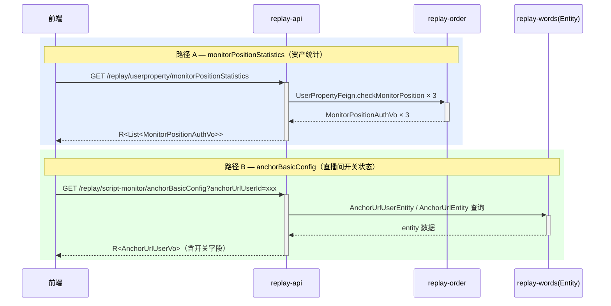
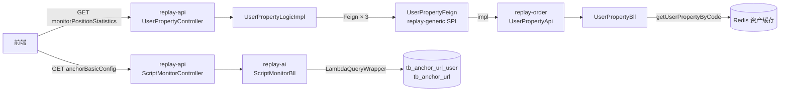

spec_mode: STANDARD
risk: MEDIUM
frontend-facing: true
module: replay-generic
triggers: [domain, api, data, business-arch, tech-arch]

---

## 1. Context

- **Business goal:** 为三类 AI 监控能力（话术质检 / 话术还原度 / 互动巡检）建立监控位资产管理基础设施，使前端可查询当前用户的授权量/剩余量，以及直播间的监控开关状态；同时清理 `triggerReport` B5 TODO 注释，确认手动触发不校验监控位剩余量。
- **Scope of change:**
  - `replay-common`：`OrderEnums.commodityTypeCode` 追加 3 个枚举
  - `sql/`：`tb_commodity_type` 种子 INSERT 3 行
  - `replay-generic`：新建 `MonitorPositionAuthVo`；`UserPropertyFeign` 新增 `checkMonitorPosition` 方法声明；`AnchorUrlUserVo` 追加 4 个字段
  - `replay-order`：`UserPropertyApi` 实现 `checkMonitorPosition`；`UserPropertyBll` 新增 `checkMonitorPosition` 方法
  - `replay-ai`：`ScriptMonitorBll` line 387 TODO 注释改写为说明性注释
  - `replay-api`：`ScriptMonitorController` 新增 `anchorBasicConfig` GET 接口；`UserPropertyController` 新增 `monitorPositionStatistics` GET 接口；`UserPropertyLogic` + `UserPropertyLogicImpl` 新增对应方法
- **Dependencies consulted:** `.claude/runs/Change__2026-06-02_b5-monitor-position/explore_report.md` (source of all ACs and Spec Inference)
- **Explorer hand-off:** `.claude/runs/Change__2026-06-02_b5-monitor-position/explore_report.md`

---

## 2. Domain Model

- **New/updated terms:**
  - `监控位（Monitor Position）`：租户共享的 AI 监控能力授权量，以 `totalQuantity`/`useQuantity`/`surplus` 三元组表示。与弹幕监控位（`anchorBarrageNum`）模式一致，无主子账号分版本。
  - `hasAuth`：`totalQuantity > 0`，表示套餐内有该能力，用于自动触发前置校验。
  - `hasSurplus`：`surplus > 0`（即 `totalQuantity > useQuantity`），表示仍有剩余授权量，用于开关开启时校验。
- **Enum updates（OrderEnums.commodityTypeCode 追加）：**

  | 枚举名 | code 字符串 | 描述 | `sub_account_have` |
  |---|---|---|---|
  | `SCRIPT_QUALITY_NUM` | `"scriptQualityNum"` | 话术质检监控位 | 0（租户共享，子账号回退主账号） |
  | `SCRIPT_FIDELITY_NUM` | `"scriptFidelityNum"` | 话术还原度监控位 | 0 |
  | `INTERACTION_PATROL_NUM` | `"interactionPatrolNum"` | 互动巡检监控位 | 0 |

  追加位置：紧接 `ENTERPRISE_PERSON_NUM` 之后，在末位 `;` 之前（line 48 附近）。

---

## 2.5 Business Architecture

### 2.5.1 业务流（B5 核心两条路径）



### 2.5.2 Business Boundary

- **本批次（B5）owns：** 监控位资产查询 SPI（checkMonitorPosition）、两个前端接口（anchorBasicConfig / monitorPositionStatistics）、triggerReport B5 注释清理
- **Out of scope：**
  - B6：`addOrUpdateAnchor` 改造（开关写入 + 监控位占用/释放）
  - B7：自动触发挂载（`updateVideoAnalysisStatus` 末尾 + `ScriptMonitorFeign.autoTriggerForVideo` SPI）
  - B3：`accountType` 自有账号校验（line 384 TODO 保持原样）
- **Boundary contract：**
  - `replay-api → replay-order`：通过 `UserPropertyFeign.checkMonitorPosition`（Feign SPI，声明在 `replay-generic`，实现在 `replay-order/api/UserPropertyApi`）

### 2.5.3 Upstream / Downstream

| Direction | Module | Touchpoint | What flows |
|---|---|---|---|
| Upstream | `replay-order` | `UserPropertyFeign.checkMonitorPosition` | userId + code → `MonitorPositionAuthVo` |
| Upstream（anchorBasicConfig） | `replay-words`（Entity 直读） | `AnchorUrlUserEntity` + `AnchorUrlEntity` in-module | anchorUrlUserId → 开关状态 |
| Downstream（调用方） | `replay-api / UserPropertyController` | 新增 `monitorPositionStatistics` | 无；幂等 GET |

### 2.5.4 Business Rules

- **Rule-B5-1：** 手动触发（`triggerReport`）不校验监控位剩余量 — 依据 PRD R-P0-003，手动场景仅校验套餐功能权限、自有账号和 Token 余额。
- **Rule-B5-2（为 B6 预先明确）：** 开关开启（0→1）时需校验 `hasSurplus=true`，否则抛 70002（授权数量不足）。
- **Rule-B5-3（为 B7 预先明确）：** 自动触发时仅校验 `hasAuth=true`（`totalQuantity>0`），surplus=0 时 skip + warn log，不抛错给用户。
- **Rule-B5-4：** 三类监控位全部 `sub_account_have=0`，子账号调用自动回退父账号查询（复用 `getCurrentUserId` 逻辑）。

---

## 3. API Contract

### 3.1 GET /replay/script-monitor/anchorBasicConfig

- **Auth：** Token 必传（`@RequestHeader`）
- **Request：**

  | Field | Type | Required | Validation | Meaning |
  |---|---|---|---|---|
  | `anchorUrlUserId` | Long | yes | > 0 | tb_anchor_url_user.id |

  ```
  GET /replay/script-monitor/anchorBasicConfig?anchorUrlUserId=123456789
  ```

- **Response（复用 `AnchorUrlUserVo`，追加 4 字段）：**

  ```json
  {
    "code": 0,
    "msg": "OK",
    "data": {
      "id": "<Long>",
      "anchorUrlSecUid": "<String>",
      "isScriptQualityInspection": "<Integer 0/1>",
      "isScriptFidelityMonitor": "<Integer 0/1>",
      "isInteractionPatrol": "<Integer 0/1>",
      "standardScriptId": null,
      "... 其他 AnchorUrlUserVo 字段 ..."
    }
  }
  ```

  > `standardScriptId` B5 阶段统一返 null（B3 标准稿能力的占位字段）。

- **Error codes：**
  - 30000（数据不存在）：`anchorUrlUserId` 对应记录不存在
  - 70011（无数据读取权限）：当前用户无权访问该直播间

### 3.2 GET /replay/userproperty/monitorPositionStatistics

- **Auth：** Token 必传
- **Request：** 无请求体，userId 从 JWT 上下文获取

  ```
  GET /replay/userproperty/monitorPositionStatistics
  ```

- **Response：**

  ```json
  {
    "code": 0,
    "msg": "OK",
    "data": [
      {
        "code": "scriptQualityNum",
        "name": "话术质检监控位",
        "totalQuantity": 5,
        "useQuantity": 2,
        "remainingQuantity": 3
      },
      {
        "code": "scriptFidelityNum",
        "name": "话术还原度监控位",
        "totalQuantity": 0,
        "useQuantity": 0,
        "remainingQuantity": 0
      },
      {
        "code": "interactionPatrolNum",
        "name": "互动巡检监控位",
        "totalQuantity": 3,
        "useQuantity": 3,
        "remainingQuantity": 0
      }
    ]
  }
  ```

  > `remainingQuantity = max(totalQuantity - useQuantity, 0)`，**不返回 `scope`/`scopeName`**（修正 4）。
  > 返回类型：`R<List<MonitorPositionAuthVo>>`；固定顺序：quality → fidelity → patrol。

---

## 4. Data Model

### 4.1 DDL（仅种子数据 INSERT）

无结构性 DDL（无 CREATE/ALTER）。新建 `sql/replay-28.sql`，追加以下种子数据（实际 ID 由部署时用 SnowflakeManager 生成，占位用 0 仅作示意，实际实现时 lead-engineer 使用 Snowflake 生成三个真实 ID）：

```sql
-- B5：话术智能监控位种子数据（3 条）
-- sub_account_have=0 表示子账号共享主账号资产
INSERT INTO `tb_commodity_type` (`id`, `code`, `name`, `sub_account_have`, `create_date`, `update_date`, `is_deleted`)
VALUES
  (#{snowflake1}, 'scriptQualityNum',     '话术质检监控位',   0, NOW(), NOW(), 0),
  (#{snowflake2}, 'scriptFidelityNum',    '话术还原度监控位', 0, NOW(), NOW(), 0),
  (#{snowflake3}, 'interactionPatrolNum', '互动巡检监控位',   0, NOW(), NOW(), 0);
```

> 注意：lead-engineer 写 sql 文件时用真实 SnowflakeManager.nextValue() 生成三个固定 Long 值写入，不使用占位符。

### 4.2 ER Diagram

Not applicable — 无新表，仅种子数据。

### 4.3 Index Reasoning

Not applicable — 无新索引。

### 4.4 Data Assembly Strategy

- `checkMonitorPosition`：调用 `getUserPropertyByCode(resolvedUserId, resolvedCode)` 返回 `UserPropertyTypeInfoVo`，in-memory 组装 `MonitorPositionAuthVo`；不 JOIN。
- `anchorBasicConfig`：先查 `tb_anchor_url_user`（by id + tenantId），再查 `tb_anchor_url`（by anchorId），in-memory 组装 `AnchorUrlUserVo`，不 JOIN。

### 4.5 Lifecycle

- 软删除：`is_deleted = 1`（手动，禁 `@TableLogic`）
- 租户隔离：所有读查询必须带 `tenant_id = #{tenantId}` 过滤

---

## 5. Business Logic

### 5.1 checkMonitorPosition（新 Feign SPI — replay-order 实现）

**调用方：** `UserPropertyLogicImpl.monitorPositionStatistics` 调用 3 次（每个 code 各一次）

**步骤：**

1. 调用 `userFeign.getUserParentId(userId)` 获取 parentId（可能 null 或 0）
2. 查 `CommodityTypeEntity`（by code）取 `subAccountHave` 标志（复用 `getCurrentUserId` 内部逻辑）
3. 若 `subAccountHave == 0` 且 `parentId != null && parentId != 0L`，则 `resolvedUserId = parentId`，否则 `resolvedUserId = userId`（**修正 1 后三类 code 全部 sub_account_have=0，无需 child_ 前缀**）
4. 调用 `userPropertyBll.getUserPropertyByCode(resolvedUserId, code)` 取 `UserPropertyTypeInfoVo`
5. 组装 `MonitorPositionAuthVo`：
   - `totalQuantity` = vo.totalQuantity（null 时取 0）
   - `useQuantity` = vo.useQuantity（null 时取 0）
   - `surplus` = max(totalQuantity - useQuantity, 0)
   - `hasAuth` = totalQuantity > 0
   - `hasSurplus` = surplus > 0
6. 返回 `MonitorPositionAuthVo`

> **修正 1（重要）**：三类新 code 的 `sub_account_have=0`，意味着子账号调用时回退到 parentId 查询，但**不加 `child_` 前缀**（与 `anchorBarrageNum` / `channelMonitorNum` 范式一致 — 这些租户共享资产本就挂在主账号名下，没有单独的 child 版本）。explore_report.md 的 AC-005 描述"查 `child_scriptQualityNum`"是错误推断，以本修正为准。

### 5.2 monitorPositionStatistics（新 Controller + Logic）

**调用方：** 前端，GET 请求

**步骤：**

1. 从 JWT/GlobalObject 取 `userId`
2. 按固定顺序调用 `UserPropertyFeign.checkMonitorPosition` 三次：`scriptQualityNum` → `scriptFidelityNum` → `interactionPatrolNum`
3. 组装 `List<MonitorPositionAuthVo>`，每项含 `{code, name, totalQuantity, useQuantity, remainingQuantity}`（`remainingQuantity = surplus`）
4. 返回 `R.ok(list)`

### 5.3 anchorBasicConfig（新 Controller → ScriptMonitorBll）

**步骤：**

1. 接收 `anchorUrlUserId`（Long）
2. 从 `GlobalObject` 取当前用户 `tenantId`
3. 查 `tb_anchor_url_user` by id + tenantId（LambdaQueryWrapper）— 不存在则抛 30000
4. 查 `tb_anchor_url` by anchorId（取 secUid 等基础信息）
5. 用 `BeanUtils.copyProperties` 将 Entity 字段复制到 `AnchorUrlUserVo`
6. 追加四个 B5 新字段的赋值：`isScriptQualityInspection`、`isScriptFidelityMonitor`、`isInteractionPatrol`、`standardScriptId`（返 null）
7. 返回 `R.ok(vo)`

### 5.4 triggerReport TODO 清理（ScriptMonitorBll line 387）

**仅修改注释，不加任何逻辑。**

当前：
```java
// TODO(script-monitor:B5) 校验当前版本有该能力授权量(不校验剩余量，无则抛 70003/70002)，依赖监控位资产 code
```

改为：
```java
// 手动触发场景按 PRD R-P0-003 不校验监控位授权量（仅校验套餐功能权限、自有账号和 Token 余额）
// 监控位授权量校验由 addOrUpdateAnchor 开关开启时（B6）和自动触发（B7）负责
```

**保持 line 384（B3 accountType TODO）和 line 396（B3 还原度 TODO）不动。**

### 5.5 校验语义完整对照（供 B6/B7 实现时直接使用）

| 场景 | 监控位校验 | 校验字段 | Token | 开关 | 出错处理 |
|---|---|---|---|---|---|
| addOrUpdateAnchor 开自动监控开关（0→1，B6） | 是 | `hasSurplus`（剩余>0） | — | — | 抛 70002 |
| 自动触发（updateVideoAnalysisStatus，B7） | 是 | `hasAuth`（总量>0） | ≥100,000 | 对应能力开关=1 | skip + warn log |
| 手动触发（triggerReport，本批次） | **否** | — | ≥100,000 | 不要求 | — |

### 5.6 Branches & exceptions

| Branch | Trigger | Handling | Error code |
|---|---|---|---|
| anchorBasicConfig — 记录不存在 | tb_anchor_url_user 无该 id+tenantId 记录 | throw BusinessException | 30000 |
| anchorBasicConfig — 权限不符 | tenantId 不匹配 | LambdaQueryWrapper 过滤，空则 30000 | 30000 |
| checkMonitorPosition — 无资产 | getUserPropertyByCode 返回零值 | 正常返回，hasAuth=false, hasSurplus=false | — |
| monitorPositionStatistics — Feign 异常 | checkMonitorPosition 调用失败 | BusinessException 上抛，由全局异常处理 | — |

### 5.7 Idempotency / replay safety

- `monitorPositionStatistics`：幂等 GET，无副作用
- `anchorBasicConfig`：幂等 GET，无副作用
- `checkMonitorPosition`：Feign 幂等（只读）

---

## 5.5 Technical Architecture

### 5.5.1 Module Topology



### 5.5.2 Cross-Module Communication

| Channel | From → To | Contract | Failure handling |
|---|---|---|---|
| Feign（同进程，replay-api 直接调 replay-order Bean） | UserPropertyLogicImpl → UserPropertyFeign（UserPropertyApi impl） | `checkMonitorPosition(Long userId, String code)` → `MonitorPositionAuthVo` | BusinessException 上抛，全局处理 |

> 注：`replay-api` 通过 `@Service` Bean（非 HTTP Feign Client）直调 `replay-order` 模块内的 `UserPropertyApi`，因为两模块同属一个 Spring Boot 应用（`replay-api` 是所有业务模块的聚合入口）。`UserPropertyFeign` 是同进程调用接口，不是 HTTP Feign。

### 5.5.3 Async Tasks

Not applicable — 无 MQ / 定时任务。

### 5.5.4 Cache Strategy

`getUserPropertyByCode` 内部通过 `userPropertyProducer.getUserProperty(userId)` 读 Redis 缓存（`RedisCacheKey.userPropertyTypeTotalCacheKey`），缓存由 `replay-order` 已有机制维护。B5 不新增任何缓存操作。

### 5.5.5 Transaction Boundary

Not applicable — B5 所有新方法均为只读查询，无写操作，无需 `@Transactional`。

### 5.5.6 Observability

- Log keys：`userId`, `tenantId`, `anchorUrlUserId`（anchorBasicConfig），`code`（checkMonitorPosition）
- 无新 metric；依赖标准请求日志

---

## 6. Non-Functional Constraints (Hard Constraints)

- **DI：** 构造器注入（禁 `@Autowired` / `@Resource`）——所有新类使用 `@AllArgsConstructor` + `final` 字段；`UserPropertyController` 已有 `@Resource` 注入，在该文件新增方法时**镜像周围风格**（外科手术原则），在 `[Issues Found]` 中标注技术债
- **Controller 返回值：** 统一 `R<T>`（`com.jiuyu.replay.generic.vo.common.R`），禁裸返业务对象
- **ID 生成：** `SnowflakeManager.nextValue()`；Entity `@TableId(type = IdType.INPUT)`（适用于种子数据 SQL 写入）
- **跨模块调用：** 走 `replay-generic` 中的 Feign 接口，禁跨模块直连 Dao
- **查询类型安全：** 使用 `LambdaQueryWrapper`
- **软删除：** 手动设 `isDeleted = 1`，禁 `@TableLogic`
- **时间戳：** 手动 `LocalDateTime.now()` 设 `createDate`/`updateDate`（种子数据用 `NOW()`）
- **租户隔离：** `anchorBasicConfig` 查询必须带 `tenantId` 过滤；`checkMonitorPosition` 通过 userId 隔离（资产本就按 userId 存储）
- **SQL 占位符：** `#{}` 禁 `${}`
- **IN 列表：** 本批次无 IN 查询，不适用
- **性能：** `monitorPositionStatistics` 最多 3 次串行 Feign 调用（全部命中 Redis 缓存），P95 < 100ms
- **禁止：** `@TableLogic`、`@Autowired`（新代码）、跨模块直连 Dao、`${}`、循环内 Feign 调用（3 个 code 需展开为 3 次独立调用，不用循环动态 Feign）

---

## 7. Acceptance Criteria

- **AC-001（happy path：主账号 checkMonitorPosition 有授权有余量）：**
  Given 主账号用户（`userFeign.getUserParentId` 返回 null 或 0），`getUserPropertyByCode(userId, "scriptQualityNum")` 返回 `totalQuantity=5, useQuantity=2`，
  when 调用 `checkMonitorPosition(userId, "scriptQualityNum")`，
  then 返回 `MonitorPositionAuthVo{hasAuth=true, hasSurplus=true, totalQuantity=5, useQuantity=2, surplus=3}`。

- **AC-002（happy path：triggerReport 手动触发不校验监控位，直接通过到 Token 校验）：**
  Given 主账号、三类监控位 totalQuantity=0（未购买）、Token 余额充足，
  when POST `/replay/script-monitor/triggerReport`（monitorType=0 质检），
  then line 387 原 TODO 处**不执行任何监控位校验**，正常进入 Token 余额判断，不抛 70002/70003。

- **AC-003（happy path：monitorPositionStatistics 返回三能力）：**
  Given 登录态 userId 有效，`scriptQualityNum` 有授权余量，`scriptFidelityNum` 无资产，`interactionPatrolNum` 已耗尽，
  when GET `/replay/userproperty/monitorPositionStatistics`，
  then 返回 `R<List<MonitorPositionAuthVo>>` 按 quality→fidelity→patrol 顺序，三项分别 `{hasAuth=true,hasSurplus=true,...}`、`{hasAuth=false,hasSurplus=false,...}`、`{hasAuth=true,hasSurplus=false,...}`，`remainingQuantity=max(total-use,0)`。

- **AC-004（happy path：anchorBasicConfig 返回直播间配置含开关）：**
  Given 有效的 `anchorUrlUserId`，对应 `tb_anchor_url_user` 记录存在，tenantId 匹配，
  when GET `/replay/script-monitor/anchorBasicConfig?anchorUrlUserId=xxx`，
  then 返回 `R<AnchorUrlUserVo>` 含 `isScriptQualityInspection`、`isScriptFidelityMonitor`、`isInteractionPatrol`（值来自 Entity）、`standardScriptId=null`，无 null 异常。

- **AC-005（edge：子账号自动回退主账号资产）：**
  Given 子账号 A，`userFeign.getUserParentId(A)` 返回 parentId B（B != null && B != 0L），
  when 调用 `checkMonitorPosition(A, "scriptQualityNum")`，
  then 实际以 `getUserPropertyByCode(B, "scriptQualityNum")` 查询（无 `child_` 前缀，直接用 parentId 查同一 code），返回 parentId B 下的资产数据。

- **AC-006（edge：parentId=0 等价无父，走主账号路径）：**
  Given 某账号 `userFeign.getUserParentId` 返回 0L，
  when 调用 `checkMonitorPosition(userId, "scriptQualityNum")`，
  then 走主账号路径，以 `getUserPropertyByCode(userId, "scriptQualityNum")` 查询。

- **AC-007（edge：无资产 — 套餐未购买）：**
  Given `getUserPropertyByCode` 返回零值对象（`totalQuantity=0, useQuantity=0`），
  when 调用 `checkMonitorPosition`，
  then 返回 `MonitorPositionAuthVo{hasAuth=false, hasSurplus=false, totalQuantity=0, useQuantity=0, surplus=0}`；调用方（B6 开关开启）据此判断后抛 70002。

- **AC-008（edge：surplus=0 但 totalQuantity>0 — 手动触发不受阻断）：**
  Given `totalQuantity=2, useQuantity=2`（surplus=0），
  when POST `triggerReport`（手动触发，monitorType=0），
  then **不校验** 监控位，正常进入 Token 校验阶段（B5 不实现监控位校验，AC-002 的超集）。

| AC-id | Method under test | Assertion |
|---|---|---|
| AC-001 | `UserPropertyBll#checkMonitorPosition` | hasAuth=true, hasSurplus=true, surplus=3 |
| AC-002 | `ScriptMonitorBll#triggerReport` (line 387) | 无 BusinessException(70002/70003)；进入 Token 校验 |
| AC-003 | `UserPropertyLogicImpl#monitorPositionStatistics` | 返回 3 项，顺序固定，remainingQuantity 正确 |
| AC-004 | `ScriptMonitorBll#anchorBasicConfig` | AnchorUrlUserVo 含 4 个新字段，standardScriptId=null |
| AC-005 | `UserPropertyBll#checkMonitorPosition` | 以 parentId + 原始 code（无 child_ 前缀）查询 |
| AC-006 | `UserPropertyBll#checkMonitorPosition` | parentId=0 视为无父，以自身 userId 查询 |
| AC-007 | `UserPropertyBll#checkMonitorPosition` | hasAuth=false, hasSurplus=false |
| AC-008 | `ScriptMonitorBll#triggerReport` | 同 AC-002，surplus=0 不阻断手动触发 |

---

## 8. Frontend Contract Publishing

- `frontend-facing: true`
- `module: replay-generic`

Phase 4 **before** Implement：dispatch `@frontend-api-doc-writer`（mode: forward），读 §3（API Contract）+ §7（AC examples），产出 `.claude/llm_wiki/wiki/frontend-api/script-monitor.md`（anchorBasicConfig 部分）和 `.claude/llm_wiki/wiki/frontend-api/user-property.md`（monitorPositionStatistics 部分）。

§3 字段已完整（类型 / 必填 / 语义）。`standardScriptId` 返 null 需在前端文档中标注"B3 阶段就绪，当前恒为 null"。

§9 Architecture Decision Records

Not applicable — risk=MEDIUM，无强制 ADR 要求；本批次设计无真正 contested 决策点（VO 复用 vs 新建已在决策修正中明确，无需 ADR 形式展开）。

---

## Allowed Scope

```
# replay-common（枚举扩容）
replay-common/src/main/java/com/jiuyu/replay/common/constant/OrderEnums.java

# sql 种子数据（若 replay-28.sql 不存在则新建）
sql/replay-28.sql

# replay-generic（SPI + VO）
replay-generic/src/main/java/com/jiuyu/replay/generic/feign/order/UserPropertyFeign.java
replay-generic/src/main/java/com/jiuyu/replay/generic/vo/order/MonitorPositionAuthVo.java
replay-generic/src/main/java/com/jiuyu/replay/generic/vo/words/AnchorUrlUserVo.java

# replay-order（SPI 实现 + Bll）
replay-order/src/main/java/com/jiuyu/replay/order/api/UserPropertyApi.java
replay-order/src/main/java/com/jiuyu/replay/order/bll/UserPropertyBll.java

# replay-ai（triggerReport B5 TODO 注释改写）
replay-ai/src/main/java/com/jiuyu/replay/ai/bll/ScriptMonitorBll.java

# replay-api（新接口 Controller + Logic）
replay-api/src/main/java/com/jiuyu/replay/api/controller/words/ScriptMonitorController.java
replay-api/src/main/java/com/jiuyu/replay/api/controller/order/UserPropertyController.java
replay-api/src/main/java/com/jiuyu/replay/api/logic/order/UserPropertyLogic.java
replay-api/src/main/java/com/jiuyu/replay/api/logic/order/impl/UserPropertyLogicImpl.java
```

---

## 做什么 / 为什么

**现状：** 系统已有弹幕监控位、视频号监控位等资产 code，但话术质检 / 话术还原度 / 互动巡检三类 AI 监控能力没有对应的资产 code 和查询入口，前端无法展示授权余量，直播间配置接口也不返回监控开关状态。

**需要：** 新增三个监控位 code 种子数据，新增跨模块 SPI `checkMonitorPosition`，新增两个前端 GET 接口（监控位资产统计 + 直播间基础配置），清理 `triggerReport` 中已过期的 B5 TODO 注释。

**范围：** 5 个模块（common / generic / order / ai / api），11 个文件（3 新建 + 8 改动），无 DDL 变更（仅 INSERT 种子数据），Risk=MEDIUM。

## 怎么做

1. **枚举 + 种子数据**：在 `OrderEnums.commodityTypeCode` 追加 3 个枚举值，对应写 3 行 `tb_commodity_type` INSERT SQL；`sub_account_have=0` 复用视频号监控位（`channelMonitorNum`）范式。

2. **SPI 层（checkMonitorPosition）**：在 `UserPropertyFeign`（replay-generic 接口）新增方法声明；在 `UserPropertyApi`（replay-order 实现类）中实现，内部调用已有 `getCurrentUserId` 逻辑（复用 `sub_account_have` 主子账号回退机制）再调 `getUserPropertyByCode`，in-memory 组装 `MonitorPositionAuthVo`（新建在 `replay-generic/vo/order/`）。

3. **monitorPositionStatistics 接口**：在 `UserPropertyLogic` + `UserPropertyLogicImpl` 新增方法，串行调用 `UserPropertyFeign.checkMonitorPosition` 三次（质检→还原度→巡检），返回 `List<MonitorPositionAuthVo>`；Controller 层挂在 `UserPropertyController`。

4. **anchorBasicConfig 接口**：在 `ScriptMonitorBll` 新增方法（查 `AnchorUrlUserEntity` + 追加字段赋值）；Controller 层挂在 `ScriptMonitorController`；响应复用 `AnchorUrlUserVo`（在该 VO 追加 4 个字段）；`standardScriptId` 统一返 null（B3 占位）。

5. **triggerReport 注释清理**：仅修改 line 387 注释为说明性文字，不加任何逻辑代码；line 384 / 396 的 B3 TODO 保留不动。
