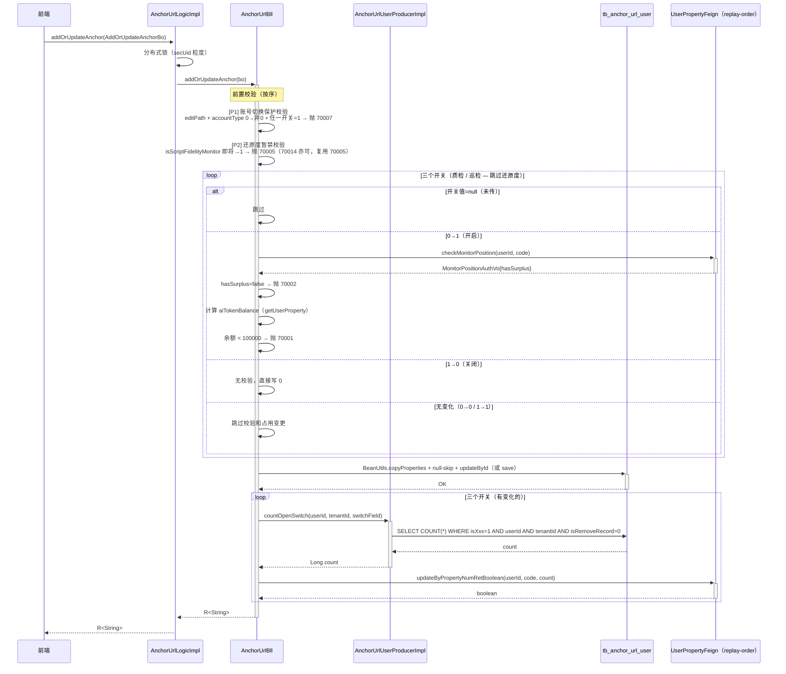
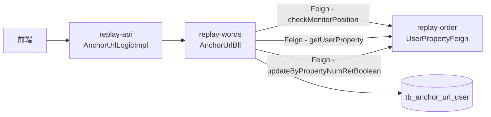

spec_mode: STANDARD
risk: MEDIUM
frontend-facing: false
module: replay-words
triggers: [business-arch, tech-arch]

---

## 1. Context

- **Business goal:** 在 `addOrUpdateAnchor` 接口中开放三个 AI 监控开关字段（话术质检 / 话术还原度 / 互动巡检），按"开启 / 关闭 / 不变"三路分别执行授权量校验、Token 余额校验、监控位占用/释放，并增加账号切换保护与还原度暂禁逻辑。
- **Scope of change:**
  - `replay-words/.../bo/anchor/AddOrUpdateAnchorBo.java` — 新增 4 字段
  - `replay-words/.../bll/AnchorUrlBll.java` — 核心业务逻辑插入
  - `replay-words/.../producer/AnchorUrlUserProducer.java` — 新增接口方法 `countOpenSwitch`
  - `replay-words/.../producer/impl/AnchorUrlUserProducerImpl.java` — 新增方法实现
- **Dependencies consulted:**
  - `docs/2.6.01/REQ-2026-0508-话术质检/REQ-2026-0508-话术质检.md`（R-P0-001/001A/009）
  - `docs/2.6.01/_shared/shared-capability.md`（授权量规则 + 账号切换补充规则）
  - B5 archive: `.claude/llm_wiki/archive/20260602_b5-monitor-position.md`（SPI / Enum / VO 已就绪）
- **Explorer hand-off:** `.claude/runs/Change__2026-06-02_b6-anchor-switch/explore_report.md`

---

## 2. Domain Model

Not applicable — B6 不引入新业务术语和状态机。三个开关字段均为 TINYINT 0/1（B5 已落表），枚举 `SCRIPT_QUALITY_NUM / SCRIPT_FIDELITY_NUM / INTERACTION_PATROL_NUM` 已在 `OrderEnums.commodityTypeCode` 定义（B5 已加）。

---

## 2.5 Business Architecture

### 2.5.1 Business Flow



### 2.5.2 Business Boundary

- **In scope（replay-words 负责）：** 三个开关的写入逻辑、授权量 / Token 校验编排、账号切换保护、还原度暂禁拦截、监控位占用统计 + 写回。
- **Out of scope：**
  - 还原度实际能力（generateStandardScript / confirmStandardScript / fidelityReportDetail）— B3
  - 标准稿表 DDL（tb_standard_script）— B3
  - 自动触发挂载（updateVideoAnalysisStatus / ScriptMonitorFeign.autoTriggerForVideo）— B7
  - accountType 在 triggerReport 路径的自有账号校验（ScriptMonitorBll line 384 TODO）— B3
  - replay-order 的 UserPropertyFeign 实现侧 — 不触碰
- **Boundary contract：** replay-words → replay-order 走 `UserPropertyFeign`（replay-generic Feign 接口，B5 已加 `checkMonitorPosition`，`updateByPropertyNumRetBoolean` 现有）。

### 2.5.3 Upstream / Downstream

| Direction | System / Module | Touchpoint | What flows |
|---|---|---|---|
| Upstream | 前端 / replay-api | `AnchorUrlLogicImpl.addOrUpdateAnchor` | AddOrUpdateAnchorBo（含 4 个新字段） |
| Downstream | replay-order | `UserPropertyFeign.checkMonitorPosition` | userId + code → MonitorPositionAuthVo |
| Downstream | replay-order | `UserPropertyFeign.getUserProperty` | userId → List<UserPropertyTypeInfoVo>（取 aiTokenNum） |
| Downstream | replay-order | `UserPropertyFeign.updateByPropertyNumRetBoolean` | userId + code + count → boolean |

### 2.5.4 Business Rules

- Rule 1：账号切换保护 — 编辑路径下若 accountType 从 0 改为非 0，且数据库中任一 AI 监控开关当前为 1，必须先关闭开关才允许切换。
- Rule 2：还原度暂禁 — isScriptFidelityMonitor 0→1 时一律拒绝（B3 能力未就绪），错误码 70005。
- Rule 3：开启校验顺序 — 授权量校验（hasSurplus）→ Token 余额校验（≥ 100000），两关均过才写库。
- Rule 4：null-skip — 三个开关字段 BO 未传时跳过全部逻辑（不影响其他字段）。
- Rule 5：监控位独立 — 质检、还原度、巡检各自独立统计和调用 `updateByPropertyNumRetBoolean`，互不影响。

---

## 3. API Contract

Not applicable — B6 不新增 Controller endpoint；仅扩展 `addOrUpdateAnchor` 接口的 BO 字段（前端契约见 §8 标注）。

---

## 4. Data Model

Not applicable — B6 不做 DDL，三个开关字段（`is_script_quality_inspection` / `is_script_fidelity_monitor` / `is_interaction_patrol`）及 `standard_script_id` 均已在 `tb_anchor_url_user` 存在（B5 落表）。

---

## 5. Business Logic

### 5.1 Happy path（step-by-step）

以"编辑路径、isScriptQualityInspection 0→1、isInteractionPatrol null"为典型路径：

1. `AnchorUrlLogicImpl.addOrUpdateAnchor` 加分布式锁后调 `AnchorUrlBll.addOrUpdateAnchor(bo)`（Logic 层不变）。
2. `AnchorUrlBll.addOrUpdateAnchor` 内，现有主播/用户信息读取逻辑不变（`anchorUrlProducer.infoBySecUid` + `anchorUrlUserProducer.getUserAnchorBySecUid`）。
3. **[新增] 账号切换保护前置校验**（位于 `userAnchorInfo != null` 分支内，`anchorUrlUserBo.setId(...)` 之前）：
   - 若 `addOrUpdateAnchorBo.getAccountType() != null` 且 `userAnchorInfo.getAccountType() == 0` 且传入值 `!= 0`（accountType 0→非0）
   - 且 `userAnchorInfo` 中任一 `isScriptQualityInspection / isScriptFidelityMonitor / isInteractionPatrol == 1`
   - → `throw new BusinessException(StatusCode.SCRIPT_MONITOR_ACCOUNT_TYPE_LOCKED)`（70007）
4. **[新增] 还原度暂禁校验**（早于其他开关校验）：
   - 若 `bo.getIsScriptFidelityMonitor() != null && bo.getIsScriptFidelityMonitor() == 1`
   - → `throw new BusinessException(StatusCode.SCRIPT_MONITOR_STANDARD_SCRIPT_UNCONFIRMED)`（70005，复用"请先确认标准直播稿"语义）
5. **[新增] null-skip 三字段写入**（在现有 `BeanUtils.copyProperties(addOrUpdateAnchorBo, anchorUrlUserBo)` 之后）：
   ```java
   // 三个 AI 监控开关：BO 未传值时不覆盖既有值
   if (addOrUpdateAnchorBo.getIsScriptQualityInspection() != null) {
       anchorUrlUserBo.setIsScriptQualityInspection(addOrUpdateAnchorBo.getIsScriptQualityInspection());
   }
   if (addOrUpdateAnchorBo.getIsScriptFidelityMonitor() != null) {
       anchorUrlUserBo.setIsScriptFidelityMonitor(addOrUpdateAnchorBo.getIsScriptFidelityMonitor());
   }
   if (addOrUpdateAnchorBo.getIsInteractionPatrol() != null) {
       anchorUrlUserBo.setIsInteractionPatrol(addOrUpdateAnchorBo.getIsInteractionPatrol());
   }
   ```
6. **[新增] 开关"开启"校验**（对 isScriptQualityInspection 和 isInteractionPatrol，不含 isScriptFidelityMonitor）：
   - 取当前数据库值（`userAnchorInfo` 或新建时默认 0）
   - 若 `bo.getIsXxx() != null && bo.getIsXxx() == 1 && currentValue != 1`（0→1 开启）：
     - 调 `userPropertyFeign.checkMonitorPosition(bo.getUserId(), enumCode)` → `hasSurplus == false` → 抛 70002
     - 调私有方法 `aiTokenBalance(bo.getUserId())` < 100000 → 抛 70001
7. 现有写库逻辑执行（`anchorUrlUserProducer.save(anchorUrlUserBo)` 或 `updateById`）。
8. **[新增] 写库后统计 + 占用更新**（对有实际变化的开关）：
   - 若 `bo.getIsScriptQualityInspection() != null && !currentQualityValue.equals(bo.getIsScriptQualityInspection())`：
     - `Long count = anchorUrlUserProducer.countOpenSwitch(userId, tenantId, "isScriptQualityInspection")`
     - `userPropertyFeign.updateByPropertyNumRetBoolean(userId, SCRIPT_QUALITY_NUM.getCode(), count)`
   - isInteractionPatrol 同理（用 INTERACTION_PATROL_NUM）
   - isScriptFidelityMonitor：已在步骤 4 拦截 0→1；1→0 若能到达此处则同理统计（理论路径保留，实际当前均为 0）
9. 现有 `basicSettingsProducer.updateAiPartialNew(...)` 不变。
10. 返回 `R.ok("添加成功")`。

### 5.2 Branches & exceptions

| Branch | Trigger | Handling | Error code |
|---|---|---|---|
| 账号切换保护 | 编辑路径 + accountType 0→非0 + 任一 DB 开关=1 | `throw new BusinessException(StatusCode.SCRIPT_MONITOR_ACCOUNT_TYPE_LOCKED)` | 70007 |
| 还原度暂禁 | isScriptFidelityMonitor 即将→1 | `throw new BusinessException(StatusCode.SCRIPT_MONITOR_STANDARD_SCRIPT_UNCONFIRMED)` | 70005 |
| 授权量不足 | checkMonitorPosition hasSurplus=false | `throw new BusinessException(StatusCode.SCRIPT_MONITOR_QUOTA_NOT_ENOUGH)` | 70002 |
| Token 不足 | aiTokenBalance < 100000 | `throw new BusinessException(StatusCode.SCRIPT_MONITOR_TOKEN_NOT_ENOUGH)` | 70001 |
| 开关值 null | bo.getIsXxx() == null | 完全跳过该开关分支 | — |
| 开关无变化 | 传入值 == 数据库当前值 | 跳过校验和占用变更（BeanUtils 已写入相同值，不影响） | — |
| 关闭开关（1→0） | bo.getIsXxx() == 0 && currentValue == 1 | 写 0，统计新 count，调 updateByPropertyNumRetBoolean | — |
| Feign 调用失败 | updateByPropertyNumRetBoolean 抛 RuntimeException | @Transactional 触发 DB 回滚；Redis 侧可能已脏（见 §5.5.5） | — |

### 5.3 Idempotency / replay safety

- 分布式锁已由 `AnchorUrlLogicImpl` 加在外层（锁键 `replay:anchorUrl:addOrUpdateAnchor:<secUid>`），B6 不新增。
- 开关写入幂等：同值写入无副作用（LambdaUpdateWrapper + updateById 条件写）。
- 校验幂等：每次调用均重新查 DB 当前值，不依赖缓存状态。

---

## 5.5 Technical Architecture

### 5.5.1 Module Topology



### 5.5.2 Cross-Module Communication

| Channel | From → To | Contract | Failure handling |
|---|---|---|---|
| Feign | words → order | `UserPropertyFeign.checkMonitorPosition(userId, code)` → `MonitorPositionAuthVo` | 抛异常 → @Transactional 回滚 |
| Feign | words → order | `UserPropertyFeign.getUserProperty(userId)` → `List<UserPropertyTypeInfoVo>` | 返回空 → aiTokenBalance=0 → 抛 70001 |
| Feign | words → order | `UserPropertyFeign.updateByPropertyNumRetBoolean(userId, code, count)` → boolean | 抛 RuntimeException → DB 回滚 |

### 5.5.3 Async Tasks

Not applicable — B6 无异步任务、无 MQ、无定时任务。

### 5.5.4 Cache Strategy

Not applicable — B6 不直接读写 Redis；`updateByPropertyNumRetBoolean` 内部可能更新 Redis（由 replay-order 维护），本批次不介入。

### 5.5.5 Transaction Boundary

- `@Transactional(rollbackFor = Exception.class)` 已声明在 `AnchorUrlBll.addOrUpdateAnchor`（line 1040），B6 不新增，沿用。
- 事务覆盖范围：anchorUrlProducer.save/update、anchorUrlUserProducer.save/updateById、basicSettingsProducer.updateAiPartialNew，以及新增的 countOpenSwitch（读操作）和 Feign 调用链。
- **已知风险（TECH-DEBT）：** `updateByPropertyNumRetBoolean` 在 replay-order 侧可能更新 Redis 缓存，若 Feign 调用成功但后续本地逻辑抛异常导致事务回滚，DB 写入回滚但 Redis 已更新（缓存脏），造成授权量统计偏差。B6 记录风险，不修复（B6 范围外）。

### 5.5.6 Observability

- 日志：在校验失败分支记录 `log.warn`，含 userId / tenantId / secUid / switchField / errorCode，便于排查授权量争用。
- 无新增 Metric / 埋点（依赖现有请求日志）。

---

## 6. Non-Functional Constraints (Hard Constraints)

供 lead-engineer Implement 阶段遵循：

- **构造器注入：** `AnchorUrlBll` 现有代码大量使用 `@Autowired` / `@Resource`（历史 DI 风格）。B6 新加的 Feign 字段注入**镜像周围 `@Autowired` 风格**（外科手术原则，不在 B6 范围内扩散重构）。在 Issues Found 中标注，留后续清理。
- **禁 @TableLogic：** 软删除手动设 `isDeleted = 1`（`isRemoveRecord` 在本表对应此语义）。
- **禁跨模块直连 Dao：** replay-order 数据只通过 `UserPropertyFeign` 读写。
- **LambdaQueryWrapper 类型安全：** `countOpenSwitch` 实现必须用 `switch case` 三分支（`isScriptQualityInspection / isScriptFidelityMonitor / isInteractionPatrol`），不用字段名反射调 SFunction。
- **tenantId 过滤：** `countOpenSwitch` 查询必须带 `tenantId` + `userId` + `isRemoveRecord=0` 过滤。
- **写方法 @Transactional：** `addOrUpdateAnchor` 已有注解，不新增；`countOpenSwitch` 是读操作，不加。
- **无新主键：** B6 不新增表行，无需 `SnowflakeManager.nextValue()`。
- **R<T> 返回：** Controller / Logic 层不变，`addOrUpdateAnchor` 已返回 `R<String>`，不修改。
- **AI Token 余额私有方法：** 在 `AnchorUrlBll` 新增 `private long aiTokenBalance(Long userId)`，实现参考 `ScriptMonitorBll.aiTokenBalance`（同款，通过 `userPropertyFeign.getUserProperty` 取 `aiTokenNum` 条目，计算 totalQuantity - useQuantity，返回 0 兜底）。
- **还原度拦截早于授权量校验：** isScriptFidelityMonitor 1 校验必须在 checkMonitorPosition 调用之前执行。
- **账号切换保护早于开关校验：** P1 校验必须在三开关分支之前。

---

## 7. Acceptance Criteria (Testing)

复用 explore_report.md 的 8 个 AC，精化描述（未改语义）：

- **AC-001（happy path — 开启话术质检）：** Given 自有账号直播间（`accountType=0`）、`checkMonitorPosition("scriptQualityNum").hasSurplus=true`、`aiTokenBalance ≥ 100000`，when 调用 `addOrUpdateAnchor` 且 `isScriptQualityInspection=1`（DB 原值=0），then `tb_anchor_url_user.is_script_quality_inspection` 写为 1，且 `updateByPropertyNumRetBoolean(userId, "scriptQualityNum", newCount)` 被调用，接口返回 `R<String>` code=0。

- **AC-002（happy path — 关闭话术质检并释放）：** Given 直播间当前 `is_script_quality_inspection=1`，when 调用 `addOrUpdateAnchor` 且 `isScriptQualityInspection=0`，then `is_script_quality_inspection` 写为 0，且 `updateByPropertyNumRetBoolean(userId, "scriptQualityNum", count-1后的新统计值)` 被调用，接口返回 code=0。

- **AC-003（happy path — 三开关各自独立计数）：** Given 用户同时传入 `isScriptQualityInspection=1` 和 `isInteractionPatrol=1`（两者均 0→1），when `addOrUpdateAnchor` 被调用，then `updateByPropertyNumRetBoolean` 分别以 `scriptQualityNum` 和 `interactionPatrolNum` 各调一次，参数独立统计；`isScriptFidelityMonitor` 未传（null）时不触发任何资产变更。

- **AC-004（edge — 授权量不足阻断开启）：** Given `checkMonitorPosition(userId, "scriptQualityNum")` 返回 `hasSurplus=false`，when 调用 `addOrUpdateAnchor` 且 `isScriptQualityInspection=1`（原值=0），then 方法抛出 `BusinessException(StatusCode.SCRIPT_MONITOR_QUOTA_NOT_ENOUGH)`（70002），`tb_anchor_url_user` 不发生任何写入，接口返回错误响应。

- **AC-005（edge — Token 不足阻断开启）：** Given `hasSurplus=true` 但 `aiTokenBalance < 100000`，when 调用 `addOrUpdateAnchor` 且任一开关 0→1，then 方法抛出 `BusinessException(StatusCode.SCRIPT_MONITOR_TOKEN_NOT_ENOUGH)`（70001），开关字段不写入，接口返回错误响应。

- **AC-006（edge — 账号切换保护）：** Given 编辑路径且 `userAnchorInfo` 中任一 AI 监控开关（`isScriptQualityInspection / isScriptFidelityMonitor / isInteractionPatrol`）当前为 1，when 调用 `addOrUpdateAnchor` 且 `accountType` 从 0 改为非 0，then 方法抛出 `BusinessException(StatusCode.SCRIPT_MONITOR_ACCOUNT_TYPE_LOCKED)`（70007），任何字段均不写入，接口返回错误响应。

- **AC-007（edge — 开关值 null 不触发资产变更）：** Given 直播间 `is_script_quality_inspection=1`，when 调用 `addOrUpdateAnchor` 且请求体中 `isScriptQualityInspection` 字段未传（null），then `checkMonitorPosition` 不被调用，`updateByPropertyNumRetBoolean` 不被调用，`is_script_quality_inspection` 维持为 1，接口返回 code=0。

- **AC-008（edge — 事务回滚保证原子性）：** Given `updateByPropertyNumRetBoolean` Feign 调用抛出 RuntimeException，when `addOrUpdateAnchor` 已执行 `updateById` 写入 `is_script_quality_inspection=1`，then `@Transactional` 触发本地 DB 回滚使开关字段恢复原值（Feign 内部 Redis 侧可能已脏，记录为已知风险 TECH-DEBT）。

| AC-id | Method under test | Assertion |
|---|---|---|
| AC-001 | `AnchorUrlBll#addOrUpdateAnchor` | DB 写 1，updateByPropertyNumRetBoolean 以 scriptQualityNum 被调用，返回 code=0 |
| AC-002 | `AnchorUrlBll#addOrUpdateAnchor` | DB 写 0，updateByPropertyNumRetBoolean 以减后统计量被调用，返回 code=0 |
| AC-003 | `AnchorUrlBll#addOrUpdateAnchor` | updateByPropertyNumRetBoolean 调用两次（quality+patrol），isScriptFidelityMonitor=null 时无调用 |
| AC-004 | `AnchorUrlBll#addOrUpdateAnchor` | 抛 BusinessException(70002)，无 DB 写入 |
| AC-005 | `AnchorUrlBll#addOrUpdateAnchor` | 抛 BusinessException(70001)，无 DB 写入 |
| AC-006 | `AnchorUrlBll#addOrUpdateAnchor` | 抛 BusinessException(70007)，无 DB 写入 |
| AC-007 | `AnchorUrlBll#addOrUpdateAnchor` | checkMonitorPosition 不被调用，DB 中 isScriptQualityInspection 维持原值 |
| AC-008 | `AnchorUrlBll#addOrUpdateAnchor` | @Transactional 触发 DB 回滚，开关恢复原值 |

---

## 8. Frontend Contract Publishing

`frontend-facing: false`

B6 不新增 Controller endpoint。但 `AddOrUpdateAnchorBo` 新增 4 个字段属于前端契约扩展项（前端需配合传入新字段）：

| 字段 | 类型 | 必填 | 语义 |
|---|---|---|---|
| `isScriptQualityInspection` | Integer | 否（null-skip） | 话术质检开关 0关/1开 |
| `isScriptFidelityMonitor` | Integer | 否（null-skip，目前传1必报70005） | 话术还原度开关（B3前禁用） |
| `isInteractionPatrol` | Integer | 否（null-skip） | 互动巡检开关 0关/1开 |
| `standardScriptId` | Long | 否 | 标准稿 ID（B3前透传写库，无实际校验） |

前端文档更新由 `@frontend-api-doc-writer` 在 Archive 阶段（reverse mode）补充到 `wiki/frontend-api/words.md`，本批次不新增 wiki 文件。

---

## Allowed Scope

- `replay-words/src/main/java/com/jiuyu/replay/words/bo/anchor/AddOrUpdateAnchorBo.java`
- `replay-words/src/main/java/com/jiuyu/replay/words/bll/AnchorUrlBll.java`
- `replay-words/src/main/java/com/jiuyu/replay/words/producer/AnchorUrlUserProducer.java`
- `replay-words/src/main/java/com/jiuyu/replay/words/producer/impl/AnchorUrlUserProducerImpl.java`

---

## 做什么 / 为什么

**现状：** `addOrUpdateAnchor` 接口通过 `BeanUtils.copyProperties` 直接写入 `tb_anchor_url_user`，但 `AddOrUpdateAnchorBo` 不包含三个 AI 监控开关字段，前端无法开启话术质检 / 互动巡检功能；且无授权量 / Token 余额校验，无账号切换保护逻辑。

**需要：** 在 `addOrUpdateAnchor` 中开放三个开关字段，按"0→1 开启 / 1→0 关闭 / null 跳过"三路分别执行完整的授权量 + Token 校验和监控位占用/释放，并增加账号类型切换保护与还原度暂禁拦截。

**范围：** 改 1 个 BLL 类（主逻辑）+ 1 个 BO（4 字段扩展）+ 1 个 Producer 接口 + 1 个 ProducerImpl（新增 `countOpenSwitch` 方法），不改 Logic / Controller / Entity / 表结构。

## 怎么做

方案：在现有 `addOrUpdateAnchor` 的 BLL 层直接插入前置校验逻辑和写库后统计逻辑，不引入新分层。

- **null-skip 方案（用户决策 Q2-C）：** `BeanUtils.copyProperties` 后对三字段逐一判 null 覆写，避免改动其他字段路径。
- **统计下沉 Producer（用户决策 Q1-A）：** 新增 `AnchorUrlUserProducer.countOpenSwitch(userId, tenantId, switchField)` 接口 + 实现，用 `switch case` 三分支（不用反射），符合 LambdaQueryWrapper 类型安全要求。
- **还原度暂禁（用户决策 Q3-B）：** 70005 提前抛，B3 能力就绪后去掉此校验即可，无需改接口签名。
- **DI 风格：** 镜像 `AnchorUrlBll` 现有 `@Autowired` 风格，不扩散重构（外科手术原则）。
