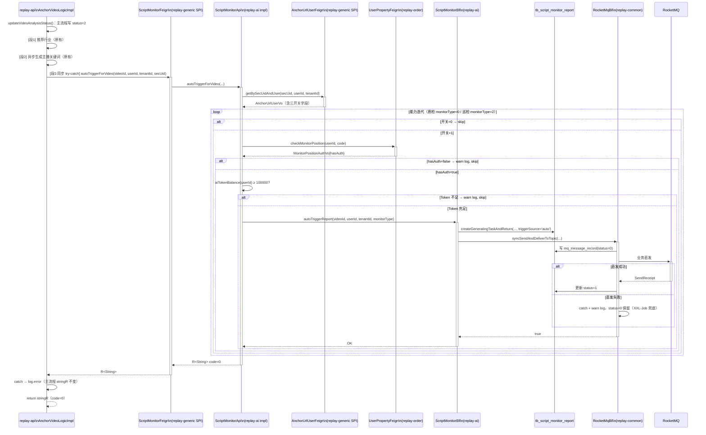
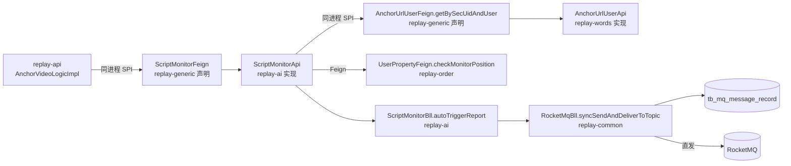

spec_mode: STANDARD
risk: HIGH
frontend-facing: false
module: replay-ai
triggers: [business-arch, tech-arch, data]

---

## 1. Context

- **Business goal:** 录制视频分析完成（status=2）后，自动检查 `anchor_url_user` 三类监控开关（话术质检 / 互动巡检）+ 监控位 `hasAuth` + AI Token ≥ 100000，对每个满足条件的能力立即投递 MQ（业务直发 + XXL-Job 兜底），触发报告异步生成。触发来源以 `trigger_source='auto'` 记入 `tb_script_monitor_report`；手动触发记 `'manual'`。同时借此机会改造 MQ 投递路径：从"只写本地消息表、等 XXL-Job 5 分钟扫"升级为"业务直发 + 失败保留 status=0 让 XXL-Job 兜底"，消除 B4/B7 场景下触发到 AI 生成之间的 5 分钟延迟。
- **Scope of change:**
  - `replay-generic`：新建 `ScriptMonitorFeign.java`（autoTriggerForVideo SPI 声明）；`AnchorUrlUserFeign.java` 追加 `getBySecUidAndUser` 方法
  - `replay-words`：`AnchorUrlUserApi.java` 实现 `getBySecUidAndUser`
  - `replay-ai`：新建 `ScriptMonitorApi.java`（SPI 实现）；`ScriptMonitorBll.java` 新增 `autoTriggerReport` 方法 + `handleExistingAndReturn` 补 `trigger_source` 覆写 + `createGeneratingTaskAndReturn` Builder 补字段 + line 441 改新方法；`ScriptMonitorReportEntity.java` 追加 `triggerSource` 字段
  - `replay-common`：`RocketMqBll.java` 新增 `syncSendAndDeliverToTopic` 方法（业务直发 + 兜底双轨）
  - `replay-api`：`AnchorVideoLogicImpl.java` 在 `updateVideoAnalysisStatus` 末尾追加第三段同步 try-catch
  - DDL：`sql/replay-29.sql`（`ALTER TABLE tb_script_monitor_report ADD COLUMN trigger_source`）
- **Dependencies consulted:**
  - B5 archive（checkMonitorPosition SPI / MonitorPositionAuthVo / hasAuth 语义）
  - B6 archive（三开关写入 / 还原度暂禁规则）
  - `.claude/runs/Change__2026-06-02_b7-auto-trigger/explore_report.md`（8 ACs + Hidden Scope + 3 Open Q）

---

## 2. Domain Model

- **New/updated terms:**
  - `trigger_source`：`tb_script_monitor_report` 新字段，枚举字符串 `'manual'`（手动触发）/ `'auto'`（录制完成自动触发）。历史记录通过 `DEFAULT 'manual'` 填充，语义上保守（历史均为手动触发）。
  - `autoTriggerForVideo(videoId, userId, tenantId, secUid)`：新 Feign SPI 方法，跨模块自动触发入口。`replay-api` 持有 `ScriptMonitorFeign` 引用，调用 `replay-ai` 侧 `ScriptMonitorApi` 实现。
  - `syncSendAndDeliverToTopic`：`RocketMqBll` 新方法，"写表 + 立即直发 + 失败保 status=0" 三步原子化投递。与旧 `syncSendNormalMessageToTopic` 的区别是多了一步 RocketMQ 直发动作。

- **Status machine 变化：** `ScriptMonitorReportEntity` 新增 `triggerSource` 字段，取值 `manual` / `auto`，在创建时写入；`handleExistingAndReturn`（重新触发）覆写为当前触发来源（手动重触发时覆写为 `manual`，自动触发调用时为 `auto`）。其余状态机（NOT_GENERATED / GENERATING / GENERATED / FAILED / NOT_APPLICABLE）不变。

---

## 2.5 Business Architecture

### 2.5.1 Business Flow



### 2.5.2 Business Boundary

- **In scope（B7）：**
  - `ScriptMonitorFeign` / `ScriptMonitorApi`（新 SPI + 实现）
  - `AnchorUrlUserFeign.getBySecUidAndUser` / `AnchorUrlUserApi` 实现
  - `ScriptMonitorBll.autoTriggerReport`（还原度 `FIDELITY_MONITOR` 跳过，纵深防御）
  - `RocketMqBll.syncSendAndDeliverToTopic`（改造投递路径）
  - `ScriptMonitorBll.triggerReport` line 441 改用新方法（B4 手动触发同步受益）
  - `trigger_source` 字段落表（DDL + Entity）
  - `AnchorVideoLogicImpl.updateVideoAnalysisStatus` 第三段同步 try-catch
- **Out of scope（Non-Goals）：**
  - 互动巡检弹幕数据预判（独立批次）
  - 还原度自动触发（B6 已禁开关，B7 仅纵深防御 skip）
  - accountType 校验（B6 `addOrUpdateAnchor` 已守住）
  - trigger_source 暴露给前端 / 接口契约变更
  - `syncSendNormalMessage` 的其余 5 处业务调用改造（登记 TECH-DEBT）
  - Token 预扣（自动触发不预扣，失败直接 skip，无需 D-7 恢复逻辑）

### 2.5.3 Upstream / Downstream

| 方向 | 模块 | 调用点 | 内容流 |
|---|---|---|---|
| 上游（调用方） | replay-api `AnchorVideoLogicImpl` | `ScriptMonitorFeign.autoTriggerForVideo` | videoId/userId/tenantId/secUid |
| 下游 | replay-words `AnchorUrlUserApi` | `AnchorUrlUserFeign.getBySecUidAndUser` | secUid+userId+tenantId → AnchorUrlUserVo（三开关） |
| 下游 | replay-order `UserPropertyApi` | `UserPropertyFeign.checkMonitorPosition` | userId+code → MonitorPositionAuthVo{hasAuth} |
| 下游 | replay-order `UserPropertyApi` | `UserPropertyFeign.getUserProperty` | userId → aiTokenNum 资产 |
| 下游 | RocketMQ | `RocketMqBll.syncSendAndDeliverToTopic` | ScriptMonitorTriggerMsg JSON → MQ 消费侧触发生成 |

### 2.5.4 Business Rules

- **Rule-B7-1（开关前置）：** `autoTriggerReport` 内 `isScriptFidelityMonitor` 对应 `FIDELITY_MONITOR` 永不进入自动触发分支（纵深防御）。
- **Rule-B7-2（hasAuth 门槛）：** 自动触发仅校验 `hasAuth=true`（`totalQuantity>0`），不校验 surplus（与 B5 rule-B5-3 一致）；hasAuth=false → skip + warn log，不抛异常。
- **Rule-B7-3（Token 门槛）：** `aiTokenBalance ≥ 100000` 才触发；不足 → skip + warn log，不抛异常，不影响其他能力和主流程。
- **Rule-B7-4（独立失败）：** 质检与巡检能力独立迭代，一个失败/skip 不阻断另一个。
- **Rule-B7-5（trigger_source 覆写语义）：** 手动重触发（`triggerReport`）时，`handleExistingAndReturn` 中将 `triggerSource` 覆写为 `'manual'`；自动触发（`autoTriggerReport`）时写 `'auto'`。新建报告时按当次触发来源填充。
- **Rule-B7-6（主流程保护）：** `autoTriggerForVideo` 整体异常 → catch + `log.error`，`updateVideoAnalysisStatus` 的 stringR 不变，用户可手动 `triggerReport` 兜底。
- **Rule-B7-7（自动触发不预扣 Token）：** 与手动触发（`withholdAiToken`）不同，自动触发直接调 `autoTriggerReport`，失败靠 skip+log，无预扣恢复负担。
- **Rule-B7-8（MQ 投递双轨）：** `syncSendAndDeliverToTopic` 写表后立即直发；直发失败 catch 保 status=0，由 XXL-Job `scanAndSendMessageJob` 最多 5 分钟后兜底重发，事务不回滚（失败 catch 不再抛）。

---

## 3. API Contract

Not applicable — B7 不暴露任何新 HTTP Controller endpoint；`ScriptMonitorFeign.autoTriggerForVideo` 是同进程 Java SPI（非 HTTP Feign Client），内部接口不纳入前端 API 文档。

---

## 4. Data Model

### 4.1 DDL — sql/replay-29.sql

```sql
/*
 2.6.01 话术智能监控 B7 — 触发来源字段
 
 ALTER TABLE tb_script_monitor_report ADD COLUMN trigger_source
 说明：
   - DEFAULT 'manual' 确保存量历史记录的 trigger_source 填充为 manual（语义保守，历史均为手动触发）
   - 新建记录由业务层按实际触发来源写入 'auto' 或 'manual'
   - NOT NULL + DEFAULT：DDL 执行期间无行锁争用（MySQL 8.0 支持 instant ADD COLUMN）
 
 幂等执行：ALTER TABLE 前用 EXISTS 判断；重复执行跳过。
 
 Target Server Version : MySQL 8.0.39
 File Encoding         : 65001
*/

SET NAMES utf8mb4;
SET FOREIGN_KEY_CHECKS = 0;

-- 幂等守护：字段不存在时才执行 ALTER
SET @sql = IF(
    (SELECT COUNT(*) FROM information_schema.COLUMNS
     WHERE TABLE_SCHEMA = DATABASE()
       AND TABLE_NAME = 'tb_script_monitor_report'
       AND COLUMN_NAME = 'trigger_source') = 0,
    'ALTER TABLE `tb_script_monitor_report`
         ADD COLUMN `trigger_source` VARCHAR(16) NOT NULL DEFAULT ''manual''
         COMMENT ''触发来源 manual手动 auto自动''',
    'SELECT 1'
);
PREPARE stmt FROM @sql;
EXECUTE stmt;
DEALLOCATE PREPARE stmt;

SET FOREIGN_KEY_CHECKS = 1;
```

> DDL 分类：**exposed additive DDL**（既有表 ADD COLUMN，带 DEFAULT 不影响存量行；新字段通过 `ScriptMonitorBll.autoTriggerReport` 写出到业务层，未暴露给前端 HTTP 接口）。按 lifecycle.md DDL 三档定义，本 DDL 本身为 exposed additive，但同时满足跨 ≥3 模块 + 修改 replay-common，故整体 risk=HIGH。

### 4.2 Entity 变更

`ScriptMonitorReportEntity` 新增字段：

```java
/**
 * 触发来源 manual-手动触发 auto-自动触发
 */
@Schema(description = "触发来源 manual-手动触发 auto-自动触发")
private String triggerSource;
```

### 4.3 Index Reasoning

无新索引。`trigger_source` 仅用于报告详情展示和日志，无需索引。

### 4.4 Data Assembly Strategy

- 新建报告：`createGeneratingTaskAndReturn` Builder 在 `.triggerSource(triggerSource)` 字段赋值，由 caller 传入 `"manual"` 或 `"auto"` 字符串常量（可复用两个 `private static final String TRIGGER_SOURCE_MANUAL = "manual"` 常量）。
- 重新触发：`handleExistingAndReturn` 接受 `triggerSource` 参数，在 `exist.setStatus(...)` 之后调用 `exist.setTriggerSource(triggerSource)` 覆写。
- 手动触发（`triggerReport`）：`createGeneratingTaskAndReturn` 入参固定传 `TRIGGER_SOURCE_MANUAL`。
- 自动触发（`autoTriggerReport`）：固定传 `TRIGGER_SOURCE_AUTO`。

### 4.5 Lifecycle

- 软删除：`isDeleted = 1`（手动，禁 `@TableLogic`）
- 租户隔离：`autoTriggerReport` 查询/写入均带 `tenantId`
- `getBySecUidAndUser` 查询带 `tenantId + isRemoveRecord=0`（参考 `getUserAnchorBySecUid` 现有范式）

---

## 5. Business Logic

### 5.1 ScriptMonitorApi.autoTriggerForVideo（新建 SPI 实现）

**调用来源：** `AnchorVideoLogicImpl` 第三段同步 try-catch

**步骤：**

1. 调 `anchorUrlUserFeign.getBySecUidAndUser(secUid, userId, tenantId)` — 不存在（R.error）→ `log.warn` + 直接返回（跳过所有能力）
2. 取 `AnchorUrlUserVo` 中的三开关字段
3. **能力迭代**（还原度 FIDELITY_MONITOR 永不进入，纵深防御）：

   对 `QUALITY_INSPECTION`（monitorType=0，开关字段 `isScriptQualityInspection`）：
   - 若开关=0 → skip（不打 log）
   - 若开关=1 → 调 `userPropertyFeign.checkMonitorPosition(userId, "scriptQualityNum")` → `hasAuth=false` → `log.warn` + skip
   - `hasAuth=true` → 调 `aiTokenBalance(userId)` — < 100000 → `log.warn` + skip
   - Token 充足 → 调 `scriptMonitorBll.autoTriggerReport(videoId, userId, tenantId, monitorType=0)`
   
   对 `INTERACTION_PATROL`（monitorType=2，开关字段 `isInteractionPatrol`）：同上逻辑，`code="interactionPatrolNum"`

4. 返回 `R.ok("auto trigger done")`（调用方 catch 块关注 exception，不关注 body）

> `aiTokenBalance` 私有方法复用 `ScriptMonitorBll` 内已有实现，但 `ScriptMonitorApi` 作为独立 `@Service` 类，需注入 `UserPropertyFeign` 并复制同款私有方法（或提取到 `ScriptMonitorBll` 的 public/package 方法）。推荐：在 `ScriptMonitorApi` 直接注入 `ScriptMonitorBll` 并委托调用，避免重复实现。

### 5.2 ScriptMonitorBll.autoTriggerReport（新增方法）

**入参：** `videoId: String, userId: Long, tenantId: Long, monitorType: Integer`

**前提：** 已在 `ScriptMonitorApi` 侧完成开关 + hasAuth + Token 三道校验；`autoTriggerReport` 仅负责报告创建 + MQ 投递，不再重复校验。

**步骤：**

1. 构造 `TriggerReportBo`：`sourceType=0, sceneType=1, sourceId=videoId, monitorType=monitorType`（与手动触发相同字段，复用 `findReport` / `createGeneratingTaskAndReturn`）
2. 查现有报告 `existBefore = findReport(tenantId, bo)`
3. 若 `existBefore != null` 且 status=GENERATING → `log.warn` + 直接返回（防重复）
4. `report = createGeneratingTaskAndReturn(userId, tenantId, bo, existBefore, TRIGGER_SOURCE_AUTO)`
   - `createGeneratingTaskAndReturn` 新增 `triggerSource` 入参（原 `triggerReport` 调用改传 `TRIGGER_SOURCE_MANUAL`）
5. 解析 `tag = resolveMqTag(monitorType)`（复用现有私有方法）
6. 构造 `ScriptMonitorTriggerMsg`（**不含 `withhold`**，自动触发不预扣 Token，`withhold=null`）
7. `messageKey = IdUtil.simpleUUID()`
8. `boolean sent = rocketMqBll.syncSendAndDeliverToTopic(userId, topic, tag, messageKey, JSON.toJSONString(msg))`
9. `sent=false` → `log.error` + 返回（**不抛异常**，让外层 `ScriptMonitorApi` catch 后 warn log）

> `autoTriggerReport` 不加 `@Transactional`（`createGeneratingTaskAndReturn` 内部调 `save/updateById` 本身未标注事务；MQ 写表由 `syncSendAndDeliverToTopic` 内含 `@Transactional` 覆盖）。若需原子性，把整个 `autoTriggerReport` 包进 `@Transactional(rollbackFor = Exception.class)` 中，但注意 `syncSendAndDeliverToTopic` 的直发失败 catch 会吞异常不回滚——这是预期行为（写表成功但发送失败，让 XXL-Job 兜底）。

### 5.3 RocketMqBll.syncSendAndDeliverToTopic（新增方法）

```java
/**
 * 写本地消息表并立即业务直发 MQ；直发失败保留 status=0 等 XXL-Job 兜底重试。
 *
 * <p>区别于 {@code syncSendNormalMessageToTopic}（只写表不发送），本方法在
 * 事务内写表后立即调用 {@code rocketMQClientTemplate.syncSendNormalMessage}。
 * 直发失败时 catch 吞异常（warn log），事务提交保留 status=0 供 XXL-Job 兜底。</p>
 *
 * @param userId     用户 ID（写入 mq_message_record.user_id）
 * @param topic      目标 topic（覆盖默认值）
 * @param messageTag 消息标签
 * @param messageKey 消息唯一 key（IdUtil.simpleUUID() 生成）
 * @param body       消息体 JSON
 * @return 写本地消息表是否成功（true=写表成功；直发结果不影响返回值）
 */
@Transactional(rollbackFor = Exception.class)
public boolean syncSendAndDeliverToTopic(Long userId, String topic, String messageTag,
                                          String messageKey, String body) {
    // 1. 写本地消息表（status=0 待发送）
    MqMessageRecordEntity record = new MqMessageRecordEntity();
    record.setId(SnowflakeManager.nextValue());
    record.setUserId(userId);
    record.setMessageTopic(topic);
    record.setMessageTag(messageTag);
    record.setMessageKey(RocketMQUtil.toRocketHeaderKey(messageKey));
    record.setMessageBody(body);
    record.setMessageStatus((byte) 0);
    record.setDelaySendTime(null);
    record.setCreateDate(LocalDateTime.now());
    record.setUpdateDate(LocalDateTime.now());
    record.setRetryCount(0);
    boolean saved = mqMessageRecordService.save(record);
    if (!saved) {
        return false;
    }
    // 2. 业务直发（写表事务已提交后立即发送；失败不回滚，XXL-Job 兜底）
    try {
        Message<String> message = MessageBuilder.withPayload(body)
                .setHeader(RocketMQUtil.toRocketHeaderKey(RocketMQHeaders.KEYS), record.getMessageKey())
                .build();
        String destination = topic + ":" + messageTag;
        SendReceipt receipt = rocketMQClientTemplate.syncSendNormalMessage(destination, message);
        record.setMessageId(receipt.getMessageId().toString());
        record.setMessageStatus((byte) 1);
        record.setUpdateDate(LocalDateTime.now());
        mqMessageRecordService.updateById(record);
        log.info("[MQ 直发] 成功 messageKey={} messageId={}", messageKey, receipt.getMessageId());
    } catch (Exception e) {
        log.warn("[MQ 直发] 失败，status=0 保留等 XXL-Job 兜底重试 messageKey={}", messageKey, e);
        // 直发失败不抛，不回滚，事务提交 status=0
    }
    return true;
}
```

> `RocketMqBll` 现有风格为 `@Resource` 注入（`replay-common` 遗留），B7 在此文件新增 `rocketMQClientTemplate` 注入**镜像 `@Resource` 风格**（外科手术原则），在 `[Issues Found]` 标注技术债。

### 5.4 AnchorVideoLogicImpl — 第三段挂载

在 line 1066（第二段 try-catch 的右括号 `}`）**之后**、`return stringR;`（line 1068）**之前**，插入：

```java
// 录制完成时自动触发话术质检/互动巡检报告生成（B7）
if (stringR.getCode() == 0 && updateVideoAnalysisStatusBo.getAnalysisStatus() == 2) {
    try {
        AnchorVideoInfoVo videoInfo = ResultUtil.getResult(anchorVideoBll.infoByVideoId(updateVideoAnalysisStatusBo.getVideoId()));
        if (videoInfo != null && ObjectUtil.isNotEmpty(videoInfo.getSecUid())) {
            scriptMonitorFeign.autoTriggerForVideo(
                    updateVideoAnalysisStatusBo.getVideoId(),
                    user.getId(),
                    user.getActiveTenantId(),
                    videoInfo.getSecUid());
        }
    } catch (Exception e) {
        log.error("[B7 自动触发] 失败 videoId={}", updateVideoAnalysisStatusBo.getVideoId(), e);
    }
}
```

> `videoInfo` 查询复用第二段已有的 `anchorVideoBll.infoByVideoId` 调用。若第二段与第三段先后执行，可考虑将 videoInfo 提取到外层变量复用（避免两次 DB 查询）。实现时由 `@lead-engineer` 判断是否值得提取。
>
> `scriptMonitorFeign` 为 `ScriptMonitorFeign` 类型，注入风格参照 `AnchorVideoLogicImpl` 现有字段注入风格（该类 DI 待 `@lead-engineer` 确认；若全部为构造器注入则加入构造器参数，若混合 `@Autowired` 则镜像现有风格）。

### 5.5 triggerReport line 441 — 改为新方法

```java
// 现有（line 441）:
boolean sent = rocketMqBll.syncSendNormalMessageToTopic(
        user.getId(), scriptMonitorMqProperties.getTopic(), tag, messageKey, JSON.toJSONString(msg));

// 改为:
boolean sent = rocketMqBll.syncSendAndDeliverToTopic(
        user.getId(), scriptMonitorMqProperties.getTopic(), tag, messageKey, JSON.toJSONString(msg));
```

这样手动触发（B4 triggerReport）也受益于业务直发，消除 5 分钟延迟。旧方法 `syncSendNormalMessageToTopic` 保留不动（其余 5 处调用方不受影响）。

### 5.6 Branches & Exceptions

| 场景 | 表现 |
|---|---|
| status=2 + 质检开关=1 + hasAuth=true + Token≥10万 | 触发质检任务（trigger_source=auto），直发 MQ，秒级开始 AI 生成 |
| status=2 + 巡检开关=1 + 巡检 hasAuth + Token 充足 | 触发巡检任务，独立处理（一个失败不阻断另一个） |
| 任一能力 hasAuth=false / Token 不足 | skip + warn log，不影响其他能力 |
| 还原度开关=1（B6 已禁，B7 纵深防御） | 永不触发 |
| autoTriggerForVideo 整体异常 | catch + log.error，主流程返回 code=0 不变 |
| 用户手动重触发已 GENERATED 报告 | trigger_source 覆写为 'manual'（handleExistingAndReturn） |
| MQ 直发失败 | catch warn log，保留 status=0，XXL-Job 5 分钟内兜底重发 |
| anchor_url_user 记录不存在（secUid 查不到） | warn log，跳过所有能力，不影响主流程 |
| GENERATING 状态重复自动触发 | warn log + skip（防重复提交） |

### 5.7 Idempotency / Replay Safety

- `autoTriggerForVideo` 整体在同步 try-catch 中，调用方不会并发重入（同一 videoId 同一次 status 更新只触发一次）。
- `createGeneratingTaskAndReturn` 已有 `DuplicateKeyException` 兜底（uk_tenant_source_monitor），并发安全。
- `syncSendAndDeliverToTopic` 写表用 SnowflakeID，天然幂等；直发失败 XXL-Job 重发时 messageKey 不变，MQ 消费侧需处理幂等（消费侧逻辑 B7 不涉及）。

---

## 5.5 Technical Architecture

### 5.5.1 Module Topology



> 所有「同进程 SPI」均为 Spring Bean 同进程调用（`replay-api` 是聚合启动模块，所有业务模块 Bean 在同一 ApplicationContext），不跨 JVM。

### 5.5.2 Cross-Module Communication

| 通道 | From → To | 契约 | 失败处理 |
|---|---|---|---|
| 同进程 SPI | AnchorVideoLogicImpl → ScriptMonitorApi | `ScriptMonitorFeign.autoTriggerForVideo(String,Long,Long,String) → R<String>` | catch + log.error，主流程不受影响 |
| 同进程 SPI | ScriptMonitorApi → AnchorUrlUserApi | `AnchorUrlUserFeign.getBySecUidAndUser(String,Long,Long) → R<AnchorUrlUserVo>` | R.error → warn + skip |
| 同进程 SPI | ScriptMonitorApi → UserPropertyApi | `UserPropertyFeign.checkMonitorPosition(Long,String) → MonitorPositionAuthVo` | 抛异常 → 外层 catch |
| 同进程 Bll | ScriptMonitorApi → ScriptMonitorBll | `autoTriggerReport(String,Long,Long,Integer)` | 失败 → log |
| 同模块方法 | ScriptMonitorBll → RocketMqBll | `syncSendAndDeliverToTopic(...)` | 直发失败 catch warn，status=0 保 |

### 5.5.3 Async Tasks

- `syncSendAndDeliverToTopic` 直发 MQ 是同步阻塞调用（`syncSendNormalMessage`），但耗时通常 < 50ms，对主流程同步 try-catch 链路可接受。
- XXL-Job `scanAndSendMessageJob` 每 5 分钟扫 status=0 记录作为兜底，不受 B7 改动影响（其扫描逻辑不变）。

### 5.5.4 Cache Strategy

无新缓存。`checkMonitorPosition` 内部走 Redis 缓存（replay-order 维护），`getUserProperty` 同样，B7 不介入。

### 5.5.5 Transaction Boundary

| 方法 | 事务 | 说明 |
|---|---|---|
| `syncSendAndDeliverToTopic` | `@Transactional(rollbackFor = Exception.class)` | 写 mq_message_record 在事务内；直发 MQ 的 catch 不抛，事务提交 status=0 |
| `autoTriggerReport` | 无 `@Transactional` | 创建报告行 + 调 MQ 方法；异常由调用方 catch |
| `handleExistingAndReturn` | 无（调用 `reportService.updateById`，MyBatis-Plus 本身提交单语句事务） | — |
| `createGeneratingTaskAndReturn` | 无 | `reportService.save` 单语句提交 |
| `AnchorUrlUserApi.getBySecUidAndUser` | 无（只读） | — |

### 5.5.6 Observability

- `autoTriggerForVideo` 入口：`log.info("[B7 自动触发] 开始 videoId={} userId={} tenantId={}", ...)`
- 开关=0 skip：不打 log（噪音）
- hasAuth=false skip：`log.warn("[B7 自动触发] hasAuth=false monitorType={} userId={}", ...)`
- Token 不足 skip：`log.warn("[B7 自动触发] Token 不足 monitorType={} balance={} userId={}", ...)`
- 报告创建成功：`log.info("[B7 自动触发] 报告已创建 reportId={} monitorType={} triggerSource=auto", ...)`
- MQ 直发成功：`log.info("[MQ 直发] 成功 messageKey={} messageId={}", ...)`
- MQ 直发失败：`log.warn("[MQ 直发] 失败，status=0 保留等 XXL-Job 兜底重试 messageKey={}", ...)`
- 主流程 catch：`log.error("[B7 自动触发] 失败 videoId={}", ..., e)`

---

## 6. Non-Functional Constraints (Hard Constraints)

供 `@lead-engineer` Implement 阶段遵循：

- **构造器注入（新建类）：** `ScriptMonitorApi`、`AnchorUrlUserApi`（已有 `@RequiredArgsConstructor`）新增字段均走构造器注入。
- **DI 风格镜像（改存量类）：** `RocketMqBll` 现有 `@Resource` 注入风格 → `rocketMQClientTemplate` 同用 `@Resource`，在 `[Issues Found]` 标注技术债。`AnchorVideoLogicImpl` 现有 DI 风格（待 `@lead-engineer` 确认）→ `scriptMonitorFeign` 镜像周围风格。
- **Controller 返回 `R<T>`：** `ScriptMonitorFeign.autoTriggerForVideo` 返回 `R<String>`；`AnchorUrlUserFeign.getBySecUidAndUser` 返回 `R<AnchorUrlUserVo>`（与 `getByIdAndTenantId` 保持一致）。禁裸返业务对象。
- **ID 生成：** `SnowflakeManager.nextValue()`；Entity `@TableId(type = IdType.INPUT)`（`ScriptMonitorReportEntity` 已满足，`MqMessageRecordEntity` 已满足）。
- **跨模块调用走 `replay-generic` Feign：** `ScriptMonitorFeign` / `AnchorUrlUserFeign` 声明在 `replay-generic`，实现分别在 `replay-ai` / `replay-words`，禁跨模块直连 Dao。
- **LambdaQueryWrapper 类型安全：** `AnchorUrlUserApi.getBySecUidAndUser` 查询用 `LambdaQueryWrapper`（参考 `getByIdAndTenantId` 现有写法）。
- **软删除：** 手动 `isDeleted = 1`，禁 `@TableLogic`；`getBySecUidAndUser` 查询加 `isRemoveRecord=0`（参考 `getUserAnchorBySecUid` 范式，该表软删除字段为 `isRemoveRecord`）。
- **时间戳：** `createDate / updateDate` 手动 `new Date()`（Entity 已用 `Date` 类型，与现有风格一致）。
- **列表查询带 tenantId：** `getBySecUidAndUser` 查询必须包含 `tenantId` 过滤；`autoTriggerReport` 内 `findReport` 传 tenantId（已有实现）。
- **SQL 占位符：** `#{}` 禁 `${}`（本批次无 XML SQL，使用 LambdaQueryWrapper）。
- **写方法 `@Transactional`：** `syncSendAndDeliverToTopic` 必须加 `@Transactional(rollbackFor = Exception.class)`；`autoTriggerReport` 评估是否需要（见 §5.2 说明）。
- **禁 `@TableLogic`：** 已内化为软删除手动设置。
- **DDL 幂等：** `sql/replay-29.sql` 必须使用 IF EXISTS 判断守护，格式参照 `replay-28.sql`。
- **MQ 直发失败不回滚（重要）：** `syncSendAndDeliverToTopic` 中直发 catch 块不能 rethrow，事务必须提交保留 status=0；违反此约束会导致 XXL-Job 兜底失效（status 回滚后 XXL-Job 扫不到）。
- **`syncSendNormalMessage` 5 处旧调用不动：** 仅 `triggerReport` line 441 迁移到新方法；其余业务调用方（邀请 / 首单邮件 / 敏感词等）登记 TECH-DEBT，不在本批次改。

---

## 7. Acceptance Criteria

| AC-id | Given | When | Then |
|---|---|---|---|
| AC-001 | `isScriptQualityInspection=1`，`checkMonitorPosition("scriptQualityNum").hasAuth=true`，`aiTokenBalance ≥ 100000` | 视频 status 更新为 2，触发 `autoTriggerForVideo` | `tb_script_monitor_report` 新增（或重置）一条 `monitorType=0, status=GENERATING, trigger_source='auto'` 记录；mq_message_record 写入 status=1（直发成功）或 status=0（直发失败待 XXL-Job）；接口返回 `R<String>` code=0 |
| AC-002 | `isInteractionPatrol=1`，`checkMonitorPosition("interactionPatrolNum").hasAuth=true`，Token 充足 | `autoTriggerForVideo` 被调用 | `tb_script_monitor_report` 新增 `monitorType=2, trigger_source='auto'` 记录；不受质检结果影响（两能力独立，一个失败不阻断另一个） |
| AC-003 | `tb_script_monitor_report` 中 B7 部署前的历史记录 | 执行 DDL `sql/replay-29.sql` | 历史记录 `trigger_source='manual'`；手动触发 `triggerReport` 新建记录 `trigger_source='manual'` |
| AC-004 | `isScriptQualityInspection=0`，`isInteractionPatrol=0` | `autoTriggerForVideo` 被调用 | 不调用 `checkMonitorPosition`，不创建任何报告记录，方法静默返回 |
| AC-005 | `isScriptQualityInspection=1`，但 `checkMonitorPosition("scriptQualityNum").hasAuth=false` | `autoTriggerForVideo` 被调用 | 跳过质检能力，打印 `log.warn`，不抛 BusinessException，不影响巡检能力处理 |
| AC-006 | `isScriptQualityInspection=1`，`hasAuth=true`，但 `aiTokenBalance < 100000` | `autoTriggerForVideo` 被调用 | 跳过质检能力，打印 `log.warn`，`updateVideoAnalysisStatus` 正常返回 code=0 |
| AC-007 | `autoTriggerForVideo` 内部抛 RuntimeException（如 Feign 调用超时） | 调用方 catch 块捕获 | `log.error` 记录异常，`updateVideoAnalysisStatus` 主流程 status 已写 2，返回 code=0 不变 |
| AC-008 | `isScriptFidelityMonitor=1`（B6 已禁，此处纵深防御） | `autoTriggerForVideo` 执行 | 跳过还原度（代码层 `FIDELITY_MONITOR` 不进入自动触发分支），无报告创建，无异常 |

---

## 8. Frontend Contract Publishing

`frontend-facing: false`

B7 不新增 HTTP Controller endpoint；`trigger_source` 字段为后端内部字段，本批次不暴露给前端。无需 `@frontend-api-doc-writer` 介入。

---

## 9. Architecture Decision Records

### ADR-B7-001：MQ 投递改造 — 业务直发 + XXL-Job 双轨

**Status:** proposed

**Context:**
现有 `syncSendNormalMessageToTopic` 只写本地消息表（status=0），由 XXL-Job `scanAndSendMessageJob` 每 5 分钟扫一次发送——这是唯一的 MQ 发送路径，不是兜底。导致手动 `triggerReport` 和 B7 自动触发后最多等待 5 分钟 AI 才开始生成，用户体验差。B7 引入 `syncSendAndDeliverToTopic`：写表后立即直发，直发失败保留 status=0 让 XXL-Job 兜底。

**Decision:**
在 `RocketMqBll` 新增 `syncSendAndDeliverToTopic` 方法，写表后立即调用 `rocketMQClientTemplate.syncSendNormalMessage` 直发 MQ；直发失败时 catch warn log + 保留 status=0（事务提交），由现有 XXL-Job `scanAndSendMessageJob` 在 5 分钟内兜底重发。旧 `syncSendNormalMessage(ToTopic)` 方法不动，其余 5 处业务调用方（邀请/首单邮件/敏感词）登记 TECH-DEBT 待后续评估。

**Alternatives Considered:**

*方案 A（选中）：写表 + 立即直发 + 失败保 status=0*
- Pros：业务直发秒级触发 AI 生成；失败有 XXL-Job 兜底，无消息丢失；改动最小（新增一个方法，不动旧路径）
- Cons：RocketMqBll 需注入 `rocketMQClientTemplate`（现有 `replay-api.MessageSenderTasks` 才持有）；`@Transactional` 内部直发可能存在"事务提交前消息已发出"的顺序问题（但 MQ 消费侧幂等可兜底）
- Failure conditions：RocketMQ Broker 不可达时直发必失败，依赖 XXL-Job 兜底；若 XXL-Job 也挂则消息积压直到恢复
- Complexity：低，新增约 40 行，不改存量路径
- Why not variants：纯替换旧方法（改 5+ 处调用方）风险更高；引入独立线程池异步直发无必要（MQ 直发 < 50ms）

*方案 B：Transactional Outbox + CDC（Debezium 监听 binlog）*
- Pros：彻底解耦，秒级且高可靠；标准 outbox pattern
- Cons：需引入 Debezium / Canal 等 CDC 组件，基础设施改动大；B7 场景下过度设计
- Failure conditions：CDC 组件宕机则消息停发
- Complexity：高，需新增基础设施 + 配置 + 监控
- Why not chosen：B7 是特定业务批次，不值得为此引入整套 CDC 基础设施

*方案 C：纯 XXL-Job 维持现状 + 缩短扫描间隔（30s）*
- Pros：零代码变更（只改 XXL-Job 配置）
- Cons：30s 延迟仍不理想；高频扫描增加 DB 压力；不能从根本上消除延迟
- Failure conditions：XXL-Job 节点全部宕机则消息永不发送
- Complexity：极低但不解决问题
- Why not chosen：延迟 30s 对实时感仍差；业务核心路径依赖 Job 调度不合理

**Consequences:**
- Positive：手动触发和自动触发均秒级到达 RocketMQ Consumer，AI 生成时效性显著提升
- Negative：`RocketMqBll` 新增 `rocketMQClientTemplate` 依赖（`replay-common` 原无此依赖，需确认 pom 是否已含 `rocketmq-spring-boot-starter`）
- Risks：`@Transactional` 内直发 MQ 存在"DB 提交前消息已到 Consumer"的顺序问题。缓解：Consumer 侧 `findReport` 查不到报告行时做 1-3 次重试即可（现有 Consumer 侧应已有 report 存在的校验）。

---

### ADR-B7-002：自动触发走纯同步路径 — 不引入 Java 线程池

**Status:** proposed

**Context:**
explore_report Open Q-1 问"线程池复用 vs 新建"。初始构想是在 `AnchorVideoLogicImpl` 第三段用 `ExecutorUtil.getXxxExecutor().execute(...)` 异步执行 `autoTriggerForVideo`，避免增加主流程耗时。经主上下文重新审视：`autoTriggerForVideo` 内部（查 DB + 写 report + 写 mq_message_record + 直发 MQ）整体约 100ms；`updateVideoAnalysisStatus` 主流程本身已是 200-500ms；100ms 同步代价可接受。

**Decision:**
B7 不引入任何 Java 线程池。第三段以同步 try-catch 调用 `scriptMonitorFeign.autoTriggerForVideo(...)`；整体异常 catch + log.error，主流程返回值不变。`ExecutorUtil` 不改动。

**Alternatives Considered:**

*方案 A（选中）：纯同步 try-catch*
- Pros：无队列满/无静默丢弃/无线程池配置；异常传播清晰（catch 在调用方）；代码最简（5 行）；调试链路完整
- Cons：在极端情况下（RocketMQ 直发超时 5s）会拉长主流程响应时间；但直发失败会被 catch 吞掉，不阻断 return
- Failure conditions：`autoTriggerForVideo` 阻塞（如 DB 死锁、Feign 超时）可能拉长主流程，但 Feign 本身有 timeout 配置（通常 3s），总体可接受
- Complexity：极低
- Why not variants：主流程本身已有 2 段异步（ExecutorUtil.execute），第三段走同步不破坏整体结构一致性（前两段异步有自己的原因：AI 关键词生成耗时数秒，必须异步）

*方案 B：复用 `ExecutorUtil.getAnchorKeywordTaskExecutor()`（core=4, max=4, queue=64, DiscardPolicy）*
- Pros：与第二段风格一致；不延长主流程
- Cons：DiscardPolicy 在线程池满时静默丢弃任务——对质检/巡检自动触发不可接受（丢失任务无任何记录）；该线程池语义绑定到"关键词生成"，混用语义不清
- Failure conditions：线程池满（core=4 全忙）时新触发任务被静默抛弃，无日志，无告警，无重试
- Complexity：低，但引入静默丢弃风险
- Why not chosen：DiscardPolicy 对质检任务不可接受；同步路径已足够（100ms 可接受）

*方案 C：新建 `getScriptMonitorAutoTriggerExecutor()`（ExecutorUtil 新方法）*
- Pros：独立线程池，CallerRunsPolicy 可避免静默丢弃；主流程不阻塞
- Cons：修改 `replay-common` 的 `ExecutorUtil`（扩大改动范围）；线程池配置决策推迟到实现阶段；对 100ms 同步代价来说过度工程
- Failure conditions：线程池配置不当（队列过小）仍可能丢弃
- Complexity：中，需新增方法 + 配置 + 调整 Allowed Scope
- Why not chosen：YAGNI——100ms 可接受，同步已够用，引入新线程池增加复杂度无必要收益

**Consequences:**
- Positive：改动范围最小（B7 不动 `ExecutorUtil`，不修改 `replay-common` 仅因线程池）；逻辑透明，异常可追踪
- Negative：主流程 P99 可能被 `autoTriggerForVideo` 内的 DB/Feign 调用拉长（最坏情况 +100ms）
- Risks：若 `syncSendAndDeliverToTopic` 直发 RocketMQ 超时（默认 3s）且被 `autoTriggerForVideo` 外层 catch 捕获，本次触发丢失（不进 mq_message_record）。缓解：`syncSendAndDeliverToTopic` 内部 try-catch 先保写表，直发失败后 catch warn log 不抛，保证消息表有记录供 XXL-Job 兜底。因此即使直发超时，消息表已写入，不丢失。

---

## Allowed Scope

```
# replay-generic（SPI 声明，新建 + 修改）
replay-generic/src/main/java/com/jiuyu/replay/generic/feign/words/ScriptMonitorFeign.java        [新建]
replay-generic/src/main/java/com/jiuyu/replay/generic/feign/words/AnchorUrlUserFeign.java         [修改，追加 getBySecUidAndUser]

# replay-words（SPI 实现，修改）
replay-words/src/main/java/com/jiuyu/replay/words/api/AnchorUrlUserApi.java                       [修改，实现 getBySecUidAndUser]

# replay-ai（SPI 实现 + BLL 新方法 + Entity 新字段）
replay-ai/src/main/java/com/jiuyu/replay/ai/api/ScriptMonitorApi.java                             [新建]
replay-ai/src/main/java/com/jiuyu/replay/ai/bll/ScriptMonitorBll.java                             [修改，新增 autoTriggerReport + handleExistingAndReturn 补参 + createGeneratingTaskAndReturn 补参 + line 441 改新方法]
replay-ai/src/main/java/com/jiuyu/replay/ai/entity/ScriptMonitorReportEntity.java                 [修改，追加 triggerSource 字段]

# replay-common（基础设施，修改）
replay-common/src/main/java/com/jiuyu/replay/common/bll/RocketMqBll.java                          [修改，新增 syncSendAndDeliverToTopic + 注入 rocketMQClientTemplate]

# replay-api（挂载点，修改）
replay-api/src/main/java/com/jiuyu/replay/api/logic/words/impl/AnchorVideoLogicImpl.java          [修改，追加第三段同步 try-catch ~15 行 + 注入 ScriptMonitorFeign]

# DDL
sql/replay-29.sql                                                                                  [新建]
```

---

## 做什么 / 为什么

**现状：** 视频录制完成（status=2）后，系统只触发推荐行业和主播关键词生成两个动作；话术质检/互动巡检报告需用户手动点击 triggerReport 才能生成，且手动触发后最长等待 5 分钟（XXL-Job 扫描间隔）AI 才开始工作。`tb_script_monitor_report` 无 `trigger_source` 字段，无法区分触发来源。

**需要：** 录制完成时自动检查各能力授权情况并立即触发报告生成；业务直发 MQ（秒级到达 AI 生成），XXL-Job 作为兜底。`trigger_source` 字段落表，记录触发来源供后续分析。

**范围：** 5 个模块（generic / words / ai / common / api），9 个文件（3 新建 + 5 修改 + 1 DDL），Risk=HIGH（跨 5 模块 + 修改 replay-common 基础设施 + replay-ai 核心业务路径）。

## 怎么做

**核心思路：** SPI 分层 + 纯同步挂载 + MQ 双轨投递。

1. **新建 ScriptMonitorFeign（replay-generic）：** 声明 `autoTriggerForVideo` 方法，作为 replay-api → replay-ai 的跨模块调用契约。
2. **新建 ScriptMonitorApi（replay-ai）：** 实现 SPI，内部按 secUid 查开关 → 逐能力校验 hasAuth + Token → 调 Bll 创建任务 + 投递 MQ。
3. **新增 AnchorUrlUserFeign.getBySecUidAndUser：** 按 (secUid, userId, tenantId) 三元组查 `anchor_url_user`，AnchorUrlUserApi 实现（参考 B5 的 `getByIdAndTenantId`）。
4. **ScriptMonitorBll.autoTriggerReport：** 复用 `createGeneratingTaskAndReturn` + `resolveMqTag`，新增 `trigger_source` 参数传入；`triggerReport` line 441 改为新 `syncSendAndDeliverToTopic` 方法（手动触发同步受益）。
5. **RocketMqBll.syncSendAndDeliverToTopic：** 写表 + 立即直发 + 失败 catch warn，事务提交 status=0 留 XXL-Job 兜底。
6. **AnchorVideoLogicImpl 第三段：** 在现有两段之后追加纯同步 try-catch，调 `scriptMonitorFeign.autoTriggerForVideo`。
7. **DDL：** `sql/replay-29.sql` 幂等 `ALTER TABLE`，DEFAULT='manual'。

## 需要你确认的

- [ ] `replay-common` 的 pom.xml 是否已引入 `rocketmq-spring-boot-starter`（`RocketMqBll` 需注入 `rocketMQClientTemplate`）？还是需要在 pom.xml 中追加依赖？（如需追加，pom.xml 应加入 Allowed Scope）
- [ ] `AnchorVideoLogicImpl` 的 DI 风格是构造器注入还是 `@Autowired`/`@Resource`？`ScriptMonitorFeign` 注入应镜像周围风格（lead-engineer 实现时需确认）。
- [ ] `autoTriggerReport` 是否需要加 `@Transactional`？当前设计不加（创建报告 + 写 mq_message_record 分属两个独立事务），若需原子性可加，但会影响直发失败 catch 行为（见 §5.2 说明）。
