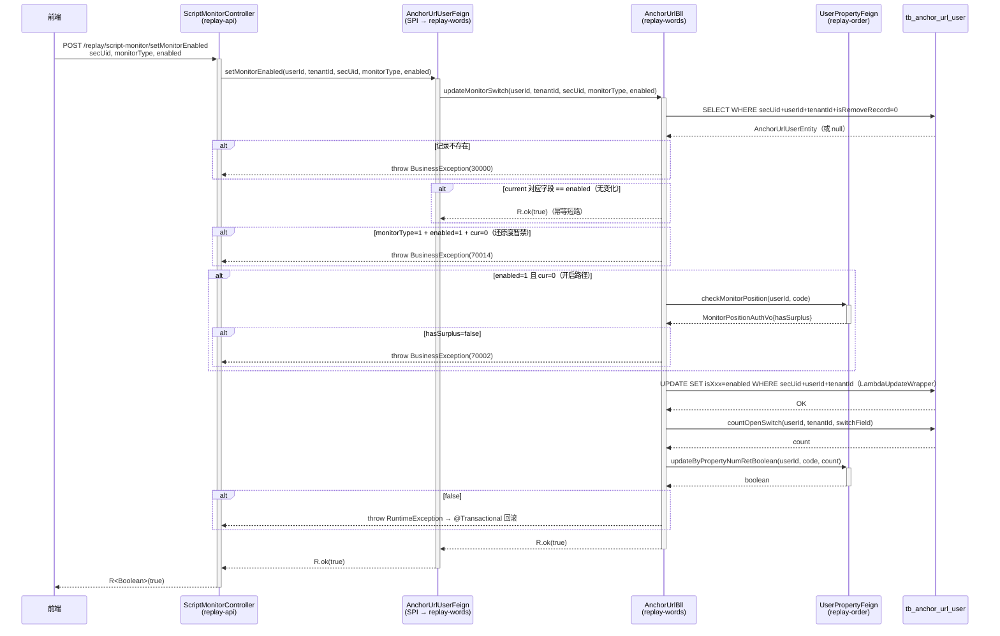
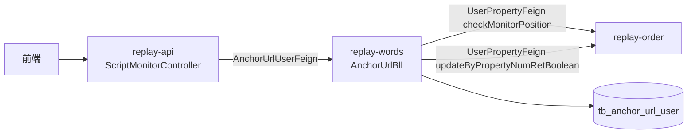

spec_mode: STANDARD
risk: MEDIUM
frontend-facing: true
module: replay-words
triggers: [api, business-arch, tech-arch]

---

## 1. Context

- **Business goal:** 为前端提供独立的单能力 AI 监控开关切换接口，支持按 secUid + monitorType + enabled 精细操作，避免调用 addOrUpdateAnchor 全量覆盖时的误写风险。
- **Scope of change:**
  - `replay-generic/.../feign/words/AnchorUrlUserFeign.java` — 新增 `setMonitorEnabled` Feign SPI 方法
  - `replay-words/.../api/AnchorUrlUserApi.java` — 实现 `setMonitorEnabled`，委托 `AnchorUrlBll`
  - `replay-words/.../bll/AnchorUrlBll.java` — 新增 `updateMonitorSwitch` 业务方法（4 步校验 + 写库 + 占用更新）
  - `replay-api/.../controller/words/ScriptMonitorController.java` — 新增 `POST /replay/script-monitor/setMonitorEnabled` endpoint
- **Dependencies consulted:** 本次仅读源码，未读 wiki 文件（见 explore_report.md § Wiki Sources Consulted）
- **Explorer hand-off:** `.claude/runs/Change__2026-06-02_b8-set-monitor-enabled/explore_report.md`

---

## 2. Domain Model

Not applicable — B8 不引入新业务术语或状态机。`MonitorTypeEnum`（QUALITY_INSPECTION=0 / FIDELITY_MONITOR=1 / INTERACTION_PATROL=2）已存在，三开关字段（`isScriptQualityInspection` / `isScriptFidelityMonitor` / `isInteractionPatrol`）已在 `tb_anchor_url_user` 落表（B5），无枚举更新。

---

## 2.5 Business Architecture

### 2.5.1 Business Flow



### 2.5.2 Business Boundary

- **In scope（replay-words 负责）：** 单字段写库（LambdaUpdateWrapper）、4 步校验编排（短路 / 暂禁 / 授权量校验 / 占用更新）。
- **Out of scope：**
  - 还原度功能实现（B3）
  - 改 `addOrUpdateAnchor` 逻辑（B6 保持）
  - `updateBarrageMonitoring`（弹幕监控独立）
  - Token 校验（用户拍板 B8 不校）
  - accountType 切换保护（toggle 不动 accountType，N/A）
- **Boundary contract：** replay-api → replay-words 走 `AnchorUrlUserFeign` SPI；replay-words → replay-order 走 `UserPropertyFeign`（checkMonitorPosition + updateByPropertyNumRetBoolean）。

### 2.5.3 Upstream / Downstream

| Direction | System / Module | Touchpoint | What flows |
|---|---|---|---|
| Upstream | 前端 / replay-api | `ScriptMonitorController.setMonitorEnabled` | secUid, monitorType, enabled |
| Upstream | replay-api → replay-words | `AnchorUrlUserFeign.setMonitorEnabled` | userId, tenantId, secUid, monitorType, enabled |
| Downstream | replay-words → replay-order | `UserPropertyFeign.checkMonitorPosition(userId, code)` | MonitorPositionAuthVo{hasSurplus} |
| Downstream | replay-words → replay-order | `UserPropertyFeign.updateByPropertyNumRetBoolean(userId, code, count)` | boolean |

### 2.5.4 Business Rules

- Rule 1：**幂等短路** — current 对应字段 == enabled（0→0 / 1→1），直接返 R.ok，不写库、不动占用。
- Rule 2：**还原度暂禁** — monitorType=1 + enabled=1 + cur=0 → 抛 70014，任何情况下均拒绝还原度开启（B3 能力未就绪）；1→0 允许。
- Rule 3：**开启校验** — 仅 enabled=1 且 cur=0 时，调 `checkMonitorPosition`；hasSurplus=false → 抛 70002。
- Rule 4：**单字段写** — LambdaUpdateWrapper.set 只写对应开关字段，不动其他字段；带 eq(tenantId + userId + isRemoveRecord=0) 过滤。
- Rule 5：**占用更新** — 写库成功后，对当前 monitorType 对应 code 调 countOpenSwitch + updateByPropertyNumRetBoolean；返回 false → 抛 RuntimeException 触发事务回滚。

---

## 3. API Contract

- **Endpoint:** `POST /replay/script-monitor/setMonitorEnabled`
- **Header/Auth:** Token（登录态，由 GlobalObject 注入 userId + tenantId）
- **Request:**
  | Field | Type | Required | Validation | Meaning |
  |---|---|---|---|---|
  | secUid | String | 是 | 非空 | 主播唯一标识 |
  | monitorType | Integer | 是 | 0/1/2 | 0话术质检 1话术还原度 2互动巡检 |
  | enabled | Integer | 是 | 0/1 | 0关闭 1开启 |

  ```json
  {
    "secUid": "MS4wLjABAAAA...",
    "monitorType": 0,
    "enabled": 1
  }
  ```
  注：三参数通过 `@RequestParam` 传递（GET-style POST，与 ScriptMonitorController 现有风格保持一致）。

- **Response:**
  - 成功：
    ```json
    { "code": 0, "msg": "success", "data": true }
    ```
  - 错误示例：
    ```json
    { "code": 70002, "msg": "授权数量不足，请联系产品顾问购买", "data": null }
    { "code": 70014, "msg": "功能未上线", "data": null }
    { "code": 30000, "msg": "数据不存在", "data": null }
    ```

---

## 4. Data Model

Not applicable — B8 无 DDL。三开关字段已在 B5 落表，无新增字段或索引。

---

## 5. Business Logic

### 5.1 Happy path（开启质检，0→1）

1. `ScriptMonitorController.setMonitorEnabled` 接收 `@RequestParam secUid, monitorType, enabled`；从 GlobalObject 取 `userId, tenantId`；调 `AnchorUrlUserFeign.setMonitorEnabled(userId, tenantId, secUid, monitorType, enabled)`。

2. `AnchorUrlUserApi.setMonitorEnabled` 委托 `AnchorUrlBll.updateMonitorSwitch`（@Transactional 方法）。

3. **步骤一 — 查记录：** `LambdaQueryWrapper` 按 secUid + userId + tenantId + isRemoveRecord=0 查 `tb_anchor_url_user`；不存在 → 抛 `BusinessException(StatusCode.DATA_NOT_EXIST)`（30000）。

4. **步骤二 — 幂等短路：** 按 monitorType 取当前对应字段值；若 current == enabled → 直接返 `R.ok(true)`，提前退出。

5. **步骤三 — 还原度暂禁：** `monitorType == 1 && enabled == 1 && current == 0` → 抛 `BusinessException(StatusCode.SCRIPT_MONITOR_FEATURE_NOT_AVAILABLE)`（70014）。

6. **步骤四 — 开启校验（仅 enabled=1 + cur=0）：** 按 monitorType 映射 `OrderEnums.commodityTypeCode` 的 code；调 `userPropertyFeign.checkMonitorPosition(userId, code)`；`hasSurplus == false` → 抛 `BusinessException(StatusCode.SCRIPT_MONITOR_QUOTA_NOT_ENOUGH)`（70002）。

7. **写库：** `LambdaUpdateWrapper` 仅 `.set(switchLambda, enabled)` + `.eq(tenantId)` + `.eq(userId)` + `.eq(isRemoveRecord, 0)` + `.eq(anchorUrlSecUid, secUid)`；调 `anchorUrlUserService.update(wrapper)`。

8. **占用更新：** 调 `anchorUrlUserProducer.countOpenSwitch(userId, tenantId, switchField)` 统计最新开启数量；调 `userPropertyFeign.updateByPropertyNumRetBoolean(userId, code, count)`；返回 false → 抛 `RuntimeException`（触发事务回滚，DB 写入回退）。

9. 返回 `R.ok(true)`。

### 5.2 Branches & exceptions

| 场景 | 行为 | 错误码 |
|---|---|---|
| anchor_url_user 记录不存在 | 抛 BusinessException(DATA_NOT_EXIST) | 30000 |
| current == enabled（0→0 / 1→1） | 短路返 R.ok(true)，不写库不动占用 | — |
| monitorType=1 + enabled=1 + cur=0 | 抛 BusinessException(SCRIPT_MONITOR_FEATURE_NOT_AVAILABLE) | 70014 |
| enabled=1 + cur=0 + hasSurplus=false | 抛 BusinessException(SCRIPT_MONITOR_QUOTA_NOT_ENOUGH) | 70002 |
| enabled=1 + cur=0 + hasSurplus=true | 写字段 1 + 占用 +1 | — |
| enabled=0 + cur=1（任意能力 1→0） | 写字段 0 + 释放 -1（含 monitorType=1） | — |
| updateByPropertyNumRetBoolean 返 false | 抛 RuntimeException → @Transactional 回滚 | — |
| monitorType 不在 [0,1,2] | 参数校验失败（Controller 层 @RequestParam 无注解校验时 BLL 内 switch 兜底返 30000） | 30000 |

### 5.3 monitorType → 字段 / code 映射

| monitorType | Entity 字段 Lambda | OrderEnums code | switchField（countOpenSwitch） |
|---|---|---|---|
| 0 | AnchorUrlUserEntity::getIsScriptQualityInspection | SCRIPT_QUALITY_NUM.getCode() | "isScriptQualityInspection" |
| 1 | AnchorUrlUserEntity::getIsScriptFidelityMonitor | SCRIPT_FIDELITY_NUM.getCode() | "isScriptFidelityMonitor" |
| 2 | AnchorUrlUserEntity::getIsInteractionPatrol | INTERACTION_PATROL_NUM.getCode() | "isInteractionPatrol" |

此映射在 `updateMonitorSwitch` 内用 `switch(monitorType)` 实现，不用反射。

### 5.4 Idempotency / replay safety

- 无分布式锁（单字段 update，并发风险由 DB 行锁覆盖）。
- 幂等短路（步骤二）保证相同状态重复调用无副作用。

---

## 5.5 Technical Architecture

### 5.5.1 Module Topology



### 5.5.2 Cross-Module Communication

| Channel | From → To | Contract | Failure handling |
|---|---|---|---|
| Feign SPI | replay-api → replay-words | `AnchorUrlUserFeign.setMonitorEnabled(userId, tenantId, secUid, monitorType, enabled)` → `R<Boolean>` | Feign 异常 → Controller @ExceptionHandler |
| Feign | replay-words → replay-order | `UserPropertyFeign.checkMonitorPosition(userId, code)` → `MonitorPositionAuthVo` | 异常 → @Transactional 回滚 |
| Feign | replay-words → replay-order | `UserPropertyFeign.updateByPropertyNumRetBoolean(userId, code, count)` → `boolean` | false → RuntimeException → 回滚 |

### 5.5.3 Transaction Boundary

- `@Transactional(rollbackFor = Exception.class)` 加在 `AnchorUrlBll.updateMonitorSwitch` 方法上（新建方法，不沿用 addOrUpdateAnchor 的注解）。
- 事务覆盖：DB UPDATE + countOpenSwitch（读）+ updateByPropertyNumRetBoolean（Feign）。
- **已知风险（TECH-DEBT，继承自 B6）：** updateByPropertyNumRetBoolean 内部 Redis 侧若已更新，DB 回滚后 Redis 可能脏。B8 记录，不修复。

### 5.5.4 Async / Cache

Not applicable — B8 无 MQ、无 Redis 直读写、无定时任务。

---

## 6. Non-Functional Constraints (Hard Constraints)

供 lead-engineer Implement 阶段遵循：

- **DI 风格：**
  - `ScriptMonitorController`：`@AllArgsConstructor` 构造器注入，B8 不新增字段（Controller 调 Feign，`AnchorUrlUserFeign` 已注入于 `ScriptMonitorBll`；Controller 直接注入 `AnchorUrlUserFeign`）。
  - `AnchorUrlBll`：现网大量 `@Autowired` / `@Resource`，B8 新增字段 **镜像周围风格**（外科手术原则）；`anchorUrlUserService`（LambdaUpdateWrapper 写库用）、`anchorUrlUserProducer`（countOpenSwitch 用）已存在，B8 通过复用，不新增注入字段。
  - `AnchorUrlUserApi`：现网 `@RequiredArgsConstructor`，已注入 `AnchorUrlBll` — 不需新增字段，`setMonitorEnabled` 直接调 `anchorUrlBll.updateMonitorSwitch`（需确认 AnchorUrlUserApi 是否已注入 `AnchorUrlBll`，如未注入则补充）。
- **写库方式：** 只用 `LambdaUpdateWrapper.set` 写对应 1 个字段，禁 BeanUtils 全量拷贝。
- **tenantId 过滤：** UPDATE 和 countOpenSwitch 查询均带 `eq(tenantId)` + `eq(userId)` + `eq(isRemoveRecord, 0)`。
- **@Transactional：** `AnchorUrlBll.updateMonitorSwitch` 必须加 `@Transactional(rollbackFor = Exception.class)`。
- **Controller 返回 R<T>：** `R<Boolean>` 包装返回，禁裸返业务对象。
- **@RequestParam 风格：** 3 基础参数用 `@RequestParam`（与 ScriptMonitorController 现有 GET 端点参数风格一致）。
- **Javadoc：** Controller 端点按项目标准 Javadoc（`@param` / `@return`）；Feign 方法加接口注释；Bll 方法加中文方法说明。
- **禁 @TableLogic / 禁跨模块直连 Dao：** 软删除用 `isRemoveRecord`；replay-order 数据只通过 Feign 读写。
- **错误码用 StatusCode 枚举常量：** 禁裸 int（`StatusCode.DATA_NOT_EXIST` / `StatusCode.SCRIPT_MONITOR_FEATURE_NOT_AVAILABLE` / `StatusCode.SCRIPT_MONITOR_QUOTA_NOT_ENOUGH`）。
- **countOpenSwitch switchField：** 用 `switch case` 三分支（isScriptQualityInspection / isScriptFidelityMonitor / isInteractionPatrol），不用字段名反射；复用 B6 已实现的 `AnchorUrlUserProducer.countOpenSwitch`，不新建方法。

---

## 7. Acceptance Criteria (Testing)

| AC-id | 场景 | Method under test | Assertion |
|---|---|---|---|
| AC-001 | 质检开启 0→1，hasSurplus=true | AnchorUrlBll#updateMonitorSwitch | DB is_script_quality_inspection=1，updateByPropertyNumRetBoolean 以 scriptQualityNum 被调，返回 R.ok(true) |
| AC-002 | 巡检关闭 1→0 | AnchorUrlBll#updateMonitorSwitch | DB is_interaction_patrol=0，updateByPropertyNumRetBoolean 以 interactionPatrolNum 被调，返回 R.ok(true) |
| AC-003 | 还原度 0→1 被拦截 | AnchorUrlBll#updateMonitorSwitch | 抛 BusinessException(70014)，DB 不修改 |
| AC-004 | 质检 0→1，hasSurplus=false | AnchorUrlBll#updateMonitorSwitch | 抛 BusinessException(70002)，DB 不修改 |
| AC-005 | 质检 1→1 幂等短路 | AnchorUrlBll#updateMonitorSwitch | 不调 checkMonitorPosition，不调 updateByPropertyNumRetBoolean，返回 R.ok(true) |
| AC-006 | secUid 记录不存在 | AnchorUrlBll#updateMonitorSwitch | 抛 BusinessException(30000)，不写库 |
| AC-007 | 参数非法（monitorType=null 或 enabled=null 或 monitorType=99） | ScriptMonitorController / AnchorUrlBll | 参数校验失败，不进业务逻辑，返回错误响应 |

---

## 8. Frontend Contract Publishing

`frontend-facing: true`

新增端点信息（供 `@frontend-api-doc-writer` 在 Archive 阶段更新 `wiki/frontend-api/words.md`）：

| 字段 | 说明 |
|---|---|
| 路径 | `POST /replay/script-monitor/setMonitorEnabled` |
| 入参 | `secUid`（String，必填）/ `monitorType`（Integer，0/1/2）/ `enabled`（Integer，0/1） |
| 返参 | `R<Boolean>`：data=true 表示切换成功（含幂等情况） |
| 错误码 | 30000 记录不存在 / 70002 授权量不足 / 70014 功能未上线 |
| 幂等性 | enabled 与当前状态相同时返回 true，无写库操作 |

---

## Allowed Scope

- `replay-generic/src/main/java/com/jiuyu/replay/generic/feign/words/AnchorUrlUserFeign.java`
- `replay-words/src/main/java/com/jiuyu/replay/words/api/AnchorUrlUserApi.java`
- `replay-words/src/main/java/com/jiuyu/replay/words/bll/AnchorUrlBll.java`
- `replay-api/src/main/java/com/jiuyu/replay/api/controller/words/ScriptMonitorController.java`

---

## 做什么 / 为什么

**现状：** AI 监控开关切换只能通过 `addOrUpdateAnchor` 全链路接口完成，该接口包含账号切换保护、BeanUtils 全量拷贝、Token 校验等完整逻辑，前端仅切换单个开关时需传完整 BO，存在误覆盖其他字段的风险；且 `ScriptMonitorController` 无独立 toggle 端点，`AnchorUrlUserFeign` 无写操作方法。

**需要：** 新增 `POST /replay/script-monitor/setMonitorEnabled`，接收 secUid + monitorType + enabled 三参，按「短路幂等 → 还原度暂禁 → 授权量校验 → 单字段写库 → 占用更新」4 步完成单能力切换；跨模块走 Feign SPI（AnchorUrlUserFeign 挂写方法），不直连 replay-words 内部类。

**范围：** 4 个文件（Feign 接口 + API 实现 + Bll 新方法 + Controller 新端点），无 DDL，无新 BO 类（3 基础参数直传），复用 B6 的 countOpenSwitch + updateByPropertyNumRetBoolean 调用链。

## 怎么做

在 `AnchorUrlBll` 新增独立方法 `updateMonitorSwitch`（不复用 addOrUpdateAnchor），原因：

1. B8 校验链比 B6 精简（4 步 vs 6 步，无 Token 校验、无 BeanUtils 全量拷贝），强行复用会引入不必要的逻辑分支。
2. `addOrUpdateAnchor` 已有 `@Transactional`，B8 方法单独加注解，事务边界清晰。
3. 精简方法更易测试和维护，符合「简单优先」原则。

`AnchorUrlUserFeign` 追加 `setMonitorEnabled(userId, tenantId, secUid, monitorType, enabled)` 方法（5 基础参数，无 BO 类）；`AnchorUrlUserApi` 实现此方法，委托 `AnchorUrlBll.updateMonitorSwitch`；`ScriptMonitorController` 新增端点，从 GlobalObject 取用户态后调 Feign。
