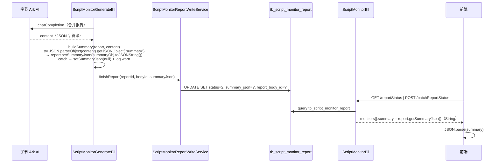
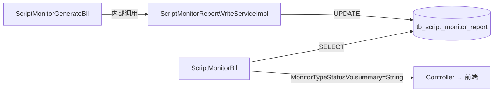

spec_mode: STANDARD
risk: HIGH
frontend-facing: true
module: replay-ai
triggers: [api, data, business-arch, tech-arch, adr]

---

## 1. Context

- **Business goal (one sentence):** 将 `tb_script_monitor_report` 的 9 个摘要列合并为 1 列 `summary_json TEXT`，消除三类报告各自字段的类型膨胀，前端直接接收原始 JSON 字符串后自行解析。
- **Scope of change:**
  - `replay-ai` 模块（Entity / Bll / WriteService / Vo）
  - `sql/replay-30.sql`（DDL 迁移脚本）
  - `docs/2.6.01/API-话术智能监控-接口文档.md`（前端契约文档）
- **Dependencies consulted:**
  - explore_report.md（源 AC 列表 + Spec Inference + Hidden Scope）
  - `.claude/llm_wiki/wiki/preferences/index.md`
- **Explorer hand-off:** `.claude/runs/Change__2026-06-02_summary-flatten-to-json/explore_report.md`

---

## 2. Domain Model

Not applicable — 无新增业务术语或状态机枚举；`MonitorTypeEnum` 枚举值不变，`summary_json` 是存储格式变更非领域模型变更。

---

## 2.5 Business Architecture

### 2.5.1 Business Flow



### 2.5.2 Business Boundary

- **In scope (replay-ai owns):** 报告生成写入、摘要读取、VO 返回
- **Out of scope:** Token 预扣/结算（replay-ai 通过 Feign 调 replay-power）；ASR 文本加载（通过 Feign 调 replay-words）
- **Boundary contract:** 本次 DDL + 代码变更全在 `replay-ai` 内，Feign 接口签名仅 `ScriptMonitorReportWriteService`（模块内部接口，非跨模块 Feign）变更

### 2.5.3 Upstream / Downstream

| Direction | System / Module | Touchpoint | What flows |
|---|---|---|---|
| Upstream | replay-words | `CueWordsFeign#getCueWordsByType` | 提示词配置（无变更） |
| Upstream | replay-power | `AiTokenWithholdFeign` | Token 预扣结算（无变更） |
| Downstream | 前端 | `/reportStatus` `/batchReportStatus` `/qualityReportDetail` | `summary` 字段类型 Object → String |

### 2.5.4 Business Rules

- Rule 1: AI 返回 JSON 合法时，`summary_json` 存 `summary` 子对象的 JSON 字符串（不存整个 content）。
- Rule 2: AI 返回 JSON 无效或无 `summary` 段时，`summary_json` 置为 `null`，主流程不中断（降级策略）。
- Rule 3: 失败回滚时，`restoreOrFail` 以 `oldSummaryJson` 恢复，保证幂等。
- Rule 4: 还原度（monitorType=1）/ 巡检（monitorType=2）原有 5 个字段（score/speechSpeed/deviationSummary/interactionRate/summaryText）因对应生成流程从未上线，直接 DROP 无数据迁移需求。

---

## 3. API Contract

### 3.1 POST /reportStatus（breaking change）

**Breaking 字段：** `data.monitors[].summary`

| 字段 | 变更前 | 变更后 |
|---|---|---|
| `monitors[].summary` | `Object`（含 `crashCount/slackCount/brandDamageCount/afterSalesCount` 等子字段） | `String`（原始 JSON 字符串，前端 `JSON.parse` 后取子字段） |

响应示例（变更后）：
```json
{
  "code": 0,
  "data": {
    "monitors": [
      {
        "reportId": 1234567890,
        "monitorType": 0,
        "status": 2,
        "summary": "{\"crashCount\":2,\"slackCount\":1,\"brandDamageCount\":0,\"afterSalesCount\":3}"
      }
    ]
  }
}
```

`summary` 为 `null` 时（报告未生成 / 解析失败）直接返回 `null`。

### 3.2 POST /batchReportStatus（breaking change）

与 `/reportStatus` 完全相同，`monitors[].summary` 类型 Object → String。

### 3.3 GET /qualityReportDetail（breaking change）

| 字段变更 | 变更前 | 变更后 |
|---|---|---|
| 顶层 `crashCount` | `Integer` | **删除** |
| 顶层 `slackCount` | `Integer` | **删除** |
| 顶层 `brandDamageCount` | `Integer` | **删除** |
| 顶层 `afterSalesCount` | `Integer` | **删除** |
| 顶层 `summaryJson` | 不存在 | 新增 `String`（原始 JSON 字符串） |

响应示例（变更后）：
```json
{
  "code": 0,
  "data": {
    "reportId": 1234567890,
    "summaryJson": "{\"crashCount\":2,\"slackCount\":1,\"brandDamageCount\":0,\"afterSalesCount\":3}",
    "status": 2
  }
}
```

---

## 4. Data Model

### 4.1 DDL 变更（tb_script_monitor_report）

**脚本文件：** `sql/replay-30.sql`

**DROP 列（9 列）：**

```sql
-- 测试环境：TRUNCATE 后直接 DROP（或 DELETE WHERE，再 DROP 再 ADD）
-- 生产环境：先 UPDATE 迁移质检数据，再 DROP

-- Step 1（生产专用）：迁移已有质检报告数据至 summary_json
UPDATE tb_script_monitor_report
SET summary_json = JSON_OBJECT(
    'crashCount', crash_count,
    'slackCount', slack_count,
    'brandDamageCount', brand_damage_count,
    'afterSalesCount', after_sales_count
)
WHERE monitor_type = 0
  AND status = 2
  AND crash_count IS NOT NULL;
-- 注：monitor_type=1(还原度)/monitor_type=2(巡检) 的 5 列（score/speech_speed/deviation_summary/
--     interaction_rate/summary_text）从未有生成数据上线，直接 DROP，不需要迁移。

-- Step 2（生产 + 测试）：ADD 新列（幂等：仅在不存在时执行）
ALTER TABLE tb_script_monitor_report
    ADD COLUMN summary_json TEXT NULL COMMENT '摘要 JSON 字符串（全类型统一存储，前端解析）'
    AFTER after_sales_count;
-- 若列已存在此步骤可忽略（测试环境 replay 场景下先 ADD 后 DROP 旧列）

-- Step 3（生产 + 测试）：DROP 旧 9 列
ALTER TABLE tb_script_monitor_report
    DROP COLUMN IF EXISTS crash_count,
    DROP COLUMN IF EXISTS slack_count,
    DROP COLUMN IF EXISTS brand_damage_count,
    DROP COLUMN IF EXISTS after_sales_count,
    DROP COLUMN IF EXISTS score,
    DROP COLUMN IF EXISTS speech_speed,
    DROP COLUMN IF EXISTS deviation_summary,
    DROP COLUMN IF EXISTS interaction_rate,
    DROP COLUMN IF EXISTS summary_text;
```

> 注：MySQL 8.0 支持 `DROP COLUMN IF EXISTS`；如目标版本低于 8.0，需通过 `information_schema.COLUMNS` 守护幂等。

### 4.2 ER Diagram

Not applicable — 仅单表列变更，无新表、无关联关系变动。

### 4.3 Index Reasoning

| 操作 | 影响 | 理由 |
|---|---|---|
| DROP 9 列 | 无索引变更 | 9 列均非索引列 |
| ADD `summary_json TEXT` | 无新增索引 | TEXT 字段不作查询条件，不建索引 |

### 4.4 Data Assembly Strategy

- 读路径：`ScriptMonitorBll.buildSummaryObject()` 改为直接返回 `report.getSummaryJson()`（String），不再 parse 构造 VO；上层调用方将 String 赋给 `MonitorTypeStatusVo.summary`（String 类型）。
- 反 JOIN 策略不变：`reportStatus` 按 anchorVideoIds 批量查报告，in-memory 装配。

### 4.5 Lifecycle

- 软删除：`is_deleted = 1`（手动，无 `@TableLogic`），`summary_json` 随行软删除，无特殊处理。
- 存档：无。
- 租户隔离：每次读写均带 `tenant_id` 过滤（现有逻辑不变）。

---

## 5. Business Logic

### 5.1 Happy path（写入路径）

1. `ScriptMonitorGenerateBll.generate()` 步骤 h：调 `buildSummary(report, content)`。
2. `buildSummary()` 新逻辑：
   ```
   try {
       JSONObject json = JSON.parseObject(content);
       JSONObject summaryObj = json.getJSONObject("summary");
       report.setSummaryJson(summaryObj != null ? summaryObj.toJSONString() : null);
   } catch (Exception e) {
       log.warn("解析 summary 失败 reportId={}, 前200字={}", reportId, StrUtil.subPre(content, 200), e);
       report.setSummaryJson(null);
   }
   ```
3. 步骤 h 后：消除 4 个 count 变量及 `safeInt()` 调用。
4. 步骤 i：`reportWriteService.finishReport(reportId, body.getId(), report.getSummaryJson())`（签名简化为 3 参）。
5. `ScriptMonitorReportWriteServiceImpl.finishReport()` 新逻辑：UPDATE 设 `status=2, summary_json=?, report_body_id=?`。

### 5.2 Happy path（读取路径）

1. `ScriptMonitorBll.reportStatus()` / `batchReportStatus()` 查询报告列表。
2. 对每个 report，调 `buildSummaryObject(report)` → 返回 `report.getSummaryJson()`（String 直通，无 VO 构造）。
3. 赋给 `MonitorTypeStatusVo.summary`（类型已改为 String）。
4. `qualityReportDetail()` 中：`vo.setSummaryJson(report.getSummaryJson())`，移除 `vo.setCrashCount(...)` 等 4 行。

### 5.3 Branches & exceptions

| Branch | Trigger | Handling | 影响 |
|---|---|---|---|
| AI 返回合法 JSON 含 summary | 正常路径 | `summaryObj.toJSONString()` 存入 | summary_json = 完整 summary 子对象 JSON |
| AI 返回合法 JSON 无 summary | `getJSONObject("summary")` 返 null | `setSummaryJson(null)` + log.warn | 前端 summary 字段为 null |
| AI 返回非法 JSON（parse 异常） | `JSON.parseObject` 抛异常 | catch → `setSummaryJson(null)` + log.warn | 同上；主流程不中断 |
| 失败回滚（originalStatus=2） | generate() catch 块 | `restoreOrFail(reportId, originalStatus, oldBodyId, oldSummaryJson, errorMsg)` | 恢复旧 summary_json |
| 失败回滚（originalStatus≠2） | generate() catch 块 | 置 GENERATE_FAILED | summary_json 保持触发前状态 |

### 5.4 Idempotency / replay safety

- `finishReport()` 内含 `@Transactional`，UPDATE 按 `id` 单行操作，幂等。
- `restoreOrFail()` 同，`oldSummaryJson` 回写幂等。

---

## 5.5 Technical Architecture

### 5.5.1 Module Topology



### 5.5.2 Cross-Module Communication

无跨模块 Feign 签名变更。`ScriptMonitorReportWriteService` 是 `replay-ai` 模块内部 Spring Bean 接口，不暴露到 `replay-generic`。

### 5.5.3 Async Tasks

- `generate()` 由线程池异步调用（非 `@Scheduled`），无变更。
- 无 MQ 变更。

### 5.5.4 Cache Strategy

Not applicable — 报告读取未使用 Redis 缓存，无 cache 变更。

### 5.5.5 Transaction Boundary

- `finishReport()` 声明 `@Transactional(rollbackFor = Exception.class)`，跨越单次 `UPDATE tb_script_monitor_report`。
- `restoreOrFail()` 同，单次 UPDATE（含条件分支）。
- `generate()` 自身无事务（长 AI 调用，避免长事务锁 DB 连接）。

**签名变更对比：**

| 方法 | 变更前 | 变更后 |
|---|---|---|
| `finishReport` | `(reportId, bodyId, crashCount, slackCount, brandDamageCount, afterSalesCount)` | `(reportId, bodyId, summaryJson)` |
| `restoreOrFail` | `(reportId, originalStatus, oldBodyId, oldCrashCount, oldSlackCount, oldBrandDamageCount, oldAfterSalesCount, errorMsg)` | `(reportId, originalStatus, oldBodyId, oldSummaryJson, errorMsg)` |

### 5.5.6 Observability

- 既有 `log.warn` 解析失败路径保留（改为 warn 含 summaryJson=null 信息）。
- 关键日志 key：`reportId`（已有）。

---

## 6. Non-Functional Constraints

- **安全 / 权限：** `summary_json` 存储 AI 生成内容，不含用户敏感字段，无额外权限要求；读取路径已有 `tenantId` 过滤，不变。
- **并发 / 幂等：** `finishReport` / `restoreOrFail` 均走 UPDATE by id，数据库行锁保证并发安全。
- **禁止模式（DO NOT）：**
  - DO NOT 使用 `@Autowired`（构造器注入）
  - DO NOT 使用 `@TableLogic`（手动 `isDeleted` 翻转）
  - DO NOT 跨模块直连 Dao（现有 Feign 路径不变）
  - DO NOT 在 `buildSummary` catch 块抛出异常（降级策略，仅 log.warn）
- **部分失败回滚：** `generate()` catch 块调 `restoreOrFail` 补偿；Token 预扣归还保持原有逻辑不变。
- **TEXT 列性能：** `summary_json` 为 TEXT，不作查询条件，不建索引；单行 `SELECT` 不影响查询性能；行内存储（< 65535 bytes）满足摘要 JSON 大小（典型 < 1KB）。
- **生产迁移窗口：** DDL `DROP COLUMN` 需维护窗口内执行；先 UPDATE summary_json，再 DROP 旧列，保证回滚可用性。

---

## 6.5 Design Patterns

Not applicable — 本次变更为字段合并重构，未引入新命名设计模式；原 `buildSummaryObject` 的三分支 Strategy 被消除（合并后无需按 type 分支构造 VO）。

---

## 7. Acceptance Criteria

（从 explore_report.md 原文复制，不重写）

- **AC-001（happy path：AI JSON 合法→存储→前端透传）：** Given AI 合并报告返回合法 JSON 字符串（含 `summary` 段，如 `{"summary":{"crashCount":2,"slackCount":1,...}}`），when `ScriptMonitorGenerateBll.generate()` 执行到 buildSummary 步骤，then `report.getSummaryJson()` 等于原始 summary 子对象 JSON 字符串，且 `reportWriteService.finishReport()` 调用时将该字符串写入 `tb_script_monitor_report.summary_json` 列；reportStatus/batchReportStatus 响应的 `summary` 字段返回该原始 JSON 字符串。

- **AC-002（edge：AI 返回非法 JSON→summary_json 存 null）：** Given AI 合并报告返回非 JSON 内容（如纯文本、截断字符串），when `buildSummary` 执行 try-catch JSON parse，then catch 分支触发，`report.getSummaryJson()` 置为 `null`；reportWriteService 写入 null；reportStatus 响应的 `summary` 字段为 `null`；主流程不中断（不抛异常，不触发 returnAiToken）。

- **AC-003（edge：AI 返回 JSON 有效但无 summary 段→summaryJson=null）：** Given AI 返回合法 JSON 但 `summary` key 不存在（如 `{"other":"data"}`），when `buildSummary` 执行，then `getJSONObject("summary")` 返回 null，`report.setSummaryJson(null)`；前端 summary 字段为 null。

- **AC-004（edge：旧成功报告失败回滚→summaryJson 正确恢复）：** Given 报告原状态 GENERATED（`originalStatus=2`），且 entity 内存中 `oldSummaryJson` 非 null，when 重新生成流程中途失败（任意步骤抛异常），then `restoreOrFail()` 以 `oldSummaryJson` 写回 `summary_json` 列，报告状态恢复 GENERATED，`tb_script_monitor_report.summary_json` 与触发前完全一致。

- **AC-005（edge：qualityReportDetail 响应格式对齐）：** Given 质检报告状态 GENERATED 且 `summary_json` 非 null，when 调用 `GET /qualityReportDetail?reportId=xxx`，then 响应 `data.summaryJson` 字段返回原始 JSON 字符串（String 类型），原来的 4 个顶层 count 字段（`crashCount/slackCount/brandDamageCount/afterSalesCount`）不再出现在响应中；`summary_json` 为 null 时该字段返回 null。

- **AC-006（edge：DDL 幂等迁移脚本）：** Given 新 DDL 脚本（replay-30.sql）在已有 `summary_json` 列的 DB 上重复执行，then DROP 采用 `IF EXISTS` 守护，脚本幂等无错误；测试环境清表迁移和生产 UPDATE 迁移路径均在脚本中注释说明。

- **AC-007（edge：3 个 VO 类删除后无孤立引用）：** Given `QualityInspectionSummaryVo` / `FidelityMonitorSummaryVo` / `InteractionPatrolSummaryVo` 三个类被删除，when `mvn compile`，then 零编译错误（所有引用已清理）；`MonitorTypeStatusVo.summary` 字段类型由 `Object` 改为 `String`，`@Schema` oneOf 注解移除。

**Unit test 要求：**

| AC-id | 测试方法 / 文件 | 核心断言 |
|---|---|---|
| AC-001 | `ScriptMonitorGenerateBllTest#testBuildSummary_validJson` | `report.getSummaryJson()` 等于 `{"crashCount":2,...}` |
| AC-002 | `ScriptMonitorGenerateBllTest#testBuildSummary_invalidJson` | `report.getSummaryJson()` 为 null，无异常抛出 |
| AC-003 | `ScriptMonitorGenerateBllTest#testBuildSummary_noSummaryKey` | `report.getSummaryJson()` 为 null |
| AC-004 | `ScriptMonitorBllSummaryTest#testRestoreOrFail_restoresSummaryJson` | `reportWriteService.restoreOrFail` 以 oldSummaryJson 调用，状态恢复 2 |
| AC-005 | `ScriptMonitorBllSummaryTest#testQualityReportDetail_summaryJsonField` | 响应无 crashCount，有 summaryJson String 字段 |
| AC-007 | `mvn compile` 全模块 | 零编译错误 |

---

## 8. Frontend Contract Publishing

`frontend-facing: true`
`module: script_monitor`

- Phase 4 **before** Implement：dispatch `@frontend-api-doc-writer`（mode: forward），读 §3 API Contract → 产出 `.claude/llm_wiki/wiki/frontend-api/script_monitor.md`。
- §3 字段已完整（类型 / breaking 说明 / JSON 示例），可直接 dispatch。
- Phase 6 Archive：运行 mode: reverse 进行字段漂移检查。
- `docs/2.6.01/API-话术智能监控-接口文档.md` 由 `@frontend-api-doc-writer` 同步更新（§3.1 §3.2 §4.1 中的 summary 子结构表格 + JSON 示例）。

---

## 9. Architecture Decision Records

### ADR-1: 使用 1 个 summary_json 字段而不是 3 个（每类报告类型各一）

**Status:** proposed
**Date:** 2026-06-02
**Deciders:** 用户（产品 / 技术负责人）

#### Context

`tb_script_monitor_report` 目前支持 3 种 `monitor_type`：质检（0）、还原度（1）、巡检（2）。每种类型的摘要字段结构不同：质检有 4 个 count 字段，还原度有 score/speechSpeed/deviationSummary，巡检有 interactionRate/summaryText。原始设计将所有字段平铺在表上，导致不同 monitorType 的行各自仅使用部分字段，其余字段为 NULL，且每新增一种报告类型就需要 DDL ALTER TABLE。目标是找到一种存储结构既能统一 schema，又对未来新 monitorType 免 DDL 扩展。

#### Decision

采用 1 个 `summary_json TEXT` 字段统一存储所有 monitorType 的摘要，内容为 AI 返回的 summary 子对象 JSON 字符串；读取侧不解析，直接透传给前端。

#### Alternatives Considered

**Alternative A: 3 个字段（每 monitorType 各一，如 `quality_summary_json / fidelity_summary_json / patrol_summary_json`）**
- Pros: 字段语义明确，可按 monitorType 单独加索引；出问题时 `SELECT quality_summary_json` 清晰
- Cons: 新增第 4 种 monitorType 时仍需 DDL ALTER TABLE；行上仍有 2 列永远为 NULL；与当前"只有质检生成流程上线"的现实不对称（另外两列立即成空列）
- Failure conditions: 若某个 monitorType 的 JSON 结构与其他 type 重合（如未来业务融合），三字段方案无法共享存储
- Estimated complexity: M（需 DDL + 3 处写入路径 + 3 处读取路径）
- Why not chosen: 当前只有 quality（type=0）生成流程上线，另外两列是立即的 DDL 债务；与"减少 DDL 膨胀"目标相反

**Alternative B: 保留 9 个平铺列（不变更）**
- Pros: 无迁移风险；现有代码 0 改动
- Cons: 每新增 monitorType 或调整字段仍需 DDL；列稀疏（每行约 2/3 字段为 NULL）；AI 返回结构与列结构强耦合，AI prompt 字段名变更会导致代码需要同步映射
- Failure conditions: AI 返回 JSON key 改名时必须同步改 Entity + Mapper + VO
- Estimated complexity: S（0 改动）
- Why not chosen: 不解决根问题，且 AI JSON 结构与 DB 列强耦合是技术债；用户已确认需要变更

**Alternative C: 独立 summary 子表（1:1 关系，按 monitorType 分表）**
- Pros: 最强类型约束；未来可按 monitorType 分别演化
- Cons: 引入 JOIN 或二次查询；现有查询路径（reportStatus 批量查）需改为两阶段；复杂度最高；当前 3 个 monitorType 中 2 个尚未上线，过早抽表
- Failure conditions: 子表未及时 INSERT 时 JOIN 结果为空，调试困难
- Estimated complexity: L
- Why not chosen: YAGNI；2 个 monitorType 无数据；引入跨表查询违反 Anti-JOIN 原则

#### Consequences

**Positive**
- 新增 monitorType 无需 DDL ALTER TABLE，只需 AI prompt + 新 monitorType 代码处理
- Entity / Mapper 字段从 9 减为 1，代码简洁
- 写入路径消除手动字段映射，直接存 AI JSON 原文 summary 段

**Negative**
- 失去 MySQL 层对 summary 字段值的查询能力（无法 WHERE crashCount > 3）
- 前端需 JSON.parse，比之前直接读 int 字段多一步
- TEXT 字段无法建普通索引（全表扫描限制）

**Risks (and mitigation)**
- Risk: 前端 JSON.parse 出现 null 或格式异常 → Mitigation: `summary_json` 为 null 时前端判断后展示"-"占位；Java 层 catch 保证 null 而非格式错误字符串写入
- Risk: AI 返回 summary 结构变化（key 改名）→ Mitigation: 前端用 optional chaining 访问字段；Java 层仅存储不解析，无需同步改代码
- Risk: 生产存量质检报告（status=2 且 crash_count 非 null）未迁移 → Mitigation: 生产迁移脚本（Step 1 UPDATE）先行执行，验证 count 正确后再 DROP 旧列

#### Archive target
`.claude/llm_wiki/wiki/architecture/adrs/NNNN-summary-flatten-one-field.md`

---

### ADR-2: summary_json 使用 TEXT 类型而不是 MySQL JSON 类型

**Status:** proposed
**Date:** 2026-06-02
**Deciders:** 用户（产品 / 技术负责人）

#### Context

MySQL 5.7.8+ 原生支持 JSON 数据类型，提供 `JSON_EXTRACT` / `->` 操作符、自动 JSON 格式校验、局部更新优化。`summary_json` 存储的是 AI 生成的 summary 子对象，目前系统仅作"整体写入 + 整体读取透传"使用，无字段级查询需求。需要决定是否使用 MySQL JSON 类型。

#### Decision

使用 `TEXT` 类型存储 `summary_json`。

#### Alternatives Considered

**Alternative A: MySQL JSON 类型**
- Pros: 自动 JSON 格式校验（写入非法 JSON 报错）；支持 `JSON_EXTRACT` / `JSON_TABLE` 做字段级查询；MyBatis-Plus 配合自定义 TypeHandler 可无缝 `@TableField` 绑定
- Cons: MySQL 5.7 以下不支持（需确认目标环境版本）；JSON 列无法直接建普通索引（需 Generated Column + 虚拟列索引，操作繁琐）；ORM 层需要额外 TypeHandler，增加配置复杂度；JSON 类型存储格式不是原始文本（内部 binary 格式），`SELECT` 结果经 MySQL 重新序列化，key 顺序可能与写入不同
- Failure conditions: 目标 MySQL 版本 < 5.7.8 时建表失败；TypeHandler 配置缺失时实体字段读写乱码
- Estimated complexity: M（TypeHandler + Generated Column 索引 + version 兼容验证）
- Why not chosen: 当前无字段级查询需求；JSON 类型的收益（格式校验 + JSON_EXTRACT）在本场景不触发；引入 TypeHandler 增加配置债；MySQL 存储重新序列化 key 顺序不可控，前端依赖 key 顺序的代码有风险

**Alternative B: VARCHAR(1024) 类型**
- Pros: 定长上限防止异常大数据写入；存储在行内（不溢出到行外页）
- Cons: summary JSON 有增长可能（未来 monitorType 字段更多），1024 字节上限可能不够；若超长则写入截断（silent corruption）；调整长度需要 DDL
- Failure conditions: AI 返回超长 summary 时静默截断，导致 JSON parse 失败
- Estimated complexity: S
- Why not chosen: 固定上限存在截断风险；TEXT 类型（65535 字节）对 summary JSON 完全足够，无溢出风险，无需预估上限

#### Consequences

**Positive**
- 无 ORM 侧额外配置（TEXT 直接映射 String 字段，零 TypeHandler）
- 兼容所有 MySQL 5.x / 8.x 版本
- 写入内容即原始字符串，`SELECT` 读出与写入完全一致（无重新序列化）

**Negative**
- MySQL 层无 JSON 格式校验，写入 null 或非法 JSON 不报错（由 Java catch 层保证 null）
- 无法使用 `JSON_EXTRACT` 做数据库级字段查询（如运营后台统计 crashCount > 3 的报告）
- TEXT 字段若行内存储溢出（> 767 bytes），需行外页读取（summary JSON 典型 < 512 bytes，实际不触发）

**Risks (and mitigation)**
- Risk: 运营需要统计摘要字段（如 crashCount 排行）→ Mitigation: 届时通过应用层读取 + 聚合，或迁移为 JSON 类型 + Generated Column 索引；当前需求未有此要求
- Risk: 非法 JSON 写入（如 AI 返回空字符串 ""）→ Mitigation: `buildSummary` catch 保证写入 null 而非非法字符串；`finishReport` UPDATE 语句直接写 null 合法

#### Archive target
`.claude/llm_wiki/wiki/architecture/adrs/NNNN-summary-json-text-vs-json-type.md`

---

## Allowed Scope

- `sql/replay-30.sql`
- `replay-ai/src/main/java/com/jiuyu/replay/ai/entity/ScriptMonitorReportEntity.java`
- `replay-ai/src/main/java/com/jiuyu/replay/ai/bll/ScriptMonitorBll.java`
- `replay-ai/src/main/java/com/jiuyu/replay/ai/bll/ScriptMonitorGenerateBll.java`
- `replay-ai/src/main/java/com/jiuyu/replay/ai/bll/ScriptMonitorReportWriteService.java`
- `replay-ai/src/main/java/com/jiuyu/replay/ai/bll/impl/ScriptMonitorReportWriteServiceImpl.java`
- `replay-ai/src/main/java/com/jiuyu/replay/ai/vo/MonitorTypeStatusVo.java`
- `replay-ai/src/main/java/com/jiuyu/replay/ai/vo/QualityReportDetailVo.java`
- `replay-ai/src/main/java/com/jiuyu/replay/ai/vo/QualityInspectionSummaryVo.java`（删除）
- `replay-ai/src/main/java/com/jiuyu/replay/ai/vo/FidelityMonitorSummaryVo.java`（删除）
- `replay-ai/src/main/java/com/jiuyu/replay/ai/vo/InteractionPatrolSummaryVo.java`（删除）
- `replay-ai/src/test/java/com/jiuyu/replay/ai/bll/ScriptMonitorBllSummaryTest.java`
- `replay-ai/src/test/java/com/jiuyu/replay/ai/bll/ScriptMonitorGenerateBllTest.java`
- `docs/2.6.01/API-话术智能监控-接口文档.md`
- `.claude/llm_wiki/wiki/frontend-api/script_monitor.md`

---

## 做什么 / 为什么

**现状：** `tb_script_monitor_report` 有 9 个独立摘要列，分别对应质检（4 个 count）、还原度（3 列）、巡检（2 列）三种报告类型。Entity / VO / 写入路径均有对应的分字段处理，导致代码冗余、AI JSON 结构与 DB 列强耦合、每新增报告类型就需要 DDL 扩列。

**需要：** 将 9 列合并为 1 列 `summary_json TEXT`，存储 AI 返回的 summary 子对象 JSON 字符串，前端直接接收字符串后自行 `JSON.parse`；删除 3 个嵌套 VO 类；接口响应 `summary` 字段类型从 Object 改为 String。

**范围：** `replay-ai` 模块（Entity / Bll / WriteService / Vo / Test）+ DDL 迁移脚本 + 前端契约文档，共 15 文件；破坏性 DDL + 前端 breaking API。

## 怎么做

1. **DDL**：`sql/replay-30.sql`——生产先 UPDATE 迁移质检历史数据，再 DROP 9 列 + ADD `summary_json TEXT`；测试环境直接清表后 DROP/ADD。参见 §4.1。
2. **写入路径**：`buildSummary()` 改为 try-catch parse AI JSON，存 summary 子对象的 toJSONString()；catch 置 null。`finishReport` / `restoreOrFail` 签名简化为带 `summaryJson String` 参数。参见 §5.1。
3. **读取路径**：`buildSummaryObject()` 改为直接返回 `report.getSummaryJson()`（String），删除三分支 VO 构造；`MonitorTypeStatusVo.summary` 改为 String；`QualityReportDetailVo` 删 4 count 字段，加 `summaryJson String`。参见 §5.2。
4. **VO 清理**：删除 `QualityInspectionSummaryVo` / `FidelityMonitorSummaryVo` / `InteractionPatrolSummaryVo` 三个类。
5. **测试重写**：`ScriptMonitorBllSummaryTest` / `ScriptMonitorGenerateBllTest` 按新签名 + AC-001~AC-005 重写。
6. **前端契约文档**：由 `@frontend-api-doc-writer` 更新 `docs/2.6.01/API-话术智能监控-接口文档.md`（§3.1 §3.2 §4.1）。

架构决策见 §9：ADR-1（1 字段 vs 3 字段 vs 平铺）、ADR-2（TEXT vs MySQL JSON 类型）。

## 需要你确认的

- [x] **ADR-1 确认**：采用 1 个 `summary_json` 字段（用户已在 Dispatch Inputs 中显式拍板）
- [x] **ADR-2 确认**：采用 TEXT 类型（用户已在 Dispatch Inputs 中显式拍板）
- [x] **AC-003 行为调整**：原 explore_report AC-003 为"存原始 JSON"，但用户决策为"存 summary 子对象 JSON"——无 summary 段时置 null（非存整体 content）。已在 §5.1 和 §7 AC-003 中对齐。
- [ ] **生产迁移执行人**：`sql/replay-30.sql` Step 1 UPDATE 需 DBA 在维护窗口手动执行，确认执行负责人和时间窗口。
