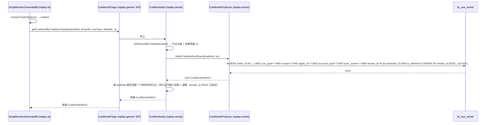
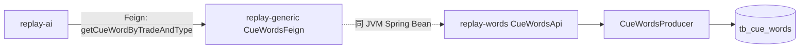

# OpenSpec — script-monitor 提示词补齐租户定制维度

## 1. Context

- **Business goal:** 让话术质检（script-monitor）按当前租户取定制提示词，租户未定制时回退全平台通用提示词，从而支持各租户在 `tb_cue_words` 已配置的 `cue_type=16/17` 行级定制内容真正生效。
- **Scope of change:** 跨 3 个 jiuyu 模块、6 个文件 + 1 测试文件 — 新增 `CueWordsQueryBo`、改 `CueWordsFeign.getCueWordByTradeAndType` 签名、`CueWordsApi` 与 `CueWordsProducer(+Impl)` 实现、`ScriptMonitorGenerateBll` 调用方。无 DDL 变更（`tb_cue_words.tenant_id` 字段已存在）。
- **Dependencies consulted:** debugger RCA（本次会话 inline 完成）；阅读了 `CueWordsApi.java:87-256`（已有的 `setTradeCueWordsParams` + `pageCueWords` 路径）、`CueWordsProducerImpl.java:76-181`（双 path 实现）、`ScriptMonitorGenerateBll.java:165-344`（当前调用）、`ScriptMonitorReportEntity.java`（持有 tenantId）。
- **Explorer hand-off:** Inline Path — 无 `explore_report.md` 文件；ACs 直列于 §7。

## 2. Domain Model

Not applicable — 不新增业务术语 / 状态机 / 枚举；`cueType` 16/17 已存在。

## 2.5 Business Architecture

### 2.5.1 Business Flow

### 2.5.2 Business Boundary

- **In scope（replay-words 拥有）:** `tb_cue_words` 读取、行业父链解析、租户定制 → 通用 fallback 算法、`problem` 字段返回。
- **Out of scope（其他模块）:** 调用方（replay-ai）只负责传 `tradeId` 和 `tenantId`，不参与 fallback 决策；任何"租户在哪一层级有定制"由 `CueWordsApi` 黑盒决定。
- **Boundary contract:** Feign SPI（`replay-generic`）—— 不直连 Dao；调用方拿 `CueWordsInfoVo`（含 `problem`）即可。

### 2.5.3 Upstream / Downstream

| 方向 | 模块 | 触点 | 数据流 |
|---|---|---|---|
| Upstream（调用本 SPI） | replay-ai (`ScriptMonitorGenerateBll`) | `CueWordsFeign#getCueWordByTradeAndType` | 入参 `CueWordsQueryBo`，回参单条提示词含 `problem` |
| Downstream | replay-words (`CueWordsApi` / `CueWordsProducer`) | MyBatis-Plus → `tb_cue_words` | 不变（继续走 service.lambdaQuery） |

### 2.5.4 Business Rules

- Rule 1：行业父链优先级（子→父→兜底 1L）保持不变 —— 命中的子层级行业赢父层级。
- Rule 2：**同一行业层级**，租户定制（`tenant_id = bo.tenantId`）赢通用（`tenant_id = 0`）。
- Rule 3：跨行业层级，子行业的通用赢父行业的租户定制（不做跨层级租户优先；本次范围明确不实现）。
- Rule 4：`tenantId = null` 或 `tenantId = 0` 时退化为旧行为（只查通用，子→父→兜底）。

## 3. API Contract (Handoff)

Not applicable — 不新增 Controller endpoint；改的是 `replay-generic` Feign SPI 签名（内部契约非 HTTP）。

## 4. Data Model

Not applicable — 无 DDL 变更；`tb_cue_words.tenant_id` 字段已存在（`CueWordsEntity.java:98`）。

## 5. Business Logic

### 5.1 Happy path

1. `ScriptMonitorGenerateBll.generate()` 调 `resolveTradeId(report)` 解析行业 id（已有逻辑：`tb_anchor_video.trade_id`，取不到 1L 兜底）。
2. 新建 `CueWordsQueryBo`，set `tradeId / tenantId(=report.getTenantId()) / cueType(=16 或 17)`；`scope / applyTo / accountType` 取 Bo 默认值 `0`；`syncScene` 不设。
3. 调 `cueWordsFeign.getCueWordByTradeAndType(bo)`。
4. `CueWordsApi.getCueWordByTradeAndType(bo)`：
   - 4.1 构造 `tradeIds`：通过 `tradeProducer.listParentsByTradeId(bo.tradeId, GENERAL_NO)` 拿父链子→父，末尾追加 `1L` 兜底（与现行逻辑相同）。
   - 4.2 调 `cueWordsProducer.listByTradeIdsAndQuery(tradeIds, bo)` 一次 SQL 取候选行业全部有效提示词，WHERE 同 §2.5.1 SQL。
   - 4.3 内存按 `tradeId` 分组，每组取首条（SQL 已用 `ORDER BY tenant_id DESC, sort ASC` 保证组内租户定制 + sort 最小者排第一）。
   - 4.4 按 `tradeIds` 顺序找第一个命中的行业，返回该行业的提示词；都没命中返回 null。
5. 调用方收到含 `problem` 字段的 `CueWordsInfoVo`；null 时抛 `BusinessException(SCRIPT_MONITOR_PARAM_INVALID, "提示词未配置（tradeId=...）"）`（现有逻辑保持）。

### 5.2 Branches & exceptions

| 分支 | 触发条件 | 处理 | 错误码 |
|---|---|---|---|
| 租户未配置定制 + 通用存在 | `tenant_id = bo.tenantId` 无记录，`tenant_id = 0` 有记录 | 返回通用提示词（SQL 排序自动 fallback） | — |
| 租户已配置定制 | 当前 `tradeId` 层级有 `tenant_id = bo.tenantId` 记录 | 返回租户定制提示词 | — |
| 整条父链都无配置 | `tradeIds` 内任何层级都无 `cue_type` 匹配 | 返回 null | 上层抛 `SCRIPT_MONITOR_PARAM_INVALID` |
| `tenantId = null / 0` | 调用方未传或显式 0 | SQL 退化为 `tenant_id = 0`，行为同重构前 | — |
| `bo.cueType = null` | 调用方未传 | `CueWordsApi` 显式校验，抛 `IllegalArgumentException("cueType 必填")` | — |

### 5.3 Idempotency / replay safety

- 纯读 SPI，无幂等性诉求；调用本 SPI 不写库、不发 MQ、不入缓存。

## 5.5 Technical Architecture

### 5.5.1 Module Topology

### 5.5.2 Cross-Module Communication

| 通道 | From → To | 契约 | 失败处理 |
|---|---|---|---|
| Feign SPI | replay-ai → replay-words | `CueWordsFeign#getCueWordByTradeAndType(CueWordsQueryBo)` | 同进程 Bean 调用，无网络重试需要；空结果返回 null，调用方决策抛错 |

### 5.5.3 Async Tasks

无 —— 纯同步 SPI 改造。

### 5.5.4 Cache Strategy

无 —— 不入 Redis；本次不改既有缓存策略。

### 5.5.5 Transaction Boundary

无 —— 只读路径，无 `@Transactional` 涉及。

### 5.5.6 Observability

- 不新增专属日志键；调用方 `ScriptMonitorGenerateBll` 已有 `[script-monitor-gen]` reportId 日志可定位提示词命中失败 case。
- 异常文案保留现行 `提示词未配置（tradeId=...）` 但建议补 `tenantId` 入文案，便于排查。

## 6. Non-Functional Constraints (Hard Constraints)

- **租户隔离：** SQL 必须含 `tenant_id IN (bo.tenantId, 0)`（`bo.tenantId` 非 null 时）；调用方 `ScriptMonitorGenerateBll` 必须从 `report.getTenantId()` 读 tenantId（绝不外部传入）。
- **构造器注入：** 新建的 `CueWordsQueryBo` 是纯 POJO（@Data + 字段默认值）；其他改动文件均已用 `@AllArgsConstructor` 构造器注入，禁 `@Autowired` / `@Resource`。
- **SQL 占位：** 全部走 MyBatis-Plus `LambdaQueryWrapper`，不写裸 SQL；禁 `${}`。
- **软删除：** SQL 必须保留 `.eq(CueWordsEntity::getIsDeleted, 0)` 过滤。
- **性能预算：** 父链通常 ≤ 5 层 + 兜底 1L，IN 列表 ≤ 6 个，无分批需要；单 SQL P95 < 50ms（依赖 `(trade_id, cue_type, tenant_id)` 联合走索引；现表上的索引情况未在本范围内审计，登记 TECH-DEBT 跟进）。
- **Forbidden patterns:**
  - DO NOT 在 Bo 字段上加 `@NotNull` 注解（Bo 是 SPI 内部入参，校验由 `CueWordsApi` 显式做；避免引入 jakarta-validation 走自动校验链）。
  - DO NOT 改 `pageCueWords` / `customizeCueWordsList` / `setTradeCueWordsParams` 等无关方法（保持 scope 收紧）。
  - DO NOT 把 `tenantId = 0` 硬编码扩散到新方法体内。
- **向后兼容：** `getCueWordByTradeAndType(tradeId, cueType)` 旧签名直接删除（全项目仅 `ScriptMonitorGenerateBll` 一个 caller，本次同步改），无需保留 `@Deprecated` 重载。

## 6.5 Design Patterns

Not applicable — 无新增命名模式。

## 7. Acceptance Criteria (Testing)

- **AC-1（happy: 租户定制赢通用）:** Given `tb_cue_words` 同时存在 `(tradeId=10, cue_type=16, tenant_id=0)` 和 `(tradeId=10, cue_type=16, tenant_id=100)` 两条记录，When `ScriptMonitorGenerateBll.generate()` 处理 `report.tenantId=100, video.tradeId=10` 的任务，Then 实际拼给 AI 的 `generateCue.problem` 等于 `tenant_id=100` 那条记录的 `problem` 字段值。

- **AC-2（happy: 租户未定制回退通用）:** Given `tb_cue_words` 只存在 `(tradeId=10, cue_type=16, tenant_id=0)` 一条记录，When 调用方传 `tenantId=200`，Then 返回 `tenant_id=0` 的通用记录（不抛错、不返回 null）。

- **AC-3（edge: 跨行业层级，子行业通用赢父行业租户定制）:** Given `tb_cue_words` 存在 `(tradeId=10, cue_type=16, tenant_id=0)` 和 `(tradeId=1, cue_type=16, tenant_id=100)`，video.tradeId=10，行业父链 `[10, 1]`，When 调用方传 `tenantId=100`，Then 返回 `tradeId=10, tenant_id=0` 那条（子层级赢父层级，即使父层级有租户定制）。

- **AC-4（edge: 全链路无记录）:** Given `tb_cue_words` 不含任何 `cue_type=16` 记录，When `ScriptMonitorGenerateBll.generate()`，Then `loadSingleCueWord` 抛 `BusinessException(SCRIPT_MONITOR_PARAM_INVALID)`，文案含 `tradeId` 和 `tenantId`。

- **AC-5（edge: tenantId=null 退化旧行为）:** Given 调用方传 `tenantId=null`，When 查询，Then SQL 退化为 `tenant_id = 0`（不抛 NPE），行为同重构前 `listByTradeIdsAndCueType` 路径。

- **单元测试要求：**

  | AC-id | 被测方法 | 断言 |
  |---|---|---|
  | AC-1 | `CueWordsApi#getCueWordByTradeAndType(bo)` | 返回 `tenant_id=100` 那条；可用 mock `cueWordsProducer.listByTradeIdsAndQuery` 验证排序 |
  | AC-2 | 同上 | 返回 `tenant_id=0` 那条 |
  | AC-3 | 同上 | 返回 `tradeId=10, tenant_id=0` 那条 |
  | AC-4 | `ScriptMonitorGenerateBll#loadSingleCueWord` | 抛 `BusinessException`，code=SCRIPT_MONITOR_PARAM_INVALID |
  | AC-5 | `CueWordsApi#getCueWordByTradeAndType(bo)` | bo.tenantId=null 不 NPE，SQL 走 `tenant_id=0` 分支 |

---

## 做什么 / 为什么

**现状：** 话术质检调 `getCueWordByTradeAndType(tradeId, cueType)` 取提示词，底层 `CueWordsProducerImpl.listByTradeIdsAndCueType:467` 硬编码 `.eq(TenantId, 0L)`，所有租户都拿到同一套全平台通用提示词，租户在 `tb_cue_words` 配的 `cue_type=16/17` 定制内容永远不生效。Commit `791fae320` 设计该 SPI 时主动遗漏了租户维度。

**需要：** 同行业层级先查租户定制、没有再退回通用；跨层级仍按现有"子→父→兜底 1L"行业链。

**范围：** 6 个 Java 文件 + 1 个单测文件，跨 `replay-generic` / `replay-words` / `replay-ai` 三模块；不动 DDL，不动其他 Feign / Producer 方法。

## 怎么做

1. 在 `replay-generic` 新建 `CueWordsQueryBo`（字段默认值 `scope=0, applyTo=0, accountType=0, syncScene=null`）。
2. `CueWordsFeign.getCueWordByTradeAndType` 签名改为 `(CueWordsQueryBo bo)`。
3. `CueWordsApi.getCueWordByTradeAndType` 改为接收 bo，调底层新方法 `listByTradeIdsAndQuery(tradeIds, bo)`。
4. `CueWordsProducer(+Impl).listByTradeIdsAndQuery` 新方法承载完整 WHERE 条件（含 `tenant_id IN (bo.tenantId, 0)` + `ORDER BY tenant_id DESC, sort ASC`）；旧的 `listByTradeIdsAndCueType` 直接删除（无其他 caller）。
5. `ScriptMonitorGenerateBll.loadSingleCueWord` 改造构造 `CueWordsQueryBo`，传 `report.getTenantId()`。
6. 单测覆盖 AC-1 到 AC-5（Mockito mock `CueWordsProducer`）。
