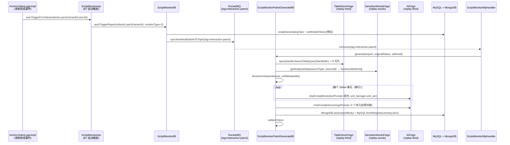
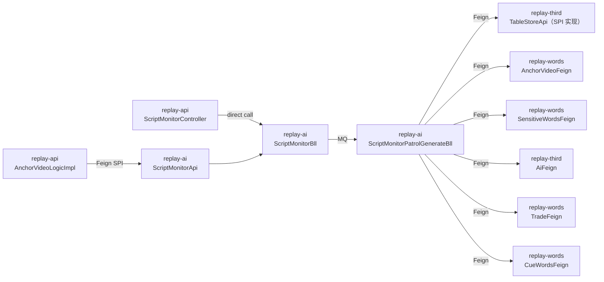

# OpenSpec — 互动巡检后端能力（T31-T36）

## 1. Context

- **Business goal:** 实现 PRD `REQ-2026-0508-互动巡检` 后端 T31-T36：自动/手动触发互动巡检报告生成，弹幕+ASR 按 10min 单元切片逐段提交 AI 分析，多单元结果合并一份最终报告（JSON），前端可展示互动有效性 % + 摘要 + 关键明细。
- **Scope of change:**
  - `replay-ai` — 新建 `ScriptMonitorPatrolGenerateBll`（独立生成流程）、`PatrolPromptFiller`（占位符填充）；修改 `ScriptMonitorBll`（DEBT-011 放开 monitorType=2 + 新增 `patrolReportDetail`）；修改 `ScriptMonitorMqHandler`（tag=interaction-patrol 路由占位 → 调新 Bll）；新建 `InteractionPatrolReportDetailVo`
  - `replay-api` — `ScriptMonitorController` 新增 `patrolReportDetail` GET endpoint
  - `replay-generic` — `TableStoreFeign` 补充 `queryDanMuSearchData(QueryDanMuBo)` 方法；新建 `replay-generic` 内的 `DanMuItemVo`（弹幕条目返回 VO，供跨模块传输）
  - `replay-third` — `TableStoreApi` 新增 `@Override queryDanMuSearchData`，委托 `TableStoreBll.queryDanMuSearchData`（已有方法，不改 Bll）后映射 `QueryDanMuVo → List<DanMuItemVo>`
  - `sql/` — `replay-31.sql`（cueType 20/21 种子 INSERT）
- **Dependencies consulted:** `explore_report.md` § Wiki Sources Consulted（PRD / TASK-BREAKDOWN / shared-capability / ai_architecture / 3 份归档 / TECH-DEBT）
- **Explorer hand-off:** `.claude/runs/Change__2026-06-04_21-26-14/explore_report.md`

## 2. Domain Model

**新/更新术语：**

| 术语 | 定义 |
|---|---|
| 互动巡检（Interaction Patrol）| monitorType=2；按弹幕 10min 单元切片分析主播对弹幕互动的有效性；输出 `effectiveRate` + `items[]` |
| 巡检单元（Patrol Unit） | 以 10min 为粒度切割的分析窗口；弹幕窗 `[t, t+10min)`；ASR 窗 `[t, t+11min)`（+1min 尾延） |
| 互动有效率（effectiveRate）| 全场有效回应弹幕数 / 全场弹幕总数（由 AI 分析给出，不在后端计算） |
| 占位符填充（Prompt Fill） | 切片分析提示词中 `#{platform}` → 平台名、`#{trade}` → 行业名；contains 判断，缺数据填默认值 |

**枚举扩容：**

`AiEnums.askType`（在 `replay-common`）已就位：
- `INTERACTION_PATROL_GENERATE_PROMPT(20, "互动巡检-生成提示词")`
- `INTERACTION_PATROL_MERGE_PROMPT(21, "互动巡检-合并提示词")`

**种子数据：** `sql/replay-31.sql` 需为 cueType=20 / 21 各 INSERT 一条 `tb_cue_words` 通用行（`trade_id=1`，`type=0` 系统提示词），提示词内容来自 `docs/2.6.01/REQ-2026-0508-互动巡检/互动巡检测切片分析提示词.md`（cueType=20）和 `互动巡检分析结果合并提示词.md`（cueType=21）。

## 2.5 Business Architecture

### 2.5.1 Business Flow



**手动触发路径**（DEBT-011 放开后）：`ScriptMonitorController.triggerReport` → `ScriptMonitorBll.triggerReport`（移除 line 415-419 的第一道闸）→ 同 MQ 路径。

### 2.5.2 Business Boundary

- **本模块（replay-ai）负责：** 生成流程调度、切片逻辑、AI 调用、Token 账务、报告落库、报告详情查询
- **不在本模块（其他模块负责）：**
  - 弹幕存储/检索（replay-third → TableStoreFeign SPI）
  - ASR 数据（replay-words → SensitiveWordsFeign SPI）
  - 监控位授权量（replay-order → UserPropertyFeign SPI）
  - 开关/主播绑定（replay-words → AnchorUrlUserFeign SPI）
  - AI 模型/Token（replay-order + replay-third → AiTokenWithholdFeign / AiFeign / AiModelFeign）
- **边界契约：** 全部跨模块调用走 replay-generic Feign SPI

### 2.5.3 Upstream / Downstream

| 方向 | 系统/模块 | 触点 | 传输内容 |
|---|---|---|---|
| Upstream | replay-words | `AnchorVideoFeign.GetByVideoId` | `AnchorVideoInfoVo`（含 batchNumber / existBarrage / tradeId / platformType / duration） |
| Upstream | replay-words | `SensitiveWordsFeign.getAnalysisData` | `SentenceMarkVo[]`（含词级 startTime/endTime） |
| Upstream | replay-third（TableStore） | `TableStoreFeign.queryDanMuSearchData`（**本批新增 SPI**） | `DanMuItemVo[]`（弹幕条目列表） |
| Upstream | replay-words | `CueWordsFeign.getCueWordByTradeAndType(tradeId, 20 或 21)` | 切片/合并提示词文本 |
| Upstream | replay-words | `TradeFeign.listTradeByIds([tradeId])` | `TradeVo.name`（行业名，用于 `#{trade}` 占位符填充） |
| Upstream | replay-order | `UserPropertyFeign.checkMonitorPosition` | `MonitorPositionAuthVo.hasAuth` |
| Upstream | replay-order | `AiTokenWithholdFeign`（预扣/实扣/返还） | `RedisWithholdVo` |
| Downstream | replay-api | `ScriptMonitorController.patrolReportDetail` | `InteractionPatrolReportDetailVo` |

### 2.5.4 Business Rules

- Rule 1：弹幕为空（`existBarrage=0` 或 TableStore 查返空）→ 自动触发置 `status=NOT_APPLICABLE`、返还预扣 Token；手动触发抛 `BusinessException(SCRIPT_MONITOR_NO_BARRAGE)`。
- Rule 2：巡检提示词 cueType=20/21 全链路无配置（tradeId 父链 + 通用 trade_id=1 均无）→ 抛 `BusinessException`，文案含 tradeId。
- Rule 3：占位符填充 contains 判断；`#{platform}` 数据 null → 默认值 "全平台"；`#{trade}` 数据 null → 默认值 "通用"；提示词不含占位符 → 原样透传。
- Rule 4：Token 预扣在 `createGeneratingTask` 之后、投 MQ 之前完成（与质检范式一致）；生成失败必须调 `returnAiToken`。
- Rule 5：`patrolReportDetail` 接口，非分享场景下 `report.tenantId` 必须等于 `user.activeTenantId`；报告人（video.userId = user.id）才允许 `canConfirm=true`。
- Rule 6：monitorType=2 手动触发，不校验监控位授权量（与质检 PRD R-P0-003 手动触发一致，仅校验套餐功能权限 + Token）。

## 3. API Contract

### 3.1 patrolReportDetail GET 接口

- **Endpoint:** `GET /replay/script-monitor/patrolReportDetail`
- **Auth:** 需要 Token header（JWT 用户身份）；租户 + 用户从 JWT 取，不接受外部传入。
- **Request:**

  | Field | Type | Required | Validation | 含义 |
  |---|---|---|---|---|
  | reportId | Long | 是 | > 0 | 互动巡检报告 ID |

  JSON 示例（query param）：
  ```
  GET /replay/script-monitor/patrolReportDetail?reportId=1234567890
  ```

- **Response 成功：**
  ```json
  {
    "code": 0,
    "msg": "success",
    "data": {
      "reportId": "<Long>",
      "sourceType": "<Integer: 0=录制视频>",
      "sceneType": "<Integer: 1=视频分析>",
      "sourceId": "<String: videoId>",
      "status": "<Integer: 0-4>",
      "summaryJson": "<String | null: {effectiveRate,totalUnits,totalBarrages,validReplies,invalidReplies,invalidDetails[]}>",
      "reportContent": "<String | null: 合并报告 JSON 原文>",
      "anchorName": "<String>",
      "liveTitle": "<String>",
      "liveTime": "<Date>",
      "canConfirm": "<Boolean>",
      "confirmedAt": "<Date | null>",
      "createDate": "<Date>"
    }
  }
  ```

- **错误码：**
  - `SCRIPT_MONITOR_REPORT_NOT_EXIST` — reportId 不存在或已删除
  - `SCRIPT_MONITOR_NO_PERMISSION` — 租户 tenantId 不匹配

### 3.2 triggerReport POST 接口（存量接口，DEBT-011 放开）

- **Endpoint:** `POST /replay/script-monitor/triggerReport`（已有，不改签名）
- **Change:** `monitorType=2` 不再抛 70014；进入正常校验链（`existBarrage` 校验保留在 line 450-453，该 null + 范围校验也在此处）。
- 其余字段/校验/返回格式不变。

## 4. Data Model

### 4.1 新增 SQL — cueType 种子数据

```sql
-- replay-31.sql（仅种子 INSERT，无 DDL 改表）
-- cueType=20 互动巡检-生成提示词（通用行业 trade_id=1，系统提示词 type=0）
INSERT INTO tb_cue_words (id, trade_id, type, problem, ask_type, create_date, update_date, is_deleted, tenant_id)
SELECT #{snowflake_id_1}, 1, 0, #{切片分析提示词内容}, 20, NOW(), NOW(), 0, 0
WHERE NOT EXISTS (SELECT 1 FROM tb_cue_words WHERE ask_type = 20 AND trade_id = 1 AND is_deleted = 0);

-- cueType=21 互动巡检-合并提示词（通用行业 trade_id=1，系统提示词 type=0）
INSERT INTO tb_cue_words (id, trade_id, type, problem, ask_type, create_date, update_date, is_deleted, tenant_id)
SELECT #{snowflake_id_2}, 1, 0, #{合并提示词内容}, 21, NOW(), NOW(), 0, 0
WHERE NOT EXISTS (SELECT 1 FROM tb_cue_words WHERE ask_type = 21 AND trade_id = 1 AND is_deleted = 0);
```

**说明：** 使用 `WHERE NOT EXISTS` 幂等 INSERT，防止重复执行。id 使用 SnowflakeManager 预生成后硬填写入 SQL 文件。提示词内容从 `docs/2.6.01/REQ-2026-0508-互动巡检/` 两份 .md 文件中提取 problem 字段值。

**实现说明（lead-engineer 必读）：**
1. `.sql` 文件直接由 mysql 客户端执行，**不走 MyBatis**；上方 `#{snowflake_id_1}` / `#{切片分析提示词内容}` 等是占位符标记，实际写文件时必须：用 `SnowflakeManager.nextValue()` 预生成两个 `long` 值硬填入 `id` 列；从两份 `.md` 文件提取提示词内容、将单引号转义（`'` → `''`）后硬填入 `problem` 列。
2. 文件名编号 `replay-31.sql` 是建议值，写文件前执行 `ls sql/` 确认实际下一编号，避免冲突。
3. 入库后 lead-engineer 必须本地验证：`SELECT id, ask_type, LENGTH(problem) FROM tb_cue_words WHERE ask_type IN (20, 21) AND trade_id = 1;`，预期返 2 行且 `LENGTH(problem) > 0`。

### 4.2 新增 VO — `replay-generic` 中的跨模块传输对象

**`DanMuItemVo`（新建）**（`replay-generic/.../vo/third/DanMuItemVo.java`）：

| 字段 | 类型 | 含义 |
|---|---|---|
| content | String | 弹幕文本内容 |
| recordDate | Long | 弹幕时间戳（毫秒，视频内偏移） |
| nickName | String | 用户昵称 |
| level | Long | 用户等级 |

**注：** `replay-third` 的 `QueryDanMuVo` 不在 generic 层，无法跨模块使用。本次在 generic 新增精简版 `DanMuItemVo` 供 `TableStoreFeign.queryDanMuSearchData` 返回。`replay-third` 的 `TableStoreBll.queryDanMuSearchData` 实现方需映射转换。

### 4.3 TableStoreFeign 接口扩充

**`TableStoreFeign`（修改）**（`replay-generic/.../feign/third/TableStoreFeign.java`）：

新增方法：
```java
/**
 * 按时间窗查询弹幕数据（互动巡检切片数据源）
 * @param bo 查询条件（startTime/endTime 必填，videoId/batchNumber 必填）
 * @return 弹幕条目列表（空列表非 null）
 */
List<DanMuItemVo> queryDanMuSearchData(QueryDanMuBo bo);
```

**实现说明：** `replay-third` 中 `TableStoreApi`（Feign SPI 实现位，与 `AiApi.java` / `ChanmamaApi.java` 等同目录）新增 `@Override queryDanMuSearchData(QueryDanMuBo)`，内部委托现有 `TableStoreBll.queryDanMuSearchData(bo)` —— 该方法已存在（返 `R<QueryDanMuVo>`），Api 层调用后取 `r.getData().getList()` 做内存映射 `QueryDanMuVo.getList()` 元素 → `DanMuItemVo`（字段子集）后返回。`TableStoreBll.java` **不需要修改**（现网方法原样保留）。

### 4.4 无新表，现有表字段不变

- `tb_script_monitor_report` — 已含 `summary_json TEXT`、`monitor_type`、`status` 等，不需加字段。
- MongoDB `script_monitor_report_body` — 已有，存合并 JSON 原文，不变。

### 4.5 Data Lifecycle

- 软删除：`is_deleted = 1`（手动，禁 `@TableLogic`）
- 租户隔离：所有读查询必带 `tenant_id = #{tenantId}` + `is_deleted = 0` 过滤

## 5. Business Logic

### 5.1 自动触发 Happy Path（AC-1）

1. 录制完成事件 → `ScriptMonitorApi.autoTriggerForVideo`（已有，B7）
2. `is_interaction_patrol=1` + `interactionPatrolNum.totalQuantity>0` + Token≥100k 三校验（已有，`tryTriggerCapability`）
3. → `ScriptMonitorBll.autoTriggerReport(videoId, userId, tenantId, monitorType=2)`
4. 查现有报告（防重：GENERATING 状态直接 skip）
5. `createGeneratingTaskAndReturn`（status→GENERATING）
6. 预扣 Token（自动触发路径：`withhold=null`，不预扣；沿用 B7 现有逻辑）
7. `syncSendAndDeliverToTopic(tag=tagInteractionPatrol)`
8. MQ consumer：`ScriptMonitorMqHandler.handle` 路由到 `ScriptMonitorPatrolGenerateBll.generate`
9. `generate` 执行：见 §5.1.1

### 5.1.1 ScriptMonitorPatrolGenerateBll.generate（核心步骤）

```
a. 任务级总超时基准（startMs = System.currentTimeMillis()）

b. 加载弹幕检测前提：取 AnchorVideoInfoVo（含 existBarrage / batchNumber / duration / platformType / tradeId）
   → existBarrage=0 或 batchNumber 为空 → markNotApplicable("本场无弹幕") + returnAiToken + return

c. 加载全量 ASR：SensitiveWordsFeign.getAnalysisData(sourceType, sourceId)
   → 返空 → 不置 NOT_APPLICABLE（巡检以弹幕为主，ASR 为辅；ASR 空时单元文本填空字符串，弹幕不为空仍可生成）

d. 计算切片数量：N = ceil(video.duration(ms) / 10min)，最小 1 个单元

e. 按行业取提示词：
   - cueType=20（切片）: loadSingleCueWord(20, "互动巡检切片提示词", tradeId)
   - cueType=21（合并）: loadSingleCueWord(21, "互动巡检合并提示词", tradeId)

f. 取 AI 模型配置

g. checkTimeout("beforeSliceLoop")

h. 串行切片 AI 调用（i = 0..N-1）：
   对每个单元 [i*10min, (i+1)*10min)（弹幕窗） / [i*10min, i*11min)（ASR 窗，+1min 尾延）：
   - 弹幕数据：TableStoreFeign.queryDanMuSearchData(QueryDanMuBo{videoId, batchNumber, startTime, endTime, userId, tenantId})
   - 弹幕为空 → unitBarrageText = ""（继续，不中止）
   - ASR 数据：sliceAsrUnits(sentences, unitStartMs, unitEndMs+1min)
   - fillPrompt: PatrolPromptFiller.fill(sliceCue.problem, platformName, tradeName)
   - AI 调用：aiFeign.chatCompletion(model, buildAiMessage(filledPrompt, unitBarrageText + unitAsrText))
   - 累计 totalTokens
   - 中间结果暂存 List<String>（不落 MongoDB 中间集合，与质检范式有别）

i. 拼合并输入：List<String> → 按 "\n---\n" join

j. AI 合并调用：aiFeign.chatCompletion(model, buildAiMessage(mergeCue.problem, mergeInput))

k. 覆盖写最终报告正文：MongoDB.script_monitor_report_body

l. buildSummary(report, finalResult.content)（提取 summary 子对象）

m. reportWriteService.finishReport(reportId, bodyId, summaryJson)（@Transactional，独立 Bean）

n. settleAiToken
```

**失败补偿：** 任何步骤抛异常 → `returnAiToken(withhold)` + `reportWriteService.restoreOrFail`（与质检补偿逻辑相同，直接复用）。

### 5.1.2 ASR 单元切片器（私有静态方法）

```
sliceAsrUnits(List<SentenceMarkVo> sentences, long unitStartMs, long unitEndMs):
  - 取 sentence.items.get(0).startTime 作为归桶时间（词级时间戳）
  - 条件：items 非空 AND items[0].startTime ∈ [unitStartMs, unitEndMs)
  - 拼接 "[段落 X 时间 HH:mm:ss-HH:mm:ss] content"（与质检 tryLoadAsrText 格式一致）
  - 返回 String（空时返回 ""）
```

### 5.2 手动触发 Happy Path（AC-2，DEBT-011 放开）

**修改点（ScriptMonitorBll.triggerReport line 415-419）：**

删除：
```java
if (!MonitorTypeEnum.QUALITY_INSPECTION.getCode().equals(bo.getMonitorType())) {
    throw new BusinessException(StatusCode.SCRIPT_MONITOR_FEATURE_NOT_AVAILABLE.getCode(), "...");
}
```

替换为（仅保留还原度暂禁）：
```java
if (MonitorTypeEnum.FIDELITY_MONITOR.getCode().equals(bo.getMonitorType())) {
    throw new BusinessException(StatusCode.SCRIPT_MONITOR_FEATURE_NOT_AVAILABLE.getCode(), "话术还原度功能未上线，敬请期待");
}
```

**注意：** line 446-453 的 `INTERACTION_PATROL + existBarrage=0 → SCRIPT_MONITOR_NO_BARRAGE` 校验保持不变（这是手动触发的 existBarrage 兜底）。

### 5.3 patrolReportDetail 方法逻辑（AC-7）

```
1. 参数校验：reportId 非 null
2. currentUser() 取 tenantId + userId
3. reportService.getById(reportId) → null 或 isDeleted=1 → SCRIPT_MONITOR_REPORT_NOT_EXIST
4. tenantId 不匹配 → SCRIPT_MONITOR_NO_PERMISSION
5. loadSingleVideo(report.sourceType, report.sourceId) → AnchorVideoInfoVo（可为 null，不抛）
6. canConfirm = (video != null && video.getUserId() 等于 user.id)
7. MongoDB 查 reportBody（reportBodyId 对应的 content）
8. 装配 InteractionPatrolReportDetailVo 并返回
```

注意：`patrolReportDetail` 不做 `confirmRead` 操作（只读接口），角色确认列表不纳入本接口（质检特有业务）。

### 5.4 占位符填充（PatrolPromptFiller）

```java
// PatrolPromptFiller.fill(String promptTemplate, String platformName, String tradeName)
// 1. 判断 contains "#{platform}" → replace → 否则原样
// 2. 判断 contains "#{trade}" → replace → 否则原样
// 3. platformName null → 使用 "全平台"；tradeName null → 使用 "通用"
// 返回填充后的提示词
```

行业名取值：`TradeFeign.listTradeByIds(List.of(tradeId))` 取列表第一条的 `name` 字段（`TradeVo.name`），返空/null → tradeName=null → 填 "通用"。

### 5.5 MQ tag 路由修改（ScriptMonitorMqHandler line 94-97）

```java
// 修改前（占位，跳过）：
if (tags.getTagInteractionPatrol() != null && tags.getTagInteractionPatrol().equals(tag)) {
    log.warn("互动巡检 monitor 未实现，跳过 ...");
    return ConsumeResult.SUCCESS;
}

// 修改后（调新 Bll）：
if (tags.getTagInteractionPatrol() != null && tags.getTagInteractionPatrol().equals(tag)) {
    return doPatrolGenerate(report, msg, messageKey);
}
```

新增 `doPatrolGenerate`（结构与 `doGenerate` 完全相同，注入 `ScriptMonitorPatrolGenerateBll`）。

### 5.6 分支与异常

| 分支 | 触发条件 | 处理 | 错误码 |
|---|---|---|---|
| 无弹幕-手动 | `existBarrage=0`（line 450-453 保留） | 抛 BusinessException + returnAiToken（预扣在前已扣） | `SCRIPT_MONITOR_NO_BARRAGE` |
| 无弹幕-自动 | TableStore 返空 | `markNotApplicable("本场无弹幕")` + returnAiToken | — |
| 提示词未配置 | cueType=20/21 全链路无配置 | 抛 BusinessException | `SCRIPT_MONITOR_PARAM_INVALID` |
| Token 不足 | `aiTokenBalance < 100000` | 抛 BusinessException（预扣前快速余额判断） | `SCRIPT_MONITOR_TOKEN_NOT_ENOUGH` |
| 还原度暂禁 | monitorType=1 | 抛 BusinessException | `SCRIPT_MONITOR_FEATURE_NOT_AVAILABLE` |
| 报告不存在 | patrolReportDetail 查不到 | 抛 BusinessException | `SCRIPT_MONITOR_REPORT_NOT_EXIST` |
| 无读权限 | tenantId 不匹配 | 抛 BusinessException | `SCRIPT_MONITOR_NO_PERMISSION` |
| 任务超时 | 总耗时 > 10min | checkTimeout 主动抛异常 → 走失败补偿 | `SCRIPT_MONITOR_PARAM_INVALID` |

### 5.7 幂等 / 重放安全

- GENERATING 状态：自动触发在 `autoTriggerReport` 第 3 步判断直接 skip；手动触发走 `@NoRepeatSubmit` + 唯一键 `uk_tenant_source_monitor` 兜底并发。
- MQ 消费幂等：`ScriptMonitorMqHandler` 已有 `GENERATED` 状态 skip 逻辑（line 75-80），互动巡检 consumer 复用相同前置检查。

## 5.5 Technical Architecture

### 5.5.1 Module Topology



### 5.5.2 Cross-Module Communication

| Channel | From → To | Contract | Failure Handling | 实现位 |
|---|---|---|---|---|
| Feign | replay-ai → replay-third | `TableStoreFeign#queryDanMuSearchData(QueryDanMuBo) → List<DanMuItemVo>`（**本批新增**） | 返空列表 → 视为无弹幕；不抛异常 | `TableStoreApi`（SPI 实现）委托 `TableStoreBll.queryDanMuSearchData` 现成方法后映射 |
| Feign | replay-ai → replay-words | `AnchorVideoFeign#GetByVideoId(sourceId)` → `AnchorVideoInfoVo` | 返 null → 报告异常终止（失败补偿接管） | 已有 SPI |
| Feign | replay-ai → replay-words | `SensitiveWordsFeign#getAnalysisData` | 返空/null → ASR 文本置 "" | 已有 SPI |
| Feign | replay-ai → replay-words | `CueWordsFeign#getCueWordByTradeAndType(tradeId, 20/21)` | 返 null → 抛 BusinessException | 已有 SPI |
| Feign | replay-ai → replay-words | `TradeFeign#listTradeByIds([tradeId])` | 返空 → tradeName = null → 默认值 "通用" | 已有 SPI |
| MQ | replay-ai ScriptMonitorBll → ScriptMonitorMqHandler | `topic=scriptMonitorTopic, tag=tagInteractionPatrol` | DLQ after 3 retries（已有配置） | — |

**关键约束：** `replay-ai` 不可直接注入 `TableStoreBll`（replay-third Bean）。必须通过 `TableStoreFeign` SPI。本批在 `replay-generic` 中补充 SPI 方法 + `DanMuItemVo`，`replay-third` 中在 `TableStoreApi` 加 `@Override` 实现（委托现有 `TableStoreBll.queryDanMuSearchData`，`TableStoreBll.java` 本身不需修改）。

### 5.5.3 Async Tasks

- MQ consumer：topic = `scriptMonitorMqProperties.topic`，tag = `tagInteractionPatrol`（已配），consumer-group = 已有 script-monitor consumer group（B4）；max retries = 3；DLQ 已有。
- XXL-Job 扫描：`syncSendAndDeliverToTopic` 写本地消息表 → XXL-Job 5min 扫表兜底（已有基建，不变）。

### 5.5.4 Cache Strategy

- 弹幕数据：`TableStoreBll.queryDanMuSearchData` 内置 2h Redis 缓存（`barrageRedisKey`，缓存 `QueryDanMuVo` 全字段 JSON，现有逻辑，不变）。`TableStoreApi.queryDanMuSearchData` 委托 `TableStoreBll.queryDanMuSearchData` —— 命中 Bll 内现有 2h Redis 缓存后，Api 层在每次返回时做内存映射 `QueryDanMuVo.getList()` → `List<DanMuItemVo>`，**不引入新缓存 key**，不与 Bll 缓存冗余。
- 不新增 Redis key。

### 5.5.5 Transaction Boundary

- `ScriptMonitorReportWriteService.finishReport`：`@Transactional(rollbackFor = Exception.class)`（独立 Bean，已有，巡检复用）
- `ScriptMonitorReportWriteService.restoreOrFail`：`@Transactional`（同上）
- `ScriptMonitorReportWriteService.markNotApplicable`：`@Transactional`（同上）
- `rocketMqBll.syncSendAndDeliverToTopic`：`@Transactional`（已有，写本地消息表 + 直发）
- 注意：`ScriptMonitorPatrolGenerateBll.generate` 本身不加 `@Transactional`（长流程，含多次 AI 调用，禁止长事务）

### 5.5.6 Observability

- Log keys：`tenantId`、`reportId`、`videoId`、`monitorType`、切片 index（`unitIdx`）
- 关键 log point：弹幕切片条数（`danmuCount=N`）、ASR 归桶条数（`asrCount=N`）、每单元 AI totalTokens、合并 AI totalTokens、最终 summaryJson 前 200 字
- 敏感字段不入日志（提示词 problem 内容、ASR 全文）

## 6. Non-Functional Constraints

- **Security/Permissions:** `patrolReportDetail` 接口非分享场景必须 `report.tenantId == user.activeTenantId`；`canConfirm` 仅录制人（不接受外部 userId 参数，从 JWT 取）
- **Concurrency/Idempotency:** 手动触发 `@NoRepeatSubmit`（已有）+ 唯一键 `uk_tenant_source_monitor` 防并发；GENERATING 状态 skip 防重复自动触发
- **Forbidden Patterns (DO NOT):**
  - DO NOT use `@Autowired` / `@Resource`（构造器注入）
  - DO NOT use `@TableLogic`（手动 `isDeleted`）
  - DO NOT call `TableStoreBll` directly from `replay-ai`（跨模块 Bean 注入）
  - DO NOT use `${}` SQL placeholder
  - DO NOT log prompt content / ASR full text（防业务内容泄露）
  - DO NOT add `@Transactional` to `ScriptMonitorPatrolGenerateBll.generate`（禁长事务）
- **Partial Failure Rollback:** 任何步骤抛异常 → `returnAiToken(withhold)` + `reportWriteService.restoreOrFail`
- **Performance Budget:** PRD P95 ≤ 5min；串行切片（DEBT-017 未清前不并发）；单元数上限 = ceil(duration / 10min)，60min 最多 6 个单元，保守估计 6×AI 调用 ≤ 3min + 合并 AI ≤ 30s = ~3.5min < 5min P95
- **IN-clause:** 行业查询 `listTradeByIds([tradeId])` 单条，无 IN 超 500 风险

## 7. Acceptance Criteria

- **AC-1 自动触发 happy path:** Given 自有账号 + `is_interaction_patrol=1` + `interactionPatrolNum.totalQuantity>0` + Token≥100k + 弹幕/ASR/时间轴就绪，When 录制完成事件触发自动生成，Then 创建报告任务 → MQ 投递 tag=interaction-patrol → 异步生成 → 报告 status=GENERATED。
- **AC-2 手动触发 happy path (DEBT-011 放开):** Given 自有账号 + 当前版本有授权量 + Token≥100k + `video.existBarrage=1`，When POST `/replay/script-monitor/triggerReport` monitorType=2，Then 不再抛 70014；进入正常校验链；预扣 Token + 投递 MQ + 返回。
- **AC-3 10min 单元切片:** Given 一场 60min 直播录像，When 巡检生成，Then 弹幕按 [0, 10min) [10min, 20min) ... 6 个窗口分片查 TableStore；ASR 段落按 `items[0].startTime` 归桶 [0, 11min) [10min, 21min) ...（窗口 +1min 尾延）；6 个分片结果合并为 1 份最终报告 JSON。
- **AC-4 无弹幕兜底:** Given `video.existBarrage=0`（或 TableStore 查询返空），When 自动触发，Then 报告 status=NOT_APPLICABLE + unavailableReason="本场无弹幕" + 预扣 Token 返还；手动触发抛 BusinessException(SCRIPT_MONITOR_NO_BARRAGE)，预扣 Token 返还。
- **AC-5 占位符填充:** Given 切片分析提示词含 `#{platform}` / `#{trade}` 中任一或两个，When fill 工具处理，Then 命中位 → `VideoPlatformEnum.{code}.getRemarks()` / `TradeVo.name`（via `TradeFeign.listTradeByIds`）替换；数据为 null → 填默认值 "全平台" / "通用"。Given 提示词不含占位符 → 原样透传 AI（contains 判断兜底）。
- **AC-6 按行业取提示词:** Given `video.tradeId=X`（cueType=20/21 在 X 配置 OR 父链 OR 通用 trade_id=1 配置），When loadCueWord，Then `CueWordsFeign.getCueWordByTradeAndType(X, 20/21)` 返非空；全链路无配置 → 抛 BusinessException 文案含 tradeId。
- **AC-7 报告详情接口:** Given reportId 对应一份巡检报告 status=GENERATED，When GET `/replay/script-monitor/patrolReportDetail?reportId=...`，Then 返 `R<InteractionPatrolReportDetailVo>` 含 `effectiveRate`（从 summaryJson 解析）/ `summaryJson` / `reportContent` / `canConfirm` / `createDate`；非录制人账号 `canConfirm=false`；非分享场景下报告 tenantId 必须与当前账号一致。
- **AC-8 报告 JSON 落地:** Given AI 调用返合并 JSON（按合并提示词 schema），When 解析 + 落库，Then `script_monitor_report_body` MongoDB 存 JSON 原文；`tb_script_monitor_report.summary_json` 存提取的 summary 子集（effectiveRate + 总数 + 单元数），前端列表页直接取 summary_json 渲染。

**单测要求：**

| AC-id | 测试类 | 方法 | 关键 Assert |
|---|---|---|---|
| AC-2 | `ScriptMonitorBllTest` | `triggerReport_monitorType2_noLongerThrows70014` | 不抛 70014；调用链到 createGeneratingTask |
| AC-3 | `ScriptMonitorPatrolGenerateBllTest` | `sliceAsrUnits_60minVideo_produces6Buckets` | 6 个单元，窗口边界正确 |
| AC-4 | `ScriptMonitorPatrolGenerateBllTest` | `generate_existBarrageFalse_marksNotApplicable` | status=NOT_APPLICABLE；returnAiToken 被调用 |
| AC-5 | `PatrolPromptFillerTest` | `fill_bothPlaceholders_replaced` / `fill_neitherPlaceholder_unchanged` | 替换结果或原样返回 |
| AC-6 | `ScriptMonitorPatrolGenerateBllTest` | `loadSingleCueWord_noCue_throwsWithTradeId` | 抛 BusinessException 文案含 tradeId |
| AC-7 | `ScriptMonitorBllTest` | `patrolReportDetail_tenantMismatch_throwsNoPermission` | 抛 SCRIPT_MONITOR_NO_PERMISSION |

## 8. Frontend Contract Publishing

- `frontend-facing: true`
- `module: script-monitor`

当 `frontend-facing: true` 时：
- Implement 阶段完成后，dispatch `@frontend-api-doc-writer`（mode: forward），读取 §3 API Contract + §4 Data Model + §7 AC examples，产出 `.claude/llm_wiki/wiki/frontend-api/script_monitor.md`。
- 更新内容：新增 `patrolReportDetail` 接口描述；`InteractionPatrolReportDetailVo` 字段表；`summaryJson` schema（effectiveRate / totalUnits / totalBarrages / validReplies / invalidReplies / invalidDetails[]）。
- Archive 阶段：mode: reverse 检查字段漂移。

---

## Allowed Scope

```
replay-ai/src/main/java/com/jiuyu/replay/ai/bll/ScriptMonitorPatrolGenerateBll.java       (新建)
replay-ai/src/main/java/com/jiuyu/replay/ai/bll/PatrolPromptFiller.java                   (新建)
replay-ai/src/main/java/com/jiuyu/replay/ai/vo/InteractionPatrolReportDetailVo.java        (新建)
replay-ai/src/main/java/com/jiuyu/replay/ai/bll/ScriptMonitorBll.java                     (修改：DEBT-011 + patrolReportDetail)
replay-ai/src/main/java/com/jiuyu/replay/ai/bll/ScriptMonitorMqHandler.java               (修改：tag 路由占位 → 调新 Bll)
replay-api/src/main/java/com/jiuyu/replay/api/controller/words/ScriptMonitorController.java (修改：新增 patrolReportDetail endpoint)
replay-generic/src/main/java/com/jiuyu/replay/generic/feign/third/TableStoreFeign.java    (修改：新增 queryDanMuSearchData 方法)
replay-generic/src/main/java/com/jiuyu/replay/generic/vo/third/DanMuItemVo.java           (新建)
replay-third/src/main/java/com/jiuyu/replay/third/api/TableStoreApi.java                   (修改：新增 @Override queryDanMuSearchData，委托 TableStoreBll 现成方法，映射 QueryDanMuVo → List<DanMuItemVo>)
sql/replay-31.sql                                                                          (新建：cueType 20/21 种子 INSERT)
docs/2.6.01/REQ-2026-0508-互动巡检/互动巡检分析结果合并提示词.md                              (修改：CRITICAL-1 — totalUnits/10 个单元 硬编码 → 动态描述；sql line 12 同步重写)
replay-ai/src/test/java/com/jiuyu/replay/ai/bll/ScriptMonitorPatrolGenerateBllTest.java   (新建：单测)
replay-ai/src/test/java/com/jiuyu/replay/ai/bll/PatrolPromptFillerTest.java               (新建：单测)
replay-ai/src/test/java/com/jiuyu/replay/ai/bll/ScriptMonitorBllTest.java                 (修改：MAJOR-2 删/改旧行为单测 + MAJOR-3 新增 patrolReportDetail_tenantMismatch 单测)
docs/TECH-DEBT.md                                                                          (修改：DEBT-011 OPEN → DONE)
```

---

## 做什么 / 为什么

**现状：** 互动巡检（monitorType=2）端到端能力缺失：MQ handler 是占位 warn-log、手动触发入口被 70014 硬拦、报告详情接口不存在、弹幕切片 + 占位符填充均未实现。PRD T31-T36 全部 PENDING。

**需要：** 接通完整生成流程——DEBT-011 放开手动触发闸门；实现 `ScriptMonitorPatrolGenerateBll`（弹幕 10min 切片 + ASR 归桶 + 占位符填充 + 串行 AI 多轮 + 合并）；MQ 路由接通；`patrolReportDetail` 接口落地；cueType 20/21 种子数据入库。

**范围：** replay-ai（核心生成 Bll）+ replay-api（1 个 endpoint）+ replay-generic（TableStoreFeign SPI + DanMuItemVo）+ replay-third（TableStoreApi 加 `@Override` 委托 TableStoreBll 现成方法）+ sql（种子 INSERT）。共 13 个文件。

## 怎么做

1. **最简原则：** 最大化复用质检已有基建（`ScriptMonitorBll` 触发链、`ScriptMonitorMqHandler` consumer 框架、`reportWriteService` 事务 Bean、`loadSingleCueWord` + `resolveTradeId` + `buildAiMessage` + 失败补偿逻辑），仅新建差异化部分（切片器、占位符填充、独立 PatrolGenerateBll）。

2. **弹幕 SPI 补充：** `TableStoreFeign` 目前只有 count 方法，无法跨模块取弹幕条目。需在 `replay-generic` 补 `queryDanMuSearchData → List<DanMuItemVo>` + 在 `replay-third` 的 `TableStoreApi`（SPI 实现位，与 `AiApi.java` 同目录）加 `@Override` 方法，委托 `TableStoreBll.queryDanMuSearchData`（现成方法，返 `R<QueryDanMuVo>`，已含 2h Redis 缓存）后做内存映射。`TableStoreBll.java` 本身不需修改。这是本批唯一触及 replay-third 的点，改动极小（1 个 adapter 方法）。

3. **串行切片策略：** 6 个单元 AI 调用串行 forEach（非并发）。原因：DEBT-017（AI QPS 上游限速未清）；串行 P95 约 3.5min 仍满足 PRD 5min 目标；并发化可待 DEBT-017 解决后作 follow-up PATCH。

4. **cueType 20/21：** `AiEnums.askType` 已包含两个枚举常量，无需改 Java 代码；只需 `sql/replay-31.sql` 补种子 INSERT。
