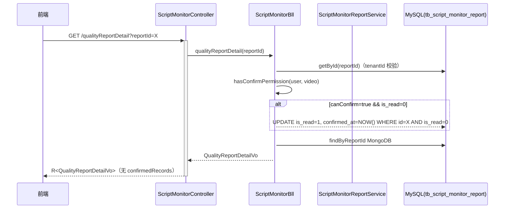
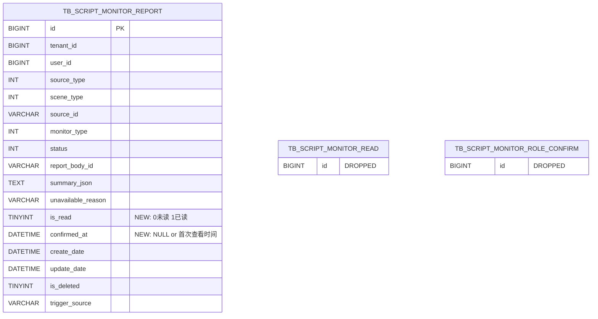
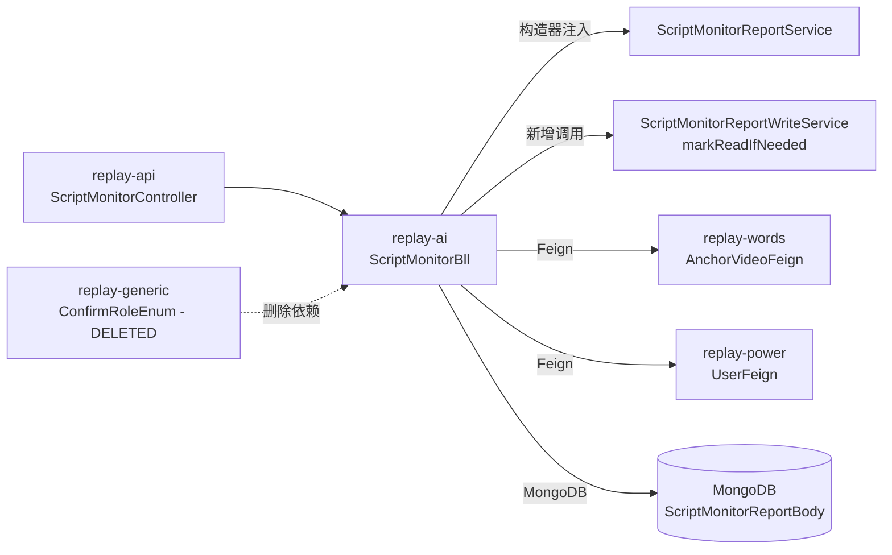

spec_mode: STANDARD
risk: HIGH
frontend-facing: true
module: replay-ai
triggers: [domain, api, data, business-arch, tech-arch, adr]

---

## 1. Context

- **Business goal (one sentence):** 删除"确认已读"独立 endpoint 和两张子表，将已读语义内置到 detail 接口，仅录制人本人查看时自动标记已读，消除运营/主播/主管手动勾选"已知晓"的显式操作。
- **Scope of change:**
  - 模块：`replay-ai`（核心：ScriptMonitorBll / ScriptMonitorReportEntity / ScriptMonitorReportWriteServiceImpl + 相关 Entity/DAO/Service × 8 删除）；`replay-api`（ScriptMonitorController 删端点）；`replay-generic`（ConfirmRoleEnum 删除）。
  - DDL：`tb_script_monitor_report` ADD COLUMN × 2；DROP TABLE × 2。
  - API：删除 `POST /replay/script-monitor/confirmRead`（breaking）；改 `QualityReportDetailVo`（删 `confirmedRecords`）；改 `InteractionPatrolReportDetailVo.confirmedAt` 语义来源。
- **Dependencies consulted:**
  - `.claude/llm_wiki/wiki/preferences/index.md`
  - `.claude/llm_wiki/wiki/data/ai_data.md`
  - `.claude/llm_wiki/wiki/data/words_data.md`
  - `.claude/llm_wiki/archive/index.md`
- **Explorer hand-off:** `.claude/runs/Change__2026-06-08_13-17-24/explore_report.md`（AC 001-011 + Delta 12 条 + Hidden Scope 20 条完整列举）

---

## 2. Domain Model

- **削减的业务术语：**
  - `ConfirmRead`（显式确认已读）= 录制人/运营/主播/主管手动调接口标记已知晓；**删除**，替换为"查看即已读"语义。
  - `ConfirmRole`（角色已知晓）= 质检报告三角色（运营1/主播2/主管3）勾选状态；**删除**，整个功能下线。
- **新增的业务术语：**
  - `is_read`（报告已读标志）= `tb_script_monitor_report.is_read`，0=未读，1=已读（仅录制人本人首次打开 detail 接口时由后端自动置 1）。
  - `confirmed_at`（录制人首次查看时间）= `tb_script_monitor_report.confirmed_at`，NULL=未读，非NULL=首次查看时间戳；detail 接口写已读时同步 `NOW()`（仅首次 NULL→非NULL，幂等条件 `is_read=0`）。
- **状态机变更（is_read 生命周期）：**

  | From | Event | To | Side-effect |
  |---|---|---|---|
  | `is_read=0` | 录制人首次调用 `qualityReportDetail`/`patrolReportDetail` | `is_read=1, confirmed_at=NOW()` | 独立事务写，不影响详情读取 |
  | `is_read=1` | 录制人再次调用 detail 接口 | `is_read=1`（不变） | UPDATE 跳过（幂等谓词 `is_read=0`） |
  | 任意值 | `triggerReport` 重新生成 | `is_read=0, confirmed_at=NULL` | 与 GENERATING 状态重置同步写 |

- **Enum 变更：**
  - `ConfirmRoleEnum`（`replay-generic/enums/words/`）：**整体删除**；仅被 `ScriptMonitorBll` 引用（已验证）。

---

## 2.5 Business Architecture

### 2.5.1 Business Flow



### 2.5.2 Business Boundary

- **In scope（replay-ai 拥有）：** 已读状态写入逻辑（ScriptMonitorBll）；报告实体字段维护（ScriptMonitorReportEntity）；ScriptMonitorReportWriteServiceImpl（resetIsRead 新增方法）。
- **Out of scope（其他模块拥有）：** 视频归属鉴权（`AnchorVideoFeign` / `SensitiveWordsFeign`，replay-words 拥有）；用户信息（`UserFeign`，replay-power 拥有）。
- **Boundary contract：** 跨模块只走已有 Feign SPI，本次无新增 Feign 接口。

### 2.5.3 Upstream / Downstream

| Direction | System / Module | Touchpoint | What flows |
|---|---|---|---|
| Upstream | replay-words | `AnchorVideoFeign#GetByVideoId` | 视频归属信息（tenantId/userId） |
| Upstream | replay-power | `UserFeign#getLocalUser` | 当前登录用户 |
| Downstream | 前端 | `qualityReportDetail` / `patrolReportDetail` 响应契约 | 删 confirmedRecords；改 confirmedAt 语义；保留 isRead |

### 2.5.4 Business Rules（本次新增/变更的不变量）

- Rule 1：**仅录制人本人**（`video.userId == user.id` 且 `video.tenantId == user.activeTenantId`）查看 detail 接口时触发写已读；同租户其他用户查看不写。
- Rule 2：写已读使用独立事务（`PROPAGATION_REQUIRES_NEW` 或方法级 `@Transactional` 独立 Spring Bean），写失败不影响详情响应返回。
- Rule 3：已读写入必须幂等：UPDATE 谓词包含 `is_read = 0`，确保多次调用不重复更新 `confirmed_at`。
- Rule 4：`triggerReport` 重新生成时，`handleExistingAndReturn` 必须同步重置 `is_read=0, confirmed_at=NULL`。
- Rule 5：不 backfill 历史已读数据——历史存量通过旧 `tb_script_monitor_read` 确认的报告，迁移后 `is_read=0`，这是已知且接受的语义后果。

---

## 3. API Contract (Handoff)

### 3.1 删除的接口（BREAKING）

**`POST /replay/script-monitor/confirmRead`** — 整体删除。

前端必须在新版本部署后停止调用此接口；新版本部署后调用将返回 HTTP 404。

### 3.2 变更的接口

#### `GET /replay/script-monitor/qualityReportDetail`

- **变更类型：** 响应字段变更（BREAKING — 删字段；ADDITIVE — 已读来源改变）
- **Request：** `?reportId=<Long>`（不变）
- **Response 变更：**

  | 字段 | 变更类型 | 说明 |
  |---|---|---|
  | `confirmedRecords` | BREAKING — 删除 | 不再返回角色已知晓列表 |
  | `isRead` | ADDITIVE（语义改变） | 保留；来源从 `tb_script_monitor_read` 改为 `tb_script_monitor_report.is_read` |
  | `canConfirm` | 保持 | 仅录制人为 true（含义不变） |

- **新行为：** 录制人（`canConfirm=true`）首次调用时，后端自动写已读（is_read=0→1），响应中 `isRead=1`。

#### `GET /replay/script-monitor/patrolReportDetail`

- **变更类型：** 响应字段语义变更（BREAKING — confirmedAt 来源改变）
- **Response 变更：**

  | 字段 | 变更类型 | 说明 |
  |---|---|---|
  | `confirmedAt` | BREAKING（语义改变） | 旧：来自 `tb_script_monitor_read.createDate`；新：来自 `tb_script_monitor_report.confirmed_at`（首次 detail 调用时写入 NOW()） |
  | `isRead`（新增） | ADDITIVE | 新增字段，0/1，来自 `tb_script_monitor_report.is_read` |

  > 注：`InteractionPatrolReportDetailVo` 目前无 `isRead` 字段，本次新增以与 `QualityReportDetailVo` 保持一致。

#### `POST /replay/script-monitor/batchReportStatus` / `POST /replay/script-monitor/reportStatus`

- **变更类型：** 内部实现改变，响应字段 `monitors[].isRead` 来源从 `tb_script_monitor_read`（独立表查询）改为 `tb_script_monitor_report.is_read`（实体字段）。
- **前端契约：** `monitors[].isRead` 语义不变（0/1），前端无需改动。

---

## 4. Data Model

### 4.1 DDL（全量 `sql/replay-33.sql`）

```sql
-- ======================================================
-- replay-33.sql
-- B9: 已读语义简化 — is_read/confirmed_at 迁入报告主表
--     + 删除 tb_script_monitor_read / tb_script_monitor_role_confirm
-- 执行顺序：先 ADD COLUMN 确保字段就位，再 DROP TABLE
-- ======================================================

-- Step 1: tb_script_monitor_report 新增 is_read 字段（幂等守护）
ALTER TABLE tb_script_monitor_report
    ADD COLUMN IF NOT EXISTS is_read TINYINT NOT NULL DEFAULT 0
    COMMENT '0未读 1已读（仅录制人查看 detail 接口后置1，重新生成时重置为0）'
    AFTER update_date;

-- Step 2: tb_script_monitor_report 新增 confirmed_at 字段（幂等守护）
ALTER TABLE tb_script_monitor_report
    ADD COLUMN IF NOT EXISTS confirmed_at DATETIME NULL
    COMMENT '录制人首次查看时间戳（已读时间；重新生成时重置为 NULL）'
    AFTER is_read;

-- Step 3: 删除已读独立表（ADD COLUMN 已执行后安全删除）
DROP TABLE IF EXISTS tb_script_monitor_read;

-- Step 4: 删除角色已知晓独立表
DROP TABLE IF EXISTS tb_script_monitor_role_confirm;
```

**执行顺序说明：** 先 ADD COLUMN（Step 1/2）再 DROP TABLE（Step 3/4）。  
理由：代码上线与 DDL 执行存在窗口期。若先 DROP TABLE，旧版代码（仍调用 `readService` / `roleConfirmService`）会因表不存在抛异常。先 ADD COLUMN 后，即使旧版代码运行，`is_read`/`confirmed_at` 已存在（有 DEFAULT），新版代码 UPDATE 也能立即生效；旧子表在新版代码上线后再 DROP。

**不 backfill 语义后果（已知且接受）：** 历史通过 `confirmRead` 写入 `tb_script_monitor_read.is_read=1` 的数据，迁移后 `tb_script_monitor_report.is_read=0`（新字段 DEFAULT 0）。前端侧这些报告将重新显示为"未读"状态。此后果已与用户确认并接受（决策 8）。

### 4.2 ER 图（涉及变更的表）



### 4.3 Index Reasoning

| Index | Query scenario | Why this shape |
|---|---|---|
| 既有 `PRIMARY KEY (id)` | detail 接口按 reportId 查主表 | 单行点查，够用，无需新索引 |
| 无新索引 | `UPDATE ... WHERE id=? AND is_read=0` 走主键，幂等写不需额外索引 | is_read 列选择性低（0/1），不适合单独索引 |

### 4.4 Data Assembly Strategy

- `qualityReportDetail` / `patrolReportDetail`：单查 `reportService.getById(reportId)`，`is_read` 和 `confirmed_at` 直接从 entity 取，**无需额外查子表**。Anti-JOIN 自然满足。
- `buildMonitorStatus`：reportMap 已在 `loadReportMap` 批量加载（含新字段），`isRead = report.getIsRead()`，不再调用 `loadReadReportIds`（`tb_script_monitor_read` 查询整体删除）。

### 4.5 Lifecycle

- Soft delete：`is_deleted = 1`（已有规则，不变）。
- `is_read` / `confirmed_at` 重置：`triggerReport` 重新生成时在 `handleExistingAndReturn` 中一并重置（`is_read=0, confirmed_at=NULL`）。
- Tenant isolation：`loadReportMap` 已有 `tenant_id` 过滤；detail 接口已有 `report.tenantId == user.activeTenantId` 校验。

---

## 5. Business Logic

### 5.1 Happy Path — `qualityReportDetail`（录制人首次查看，含写已读）

1. 入参校验：`reportId != null`，否则抛 `SCRIPT_MONITOR_PARAM_INVALID`。
2. `currentUser()` 取当前用户。
3. `reportService.getById(reportId)`，`null` 或 `isDeleted=1` 抛 `SCRIPT_MONITOR_REPORT_NOT_EXIST`。
4. 租户校验：`report.tenantId != user.activeTenantId` 抛 `SCRIPT_MONITOR_NO_PERMISSION`。
5. `loadSingleVideo(report.sourceType, report.sourceId)` 取视频/文件归属信息。
6. `canConfirm = hasConfirmPermission(user, video)`（`video.tenantId == user.activeTenantId && video.userId == user.id`）。
7. **写已读（仅当 `canConfirm=true && report.isRead == 0`）：**
   - 调用独立 Spring Bean `ScriptMonitorReportWriteService#markReadIfNeeded(reportId)`（独立事务）。
   - 内部执行：`UPDATE tb_script_monitor_report SET is_read=1, confirmed_at=NOW(), update_date=NOW() WHERE id=? AND is_read=0`（MyBatis-Plus LambdaUpdateWrapper）。
   - 写失败（异常）：catch 后 log.warn，**不影响详情响应**（fail-safe）。
   - 写成功后：`report.setIsRead(1)` 更新内存（使响应 isRead=1 而非 stale 0）。
8. 查 MongoDB 报告正文：`reportBodyRepository.findByReportId(reportId)`。
9. 按 `sourceType` 分支填充主播/直播信息（含 `fillAnchorFieldsFromUploadFile`）。
10. 装配 `QualityReportDetailVo`（**无 `confirmedRecords`**，`isRead = report.isRead`，`canConfirm = canConfirm`）。

### 5.2 Happy Path — `patrolReportDetail`（录制人首次查看，含写已读）

步骤 1-7 同上（`canConfirm` 判断逻辑等同）。  
第 7 步写已读后，同样更新内存。  
装配 `InteractionPatrolReportDetailVo`：`confirmedAt = report.confirmedAt`（写已读后为 `NOW()` 的时间戳；`isRead=0` 时为 null）；新增 `isRead` 字段。

### 5.3 Happy Path — `buildMonitorStatus`（已读来源改变）

```java
// 旧：m.setIsRead(readSet.contains(report.getId()) ? 1 : 0)
// 新：
m.setIsRead(report.getIsRead() != null ? report.getIsRead() : 0);
```

`loadReadReportIds` 方法（查 `tb_script_monitor_read`）**整体删除**，调用处（`reportStatus` + `batchReportStatus`）一并移除。

### 5.4 Happy Path — `triggerReport` 重置已读

`handleExistingAndReturn` 方法中，重置 GENERATING 时同步：

```java
exist.setIsRead(0);
exist.setConfirmedAt(null);
// is_read / confirmed_at 使用 @TableField(updateStrategy = FieldStrategy.ALWAYS)
// 确保 null 值能写入（与现有 summaryJson / reportBodyId 先例一致）
```

### 5.5 Bll 层方法签名变更清单

| 方法 | 变更类型 | 说明 |
|---|---|---|
| `confirmRead(ConfirmReadBo)` | **删除** | Bll 方法整体删除 |
| `upsertRead(Long, UserCacheVo)` | **删除** | private 辅助方法 |
| `markRead(ScriptMonitorReadEntity)` | **删除** | private 辅助方法 |
| `reportRead(Long, Long, Long)` | **删除** | private 辅助方法 |
| `upsertRoleConfirm(Long, Integer, UserCacheVo)` | **删除** | private 辅助方法 |
| `buildConfirmedRecords(Map<Integer, ...>)` | **删除** | private 辅助方法 |
| `loadReadReportIds(List<Long>, Long, Long)` | **删除** | private 辅助方法 |
| `qualityReportDetail(Long)` | **改造** | 删旧已读/角色查询逻辑，增写已读逻辑；返回值 `QualityReportDetailVo` 删 `confirmedRecords` |
| `patrolReportDetail(Long)` | **改造** | 删旧 readEntity 查询，增写已读逻辑；`confirmedAt` 从 `report.confirmedAt` 取 |
| `buildMonitorStatus(...)` | **改造** | `isRead` 改从 `report.getIsRead()` 取，删 `readSet` 参数依赖 |
| `assemble(...)` | **改造** | 删 `readSet` 参数；内部不再调用 `loadReadReportIds` |
| `reportStatus(ReportStatusBo)` | **改造** | 删 `loadReadReportIds` 调用 |
| `batchReportStatus(BatchReportStatusBo)` | **改造** | 删 `loadReadReportIds` 调用 |
| `handleExistingAndReturn(...)` | **改造** | 增 `exist.setIsRead(0); exist.setConfirmedAt(null)` |

**新增 Bll 层方法（写已读，独立 Spring Bean）：**

`ScriptMonitorReportWriteService#markReadIfNeeded(Long reportId)` — 新增方法签名：

```java
/**
 * 幂等写已读：仅当 is_read=0 时执行 UPDATE，同步写 confirmed_at=NOW()。
 * 独立事务，写失败不影响调用方。
 *
 * @param reportId 报告 ID
 */
@Transactional(rollbackFor = Exception.class)
void markReadIfNeeded(Long reportId);
```

内部实现（LambdaUpdateWrapper）：

```java
// 实现伪代码
reportService.lambdaUpdate()
    .eq(ScriptMonitorReportEntity::getId, reportId)
    .eq(ScriptMonitorReportEntity::getIsRead, 0)  // 幂等谓词
    .set(ScriptMonitorReportEntity::getIsRead, 1)
    .set(ScriptMonitorReportEntity::getConfirmedAt, new Date())
    .set(ScriptMonitorReportEntity::getUpdateDate, new Date())
    .update();
```

### 5.6 Branches & Exceptions

| Branch | Trigger | Handling | Error code |
|---|---|---|---|
| reportId 为空 | null 入参 | throw BusinessException(SCRIPT_MONITOR_PARAM_INVALID) | 70001 |
| 报告不存在/已删除 | `getById` 返 null 或 `isDeleted=1` | throw BusinessException(SCRIPT_MONITOR_REPORT_NOT_EXIST) | 70006 |
| 跨租户访问 | `report.tenantId != user.activeTenantId` | throw BusinessException(SCRIPT_MONITOR_NO_PERMISSION) | 70011 |
| 非录制人查看 | `canConfirm=false` | 不写已读，正常返回详情（isRead 为 report 实际值） | 无异常 |
| 写已读失败 | DB 异常/超时 | catch + log.warn，返回详情（isRead 以 report 内存值为准；若写前内存值=0，则响应仍 isRead=0，不影响读） | 无异常（fail-safe） |
| 重复查看 | `report.isRead=1`，canConfirm=true | UPDATE 谓词 `is_read=0` 命中 0 行，幂等跳过 | 无异常 |
| ConfirmRoleEnum 不存在 | 已删除 | 编译错误前置删除所有引用 | — |

### 5.7 Idempotency / Replay Safety

- 写已读：`UPDATE ... WHERE id=? AND is_read=0`，多次调用命中 0 行安全幂等，`confirmed_at` 不会被覆盖。
- `triggerReport` 重置：`handleExistingAndReturn` 中 `reportService.updateById(exist)`，`is_read=0` 重置幂等（DEFAULT 本身就是 0）。

---

## 5.5 Technical Architecture

### 5.5.1 Module Topology



### 5.5.2 Cross-Module Communication

| Channel | From → To | Contract | Failure handling |
|---|---|---|---|
| 构造器注入 | ScriptMonitorBll → ScriptMonitorReportWriteService | `markReadIfNeeded(Long reportId)` | catch + fail-safe（见 §5.6） |
| Feign | ScriptMonitorBll → AnchorVideoFeign | 既有 SPI，不变 | 既有 null-guard |
| Feign | ScriptMonitorBll → UserFeign | 既有 SPI，不变 | 既有 UNAUTHORIZED 抛出 |

### 5.5.3 Async Tasks

不适用 — 本次无新增 MQ/Scheduled 依赖；写已读为同步（独立事务）而非异步。

### 5.5.4 Cache Strategy

不适用 — 本次无 Redis 缓存涉及。

### 5.5.5 Transaction Boundary

**主事务（qualityReportDetail / patrolReportDetail）：** 这两个方法本身**不加** `@Transactional`（当前代码也没有）——它们是"读+写"混合，写失败不应回滚读。

**写已读独立事务：** `ScriptMonitorReportWriteService#markReadIfNeeded` 标注 `@Transactional(rollbackFor = Exception.class)`，通过 Spring AOP 代理调用（独立 Spring Bean，避免 self-call 失效），与 `ScriptMonitorReportWriteServiceImpl` 已有方法同等级别。

**triggerReport 重置 is_read：** `handleExistingAndReturn` 通过 `reportService.updateById(exist)` 写入，该调用已在 `createGeneratingTaskAndReturn` 的调用链中，无需额外事务包裹（单行写入，MySQL auto-commit 语义足够）。若需要严格事务（例如 MQ 消息表写入与 is_read 重置原子），可在 `createGeneratingTaskAndReturn` 的 `@Transactional` 方法内一并处理——但当前该方法**未标注** `@Transactional`，本次不新增（外科手术原则）。

### 5.5.6 Observability

- Log keys：`tenantId, reportId, userId, isRead`
- 写已读失败：`log.warn("[B9] markReadIfNeeded 写已读失败 reportId={}", reportId, e)`
- Metric / monitor：依赖标准请求日志；**需新增告警：** 写已读失败累计 N 次/小时 → 触发 Slack/钉钉告警（具体阈值由运维配置，openspec 仅标记需求）。
- Alert rule：`script_monitor_mark_read_fail_count > 10 in 1h` → P2 告警（建议实现）。

---

## 6. Non-Functional Constraints (Hard Constraints)

- **Security / permissions：** 写已读前必须校验 `hasConfirmPermission`（`video.tenantId == user.activeTenantId && video.userId == user.id`）；非录制人不写。Controller 禁收 `userId` 参数（从 JWT 取）。
- **Concurrency / idempotency：** 写已读 UPDATE 谓词含 `is_read=0`，并发双请求最多执行两次 UPDATE，第二次命中 0 行，结果一致。不需要分布式锁（MySQL row-level lock + `WHERE is_read=0` 已足够幂等）。
- **Forbidden patterns (DO NOT)：**
  - DO NOT 跨模块直 import `ScriptMonitorReadService` / `ScriptMonitorRoleConfirmService`（已删除）。
  - DO NOT 在 `qualityReportDetail` / `patrolReportDetail` 方法上加 `@Transactional`（会包裹整个读流程，违反"写失败不影响读"设计）。
  - DO NOT 使用 `@TableLogic`（manual `isDeleted` flip）。
  - DO NOT 使用 `@Autowired` / `@Resource`（constructor injection only）。
  - DO NOT 在 `handleExistingAndReturn` 内单独为 is_read 重置新建 `LambdaUpdateWrapper`——直接在 `exist` entity 上 set 字段后走 `reportService.updateById(exist)`，与现有代码风格一致（外科手术原则）。
  - DO NOT 遗忘 `is_read` 和 `confirmed_at` 字段在 entity 上的 `@TableField(updateStrategy = FieldStrategy.ALWAYS)` 注解（null 值需能写入 DB）。
- **Partial-failure rollback：**
  - DDL 执行顺序不可逆（`confirmed_at`/`is_read` ADD COLUMN 成功后 DROP TABLE）；代码上线前必须先执行 DDL。
  - 若 DDL 上线后发现严重 bug 需回滚代码：`tb_script_monitor_read` 和 `tb_script_monitor_role_confirm` 已 DROP，旧代码无法运行；必须同步回滚到 replay-32 版本（含子表重建 SQL）。回滚策略复杂 — 见 §6 DDL 上线顺序。
- **Performance budget：** `UPDATE ... WHERE id=? AND is_read=0` 主键点查，P99 < 5ms；`buildMonitorStatus` 内改为 entity 字段取值，消除 `loadReadReportIds` 的额外 IN 查询（性能正向改善）。

---

## 6.5 Design Patterns

| Pattern | Where applied | Why chosen | Alternative rejected | Why rejected |
|---|---|---|---|---|
| Fail-safe decorator | `qualityReportDetail` 写已读 catch block | 写已读是"副作用"，不应影响主路径（读详情）；失败静默处理 | 同事务写（写失败回滚整个读） | 读是不应该回滚的只读操作；且会导致详情页不可用 |
| 独立 Spring Bean 事务 | `ScriptMonitorReportWriteService#markReadIfNeeded` | 避免 self-call 事务失效（同项目 C3 修补的先例模式） | self-call `@Transactional` | Spring AOP 代理下 self-call 失效，事务不生效 |

---

## 6.5 Frontend Contract

> Section trigger: `frontend-facing: true` + breaking endpoint deletion + VO field changes.

### 前端协同清单

| 变更 | 类型 | 前端行动 |
|---|---|---|
| `POST /replay/script-monitor/confirmRead` | **BREAKING — 删除** | 停止调用；移除确认已读按钮的主动触发逻辑（系统自动写） |
| `QualityReportDetailVo.confirmedRecords` | **BREAKING — 删字段** | 前端停止读 `confirmedRecords`，移除三角色已知晓 UI |
| `QualityReportDetailVo.isRead` | **ADDITIVE（语义改变）** | 字段保留，值语义不变（0/1），来源从子表改为主表；前端无需改动字段读取，但语义为"录制人是否已查看" |
| `InteractionPatrolReportDetailVo.confirmedAt` | **BREAKING（语义改变）** | 旧：来自 `tb_script_monitor_read.createDate`；新：来自 `tb_script_monitor_report.confirmed_at`；历史已读数据不迁移，部分报告 `confirmedAt` 将重置为 null（不 backfill） |
| `InteractionPatrolReportDetailVo.isRead` | **ADDITIVE — 新增字段** | 前端可选消费；值 0/1 |
| `MonitorTypeStatusVo.isRead`（reportStatus/batchReportStatus 响应） | **ADDITIVE（语义改变）** | 字段保留，值语义不变，来源改为主表；前端无需改动 |

**协同窗口：** DDL + 后端代码上线后，前端需在同一迭代内移除 `confirmRead` 调用和三角色已知晓 UI；`confirmedAt` 历史数据重置需产品侧提前告知用户。

---

## 7. Acceptance Criteria (Testing)

（以下 AC-001 至 AC-011 逐字从 `explore_report.md` 转录，AC-012 至 AC-014 为 Propose 阶段新增。）

- **AC-001（录制人首次查看质检报告写已读）：**
  Given 已登录录制人（`video.userId == user.id`），且 `report.isRead = 0`，
  when `GET /replay/script-monitor/qualityReportDetail?reportId=<id>`，
  then `tb_script_monitor_report.is_read` 置为 1（UPDATE WHERE id=reportId AND is_read=0），响应 `QualityReportDetailVo.isRead = 1`，HTTP 200。

- **AC-002（录制人首次查看巡检报告写已读）：**
  Given 已登录录制人（`video.userId == user.id`），且 `report.isRead = 0`，
  when `GET /replay/script-monitor/patrolReportDetail?reportId=<id>`，
  then `tb_script_monitor_report.is_read` 置为 1，响应 `InteractionPatrolReportDetailVo.confirmedAt` 为当前时间（非 null），HTTP 200。

- **AC-003（批量状态查询 isRead 字段来源正确）：**
  Given `report.is_read = 1` in `tb_script_monitor_report`，
  when `POST /replay/script-monitor/batchReportStatus`（含该 reportId），
  then `monitors[].isRead = 1`（不再查 `tb_script_monitor_read`）。

- **AC-004（录制人重复查看不破坏状态）：**
  Given 录制人首次查看后 `report.is_read = 1`，
  when 同一录制人再次调用 `qualityReportDetail`，
  then UPDATE 是幂等的（is_read 仍为 1，confirmed_at 不变），响应 `isRead = 1`，不抛异常。

- **AC-005（非录制人同租户查看不写已读）：**
  Given 已登录同租户非录制人用户（`video.tenantId == user.activeTenantId` 但 `video.userId != user.id`），
  when `GET /replay/script-monitor/qualityReportDetail?reportId=<id>`，
  then `tb_script_monitor_report.is_read` **不变**，响应 `isRead` 为报告实际值，`canConfirm = false`，HTTP 200。

- **AC-006（跨租户访问被拦截）：**
  Given 已登录用户 `user.activeTenantId != report.tenantId`，
  when `GET /replay/script-monitor/qualityReportDetail?reportId=<id>` 或 `patrolReportDetail`，
  then 抛 `BusinessException(StatusCode.SCRIPT_MONITOR_NO_PERMISSION)`，HTTP 200 包装错误码，`is_read` 不变。

- **AC-007（报告不存在或已软删）：**
  Given `reportId` 不存在或 `is_deleted = 1`，
  when 调用任意 detail 接口，
  then 抛 `BusinessException(StatusCode.SCRIPT_MONITOR_REPORT_NOT_EXIST)`，is_read 无变化。

- **AC-008（confirmRead endpoint 已删除）：**
  Given 系统已部署新版本，
  when 前端调用 `POST /replay/script-monitor/confirmRead`，
  then HTTP 404，服务不存在该路径。

- **AC-009（batchReportStatus isRead 字段不再查旧表）：**
  Given `tb_script_monitor_read` 表已 DROP，
  when `POST /replay/script-monitor/batchReportStatus`，
  then 正常返回，无 SQL 异常（isRead 全从 `tb_script_monitor_report.is_read` 取）。

- **AC-010（qualityReportDetail 不再返回 confirmedRecords）：**
  Given 报告存在，
  when `GET /replay/script-monitor/qualityReportDetail?reportId=<id>`，
  then 响应 JSON 中无 `confirmedRecords` 字段。

- **AC-011（DDL 幂等：replay-33.sql 重跑安全）：**
  Given `sql/replay-33.sql` 已执行一次，
  when 再次执行同一脚本，
  then 无报错（`ADD COLUMN IF NOT EXISTS` 守护；`DROP TABLE IF EXISTS` 守护）。

- **AC-012（写已读失败不影响详情返回）：**（Propose 阶段新增）
  Given `markReadIfNeeded` 抛出 DB 异常（模拟）且 `canConfirm=true`，
  when 调用 `qualityReportDetail`，
  then 方法正常返回 `QualityReportDetailVo`（isRead 值以方法执行前 report.isRead 为准，即 0），不向上层抛异常，log.warn 中含 reportId。

- **AC-013（triggerReport 重新生成时 is_read 重置为 0）：**（Propose 阶段新增）
  Given 报告 `is_read=1, confirmed_at` 非 null，
  when `POST /replay/script-monitor/triggerReport`（录制人手动触发）成功调用 `handleExistingAndReturn`，
  then `tb_script_monitor_report.is_read=0, confirmed_at=NULL`（UPDATE 已写入 DB）。

- **AC-014（ScriptMonitorBll 构造器移除 readService / roleConfirmService 后编译通过）：**（Propose 阶段新增）
  Given 已删除 `ScriptMonitorReadService` / `ScriptMonitorRoleConfirmService` 两个 Mock 注入，
  when `mvn -pl replay-ai compile` 执行，
  then 编译零错误（所有测试类 Mock 清单已同步更新）。

**Unit test 要求：**

| AC-id | Method under test | Assertion |
|---|---|---|
| AC-001 | `ScriptMonitorBll#qualityReportDetail`（Mock markReadIfNeeded 验 call + entity isRead=1） | `vo.getIsRead() == 1`；verify `markReadIfNeeded` called once |
| AC-002 | `ScriptMonitorBll#patrolReportDetail` | `vo.getConfirmedAt() != null`；verify `markReadIfNeeded` called once |
| AC-003 | `ScriptMonitorBll#buildMonitorStatus` | `m.getIsRead() == report.getIsRead()`；verify no `readService.lambdaQuery()` |
| AC-004 | `ScriptMonitorBll#qualityReportDetail`（report.isRead=1） | `vo.getIsRead() == 1`；verify `markReadIfNeeded` NOT called |
| AC-005 | `ScriptMonitorBll#qualityReportDetail`（video.userId≠user.id） | `vo.getCanConfirm() == false`；verify `markReadIfNeeded` NOT called |
| AC-006 | `ScriptMonitorBll#qualityReportDetail`（tenantId mismatch） | throws `BusinessException(SCRIPT_MONITOR_NO_PERMISSION)` |
| AC-007 | `ScriptMonitorBll#qualityReportDetail`（report=null） | throws `BusinessException(SCRIPT_MONITOR_REPORT_NOT_EXIST)` |
| AC-012 | `ScriptMonitorBll#qualityReportDetail`（markReadIfNeeded throws） | no exception thrown; `vo` not null |
| AC-013 | `ScriptMonitorBll#handleExistingAndReturn`（via triggerReport flow） | `exist.getIsRead() == 0`；`exist.getConfirmedAt() == null` |
| AC-014 | `mvn -pl replay-ai compile` | exit 0 |

---

## 8. Frontend Contract Publishing

- `frontend-facing: true`
- `module: replay-ai`

Phase 4 before Implement: dispatch `@frontend-api-doc-writer` (mode: forward).  
Agent 读 §3 API Contract + §4 Data Model + §7 AC examples → 更新 `.claude/llm_wiki/wiki/frontend-api/script_monitor.md`（若存在）：
- 删除 `confirmRead` endpoint 条目。
- 更新 `qualityReportDetail` 响应字段表（删 `confirmedRecords`，更新 `isRead` Javadoc）。
- 更新 `patrolReportDetail` 响应字段表（`confirmedAt` 语义说明；新增 `isRead`）。
- 更新 `batchReportStatus`（`isRead` 来源说明）。

Phase 6 Archive: run mode: reverse for field-drift check.

---

## 9. Architecture Decision Records

### ADR-1: 已读状态存储从独立子表（tb_script_monitor_read）迁移到报告主表列

**Status:** proposed  
**Date:** 2026-06-08  
**Deciders:** 用户（业务决策人）/ beta（技术实现）

#### Context

当前系统有独立表 `tb_script_monitor_read`（report_id + user_id + is_read + createDate），设计初衷是"多用户已读状态"，即每个查看用户都有独立已读记录。然而业务上真正需要的"已读"语义是"录制人本人是否已知晓"——该状态是 per-report 维度而非 per-user 维度（录制人唯一确定一个报告的已读状态）。现有方案每次批量查询都需要额外 JOIN/IN 查 `tb_script_monitor_read`，且管理两张子表（read + role_confirm）增加了代码复杂度。用户决策：将已读状态内置为报告主表的两个列（`is_read TINYINT`, `confirmed_at DATETIME`）。

#### Decision

将 `is_read` 和 `confirmed_at` 作为列新增到 `tb_script_monitor_report`，删除 `tb_script_monitor_read` 表及其全套 Entity/DAO/Service 代码；已读写入改为主表 UPDATE，`buildMonitorStatus` 直接从 entity 字段取值。

#### Alternatives Considered

**Alternative A: 保留 tb_script_monitor_read 表，仅简化 confirmRead 为"打开即自动调用"**

- Pros: 无 DDL 删表风险；代码改动量小；历史数据不受影响。
- Cons: 额外表仍然存在，每次批量查询仍需额外 IN 查询（N 个 reportId → `tb_script_monitor_read` IN 查询）；代码路径复杂度未降低；两张子表（read + roleConfirm）维护负担未减轻。
- Failure conditions: 当报告量增大时，批量状态查询的 `loadReadReportIds` IN 查询性能衰退。
- Estimated complexity: S
- Why not chosen: 未能解决"per-report 已读本质是主表列"的设计问题，长期维护成本更高；业务语义上"录制人已读"是报告维度属性，不是用户维度状态。

**Alternative B: 合并到主表（本次选择）**

- Pros: 消除 JOIN/IN 查询，`buildMonitorStatus` 直接 entity.isRead；代码路径简化；删除两张子表降低系统熵。
- Cons: 历史数据不迁移（is_read DEFAULT 0），存量已读报告重置为未读；DDL 不可回滚（DROP TABLE 后旧代码崩溃）。
- Failure conditions: DDL 执行期间与代码上线有窗口期（先 ADD COLUMN 后 DROP TABLE 的顺序缓解）；大表 ALTER TABLE 锁表风险（生产环境需评估行数，建议 gh-ost 或低峰执行）。
- Estimated complexity: M
- Why chosen: 与业务语义最一致；性能改善；代码简化幅度大于风险。

**Alternative C: 在 tb_script_monitor_report 增加 is_read 列，但保留 tb_script_monitor_read 作为历史查询**

- Pros: 存量已读数据不丢失；可做数据迁移后再 DROP。
- Cons: 两个已读来源并存，查询逻辑需要判断"新记录用主表，旧记录用子表"，实现复杂度不降反升；需要额外迁移脚本。
- Failure conditions: 迁移脚本出错导致已读状态不一致。
- Estimated complexity: L
- Why not chosen: 过渡期方案复杂度高，且用户已接受不 backfill 历史数据（决策 8），无需保留子表。

#### Consequences

**Positive**
- `buildMonitorStatus` / `loadReportMap` 路径简化，消除额外 IN 查询，批量状态查询性能改善。
- 删除约 8 个类文件（Entity × 2 + DAO × 2 + Service × 4），代码库缩减。
- 已读状态与报告生命周期绑定（`triggerReport` 重置时一并清零）。

**Negative**
- 存量已读数据不 backfill：历史通过 `confirmRead` 已确认的报告，前端将重新显示为"未读"。
- `tb_script_monitor_read` DROP 后旧版代码无法兼容运行，回滚需同步重建表并恢复代码。

**Risks (and mitigation)**
- Risk: `ALTER TABLE` 大表锁表 → Mitigation: 生产前评估 `SELECT COUNT(*) FROM tb_script_monitor_report`，超 50 万行改用 gh-ost 在线 DDL；`tb_script_monitor_report` 写压力低（报告生成频率远低于视频录制频率），锁表时间可控。
- Risk: 代码上线窗口期（旧版代码 + 新 DDL）→ Mitigation: 先 ADD COLUMN（DEFAULT 0 无破坏性），旧代码继续查子表正常运行；随后上线新代码（停止查子表）；最后 DROP TABLE（或允许子表残留到下一个 release 清理）。

#### Archive target

`.claude/llm_wiki/wiki/architecture/adrs/NNNN-script-monitor-read-to-report-column.md`（assigned by `@architecture-curator` at Archive phase）

---

### ADR-2: detail 接口"读+自动写已读"的事务边界设计

**Status:** proposed  
**Date:** 2026-06-08  
**Deciders:** 用户（业务决策人）/ beta（技术实现）

#### Context

`qualityReportDetail` 和 `patrolReportDetail` 新增"读时自动写已读"副作用。需要决定：写已读是否在同一事务内？写失败是否应该阻塞详情读取？并发多请求是否需要加分布式锁？这三个问题影响实现复杂度、可靠性和用户体验。

#### Decision

写已读使用独立的 Spring Bean 方法 `ScriptMonitorReportWriteService#markReadIfNeeded`（独立事务 `@Transactional`），在 `qualityReportDetail` 中 catch 写已读异常（fail-safe），写失败不影响详情返回；并发幂等依赖 `UPDATE ... WHERE is_read=0`（无需分布式锁）。

#### Alternatives Considered

**Alternative A: 同事务写（detail 方法本身加 @Transactional，写已读与读在同一事务）**

- Pros: 写已读与详情读取原子一致；实现简单（无需额外 catch block）。
- Cons: 读操作不应该触发大事务（MongoDB 查询在事务外，读视频 Feign 调用也在事务外，实际上事务只包裹 MySQL 部分）；写已读 DB 异常会导致整个 detail 接口返回错误（用户无法看到报告详情）；违反"写失败不应影响读"的直觉原则。
- Failure conditions: DB 抖动时 detail 接口整体不可用（用户无法看到报告内容）。
- Estimated complexity: S
- Why not chosen: 副作用写失败不应阻塞主路径（详情读取），已读状态可容忍最终一致（失败后用户下次打开再写即可）。

**Alternative B: 独立事务 + fail-safe（本次选择）**

- Pros: 写失败静默处理，不影响详情；独立事务避免 self-call 失效（复用 C3 修补的 `ScriptMonitorReportWriteService` 独立 Bean 模式）；UPDATE 谓词幂等，无分布式锁复杂度。
- Cons: 写失败时响应 isRead 可能为 stale 值（0），用户需下次打开才看到 isRead=1；需要额外 catch block；失败后需要告警。
- Failure conditions: DB 持续不可用时 is_read 长期不更新（但报告内容仍可读）。
- Estimated complexity: M
- Why chosen: 已读是"轻量副作用"，最终一致可接受；告警机制（§5.5.6）确保持续失败时有感知。

**Alternative C: 异步写已读（MQ 或 ThreadPoolExecutor）**

- Pros: 彻底解耦写已读与详情响应；高吞吐场景下响应时间最优。
- Cons: 引入异步通道增加架构复杂度；MQ 接入需要新增消息定义 + Consumer；ThreadPoolExecutor 在 Spring Boot 关闭时有任务丢失风险；写已读时序不严格（可能并发两个请求各自异步写，但幂等谓词仍然保证最终结果一致）；over-engineering（已读写入 P99 < 5ms，无需异步化）。
- Failure conditions: MQ 故障或线程池满载时 is_read 更新延迟，前端轮询可见 isRead 短暂为 0。
- Estimated complexity: L
- Why not chosen: YAGNI — 单次 UPDATE 耗时极低，同步独立事务已足够；引入 MQ 成本不匹配问题规模。

#### Consequences

**Positive**
- 写已读与详情读取解耦，DB 抖动时用户仍可看到报告内容。
- 幂等 UPDATE 无锁设计，高并发安全。
- 复用 `ScriptMonitorReportWriteService` Bean 模式，与 `finishReport`/`restoreOrFail` 等方法体系一致。

**Negative**
- 写失败时响应 `isRead=0`（stale），用户需重新打开报告才触发重试写入。
- 需要额外告警监控写已读失败率（§5.5.6）。

**Risks (and mitigation)**
- Risk: catch block 吞掉异常导致已读长期不更新（无感知）→ Mitigation: `log.warn` + 监控告警（`script_monitor_mark_read_fail_count > 10 in 1h`）确保运维有感知。
- Risk: 并发双请求各自判断 `canConfirm=true && report.isRead=0`，两个请求都尝试 UPDATE → Mitigation: `WHERE id=? AND is_read=0` 谓词确保只有第一次 UPDATE 命中 1 行，第二次命中 0 行；结果幂等，`confirmed_at` 取第一次写入值。

#### Archive target

`.claude/llm_wiki/wiki/architecture/adrs/NNNN-script-monitor-read-transaction-boundary.md`（assigned by `@architecture-curator` at Archive phase）

---

### ADR-3: confirmed_at 字段精度保留 vs 仅返回 isRead 布尔值

**Status:** proposed  
**Date:** 2026-06-08  
**Deciders:** 用户（业务决策人）/ beta（技术实现）

#### Context

`patrolReportDetail` 响应中有 `confirmedAt` 字段（当前来自 `tb_script_monitor_read.createDate`）。迁移后需要决定：是否在 `tb_script_monitor_report` 上保留精确的 `confirmed_at` 时间戳字段，还是仅保留 `is_read TINYINT` 并在响应中删除 `confirmedAt`。若保留 `confirmed_at`，需要在 ADD COLUMN DDL 中额外增加 `DATETIME NULL` 列；若删除，则前端需要移除对 `confirmedAt` 的依赖。用户决策（决策 10）明确需要 `confirmed_at` 字段。

#### Decision

在 `tb_script_monitor_report` 上新增 `confirmed_at DATETIME NULL`（用户决策 10），detail 接口写已读时同步 `confirmed_at=NOW()`（仅首次 NULL→非NULL），`InteractionPatrolReportDetailVo.confirmedAt` 保留且来源改为 `report.confirmedAt`。

#### Alternatives Considered

**Alternative A: 仅 is_read TINYINT，删除 confirmedAt 字段**

- Pros: DDL 简洁（仅 1 个 ADD COLUMN）；前端不依赖时间精度，只需 0/1；无时间精度污染问题（update_date 被多处写入不可作为 confirmedAt 替代）。
- Cons: `patrolReportDetail` 需删除 `confirmedAt` 字段（BREAKING）；前端已有"确认时间"显示逻辑需调整；丢失精确首次查看时间（运营可能需要审计）。
- Failure conditions: 前端依赖 `confirmedAt` 显示已读时间，删除导致 UI 信息丢失。
- Estimated complexity: S
- Why not chosen: 用户明确需要保留 `confirmedAt` 精度（决策 10）；前端已有时间显示 UI 需对齐。

**Alternative B: 保留 confirmed_at DATETIME NULL（本次选择）**

- Pros: `patrolReportDetail.confirmedAt` 语义准确（首次查看时间）；前端无需删除已有 UI 字段；运营可审计。
- Cons: 额外 1 个 ADD COLUMN；需 `@TableField(updateStrategy = FieldStrategy.ALWAYS)` 注解确保 null 可写；`triggerReport` 重置时需额外清空 `confirmed_at=NULL`。
- Failure conditions: 忘记 `updateStrategy=ALWAYS` 导致 `confirmed_at=null` 无法通过 MyBatis-Plus `updateById` 写入 DB（null 字段默认 ignore）。
- Estimated complexity: S
- Why chosen: 用户决策明确；保留时间精度不增加显著复杂度。

**Alternative C: 使用 update_date 代替 confirmed_at（不新增列）**

- Pros: 无 DDL 变更（不需要 ADD COLUMN confirmed_at）。
- Cons: `update_date` 被 `finishReport` / `restoreOrFail` / `markNotApplicable` / `handleExistingAndReturn` 等多处写入，不能精确代表"首次查看时间"；会产生错误的 `confirmedAt` 值（报告重新生成后 update_date 更新，但语义上 confirmedAt 应为 NULL）。
- Failure conditions: 任何非查看行为触发 update_date 更新，导致 confirmedAt 显示错误时间。
- Estimated complexity: S（无 DDL）
- Why not chosen: 语义不正确，前端显示数据会误导用户。

#### Consequences

**Positive**
- `confirmedAt` 精度准确，仅在录制人首次查看时写入，不受其他操作污染。
- `triggerReport` 重置 `confirmed_at=NULL` 语义清晰（报告重新生成，已读状态清零）。

**Negative**
- 需要额外 `@TableField(updateStrategy = FieldStrategy.ALWAYS)` 注解（易遗漏）。
- `triggerReport` 路径需额外处理 `confirmed_at=NULL` 重置。

**Risks (and mitigation)**
- Risk: `@TableField(updateStrategy = FieldStrategy.ALWAYS)` 遗漏 → `confirmed_at=NULL` 重置无法写入 DB → Mitigation: code-review checklist 明确检查 `is_read` 和 `confirmed_at` 两字段的 annotation；单测 AC-013 验证重置行为。

#### Archive target

`.claude/llm_wiki/wiki/architecture/adrs/NNNN-script-monitor-confirmed-at-retention.md`（assigned by `@architecture-curator` at Archive phase）

---

## 做什么 / 为什么

**现状：** 话术质检报告要求运营/主播/主管三方手动点击"已知晓"确认，互动巡检报告也需录制人显式调用 `confirmRead` 接口标记已读。这套机制对运营负担重、交互繁琐，且将已读状态拆分在独立子表（`tb_script_monitor_read` + `tb_script_monitor_role_confirm`）导致每次批量状态查询都需要额外 IN 查询。

**需要：** 三类报告（质检/巡检/还原度）的已读操作下沉到 detail 接口内部，仅录制人打开报告时自动写已读，前端不再需要单独调用 `confirmRead` 接口；同时删除角色已知晓三方确认功能，简化整个交互模型。

**范围：** replay-ai（核心 Bll + 8 个删除文件 + Entity/Service 改造）+ replay-api（删 1 个 Controller 端点）+ replay-generic（删 ConfirmRoleEnum）+ DDL 2 个 ADD COLUMN + 2 个 DROP TABLE + 测试类 4 个同步更新。

## 怎么做

采用 **"主表列化 + detail 内置写 + fail-safe 副作用"** 方案（ADR-1 + ADR-2 选择的路线）：

1. DDL 先行：`sql/replay-33.sql` 按顺序 ADD COLUMN（`is_read` + `confirmed_at`）→ DROP TABLE（两张子表），保证字段先就位再删子表。
2. Bll 改造：`qualityReportDetail` / `patrolReportDetail` 在录制人查看时调用 `ScriptMonitorReportWriteService#markReadIfNeeded`（独立事务 + fail-safe）；`handleExistingAndReturn` 增加 `is_read=0, confirmed_at=NULL` 重置；`buildMonitorStatus` 直接读 `report.isRead`，删除 `loadReadReportIds` 路径。
3. 删除清单：8 个 Entity/DAO/Service 文件 + `ConfirmRoleEnum` + `ConfirmReadBo` + `ConfirmedRecordVo` + `QualityReportDetailVo.confirmedRecords`。
4. Controller：删 `confirmRead` 端点。
5. 测试：4 个测试类同步移除 `readService` / `roleConfirmService` Mock，更新 isRead 断言来源。

详见 §9 ADR-1（存储方案）、ADR-2（事务边界）、ADR-3（confirmed_at 保留）。

## 需要你确认的

- [x] 删除 `POST /replay/script-monitor/confirmRead` endpoint（决策 1，已确认）
- [x] detail 接口内置写已读（决策 2，已确认）
- [x] 仅录制人本人写已读（决策 3，已确认）
- [x] 两张子表 + 全套代码删除（决策 4/5，已确认）
- [x] 新增 `is_read` + `confirmed_at` 两列（决策 6/10，已确认）
- [x] 不 backfill 历史数据（决策 8，已确认；前端会重新显示历史报告为未读，产品侧知悉）
- [x] `triggerReport` 重新生成时重置两字段（决策 11，已确认）
- [ ] **DDL 上线顺序确认：** 本 spec 推荐"先 ADD COLUMN 再 DROP TABLE + 同批次上线代码"。若生产 `tb_script_monitor_report` 行数超 50 万，建议使用 gh-ost 执行 ALTER；请运维团队评估后确认执行策略。
- [ ] **写已读失败告警阈值：** §5.5.6 建议 `10 次/小时` 触发 P2 告警，请运维/SRE 确认阈值合理性。
