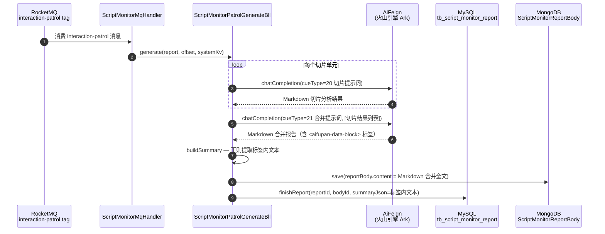
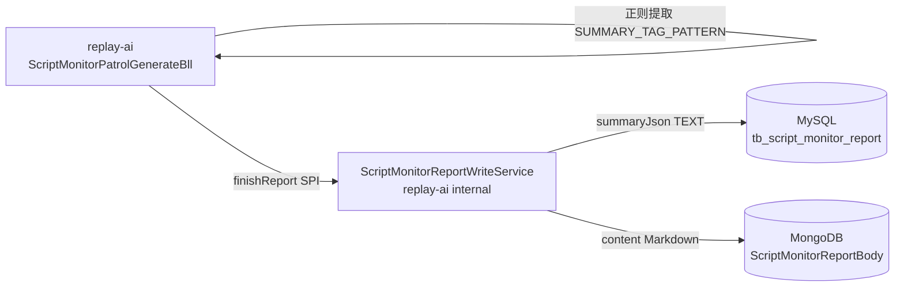

spec_mode: STANDARD
risk: HIGH
frontend-facing: true
module: replay-ai
triggers: [api, data, business-arch, tech-arch, adr]

---

# OpenSpec — 互动巡检合并报告格式 JSON → Markdown 改造

> Explorer hand-off: `.claude/runs/Change__2026-06-07_19-01-01/explore_report.md`

---

## 1. Context

- **Business goal:** 互动巡检（monitorType=2）合并报告输出格式从 JSON 改为 Markdown + `<aifupan-data-block>` 标签，与话术质检（monitorType=0，PATCH #13）的范式统一，降低 AI 提示词维护成本，提高 AI 输出稳定性。
- **Scope of change:**
  - `replay-ai/src/main/java/com/jiuyu/replay/ai/bll/ScriptMonitorPatrolGenerateBll.java`（buildSummary JSON→正则）
  - `replay-ai/src/main/java/com/jiuyu/replay/ai/vo/InteractionPatrolReportDetailVo.java`（Javadoc 语义更新）
  - `replay-ai/src/test/java/com/jiuyu/replay/ai/bll/ScriptMonitorPatrolGenerateBllTest.java`（mock AI 返 Markdown + 边界用例）
  - `docs/2.6.01/REQ-2026-0508-互动巡检/互动巡检分析结果合并提示词.md`（输出格式约定从 JSON 改为 Markdown）
  - `sql/replay-31.sql`（cueType=21 INSERT 内容改 Markdown 格式提示词）
  - `sql/replay-32.sql`（新建 — UPDATE 覆盖现网已执行行）
  - `.claude/llm_wiki/wiki/frontend-api/script_monitor.md`（前端契约同步）
- **Dependencies consulted:** `wiki/frontend-api/script_monitor.md`、`archive/index.md`（PATCH #13 / T31-T36）；源文件 `ScriptMonitorPatrolGenerateBll.java` line 658-672、`ScriptMonitorGenerateBll.java` line 113-135 / 597-611、`InteractionPatrolReportDetailVo.java`、`sql/replay-31.sql`。
- **Explorer hand-off:** Spec Inference + 9 ACs + Hidden Scope + Adversarial Round A 均在 `explore_report.md`；以下节不重复展开。

---

## 2. Domain Model

Not applicable — 本次改造不引入新业务术语或状态机变更；`cueType=21` 提示词定义不变，仅输出格式由 JSON 改为 Markdown。

---

## 2.5 Business Architecture

### 2.5.1 Business Flow



### 2.5.2 Business Boundary

- **In scope（replay-ai 模块独立完成）：** 合并提示词下发格式变更；`buildSummary` 提取逻辑重写；VO Javadoc 更新；前端契约文档同步。
- **Out of scope（其他模块不受影响）：** `ScriptMonitorBll.patrolReportDetail`（直接透传 `entity.summaryJson` 和 MongoDB body，格式变化透明）；切片提示词（cueType=20，已是 Markdown 格式，不动）；monitorType=0 质检（PATCH #13 已完成）；monitorType=1 还原度（未上线，不动）。
- **Boundary contract:** `ScriptMonitorReportWriteService.finishReport(reportId, bodyId, summaryJson)` 接口签名**不变**；`summaryJson` 参数值由 JSON 子对象字符串改为 Markdown 纯文本片段——调用方 `ScriptMonitorPatrolGenerateBll` 通过 `buildSummary` 写入，`ScriptMonitorBll.buildSummaryJson()` 直接读取，均无 parse 逻辑，变化对调用链透明。

### 2.5.3 Upstream / Downstream

| Direction | System / Module | Touchpoint | What flows |
|---|---|---|---|
| Upstream | AI 大模型（火山引擎 Ark）| `AiFeign.chatCompletion` | cueType=21 合并提示词发出；Markdown 报告（含 `<aifupan-data-block>` 标签）返回 |
| Downstream | 前端 | `GET /replay/script-monitor/patrolReportDetail` | `InteractionPatrolReportDetailVo.summaryJson`（Markdown 文本片段）、`reportContent`（Markdown 全文）|
| Downstream | MySQL | `tb_script_monitor_report.summary_json TEXT` | 存 Markdown 纯文本，字段类型不变（TEXT 兼容，无 DDL）|

### 2.5.4 Business Rules

- Rule 1：`buildSummary` 仅写 `summaryJson` 字段，不修改 `reportContent`（MongoDB 存全量 Markdown 原文，已由 `finishReport` 写入，两者分离）。
- Rule 2：AI 无标签输出时，`summaryJson = null`，记 log.warn，主流程不阻断。
- Rule 3：sql 必须先于代码上线执行（replay-32.sql UPDATE 覆盖现网旧 JSON 格式提示词），否则新代码上线窗口期内所有巡检 summaryJson 全部为 null（无告警静默故障）。

---

## 3. API Contract (Handoff)

本次无新增 Controller 端点；`GET /replay/script-monitor/patrolReportDetail` 端点不变，但**响应字段语义破坏性变化**：

| 字段 | 变更前 | 变更后 | 影响 |
|---|---|---|---|
| `data.summary`（前端契约层字段名，对应 `summaryJson`）| JSON 字符串，前端需 `JSON.parse` 后取字段 | Markdown 文本片段，前端直接渲染，无需 `JSON.parse` | **BREAKING** — 前端须同步修改渲染逻辑 |
| `data.reportContent` | 合并报告 JSON 原文（MongoDB）| 合并报告 Markdown 全文（MongoDB）| **BREAKING** — 前端须同步修改渲染方式 |

> `patrolReportDetail` 接口目前标注"TBD，B5 实现时补充"，前端尚无解析 `summaryJson` 的上线代码，但前端契约文档须同步更新，确认 B5 联调时按 Markdown 范式对接。

**响应示例（变更后）：**

```json
{
  "code": 0,
  "msg": "OK",
  "data": {
    "reportId": "4583835358719778816",
    "status": 2,
    "summary": "整体有效回复率为 **98.9%**。本次共统计用户需回复弹幕 90 条，有效 89 条，无效 1 条。",
    "reportContent": "## 互动巡检合并报告\n\n| 弹幕时间 | 用户昵称 | ... |\n|---|---|---|\n\n<aifupan-data-block>\n整体有效回复率为 **98.9%**。...\n</aifupan-data-block>",
    "effectivenessPercentage": 98,
    "details": null
  }
}
```

---

## 4. Data Model

### 4.1 SQL 变更（无 DDL）

`tb_script_monitor_report.summary_json TEXT` 字段类型不变；TEXT 类型存 Markdown 纯文本无障碍，**无 DDL**。

### 4.2 SQL 发版（关键 — 必须先于代码上线执行）

**sql/replay-32.sql（新建 — 覆盖现网已执行的 JSON 格式提示词）**

```sql
-- replay-32.sql
-- 互动巡检 cueType=21 合并提示词更新：JSON 输出 → Markdown + <aifupan-data-block> 标签
-- 现网 replay-31.sql 已执行（WHERE NOT EXISTS 保护已生效），需 UPDATE 覆盖旧行
-- 幂等条件：WHERE ask_type = 21 AND trade_id = 1 AND is_deleted = 0
UPDATE tb_cue_words
SET problem = '<新 Markdown 格式合并提示词内容（Implement 阶段填入）>',
    update_date = NOW()
WHERE ask_type = 21
  AND trade_id = 1
  AND is_deleted = 0;
```

**sql/replay-31.sql（同步修改 cueType=21 INSERT 内容）**

已有的 INSERT 语句中，cueType=21 的 `problem` 字段值需同步改为 Markdown 格式提示词，确保新环境初始化正确。

### 4.3 发版顺序约定（硬约束）

```
replay-32.sql UPDATE → 代码部署 → （可选验证）SELECT summary_json 无 JSON 格式旧提示词
```

> 违反顺序（先部署代码再执行 sql）会导致新代码上线后、UPDATE 执行前的窗口期内所有巡检 `summaryJson = null`，只有 log.warn，无显式告警。

---

## 5. Business Logic

### 5.1 Happy path（step-by-step）

**A. 合并提示词生成侧（`ScriptMonitorPatrolGenerateBll`）**

1. 切片 AI 多轮完成后，调用 `chatCompletion(cueType=21 合并提示词, 切片结果列表)` — AI 返回 Markdown 全文，含 `<aifupan-data-block>...</aifupan-data-block>` 标签包裹摘要段。
2. 调用 `buildSummary(report, mergedAiContent)` — 用 `SUMMARY_TAG_PATTERN` 正则提取标签内文本，`.trim()` 后写入 `report.setSummaryJson(text)`。
3. 调用 `finishReport(reportId, bodyId, summaryJson)`：MongoDB 存 Markdown 全文（`reportContent`）；MySQL 存标签内文本（`summaryJson`）。

**B. `buildSummary` 方法实现（mirror 质检 Bll line 597-611）**

```
if mergedAiContent == null:
    log.warn("[互动巡检] 合并报告内容为 null reportId={}", report.getId())
    report.setSummaryJson(null)
    return

matcher = SUMMARY_TAG_PATTERN.matcher(mergedAiContent)
if matcher.find():
    report.setSummaryJson(matcher.group(1).trim())
    return

log.warn("[互动巡检] 合并报告 Markdown 无 <aifupan-data-block> 标签 reportId={}, content 前 200 字={}")
report.setSummaryJson(null)
```

**C. `SUMMARY_TAG_PATTERN` 常量（mirror 质检 Bll line 132-134）**

```java
private static final Pattern SUMMARY_TAG_PATTERN = Pattern.compile(
        "<aifupan-data-block[^>]*>(.*?)</aifupan-data-block>",
        Pattern.CASE_INSENSITIVE | Pattern.DOTALL);
```

**D. import 变更**

- 删：`cn.hutool.core.util.ObjectUtil`、`com.alibaba.fastjson2.JSON`、`com.alibaba.fastjson2.JSONObject`（仅 buildSummary 用，删后确认无其他引用）
- 加：`java.util.regex.Matcher`、`java.util.regex.Pattern`（如类中已存在则不重复加）

### 5.2 Branches & exceptions

| 分支 | 触发条件 | 处理 | 后果 |
|---|---|---|---|
| null 内容 | `mergedAiContent == null` | log.warn + setSummaryJson(null) + 正常返回 | summaryJson 为 null，不抛异常 |
| 无标签 | Markdown 无 `<aifupan-data-block>` | log.warn + setSummaryJson(null) + 正常返回 | summaryJson 为 null，不抛异常 |
| 空标签 | `<aifupan-data-block></aifupan-data-block>` | `matcher.group(1).trim()` = `""` → setSummaryJson("") | summaryJson = ""（空字符串），与质检 PATCH #13 范式完全一致，不 fallback null |
| 大小写标签 | `<AIFUPAN-DATA-BLOCK>` | CASE_INSENSITIVE flag 覆盖 | 正常提取，与小写行为相同 |
| 跨行内容 | 标签内含 `\n` | DOTALL flag 覆盖 `.` 匹配换行 | 正常提取，trim() 去首尾空白 |
| 多标签 | Markdown 含 ≥2 个标签 | `.*?` 非贪婪首匹配，`matcher.find()` 取第一个 | 仅取首个标签内容 |

### 5.3 Idempotency / replay safety

- `buildSummary` 纯内存操作，幂等（多次调用结果一致）。
- sql UPDATE 幂等：`WHERE ask_type=21 AND trade_id=1 AND is_deleted=0`，重复执行无副作用。

### 5.4 空标签语义决策（OQ-3 闭环）

**决策：空标签 → 返回 `""`（空字符串），不 fallback null + log.warn。**

理由：完全 mirror 质检 PATCH #13 范式（`matcher.group(1).trim()` 在空内容下自然返回 `""`）。与质检统一是本次改造的首要目标；若空标签判断为"数据问题"则两者范式分裂，增加维护成本。如产品未来确认空摘要属于错误场景，届时统一改两处，单一变更点更易维护。

---

## 5.5 Technical Architecture

### 5.5.1 Module Topology



> 本次改造全部在 `replay-ai` 模块内，无跨模块 Feign 调用变更。

### 5.5.2 Cross-Module Communication

Not applicable — 本次不新增跨模块调用；`AiFeign`、`CueWordsFeign`、`ScriptMonitorReportWriteService` 接口签名均不变。

### 5.5.3 Async Tasks

`ScriptMonitorMqHandler` 消费 `interaction-patrol` tag 路由不变；触发 `ScriptMonitorPatrolGenerateBll.generate`，内部 `buildSummary` 调用是同步操作，无新增异步任务。

### 5.5.4 Cache Strategy

Not applicable — `buildSummary` 不涉及 Redis 缓存。

### 5.5.5 Transaction Boundary

`ScriptMonitorReportWriteService.finishReport` 已声明 `@Transactional(rollbackFor = Exception.class)`；本次 `buildSummary` 修改发生在 `finishReport` 调用**之前**（只是设置 entity 字段，无 DB 操作），事务边界不变。

### 5.5.6 Observability

- Log keys：`reportId`（log.warn 中已含）
- 无标签/null 均有 `log.warn` 记录，content 前 200 字辅助排查 AI 输出格式问题
- 新增 metric/alert：None（与质检 PATCH #13 对齐，依赖 log.warn + 现有 APM）

---

## 6. Non-Functional Constraints (Hard Constraints)

- **构造器注入：** `ScriptMonitorPatrolGenerateBll` 已有构造器注入，不引入 `@Autowired` / `@Resource`。
- **禁 `@TableLogic`：** 不涉及软删除逻辑变更，沿用现有 `is_deleted` 手动设置。
- **禁跨模块 Dao 直连：** 本次无新跨模块调用。
- **租户隔离：** sql UPDATE 含 `is_deleted = 0` 过滤；提示词行以 `trade_id=1`（通用行业）识别，`tenant_id=0`（全平台），无租户隔离需求（提示词为平台级全局数据）。
- **SQL 发版顺序（硬）：** replay-32.sql UPDATE 必须先于代码部署执行。否则新代码上线后正则提取无标签，`summaryJson` 全 null，无明显告警。
- **删旧 import 前确认：** 删除 `fastjson2.JSON/JSONObject` + `hutool.ObjectUtil` 前，grep 确认这三个 class 在 `ScriptMonitorPatrolGenerateBll.java` 中无其他引用；若有则保留。
- **不改 monitorType=0 / monitorType=1 代码：** 外科手术原则，仅改 monitorType=2 路径。
- **`InteractionPatrolReportDetailVo` 字段名保留：** `summaryJson` 字段名不改（历史命名，零迁移成本），仅改 Javadoc。
- **测试：** 单测 mock AI 返回改 Markdown，删旧 JSON mock 工厂，新增 `<aifupan-data-block>` 有/无/跨行/大小写/空标签边界用例，全测 PASS 后才闭环。

---

## 6.5 Design Patterns

| Pattern | Where applied | Why chosen | Alternative rejected | Why rejected |
|---|---|---|---|---|
| Regex Extraction（正则标签提取）| `ScriptMonitorPatrolGenerateBll.buildSummary` | 与质检 Bll SUMMARY_TAG_PATTERN 完全 mirror，统一维护入口；DOTALL+CASE_INSENSITIVE 覆盖 AI 输出漂移 | JSON.parse 路径（现状） | AI 输出 Markdown 时 JSON.parse 必然抛异常；JSON 指令遵循率低于 Markdown |
| Static Pattern constant | 类级 `SUMMARY_TAG_PATTERN` 常量 | Pattern 编译开销一次性；与质检 Bll 范式统一 | 每次 `buildSummary` 调用时 compile | 重复编译性能浪费 |

---

## 7. Acceptance Criteria (Testing)

从 `explore_report.md` 原文复制，不重新推导：

- **AC-001（happy path — buildSummary 正则提取成功）：**
  Given AI 合并报告返回 Markdown 全文，其中包含 `<aifupan-data-block>` 标签（标签内含摘要文本），
  when `ScriptMonitorPatrolGenerateBll.buildSummary` 被调用，
  then `entity.getSummaryJson()` 等于标签内文本 `.trim()` 后的字符串，且不抛异常，不写 null。

- **AC-002（edge — 无标签 → null + log.warn）：**
  Given AI 合并报告返回合法 Markdown 但**无** `<aifupan-data-block>` 标签，
  when `buildSummary` 被调用，
  then `entity.getSummaryJson()` 为 null，且 log.warn 含 `reportId` 和 content 前 200 字，不抛异常。

- **AC-003（edge — mergedAiContent 为 null → null + log.warn）：**
  Given `mergedAiContent` 参数为 null，
  when `buildSummary` 被调用，
  then `entity.getSummaryJson()` 为 null，且 log.warn 被触发，方法正常返回（不抛 NPE）。

- **AC-004（edge — 大小写不敏感）：**
  Given AI 报告含 `<AIFUPAN-DATA-BLOCK>content</AIFUPAN-DATA-BLOCK>`（全大写标签），
  when `buildSummary` 被调用，
  then `entity.getSummaryJson()` 等于 `"content"`，提取成功。

- **AC-005（edge — 跨行内容）：**
  Given `<aifupan-data-block>` 标签内文本跨多行（含 `\n`），
  when `buildSummary` 被调用，
  then `entity.getSummaryJson()` 等于跨行文本 `.trim()` 后结果（不截断换行）。

- **AC-006（edge — 多标签取首个）：**
  Given Markdown 中存在两个 `<aifupan-data-block>` 标签，
  when `buildSummary` 被调用，
  then `entity.getSummaryJson()` 仅包含**第一个**标签的内容（非贪婪首匹配）。

- **AC-007（edge — 空标签 → 空字符串，不抛异常）：**
  Given `<aifupan-data-block></aifupan-data-block>`（标签内无内容），
  when `buildSummary` 被调用，
  then `entity.getSummaryJson()` 为空字符串 `""`（`.trim()` 后为 `""`），不抛异常。
  > 空标签不 fallback null — 与质检 PATCH #13 范式一致（见 §5.4 决策）。

- **AC-008（edge — 合并提示词种子 sql 幂等更新）：**
  Given `sql/replay-31.sql` cueType=21 的 INSERT 语句已在现网执行（JSON 格式提示词），
  when 执行 `sql/replay-32.sql`（UPDATE），
  then `tb_cue_words` 中 `ask_type=21 AND trade_id=1` 行的 `problem` 字段更新为 Markdown 格式提示词，重复执行无副作用。

- **AC-009（edge — 单测 mock AI 返 Markdown → finishReport 收到非 JSON）：**
  Given mock AI `chatCompletion` 返回 Markdown 字符串（含 `<aifupan-data-block>摘要文本</aifupan-data-block>`），
  when `bll.generate(...)` 调用，
  then `reportWriteService.finishReport` 被调用时第三个参数（summaryJson）等于 `"摘要文本"`（而非 JSON 字符串）。

**单测要求（Unit test requirements）：**

| AC-id | Method under test | Assertion |
|---|---|---|
| AC-001 | `buildSummary` | `entity.getSummaryJson()` = 标签内 trim 文本 |
| AC-002 | `buildSummary` | `entity.getSummaryJson()` = null；log.warn 含 reportId + 200 字 |
| AC-003 | `buildSummary` | `entity.getSummaryJson()` = null；log.warn 触发；不抛 NPE |
| AC-004 | `buildSummary` | 全大写标签正常提取 `"content"` |
| AC-005 | `buildSummary` | 跨行内容 trim 后完整保留 |
| AC-006 | `buildSummary` | 双标签仅取首个 |
| AC-007 | `buildSummary` | 空标签返 `""` |
| AC-008 | SQL 执行验证 | `problem` 字段更新，重复执行无副作用 |
| AC-009 | `generate(...)` | `finishReport` 第 3 参数 = "摘要文本" |

---

## 8. Frontend Contract Publishing

- `frontend-facing: true`
- `module: replay-ai`

**变更范围（script_monitor.md 需更新的位置）：**

1. **monitorType=2 巡检 `summary` 字段说明（约 line 181-201）：**
   - 删除"前端 `JSON.parse(summary)` 后取字段"说明
   - 改为"Markdown 文本，直接渲染（`<aifupan-data-block>` 标签内容）"
   - 删 `2 巡检 | summary | string | 互动巡检摘要文本` 行（或改语义说明）
   - 删除 `const summary = monitor.summary ? JSON.parse(monitor.summary) : null;` 示例代码（或标注仅 monitorType=0/1 适用）

2. **`patrolReportDetail` 接口响应字段（约 line 822-823）：**
   - `summary` 字段说明：由"巡检摘要文本"改为"Markdown 文本片段（来自 AI `<aifupan-data-block>` 标签内容）；直接渲染，无需 JSON.parse；null = 未生成或 AI 无标签输出"
   - `reportContent` 字段说明：由"报告正文（结构 TBD，B5 实现时补充）"改为"Markdown 全文（来自 MongoDB，含 `<aifupan-data-block>` 标签的完整合并报告）；直接渲染"

3. **前端通知计划：**
   - 前端 owner 须知：`patrolReportDetail` 接口 `summary` + `reportContent` 字段格式已变，B5 联调时按 Markdown 范式对接。
   - 当前前端无上线的 JSON.parse 解析代码（接口标注 TBD，B5 实现），此次改造**破坏前端文档契约**但不破坏线上运行代码。
   - 若 B5 联调期间前端已按旧 JSON 契约开发，需同步通知前端重构渲染逻辑。

> **Phase 4 前（Implement 开始前）须通知前端 owner**，确认 B5 实现时按 Markdown 范式对接。

---

## 9. Architecture Decision Records

### ADR-1：合并报告输出格式选型 — Pure Markdown vs 双层（外 Markdown + 内 JSON）

**Status:** proposed
**Date:** 2026-06-07
**Deciders:** 产品（P3 决策已确认）、后端架构

#### Context

互动巡检合并提示词（cueType=21）当前约定 AI 返回纯 JSON（`{"items":[...],"summary":{...}}`）。前端通过 `JSON.parse(summaryJson)` 取字段渲染。话术质检（cueType 对应 `ScriptMonitorGenerateBll`）已在 PATCH #13 改为 Markdown + `<aifupan-data-block>` 标签范式，AI 指令遵循率更高。现在需要决定巡检合并报告是否完全 mirror 质检范式（Pure Markdown），还是保留 JSON 但外包标签（双层）。

存在的制约：
1. AI 对 Markdown 输出格式遵循率高于 JSON；
2. 质检已是 Markdown 范式，维护两套范式增加成本；
3. `patrolReportDetail` 接口前端尚未上线（B5 TBD），改变契约影响面可控；
4. 巡检合并报告包含弹幕明细大表格（N 行 8 列），AI 需在 Markdown 表格基础上额外包 `<aifupan-data-block>` 标签，挑战比质检更大（质检只需包几个数字）。

#### Decision

采用方案 A（Pure Markdown）：合并提示词改为 Markdown 全文输出，摘要段用 `<aifupan-data-block>` 标签包裹；`buildSummary` 用正则提取标签内文本存 `summaryJson`；`reportContent` 存 Markdown 全文。前端契约由"JSON.parse"改为"直接渲染 Markdown"。

#### Alternatives Considered

**Alternative A: Pure Markdown（选定方案）**
- Pros: 与质检 Bll SUMMARY_TAG_PATTERN 完全统一，零额外代码；AI 指令遵循率高（倾向 Markdown）；前端渲染简单（无需 JSON.parse）；维护成本最低。
- Cons: 摘要语义嵌入 `<aifupan-data-block>` 标签内，非结构化字段（effectiveRate 等数字需从 Markdown 文本中人工识读，无直接 JSON 字段）；AI 输出可能把弹幕大表格整个包进标签。
- Failure conditions: AI 不遵循标签格式（概率低，已在质检验证有效）；标签内摘要文本无法机器解析 effectiveRate 等具体数字（当前前端仅需文本渲染，非数字消费）。
- Estimated complexity: S（直接 mirror 质检 Bll，~15 行改动）
- Why chosen: 最简方案；质检已验证可行；前端 B5 尚未上线，契约破坏影响面可控。

**Alternative B: 保留 JSON + 外包 wrapper 标签**
- Pros: 前端数值字段（effectiveRate、totalUnits 等）可 JSON.parse 取；对未来数据分析友好。
- Cons: AI 需同时生成外层 Markdown + 内层 JSON，指令冲突概率大；`buildSummary` 需先正则提取标签，再 JSON.parse 内层，两次解析；与质检范式分裂，维护两套逻辑。
- Failure conditions: AI 输出内层 JSON 格式漂移（字段名变化、格式不一致），`buildSummary` JSON.parse 异常，summaryJson 全 null。
- Estimated complexity: M（需保留 JSON 解析路径）
- Why not chosen: AI 双层指令遵循率低于单一 Markdown；维护两套范式成本高；当前前端无 JSON 数值字段消费需求（B5 仅需文本渲染）。

**Alternative C: 双层（Markdown 全文，标签内仍是 JSON）**
- Pros: 前端和后端均可解析结构化数据；`reportContent` 是 Markdown，阅读友好。
- Cons: AI 需同时生成外层 Markdown 表格 + 内层 JSON，指令最复杂，失败概率最高；`buildSummary` 同样需两次解析；前端 B5 需 JSON.parse 标签内容，渲染逻辑不简单；与 A 相比复杂度高但收益小（当前无数值字段消费需求）。
- Failure conditions: AI 指令最复杂，内层 JSON schema 漂移风险；标签包含大 JSON 时 AI 易截断。
- Estimated complexity: L（双重格式约定 + 双重解析路径）
- Why not chosen: 复杂度最高但收益最低；当前阶段无结构化数值消费需求。

#### Consequences

**Positive**
- `buildSummary` 与质检 Bll 完全一致，代码复用率最高，维护成本最低。
- AI 输出格式指令最简单，遵循率最高。
- 前端渲染逻辑简化（Markdown 直渲，无 JSON.parse）。

**Negative**
- `summaryJson` 字段存的是 Markdown 纯文本，失去结构化字段（effectiveRate、totalBarrages 等）的机器可读性。若未来需要对这些数字做汇总统计，需在 AI 提示词层面重新设计或额外字段。
- AI 需要把弹幕明细大表格和摘要段用同一 Markdown 约定表达，`<aifupan-data-block>` 标签只包摘要——这要求提示词设计清晰区分"大表格区"和"摘要区"，否则 AI 可能把表格也包进标签。

**Risks (and mitigation)**
- Risk: AI 把 N 行弹幕表格整个包进 `<aifupan-data-block>` 标签，导致 `summaryJson` 过长（TEXT 字段虽能存，但前端渲染性能问题）。
  → Mitigation: 提示词明确约定"标签内仅放概要总结文字（3-5 行）；弹幕明细表格在标签外"，Implement 阶段在提示词 md 中严格约定结构示例。
- Risk: AI 输出无标签（指令遵循率低于 100%），导致 `summaryJson = null` 的巡检报告偶发出现。
  → Mitigation: log.warn 已覆盖，可通过 APM 日志监控 warn 频率；如频率高则回炉优化提示词。

#### Archive target
`.claude/llm_wiki/wiki/architecture/adrs/NNNN-patrol-summary-markdown.md`（NNNN 由 `@architecture-curator` 在 Archive 阶段分配）

---

### ADR-2：现网提示词更新 sql 策略 — UPDATE(replay-32.sql) vs 仅改 INSERT(replay-31.sql)

**Status:** proposed
**Date:** 2026-06-07
**Deciders:** 后端架构

#### Context

`sql/replay-31.sql` 已在生产环境执行，cueType=21 的 INSERT 带 `WHERE NOT EXISTS` 幂等保护。现网 `tb_cue_words` 中 `ask_type=21 AND trade_id=1` 行存储的是旧 JSON 格式提示词。若仅修改 `replay-31.sql` 的 INSERT 内容，已执行过的生产环境因 `WHERE NOT EXISTS` 保护跳过 INSERT，旧行不会更新。新代码部署后，AI 仍接收 JSON 格式提示词，用正则提取无标签，`summaryJson` 全为 null，产生**静默数据故障**（只有 log.warn，无显式报警）。

#### Decision

新建 `sql/replay-32.sql`，使用 `UPDATE` 语句覆盖现网已执行行；同时修改 `replay-31.sql` 的 cueType=21 INSERT 内容为 Markdown 格式，保证新环境初始化正确。发版顺序：replay-32.sql 先于代码部署执行。

#### Alternatives Considered

**Alternative A: 新建 replay-32.sql（UPDATE 覆盖现网行）+ 同步改 replay-31.sql INSERT（选定方案）**
- Pros: 现网已执行环境可靠更新；新环境初始化正确；UPDATE 幂等（WHERE 条件限定，重复执行无副作用）；发版顺序清晰可操作。
- Cons: 需维护两个 sql 文件；执行顺序依赖人工保证（replay-32.sql 先于代码）。
- Failure conditions: DBA 未按顺序执行（代码先于 sql），窗口期内 summaryJson 全 null；UPDATE WHERE 条件漏掉 `is_deleted=0`，误更新已软删除行（风险低，但需检查）。
- Estimated complexity: S（1 条 UPDATE sql + 1 处 INSERT 文本修改）
- Why chosen: 唯一可靠覆盖现网已执行行的方案；UPDATE 语义清晰；发版顺序可在 Release Notes 明文约定。

**Alternative B: 仅修改 replay-31.sql INSERT 内容**
- Pros: 操作简单，只改一个文件。
- Cons: 现网已执行环境因 `WHERE NOT EXISTS` 保护，INSERT 跳过，旧 JSON 格式提示词永远不更新；新代码上线后 summaryJson 全 null，静默故障，难以发现。
- Failure conditions: 100% 必然发生 — 所有已执行过 replay-31.sql 的环境（生产、预生产）均不受影响，旧行保留。
- Estimated complexity: XS（仅改文本）
- Why not chosen: 必然产生静默数据故障，不可接受。

**Alternative C: replay-32.sql 做 DELETE + INSERT（替换行）**
- Pros: 语义上比 UPDATE 更彻底（重建行，含 id 和 create_date）。
- Cons: 删 INSERT 非幂等（DELETE 后再 INSERT 的 id 可能不同；Snowflake id 已被历史引用时有外键风险）；`WHERE NOT EXISTS` 的 INSERT 和 DELETE 组合如执行顺序出错会造成数据空窗。
- Failure conditions: DELETE 成功但 INSERT 失败 → cueType=21 行消失，AI 调用因 cueWord 为 null 导致任务失败（影响所有 tenant）。
- Estimated complexity: S（与 A 相当但语义风险高）
- Why not chosen: 原子性更差（DELETE + INSERT 非单语句事务）；`tb_cue_words` id 被其他表引用的风险未排查；UPDATE 语义更安全。

#### Consequences

**Positive**
- 现网已执行环境可靠更新，消除静默数据故障窗口。
- UPDATE 幂等，DBA 重复执行无副作用。
- 新建文件 `replay-32.sql` 命名延续项目约定，便于追踪。

**Negative**
- 需要两个 sql 文件共同维护同一条 cueType=21 行（replay-31.sql 管新环境 INSERT，replay-32.sql 管现网 UPDATE），维护时需注意两者一致性。
- 若未来再次修改 cueType=21 提示词，需同时更新 INSERT 内容和新增 UPDATE sql。

**Risks (and mitigation)**
- Risk: 发版时 replay-32.sql 未先于代码执行，新代码上线后窗口期内 summaryJson 全 null。
  → Mitigation: Release Notes 明文约定"执行 replay-32.sql → 验证 SELECT → 部署代码"发版顺序；Implement 阶段在 replay-32.sql 文件头注释写"**必须在代码部署前执行**"。
- Risk: UPDATE 覆盖了 `tenant_id=0` 以外的租户私有 cueType=21 行。
  → Mitigation: UPDATE WHERE 条件含 `trade_id=1 AND is_deleted=0`；若生产存在租户私有 cueType=21 行（`tenant_id != 0`），不在 WHERE 命中范围，不受影响。需 Implement 阶段确认 WHERE 条件是否含 `tenant_id=0`。

#### Archive target
`.claude/llm_wiki/wiki/architecture/adrs/NNNN-patrol-summary-sql-update-strategy.md`（NNNN 由 `@architecture-curator` 在 Archive 阶段分配）

---

## Allowed Scope

```
replay-ai/src/main/java/com/jiuyu/replay/ai/bll/ScriptMonitorPatrolGenerateBll.java
replay-ai/src/main/java/com/jiuyu/replay/ai/vo/InteractionPatrolReportDetailVo.java
replay-ai/src/test/java/com/jiuyu/replay/ai/bll/ScriptMonitorPatrolGenerateBllTest.java
docs/2.6.01/REQ-2026-0508-互动巡检/互动巡检分析结果合并提示词.md
sql/replay-31.sql
sql/replay-32.sql
.claude/llm_wiki/wiki/frontend-api/script_monitor.md
```

> `docs/2.6.01/apifox-import-script-monitor.yaml` 根据 OQ-4 回答（apifox 改动在 stash 中，避免双重）**不在本批次 scope**。

---

## 做什么 / 为什么

**现状：** 互动巡检（monitorType=2）合并 AI 报告要求 AI 以纯 JSON 结构输出（`{"items":[...],"summary":{...}}`），后端用 `JSON.parseObject` 取 `summary` 子对象后存入 MySQL `summary_json` 字段，前端通过 `JSON.parse` 渲染。话术质检（monitorType=0）已在 PATCH #13 改为 Markdown + `<aifupan-data-block>` 标签范式，两者格式不统一，维护成本高。

**需要：** 巡检合并提示词改为 Markdown 输出，摘要数据行用 `<aifupan-data-block>` 标签包裹；`buildSummary` 改为正则提取，mirror 质检 Bll 范式；前端契约 `summary`/`reportContent` 字段语义从"JSON 字符串"改为"Markdown 文本，直接渲染"；sql/replay-32.sql UPDATE 覆盖现网已执行的旧 JSON 格式提示词。

**范围：** 7 个文件（1 Bll Java + 1 VO Java + 1 Test Java + 1 PRD md + 2 sql + 1 前端契约 md），全部在 `replay-ai` 模块内（前端契约文档在 wiki）。

## 怎么做

见 §9 ADR-1（格式选型 A vs B vs C）和 ADR-2（sql 策略 UPDATE vs 仅改 INSERT vs DELETE+INSERT）。

选定：
- **ADR-1 选 A**（Pure Markdown）：直接 mirror 质检 `SUMMARY_TAG_PATTERN`，约 15 行改动，零额外解析路径。
- **ADR-2 选 A**（新建 replay-32.sql UPDATE）：唯一可靠覆盖现网行的方案，消除静默数据故障。

关键发版约束：`replay-32.sql UPDATE` 必须先于代码部署执行。

## 需要你确认的

- [ ] **ADR-1（格式）已确认 A（Pure Markdown）**：AI 提示词设计中，`<aifupan-data-block>` 标签仅包摘要总结段（3-5 行），不包弹幕明细表格。Implement 阶段在合并提示词 md 中严格标注此约定，你是否认可？
- [ ] **ADR-2（sql）已确认**：新建 `sql/replay-32.sql` 做 UPDATE，同时改 `replay-31.sql` cueType=21 INSERT 内容；你或 DBA 在部署代码前先执行 replay-32.sql。
- [ ] **空标签语义**：`<aifupan-data-block></aifupan-data-block>` 返回 `""` 空字符串（与质检一致），不 fallback null — 确认接受？
- [ ] **前端通知**：前端 owner 需在 B5 联调前收到通知，确认 `patrolReportDetail` 接口 `summary` + `reportContent` 字段已改为 Markdown 格式。你是否需要我起草一份通知文案？
